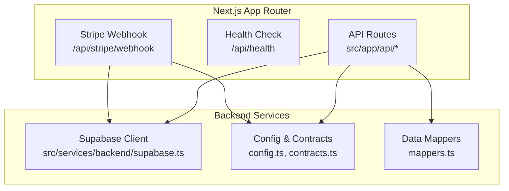
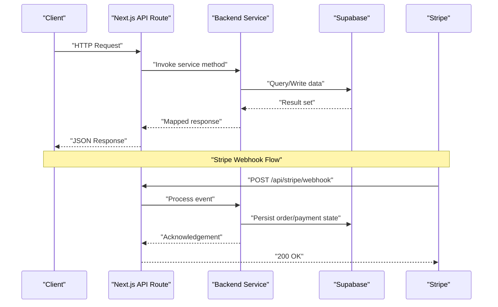
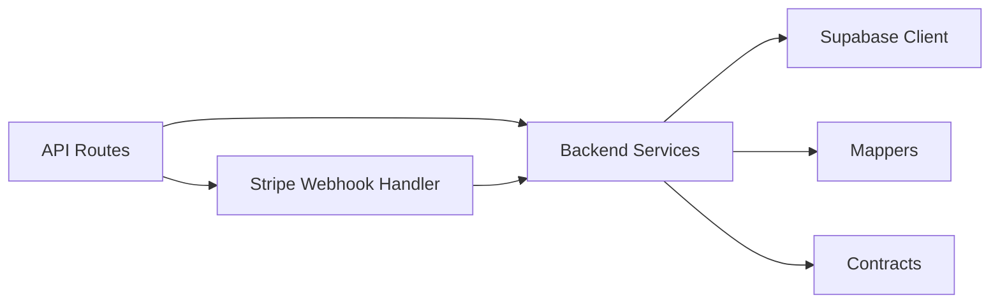

# API Reference

<cite>
**Referenced Files in This Document**
- [health route](file://src/app/api/health/route.ts)
- [stripe webhook](file://src/app/api/stripe/webhook/route.ts)
- [backend service index](file://src/services/backend/index.ts)
- [supabase client](file://src/services/backend/supabase.ts)
- [configuration](file://src/services/backend/config.ts)
- [contracts](file://src/services/backend/contracts.ts)
- [mappers](file://src/services/backend/mappers.ts)
- [auth templates](file://src/services/backend/auth-templates.test.ts)
- [realtime tests](file://src/services/backend/realtime.test.ts)
</cite>

## Table of Contents
1. [Introduction](#introduction)
2. [Project Structure](#project-structure)
3. [Core Components](#core-components)
4. [Architecture Overview](#architecture-overview)
5. [Detailed Component Analysis](#detailed-component-analysis)
6. [Dependency Analysis](#dependency-analysis)
7. [Performance Considerations](#performance-considerations)
8. [Troubleshooting Guide](#troubleshooting-guide)
9. [Conclusion](#conclusion)
10. [Appendices](#appendices)

## Introduction
This document provides a comprehensive API reference for Mooday, covering RESTful endpoints, internal services, authentication mechanisms, real-time features, error handling, and integration patterns. It is intended for developers integrating with Mooday’s backend APIs and for contributors extending its functionality.

## Project Structure
Mooday uses a Next.js App Router with server-side API routes under src/app/api. Backend services are implemented in src/services/backend, including Supabase client configuration, data mappers, and contracts. Real-time capabilities and Stripe webhooks are integrated via dedicated modules.

**Diagram sources**
- [health route:1-200](file://src/app/api/health/route.ts#L1-L200)
- [stripe webhook:1-200](file://src/app/api/stripe/webhook/route.ts#L1-L200)
- [supabase client:1-200](file://src/services/backend/supabase.ts#L1-L200)
- [configuration:1-200](file://src/services/backend/config.ts#L1-L200)
- [contracts:1-200](file://src/services/backend/contracts.ts#L1-L200)
- [mappers:1-200](file://src/services/backend/mappers.ts#L1-L200)

**Section sources**
- [health route:1-200](file://src/app/api/health/route.ts#L1-L200)
- [stripe webhook:1-200](file://src/app/api/stripe/webhook/route.ts#L1-L200)
- [supabase client:1-200](file://src/services/backend/supabase.ts#L1-L200)
- [configuration:1-200](file://src/services/backend/config.ts#L1-L200)
- [contracts:1-200](file://src/services/backend/contracts.ts#L1-L200)
- [mappers:1-200](file://src/services/backend/mappers.ts#L1-L200)

## Core Components
- Health endpoint for readiness/liveness checks.
- Stripe webhook handler for payment events.
- Supabase client initialization and typed queries.
- Data transformation layer (mappers) between DB models and API payloads.
- Configuration management for environment-specific settings.
- Contract definitions for request/response schemas used across services.

**Section sources**
- [health route:1-200](file://src/app/api/health/route.ts#L1-L200)
- [stripe webhook:1-200](file://src/app/api/stripe/webhook/route.ts#L1-L200)
- [supabase client:1-200](file://src/services/backend/supabase.ts#L1-L200)
- [configuration:1-200](file://src/services/backend/config.ts#L1-L200)
- [contracts:1-200](file://src/services/backend/contracts.ts#L1-L200)
- [mappers:1-200](file://src/services/backend/mappers.ts#L1-L200)

## Architecture Overview
The system exposes minimal public HTTP endpoints while delegating most business logic to backend services that interact with Supabase. Authentication is managed via Supabase Auth, and real-time updates are handled through Supabase subscriptions where applicable. Payment processing integrates with Stripe via webhooks.

**Diagram sources**
- [health route:1-200](file://src/app/api/health/route.ts#L1-L200)
- [stripe webhook:1-200](file://src/app/api/stripe/webhook/route.ts#L1-L200)
- [supabase client:1-200](file://src/services/backend/supabase.ts#L1-L200)
- [mappers:1-200](file://src/services/backend/mappers.ts#L1-L200)

## Detailed Component Analysis

### Health Endpoint
- Purpose: Liveness/readiness probe for deployment health checks.
- Method: GET
- Path: /api/health
- Authentication: None
- Success Response: JSON object indicating status
- Error Responses: Standard HTTP error codes if service is unhealthy

Example usage:
- Use in container orchestration health checks.
- Monitor uptime dashboards.

**Section sources**
- [health route:1-200](file://src/app/api/health/route.ts#L1-L200)

### Stripe Webhook Endpoint
- Purpose: Ingests Stripe events to synchronize orders, payments, and refunds.
- Method: POST
- Path: /api/stripe/webhook
- Authentication: Stripe signature verification
- Request Body: Stripe event payload
- Success Response: 200 OK upon successful processing
- Error Responses: Non-2xx indicates failure; Stripe will retry

Integration notes:
- Verify webhook signatures using Stripe SDK.
- Idempotently handle events to avoid duplicate processing.
- Map Stripe entities to internal models using mappers.

**Section sources**
- [stripe webhook:1-200](file://src/app/api/stripe/webhook/route.ts#L1-L200)
- [mappers:1-200](file://src/services/backend/mappers.ts#L1-L200)

### Supabase Client and Configuration
- Purpose: Centralized database client setup and typed queries.
- Key responsibilities:
  - Initialize Supabase client with environment variables.
  - Provide typed query helpers for common operations.
  - Manage RLS context and service role access where appropriate.

Usage patterns:
- Import client in API routes and server functions.
- Use typed queries to ensure schema safety.
- Apply row-level security policies at the database level.

**Section sources**
- [supabase client:1-200](file://src/services/backend/supabase.ts#L1-L200)
- [configuration:1-200](file://src/services/backend/config.ts#L1-L200)

### Data Mappers
- Purpose: Transform raw database records into domain objects consumed by API routes and frontend services.
- Responsibilities:
  - Normalize fields and types.
  - Enforce consistent response shapes.
  - Handle optional fields and defaults.

Best practices:
- Keep mappings close to their source tables.
- Validate inputs before mapping.
- Return immutable structures where possible.

**Section sources**
- [mappers:1-200](file://src/services/backend/mappers.ts#L1-L200)

### Contracts and Types
- Purpose: Define shared request/response schemas and internal types.
- Benefits:
  - Ensures consistency across services.
  - Facilitates testing and mocking.
  - Improves developer experience with autocomplete and validation.

Guidelines:
- Version contract changes explicitly.
- Deprecate fields gradually with migration plans.

**Section sources**
- [contracts:1-200](file://src/services/backend/contracts.ts#L1-L200)

### Realtime Capabilities
- Purpose: Enable real-time features such as chat and notifications via Supabase subscriptions.
- Implementation:
  - Subscribe to channels for users or rooms.
  - Listen for insert/update/delete events.
  - Broadcast messages to relevant clients.

Testing:
- Use realtime test utilities to simulate events and verify handlers.

**Section sources**
- [realtime tests:1-200](file://src/services/backend/realtime.test.ts#L1-L200)

### Authentication Templates
- Purpose: Email templates for confirmation and recovery flows.
- Usage:
  - Rendered by Supabase Auth email providers.
  - Customizable per environment.

Security considerations:
- Avoid sensitive data in emails.
- Use signed links for secure actions.

**Section sources**
- [auth templates:1-200](file://src/services/backend/auth-templates.test.ts#L1-L200)

## Dependency Analysis
The API layer depends on backend services which encapsulate Supabase interactions and data transformations. Contracts define shared interfaces ensuring loose coupling. Tests validate behavior and edge cases.

**Diagram sources**
- [supabase client:1-200](file://src/services/backend/supabase.ts#L1-L200)
- [mappers:1-200](file://src/services/backend/mappers.ts#L1-L200)
- [contracts:1-200](file://src/services/backend/contracts.ts#L1-L200)
- [stripe webhook:1-200](file://src/app/api/stripe/webhook/route.ts#L1-L200)

**Section sources**
- [supabase client:1-200](file://src/services/backend/supabase.ts#L1-L200)
- [mappers:1-200](file://src/services/backend/mappers.ts#L1-L200)
- [contracts:1-200](file://src/services/backend/contracts.ts#L1-L200)
- [stripe webhook:1-200](file://src/app/api/stripe/webhook/route.ts#L1-L200)

## Performance Considerations
- Prefer server-side data fetching and caching where appropriate.
- Use Supabase pagination and selective field projection to reduce payload sizes.
- Implement idempotent webhook handlers to prevent duplicate work.
- Leverage connection pooling and minimize round-trips to the database.
- Monitor query performance and add indexes as needed.

[No sources needed since this section provides general guidance]

## Troubleshooting Guide
Common issues and resolutions:
- Webhook signature verification failures: Ensure correct secret and timestamp handling.
- Database permission errors: Verify RLS policies and service role usage.
- Mapping errors: Validate input schemas and handle null/undefined fields.
- Realtime subscription drops: Reconnect on disconnect events and implement exponential backoff.

Error response conventions:
- Use standard HTTP status codes.
- Include structured error objects with message, code, and details.
- Log contextual information without exposing secrets.

**Section sources**
- [stripe webhook:1-200](file://src/app/api/stripe/webhook/route.ts#L1-L200)
- [supabase client:1-200](file://src/services/backend/supabase.ts#L1-L200)
- [mappers:1-200](file://src/services/backend/mappers.ts#L1-L200)

## Conclusion
Mooday’s API surface is intentionally small and focused, delegating complex logic to well-structured backend services. Supabase provides robust authentication, database, and real-time capabilities, while Stripe handles payments securely. Following the patterns outlined here ensures reliable integrations and maintainable extensions.

[No sources needed since this section summarizes without analyzing specific files]

## Appendices

### Authentication and Authorization
- Methods: Supabase Auth (email/password, OAuth).
- Authorization: Row-level security enforced at the database layer; service roles for privileged operations.
- Security headers: Enforce HTTPS, CORS policies, and content security policies as configured.

[No sources needed since this section provides general guidance]

### Rate Limiting and Versioning
- Rate limiting: Apply at the platform level (e.g., Vercel/Edge) or via middleware.
- Versioning: Prefix API routes with version segments (e.g., /api/v1/...) and deprecate gracefully.

[No sources needed since this section provides general guidance]

### WebSocket Endpoints
- Real-time features use Supabase subscriptions rather than custom WebSocket servers.
- Message formats follow mapped domain models defined in contracts.
- Connection handling includes reconnection strategies and error retries.

**Section sources**
- [realtime tests:1-200](file://src/services/backend/realtime.test.ts#L1-L200)