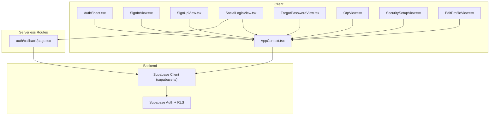
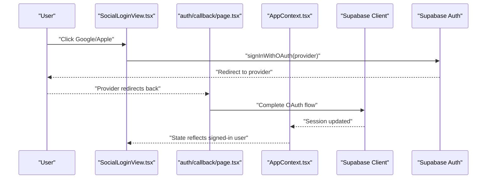
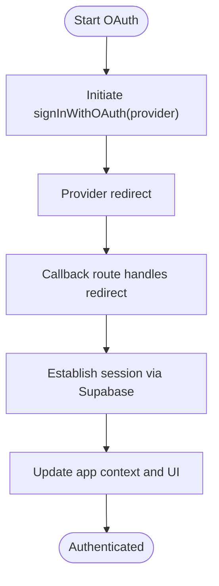
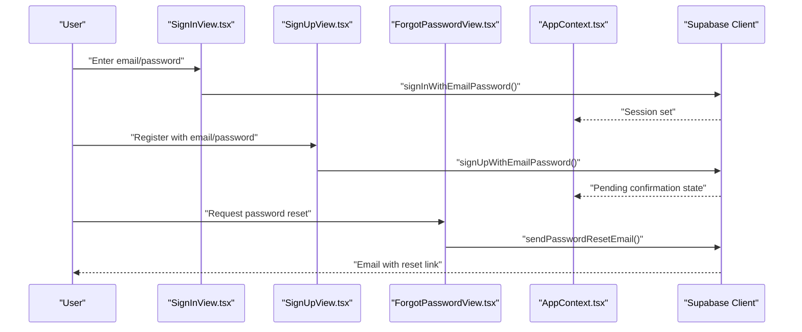
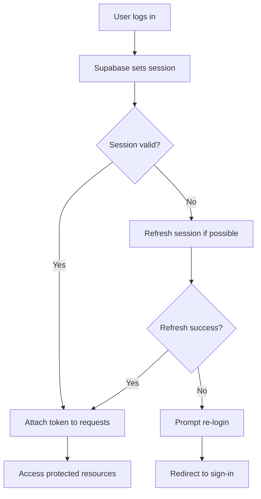
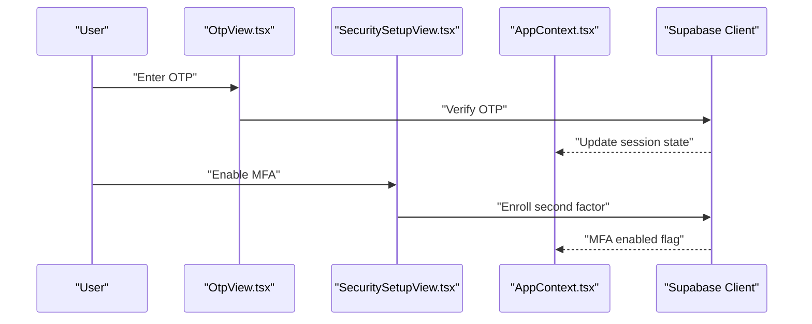
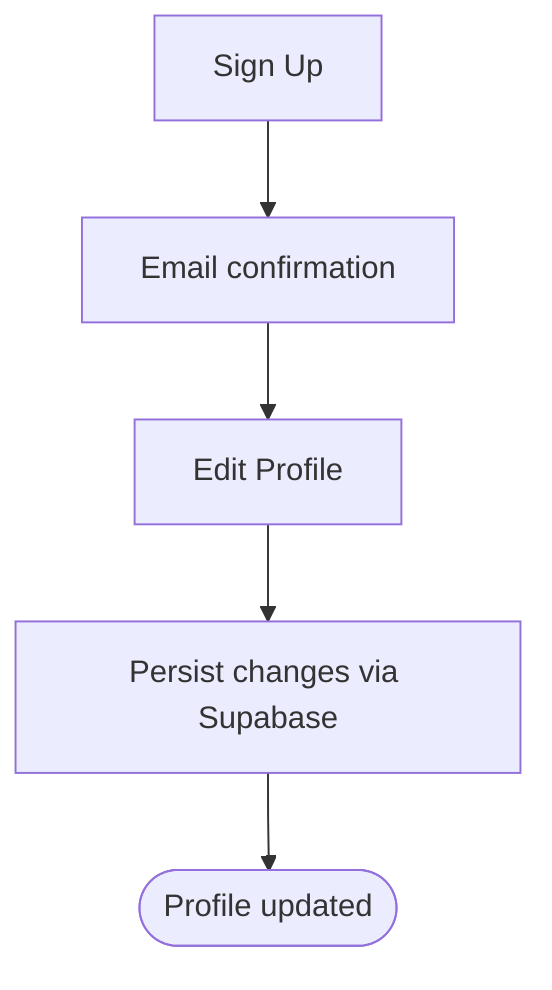
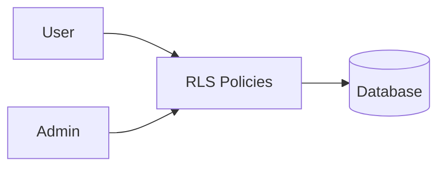
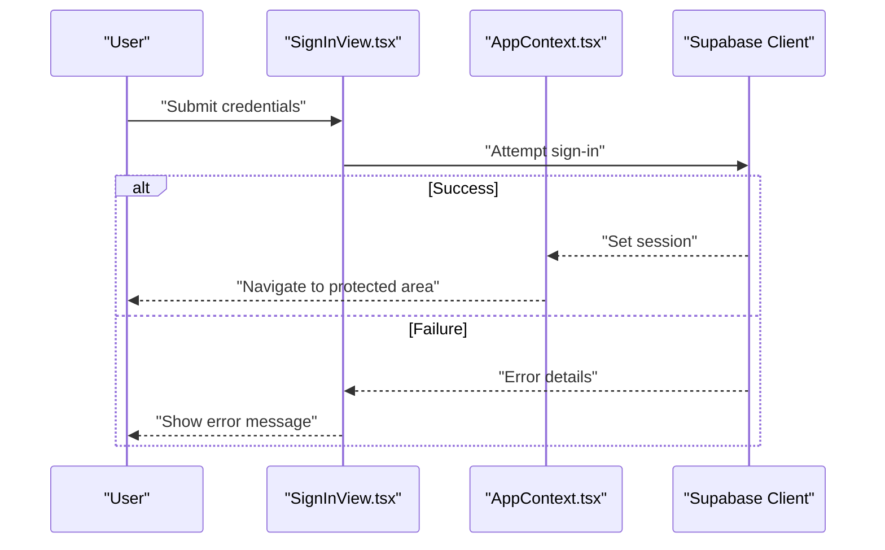
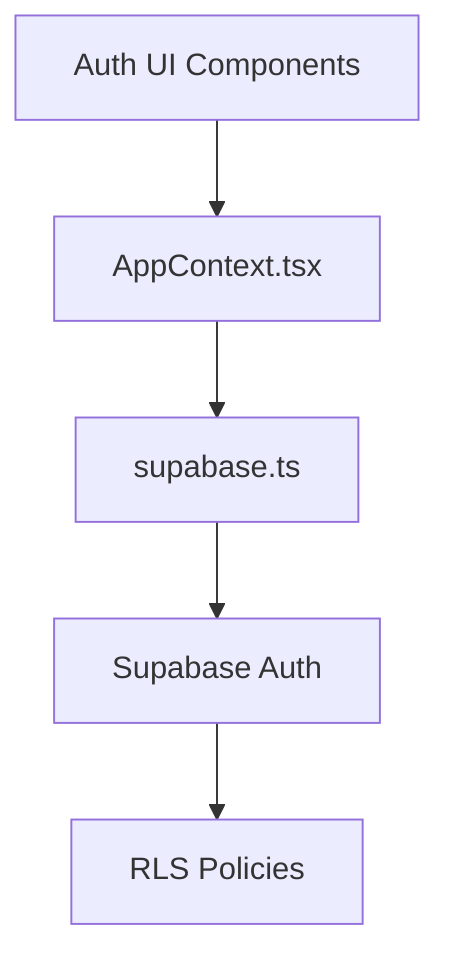

# Authentication API

<cite>
**Referenced Files in This Document**
- [AuthSheet.tsx](file://src/components/AuthSheet.tsx)
- [SignInView.tsx](file://src/components/SignInView.tsx)
- [SignUpView.tsx](file://src/components/SignUpView.tsx)
- [SocialLoginView.tsx](file://src/components/SocialLoginView.tsx)
- [ForgotPasswordView.tsx](file://src/components/ForgotPasswordView.tsx)
- [OtpView.tsx](file://src/components/OtpView.tsx)
- [SecuritySetupView.tsx](file://src/components/SecuritySetupView.tsx)
- [EditProfileView.tsx](file://src/components/EditProfileView.tsx)
- [page.tsx (auth/callback)](file://src/app/auth/callback/page.tsx)
- [AppContext.tsx](file://src/context/AppContext.tsx)
- [supabase.ts](file://src/services/backend/supabase.ts)
- [config.ts](file://src/services/backend/config.ts)
- [202607150001_phase_2_identity.sql](file://supabase/migrations/202607150001_phase_2_identity.sql)
- [phase_2_rls.sql](file://supabase/tests/phase_2_rls.sql)
- [phase2-auth.spec.ts](file://tests/e2e/phase2-auth.spec.ts)
</cite>

## Table of Contents
1. [Introduction](#introduction)
2. [Project Structure](#project-structure)
3. [Core Components](#core-components)
4. [Architecture Overview](#architecture-overview)
5. [Detailed Component Analysis](#detailed-component-analysis)
6. [Dependency Analysis](#dependency-analysis)
7. [Performance Considerations](#performance-considerations)
8. [Troubleshooting Guide](#troubleshooting-guide)
9. [Conclusion](#conclusion)
10. [Appendices](#appendices)

## Introduction
This document describes Mooday’s authentication and authorization APIs as implemented in the Next.js application backed by Supabase Auth. It covers OAuth integrations for social logins, email/password flows, session management, token handling, refresh behavior, multi-factor authentication support, user registration, profile updates, account recovery, role-based access control, permission checks, admin-only endpoints, and security best practices including CSRF protection and secure token storage patterns.

## Project Structure
Mooday uses a client-side authentication flow with Supabase Auth:
- UI components handle sign-in, sign-up, social login, OTP/MFA, forgot password, and profile editing.
- A callback page processes OAuth redirects.
- App-level context manages auth state and session lifecycle.
- Supabase client provides authenticated requests and RLS enforcement.
- Database migrations define identity tables and policies.

**Diagram sources**
- [AuthSheet.tsx:1-200](file://src/components/AuthSheet.tsx#L1-L200)
- [SignInView.tsx:1-200](file://src/components/SignInView.tsx#L1-L200)
- [SignUpView.tsx:1-200](file://src/components/SignUpView.tsx#L1-L200)
- [SocialLoginView.tsx:1-200](file://src/components/SocialLoginView.tsx#L1-L200)
- [ForgotPasswordView.tsx:1-200](file://src/components/ForgotPasswordView.tsx#L1-L200)
- [OtpView.tsx:1-200](file://src/components/OtpView.tsx#L1-L200)
- [SecuritySetupView.tsx:1-200](file://src/components/SecuritySetupView.tsx#L1-L200)
- [EditProfileView.tsx:1-200](file://src/components/EditProfileView.tsx#L1-L200)
- [page.tsx (auth/callback):1-200](file://src/app/auth/callback/page.tsx#L1-L200)
- [AppContext.tsx:1-200](file://src/context/AppContext.tsx#L1-L200)
- [supabase.ts:1-200](file://src/services/backend/supabase.ts#L1-L200)

**Section sources**
- [AuthSheet.tsx:1-200](file://src/components/AuthSheet.tsx#L1-L200)
- [AppContext.tsx:1-200](file://src/context/AppContext.tsx#L1-L200)
- [supabase.ts:1-200](file://src/services/backend/supabase.ts#L1-L200)
- [page.tsx (auth/callback):1-200](file://src/app/auth/callback/page.tsx#L1-L200)

## Core Components
- Sign In: Email/password and social login entry points.
- Sign Up: User registration with email verification.
- Social Login: OAuth providers (Google, Apple) via Supabase Auth.
- Forgot Password: Password reset via email link.
- OTP/MFA: One-time code verification and MFA setup/verification.
- Profile Management: Update user profile data.
- Session Context: Centralized auth state and session persistence.
- Callback Route: Handles OAuth redirect completion.

Key responsibilities:
- Validate inputs and surface user-friendly errors.
- Initiate provider-specific OAuth flows.
- Manage sessions and tokens through Supabase client.
- Enforce permissions via RLS on the backend.

**Section sources**
- [SignInView.tsx:1-200](file://src/components/SignInView.tsx#L1-L200)
- [SignUpView.tsx:1-200](file://src/components/SignUpView.tsx#L1-L200)
- [SocialLoginView.tsx:1-200](file://src/components/SocialLoginView.tsx#L1-L200)
- [ForgotPasswordView.tsx:1-200](file://src/components/ForgotPasswordView.tsx#L1-L200)
- [OtpView.tsx:1-200](file://src/components/OtpView.tsx#L1-L200)
- [SecuritySetupView.tsx:1-200](file://src/components/SecuritySetupView.tsx#L1-L200)
- [EditProfileView.tsx:1-200](file://src/components/EditProfileView.tsx#L1-L200)
- [AppContext.tsx:1-200](file://src/context/AppContext.tsx#L1-L200)
- [page.tsx (auth/callback):1-200](file://src/app/auth/callback/page.tsx#L1-L200)

## Architecture Overview
Mooday’s auth architecture leverages Supabase Auth for identity and session management:
- OAuth providers are configured in Supabase; clients initiate flows from the frontend.
- After successful provider authentication, Supabase sets a session and tokens.
- The app persists the session using Supabase’s built-in mechanisms.
- All subsequent API calls include the session token automatically.
- Row-Level Security (RLS) enforces permissions at the database level.

**Diagram sources**
- [SocialLoginView.tsx:1-200](file://src/components/SocialLoginView.tsx#L1-L200)
- [page.tsx (auth/callback):1-200](file://src/app/auth/callback/page.tsx#L1-L200)
- [AppContext.tsx:1-200](file://src/context/AppContext.tsx#L1-L200)
- [supabase.ts:1-200](file://src/services/backend/supabase.ts#L1-L200)

## Detailed Component Analysis

### OAuth Integration (Google, Apple)
- Entry point: Social login component initiates provider-specific flows.
- Redirect handling: Callback page finalizes the OAuth exchange and ensures session is established.
- Token handling: Supabase manages access and refresh tokens transparently; the client attaches them to requests.
- Error handling: Provider errors and network failures are surfaced to the user via UI feedback.

**Diagram sources**
- [SocialLoginView.tsx:1-200](file://src/components/SocialLoginView.tsx#L1-L200)
- [page.tsx (auth/callback):1-200](file://src/app/auth/callback/page.tsx#L1-L200)
- [AppContext.tsx:1-200](file://src/context/AppContext.tsx#L1-L200)

**Section sources**
- [SocialLoginView.tsx:1-200](file://src/components/SocialLoginView.tsx#L1-L200)
- [page.tsx (auth/callback):1-200](file://src/app/auth/callback/page.tsx#L1-L200)

### Email/Password Authentication
- Sign In: Validates credentials and establishes a session.
- Sign Up: Creates a new user and triggers email confirmation.
- Forgot Password: Sends a secure reset link to the registered email.
- Session persistence: Maintains active sessions across reloads until expiration or logout.

**Diagram sources**
- [SignInView.tsx:1-200](file://src/components/SignInView.tsx#L1-L200)
- [SignUpView.tsx:1-200](file://src/components/SignUpView.tsx#L1-L200)
- [ForgotPasswordView.tsx:1-200](file://src/components/ForgotPasswordView.tsx#L1-L200)
- [AppContext.tsx:1-200](file://src/context/AppContext.tsx#L1-L200)
- [supabase.ts:1-200](file://src/services/backend/supabase.ts#L1-L200)

**Section sources**
- [SignInView.tsx:1-200](file://src/components/SignInView.tsx#L1-L200)
- [SignUpView.tsx:1-200](file://src/components/SignUpView.tsx#L1-L200)
- [ForgotPasswordView.tsx:1-200](file://src/components/ForgotPasswordView.tsx#L1-L200)
- [AppContext.tsx:1-200](file://src/context/AppContext.tsx#L1-L200)

### Session Management and Token Handling
- Session lifecycle: Created on successful authentication; refreshed automatically by Supabase when needed.
- Persistence: Supabase stores session securely; the app reads current session from context.
- Expiration: Tokens expire per provider policy; Supabase refreshes without user intervention where supported.
- Logout: Clears session and resets UI state.

**Diagram sources**
- [AppContext.tsx:1-200](file://src/context/AppContext.tsx#L1-L200)
- [supabase.ts:1-200](file://src/services/backend/supabase.ts#L1-L200)

**Section sources**
- [AppContext.tsx:1-200](file://src/context/AppContext.tsx#L1-L200)
- [supabase.ts:1-200](file://src/services/backend/supabase.ts#L1-L200)

### Multi-Factor Authentication (MFA) and OTP
- OTP verification: One-time codes are used to verify identity during sensitive actions.
- MFA setup: Users can enable additional factors via security setup flows.
- Verification flow: Ensures user controls the second factor before granting access.

**Diagram sources**
- [OtpView.tsx:1-200](file://src/components/OtpView.tsx#L1-L200)
- [SecuritySetupView.tsx:1-200](file://src/components/SecuritySetupView.tsx#L1-L200)
- [AppContext.tsx:1-200](file://src/context/AppContext.tsx#L1-L200)
- [supabase.ts:1-200](file://src/services/backend/supabase.ts#L1-L200)

**Section sources**
- [OtpView.tsx:1-200](file://src/components/OtpView.tsx#L1-L200)
- [SecuritySetupView.tsx:1-200](file://src/components/SecuritySetupView.tsx#L1-L200)

### User Registration and Profile Updates
- Registration: Creates user accounts and sends confirmation emails.
- Profile updates: Allows users to modify public profile information.
- Validation: Ensures data integrity and prevents invalid updates.

**Diagram sources**
- [SignUpView.tsx:1-200](file://src/components/SignUpView.tsx#L1-L200)
- [EditProfileView.tsx:1-200](file://src/components/EditProfileView.tsx#L1-L200)
- [supabase.ts:1-200](file://src/services/backend/supabase.ts#L1-L200)

**Section sources**
- [SignUpView.tsx:1-200](file://src/components/SignUpView.tsx#L1-L200)
- [EditProfileView.tsx:1-200](file://src/components/EditProfileView.tsx#L1-L200)

### Role-Based Access Control and Admin-Only Endpoints
- Roles: Defined and enforced via database policies and RLS.
- Permission checks: Frontend guards restrict UI based on roles; backend policies enforce access.
- Admin endpoints: Protected routes require admin privileges; unauthorized attempts are denied.

**Diagram sources**
- [202607150001_phase_2_identity.sql:1-200](file://supabase/migrations/202607150001_phase_2_identity.sql#L1-L200)
- [phase_2_rls.sql:1-200](file://supabase/tests/phase_2_rls.sql#L1-L200)

**Section sources**
- [202607150001_phase_2_identity.sql:1-200](file://supabase/migrations/202607150001_phase_2_identity.sql#L1-L200)
- [phase_2_rls.sql:1-200](file://supabase/tests/phase_2_rls.sql#L1-L200)

### Implementing Login Flows and Handling Errors
- Login flow: Use sign-in component to collect credentials or initiate OAuth; handle success and failure states.
- Error handling: Display meaningful messages for invalid credentials, network issues, and provider errors.
- Session errors: Prompt re-login when session expires or becomes invalid.

**Diagram sources**
- [SignInView.tsx:1-200](file://src/components/SignInView.tsx#L1-L200)
- [AppContext.tsx:1-200](file://src/context/AppContext.tsx#L1-L200)
- [supabase.ts:1-200](file://src/services/backend/supabase.ts#L1-L200)

**Section sources**
- [SignInView.tsx:1-200](file://src/components/SignInView.tsx#L1-L200)
- [AppContext.tsx:1-200](file://src/context/AppContext.tsx#L1-L200)

## Dependency Analysis
Authentication depends on:
- UI components for user interactions.
- App context for state and session management.
- Supabase client for authenticated requests.
- Database migrations and RLS for permissions.

**Diagram sources**
- [AppContext.tsx:1-200](file://src/context/AppContext.tsx#L1-L200)
- [supabase.ts:1-200](file://src/services/backend/supabase.ts#L1-L200)
- [202607150001_phase_2_identity.sql:1-200](file://supabase/migrations/202607150001_phase_2_identity.sql#L1-L200)
- [phase_2_rls.sql:1-200](file://supabase/tests/phase_2_rls.sql#L1-L200)

**Section sources**
- [AppContext.tsx:1-200](file://src/context/AppContext.tsx#L1-L200)
- [supabase.ts:1-200](file://src/services/backend/supabase.ts#L1-L200)
- [202607150001_phase_2_identity.sql:1-200](file://supabase/migrations/202607150001_phase_2_identity.sql#L1-L200)
- [phase_2_rls.sql:1-200](file://supabase/tests/phase_2_rls.sql#L1-L200)

## Performance Considerations
- Minimize redundant auth checks by leveraging centralized session state.
- Cache user profile data locally after initial fetch to reduce network calls.
- Debounce rapid sign-in attempts to avoid rate limiting.
- Use lazy loading for auth-related components to improve initial load time.

[No sources needed since this section provides general guidance]

## Troubleshooting Guide
Common issues and resolutions:
- OAuth redirect loops: Ensure callback route correctly completes the flow and navigates appropriately.
- Invalid session: Re-authenticate when tokens expire or become invalid.
- Permission denied: Verify roles and RLS policies for the requested resource.
- Network errors: Check connectivity and retry failed requests with exponential backoff.

Validation references:
- End-to-end tests validate core auth flows.
- RLS tests ensure policies behave as expected.

**Section sources**
- [phase2-auth.spec.ts:1-200](file://tests/e2e/phase2-auth.spec.ts#L1-L200)
- [phase_2_rls.sql:1-200](file://supabase/tests/phase_2_rls.sql#L1-L200)

## Conclusion
Mooday’s authentication system combines a robust frontend experience with Supabase Auth for secure identity management. OAuth, email/password, OTP/MFA, and session handling are integrated seamlessly, while RLS enforces fine-grained permissions. Following the documented flows and security practices ensures a reliable and secure user experience.

[No sources needed since this section summarizes without analyzing specific files]

## Appendices

### Security Best Practices
- Use HTTPS everywhere and enforce secure cookie settings where applicable.
- Store tokens via Supabase’s secure session management; avoid manual token persistence.
- Implement CSRF protections at the server layer for any custom endpoints.
- Validate all inputs on both client and server sides.
- Log and monitor authentication events for anomalies.

[No sources needed since this section provides general guidance]