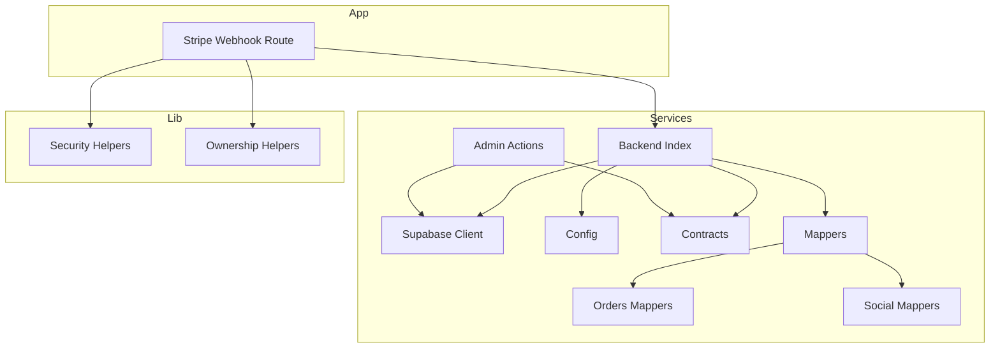
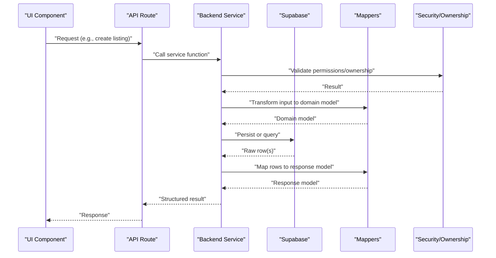
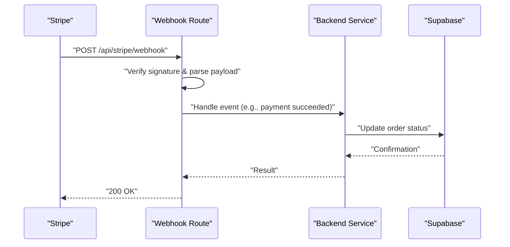
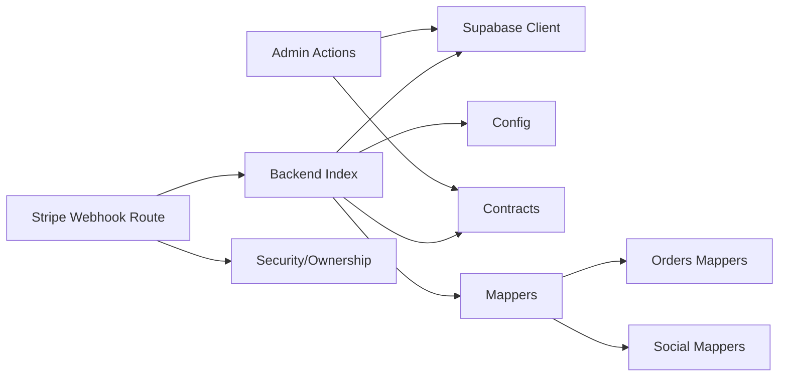

# Internal Services

<cite>
**Referenced Files in This Document**
- [services/backend/index.ts](file://src/services/backend/index.ts)
- [services/backend/supabase.ts](file://src/services/backend/supabase.ts)
- [services/backend/config.ts](file://src/services/backend/config.ts)
- [services/backend/contracts.ts](file://src/services/backend/contracts.ts)
- [services/backend/mappers.ts](file://src/services/backend/mappers.ts)
- [services/backend/mappers-orders.ts](file://src/services/backend/mappers-orders.ts)
- [services/backend/mappers-social.ts](file://src/services/backend/mappers-social.ts)
- [services/admin/actions.ts](file://src/services/admin/actions.ts)
- [services/admin/mockAdminService.ts](file://src/services/admin/mockAdminService.ts)
- [app/api/stripe/webhook/route.ts](file://src/app/api/stripe/webhook/route.ts)
- [lib/security.ts](file://src/lib/security.ts)
- [lib/ownership.ts](file://src/lib/ownership.ts)
</cite>

## Table of Contents
1. [Introduction](#introduction)
2. [Project Structure](#project-structure)
3. [Core Components](#core-components)
4. [Architecture Overview](#architecture-overview)
5. [Detailed Component Analysis](#detailed-component-analysis)
6. [Dependency Analysis](#dependency-analysis)
7. [Performance Considerations](#performance-considerations)
8. [Troubleshooting Guide](#troubleshooting-guide)
9. [Conclusion](#conclusion)

## Introduction
This document describes Mooday’s internal service layer and business logic interfaces that power user management, product operations, order processing, and administrative tasks. It focuses on the backend integration services, data mappers, admin actions, security utilities, and how these components interact to implement domain workflows. The goal is to help developers understand function responsibilities, parameters, return values, error handling patterns, and testing strategies without exposing implementation details.

## Project Structure
The service layer is organized around a backend integration module, domain-specific mappers, and admin action handlers:
- Backend integration: Supabase client, configuration, and typed contracts for requests/responses.
- Mappers: Transform database rows into domain models for listings, orders, and social features.
- Admin actions: Encapsulate administrative operations with consistent error handling.
- Security utilities: Provide helpers for ownership checks and security-related validations.
- API routes: Orchestrate external integrations (e.g., Stripe webhooks) using the service layer.

**Diagram sources**
- [services/backend/index.ts:1-200](file://src/services/backend/index.ts#L1-L200)
- [services/backend/supabase.ts:1-200](file://src/services/backend/supabase.ts#L1-L200)
- [services/backend/config.ts:1-200](file://src/services/backend/config.ts#L1-L200)
- [services/backend/contracts.ts:1-200](file://src/services/backend/contracts.ts#L1-L200)
- [services/backend/mappers.ts:1-200](file://src/services/backend/mappers.ts#L1-L200)
- [services/backend/mappers-orders.ts:1-200](file://src/services/backend/mappers-orders.ts#L1-L200)
- [services/backend/mappers-social.ts:1-200](file://src/services/backend/mappers-social.ts#L1-L200)
- [services/admin/actions.ts:1-200](file://src/services/admin/actions.ts#L1-L200)
- [app/api/stripe/webhook/route.ts:1-200](file://src/app/api/stripe/webhook/route.ts#L1-L200)
- [lib/security.ts:1-200](file://src/lib/security.ts#L1-L200)
- [lib/ownership.ts:1-200](file://src/lib/ownership.ts#L1-L200)

**Section sources**
- [services/backend/index.ts:1-200](file://src/services/backend/index.ts#L1-L200)
- [services/backend/supabase.ts:1-200](file://src/services/backend/supabase.ts#L1-L200)
- [services/backend/config.ts:1-200](file://src/services/backend/config.ts#L1-L200)
- [services/backend/contracts.ts:1-200](file://src/services/backend/contracts.ts#L1-L200)
- [services/backend/mappers.ts:1-200](file://src/services/backend/mappers.ts#L1-L200)
- [services/backend/mappers-orders.ts:1-200](file://src/services/backend/mappers-orders.ts#L1-L200)
- [services/backend/mappers-social.ts:1-200](file://src/services/backend/mappers-social.ts#L1-L200)
- [services/admin/actions.ts:1-200](file://src/services/admin/actions.ts#L1-L200)
- [app/api/stripe/webhook/route.ts:1-200](file://src/app/api/stripe/webhook/route.ts#L1-L200)
- [lib/security.ts:1-200](file://src/lib/security.ts#L1-L200)
- [lib/ownership.ts:1-200](file://src/lib/ownership.ts#L1-L200)

## Core Components
- Backend index: Centralizes access to Supabase, configuration, contracts, and mappers; exposes cohesive APIs for domain operations.
- Supabase client: Initializes and configures the database client with environment settings and error handling.
- Contracts: Defines typed request/response shapes used across services to ensure consistency.
- Mappers: Convert raw database rows into domain models for listings, orders, and social entities.
- Orders mappers: Specialized transformations for order-related data.
- Social mappers: Specialized transformations for social features (likes, follows).
- Admin actions: Encapsulates administrative operations with robust error handling and validation.
- Security and ownership helpers: Provide reusable checks for authorization and resource ownership.

Key responsibilities:
- User management: Access via backend index functions that wrap Supabase queries and enforce contracts.
- Product operations: Listing creation, updates, and retrieval through backend index and mappers.
- Order processing: End-to-end flow from payment intent to order persistence and status updates.
- Administrative tasks: Admin actions for moderation, reporting, and system maintenance.

Error handling patterns:
- Validate inputs early and throw descriptive errors when constraints are violated.
- Wrap database calls with try/catch and normalize errors to consistent shapes.
- Return structured results indicating success/failure with actionable messages.

Testing and mocking:
- Use mock implementations for admin services and backend clients to isolate tests.
- Inject dependencies where possible to enable swapping real clients with mocks.

**Section sources**
- [services/backend/index.ts:1-200](file://src/services/backend/index.ts#L1-L200)
- [services/backend/supabase.ts:1-200](file://src/services/backend/supabase.ts#L1-L200)
- [services/backend/contracts.ts:1-200](file://src/services/backend/contracts.ts#L1-L200)
- [services/backend/mappers.ts:1-200](file://src/services/backend/mappers.ts#L1-L200)
- [services/backend/mappers-orders.ts:1-200](file://src/services/backend/mappers-orders.ts#L1-L200)
- [services/backend/mappers-social.ts:1-200](file://src/services/backend/mappers-social.ts#L1-L200)
- [services/admin/actions.ts:1-200](file://src/services/admin/actions.ts#L1-L200)
- [services/admin/mockAdminService.ts:1-200](file://src/services/admin/mockAdminService.ts#L1-L200)
- [lib/security.ts:1-200](file://src/lib/security.ts#L1-L200)
- [lib/ownership.ts:1-200](file://src/lib/ownership.ts#L1-L200)

## Architecture Overview
The service layer abstracts database interactions and business rules behind clean interfaces. Routes and UI components call these services, which handle validation, transformation, and persistence.

**Diagram sources**
- [services/backend/index.ts:1-200](file://src/services/backend/index.ts#L1-L200)
- [services/backend/supabase.ts:1-200](file://src/services/backend/supabase.ts#L1-L200)
- [services/backend/mappers.ts:1-200](file://src/services/backend/mappers.ts#L1-L200)
- [lib/security.ts:1-200](file://src/lib/security.ts#L1-L200)
- [lib/ownership.ts:1-200](file://src/lib/ownership.ts#L1-L200)

## Detailed Component Analysis

### Backend Integration (Index, Supabase, Config, Contracts)
- Backend index: Aggregates services for listings, orders, users, and social features; provides high-level functions that encapsulate business logic.
- Supabase client: Initializes the client with environment variables and handles connection setup; centralizes error propagation.
- Config: Provides feature flags, endpoints, and runtime settings consumed by services.
- Contracts: Defines typed payloads for requests and responses to ensure type safety across layers.

Typical responsibilities:
- Create/update listings with validation and mapping.
- Manage user profiles and preferences.
- Process orders: create payment intents, confirm payments, update statuses.
- Handle social features: likes, follows, notifications.

Error handling:
- Normalize database errors into consistent shapes.
- Throw domain-specific errors for invalid states or missing resources.

**Section sources**
- [services/backend/index.ts:1-200](file://src/services/backend/index.ts#L1-L200)
- [services/backend/supabase.ts:1-200](file://src/services/backend/supabase.ts#L1-L200)
- [services/backend/config.ts:1-200](file://src/services/backend/config.ts#L1-L200)
- [services/backend/contracts.ts:1-200](file://src/services/backend/contracts.ts#L1-L200)

### Data Mappers (General, Orders, Social)
- General mappers: Convert database rows to domain models for listings and related entities.
- Orders mappers: Transform order rows into enriched order objects including line items and totals.
- Social mappers: Map social entities such as likes and follows to user-friendly structures.

Complexity considerations:
- Mapping should be O(n) over rows with minimal allocations.
- Avoid nested loops; pre-index collections when necessary.

Error handling:
- Guard against malformed rows and missing fields; coerce types safely.

**Section sources**
- [services/backend/mappers.ts:1-200](file://src/services/backend/mappers.ts#L1-L200)
- [services/backend/mappers-orders.ts:1-200](file://src/services/backend/mappers-orders.ts#L1-L200)
- [services/backend/mappers-social.ts:1-200](file://src/services/backend/mappers-social.ts#L1-L200)

### Admin Actions
- Encapsulates administrative operations such as user moderation, listing reviews, and system maintenance.
- Uses consistent validation and error handling; returns structured results for auditability.

Usage examples:
- Approve/reject listings based on policy.
- Update user roles or flags.
- Generate reports or perform bulk updates.

**Section sources**
- [services/admin/actions.ts:1-200](file://src/services/admin/actions.ts#L1-L200)
- [services/admin/mockAdminService.ts:1-200](file://src/services/admin/mockAdminService.ts#L1-L200)

### Security and Ownership Helpers
- Security helpers: Utilities for validating tokens, sanitizing inputs, and enforcing policies.
- Ownership helpers: Check if a user owns or has permission to modify a resource.

Integration points:
- Called before mutations to prevent unauthorized changes.
- Used in admin actions to enforce role-based access.

**Section sources**
- [lib/security.ts:1-200](file://src/lib/security.ts#L1-L200)
- [lib/ownership.ts:1-200](file://src/lib/ownership.ts#L1-L200)

### API Route: Stripe Webhook
- Orchestrates webhook events to update order statuses and trigger downstream processes.
- Validates signatures and payloads; delegates to backend services for state transitions.

Flow overview:

**Diagram sources**
- [app/api/stripe/webhook/route.ts:1-200](file://src/app/api/stripe/webhook/route.ts#L1-L200)
- [services/backend/index.ts:1-200](file://src/services/backend/index.ts#L1-L200)
- [services/backend/supabase.ts:1-200](file://src/services/backend/supabase.ts#L1-L200)

**Section sources**
- [app/api/stripe/webhook/route.ts:1-200](file://src/app/api/stripe/webhook/route.ts#L1-L200)

## Dependency Analysis
The service layer exhibits clear separation of concerns:
- Backend index depends on Supabase client, config, contracts, and mappers.
- Admin actions depend on Supabase and contracts.
- API routes depend on backend services and security/ownership helpers.
- Mappers are pure transformations with no side effects.

**Diagram sources**
- [services/backend/index.ts:1-200](file://src/services/backend/index.ts#L1-L200)
- [services/backend/supabase.ts:1-200](file://src/services/backend/supabase.ts#L1-L200)
- [services/backend/config.ts:1-200](file://src/services/backend/config.ts#L1-L200)
- [services/backend/contracts.ts:1-200](file://src/services/backend/contracts.ts#L1-L200)
- [services/backend/mappers.ts:1-200](file://src/services/backend/mappers.ts#L1-L200)
- [services/backend/mappers-orders.ts:1-200](file://src/services/backend/mappers-orders.ts#L1-L200)
- [services/backend/mappers-social.ts:1-200](file://src/services/backend/mappers-social.ts#L1-L200)
- [services/admin/actions.ts:1-200](file://src/services/admin/actions.ts#L1-L200)
- [app/api/stripe/webhook/route.ts:1-200](file://src/app/api/stripe/webhook/route.ts#L1-L200)
- [lib/security.ts:1-200](file://src/lib/security.ts#L1-L200)
- [lib/ownership.ts:1-200](file://src/lib/ownership.ts#L1-L200)

**Section sources**
- [services/backend/index.ts:1-200](file://src/services/backend/index.ts#L1-L200)
- [services/backend/supabase.ts:1-200](file://src/services/backend/supabase.ts#L1-L200)
- [services/backend/config.ts:1-200](file://src/services/backend/config.ts#L1-L200)
- [services/backend/contracts.ts:1-200](file://src/services/backend/contracts.ts#L1-L200)
- [services/backend/mappers.ts:1-200](file://src/services/backend/mappers.ts#L1-L200)
- [services/backend/mappers-orders.ts:1-200](file://src/services/backend/mappers-orders.ts#L1-L200)
- [services/backend/mappers-social.ts:1-200](file://src/services/backend/mappers-social.ts#L1-L200)
- [services/admin/actions.ts:1-200](file://src/services/admin/actions.ts#L1-L200)
- [app/api/stripe/webhook/route.ts:1-200](file://src/app/api/stripe/webhook/route.ts#L1-L200)
- [lib/security.ts:1-200](file://src/lib/security.ts#L1-L200)
- [lib/ownership.ts:1-200](file://src/lib/ownership.ts#L1-L200)

## Performance Considerations
- Prefer batched queries and minimize round trips to the database.
- Use mappers to transform only needed fields; avoid heavy computations in hot paths.
- Cache frequently accessed read-only data at the application layer when appropriate.
- Validate inputs early to fail fast and reduce unnecessary processing.
- For webhooks and background jobs, ensure idempotency and retry logic.

[No sources needed since this section provides general guidance]

## Troubleshooting Guide
Common issues and resolutions:
- Database errors: Inspect normalized error messages from the backend service; check constraints and RLS policies.
- Permission denied: Verify ownership checks and admin roles; ensure the caller has required privileges.
- Invalid payloads: Confirm contract shapes and required fields; log sanitized diagnostics.
- Webhook failures: Validate signatures and event types; ensure idempotent handling of repeated events.

Testing strategies:
- Mock Supabase client and admin services to isolate unit tests.
- Use contract assertions to validate request/response shapes.
- Simulate edge cases (missing fields, invalid IDs, network errors) in tests.

**Section sources**
- [services/backend/supabase.ts:1-200](file://src/services/backend/supabase.ts#L1-L200)
- [services/admin/actions.ts:1-200](file://src/services/admin/actions.ts#L1-L200)
- [services/admin/mockAdminService.ts:1-200](file://src/services/admin/mockAdminService.ts#L1-L200)
- [app/api/stripe/webhook/route.ts:1-200](file://src/app/api/stripe/webhook/route.ts#L1-L200)

## Conclusion
Mooday’s internal service layer provides a clean, typed, and testable interface for core domain operations. By separating concerns between backend integration, mappers, admin actions, and security helpers, the codebase remains maintainable and scalable. Adhering to consistent error handling, validation, and performance practices ensures reliability across user management, product operations, order processing, and administrative tasks.

[No sources needed since this section summarizes without analyzing specific files]