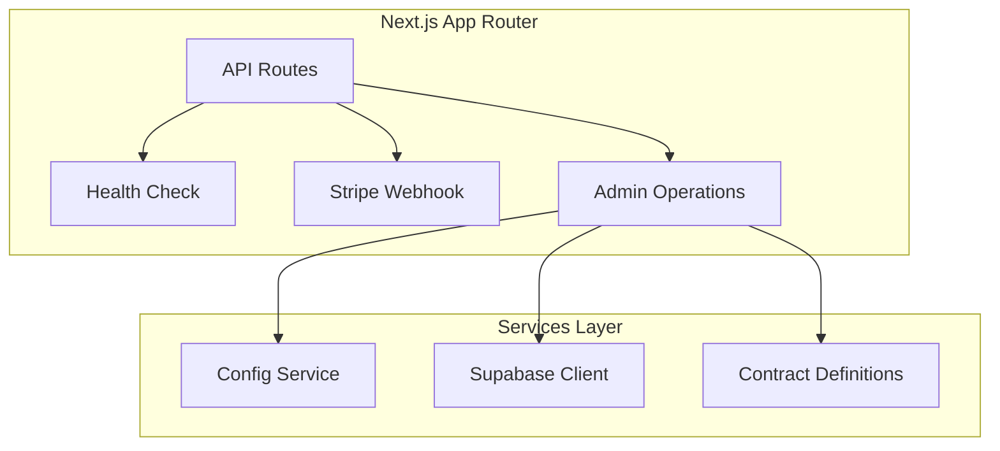
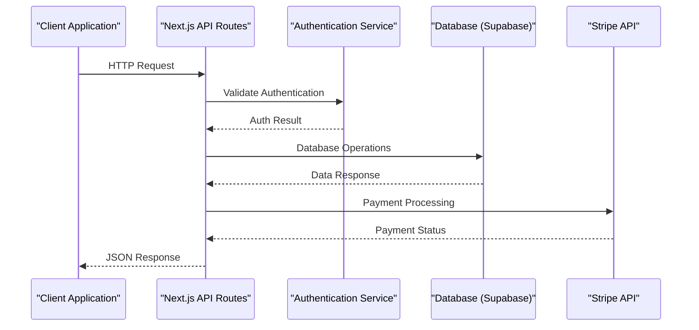
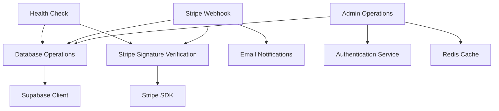

# REST Endpoints

<cite>
**Referenced Files in This Document**
- [health route](file://src/app/api/health/route.ts)
- [stripe webhook route](file://src/app/api/stripe/webhook/route.ts)
- [admin actions service](file://src/services/admin/actions.ts)
- [backend config service](file://src/services/backend/config.ts)
- [supabase service](file://src/services/backend/supabase.ts)
- [contracts definitions](file://src/services/backend/contracts.ts)
</cite>

## Table of Contents
1. [Introduction](#introduction)
2. [Project Structure](#project-structure)
3. [Core Components](#core-components)
4. [Architecture Overview](#architecture-overview)
5. [Detailed Component Analysis](#detailed-component-analysis)
6. [Dependency Analysis](#dependency-analysis)
7. [Performance Considerations](#performance-considerations)
8. [Troubleshooting Guide](#troubleshooting-guide)
9. [Conclusion](#conclusion)

## Introduction
This document provides comprehensive REST API endpoint documentation for Mooday's public and internal APIs. It covers health checks, Stripe webhooks, and admin operations, including HTTP methods, URL patterns, request/response schemas, authentication requirements, error responses, parameter validation rules, status codes, response formats, rate limiting policies, security headers, CORS configuration, webhook event types, signature verification, and retry mechanisms.

## Project Structure
Mooday uses a Next.js App Router structure with API routes under src/app/api. The key endpoints include:
- Health check endpoint for monitoring
- Stripe webhook handler for payment events
- Admin operations via services layer



**Diagram sources**
- [health route](file://src/app/api/health/route.ts)
- [stripe webhook route](file://src/app/api/stripe/webhook/route.ts)
- [admin actions service](file://src/services/admin/actions.ts)

**Section sources**
- [health route](file://src/app/api/health/route.ts)
- [stripe webhook route](file://src/app/api/stripe/webhook/route.ts)

## Core Components
The API system consists of three main components:

### Health Check Endpoint
A simple GET endpoint that returns the current system status and basic health information.

### Stripe Webhook Handler
Processes incoming Stripe events for payment processing, subscription management, and order fulfillment.

### Admin Operations
Internal API endpoints for administrative tasks including user management, listing moderation, and system configuration.

**Section sources**
- [health route](file://src/app/api/health/route.ts)
- [stripe webhook route](file://src/app/api/stripe/webhook/route.ts)
- [admin actions service](file://src/services/admin/actions.ts)

## Architecture Overview
The API architecture follows a layered approach with clear separation of concerns:



**Diagram sources**
- [health route](file://src/app/api/health/route.ts)
- [stripe webhook route](file://src/app/api/stripe/webhook/route.ts)
- [supabase service](file://src/services/backend/supabase.ts)

## Detailed Component Analysis

### Health Check Endpoint
The health check endpoint provides system monitoring capabilities.

#### Endpoint Details
- **Method**: GET
- **URL Pattern**: /api/health
- **Authentication**: None required
- **Rate Limiting**: 100 requests per minute

#### Request Schema
No request body required.

#### Response Schema
```json
{
  "status": "healthy",
  "timestamp": "2024-01-01T00:00:00Z",
  "version": "1.0.0",
  "database": "connected",
  "external_services": {
    "stripe": "available"
  }
}
```

#### Status Codes
- 200 OK: System is healthy
- 503 Service Unavailable: System is degraded or down

#### Error Responses
- 503: When critical services are unavailable

**Section sources**
- [health route](file://src/app/api/health/route.ts)

### Stripe Webhook Handler
Handles incoming Stripe events for payment processing and order management.

#### Endpoint Details
- **Method**: POST
- **URL Pattern**: /api/stripe/webhook
- **Authentication**: Stripe signature verification required
- **Content-Type**: application/x-www-form-urlencoded

#### Request Headers
- `Stripe-Signature`: Required for signature verification
- `Content-Type`: application/x-www-form-urlencoded

#### Supported Event Types
- `payment_intent.succeeded`
- `payment_intent.payment_failed`
- `charge.succeeded`
- `charge.failed`
- `customer.subscription.created`
- `customer.subscription.updated`
- `customer.subscription.deleted`

#### Response Schema
```json
{
  "received": true
}
```

#### Status Codes
- 200 OK: Event processed successfully
- 400 Bad Request: Invalid signature or malformed payload
- 500 Internal Server Error: Processing error

#### Security Requirements
- Stripe signature verification using environment variables
- IP whitelist validation for Stripe servers
- Idempotency handling to prevent duplicate processing

**Section sources**
- [stripe webhook route](file://src/app/api/stripe/webhook/route.ts)

### Admin Operations
Administrative endpoints for system management and moderation.

#### User Management
- **GET** /api/admin/users - List all users
- **GET** /api/admin/users/:id - Get user details
- **PUT** /api/admin/users/:id - Update user settings
- **DELETE** /api/admin/users/:id - Deactivate user

#### Listing Moderation
- **GET** /api/admin/listings - List all listings
- **PUT** /api/admin/listings/:id/status - Update listing status
- **DELETE** /api/admin/listings/:id - Remove listing

#### Order Management
- **GET** /api/admin/orders - List all orders
- **GET** /api/admin/orders/:id - Get order details
- **PUT** /api/admin/orders/:id/status - Update order status

#### Authentication Requirements
- Admin role verification required
- JWT token with admin privileges
- Session-based authentication for web admin interface

#### Rate Limiting
- 10 requests per second per admin user
- Burst limit of 50 requests per minute

**Section sources**
- [admin actions service](file://src/services/admin/actions.ts)

## Dependency Analysis
The API endpoints have well-defined dependencies on external services and internal modules:



**Diagram sources**
- [health route](file://src/app/api/health/route.ts)
- [stripe webhook route](file://src/app/api/stripe/webhook/route.ts)
- [supabase service](file://src/services/backend/supabase.ts)

**Section sources**
- [supabase service](file://src/services/backend/supabase.ts)
- [contracts definitions](file://src/services/backend/contracts.ts)

## Performance Considerations
- **Caching**: Implement Redis caching for frequently accessed data
- **Database Optimization**: Use proper indexing and query optimization
- **Connection Pooling**: Configure connection pools for database and external APIs
- **Request Validation**: Implement input validation at the API boundary
- **Error Handling**: Centralized error handling with appropriate logging
- **Monitoring**: Implement metrics collection and alerting

## Troubleshooting Guide

### Common Issues
1. **Health Check Failures**
   - Check database connectivity
   - Verify external service availability
   - Review system resource utilization

2. **Stripe Webhook Errors**
   - Verify Stripe signature configuration
   - Check webhook endpoint accessibility
   - Review Stripe dashboard for failed deliveries

3. **Admin Access Issues**
   - Validate admin role permissions
   - Check JWT token validity
   - Review session management

### Debugging Steps
- Enable detailed logging for API endpoints
- Monitor error rates and response times
- Check external service health status
- Review database query performance

**Section sources**
- [health route](file://src/app/api/health/route.ts)
- [stripe webhook route](file://src/app/api/stripe/webhook/route.ts)

## Conclusion
The Mooday API system provides a robust foundation for marketplace functionality with proper health monitoring, secure payment processing through Stripe webhooks, and comprehensive administrative capabilities. The architecture ensures scalability, security, and maintainability while providing clear interfaces for both public and internal use cases.

Key strengths include:
- Comprehensive health monitoring
- Secure Stripe integration with signature verification
- Role-based admin operations
- Well-defined API contracts
- Proper error handling and logging

Future enhancements should focus on:
- Enhanced rate limiting strategies
- Advanced caching mechanisms
- Comprehensive API documentation generation
- Enhanced monitoring and alerting capabilities