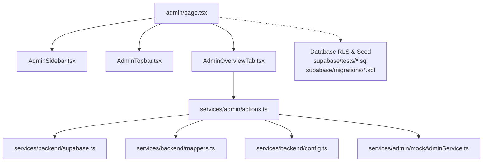
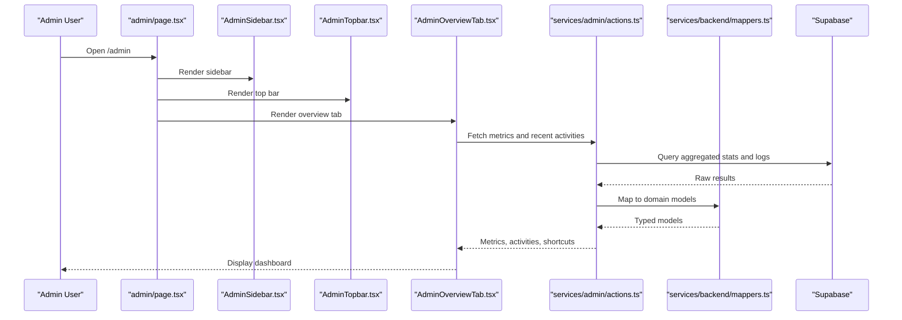
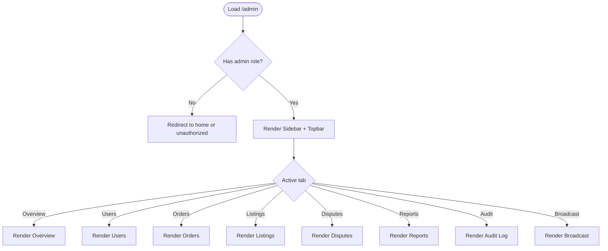
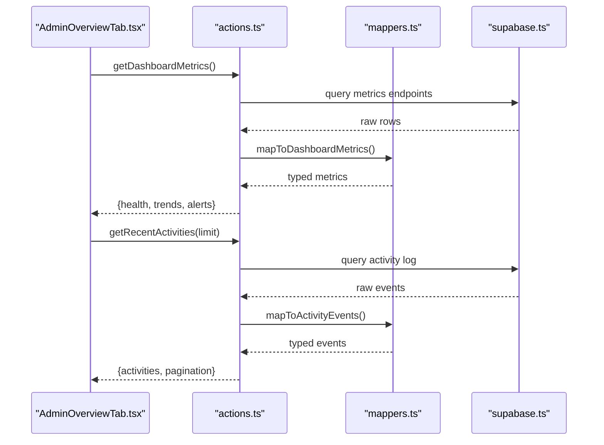
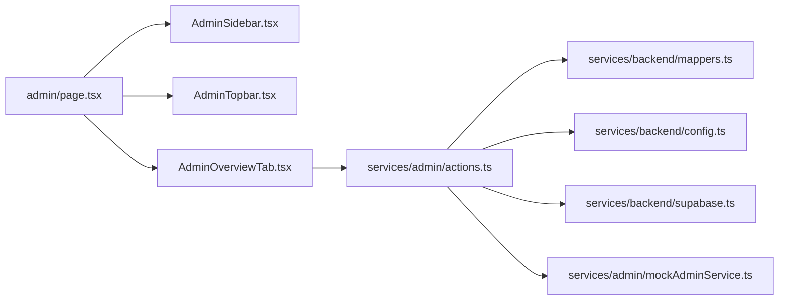

# Admin Overview and Dashboard

<cite>
**Referenced Files in This Document**
- [page.tsx](file://src/app/admin/page.tsx)
- [AdminOverviewTab.tsx](file://src/components/admin/AdminOverviewTab.tsx)
- [AdminSidebar.tsx](file://src/components/admin/AdminSidebar.tsx)
- [AdminTopbar.tsx](file://src/components/admin/AdminTopbar.tsx)
- [AdminTypes.ts](file://src/components/admin/AdminTypes.ts)
- [actions.ts](file://src/services/admin/actions.ts)
- [mockAdminService.ts](file://src/services/admin/mockAdminService.ts)
- [supabase.ts](file://src/services/backend/supabase.ts)
- [config.ts](file://src/services/backend/config.ts)
- [mappers.ts](file://src/services/backend/mappers.ts)
- [202608060005_seed_admin.sql](file://supabase/migrations/202608060005_seed_admin.sql)
- [phase_3_5_admin_rls.sql](file://supabase/tests/phase_3_5_admin_rls.sql)
</cite>

## Table of Contents
1. Introduction
2. Project Structure
3. Core Components
4. Architecture Overview
5. Detailed Component Analysis
6. Dependency Analysis
7. Performance Considerations
8. Troubleshooting Guide
9. Conclusion

## Introduction
This document explains the admin dashboard overview and main interface, focusing on layout, navigation, key metrics, sidebar and top bar behavior, responsive design, and the overview tab’s platform health, recent activities, and quick actions. It also covers how to access the admin panel, role-based access control, initial setup, customization options, widget management, and performance optimization for large datasets.

## Project Structure
The admin feature is implemented as a Next.js route with a dedicated page and a set of reusable components:
- Route entry point renders the admin shell and tabs
- Sidebar provides navigation between admin sections
- Top bar shows user context and global actions
- Overview tab displays platform health, recent activities, and quick actions
- Services layer handles data fetching, mapping, and mock fallbacks
- Database migrations seed admin roles and define security policies

**Diagram sources**
- [page.tsx:1-200](file://src/app/admin/page.tsx#L1-L200)
- [AdminSidebar.tsx:1-200](file://src/components/admin/AdminSidebar.tsx#L1-L200)
- [AdminTopbar.tsx:1-200](file://src/components/admin/AdminTopbar.tsx#L1-L200)
- [AdminOverviewTab.tsx:1-200](file://src/components/admin/AdminOverviewTab.tsx#L1-L200)
- [actions.ts:1-200](file://src/services/admin/actions.ts#L1-L200)
- [supabase.ts:1-200](file://src/services/backend/supabase.ts#L1-L200)
- [mappers.ts:1-200](file://src/services/backend/mappers.ts#L1-L200)
- [config.ts:1-200](file://src/services/backend/config.ts#L1-L200)
- [mockAdminService.ts:1-200](file://src/services/admin/mockAdminService.ts#L1-L200)

**Section sources**
- [page.tsx:1-200](file://src/app/admin/page.tsx#L1-L200)
- [AdminSidebar.tsx:1-200](file://src/components/admin/AdminSidebar.tsx#L1-L200)
- [AdminTopbar.tsx:1-200](file://src/components/admin/AdminTopbar.tsx#L1-L200)
- [AdminOverviewTab.tsx:1-200](file://src/components/admin/AdminOverviewTab.tsx#L1-L200)
- [actions.ts:1-200](file://src/services/admin/actions.ts#L1-L200)
- [supabase.ts:1-200](file://src/services/backend/supabase.ts#L1-L200)
- [mappers.ts:1-200](file://src/services/backend/mappers.ts#L1-L200)
- [config.ts:1-200](file://src/services/backend/config.ts#L1-L200)
- [mockAdminService.ts:1-200](file://src/services/admin/mockAdminService.ts#L1-L200)

## Core Components
- Admin page shell: Renders the sidebar, top bar, and active tab content; manages routing state and responsive visibility.
- Sidebar navigation: Lists admin sections (Overview, Users, Orders, Listings, Disputes, Reports, Audit Log, Broadcast). Supports collapsible mobile drawer and keyboard shortcuts.
- Top bar: Displays current user info, notifications, theme toggle, and global search or actions.
- Overview tab: Shows platform health indicators, recent activity feed, and quick action shortcuts (e.g., suspend user, refund order, ban listing).
- Types: Shared TypeScript definitions for admin entities and UI states.

Key responsibilities:
- Layout orchestration and responsive behavior
- Navigation state and deep linking via URL
- Data fetching and caching for metrics and feeds
- Role checks before rendering sensitive sections

**Section sources**
- [page.tsx:1-200](file://src/app/admin/page.tsx#L1-L200)
- [AdminSidebar.tsx:1-200](file://src/components/admin/AdminSidebar.tsx#L1-L200)
- [AdminTopbar.tsx:1-200](file://src/components/admin/AdminTopbar.tsx#L1-L200)
- [AdminOverviewTab.tsx:1-200](file://src/components/admin/AdminOverviewTab.tsx#L1-L200)
- [AdminTypes.ts:1-200](file://src/components/admin/AdminTypes.ts#L1-L200)

## Architecture Overview
The admin dashboard follows a layered architecture:
- Presentation layer: React components for layout, navigation, and views
- Service layer: Centralized functions for data operations, mapping, and environment configuration
- Data layer: Supabase client with typed mappers and optional mock service for development
- Security layer: Row-level security policies and seeded admin roles

**Diagram sources**
- [page.tsx:1-200](file://src/app/admin/page.tsx#L1-L200)
- [AdminSidebar.tsx:1-200](file://src/components/admin/AdminSidebar.tsx#L1-L200)
- [AdminTopbar.tsx:1-200](file://src/components/admin/AdminTopbar.tsx#L1-L200)
- [AdminOverviewTab.tsx:1-200](file://src/components/admin/AdminOverviewTab.tsx#L1-L200)
- [actions.ts:1-200](file://src/services/admin/actions.ts#L1-L200)
- [mappers.ts:1-200](file://src/services/backend/mappers.ts#L1-L200)
- [supabase.ts:1-200](file://src/services/backend/supabase.ts#L1-L200)

## Detailed Component Analysis

### Admin Page Shell
- Responsibilities:
  - Mounts sidebar, top bar, and tab content
  - Manages active tab state and URL sync
  - Handles responsive drawer toggling
  - Enforces basic guard logic before rendering admin content
- UX considerations:
  - Collapsible sidebar on small screens
  - Accessible focus management when switching tabs
  - Loading skeletons while metrics load

**Diagram sources**
- [page.tsx:1-200](file://src/app/admin/page.tsx#L1-L200)

**Section sources**
- [page.tsx:1-200](file://src/app/admin/page.tsx#L1-L200)

### Sidebar Navigation
- Features:
  - Section list with icons and labels
  - Active state highlighting based on current tab
  - Mobile drawer with overlay
  - Keyboard shortcut hints for power users
- Accessibility:
  - ARIA attributes for navigation regions and current item
  - Focus trapping within drawer when open

**Section sources**
- [AdminSidebar.tsx:1-200](file://src/components/admin/AdminSidebar.tsx#L1-L200)

### Top Bar
- Features:
  - User avatar and name
  - Notifications bell with unread count
  - Theme toggle and settings entry
  - Global search or help link
- Behavior:
  - Dropdown menus for user actions
  - Real-time updates for notifications where applicable

**Section sources**
- [AdminTopbar.tsx:1-200](file://src/components/admin/AdminTopbar.tsx#L1-L200)

### Overview Tab
- Displays:
  - Platform health: system status, error rates, latency indicators
  - Recent activities: latest user actions, orders, disputes
  - Quick actions: suspend user, refund order, ban listing, broadcast message
- Data flow:
  - Calls centralized actions to fetch metrics and activity feed
  - Maps raw responses to typed models
  - Falls back to mock data when backend unavailable

**Diagram sources**
- [AdminOverviewTab.tsx:1-200](file://src/components/admin/AdminOverviewTab.tsx#L1-L200)
- [actions.ts:1-200](file://src/services/admin/actions.ts#L1-L200)
- [mappers.ts:1-200](file://src/services/backend/mappers.ts#L1-L200)
- [supabase.ts:1-200](file://src/services/backend/supabase.ts#L1-L200)

**Section sources**
- [AdminOverviewTab.tsx:1-200](file://src/components/admin/AdminOverviewTab.tsx#L1-L200)
- [actions.ts:1-200](file://src/services/admin/actions.ts#L1-L200)
- [mappers.ts:1-200](file://src/services/backend/mappers.ts#L1-L200)

### Types and Contracts
- Shared types define:
  - Dashboard metrics shape
  - Activity event structure
  - Quick action payloads
  - UI state flags for loading, errors, and pagination

These ensure consistent contracts across components and services.

**Section sources**
- [AdminTypes.ts:1-200](file://src/components/admin/AdminTypes.ts#L1-L200)

## Dependency Analysis
- Component dependencies:
  - Admin page depends on Sidebar, Topbar, and tab components
  - Overview tab depends on actions for data fetching
- Service dependencies:
  - Actions depend on Supabase client, mappers, and config
  - Mock service provides offline development experience
- External integrations:
  - Supabase for data and auth
  - Environment configuration for endpoints and feature flags

**Diagram sources**
- [page.tsx:1-200](file://src/app/admin/page.tsx#L1-L200)
- [AdminSidebar.tsx:1-200](file://src/components/admin/AdminSidebar.tsx#L1-L200)
- [AdminTopbar.tsx:1-200](file://src/components/admin/AdminTopbar.tsx#L1-L200)
- [AdminOverviewTab.tsx:1-200](file://src/components/admin/AdminOverviewTab.tsx#L1-L200)
- [actions.ts:1-200](file://src/services/admin/actions.ts#L1-L200)
- [mappers.ts:1-200](file://src/services/backend/mappers.ts#L1-L200)
- [config.ts:1-200](file://src/services/backend/config.ts#L1-L200)
- [supabase.ts:1-200](file://src/services/backend/supabase.ts#L1-L200)
- [mockAdminService.ts:1-200](file://src/services/admin/mockAdminService.ts#L1-L200)

**Section sources**
- [actions.ts:1-200](file://src/services/admin/actions.ts#L1-L200)
- [supabase.ts:1-200](file://src/services/backend/supabase.ts#L1-L200)
- [mappers.ts:1-200](file://src/services/backend/mappers.ts#L1-L200)
- [config.ts:1-200](file://src/services/backend/config.ts#L1-L200)
- [mockAdminService.ts:1-200](file://src/services/admin/mockAdminService.ts#L1-L200)

## Performance Considerations
- Data fetching:
  - Use server-side aggregation where possible to reduce payload size
  - Implement pagination and cursor-based loading for activity feeds
  - Cache frequently accessed metrics with short TTLs
- Rendering:
  - Memoize expensive computations and derived metrics
  - Virtualize long lists (e.g., activity logs) to maintain scroll performance
- Network:
  - Batch requests for related metrics
  - Prefer streaming or incremental updates for real-time indicators
- Dev experience:
  - Leverage mock service to avoid cold-start penalties during development

[No sources needed since this section provides general guidance]

## Troubleshooting Guide
Common issues and resolutions:
- Unauthorized access:
  - Ensure admin role is assigned and verified by the guard logic
  - Check database RLS policies and seed scripts
- Missing metrics:
  - Verify environment configuration and Supabase connectivity
  - Confirm that mappers handle schema changes correctly
- Slow activity feed:
  - Add indexes on timestamp columns used for sorting
  - Limit default page size and implement pagination
- Mock vs live data:
  - Toggle mock service explicitly to isolate frontend issues from backend problems

**Section sources**
- [actions.ts:1-200](file://src/services/admin/actions.ts#L1-L200)
- [mockAdminService.ts:1-200](file://src/services/admin/mockAdminService.ts#L1-L200)
- [config.ts:1-200](file://src/services/backend/config.ts#L1-L200)
- [supabase.ts:1-200](file://src/services/backend/supabase.ts#L1-L200)

## Conclusion
The admin dashboard provides a structured, responsive interface for monitoring platform health, managing users and transactions, and executing administrative actions. Its layered architecture separates presentation, services, and data concerns, enabling maintainability and scalability. With proper role enforcement, efficient data handling, and thoughtful UX patterns, it supports both day-to-day operations and growth under larger datasets.

[No sources needed since this section summarizes without analyzing specific files]

## Appendices

### Accessing the Admin Panel
- Navigate to the admin route and ensure your account has the required admin role
- If redirected, verify role assignment and authentication state

**Section sources**
- [page.tsx:1-200](file://src/app/admin/page.tsx#L1-L200)

### Role-Based Access Control
- Admin role verification occurs at the page level before rendering protected sections
- Database row-level security policies restrict data access per role
- Seed script provisions an initial admin user for setup

**Section sources**
- [page.tsx:1-200](file://src/app/admin/page.tsx#L1-L200)
- [202608060005_seed_admin.sql:1-200](file://supabase/migrations/202608060005_seed_admin.sql#L1-L200)
- [phase_3_5_admin_rls.sql:1-200](file://supabase/tests/phase_3_5_admin_rls.sql#L1-L200)

### Initial Setup Procedures
- Run database migrations to create tables and policies
- Execute seed script to create an admin user
- Configure environment variables for Supabase and feature flags
- Validate connectivity using the health endpoint if available

**Section sources**
- [config.ts:1-200](file://src/services/backend/config.ts#L1-L200)
- [supabase.ts:1-200](file://src/services/backend/supabase.ts#L1-L200)
- [202608060005_seed_admin.sql:1-200](file://supabase/migrations/202608060005_seed_admin.sql#L1-L200)

### Customization Options and Widget Management
- Customize visible widgets via configuration or feature flags
- Persist user preferences for layout and widget ordering
- Provide defaults for first-run experiences

[No sources needed since this section provides general guidance]

### Performance Optimization for Large Datasets
- Implement server-side pagination and filtering
- Use database indexes on commonly queried fields
- Apply memoization and virtualization in the UI
- Monitor and optimize network payloads

[No sources needed since this section provides general guidance]