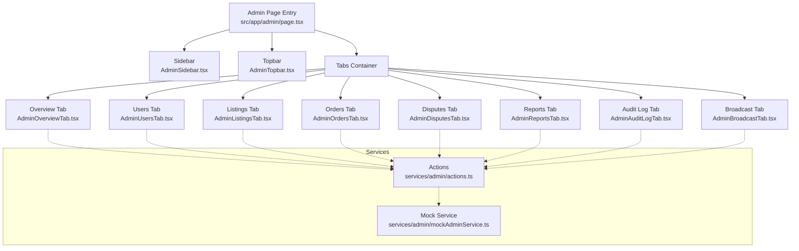
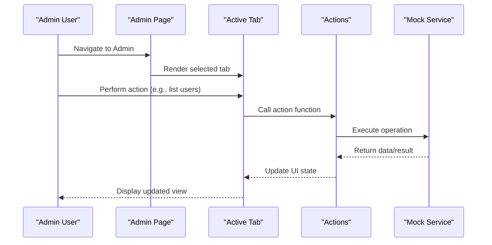
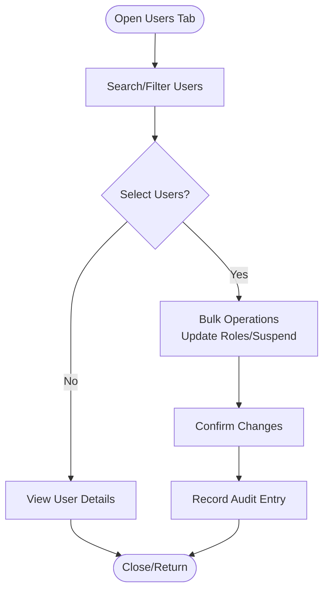
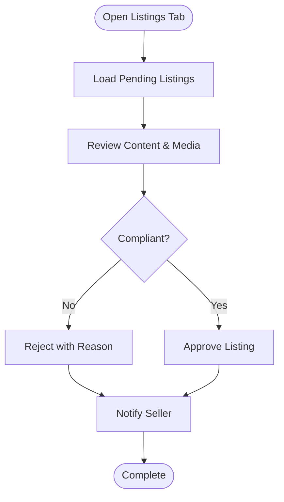
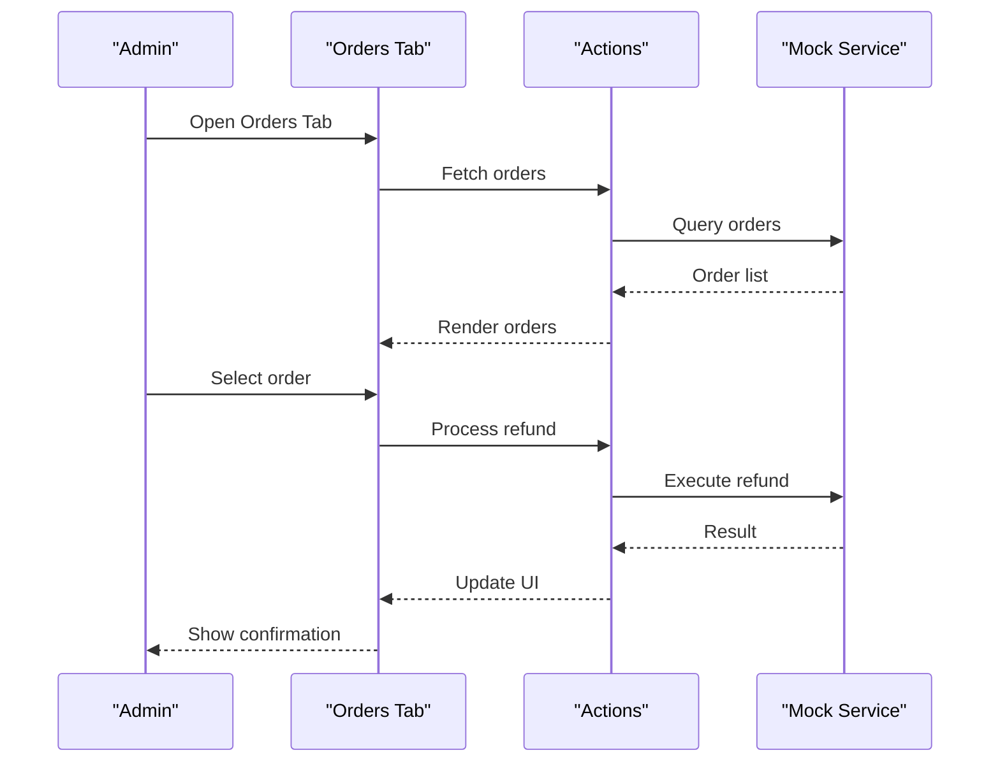
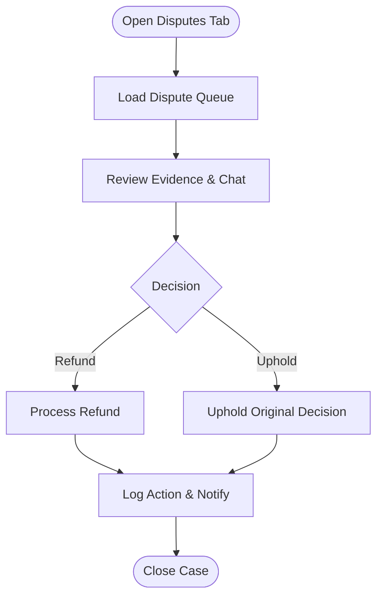
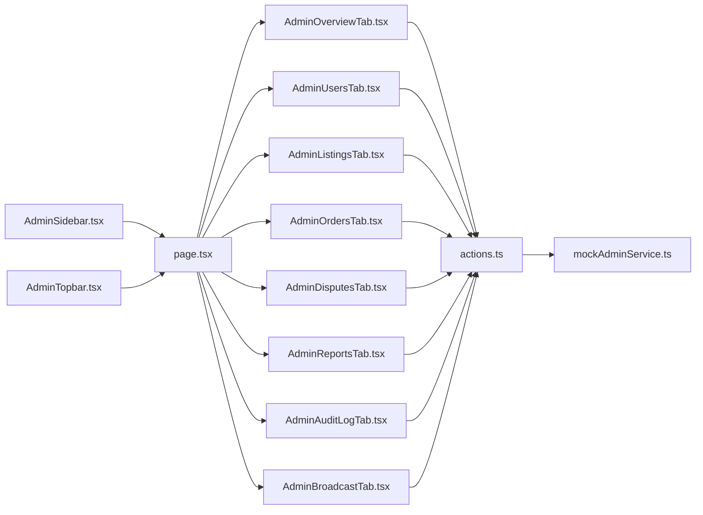

# Administrative Dashboard

<cite>
**Referenced Files in This Document**
- [page.tsx](file://src/app/admin/page.tsx)
- [AdminSidebar.tsx](file://src/components/admin/AdminSidebar.tsx)
- [AdminTopbar.tsx](file://src/components/admin/AdminTopbar.tsx)
- [AdminTypes.ts](file://src/components/admin/AdminTypes.ts)
- [actions.ts](file://src/services/admin/actions.ts)
- [mockAdminService.ts](file://src/services/admin/mockAdminService.ts)
- [AdminOverviewTab.tsx](file://src/components/admin/AdminOverviewTab.tsx)
- [AdminUsersTab.tsx](file://src/components/admin/AdminUsersTab.tsx)
- [AdminListingsTab.tsx](file://src/components/admin/AdminListingsTab.tsx)
- [AdminOrdersTab.tsx](file://src/components/admin/AdminOrdersTab.tsx)
- [AdminDisputesTab.tsx](file://src/components/admin/AdminDisputesTab.tsx)
- [AdminReportsTab.tsx](file://src/components/admin/AdminReportsTab.tsx)
- [AdminAuditLogTab.tsx](file://src/components/admin/AdminAuditLogTab.tsx)
- [AdminBroadcastTab.tsx](file://src/components/admin/AdminBroadcastTab.tsx)
</cite>

## Table of Contents
1. [Introduction](#introduction)
2. [Project Structure](#project-structure)
3. [Core Components](#core-components)
4. [Architecture Overview](#architecture-overview)
5. [Detailed Component Analysis](#detailed-component-analysis)
6. [Dependency Analysis](#dependency-analysis)
7. [Performance Considerations](#performance-considerations)
8. [Troubleshooting Guide](#troubleshooting-guide)
9. [Conclusion](#conclusion)

## Introduction
The administrative dashboard provides a centralized interface for platform operators to manage users, content, orders, disputes, reports, broadcasts, and audit logs. It supports role-based access control, moderation workflows, analytics and reporting, broadcast messaging, and operational controls such as maintenance mode. The dashboard is built as a modular Next.js application with dedicated tabs for each administrative domain and a shared sidebar/topbar for navigation and context.

## Project Structure
The admin dashboard is organized into:
- App-level route entry for the admin UI
- Shared layout elements (sidebar and topbar)
- Tabbed views for each administrative function
- Services layer for actions and mock data
- Type definitions for consistent data contracts

**Diagram sources**
- [page.tsx:1-200](file://src/app/admin/page.tsx#L1-L200)
- [AdminSidebar.tsx:1-200](file://src/components/admin/AdminSidebar.tsx#L1-L200)
- [AdminTopbar.tsx:1-200](file://src/components/admin/AdminTopbar.tsx#L1-L200)
- [AdminOverviewTab.tsx:1-200](file://src/components/admin/AdminOverviewTab.tsx#L1-L200)
- [AdminUsersTab.tsx:1-200](file://src/components/admin/AdminUsersTab.tsx#L1-L200)
- [AdminListingsTab.tsx:1-200](file://src/components/admin/AdminListingsTab.tsx#L1-L200)
- [AdminOrdersTab.tsx:1-200](file://src/components/admin/AdminOrdersTab.tsx#L1-L200)
- [AdminDisputesTab.tsx:1-200](file://src/components/admin/AdminDisputesTab.tsx#L1-L200)
- [AdminReportsTab.tsx:1-200](file://src/components/admin/AdminReportsTab.tsx#L1-L200)
- [AdminAuditLogTab.tsx:1-200](file://src/components/admin/AdminAuditLogTab.tsx#L1-L200)
- [AdminBroadcastTab.tsx:1-200](file://src/components/admin/AdminBroadcastTab.tsx#L1-L200)
- [actions.ts:1-200](file://src/services/admin/actions.ts#L1-L200)
- [mockAdminService.ts:1-200](file://src/services/admin/mockAdminService.ts#L1-L200)

**Section sources**
- [page.tsx:1-200](file://src/app/admin/page.tsx#L1-L200)
- [AdminSidebar.tsx:1-200](file://src/components/admin/AdminSidebar.tsx#L1-L200)
- [AdminTopbar.tsx:1-200](file://src/components/admin/AdminTopbar.tsx#L1-L200)

## Core Components
- Admin Page Entry: Orchestrates routing and tab selection for the admin dashboard.
- Sidebar: Provides navigation across administrative domains (overview, users, listings, orders, disputes, reports, audit log, broadcast).
- Topbar: Displays contextual information, search, notifications, and quick actions.
- Tabs: Each tab encapsulates a specific administrative workflow with its own state, filters, and actions.
- Services: Actions module defines operations for fetching and mutating admin data; mock service provides testable implementations.

Key responsibilities:
- User management: list, filter, update roles/permissions, suspend/reactivate accounts.
- Content moderation: review, approve/reject listings, enforce policies.
- Orders and disputes: process refunds, mediate disputes, update statuses.
- Analytics and reporting: sales metrics, user activity, platform health indicators.
- Broadcasts: send announcements, schedule messages, track delivery.
- Audit logging: record admin actions for compliance and security monitoring.

**Section sources**
- [AdminSidebar.tsx:1-200](file://src/components/admin/AdminSidebar.tsx#L1-L200)
- [AdminTopbar.tsx:1-200](file://src/components/admin/AdminTopbar.tsx#L1-L200)
- [AdminOverviewTab.tsx:1-200](file://src/components/admin/AdminOverviewTab.tsx#L1-L200)
- [AdminUsersTab.tsx:1-200](file://src/components/admin/AdminUsersTab.tsx#L1-L200)
- [AdminListingsTab.tsx:1-200](file://src/components/admin/AdminListingsTab.tsx#L1-L200)
- [AdminOrdersTab.tsx:1-200](file://src/components/admin/AdminOrdersTab.tsx#L1-L200)
- [AdminDisputesTab.tsx:1-200](file://src/components/admin/AdminDisputesTab.tsx#L1-L200)
- [AdminReportsTab.tsx:1-200](file://src/components/admin/AdminReportsTab.tsx#L1-L200)
- [AdminAuditLogTab.tsx:1-200](file://src/components/admin/AdminAuditLogTab.tsx#L1-L200)
- [AdminBroadcastTab.tsx:1-200](file://src/components/admin/AdminBroadcastTab.tsx#L1-L200)
- [actions.ts:1-200](file://src/services/admin/actions.ts#L1-L200)
- [mockAdminService.ts:1-200](file://src/services/admin/mockAdminService.ts#L1-L200)

## Architecture Overview
The admin dashboard follows a tabbed SPA architecture with a clear separation between UI components and services. Each tab manages its own state and delegates data operations to the services layer. The services layer abstracts backend calls and provides mock implementations for testing.

**Diagram sources**
- [page.tsx:1-200](file://src/app/admin/page.tsx#L1-L200)
- [AdminSidebar.tsx:1-200](file://src/components/admin/AdminSidebar.tsx#L1-L200)
- [AdminTopbar.tsx:1-200](file://src/components/admin/AdminTopbar.tsx#L1-L200)
- [actions.ts:1-200](file://src/services/admin/actions.ts#L1-L200)
- [mockAdminService.ts:1-200](file://src/services/admin/mockAdminService.ts#L1-L200)

## Detailed Component Analysis

### Admin Overview Tab
Provides high-level metrics and quick actions:
- Sales metrics: revenue, orders, conversion rates
- User activity: active users, signups, churn indicators
- Platform health: error rates, latency, storage usage
- Quick actions: maintenance toggle, broadcast composer, report export

Operational procedures:
- Review alerts and anomalies
- Initiate maintenance mode when necessary
- Export daily/weekly reports
- Escalate critical issues via notifications

**Section sources**
- [AdminOverviewTab.tsx:1-200](file://src/components/admin/AdminOverviewTab.tsx#L1-L200)

### Users Management Tab
Capabilities:
- List and search users by email, name, status
- View user details and activity history
- Manage roles and permissions
- Suspend/reactivate accounts
- Bulk actions for mass updates

Workflow:
- Filter users by status or role
- Select users for bulk operations
- Confirm changes with audit logging
- Notify affected users where appropriate

**Diagram sources**
- [AdminUsersTab.tsx:1-200](file://src/components/admin/AdminUsersTab.tsx#L1-L200)
- [actions.ts:1-200](file://src/services/admin/actions.ts#L1-L200)

**Section sources**
- [AdminUsersTab.tsx:1-200](file://src/components/admin/AdminUsersTab.tsx#L1-L200)
- [actions.ts:1-200](file://src/services/admin/actions.ts#L1-L200)

### Listings Moderation Tab
Capabilities:
- Review pending listings
- Approve/reject with comments
- Enforce policy rules (brand, category, media)
- Flag inappropriate content
- Re-list or archive items

Workflow:
- Queue new submissions
- Validate against policies
- Moderate with reviewer notes
- Update listing status and notify sellers

**Diagram sources**
- [AdminListingsTab.tsx:1-200](file://src/components/admin/AdminListingsTab.tsx#L1-L200)
- [actions.ts:1-200](file://src/services/admin/actions.ts#L1-L200)

**Section sources**
- [AdminListingsTab.tsx:1-200](file://src/components/admin/AdminListingsTab.tsx#L1-L200)
- [actions.ts:1-200](file://src/services/admin/actions.ts#L1-L200)

### Orders Tab
Capabilities:
- View order lifecycle and statuses
- Process refunds and returns
- Update fulfillment states
- Investigate payment issues
- Export order reports

Workflow:
- Filter orders by status/date
- Inspect order details and payments
- Apply refund/return actions
- Log actions and notify stakeholders

**Diagram sources**
- [AdminOrdersTab.tsx:1-200](file://src/components/admin/AdminOrdersTab.tsx#L1-L200)
- [actions.ts:1-200](file://src/services/admin/actions.ts#L1-L200)
- [mockAdminService.ts:1-200](file://src/services/admin/mockAdminService.ts#L1-L200)

**Section sources**
- [AdminOrdersTab.tsx:1-200](file://src/components/admin/AdminOrdersTab.tsx#L1-L200)
- [actions.ts:1-200](file://src/services/admin/actions.ts#L1-L200)

### Disputes Tab
Capabilities:
- View open disputes and evidence
- Mediate between parties
- Issue refunds or uphold seller decisions
- Track resolution timelines
- Generate dispute reports

Workflow:
- Load dispute queue
- Review evidence and chat logs
- Decide outcome and apply adjustments
- Record rationale and notify users

**Diagram sources**
- [AdminDisputesTab.tsx:1-200](file://src/components/admin/AdminDisputesTab.tsx#L1-L200)
- [actions.ts:1-200](file://src/services/admin/actions.ts#L1-L200)

**Section sources**
- [AdminDisputesTab.tsx:1-200](file://src/components/admin/AdminDisputesTab.tsx#L1-L200)
- [actions.ts:1-200](file://src/services/admin/actions.ts#L1-L200)

### Reports Tab
Capabilities:
- Sales metrics: revenue, units sold, average order value
- User activity: signups, retention, engagement
- Platform health: error rates, performance metrics
- Export CSV/PDF reports
- Schedule recurring reports

Procedures:
- Select date ranges and segments
- Visualize trends and anomalies
- Export and share insights
- Set up automated reporting

**Section sources**
- [AdminReportsTab.tsx:1-200](file://src/components/admin/AdminReportsTab.tsx#L1-L200)

### Audit Log Tab
Capabilities:
- View immutable records of admin actions
- Filter by actor, action type, timestamp
- Export logs for compliance
- Investigate incidents and trace changes

Procedures:
- Monitor suspicious activity
- Correlate events across systems
- Provide evidence for audits
- Retain logs per policy

**Section sources**
- [AdminAuditLogTab.tsx:1-200](file://src/components/admin/AdminAuditLogTab.tsx#L1-L200)

### Broadcast Tab
Capabilities:
- Compose announcements and targeted messages
- Schedule broadcasts
- Track delivery and read receipts
- Manage message templates

Procedures:
- Draft and preview messages
- Segment audiences
- Send and monitor delivery
- Archive communications

**Section sources**
- [AdminBroadcastTab.tsx:1-200](file://src/components/admin/AdminBroadcastTab.tsx#L1-L200)

## Dependency Analysis
The admin dashboard exhibits low coupling between tabs and high cohesion within each domain. The services layer centralizes data operations, enabling consistent behavior and testability.

**Diagram sources**
- [AdminSidebar.tsx:1-200](file://src/components/admin/AdminSidebar.tsx#L1-L200)
- [AdminTopbar.tsx:1-200](file://src/components/admin/AdminTopbar.tsx#L1-L200)
- [page.tsx:1-200](file://src/app/admin/page.tsx#L1-L200)
- [AdminOverviewTab.tsx:1-200](file://src/components/admin/AdminOverviewTab.tsx#L1-L200)
- [AdminUsersTab.tsx:1-200](file://src/components/admin/AdminUsersTab.tsx#L1-L200)
- [AdminListingsTab.tsx:1-200](file://src/components/admin/AdminListingsTab.tsx#L1-L200)
- [AdminOrdersTab.tsx:1-200](file://src/components/admin/AdminOrdersTab.tsx#L1-L200)
- [AdminDisputesTab.tsx:1-200](file://src/components/admin/AdminDisputesTab.tsx#L1-L200)
- [AdminReportsTab.tsx:1-200](file://src/components/admin/AdminReportsTab.tsx#L1-L200)
- [AdminAuditLogTab.tsx:1-200](file://src/components/admin/AdminAuditLogTab.tsx#L1-L200)
- [AdminBroadcastTab.tsx:1-200](file://src/components/admin/AdminBroadcastTab.tsx#L1-L200)
- [actions.ts:1-200](file://src/services/admin/actions.ts#L1-L200)
- [mockAdminService.ts:1-200](file://src/services/admin/mockAdminService.ts#L1-L200)

**Section sources**
- [actions.ts:1-200](file://src/services/admin/actions.ts#L1-L200)
- [mockAdminService.ts:1-200](file://src/services/admin/mockAdminService.ts#L1-L200)

## Performance Considerations
- Pagination and virtualization for large lists (users, listings, orders)
- Debounced search inputs to reduce request volume
- Memoized computations for metrics and charts
- Lazy loading of heavy chart libraries
- Batched mutations for bulk operations
- Efficient filtering and indexing strategies in services

[No sources needed since this section provides general guidance]

## Troubleshooting Guide
Common issues and resolutions:
- Data not loading: verify service calls and mock responses; check network requests and error boundaries
- Permissions errors: confirm role-based access and ensure correct scopes for actions
- Audit logs missing: validate logging hooks and persistence
- Broadcast failures: inspect message queue and delivery tracking
- Report discrepancies: cross-check date ranges and data sources

Operational checks:
- Ensure maintenance mode toggles propagate correctly
- Validate notification channels for broadcasts and alerts
- Confirm export formats and scheduled jobs

**Section sources**
- [AdminAuditLogTab.tsx:1-200](file://src/components/admin/AdminAuditLogTab.tsx#L1-L200)
- [AdminBroadcastTab.tsx:1-200](file://src/components/admin/AdminBroadcastTab.tsx#L1-L200)
- [actions.ts:1-200](file://src/services/admin/actions.ts#L1-L200)

## Conclusion
The administrative dashboard offers a robust, modular platform for managing users, content, orders, disputes, analytics, broadcasts, and compliance. Its tabbed design and service abstraction enable scalable operations, clear workflows, and maintainable code. Role-based access control, audit logging, and reporting support secure and compliant administration.

[No sources needed since this section summarizes without analyzing specific files]