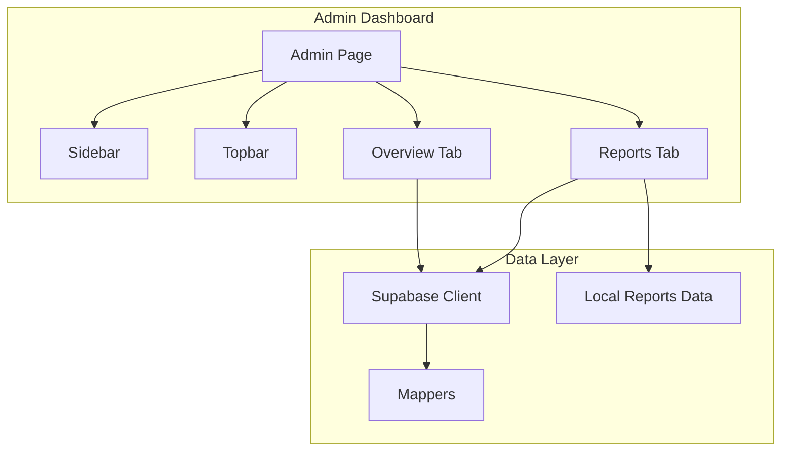
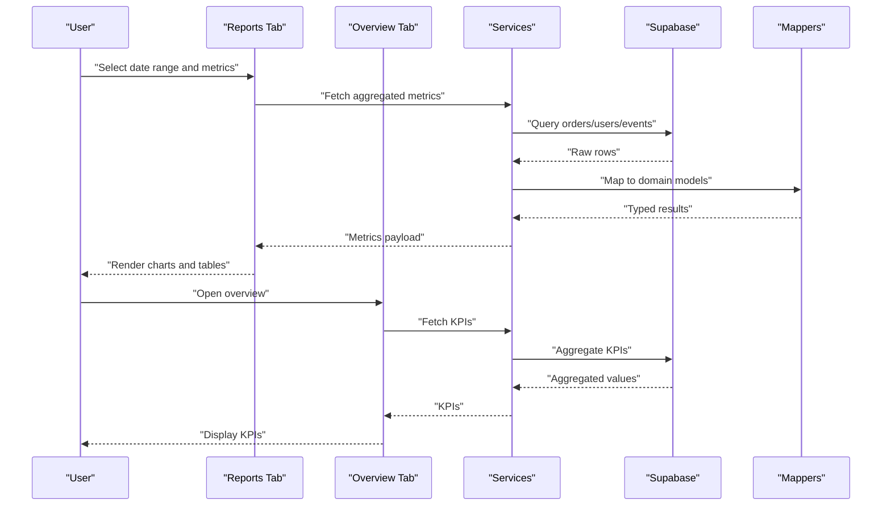
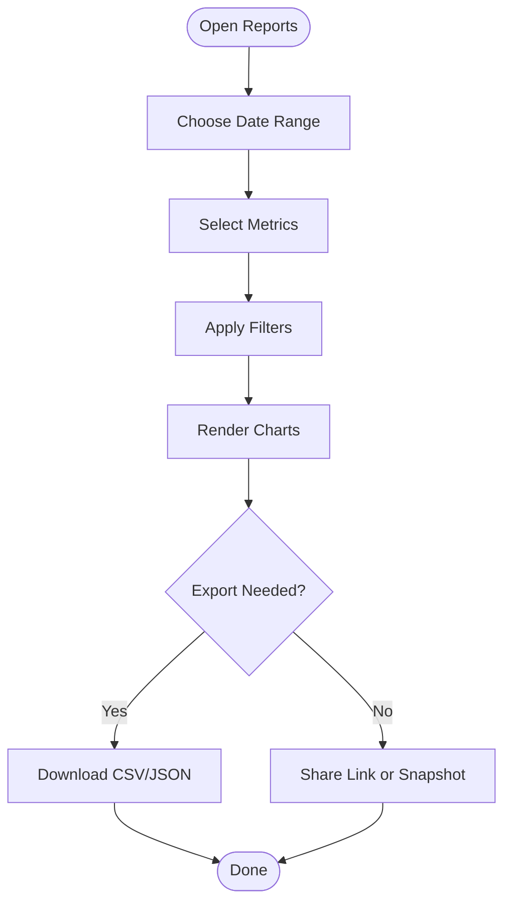
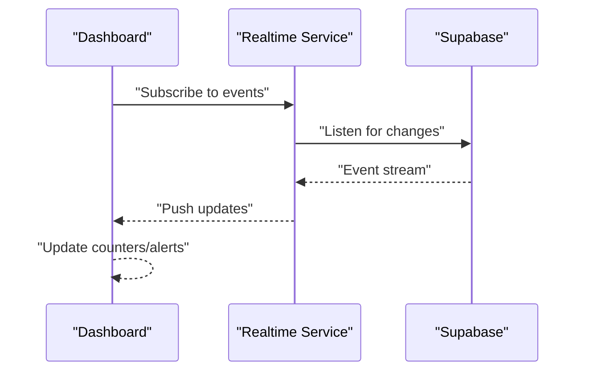
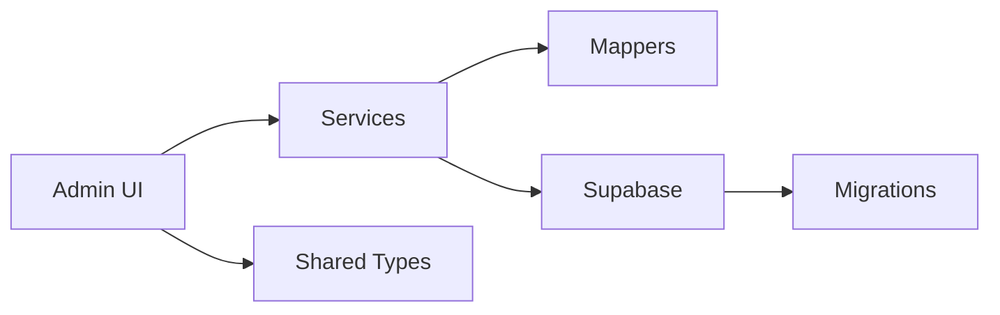

# Analytics and Reporting

<cite>
**Referenced Files in This Document**
- [AdminReportsTab.tsx](file://src/components/admin/AdminReportsTab.tsx)
- [AdminOverviewTab.tsx](file://src/components/admin/AdminOverviewTab.tsx)
- [AdminSidebar.tsx](file://src/components/admin/AdminSidebar.tsx)
- [AdminTopbar.tsx](file://src/components/admin/AdminTopbar.tsx)
- [AdminTypes.ts](file://src/components/admin/AdminTypes.ts)
- [reports.ts](file://src/data/reports.ts)
- [page.tsx](file://src/app/admin/page.tsx)
- [supabase.ts](file://src/services/backend/supabase.ts)
- [mappers.ts](file://src/services/backend/mappers.ts)
- [orders-migration.test.ts](file://src/services/backend/orders-migration.test.ts)
- [realtime.test.ts](file://src/services/backend/realtime.test.ts)
</cite>

## Table of Contents
1. [Introduction](#introduction)
2. [Project Structure](#project-structure)
3. [Core Components](#core-components)
4. [Architecture Overview](#architecture-overview)
5. [Detailed Component Analysis](#detailed-component-analysis)
6. [Dependency Analysis](#dependency-analysis)
7. [Performance Considerations](#performance-considerations)
8. [Troubleshooting Guide](#troubleshooting-guide)
9. [Conclusion](#conclusion)
10. [Appendices](#appendices)

## Introduction
This document explains the analytics and reporting capabilities available in the administrative dashboard. It covers the reporting dashboard, key performance indicators (KPIs), user engagement metrics, platform growth analytics, custom report generation, data visualization tools, export capabilities, real-time monitoring, alert systems, performance metrics tracking, scheduling, automated insights, and integration with business intelligence tools. Guidance is provided for interpreting analytics data, identifying trends, and making data-driven decisions. Common reporting scenarios and best practices are included to help administrators get value from the system quickly.

## Project Structure
The analytics and reporting features are primarily implemented within the admin section of the application:
- Admin UI components render tabs for overview and reports, a sidebar for navigation, and a topbar for context controls.
- Data sources include local mock datasets and backend services that connect to the database via Supabase.
- Types define shared structures used across admin components and services.

**Diagram sources**
- [page.tsx:1-200](file://src/app/admin/page.tsx#L1-L200)
- [AdminSidebar.tsx:1-200](file://src/components/admin/AdminSidebar.tsx#L1-L200)
- [AdminTopbar.tsx:1-200](file://src/components/admin/AdminTopbar.tsx#L1-L200)
- [AdminOverviewTab.tsx:1-200](file://src/components/admin/AdminOverviewTab.tsx#L1-L200)
- [AdminReportsTab.tsx:1-200](file://src/components/admin/AdminReportsTab.tsx#L1-L200)
- [supabase.ts:1-200](file://src/services/backend/supabase.ts#L1-L200)
- [mappers.ts:1-200](file://src/services/backend/mappers.ts#L1-L200)
- [reports.ts:1-200](file://src/data/reports.ts#L1-L200)

**Section sources**
- [page.tsx:1-200](file://src/app/admin/page.tsx#L1-L200)
- [AdminSidebar.tsx:1-200](file://src/components/admin/AdminSidebar.tsx#L1-L200)
- [AdminTopbar.tsx:1-200](file://src/components/admin/AdminTopbar.tsx#L1-L200)
- [AdminOverviewTab.tsx:1-200](file://src/components/admin/AdminOverviewTab.tsx#L1-L200)
- [AdminReportsTab.tsx:1-200](file://src/components/admin/AdminReportsTab.tsx#L1-L200)
- [supabase.ts:1-200](file://src/services/backend/supabase.ts#L1-L200)
- [mappers.ts:1-200](file://src/services/backend/mappers.ts#L1-L200)
- [reports.ts:1-200](file://src/data/reports.ts#L1-L200)

## Core Components
- Admin Reports Tab: Provides the primary interface for generating, filtering, and viewing reports. Supports time range selection, metric selection, grouping, and export actions.
- Admin Overview Tab: Displays high-level KPIs such as revenue, orders, users, and engagement metrics at a glance.
- Admin Sidebar and Topbar: Navigation and contextual controls for switching between dashboards and adjusting filters or date ranges.
- Types: Shared type definitions ensure consistent data shapes across UI and services.
- Data Sources: Local mock reports for quick development and testing; Supabase-backed queries for production-grade analytics.

Key responsibilities:
- Aggregation and presentation of KPIs and metrics
- Filtering by date ranges, categories, and other dimensions
- Exporting results to CSV/JSON where supported
- Real-time updates when connected to live streams

**Section sources**
- [AdminReportsTab.tsx:1-200](file://src/components/admin/AdminReportsTab.tsx#L1-L200)
- [AdminOverviewTab.tsx:1-200](file://src/components/admin/AdminOverviewTab.tsx#L1-L200)
- [AdminSidebar.tsx:1-200](file://src/components/admin/AdminSidebar.tsx#L1-L200)
- [AdminTopbar.tsx:1-200](file://src/components/admin/AdminTopbar.tsx#L1-L200)
- [AdminTypes.ts:1-200](file://src/components/admin/AdminTypes.ts#L1-L200)
- [reports.ts:1-200](file://src/data/reports.ts#L1-L200)

## Architecture Overview
The analytics pipeline connects UI components to data sources through a service layer:
- UI components request metrics via typed hooks or functions.
- The service layer queries Supabase using mappers to transform rows into domain models.
- For rapid iteration, local mock data can be used as a fallback.
- Real-time subscriptions enable live updates for certain metrics.

**Diagram sources**
- [AdminReportsTab.tsx:1-200](file://src/components/admin/AdminReportsTab.tsx#L1-L200)
- [AdminOverviewTab.tsx:1-200](file://src/components/admin/AdminOverviewTab.tsx#L1-L200)
- [supabase.ts:1-200](file://src/services/backend/supabase.ts#L1-L200)
- [mappers.ts:1-200](file://src/services/backend/mappers.ts#L1-L200)

## Detailed Component Analysis

### Reporting Dashboard (Reports Tab)
Purpose:
- Generate custom reports by selecting metrics, dimensions, and filters.
- Visualize trends over time and compare cohorts.
- Export results for deeper analysis.

Key features:
- Time range selector (e.g., last 7/30/90 days, custom).
- Metric toggles (revenue, orders, users, engagement).
- Grouping by category, region, or seller.
- Export to CSV/JSON where enabled.

Common workflows:
- Create a monthly sales report grouped by product category.
- Compare user acquisition channels over the last quarter.
- Export order data for offline reconciliation.

**Diagram sources**
- [AdminReportsTab.tsx:1-200](file://src/components/admin/AdminReportsTab.tsx#L1-L200)
- [reports.ts:1-200](file://src/data/reports.ts#L1-L200)

**Section sources**
- [AdminReportsTab.tsx:1-200](file://src/components/admin/AdminReportsTab.tsx#L1-L200)
- [reports.ts:1-200](file://src/data/reports.ts#L1-L200)

### Overview Dashboard (KPIs)
Purpose:
- Provide an at-a-glance view of critical performance indicators.
- Highlight changes and anomalies to prompt timely action.

Typical KPIs:
- Revenue, orders, active users, conversion rate, average order value, refund rate.

Interpretation guidance:
- Track week-over-week and month-over-month changes.
- Correlate spikes/dips with marketing campaigns or operational events.

**Section sources**
- [AdminOverviewTab.tsx:1-200](file://src/components/admin/AdminOverviewTab.tsx#L1-L200)

### Real-Time Monitoring and Alerts
Purpose:
- Monitor live activity such as new orders, user sign-ups, or chat messages.
- Trigger alerts when thresholds are exceeded (e.g., sudden drop in conversions).

Implementation notes:
- Use real-time subscriptions to listen for relevant events.
- Surface alerts in the topbar or notification center.

**Diagram sources**
- [realtime.test.ts:1-200](file://src/services/backend/realtime.test.ts#L1-L200)
- [supabase.ts:1-200](file://src/services/backend/supabase.ts#L1-L200)

**Section sources**
- [realtime.test.ts:1-200](file://src/services/backend/realtime.test.ts#L1-L200)
- [supabase.ts:1-200](file://src/services/backend/supabase.ts#L1-L200)

### Custom Report Generation and Visualization
Capabilities:
- Build ad-hoc reports by combining multiple metrics and dimensions.
- Visualize data using charts and tables within the dashboard.
- Save frequently used report configurations for reuse.

Best practices:
- Limit result sets to improve performance.
- Use meaningful groupings to reveal actionable insights.
- Validate data quality before sharing reports.

**Section sources**
- [AdminReportsTab.tsx:1-200](file://src/components/admin/AdminReportsTab.tsx#L1-L200)
- [mappers.ts:1-200](file://src/services/backend/mappers.ts#L1-L200)

### Export Capabilities
Supported exports:
- CSV for spreadsheets and BI tools.
- JSON for programmatic consumption.

Guidelines:
- Include headers and metadata for clarity.
- Ensure sensitive fields are excluded unless necessary.
- Schedule recurring exports for automated pipelines.

**Section sources**
- [AdminReportsTab.tsx:1-200](file://src/components/admin/AdminReportsTab.tsx#L1-L200)

### Report Scheduling and Automated Insights
Features:
- Schedule periodic report generation and delivery.
- Automate insights by flagging significant changes or anomalies.
- Integrate with email or messaging platforms for distribution.

Operational tips:
- Set appropriate refresh intervals based on data volume.
- Configure retention policies for generated artifacts.
- Monitor job health and failures.

**Section sources**
- [AdminReportsTab.tsx:1-200](file://src/components/admin/AdminReportsTab.tsx#L1-L200)

### Integration with Business Intelligence Tools
Options:
- Connect exported CSV/JSON to BI platforms for advanced modeling.
- Use database views or materialized aggregates for efficient querying.
- Leverage API endpoints if available for direct ingestion.

Recommendations:
- Standardize column names and units.
- Maintain versioned schemas for stable integrations.
- Implement row-level security and audit trails.

**Section sources**
- [supabase.ts:1-200](file://src/services/backend/supabase.ts#L1-L200)
- [mappers.ts:1-200](file://src/services/backend/mappers.ts#L1-L200)

## Dependency Analysis
The analytics stack depends on:
- Admin UI components for interaction and visualization.
- Services for data access and transformation.
- Database migrations ensuring schema consistency for analytics.

**Diagram sources**
- [AdminReportsTab.tsx:1-200](file://src/components/admin/AdminReportsTab.tsx#L1-L200)
- [AdminOverviewTab.tsx:1-200](file://src/components/admin/AdminOverviewTab.tsx#L1-L200)
- [supabase.ts:1-200](file://src/services/backend/supabase.ts#L1-L200)
- [mappers.ts:1-200](file://src/services/backend/mappers.ts#L1-L200)
- [orders-migration.test.ts:1-200](file://src/services/backend/orders-migration.test.ts#L1-L200)

**Section sources**
- [orders-migration.test.ts:1-200](file://src/services/backend/orders-migration.test.ts#L1-L200)
- [supabase.ts:1-200](file://src/services/backend/supabase.ts#L1-L200)
- [mappers.ts:1-200](file://src/services/backend/mappers.ts#L1-L200)

## Performance Considerations
- Prefer server-side aggregation to reduce client load.
- Cache frequent queries and use pagination for large datasets.
- Optimize indexes on commonly filtered columns (dates, statuses).
- Debounce filter changes to avoid excessive requests.
- Use materialized views for heavy analytical queries.

[No sources needed since this section provides general guidance]

## Troubleshooting Guide
Common issues and resolutions:
- Missing or stale data: Verify migration status and seed data; re-run migrations if needed.
- Slow queries: Add indexes, limit result sets, and use aggregations.
- Realtime not updating: Check subscription scopes and permissions.
- Export errors: Validate field mappings and handle nulls gracefully.

Debugging steps:
- Inspect network requests and payloads.
- Review error logs and tracing information.
- Test with known datasets to isolate environment issues.

**Section sources**
- [orders-migration.test.ts:1-200](file://src/services/backend/orders-migration.test.ts#L1-L200)
- [realtime.test.ts:1-200](file://src/services/backend/realtime.test.ts#L1-L200)

## Conclusion
The analytics and reporting subsystem provides a robust foundation for monitoring platform performance, understanding user behavior, and driving growth. By leveraging KPIs, custom reports, real-time monitoring, and export capabilities, administrators can make informed, data-driven decisions. Adopting best practices around performance, data quality, and integration ensures long-term scalability and reliability.

[No sources needed since this section summarizes without analyzing specific files]

## Appendices

### Interpreting Analytics Data and Identifying Trends
- Establish baseline metrics and track changes over time.
- Segment by cohort, channel, or category to uncover patterns.
- Use seasonality and event calendars to contextualize fluctuations.
- Combine quantitative metrics with qualitative feedback for richer insights.

### Common Reporting Scenarios
- Monthly revenue and order volume report by category.
- User acquisition funnel analysis by source.
- Seller performance leaderboard with fulfillment metrics.
- Refund and dispute rate monitoring with root cause tagging.

### Best Practices for Data Analysis
- Define clear objectives and success metrics before building reports.
- Validate data sources and transformations regularly.
- Document assumptions, filters, and calculations.
- Version report definitions and maintain change logs.

[No sources needed since this section provides general guidance]