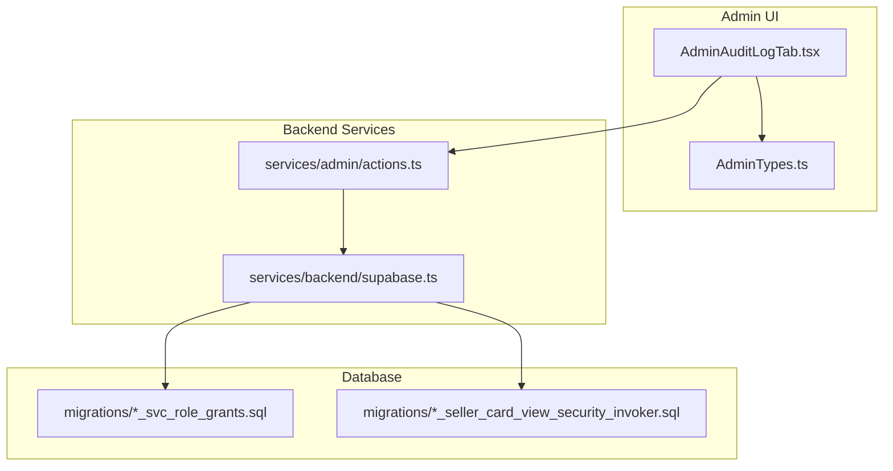
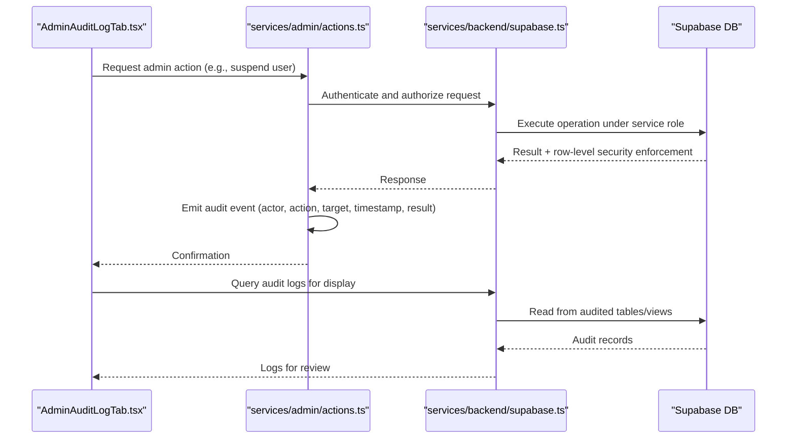
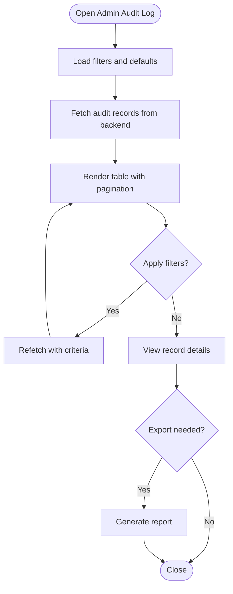
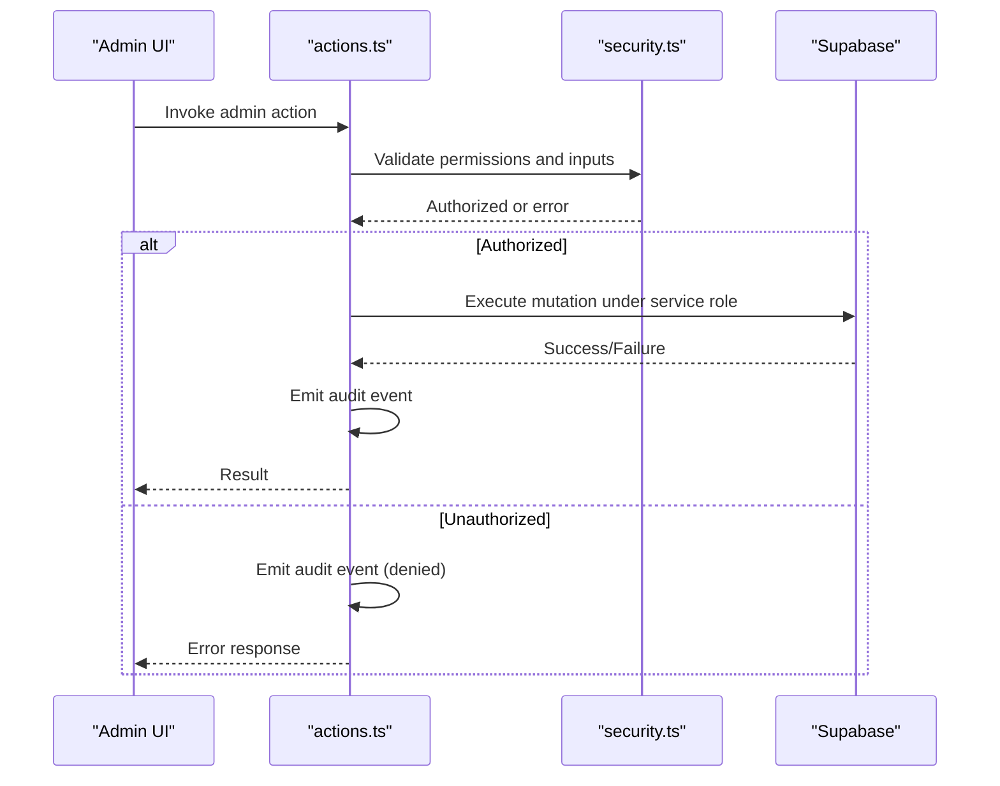
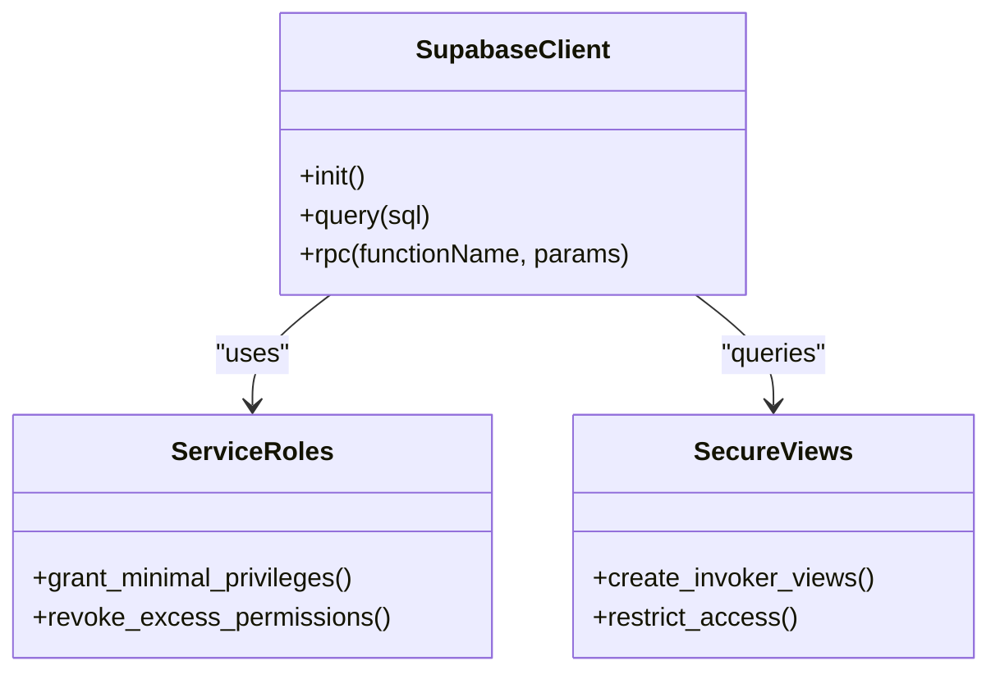
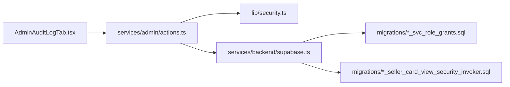

# Audit Logging and Security Monitoring

<cite>
**Referenced Files in This Document**
- [AdminAuditLogTab.tsx](file://src/components/admin/AdminAuditLogTab.tsx)
- [security.ts](file://src/lib/security.ts)
- [admin actions.ts](file://src/services/admin/actions.ts)
- [supabase.ts](file://src/services/backend/supabase.ts)
- [AdminTypes.ts](file://src/components/admin/AdminTypes.ts)
- [202608160503_svc_role_grants.sql](file://supabase/migrations/202608160503_svc_role_grants.sql)
- [202608160504_seller_card_view_security_invoker.sql](file://supabase/migrations/202608160504_seller_card_view_security_invoker.sql)
</cite>

## Table of Contents
1. [Introduction](#introduction)
2. [Project Structure](#project-structure)
3. [Core Components](#core-components)
4. [Architecture Overview](#architecture-overview)
5. [Detailed Component Analysis](#detailed-component-analysis)
6. [Dependency Analysis](#dependency-analysis)
7. [Performance Considerations](#performance-considerations)
8. [Troubleshooting Guide](#troubleshooting-guide)
9. [Conclusion](#conclusion)
10. [Appendices](#appendices)

## Introduction
This document explains the audit logging and security monitoring capabilities implemented in the application. It covers how administrative actions, user activities, and system changes are tracked; how security events are monitored and alerted; and how access logs, permission audits, and compliance reporting support incident investigation and forensic analysis. It also outlines log retention policies, data privacy considerations, and regulatory compliance requirements, along with procedures for responding to security incidents using audit data.

## Project Structure
The audit and security features span UI components, backend services, database migrations, and configuration:
- Admin UI for viewing audit logs and reports
- Backend services for admin actions and Supabase integration
- Database-level role grants and security invoker patterns
- Security utilities and types used across admin flows

**Diagram sources**
- [AdminAuditLogTab.tsx:1-200](file://src/components/admin/AdminAuditLogTab.tsx#L1-L200)
- [admin actions.ts:1-200](file://src/services/admin/actions.ts#L1-L200)
- [supabase.ts:1-200](file://src/services/backend/supabase.ts#L1-L200)
- [202608160503_svc_role_grants.sql:1-200](file://supabase/migrations/202608160503_svc_role_grants.sql#L1-L200)
- [202608160504_seller_card_view_security_invoker.sql:1-200](file://supabase/migrations/202608160504_seller_card_view_security_invoker.sql#L1-L200)

**Section sources**
- [AdminAuditLogTab.tsx:1-200](file://src/components/admin/AdminAuditLogTab.tsx#L1-L200)
- [admin actions.ts:1-200](file://src/services/admin/actions.ts#L1-L200)
- [supabase.ts:1-200](file://src/services/backend/supabase.ts#L1-L200)
- [202608160503_svc_role_grants.sql:1-200](file://supabase/migrations/202608160503_svc_role_grants.sql#L1-L200)
- [202608160504_seller_card_view_security_invoker.sql:1-200](file://supabase/migrations/202608160504_seller_card_view_security_invoker.sql#L1-L200)

## Core Components
- Admin audit log tab: Provides a UI to view, filter, and export audit entries related to administrative actions and system changes.
- Admin actions service: Orchestrates privileged operations (e.g., user management, listing moderation) and emits audit events.
- Supabase integration: Handles authenticated requests, enforces roles, and executes database operations securely.
- Security utilities: Provide helpers for validation, authorization checks, and safe handling of sensitive inputs.
- Database migrations: Define service roles and secure views that enforce least privilege and enable auditable queries.

Key responsibilities:
- Capture who did what, when, and from where for all administrative actions.
- Track user-facing activities that impact data integrity or security posture.
- Enforce least privilege via service roles and secure views.
- Support compliance reporting and incident investigation through structured audit trails.

**Section sources**
- [AdminAuditLogTab.tsx:1-200](file://src/components/admin/AdminAuditLogTab.tsx#L1-L200)
- [admin actions.ts:1-200](file://src/services/admin/actions.ts#L1-L200)
- [supabase.ts:1-200](file://src/services/backend/supabase.ts#L1-L200)
- [security.ts:1-200](file://src/lib/security.ts#L1-L200)
- [AdminTypes.ts:1-200](file://src/components/admin/AdminTypes.ts#L1-L200)

## Architecture Overview
The audit and security architecture combines UI, service layer, and database controls to ensure comprehensive tracking and protection:

**Diagram sources**
- [AdminAuditLogTab.tsx:1-200](file://src/components/admin/AdminAuditLogTab.tsx#L1-L200)
- [admin actions.ts:1-200](file://src/services/admin/actions.ts#L1-L200)
- [supabase.ts:1-200](file://src/services/backend/supabase.ts#L1-L200)
- [202608160503_svc_role_grants.sql:1-200](file://supabase/migrations/202608160503_svc_role_grants.sql#L1-L200)
- [202608160504_seller_card_view_security_invoker.sql:1-200](file://supabase/migrations/202608160504_seller_card_view_security_invoker.sql#L1-L200)

## Detailed Component Analysis

### Admin Audit Log Tab
- Purpose: Displays audit entries for administrative actions and system changes, enabling filtering by actor, action type, date range, and outcome.
- Capabilities:
  - Paginated listing of audit records
  - Filtering by action category and status
  - Export functionality for compliance reporting
  - Drill-down into details such as IP address, user agent, and affected resources
- Integration: Fetches data via backend services and renders structured views for analysts.

**Diagram sources**
- [AdminAuditLogTab.tsx:1-200](file://src/components/admin/AdminAuditLogTab.tsx#L1-L200)

**Section sources**
- [AdminAuditLogTab.tsx:1-200](file://src/components/admin/AdminAuditLogTab.tsx#L1-L200)

### Admin Actions Service
- Purpose: Centralizes privileged operations and ensures every action is audited.
- Responsibilities:
  - Validate inputs and permissions before execution
  - Perform database mutations under restricted service roles
  - Emit structured audit events capturing actor, action, target, context, and result
  - Handle errors and surface actionable messages to the UI
- Security: Uses role-based checks and least-privilege database roles to limit exposure.

**Diagram sources**
- [admin actions.ts:1-200](file://src/services/admin/actions.ts#L1-L200)
- [security.ts:1-200](file://src/lib/security.ts#L1-L200)
- [supabase.ts:1-200](file://src/services/backend/supabase.ts#L1-L200)

**Section sources**
- [admin actions.ts:1-200](file://src/services/admin/actions.ts#L1-L200)
- [security.ts:1-200](file://src/lib/security.ts#L1-L200)

### Supabase Integration and Roles
- Purpose: Securely execute database operations and enforce least privilege via service roles and secure views.
- Key aspects:
  - Role grants define minimal privileges required for admin operations
  - Security invoker patterns restrict direct table access and route operations through controlled functions/views
  - Consistent client initialization ensures authenticated context propagation

**Diagram sources**
- [supabase.ts:1-200](file://src/services/backend/supabase.ts#L1-L200)
- [202608160503_svc_role_grants.sql:1-200](file://supabase/migrations/202608160503_svc_role_grants.sql#L1-L200)
- [202608160504_seller_card_view_security_invoker.sql:1-200](file://supabase/migrations/202608160504_seller_card_view_security_invoker.sql#L1-L200)

**Section sources**
- [supabase.ts:1-200](file://src/services/backend/supabase.ts#L1-L200)
- [202608160503_svc_role_grants.sql:1-200](file://supabase/migrations/202608160503_svc_role_grants.sql#L1-L200)
- [202608160504_seller_card_view_security_invoker.sql:1-200](file://supabase/migrations/202608160504_seller_card_view_security_invoker.sql#L1-L200)

### Security Utilities and Types
- Purpose: Provide reusable helpers for input validation, authorization checks, and consistent typing for audit events and admin operations.
- Highlights:
  - Input sanitization and schema validation
  - Permission checks aligned with RBAC model
  - Typed structures for audit payloads ensuring consistency across services

**Section sources**
- [security.ts:1-200](file://src/lib/security.ts#L1-L200)
- [AdminTypes.ts:1-200](file://src/components/admin/AdminTypes.ts#L1-L200)

## Dependency Analysis
- UI depends on admin actions service for performing privileged operations and retrieving audit logs.
- Admin actions service depends on security utilities for validation and authorization, and on Supabase client for data access.
- Database layer enforces least privilege via service roles and secure views, reducing risk of unauthorized access.
- Migrations establish the foundational security model and must be applied consistently across environments.

**Diagram sources**
- [AdminAuditLogTab.tsx:1-200](file://src/components/admin/AdminAuditLogTab.tsx#L1-L200)
- [admin actions.ts:1-200](file://src/services/admin/actions.ts#L1-L200)
- [security.ts:1-200](file://src/lib/security.ts#L1-L200)
- [supabase.ts:1-200](file://src/services/backend/supabase.ts#L1-L200)
- [202608160503_svc_role_grants.sql:1-200](file://supabase/migrations/202608160503_svc_role_grants.sql#L1-L200)
- [202608160504_seller_card_view_security_invoker.sql:1-200](file://supabase/migrations/202608160504_seller_card_view_security_invoker.sql#L1-L200)

**Section sources**
- [AdminAuditLogTab.tsx:1-200](file://src/components/admin/AdminAuditLogTab.tsx#L1-L200)
- [admin actions.ts:1-200](file://src/services/admin/actions.ts#L1-L200)
- [security.ts:1-200](file://src/lib/security.ts#L1-L200)
- [supabase.ts:1-200](file://src/services/backend/supabase.ts#L1-L200)
- [202608160503_svc_role_grants.sql:1-200](file://supabase/migrations/202608160503_svc_role_grants.sql#L1-L200)
- [202608160504_seller_card_view_security_invoker.sql:1-200](file://supabase/migrations/202608160504_seller_card_view_security_invoker.sql#L1-L200)

## Performance Considerations
- Pagination and server-side filtering for audit logs to handle large datasets efficiently.
- Indexing strategies on audit tables for common query patterns (actor, timestamp, action type).
- Batched writes for high-volume audit events to reduce database load.
- Caching frequently accessed metadata (e.g., actor names) to minimize repeated lookups.
- Asynchronous emission of audit events to avoid blocking critical user flows.

[No sources needed since this section provides general guidance]

## Troubleshooting Guide
Common issues and resolutions:
- Missing audit entries:
  - Verify that admin actions service emits audit events for all privileged operations.
  - Check database triggers or write paths that capture audit data.
- Access denied errors:
  - Confirm service roles and grants are correctly applied via migrations.
  - Ensure secure views are invoked instead of direct table access.
- Slow audit log queries:
  - Add indexes on commonly filtered columns (actor_id, created_at, action_type).
  - Use pagination and server-side filters to limit result sets.
- Data privacy concerns:
  - Mask sensitive fields in logs and exports.
  - Restrict access to raw audit data to authorized personnel only.

**Section sources**
- [admin actions.ts:1-200](file://src/services/admin/actions.ts#L1-L200)
- [supabase.ts:1-200](file://src/services/backend/supabase.ts#L1-L200)
- [202608160503_svc_role_grants.sql:1-200](file://supabase/migrations/202608160503_svc_role_grants.sql#L1-L200)
- [202608160504_seller_card_view_security_invoker.sql:1-200](file://supabase/migrations/202608160504_seller_card_view_security_invoker.sql#L1-L200)

## Conclusion
The audit logging and security monitoring implementation provides a robust foundation for tracking administrative actions, user activities, and system changes. Through structured audit events, least-privilege database roles, and secure views, the system supports compliance reporting, incident investigation, and forensic analysis. Proper indexing, pagination, and masking ensure performance and privacy while maintaining comprehensive visibility.

[No sources needed since this section summarizes without analyzing specific files]

## Appendices

### Audit Trail Schema and Fields
- Actor identity: unique identifier and role
- Action type: categorized administrative or system change
- Target resource: entity modified or accessed
- Context: IP address, user agent, session info
- Timestamp: precise time of occurrence
- Outcome: success, failure, or denial
- Correlation ID: links related events across services

[No sources needed since this section describes conceptual schema]

### Security Event Monitoring and Alerting
- Monitor for anomalies such as repeated failed attempts, unusual admin actions, or bulk modifications.
- Implement thresholds and rules to trigger alerts for suspicious activity.
- Integrate with alerting channels for rapid response.

[No sources needed since this section provides general guidance]

### Log Retention and Data Privacy
- Define retention periods aligned with regulatory requirements.
- Archive older logs securely with encryption at rest and in transit.
- Anonymize or mask personally identifiable information in logs where appropriate.
- Restrict access to audit data to authorized roles only.

[No sources needed since this section provides general guidance]

### Regulatory Compliance
- Align audit practices with applicable regulations (e.g., GDPR, CCPA, SOC 2).
- Maintain evidence of access controls, change management, and incident response.
- Periodically review and update policies to reflect evolving requirements.

[No sources needed since this section provides general guidance]

### Incident Response Procedures Using Audit Data
- Identify scope and timeline using filtered audit logs.
- Correlate events across services to reconstruct attack paths.
- Preserve evidence by exporting immutable audit records.
- Remediate vulnerabilities and update policies based on findings.

[No sources needed since this section provides general guidance]