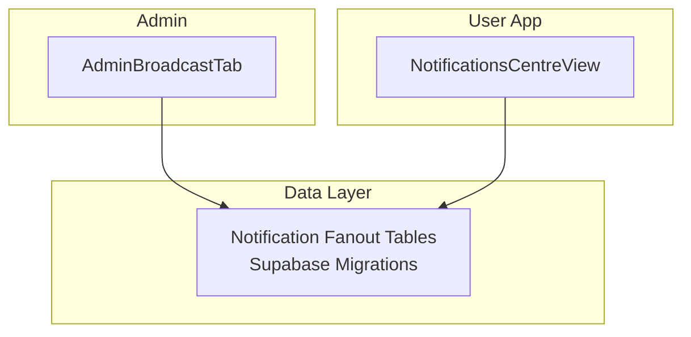
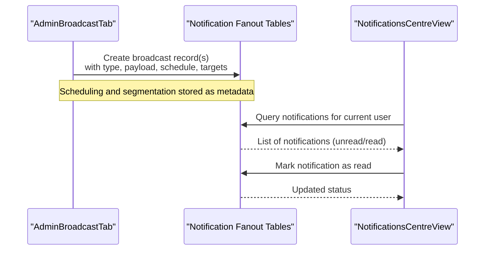
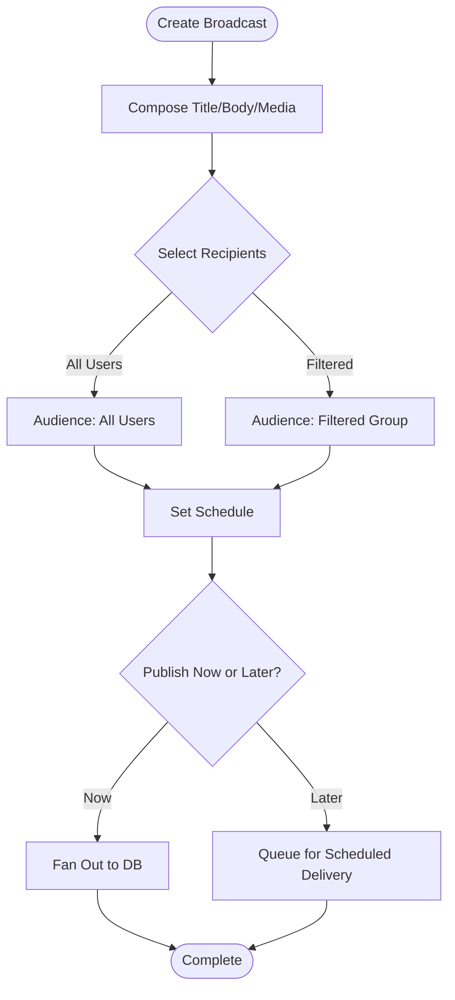
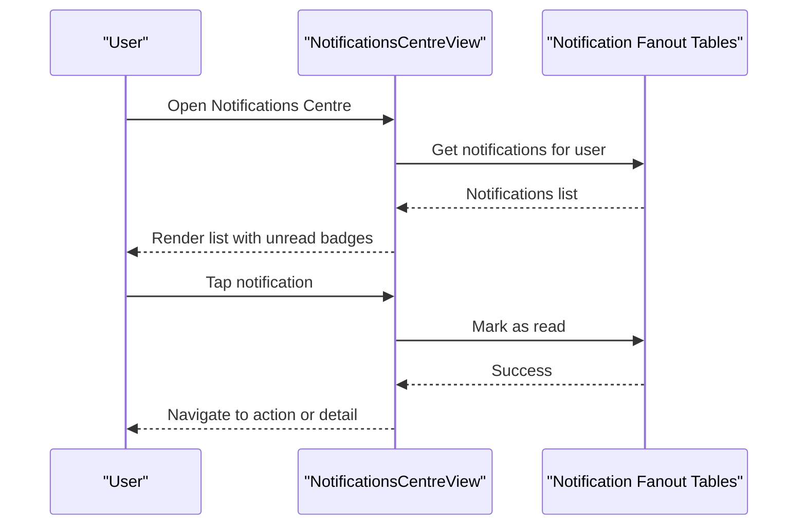
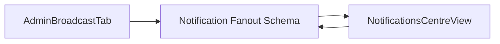

# Broadcast Messaging and Announcements

<cite>
**Referenced Files in This Document**
- [AdminBroadcastTab.tsx](file://src/components/admin/AdminBroadcastTab.tsx)
- [NotificationsCentreView.tsx](file://src/components/NotificationsCentreView.tsx)
- [notifications.ts](file://src/data/notifications.ts)
- [202608060004_notification_fanout.sql](file://supabase/migrations/202608060004_notification_fanout.sql)
- [202608200002_extend_notification_fanout.sql](file://supabase/migrations/202608200002_extend_notification_fanout.sql)
- [progress-u17-polish.md](file://docs/progress-u17-polish.md)
- [progress-u19-u20-backup-deploy.md](file://docs/progress-u19-u20-backup-deploy.md)
- [README.md](file://README.md)
</cite>

## Table of Contents
1. Introduction
2. Project Structure
3. Core Components
4. Architecture Overview
5. Detailed Component Analysis
6. Dependency Analysis
7. Performance Considerations
8. Troubleshooting Guide
9. Conclusion
10. Appendices

## Introduction
This document explains the broadcast messaging and announcement system for the application. It covers how platform-wide announcements are created and managed, how targeted user communications are delivered, and how scheduled messaging campaigns can be implemented. It also documents notification delivery mechanisms, message templates, personalization options, recipient segmentation, scheduling, delivery tracking, communication policies, approval workflows, compliance considerations, formatting and media support, accessibility requirements, effective communication strategies, and troubleshooting delivery issues.

## Project Structure
The broadcast and announcement capabilities span UI components, data models, and database migrations:
- Admin broadcast authoring and management is provided by an admin tab component.
- User-facing notifications are displayed via a notifications center view.
- Notification storage and fan-out are defined by Supabase migrations.
- Documentation artifacts describe polish and deployment-related updates that may affect notifications.

**Diagram sources**
- [AdminBroadcastTab.tsx:1-200](file://src/components/admin/AdminBroadcastTab.tsx#L1-L200)
- [NotificationsCentreView.tsx:1-200](file://src/components/NotificationsCentreView.tsx#L1-L200)
- [202608060004_notification_fanout.sql:1-200](file://supabase/migrations/202608060004_notification_fanout.sql#L1-L200)
- [202608200002_extend_notification_fanout.sql:1-200](file://supabase/migrations/202608200002_extend_notification_fanout.sql#L1-L200)

**Section sources**
- [AdminBroadcastTab.tsx:1-200](file://src/components/admin/AdminBroadcastTab.tsx#L1-L200)
- [NotificationsCentreView.tsx:1-200](file://src/components/NotificationsCentreView.tsx#L1-L200)
- [202608060004_notification_fanout.sql:1-200](file://supabase/migrations/202608060004_notification_fanout.sql#L1-L200)
- [202608200002_extend_notification_fanout.sql:1-200](file://supabase/migrations/202608200002_extend_notification_fanout.sql#L1-L200)

## Core Components
- Admin Broadcast Tab: Provides the interface for creating, editing, segmenting, scheduling, and publishing platform-wide announcements or broadcasts to users.
- Notifications Centre View: Displays received notifications for the current user, supports reading status, and allows navigation into related actions.
- Notification Data Model: Defines the structure of notifications including type, payload, visibility, and timestamps.
- Database Schema (Fanout): Stores per-user notifications and supports efficient querying and updates for read/unread states and filtering.

Key responsibilities:
- Authoring and publishing announcements from the admin panel.
- Persisting notifications with metadata for targeting and scheduling.
- Rendering and managing user notifications in the app.
- Tracking delivery state through read/unread flags and timestamps.

**Section sources**
- [AdminBroadcastTab.tsx:1-200](file://src/components/admin/AdminBroadcastTab.tsx#L1-L200)
- [NotificationsCentreView.tsx:1-200](file://src/components/NotificationsCentreView.tsx#L1-L200)
- [notifications.ts:1-200](file://src/data/notifications.ts#L1-L200)
- [202608060004_notification_fanout.sql:1-200](file://supabase/migrations/202608060004_notification_fanout.sql#L1-L200)
- [202608200002_extend_notification_fanout.sql:1-200](file://supabase/migrations/202608200002_extend_notification_fanout.sql#L1-L200)

## Architecture Overview
The broadcast system follows a publish-subscribe pattern:
- Admin creates and schedules a broadcast.
- The system fans out notifications to target recipients in the database.
- Users receive notifications in their Notifications Centre.
- Read/unread status and metadata enable tracking and personalization.

**Diagram sources**
- [AdminBroadcastTab.tsx:1-200](file://src/components/admin/AdminBroadcastTab.tsx#L1-L200)
- [NotificationsCentreView.tsx:1-200](file://src/components/NotificationsCentreView.tsx#L1-L200)
- [202608060004_notification_fanout.sql:1-200](file://supabase/migrations/202608060004_notification_fanout.sql#L1-L200)
- [202608200002_extend_notification_fanout.sql:1-200](file://supabase/migrations/202608200002_extend_notification_fanout.sql#L1-L200)

## Detailed Component Analysis

### Admin Broadcast Tab
Responsibilities:
- Compose announcements with title, body, optional media, and template variables.
- Segment recipients by user attributes or tags.
- Schedule messages for future delivery.
- Publish and manage existing broadcasts.

Operational flow:
- Draft creation with validation and preview.
- Segmentation selection and audience scoping.
- Scheduling configuration and confirmation.
- Publishing triggers fan-out to the notification store.

**Diagram sources**
- [AdminBroadcastTab.tsx:1-200](file://src/components/admin/AdminBroadcastTab.tsx#L1-L200)
- [202608060004_notification_fanout.sql:1-200](file://supabase/migrations/202608060004_notification_fanout.sql#L1-L200)

**Section sources**
- [AdminBroadcastTab.tsx:1-200](file://src/components/admin/AdminBroadcastTab.tsx#L1-L200)

### Notifications Centre View
Responsibilities:
- Display notifications for the current user.
- Support marking items as read.
- Provide context-aware actions based on notification type.

Operational flow:
- Fetch notifications filtered by user and status.
- Render list with unread indicators.
- On interaction, update read status and navigate if applicable.

**Diagram sources**
- [NotificationsCentreView.tsx:1-200](file://src/components/NotificationsCentreView.tsx#L1-L200)
- [202608060004_notification_fanout.sql:1-200](file://supabase/migrations/202608060004_notification_fanout.sql#L1-L200)

**Section sources**
- [NotificationsCentreView.tsx:1-200](file://src/components/NotificationsCentreView.tsx#L1-L200)

### Notification Data Model
Purpose:
- Define consistent fields for notification type, payload, visibility, and timestamps.
- Enable personalization via structured payloads.
- Support filtering and sorting by date and read status.

Key aspects:
- Type categorization for different broadcast categories.
- Payload structure for templating and deep linking.
- Timestamps for scheduling and display ordering.

**Section sources**
- [notifications.ts:1-200](file://src/data/notifications.ts#L1-L200)

### Database Schema (Notification Fanout)
Purpose:
- Store per-user notifications efficiently.
- Support read/unread tracking and filtering.
- Allow extension for additional metadata and scheduling.

Capabilities:
- Fan-out model ensures scalable writes for broadcasts.
- Indexes and constraints optimize queries for user-centric views.
- Migration extensions add fields for advanced features like scheduling and targeting.

**Section sources**
- [202608060004_notification_fanout.sql:1-200](file://supabase/migrations/202608060004_notification_fanout.sql#L1-L200)
- [202608200002_extend_notification_fanout.sql:1-200](file://supabase/migrations/202608200002_extend_notification_fanout.sql#L1-L200)

## Dependency Analysis
The broadcast system depends on:
- Admin UI for authoring and scheduling.
- Database schema for persistence and fan-out.
- User UI for consumption and interaction.

**Diagram sources**
- [AdminBroadcastTab.tsx:1-200](file://src/components/admin/AdminBroadcastTab.tsx#L1-L200)
- [NotificationsCentreView.tsx:1-200](file://src/components/NotificationsCentreView.tsx#L1-L200)
- [202608060004_notification_fanout.sql:1-200](file://supabase/migrations/202608060004_notification_fanout.sql#L1-L200)

**Section sources**
- [AdminBroadcastTab.tsx:1-200](file://src/components/admin/AdminBroadcastTab.tsx#L1-L200)
- [NotificationsCentreView.tsx:1-200](file://src/components/NotificationsCentreView.tsx#L1-L200)
- [202608060004_notification_fanout.sql:1-200](file://supabase/migrations/202608060004_notification_fanout.sql#L1-L200)

## Performance Considerations
- Use fan-out tables to avoid expensive joins when rendering user notifications.
- Keep payloads compact; prefer IDs and references for heavy content.
- Index query patterns used by the Notifications Centre (user ID, read status, timestamp).
- Batch fan-out operations during scheduled deliveries to reduce write load.
- Cache recent notifications client-side to minimize repeated reads.

[No sources needed since this section provides general guidance]

## Troubleshooting Guide
Common issues and resolutions:
- Notifications not appearing:
  - Verify fan-out records exist for the user and are not filtered out by status or date.
  - Check that the Notifications Centre queries include the correct filters.
- Read status not updating:
  - Ensure mark-as-read calls succeed and reflect in the database.
  - Confirm UI re-renders after updates.
- Scheduled messages not delivered:
  - Validate scheduling metadata and cron-like processes if used.
  - Inspect logs around scheduled job execution windows.
- Personalization placeholders not resolved:
  - Confirm payload contains required variables and templates render them correctly.

Operational checks:
- Review recent migrations for schema changes affecting notifications.
- Cross-check documentation notes about polish and deployment updates that might impact behavior.

**Section sources**
- [202608060004_notification_fanout.sql:1-200](file://supabase/migrations/202608060004_notification_fanout.sql#L1-L200)
- [202608200002_extend_notification_fanout.sql:1-200](file://supabase/migrations/202608200002_extend_notification_fanout.sql#L1-L200)
- [progress-u17-polish.md:1-200](file://docs/progress-u17-polish.md#L1-L200)
- [progress-u19-u20-backup-deploy.md:1-200](file://docs/progress-u19-u20-backup-deploy.md#L1-L200)

## Conclusion
The broadcast messaging and announcement system combines an admin authoring interface, a robust fan-out database schema, and a user-facing notifications center. It supports platform-wide announcements, targeted communications, and scheduled campaigns through structured payloads and metadata. With careful attention to performance, accessibility, and compliance, the system enables reliable, personalized, and trackable messaging at scale.

[No sources needed since this section summarizes without analyzing specific files]

## Appendices

### Message Templates and Personalization
- Use structured payloads to inject user-specific values such as names, roles, or contextual IDs.
- Maintain a library of templates categorized by broadcast type for consistency.
- Validate template variables before sending to prevent broken messages.

[No sources needed since this section provides general guidance]

### Recipient Segmentation
- Segment by user attributes (e.g., role, region, activity level) stored in user profiles or tags.
- Combine multiple criteria to narrow audiences for precise targeting.
- Avoid overly broad segments for sensitive announcements to reduce noise.

[No sources needed since this section provides general guidance]

### Message Scheduling
- Configure schedules using timestamps and ensure timezone handling is consistent.
- Implement retry logic for failed scheduled deliveries.
- Monitor scheduled jobs and alert on failures.

[No sources needed since this section provides general guidance]

### Delivery Tracking
- Track sent, delivered, and read statuses via database fields.
- Expose metrics in admin dashboards for volume, latency, and success rates.
- Use analytics to understand engagement with broadcasts.

[No sources needed since this section provides general guidance]

### Communication Policies and Approval Workflows
- Require approvals for high-impact broadcasts (e.g., site-wide maintenance, policy changes).
- Enforce review steps in the admin workflow before publishing.
- Log all broadcast actions for auditability.

[No sources needed since this section provides general guidance]

### Compliance Considerations
- Respect user preferences and opt-outs where applicable.
- Include clear identification of sender and purpose in messages.
- Retain minimal necessary data and provide user controls for notification settings.

[No sources needed since this section provides general guidance]

### Formatting, Media, and Accessibility
- Limit media size and format to ensure fast loading and compatibility.
- Provide alt text for images and captions for videos.
- Ensure color contrast and readable typography for screen readers.

[No sources needed since this section provides general guidance]

### Effective Communication Strategies
- Be concise and actionable; highlight key information first.
- Use clear subject lines and previews to improve open rates.
- Segment audiences to increase relevance and reduce fatigue.

[No sources needed since this section provides general guidance]

### References
- Project overview and scope.

**Section sources**
- [README.md:1-200](file://README.md#L1-L200)