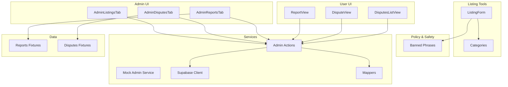
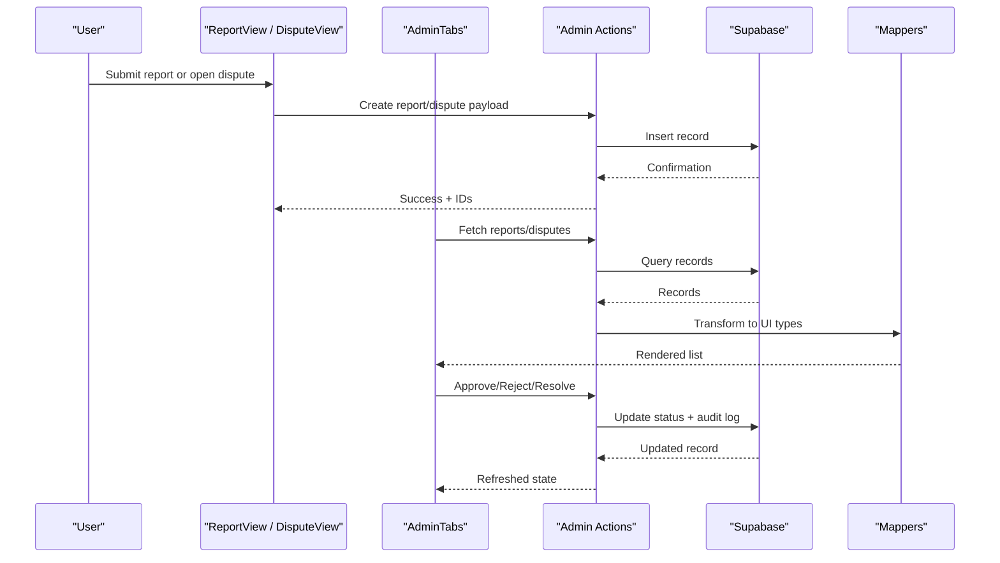
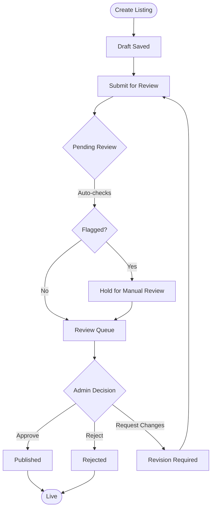
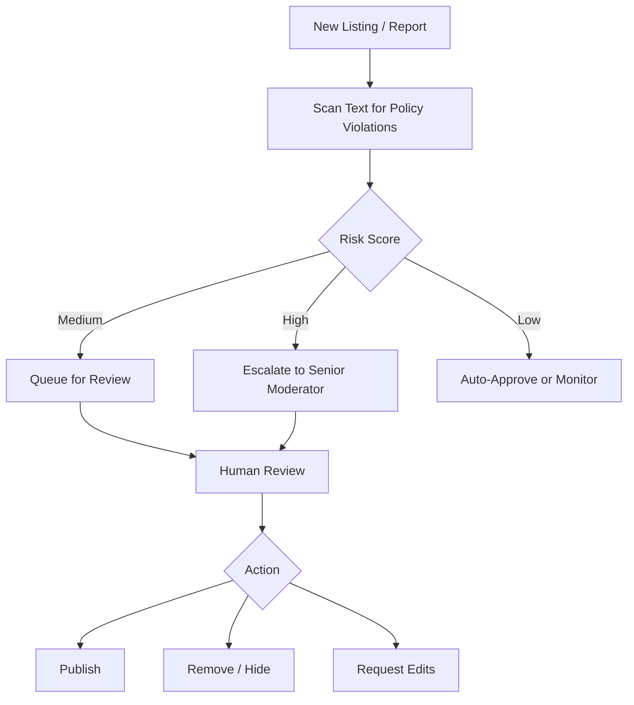
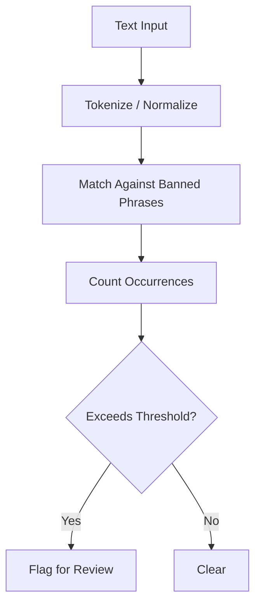
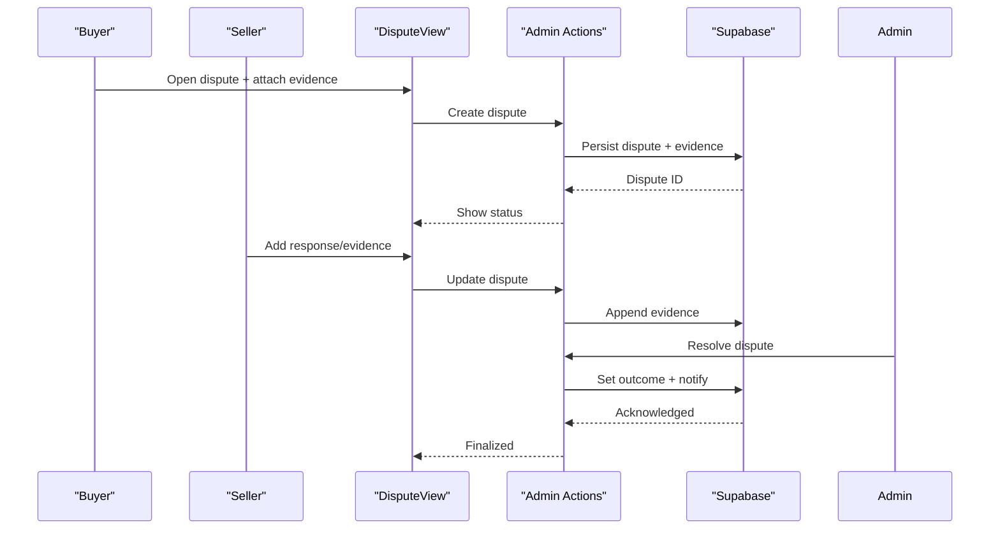
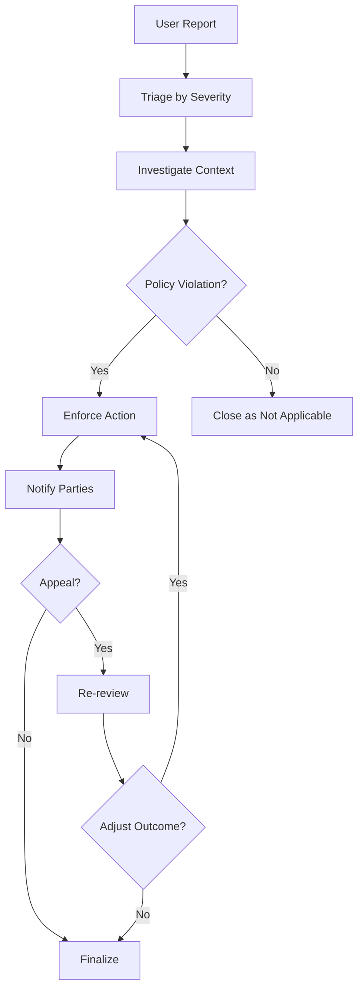
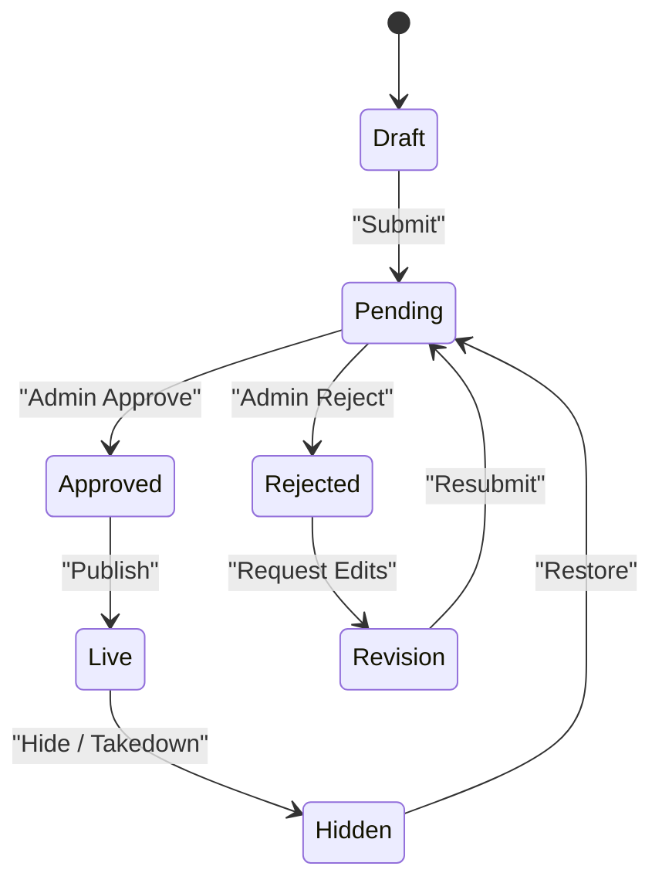
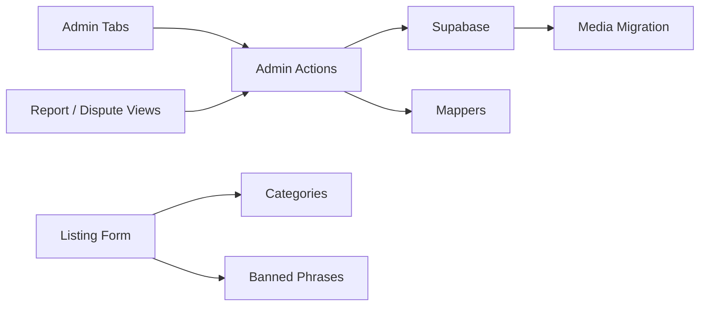

# Content Moderation and Listings

<cite>
**Referenced Files in This Document**
- [AdminListingsTab.tsx](file://src/components/admin/AdminListingsTab.tsx)
- [AdminDisputesTab.tsx](file://src/components/admin/AdminDisputesTab.tsx)
- [AdminReportsTab.tsx](file://src/components/admin/AdminReportsTab.tsx)
- [AdminTypes.ts](file://src/components/admin/AdminTypes.ts)
- [ReportView.tsx](file://src/components/ReportView.tsx)
- [DisputeView.tsx](file://src/components/DisputeView.tsx)
- [DisputesListView.tsx](file://src/components/DisputesListView.tsx)
- [ListingForm.tsx](file://src/components/listing/ListingForm.tsx)
- [categories.ts](file://src/data/categories.ts)
- [reports.ts](file://src/data/reports.ts)
- [disputes.ts](file://src/data/disputes.ts)
- [banned-phrases.ts](file://src/lib/banned-phrases.ts)
- [admin actions.ts](file://src/services/admin/actions.ts)
- [mockAdminService.ts](file://src/services/admin/mockAdminService.ts)
- [supabase.ts](file://src/services/backend/supabase.ts)
- [mappers.ts](file://src/services/backend/mappers.ts)
- [202607150003_phase_3_listing_media.sql](file://supabase/migrations/202607150003_phase_3_listing_media.sql)
- [202608190001_fix_profile_recursion_and_avatar_storage.sql](file://supabase/migrations/202608190001_fix_profile_recursion_and_avatar_storage.sql)
</cite>

## Table of Contents
1. Introduction
2. Project Structure
3. Core Components
4. Architecture Overview
5. Detailed Component Analysis
6. Dependency Analysis
7. Performance Considerations
8. Troubleshooting Guide
9. Conclusion

## Introduction
This document explains the content moderation tools and listing management features available to administrators and users. It covers the listing approval workflow, content review processes, automated moderation signals, dispute resolution mechanisms, report handling, policy enforcement tools, listing status management, category organization, and content filtering capabilities. It also provides guidance for handling user reports, takedown requests, appeals, quality standards enforcement, spam detection, community guidelines monitoring, and escalation procedures.

## Project Structure
The moderation and listings functionality spans UI components, data models, services, and database migrations:
- Admin UI tabs for listings, disputes, and reports
- User-facing reporting and dispute interfaces
- Listing creation and editing forms
- Data fixtures for categories, reports, and disputes
- Policy and safety utilities (e.g., banned phrases)
- Admin action service and mock implementations
- Backend integration via Supabase and mappers
- Database schema and storage-related migrations

**Diagram sources**
- [AdminListingsTab.tsx](file://src/components/admin/AdminListingsTab.tsx)
- [AdminDisputesTab.tsx](file://src/components/admin/AdminDisputesTab.tsx)
- [AdminReportsTab.tsx](file://src/components/admin/AdminReportsTab.tsx)
- [ReportView.tsx](file://src/components/ReportView.tsx)
- [DisputeView.tsx](file://src/components/DisputeView.tsx)
- [DisputesListView.tsx](file://src/components/DisputesListView.tsx)
- [ListingForm.tsx](file://src/components/listing/ListingForm.tsx)
- [categories.ts](file://src/data/categories.ts)
- [banned-phrases.ts](file://src/lib/banned-phrases.ts)
- [admin actions.ts](file://src/services/admin/actions.ts)
- [mockAdminService.ts](file://src/services/admin/mockAdminService.ts)
- [supabase.ts](file://src/services/backend/supabase.ts)
- [mappers.ts](file://src/services/backend/mappers.ts)
- [reports.ts](file://src/data/reports.ts)
- [disputes.ts](file://src/data/disputes.ts)

**Section sources**
- [AdminListingsTab.tsx](file://src/components/admin/AdminListingsTab.tsx)
- [AdminDisputesTab.tsx](file://src/components/admin/AdminDisputesTab.tsx)
- [AdminReportsTab.tsx](file://src/components/admin/AdminReportsTab.tsx)
- [ReportView.tsx](file://src/components/ReportView.tsx)
- [DisputeView.tsx](file://src/components/DisputeView.tsx)
- [DisputesListView.tsx](file://src/components/DisputesListView.tsx)
- [ListingForm.tsx](file://src/components/listing/ListingForm.tsx)
- [categories.ts](file://src/data/categories.ts)
- [banned-phrases.ts](file://src/lib/banned-phrases.ts)
- [admin actions.ts](file://src/services/admin/actions.ts)
- [mockAdminService.ts](file://src/services/admin/mockAdminService.ts)
- [supabase.ts](file://src/services/backend/supabase.ts)
- [mappers.ts](file://src/services/backend/mappers.ts)
- [reports.ts](file://src/data/reports.ts)
- [disputes.ts](file://src/data/disputes.ts)

## Core Components
- Admin List tab: Provides moderation actions on listings such as approve, reject, hide, or flag for review. Supports filtering by status and category.
- Admin Disputes tab: Displays active disputes, allows admins to review evidence, communicate with parties, and resolve outcomes (e.g., refund, restore listing).
- Admin Reports tab: Shows user-submitted reports, their severity, and related entities (listings, users), enabling triage and action.
- Report view: Enables users to submit reports against listings or users with context and optional attachments.
- Dispute views: Allow buyers/sellers to open disputes, upload evidence, and track resolution progress.
- Listing form: Guides sellers through listing creation with category selection and media upload; integrates with policy checks where applicable.
- Categories: Centralized category definitions used across listing creation and discovery.
- Banned phrases: Safety utility that flags potentially prohibited content in text fields.
- Admin actions service: Encapsulates backend calls for moderation operations (approve/reject/report/dispute resolution).
- Mock admin service: Local implementation for development/testing without live backend.
- Supabase client and mappers: Persist and transform moderation state and listing metadata.

**Section sources**
- [AdminListingsTab.tsx](file://src/components/admin/AdminListingsTab.tsx)
- [AdminDisputesTab.tsx](file://src/components/admin/AdminDisputesTab.tsx)
- [AdminReportsTab.tsx](file://src/components/admin/AdminReportsTab.tsx)
- [ReportView.tsx](file://src/components/ReportView.tsx)
- [DisputeView.tsx](file://src/components/DisputeView.tsx)
- [DisputesListView.tsx](file://src/components/DisputesListView.tsx)
- [ListingForm.tsx](file://src/components/listing/ListingForm.tsx)
- [categories.ts](file://src/data/categories.ts)
- [banned-phrases.ts](file://src/lib/banned-phrases.ts)
- [admin actions.ts](file://src/services/admin/actions.ts)
- [mockAdminService.ts](file://src/services/admin/mockAdminService.ts)
- [supabase.ts](file://src/services/backend/supabase.ts)
- [mappers.ts](file://src/services/backend/mappers.ts)

## Architecture Overview
Moderation flows connect user actions, admin workflows, and backend persistence:

**Diagram sources**
- [ReportView.tsx](file://src/components/ReportView.tsx)
- [DisputeView.tsx](file://src/components/DisputeView.tsx)
- [AdminReportsTab.tsx](file://src/components/admin/AdminReportsTab.tsx)
- [AdminDisputesTab.tsx](file://src/components/admin/AdminDisputesTab.tsx)
- [admin actions.ts](file://src/services/admin/actions.ts)
- [supabase.ts](file://src/services/backend/supabase.ts)
- [mappers.ts](file://src/services/backend/mappers.ts)

## Detailed Component Analysis

### Listing Approval Workflow
- Creation: Sellers create listings via a guided form with category selection and media uploads.
- Initial state: New listings enter a pending state awaiting review.
- Review: Admins inspect listing details, images, and metadata from the admin listings tab.
- Decision: Admins can approve (publish), reject (hide), or request changes.
- Feedback: Users are notified of decisions and can edit and resubmit if needed.

**Diagram sources**
- [ListingForm.tsx](file://src/components/listing/ListingForm.tsx)
- [AdminListingsTab.tsx](file://src/components/admin/AdminListingsTab.tsx)
- [banned-phrases.ts](file://src/lib/banned-phrases.ts)
- [admin actions.ts](file://src/services/admin/actions.ts)

**Section sources**
- [ListingForm.tsx](file://src/components/listing/ListingForm.tsx)
- [AdminListingsTab.tsx](file://src/components/admin/AdminListingsTab.tsx)
- [banned-phrases.ts](file://src/lib/banned-phrases.ts)
- [admin actions.ts](file://src/services/admin/actions.ts)

### Content Review Processes
- Automated signals: Text fields are scanned against banned phrases to surface potential violations.
- Media review: Listing media is stored and accessible for inspection; storage configuration ensures consistent access.
- Triage: Admin reports tab aggregates flagged items and user submissions for prioritization.
- Auditability: Actions are recorded to support accountability and future audits.

**Diagram sources**
- [banned-phrases.ts](file://src/lib/banned-phrases.ts)
- [AdminReportsTab.tsx](file://src/components/admin/AdminReportsTab.tsx)
- [202607150003_phase_3_listing_media.sql](file://supabase/migrations/202607150003_phase_3_listing_media.sql)

**Section sources**
- [banned-phrases.ts](file://src/lib/banned-phrases.ts)
- [AdminReportsTab.tsx](file://src/components/admin/AdminReportsTab.tsx)
- [202607150003_phase_3_listing_media.sql](file://supabase/migrations/202607150003_phase_3_listing_media.sql)

### Automated Moderation Systems
- Text scanning: Uses predefined phrase lists to detect policy-sensitive content in titles, descriptions, and messages.
- Heuristics: Combines keyword matches with frequency thresholds to reduce false positives.
- Integration: Flags are surfaced in admin queues and can influence auto-decisions based on configured policies.

**Diagram sources**
- [banned-phrases.ts](file://src/lib/banned-phrases.ts)

**Section sources**
- [banned-phrases.ts](file://src/lib/banned-phrases.ts)

### Dispute Resolution Mechanisms
- Opening disputes: Users can initiate disputes with context and evidence.
- Evidence collection: Both parties can upload supporting materials.
- Resolution: Admins review evidence, mediate, and issue resolutions (refund, reinstatement, etc.).
- Tracking: Status updates and history are visible to involved parties.

**Diagram sources**
- [DisputeView.tsx](file://src/components/DisputeView.tsx)
- [DisputesListView.tsx](file://src/components/DisputesListView.tsx)
- [admin actions.ts](file://src/services/admin/actions.ts)
- [supabase.ts](file://src/services/backend/supabase.ts)

**Section sources**
- [DisputeView.tsx](file://src/components/DisputeView.tsx)
- [DisputesListView.tsx](file://src/components/DisputesListView.tsx)
- [admin actions.ts](file://src/services/admin/actions.ts)
- [supabase.ts](file://src/services/backend/supabase.ts)

### Report Handling and Policy Enforcement
- Reporting: Users can report listings or users with reasons and context.
- Triage: Admins prioritize reports by severity and impact.
- Enforcement: Actions include warnings, removals, temporary restrictions, or permanent bans depending on policy.
- Appeals: Users may appeal decisions through defined channels; admins review and adjust outcomes when warranted.

**Diagram sources**
- [ReportView.tsx](file://src/components/ReportView.tsx)
- [AdminReportsTab.tsx](file://src/components/admin/AdminReportsTab.tsx)
- [admin actions.ts](file://src/services/admin/actions.ts)

**Section sources**
- [ReportView.tsx](file://src/components/ReportView.tsx)
- [AdminReportsTab.tsx](file://src/components/admin/AdminReportsTab.tsx)
- [admin actions.ts](file://src/services/admin/actions.ts)

### Listing Status Management and Category Organization
- Status lifecycle: Draft → Pending → Approved/Rejected → Live/Hidden.
- Category taxonomy: Centralized categories guide listing classification and discovery filters.
- Filtering: Admins and users can filter listings by status, category, and other attributes.

**Diagram sources**
- [AdminListingsTab.tsx](file://src/components/admin/AdminListingsTab.tsx)
- [categories.ts](file://src/data/categories.ts)

**Section sources**
- [AdminListingsTab.tsx](file://src/components/admin/AdminListingsTab.tsx)
- [categories.ts](file://src/data/categories.ts)

### Content Filtering Capabilities
- Keyword-based filtering: Leverages banned phrase lists to detect and flag problematic content.
- Field-level checks: Applied to titles, descriptions, and chat/message content where relevant.
- Admin visibility: Flagged content appears in moderation queues for human review.

**Section sources**
- [banned-phrases.ts](file://src/lib/banned-phrases.ts)
- [AdminReportsTab.tsx](file://src/components/admin/AdminReportsTab.tsx)

### Handling User Reports, Takedown Requests, and Appeals
- User reports: Submitted via dedicated view with context and attachments.
- Takedown requests: Processed similarly to reports; expedited for severe violations.
- Appeals: Admins re-evaluate prior decisions and update status accordingly.

**Section sources**
- [ReportView.tsx](file://src/components/ReportView.tsx)
- [AdminReportsTab.tsx](file://src/components/admin/AdminReportsTab.tsx)
- [admin actions.ts](file://src/services/admin/actions.ts)

### Quality Standards Enforcement, Spam Detection, and Community Guidelines Monitoring
- Quality checks: Validate completeness and accuracy of listing information.
- Spam detection: Combine keyword heuristics with behavioral signals (frequency, patterns).
- Guidelines monitoring: Continuous scanning and periodic audits ensure adherence to community standards.

**Section sources**
- [banned-phrases.ts](file://src/lib/banned-phrases.ts)
- [AdminReportsTab.tsx](file://src/components/admin/AdminReportsTab.tsx)

### Workflows for Common Moderation Scenarios and Escalation Procedures
- High-severity violation: Immediate removal, notify affected parties, log incident, escalate to senior moderator.
- Low-severity infraction: Warning issued, monitor for recurrence, educate user.
- Repeat offenders: Progressive discipline culminating in account restrictions or bans.
- Escalation path: Frontline moderators → Senior moderators → Trust & Safety leads.

[No sources needed since this section provides general procedural guidance]

## Dependency Analysis
Moderation features depend on UI components, services, and data layers:

**Diagram sources**
- [AdminListingsTab.tsx](file://src/components/admin/AdminListingsTab.tsx)
- [AdminDisputesTab.tsx](file://src/components/admin/AdminDisputesTab.tsx)
- [AdminReportsTab.tsx](file://src/components/admin/AdminReportsTab.tsx)
- [ReportView.tsx](file://src/components/ReportView.tsx)
- [DisputeView.tsx](file://src/components/DisputeView.tsx)
- [ListingForm.tsx](file://src/components/listing/ListingForm.tsx)
- [admin actions.ts](file://src/services/admin/actions.ts)
- [supabase.ts](file://src/services/backend/supabase.ts)
- [mappers.ts](file://src/services/backend/mappers.ts)
- [categories.ts](file://src/data/categories.ts)
- [banned-phrases.ts](file://src/lib/banned-phrases.ts)
- [202607150003_phase_3_listing_media.sql](file://supabase/migrations/202607150003_phase_3_listing_media.sql)

**Section sources**
- [admin actions.ts](file://src/services/admin/actions.ts)
- [supabase.ts](file://src/services/backend/supabase.ts)
- [mappers.ts](file://src/services/backend/mappers.ts)
- [categories.ts](file://src/data/categories.ts)
- [banned-phrases.ts](file://src/lib/banned-phrases.ts)
- [202607150003_phase_3_listing_media.sql](file://supabase/migrations/202607150003_phase_3_listing_media.sql)

## Performance Considerations
- Batch operations: Group multiple moderation actions to reduce network overhead.
- Pagination and filtering: Efficiently load large sets of listings, reports, and disputes.
- Caching: Cache static category lists and policy rules to minimize repeated fetches.
- Image handling: Optimize media loading and avoid unnecessary re-renders during reviews.

[No sources needed since this section provides general guidance]

## Troubleshooting Guide
- Missing media: If listing images do not appear, verify storage configuration and migration steps for media folders.
- Permission errors: Ensure proper roles and grants for accessing moderation tables and storage buckets.
- Stale data: Refresh admin views after backend updates; clear local caches if necessary.
- Mapping issues: Confirm that mappers align with current schema versions.

**Section sources**
- [202608190001_fix_profile_recursion_and_avatar_storage.sql](file://supabase/migrations/202608190001_fix_profile_recursion_and_avatar_storage.sql)
- [202607150003_phase_3_listing_media.sql](file://supabase/migrations/202607150003_phase_3_listing_media.sql)
- [supabase.ts](file://src/services/backend/supabase.ts)
- [mappers.ts](file://src/services/backend/mappers.ts)

## Conclusion
The moderation and listings system combines user-driven reporting, structured admin workflows, and automated safeguards to maintain marketplace integrity. By leveraging categorized listings, robust dispute resolution, and policy enforcement tools, administrators can efficiently manage content quality and community standards while providing transparent processes for users.

[No sources needed since this section summarizes without analyzing specific files]