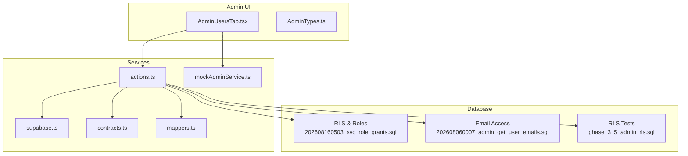
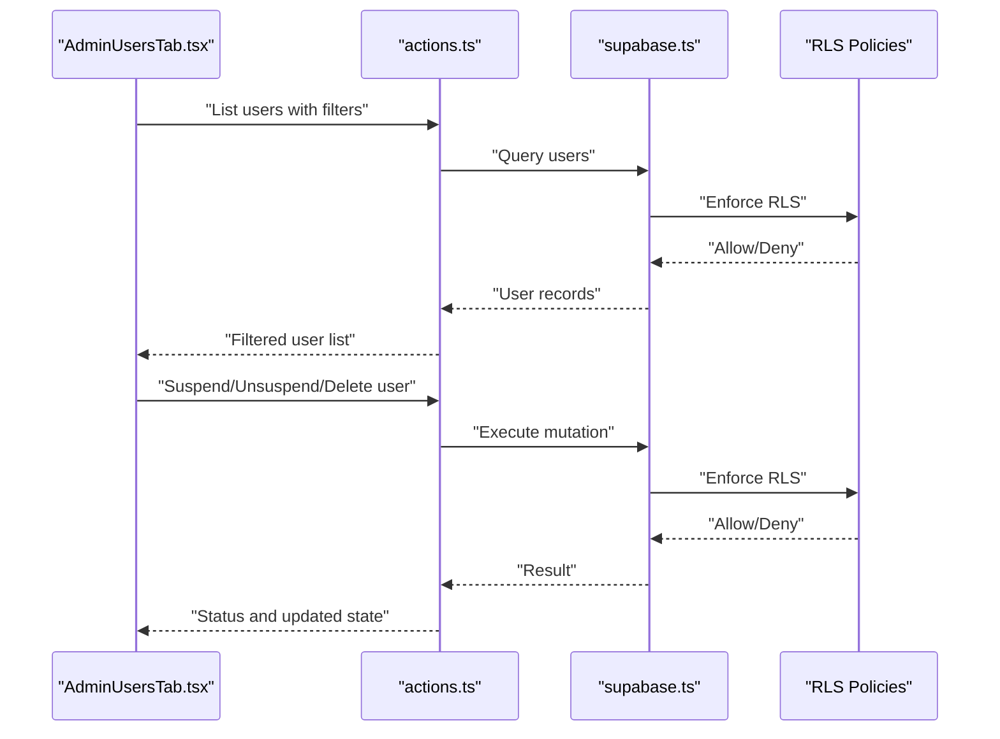
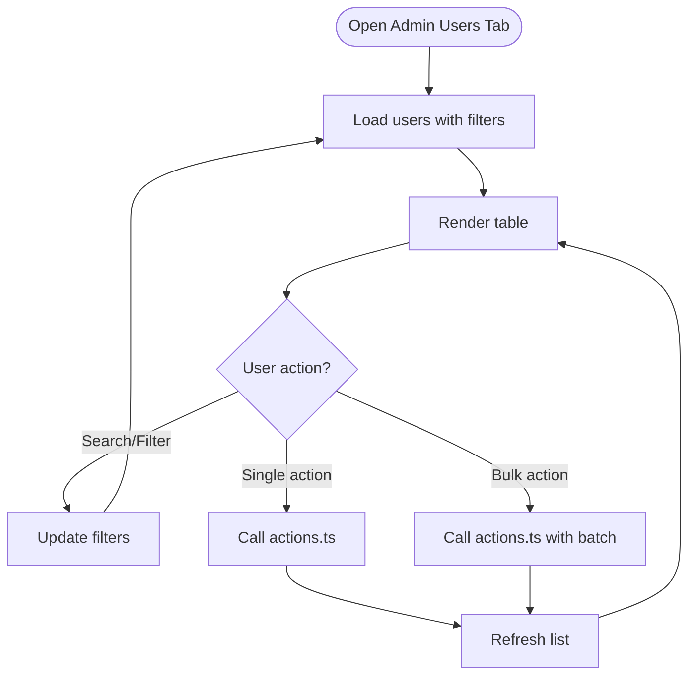
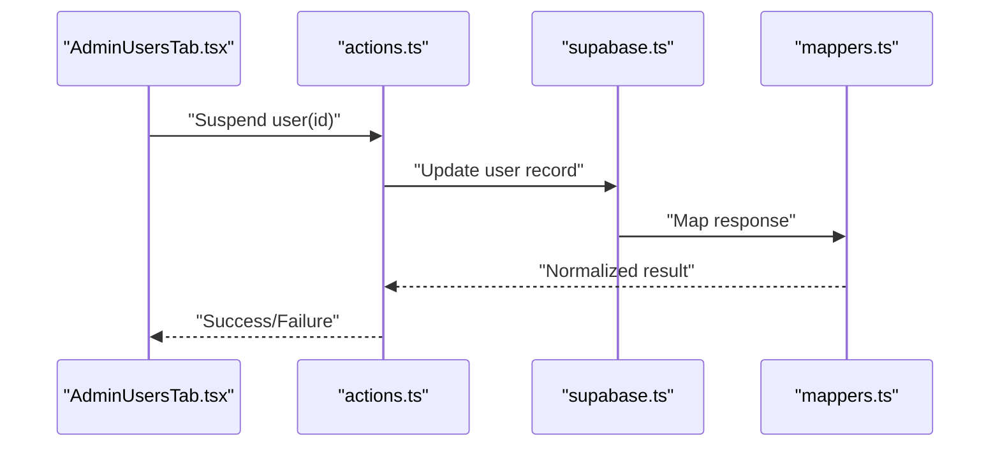
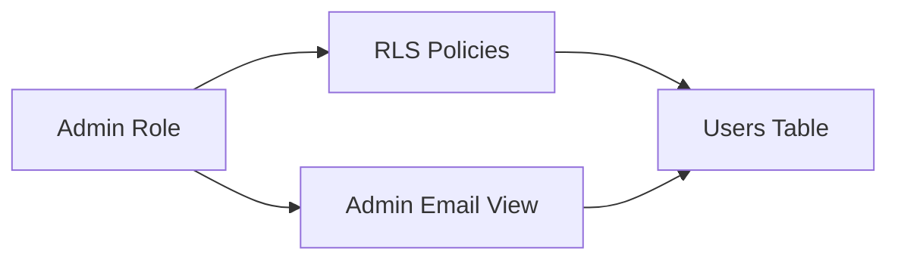
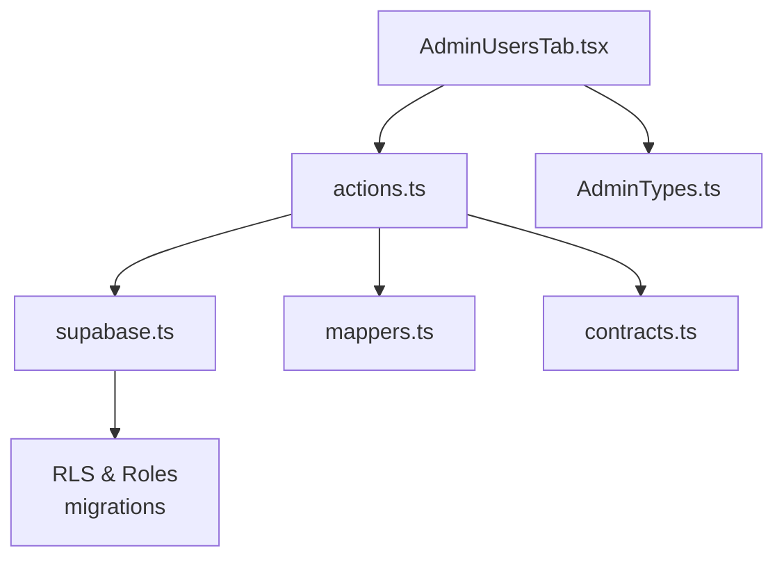

# User Management System

<cite>
**Referenced Files in This Document**
- [AdminUsersTab.tsx](file://src/components/admin/AdminUsersTab.tsx)
- [AdminTypes.ts](file://src/components/admin/AdminTypes.ts)
- [admin actions.ts](file://src/services/admin/actions.ts)
- [mockAdminService.ts](file://src/services/admin/mockAdminService.ts)
- [supabase.ts](file://src/services/backend/supabase.ts)
- [contracts.ts](file://src/services/backend/contracts.ts)
- [mappers.ts](file://src/services/backend/mappers.ts)
- [202608160503_svc_role_grants.sql](file://supabase/migrations/202608160503_svc_role_grants.sql)
- [202608060007_admin_get_user_emails.sql](file://supabase/migrations/202608060007_admin_get_user_emails.sql)
- [phase_3_5_admin_rls.sql](file://supabase/tests/phase_3_5_admin_rls.sql)
- [AdminOverviewTab.tsx](file://src/components/admin/AdminOverviewTab.tsx)
- [AdminAuditLogTab.tsx](file://src/components/admin/AdminAuditLogTab.tsx)
- [AdminPanel.test.tsx](file://src/components/admin/AdminPanel.test.tsx)
</cite>

## Table of Contents
1. Introduction
2. Project Structure
3. Core Components
4. Architecture Overview
5. Detailed Component Analysis
6. Dependency Analysis
7. Performance Considerations
8. Troubleshooting Guide
9. Conclusion

## Introduction
This document describes the user management system within the admin dashboard. It covers the full lifecycle of user accounts (creation, modification, suspension, deletion), role and permission management, access control, search and filtering, bulk operations, activity tracking, verification and email handling, profile moderation, security considerations, audit logging, and compliance guidance. It also provides examples of common tasks and troubleshooting procedures.

## Project Structure
The admin user management feature is implemented as a combination of:
- Admin UI components for listing, searching, and operating on users
- Service layer functions that call backend APIs or Supabase
- Database migrations defining roles, permissions, and RLS policies
- Type definitions shared between UI and services

**Diagram sources**
- [AdminUsersTab.tsx](file://src/components/admin/AdminUsersTab.tsx)
- [AdminTypes.ts](file://src/components/admin/AdminTypes.ts)
- [admin actions.ts](file://src/services/admin/actions.ts)
- [mockAdminService.ts](file://src/services/admin/mockAdminService.ts)
- [supabase.ts](file://src/services/backend/supabase.ts)
- [contracts.ts](file://src/services/backend/contracts.ts)
- [mappers.ts](file://src/services/backend/mappers.ts)
- [202608160503_svc_role_grants.sql](file://supabase/migrations/202608160503_svc_role_grants.sql)
- [202608060007_admin_get_user_emails.sql](file://supabase/migrations/202608060007_admin_get_user_emails.sql)
- [phase_3_5_admin_rls.sql](file://supabase/tests/phase_3_5_admin_rls.sql)

**Section sources**
- [AdminUsersTab.tsx](file://src/components/admin/AdminUsersTab.tsx)
- [AdminTypes.ts](file://src/components/admin/AdminTypes.ts)
- [admin actions.ts](file://src/services/admin/actions.ts)
- [mockAdminService.ts](file://src/services/admin/mockAdminService.ts)
- [supabase.ts](file://src/services/backend/supabase.ts)
- [contracts.ts](file://src/services/backend/contracts.ts)
- [mappers.ts](file://src/services/backend/mappers.ts)
- [202608160503_svc_role_grants.sql](file://supabase/migrations/202608160503_svc_role_grants.sql)
- [202608060007_admin_get_user_emails.sql](file://supabase/migrations/202608060007_admin_get_user_emails.sql)
- [phase_3_5_admin_rls.sql](file://supabase/tests/phase_3_5_admin_rls.sql)

## Core Components
- Admin Users Tab: Provides the primary interface to list, search, filter, and perform administrative actions on users.
- Admin Types: Defines shared types used by the UI and services for user records, filters, and action payloads.
- Admin Actions: Encapsulates business logic for user operations such as suspending, unsuspension, role updates, and deletion workflows.
- Mock Admin Service: Enables local development and testing without live backend calls.
- Supabase Client: Centralized database client used by services to execute queries and enforce RLS.
- Contracts and Mappers: Define API contracts and transform data between layers.
- Database Migrations: Enforce role-based access control and expose secure endpoints for admin operations.

Key responsibilities:
- Lifecycle management: Create, modify, suspend, delete
- Role and permission management: Assign roles and manage access
- Search and filtering: Query users with filters
- Bulk operations: Apply actions to multiple users
- Activity tracking: Log changes for auditability
- Verification and email management: Handle verification status and email visibility
- Profile moderation: Moderate user profiles via admin actions

**Section sources**
- [AdminUsersTab.tsx](file://src/components/admin/AdminUsersTab.tsx)
- [AdminTypes.ts](file://src/components/admin/AdminTypes.ts)
- [admin actions.ts](file://src/services/admin/actions.ts)
- [mockAdminService.ts](file://src/services/admin/mockAdminService.ts)
- [supabase.ts](file://src/services/backend/supabase.ts)
- [contracts.ts](file://src/services/backend/contracts.ts)
- [mappers.ts](file://src/services/backend/mappers.ts)

## Architecture Overview
The admin user management flow follows a layered architecture:
- UI Layer: AdminUsersTab renders the user list and triggers actions.
- Service Layer: actions.ts implements operations and delegates to Supabase or mock service.
- Data Layer: Supabase client executes queries under RLS policies defined in migrations.
- Security: Role grants and RLS ensure only authorized admins can perform sensitive operations.

**Diagram sources**
- [AdminUsersTab.tsx](file://src/components/admin/AdminUsersTab.tsx)
- [admin actions.ts](file://src/services/admin/actions.ts)
- [supabase.ts](file://src/services/backend/supabase.ts)
- [202608160503_svc_role_grants.sql](file://supabase/migrations/202608160503_svc_role_grants.sql)

## Detailed Component Analysis

### Admin Users Tab
Responsibilities:
- Display paginated user lists
- Apply search and filters (e.g., status, role)
- Trigger bulk actions (suspend/unsuspend, role assignment)
- Show user details and actions per row

Typical interactions:
- Fetching users with filters
- Performing single-user actions
- Executing bulk operations
- Refreshing after mutations

**Section sources**
- [AdminUsersTab.tsx](file://src/components/admin/AdminUsersTab.tsx)

### Admin Types
Defines shared structures for:
- User model fields used by admin UI
- Filter parameters for search
- Payloads for admin actions (e.g., role changes, suspension flags)

These types ensure consistency across UI and services and reduce drift during refactors.

**Section sources**
- [AdminTypes.ts](file://src/components/admin/AdminTypes.ts)

### Admin Actions
Implements core user management operations:
- List users with filters
- Suspend/unsuspend users
- Update roles
- Delete users (soft/hard depending on policy)
- Bulk operations over selected users

It coordinates with the Supabase client and applies error handling and retries where appropriate.

**Diagram sources**
- [admin actions.ts](file://src/services/admin/actions.ts)
- [supabase.ts](file://src/services/backend/supabase.ts)
- [mappers.ts](file://src/services/backend/mappers.ts)

**Section sources**
- [admin actions.ts](file://src/services/admin/actions.ts)
- [mappers.ts](file://src/services/backend/mappers.ts)

### Mock Admin Service
Provides a local implementation of admin actions for development and tests:
- Simulates network latency
- Returns deterministic results
- Allows testing UI flows without a live backend

Useful for:
- Unit tests
- Local development when backend is unavailable
- Demonstrating expected behavior

**Section sources**
- [mockAdminService.ts](file://src/services/admin/mockAdminService.ts)

### Supabase Client and Contracts
- supabase.ts: Centralized client configuration and helper methods for queries and mutations.
- contracts.ts: Defines request/response shapes and validation rules for admin operations.
- mappers.ts: Normalizes database responses into consistent domain models for UI consumption.

**Section sources**
- [supabase.ts](file://src/services/backend/supabase.ts)
- [contracts.ts](file://src/services/backend/contracts.ts)
- [mappers.ts](file://src/services/backend/mappers.ts)

### Database Security and Permissions
- Role grants define which roles can perform admin actions.
- RLS policies restrict data access based on user roles and context.
- Dedicated migration exposes admin-only email retrieval safely.

**Diagram sources**
- [202608160503_svc_role_grants.sql](file://supabase/migrations/202608160503_svc_role_grants.sql)
- [202608060007_admin_get_user_emails.sql](file://supabase/migrations/202608060007_admin_get_user_emails.sql)
- [phase_3_5_admin_rls.sql](file://supabase/tests/phase_3_5_admin_rls.sql)

**Section sources**
- [202608160503_svc_role_grants.sql](file://supabase/migrations/202608160503_svc_role_grants.sql)
- [202608060007_admin_get_user_emails.sql](file://supabase/migrations/202608060007_admin_get_user_emails.sql)
- [phase_3_5_admin_rls.sql](file://supabase/tests/phase_3_5_admin_rls.sql)

## Dependency Analysis
- AdminUsersTab depends on AdminActions for all user operations and AdminTypes for data shapes.
- AdminActions depends on Supabase client and may use mappers for normalization.
- Supabase client enforces RLS policies defined in migrations; role grants gate admin capabilities.
- MockAdminService decouples UI from backend dependencies during development/testing.

**Diagram sources**
- [AdminUsersTab.tsx](file://src/components/admin/AdminUsersTab.tsx)
- [admin actions.ts](file://src/services/admin/actions.ts)
- [AdminTypes.ts](file://src/components/admin/AdminTypes.ts)
- [supabase.ts](file://src/services/backend/supabase.ts)
- [mappers.ts](file://src/services/backend/mappers.ts)
- [contracts.ts](file://src/services/backend/contracts.ts)
- [202608160503_svc_role_grants.sql](file://supabase/migrations/202608160503_svc_role_grants.sql)

**Section sources**
- [AdminUsersTab.tsx](file://src/components/admin/AdminUsersTab.tsx)
- [admin actions.ts](file://src/services/admin/actions.ts)
- [AdminTypes.ts](file://src/components/admin/AdminTypes.ts)
- [supabase.ts](file://src/services/backend/supabase.ts)
- [mappers.ts](file://src/services/backend/mappers.ts)
- [contracts.ts](file://src/services/backend/contracts.ts)
- [202608160503_svc_role_grants.sql](file://supabase/migrations/202608160503_svc_role_grants.sql)

## Performance Considerations
- Pagination and server-side filtering: Ensure large user sets are fetched incrementally with filters applied at the database level.
- Debounced search: Reduce query frequency while typing in search inputs.
- Batch mutations: For bulk operations, prefer single requests that update multiple records to minimize round trips.
- Indexing: Confirm indexes exist on commonly filtered columns (e.g., status, role, created_at).
- Caching: Cache read-heavy lists briefly to reduce load during repeated views.

[No sources needed since this section provides general guidance]

## Troubleshooting Guide
Common issues and resolutions:
- Permission denied on admin actions:
  - Verify admin role grants and RLS policies are correctly configured.
  - Check that the current session has required roles.
  - Reference role grants and RLS tests for expected behavior.
- Missing emails in admin view:
  - Ensure the admin email endpoint is enabled and accessible by the admin role.
  - Validate that the migration exposing email access is applied.
- Unexpected empty user lists:
  - Inspect filters and pagination parameters.
  - Confirm RLS allows the admin role to read the requested subset.
- Inconsistent data shapes:
  - Review mappers and contracts to ensure transformations match DB schema.
- Development vs production discrepancies:
  - Use mockAdminService to isolate UI behavior and confirm expected outcomes before integrating with live backend.

**Section sources**
- [202608160503_svc_role_grants.sql](file://supabase/migrations/202608160503_svc_role_grants.sql)
- [202608060007_admin_get_user_emails.sql](file://supabase/migrations/202608060007_admin_get_user_emails.sql)
- [phase_3_5_admin_rls.sql](file://supabase/tests/phase_3_5_admin_rls.sql)
- [mockAdminService.ts](file://src/services/admin/mockAdminService.ts)
- [mappers.ts](file://src/services/backend/mappers.ts)
- [contracts.ts](file://src/services/backend/contracts.ts)

## Conclusion
The admin user management system combines a clear UI layer, robust service logic, and strong database-level security to support safe and efficient administration of user accounts. By leveraging role-based access control, RLS policies, and well-defined contracts, it ensures that user lifecycle operations are auditable, compliant, and performant. The provided diagrams and references guide both new contributors and experienced developers through understanding and extending the system.

[No sources needed since this section summarizes without analyzing specific files]

## Appendices

### Common Tasks Examples
- Suspend a user:
  - Select the user in the Admin Users Tab and trigger suspend action.
  - Confirm the operation succeeded and the user’s status reflects suspension.
- Un-suspend a user:
  - Locate the suspended user and apply un-suspend.
  - Verify restored access and correct status.
- Change user role:
  - Open user details and assign a new role.
  - Confirm role change persisted and reflected in subsequent queries.
- Delete a user:
  - Initiate deletion workflow and confirm intent.
  - Verify removal or soft-deletion according to policy.
- Bulk suspend:
  - Select multiple users and apply bulk suspend.
  - Validate all targeted records updated successfully.

[No sources needed since this section provides general guidance]

### Audit Logging and Activity Tracking
- Admin actions should be logged with actor, timestamp, target user, and action type.
- Use the audit log tab to review historical changes and investigate incidents.
- Ensure logs are immutable and retained per compliance requirements.

**Section sources**
- [AdminAuditLogTab.tsx](file://src/components/admin/AdminAuditLogTab.tsx)
- [AdminOverviewTab.tsx](file://src/components/admin/AdminOverviewTab.tsx)

### Security and Compliance Notes
- Enforce least privilege: Only grant necessary roles to admin users.
- Validate all inputs on the server side using contracts.
- Mask sensitive fields unless explicitly required.
- Maintain audit trails for all user modifications.
- Comply with privacy regulations by minimizing data exposure and ensuring consent where applicable.

[No sources needed since this section provides general guidance]