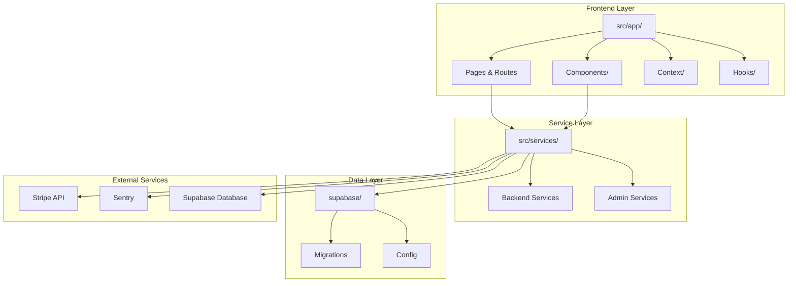
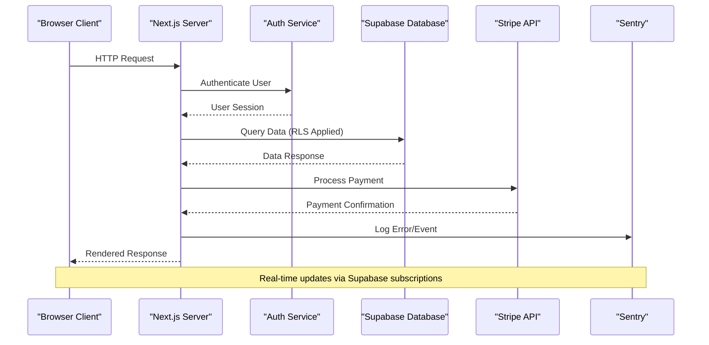
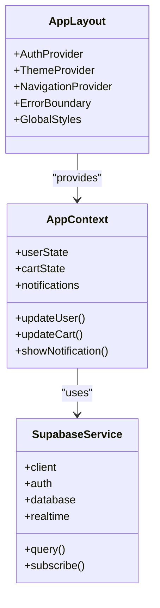
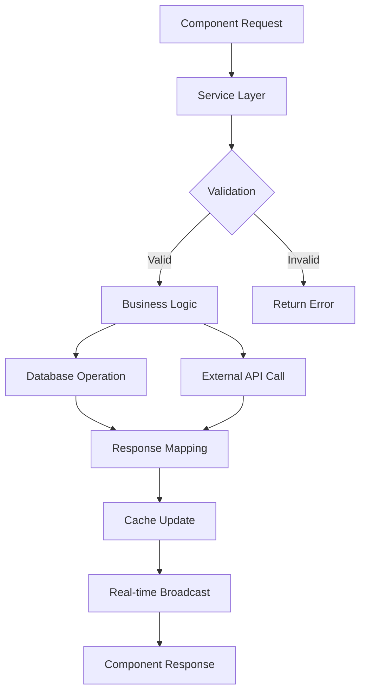
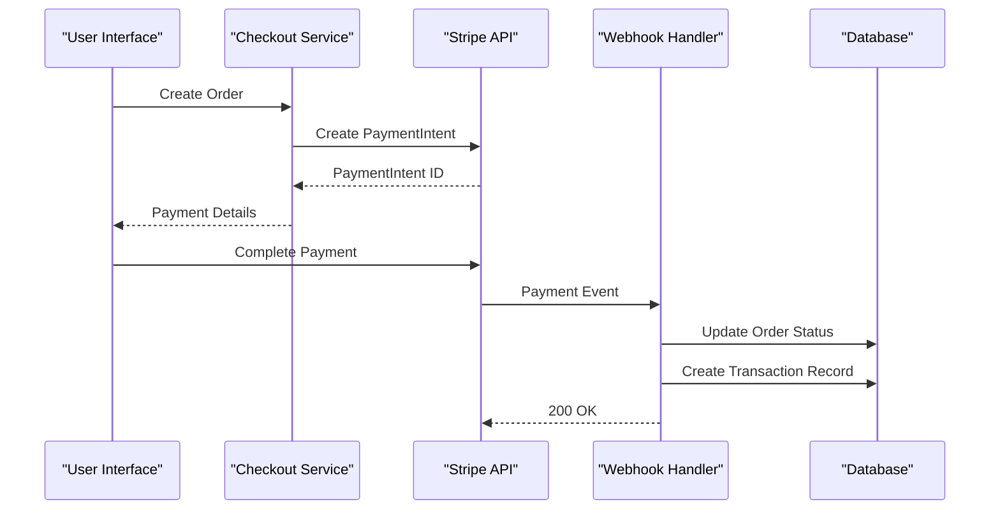
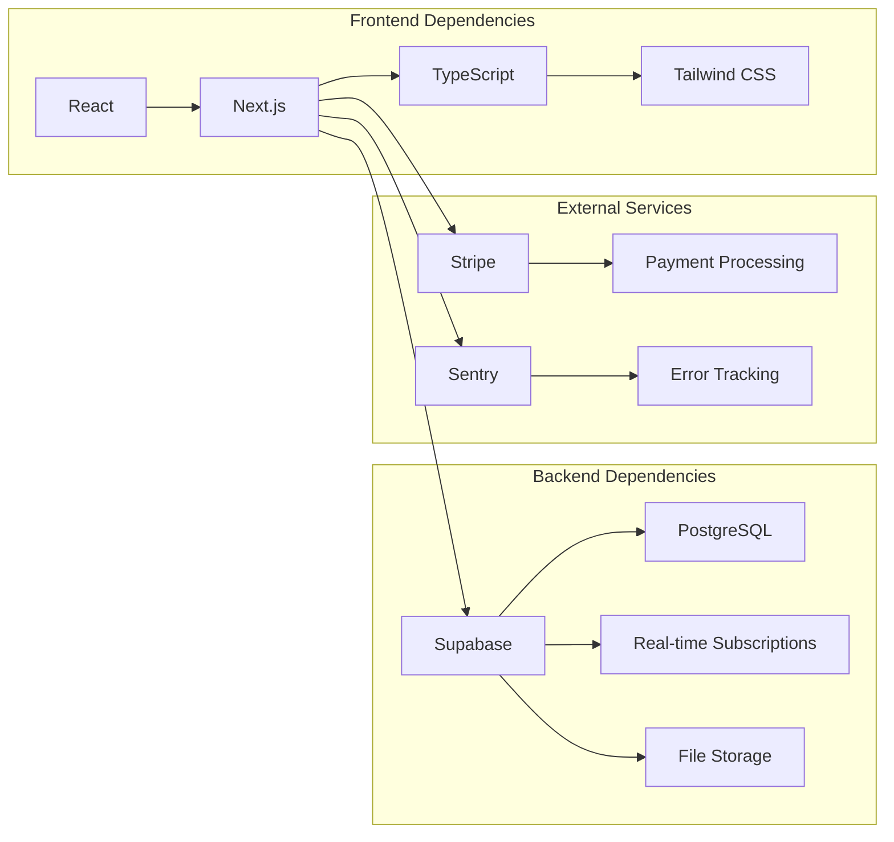
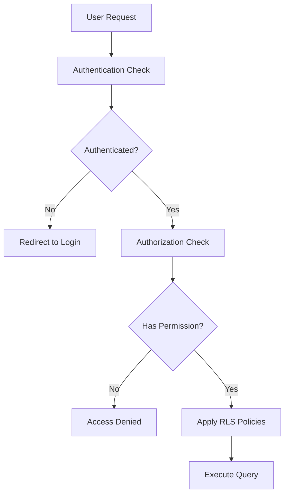

# Architecture Overview

<cite>
**Referenced Files in This Document**
- [src/app/layout.tsx](file://src/app/layout.tsx)
- [src/app/page.tsx](file://src/app/page.tsx)
- [src/services/backend/supabase.ts](file://src/services/backend/supabase.ts)
- [src/context/AppContext.tsx](file://src/context/AppContext.tsx)
- [src/components/AppContent.tsx](file://src/components/AppContent.tsx)
- [src/app/api/stripe/webhook/route.ts](file://src/app/api/stripe/webhook/route.ts)
- [sentry.client.config.ts](file://sentry.client.config.ts)
- [sentry.server.config.ts](file://sentry.server.config.ts)
- [supabase/config.toml](file://supabase/config.toml)
- [package.json](file://package.json)
</cite>

## Table of Contents
1. [Introduction](#introduction)
2. [Project Structure](#project-structure)
3. [Core Components](#core-components)
4. [Architecture Overview](#architecture-overview)
5. [Detailed Component Analysis](#detailed-component-analysis)
6. [Dependency Analysis](#dependency-analysis)
7. [Performance Considerations](#performance-considerations)
8. [Security Architecture](#security-architecture)
9. [Deployment Topology](#deployment-topology)
10. [Scalability Considerations](#scalability-considerations)
11. [Troubleshooting Guide](#troubleshooting-guide)
12. [Conclusion](#conclusion)

## Introduction

Mooday is a modern marketplace platform built with Next.js App Router, React components, and Supabase backend services. The system provides a comprehensive e-commerce experience including product listings, user authentication, shopping cart functionality, order management, payment processing through Stripe, and administrative capabilities. The architecture follows a clean separation of concerns between frontend UI components, business logic services, and database interactions, ensuring maintainability and scalability.

## Project Structure

The Mooday marketplace follows a well-organized Next.js App Router structure with clear separation of concerns:

**Diagram sources**
- [src/app/layout.tsx:1-50](file://src/app/layout.tsx#L1-L50)
- [src/services/backend/supabase.ts:1-100](file://src/services/backend/supabase.ts#L1-L100)

**Section sources**
- [src/app/layout.tsx:1-50](file://src/app/layout.tsx#L1-L50)
- [package.json:1-50](file://package.json#L1-L50)

## Core Components

The Mooday marketplace consists of several core architectural layers:

### Frontend Layer
- **App Router Pages**: Next.js App Router pages handling routing and server-side rendering
- **React Components**: Modular UI components organized by feature
- **Context Management**: Global state management using React Context
- **Custom Hooks**: Reusable logic encapsulated in hooks

### Service Layer
- **Backend Services**: Business logic abstraction layer
- **Supabase Integration**: Database operations and real-time subscriptions
- **Authentication Services**: User session and permission management
- **Payment Processing**: Stripe integration for transactions

### Data Layer
- **Database Schema**: PostgreSQL schema managed through migrations
- **Row-Level Security**: Fine-grained access control policies
- **Storage**: File storage for images and documents

**Section sources**
- [src/context/AppContext.tsx:1-100](file://src/context/AppContext.tsx#L1-L100)
- [src/services/backend/supabase.ts:1-100](file://src/services/backend/supabase.ts#L1-L100)

## Architecture Overview

The Mooday marketplace follows a layered architecture pattern with clear separation between presentation, business logic, and data access layers:

**Diagram sources**
- [src/app/layout.tsx:1-50](file://src/app/layout.tsx#L1-L50)
- [src/services/backend/supabase.ts:1-100](file://src/services/backend/supabase.ts#L1-L100)
- [src/app/api/stripe/webhook/route.ts:1-100](file://src/app/api/stripe/webhook/route.ts#L1-L100)

## Detailed Component Analysis

### Application Shell and Layout

The application shell manages global state, authentication, and layout configuration:

**Diagram sources**
- [src/app/layout.tsx:1-50](file://src/app/layout.tsx#L1-L50)
- [src/context/AppContext.tsx:1-100](file://src/context/AppContext.tsx#L1-L100)

### Service Layer Architecture

The service layer provides a clean abstraction over external dependencies:

**Diagram sources**
- [src/services/backend/supabase.ts:1-100](file://src/services/backend/supabase.ts#L1-L100)

### Payment Processing Flow

The payment processing integrates Stripe for secure transaction handling:

**Diagram sources**
- [src/app/api/stripe/webhook/route.ts:1-100](file://src/app/api/stripe/webhook/route.ts#L1-L100)

## Dependency Analysis

The system has well-defined dependencies between components:

**Diagram sources**
- [package.json:1-100](file://package.json#L1-L100)
- [supabase/config.toml:1-50](file://supabase/config.toml#L1-L50)

**Section sources**
- [package.json:1-100](file://package.json#L1-L100)

## Performance Considerations

### Frontend Performance
- **Server-Side Rendering**: Next.js App Router enables SSR for improved SEO and initial load performance
- **Code Splitting**: Automatic code splitting by route for optimized bundle sizes
- **Image Optimization**: Built-in image optimization with lazy loading
- **Caching Strategies**: Edge caching and revalidation for dynamic content

### Backend Performance
- **Database Indexing**: Strategic indexing on frequently queried columns
- **Connection Pooling**: Efficient database connection management
- **Real-time Updates**: Supabase real-time subscriptions for live data synchronization
- **Query Optimization**: Optimized SQL queries and proper use of indexes

### Scalability Patterns
- **Horizontal Scaling**: Stateless architecture supports horizontal scaling
- **CDN Integration**: Static assets served through CDN for global distribution
- **Database Read Replicas**: Support for read replicas to handle high query loads
- **Message Queues**: Background job processing for non-critical operations

## Security Architecture

### Authentication and Authorization
- **JWT-based Authentication**: Secure token-based authentication with Supabase Auth
- **Row-Level Security (RLS)**: Fine-grained database access control at the row level
- **Role-Based Access Control**: Different permission levels for users, sellers, and administrators
- **Input Validation**: Comprehensive input validation and sanitization

### Data Protection
- **HTTPS Enforcement**: All communications encrypted via HTTPS
- **Environment Variables**: Sensitive configuration stored in environment variables
- **CORS Configuration**: Proper CORS policies for cross-origin requests
- **Rate Limiting**: API rate limiting to prevent abuse

### Security Policies

**Diagram sources**
- [supabase/config.toml:1-50](file://supabase/config.toml#L1-L50)

## Deployment Topology

The Mooday marketplace supports multiple deployment strategies:

### Cloud Deployment
- **Vercel**: Primary deployment platform for Next.js application
- **Supabase**: Managed backend services including database and authentication
- **Edge Functions**: Serverless functions for API endpoints
- **CDN**: Global content delivery for static assets

### Container Deployment
- **Docker**: Containerized application for consistent deployments
- **Kubernetes**: Orchestration for production environments
- **Load Balancing**: Traffic distribution across multiple instances
- **Health Checks**: Automated health monitoring and self-healing

### Monitoring and Observability
- **Sentry**: Error tracking and performance monitoring
- **Analytics**: User behavior analytics and conversion tracking
- **Logging**: Centralized logging for debugging and auditing
- **Alerting**: Automated alerts for critical system events

## Scalability Considerations

### Horizontal Scaling
- **Stateless Design**: Application instances can be scaled horizontally without shared state
- **Database Scaling**: Connection pooling and read replicas for database scaling
- **CDN Usage**: Static asset caching at edge locations globally
- **API Rate Limiting**: Prevents resource exhaustion during traffic spikes

### Vertical Scaling
- **Memory Optimization**: Efficient memory usage patterns and garbage collection tuning
- **Database Tuning**: Query optimization and index management
- **Caching Layers**: Multi-level caching strategy for reduced database load
- **Resource Monitoring**: Continuous monitoring of system resources

### Disaster Recovery
- **Automated Backups**: Regular automated backups of all data
- **Multi-region Deployment**: Geographic redundancy for high availability
- **Rollback Procedures**: Quick rollback capabilities for failed deployments
- **Incident Response**: Automated incident response procedures

## Troubleshooting Guide

### Common Issues and Solutions

#### Authentication Problems
- **Token Expiration**: Implement automatic token refresh mechanisms
- **Session Management**: Clear browser cache and cookies when experiencing auth issues
- **CORS Errors**: Verify CORS configuration for development and production environments

#### Database Connectivity
- **Connection Limits**: Monitor and adjust database connection pool settings
- **Query Performance**: Use database query analysis tools to identify slow queries
- **RLS Policy Issues**: Test row-level security policies in development environment

#### Payment Processing
- **Stripe Webhooks**: Ensure webhook endpoints are properly configured and secured
- **Payment Failures**: Implement retry logic and user-friendly error messages
- **Testing**: Use Stripe test mode for comprehensive payment flow testing

### Debugging Tools
- **Development Logging**: Structured logging with appropriate log levels
- **Error Tracking**: Sentry integration for production error monitoring
- **Performance Profiling**: Browser developer tools and server-side profiling
- **Database Query Analysis**: Supabase query logs and performance insights

**Section sources**
- [sentry.client.config.ts:1-50](file://sentry.client.config.ts#L1-L50)
- [sentry.server.config.ts:1-50](file://sentry.server.config.ts#L1-L50)

## Conclusion

The Mooday marketplace system demonstrates a well-architected approach to building modern e-commerce platforms. The separation of concerns between frontend components, service layer, and data access provides excellent maintainability and scalability. The integration of industry-standard technologies like Next.js, Supabase, and Stripe ensures robust functionality while maintaining development velocity.

Key architectural strengths include:
- Clean separation of concerns with well-defined service boundaries
- Comprehensive security implementation with row-level security
- Scalable design supporting both horizontal and vertical scaling
- Robust error handling and monitoring capabilities
- Flexible deployment options supporting various hosting environments

The system's modular architecture allows for easy extension and modification, making it suitable for evolving marketplace requirements while maintaining code quality and performance standards.