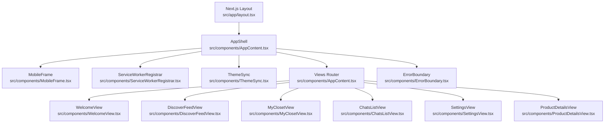
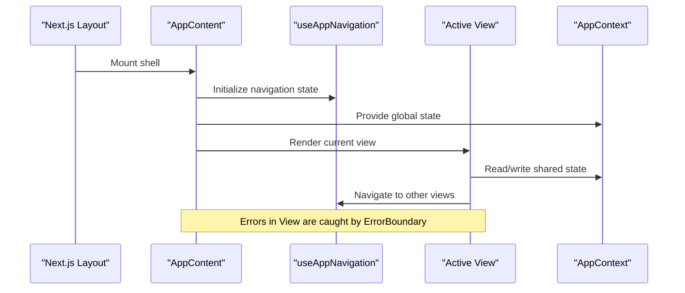
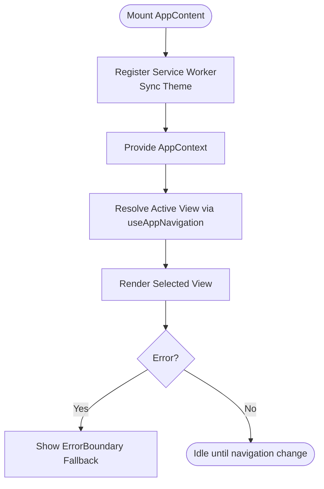
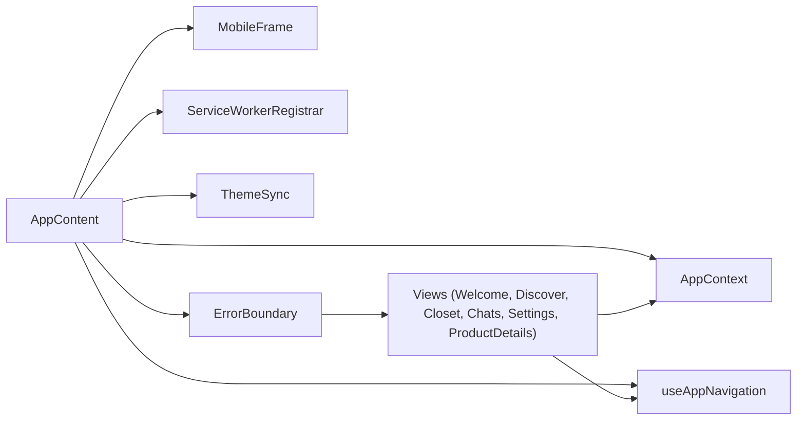

# Component Hierarchy

<cite>
**Referenced Files in This Document**
- [AppContent.tsx](file://src/components/AppContent.tsx)
- [ErrorBoundary.tsx](file://src/components/ErrorBoundary.tsx)
- [WelcomeView.tsx](file://src/components/WelcomeView.tsx)
- [AuthSheet.tsx](file://src/components/AuthSheet.tsx)
- [ProductDetailsView.tsx](file://src/components/ProductDetailsView.tsx)
- [AppContext.tsx](file://src/context/AppContext.tsx)
- [useAppNavigation.ts](file://src/hooks/useAppNavigation.ts)
- [layout.tsx](file://src/app/layout.tsx)
- [page.tsx](file://src/app/page.tsx)
- [DiscoverFeedView.tsx](file://src/components/DiscoverFeedView.tsx)
- [MyClosetView.tsx](file://src/components/MyClosetView.tsx)
- [ChatsListView.tsx](file://src/components/ChatsListView.tsx)
- [SettingsView.tsx](file://src/components/SettingsView.tsx)
- [MobileFrame.tsx](file://src/components/MobileFrame.tsx)
- [ServiceWorkerRegistrar.tsx](file://src/components/ServiceWorkerRegistrar.tsx)
- [ThemeSync.tsx](file://src/components/ThemeSync.tsx)
</cite>

## Table of Contents
1. [Introduction](#introduction)
2. [Project Structure](#project-structure)
3. [Core Components](#core-components)
4. [Architecture Overview](#architecture-overview)
5. [Detailed Component Analysis](#detailed-component-analysis)
6. [Dependency Analysis](#dependency-analysis)
7. [Performance Considerations](#performance-considerations)
8. [Troubleshooting Guide](#troubleshooting-guide)
9. [Conclusion](#conclusion)

## Introduction
This document explains the React component hierarchy and organization patterns used throughout the Mooday application. It focuses on how the root AppContent orchestrates views, how specialized view components like WelcomeView, AuthSheet, and ProductDetailsView compose together, and how state is managed via context and hooks. It also covers error boundaries, lifecycle considerations, performance techniques such as memoization and lazy loading, naming conventions, file organization, and reusable patterns that keep the app consistent and maintainable.

## Project Structure
Mooday follows a feature-oriented layout under src/components with clear separation between shell, views, shared UI, and utilities:
- Shell and routing: AppContent, MobileFrame, ServiceWorkerRegistrar, ThemeSync
- Views: Feature-specific screens (e.g., DiscoverFeedView, MyClosetView, ChatsListView, SettingsView, ProductDetailsView, WelcomeView)
- Shared UI: Reusable building blocks (e.g., ClickableCard, BrandChips, TrustBadges)
- Context and hooks: AppContext for global state, useAppNavigation for routing logic
- App entry points: Next.js layout and page files that mount the shell

**Diagram sources**
- [layout.tsx:1-200](file://src/app/layout.tsx#L1-L200)
- [AppContent.tsx:1-200](file://src/components/AppContent.tsx#L1-L200)
- [MobileFrame.tsx:1-200](file://src/components/MobileFrame.tsx#L1-L200)
- [ServiceWorkerRegistrar.tsx:1-200](file://src/components/ServiceWorkerRegistrar.tsx#L1-L200)
- [ThemeSync.tsx:1-200](file://src/components/ThemeSync.tsx#L1-L200)
- [ErrorBoundary.tsx:1-200](file://src/components/ErrorBoundary.tsx#L1-L200)

**Section sources**
- [layout.tsx:1-200](file://src/app/layout.tsx#L1-L200)
- [page.tsx:1-200](file://src/app/page.tsx#L1-L200)
- [AppContent.tsx:1-200](file://src/components/AppContent.tsx#L1-L200)

## Core Components
- AppContent: Root shell that mounts the mobile frame, registers service worker and theme sync, provides navigation and global state via context, and renders the active view based on route/state.
- ErrorBoundary: Wraps critical sections to catch render errors and present a graceful fallback.
- MobileFrame: Provides the mobile viewport container and chrome for the app.
- ServiceWorkerRegistrar: Registers the service worker for offline/PWA behavior.
- ThemeSync: Syncs theme preferences across sessions and runtime.
- Views: Feature screens that implement specific user flows (e.g., WelcomeView for onboarding, DiscoverFeedView for browsing, ProductDetailsView for product detail).

Key responsibilities:
- Routing and view selection are centralized in AppContent using navigation state and hooks.
- Global state (auth, settings, notifications, etc.) is exposed through AppContext.
- Navigation helpers are encapsulated in useAppNavigation to avoid prop drilling deep into components.

**Section sources**
- [AppContent.tsx:1-200](file://src/components/AppContent.tsx#L1-L200)
- [ErrorBoundary.tsx:1-200](file://src/components/ErrorBoundary.tsx#L1-L200)
- [MobileFrame.tsx:1-200](file://src/components/MobileFrame.tsx#L1-L200)
- [ServiceWorkerRegistrar.tsx:1-200](file://src/components/ServiceWorkerRegistrar.tsx#L1-L200)
- [ThemeSync.tsx:1-200](file://src/components/ThemeSync.tsx#L1-L200)

## Architecture Overview
The application uses a top-down composition model:
- Next.js layout mounts the app shell.
- AppContent sets up global providers (context), navigation, and renders the current view.
- Views consume context and hooks for data and actions.
- Error boundaries protect critical UI trees.

**Diagram sources**
- [layout.tsx:1-200](file://src/app/layout.tsx#L1-L200)
- [AppContent.tsx:1-200](file://src/components/AppContent.tsx#L1-L200)
- [useAppNavigation.ts:1-200](file://src/hooks/useAppNavigation.ts#L1-L200)
- [AppContext.tsx:1-200](file://src/context/AppContext.tsx#L1-L200)

## Detailed Component Analysis

### AppContent: Root Shell and View Router
Responsibilities:
- Mounts MobileFrame, ServiceWorkerRegistrar, and ThemeSync.
- Provides AppContext to children.
- Uses useAppNavigation to determine the active view and navigate between them.
- Renders an ErrorBoundary around the view tree.

Parent-child relationships:
- Parent to MobileFrame, ServiceWorkerRegistrar, ThemeSync, and the selected View.
- Child Views receive props from AppContent or read directly from AppContext/useAppNavigation.

Prop drilling and context usage:
- Avoids deep prop drilling by centralizing navigation and global state in context and hooks.
- Views typically access auth, settings, and navigation via context/hooks rather than receiving all props from AppContent.

Lifecycle considerations:
- Initializes side effects (service worker registration, theme sync) once at mount.
- Updates view rendering when navigation state changes.

**Diagram sources**
- [AppContent.tsx:1-200](file://src/components/AppContent.tsx#L1-L200)
- [ServiceWorkerRegistrar.tsx:1-200](file://src/components/ServiceWorkerRegistrar.tsx#L1-L200)
- [ThemeSync.tsx:1-200](file://src/components/ThemeSync.tsx#L1-L200)
- [useAppNavigation.ts:1-200](file://src/hooks/useAppNavigation.ts#L1-L200)
- [ErrorBoundary.tsx:1-200](file://src/components/ErrorBoundary.tsx#L1-L200)

**Section sources**
- [AppContent.tsx:1-200](file://src/components/AppContent.tsx#L1-L200)

### WelcomeView: Onboarding Entry Point
Purpose:
- Guides first-time users through onboarding steps.
- May gate access to main features until completion.

Composition:
- Consumes AppContext for user state and progress.
- Uses useAppNavigation to advance to the next screen after completing steps.

State management:
- Reads/writes onboarding progress via context.
- Navigates to Discover or authenticated flows upon completion.

**Section sources**
- [WelcomeView.tsx:1-200](file://src/components/WelcomeView.tsx#L1-L200)
- [AppContext.tsx:1-200](file://src/context/AppContext.tsx#L1-L200)
- [useAppNavigation.ts:1-200](file://src/hooks/useAppNavigation.ts#L1-L200)

### AuthSheet: Authentication Modal/Overlay
Purpose:
- Presents sign-in/sign-up flows as a sheet overlay.
- Integrates with global auth state in AppContext.

Composition:
- Triggered by navigation or user action; closes on success or dismissal.
- Emits navigation events via useAppNavigation to move to protected views after authentication.

State management:
- Subscribes to auth state changes in context.
- Updates local UI state for form handling and feedback.

**Section sources**
- [AuthSheet.tsx:1-200](file://src/components/AuthSheet.tsx#L1-L200)
- [AppContext.tsx:1-200](file://src/context/AppContext.tsx#L1-L200)
- [useAppNavigation.ts:1-200](file://src/hooks/useAppNavigation.ts#L1-L200)

### ProductDetailsView: Product Detail Screen
Purpose:
- Displays detailed information about a product listing.
- Supports actions like adding to cart, viewing seller info, and reviews.

Composition:
- Receives product identifier via navigation params or context.
- Uses context for cart, favorites, and user session state.
- Navigates to related views (e.g., seller profile, chat) via useAppNavigation.

Data flow:
- Fetches product details (via services/hooks not shown here) and updates local state.
- Dispatches actions to update context (e.g., add to cart).

**Section sources**
- [ProductDetailsView.tsx:1-200](file://src/components/ProductDetailsView.tsx#L1-L200)
- [AppContext.tsx:1-200](file://src/context/AppContext.tsx#L1-L200)
- [useAppNavigation.ts:1-200](file://src/hooks/useAppNavigation.ts#L1-L200)

### Additional Views and Shell Components
- DiscoverFeedView: Browse and search listings; consumes context for filters and user state.
- MyClosetView: User’s personal listings; reads/writes context for ownership and status.
- ChatsListView: Messaging list; integrates with real-time updates via context.
- SettingsView: Manage preferences; persists changes to context and storage.
- MobileFrame: Container for consistent mobile layout and safe areas.
- ServiceWorkerRegistrar: Ensures PWA capabilities are registered once.
- ThemeSync: Keeps theme consistent across reloads and devices.

**Section sources**
- [DiscoverFeedView.tsx:1-200](file://src/components/DiscoverFeedView.tsx#L1-L200)
- [MyClosetView.tsx:1-200](file://src/components/MyClosetView.tsx#L1-L200)
- [ChatsListView.tsx:1-200](file://src/components/ChatsListView.tsx#L1-L200)
- [SettingsView.tsx:1-200](file://src/components/SettingsView.tsx#L1-L200)
- [MobileFrame.tsx:1-200](file://src/components/MobileFrame.tsx#L1-L200)
- [ServiceWorkerRegistrar.tsx:1-200](file://src/components/ServiceWorkerRegistrar.tsx#L1-L200)
- [ThemeSync.tsx:1-200](file://src/components/ThemeSync.tsx#L1-L200)

## Dependency Analysis
High-level dependencies among core components:
- AppContent depends on AppContext, useAppNavigation, MobileFrame, ServiceWorkerRegistrar, ThemeSync, and ErrorBoundary.
- Views depend on AppContext and useAppNavigation for state and routing.
- ErrorBoundary wraps view trees to isolate failures.

**Diagram sources**
- [AppContent.tsx:1-200](file://src/components/AppContent.tsx#L1-L200)
- [AppContext.tsx:1-200](file://src/context/AppContext.tsx#L1-L200)
- [useAppNavigation.ts:1-200](file://src/hooks/useAppNavigation.ts#L1-L200)
- [MobileFrame.tsx:1-200](file://src/components/MobileFrame.tsx#L1-L200)
- [ServiceWorkerRegistrar.tsx:1-200](file://src/components/ServiceWorkerRegistrar.tsx#L1-L200)
- [ThemeSync.tsx:1-200](file://src/components/ThemeSync.tsx#L1-L200)
- [ErrorBoundary.tsx:1-200](file://src/components/ErrorBoundary.tsx#L1-L200)

**Section sources**
- [AppContent.tsx:1-200](file://src/components/AppContent.tsx#L1-L200)
- [AppContext.tsx:1-200](file://src/context/AppContext.tsx#L1-L200)
- [useAppNavigation.ts:1-200](file://src/hooks/useAppNavigation.ts#L1-L200)

## Performance Considerations
- Memoization: Use memoization for expensive sub-trees within views (e.g., lists, media) to prevent unnecessary re-renders when parent state changes.
- Lazy Loading: Defer heavy view bundles or non-critical modules to improve initial load time.
- Context Optimization: Keep context values stable; split contexts if they grow large to minimize subscriber updates.
- Navigation Efficiency: Centralize navigation in useAppNavigation to avoid redundant computations and ensure consistent transitions.
- Service Worker: Ensure efficient caching strategies via ServiceWorkerRegistrar to speed up subsequent loads.
- Error Boundaries: Isolate errors to prevent cascading failures and reduce wasted work during re-renders.

[No sources needed since this section provides general guidance]

## Troubleshooting Guide
Common issues and resolutions:
- Render errors in views: ErrorBoundary catches and displays a fallback; inspect logs and component props to identify the cause.
- Navigation loops: Verify useAppNavigation guards and conditions to prevent infinite redirects.
- Context stale state: Ensure context setters update immutable structures and trigger minimal re-renders.
- Service worker not updating: Clear cache and verify registration logic in ServiceWorkerRegistrar.
- Theme inconsistencies: Confirm ThemeSync runs on mount and persists preferences correctly.

**Section sources**
- [ErrorBoundary.tsx:1-200](file://src/components/ErrorBoundary.tsx#L1-L200)
- [useAppNavigation.ts:1-200](file://src/hooks/useAppNavigation.ts#L1-L200)
- [AppContext.tsx:1-200](file://src/context/AppContext.tsx#L1-L200)
- [ServiceWorkerRegistrar.tsx:1-200](file://src/components/ServiceWorkerRegistrar.tsx#L1-L200)
- [ThemeSync.tsx:1-200](file://src/components/ThemeSync.tsx#L1-L200)

## Conclusion
Mooday’s component hierarchy centers on a robust AppContent shell that composes MobileFrame, ServiceWorkerRegistrar, and ThemeSync while providing global state via AppContext and navigation via useAppNavigation. Views like WelcomeView, AuthSheet, and ProductDetailsView follow a consistent pattern: consume context for state, use navigation hooks for routing, and remain focused on their feature domain. Error boundaries protect critical UI, and performance is optimized through memoization, lazy loading, and efficient context usage. Naming conventions and file organization support scalability and clarity across the application.