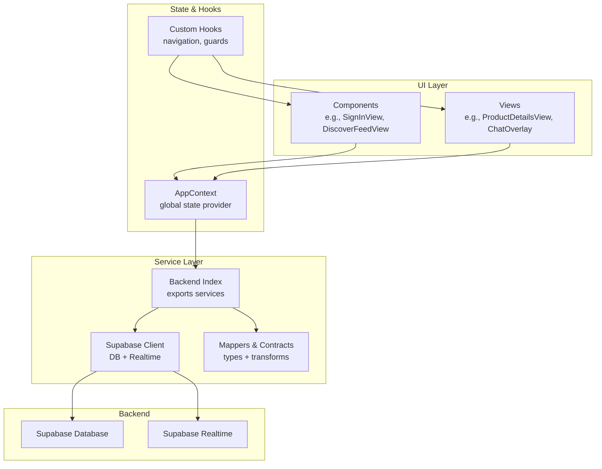
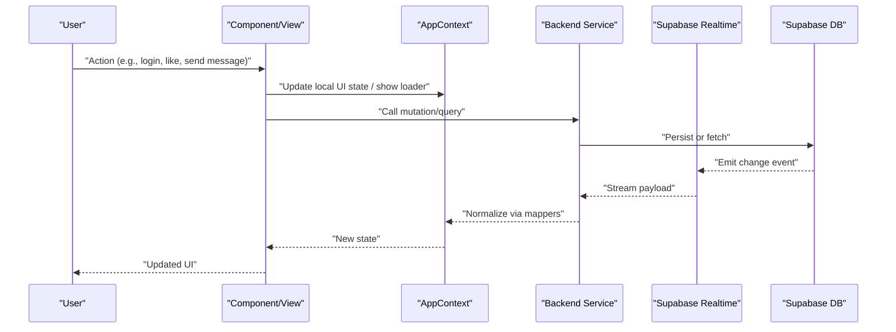
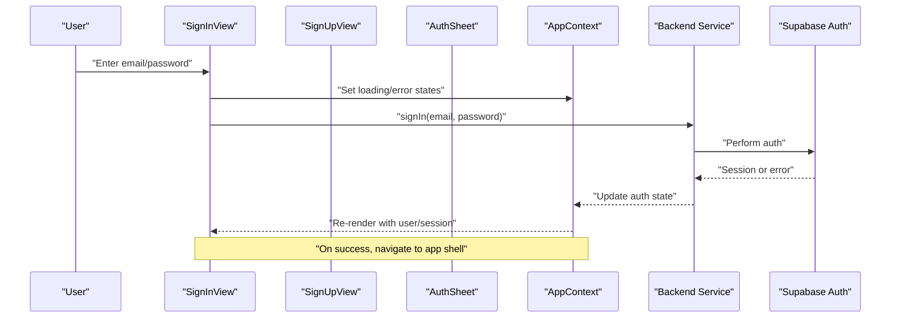
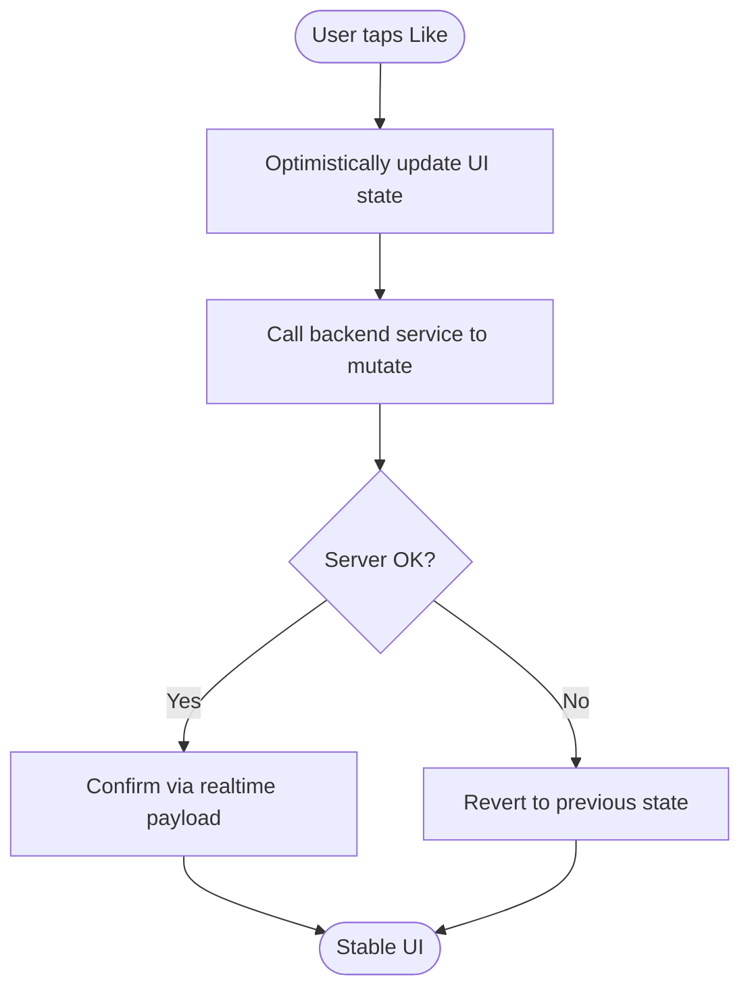
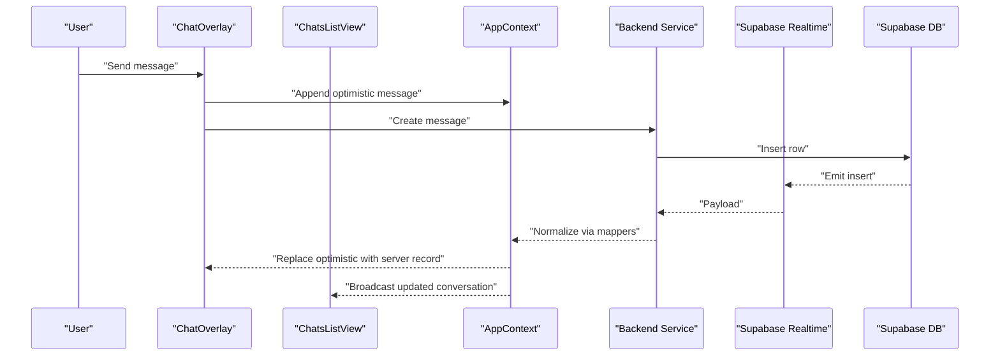
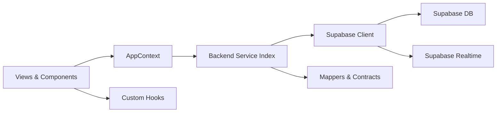

# Data Flow Patterns

<cite>
**Referenced Files in This Document**
- [AppContext.tsx](file://src/context/AppContext.tsx)
- [AuthSheet.tsx](file://src/components/AuthSheet.tsx)
- [SignInView.tsx](file://src/components/SignInView.tsx)
- [SignUpView.tsx](file://src/components/SignUpView.tsx)
- [DiscoverFeedView.tsx](file://src/components/DiscoverFeedView.tsx)
- [ProductDetailsView.tsx](file://src/components/ProductDetailsView.tsx)
- [ChatOverlay.tsx](file://src/components/ChatOverlay.tsx)
- [ChatsListView.tsx](file://src/components/ChatsListView.tsx)
- [supabase.ts](file://src/services/backend/supabase.ts)
- [realtime.test.ts](file://src/services/backend/realtime.test.ts)
- [mappers.ts](file://src/services/backend/mappers.ts)
- [contracts.ts](file://src/services/backend/contracts.ts)
- [index.ts](file://src/services/backend/index.ts)
- [useAppNavigation.ts](file://src/hooks/useAppNavigation.ts)
- [layout.tsx](file://src/app/layout.tsx)
- [page.tsx](file://src/app/page.tsx)
</cite>

## Table of Contents
1. Introduction
2. Project Structure
3. Core Components
4. Architecture Overview
5. Detailed Component Analysis
6. Dependency Analysis
7. Performance Considerations
8. Troubleshooting Guide
9. Conclusion

## Introduction
This document explains how data flows through the Mooday marketplace from user interactions to database updates and real-time synchronization. It focuses on:
- Context-based state management using AppContext
- Custom hooks for data fetching and mutations
- Service layer abstractions for API calls
- Asynchronous operation handling, error states, loading indicators, and optimistic updates
- Real-time data synchronization via Supabase Realtime
- Caching strategies and data consistency mechanisms
- Common scenarios: authentication, product listing updates, and chat message synchronization

## Project Structure
The application is a Next.js app with a clear separation between UI components, shared context, service layer, and backend integration.

**Diagram sources**
- [layout.tsx:1-200](file://src/app/layout.tsx#L1-L200)
- [page.tsx:1-200](file://src/app/page.tsx#L1-L200)
- [AppContext.tsx:1-200](file://src/context/AppContext.tsx#L1-L200)
- [index.ts:1-200](file://src/services/backend/index.ts#L1-L200)
- [supabase.ts:1-200](file://src/services/backend/supabase.ts#L1-L200)
- [mappers.ts:1-200](file://src/services/backend/mappers.ts#L1-L200)
- [contracts.ts:1-200](file://src/services/backend/contracts.ts#L1-L200)

**Section sources**
- [layout.tsx:1-200](file://src/app/layout.tsx#L1-L200)
- [page.tsx:1-200](file://src/app/page.tsx#L1-L200)

## Core Components
- AppContext provides global application state (auth, preferences, navigation, and feature flags). Components consume it to read and update shared state.
- Views and components trigger actions that mutate context or call service methods.
- The backend service layer encapsulates all Supabase interactions, including queries, mutations, and realtime subscriptions.
- Mappers and contracts define types and transformation logic between DB records and UI models.

Key responsibilities:
- AppContext: centralize auth state, UI state, and provide dispatch-like helpers
- Services: isolate network and realtime concerns; expose typed functions
- Mappers: ensure consistent shape of data across layers
- Views: orchestrate user flows by combining hooks, context, and services

**Section sources**
- [AppContext.tsx:1-200](file://src/context/AppContext.tsx#L1-L200)
- [index.ts:1-200](file://src/services/backend/index.ts#L1-L200)
- [mappers.ts:1-200](file://src/services/backend/mappers.ts#L1-L200)
- [contracts.ts:1-200](file://src/services/backend/contracts.ts#L1-L200)

## Architecture Overview
Data moves through a layered pipeline:
- User interaction triggers component/hook logic
- State updates occur in AppContext or local component state
- Service layer performs API calls and subscribes to realtime events
- Supabase persists changes and broadcasts updates
- UI re-renders based on new state or realtime payloads

**Diagram sources**
- [AppContext.tsx:1-200](file://src/context/AppContext.tsx#L1-L200)
- [supabase.ts:1-200](file://src/services/backend/supabase.ts#L1-L200)
- [realtime.test.ts:1-200](file://src/services/backend/realtime.test.ts#L1-L200)
- [mappers.ts:1-200](file://src/services/backend/mappers.ts#L1-L200)

## Detailed Component Analysis

### Authentication Flow
Authentication uses views to collect credentials, a service to perform sign-in/sign-up, and context to persist session state.

Patterns:
- Loading indicator during async auth
- Error propagation to UI
- Session stored in AppContext for global access
- Navigation after successful auth

**Diagram sources**
- [SignInView.tsx:1-200](file://src/components/SignInView.tsx#L1-L200)
- [SignUpView.tsx:1-200](file://src/components/SignUpView.tsx#L1-L200)
- [AuthSheet.tsx:1-200](file://src/components/AuthSheet.tsx#L1-L200)
- [AppContext.tsx:1-200](file://src/context/AppContext.tsx#L1-L200)
- [index.ts:1-200](file://src/services/backend/index.ts#L1-L200)

**Section sources**
- [SignInView.tsx:1-200](file://src/components/SignInView.tsx#L1-L200)
- [SignUpView.tsx:1-200](file://src/components/SignUpView.tsx#L1-L200)
- [AuthSheet.tsx:1-200](file://src/components/AuthSheet.tsx#L1-L200)
- [AppContext.tsx:1-200](file://src/context/AppContext.tsx#L1-L200)
- [index.ts:1-200](file://src/services/backend/index.ts#L1-L200)

### Product Listing Updates (Like/Cart)
Listing interactions demonstrate optimistic updates and eventual consistency via realtime.

Key behaviors:
- Immediate feedback with optimistic UI
- Rollback on failure
- Realtime confirmation ensures consistency across clients

**Diagram sources**
- [DiscoverFeedView.tsx:1-200](file://src/components/DiscoverFeedView.tsx#L1-L200)
- [ProductDetailsView.tsx:1-200](file://src/components/ProductDetailsView.tsx#L1-L200)
- [supabase.ts:1-200](file://src/services/backend/supabase.ts#L1-L200)
- [realtime.test.ts:1-200](file://src/services/backend/realtime.test.ts#L1-L200)

**Section sources**
- [DiscoverFeedView.tsx:1-200](file://src/components/DiscoverFeedView.tsx#L1-L200)
- [ProductDetailsView.tsx:1-200](file://src/components/ProductDetailsView.tsx#L1-L200)
- [supabase.ts:1-200](file://src/services/backend/supabase.ts#L1-L200)
- [realtime.test.ts:1-200](file://src/services/backend/realtime.test.ts#L1-L200)

### Chat Message Synchronization
Chat demonstrates bidirectional realtime sync with ordering and read receipts.

Patterns:
- Optimistic append then reconcile with server
- Realtime broadcast to all participants
- Read receipts and ordering handled in service/mappers

**Diagram sources**
- [ChatOverlay.tsx:1-200](file://src/components/ChatOverlay.tsx#L1-L200)
- [ChatsListView.tsx:1-200](file://src/components/ChatsListView.tsx#L1-L200)
- [AppContext.tsx:1-200](file://src/context/AppContext.tsx#L1-L200)
- [supabase.ts:1-200](file://src/services/backend/supabase.ts#L1-L200)
- [mappers.ts:1-200](file://src/services/backend/mappers.ts#L1-L200)

**Section sources**
- [ChatOverlay.tsx:1-200](file://src/components/ChatOverlay.tsx#L1-L200)
- [ChatsListView.tsx:1-200](file://src/components/ChatsListView.tsx#L1-L200)
- [AppContext.tsx:1-200](file://src/context/AppContext.tsx#L1-L200)
- [supabase.ts:1-200](file://src/services/backend/supabase.ts#L1-L200)
- [mappers.ts:1-200](file://src/services/backend/mappers.ts#L1-L200)

## Dependency Analysis
High-level dependencies among core modules:

Observations:
- Views depend on AppContext for shared state
- Backend service abstracts Supabase client and realtime
- Mappers decouple DB schema from UI models
- Minimal coupling between views and Supabase directly

**Diagram sources**
- [AppContext.tsx:1-200](file://src/context/AppContext.tsx#L1-L200)
- [index.ts:1-200](file://src/services/backend/index.ts#L1-L200)
- [supabase.ts:1-200](file://src/services/backend/supabase.ts#L1-L200)
- [mappers.ts:1-200](file://src/services/backend/mappers.ts#L1-L200)
- [contracts.ts:1-200](file://src/services/backend/contracts.ts#L1-L200)

**Section sources**
- [AppContext.tsx:1-200](file://src/context/AppContext.tsx#L1-L200)
- [index.ts:1-200](file://src/services/backend/index.ts#L1-L200)
- [supabase.ts:1-200](file://src/services/backend/supabase.ts#L1-L200)
- [mappers.ts:1-200](file://src/services/backend/mappers.ts#L1-L200)
- [contracts.ts:1-200](file://src/services/backend/contracts.ts#L1-L200)

## Performance Considerations
- Prefer optimistic updates for fast perceived performance; reconcile via realtime to ensure correctness.
- Debounce heavy operations (search, filters) at the view layer.
- Use selective subscriptions in realtime to minimize payload size.
- Normalize data with mappers to avoid repeated transformations.
- Cache frequently accessed lists in AppContext or component state with invalidation on mutations.
- Avoid unnecessary re-renders by memoizing derived data and splitting contexts when needed.

[No sources needed since this section provides general guidance]

## Troubleshooting Guide
Common issues and resolutions:
- Stale UI after mutation: Ensure realtime subscription is active and mappers normalize payloads correctly.
- Duplicate messages in chat: Verify optimistic append is replaced by server record and ordering keys are stable.
- Auth loops or redirects: Check AppContext auth state initialization and guard routes appropriately.
- Network errors not surfaced: Centralize error handling in service layer and propagate to UI with user-friendly messages.
- Inconsistent counts (likes, unread): Validate that realtime events update both list and aggregate fields consistently.

**Section sources**
- [realtime.test.ts:1-200](file://src/services/backend/realtime.test.ts#L1-L200)
- [AppContext.tsx:1-200](file://src/context/AppContext.tsx#L1-L200)
- [ChatOverlay.tsx:1-200](file://src/components/ChatOverlay.tsx#L1-L200)
- [DiscoverFeedView.tsx:1-200](file://src/components/DiscoverFeedView.tsx#L1-L200)

## Conclusion
Mooday’s data flow combines context-driven state, a robust service layer, and Supabase Realtime to deliver responsive, consistent experiences. Optimistic updates improve interactivity, while realtime reconciliation guarantees accuracy. By keeping UI, state, and backend concerns separated, the system remains maintainable and scalable for marketplace features like authentication, listings, and chat.

[No sources needed since this section summarizes without analyzing specific files]