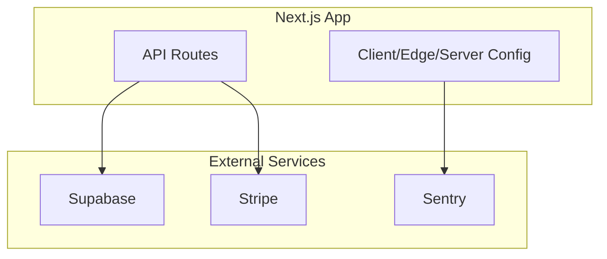
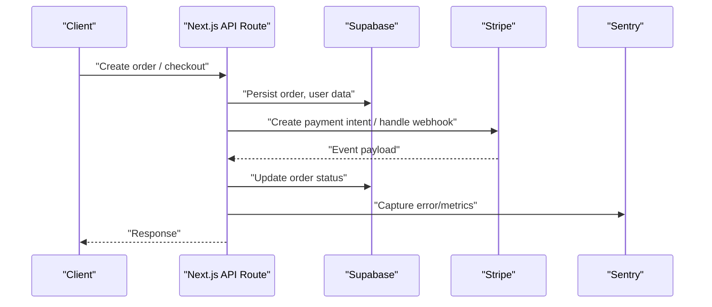
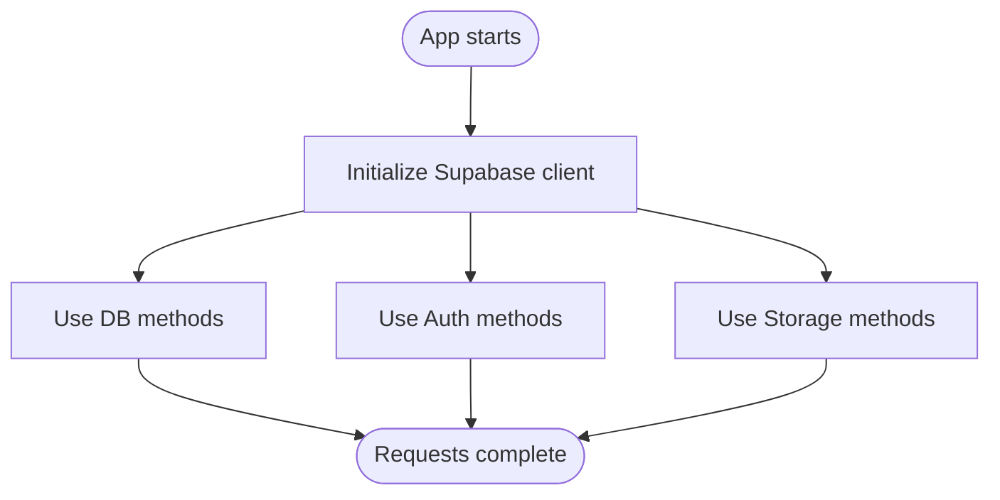
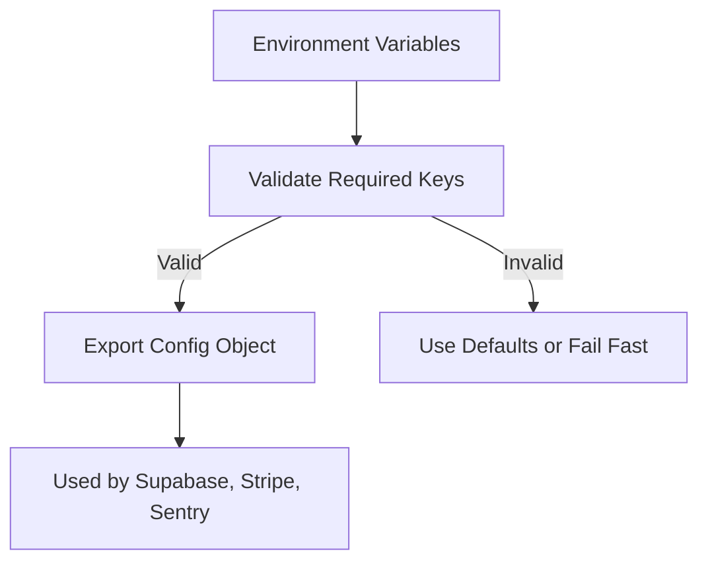
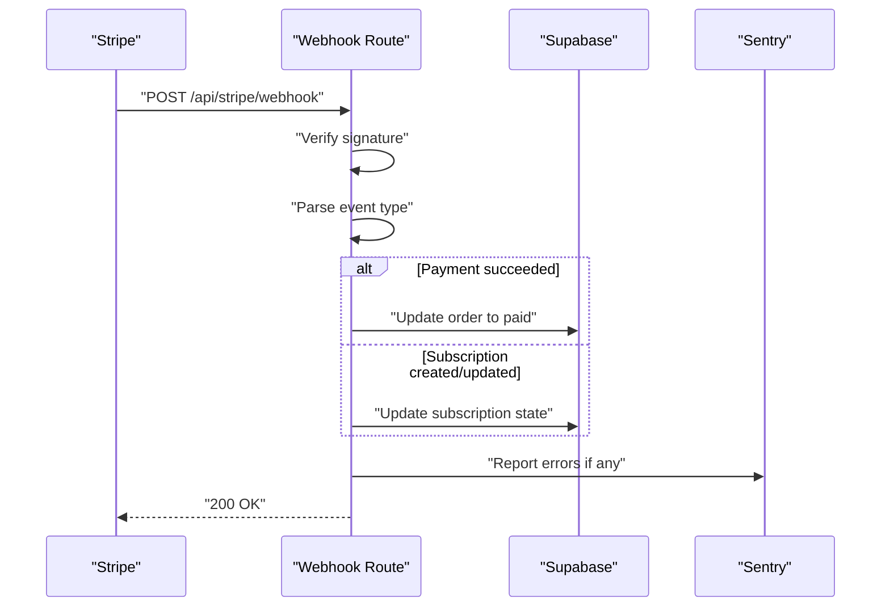
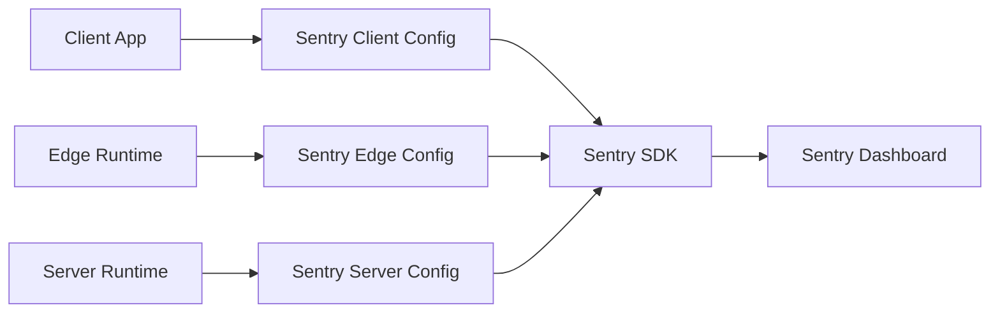
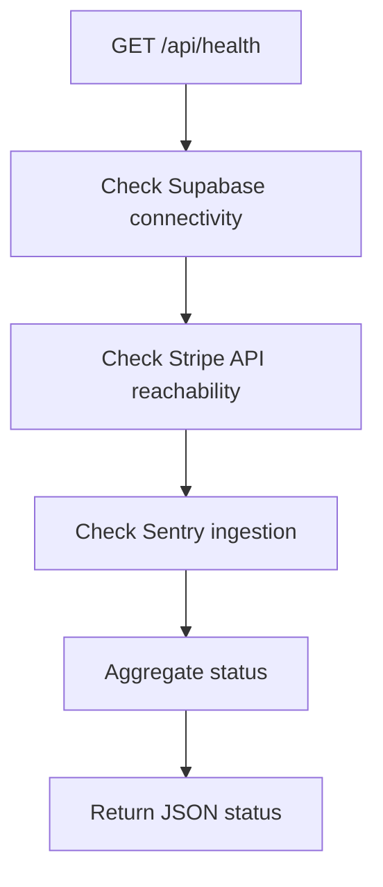
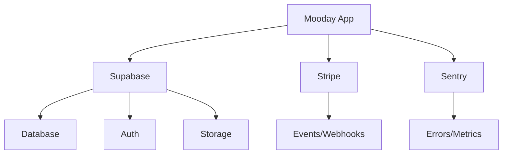

# Integration Patterns

<cite>
**Referenced Files in This Document**
- [supabase.ts](file://src/services/backend/supabase.ts)
- [config.ts](file://src/services/backend/config.ts)
- [route.ts](file://src/app/api/stripe/webhook/route.ts)
- [create-payment-intent.test.ts](file://src/services/backend/create-payment-intent.test.ts)
- [route.ts](file://src/app/api/health/route.ts)
- [sentry.client.config.ts](file://sentry.client.config.ts)
- [sentry.edge.config.ts](file://sentry.edge.config.ts)
- [sentry.server.config.ts](file://sentry.server.config.ts)
- [package.json](file://package.json)
</cite>

## Table of Contents
1. [Introduction](#introduction)
2. [Project Structure](#project-structure)
3. [Core Components](#core-components)
4. [Architecture Overview](#architecture-overview)
5. [Detailed Component Analysis](#detailed-component-analysis)
6. [Dependency Analysis](#dependency-analysis)
7. [Performance Considerations](#performance-considerations)
8. [Troubleshooting Guide](#troubleshooting-guide)
9. [Conclusion](#conclusion)
10. [Appendices](#appendices)

## Introduction
This document explains how the Mooday marketplace integrates with external services: Supabase (database, authentication, storage), Stripe (webhooks for payments and subscriptions), and Sentry (error monitoring and performance tracking). It covers configuration patterns, environment-specific settings, API key management, health checks, retry mechanisms, circuit breakers, fallback strategies, and monitoring approaches for each dependency.

## Project Structure
External integrations are primarily implemented under:
- Backend service layer: src/services/backend
- API routes: src/app/api
- Sentry configuration files at repository root
- Supabase migrations and templates under supabase/

[No sources needed since this diagram shows conceptual workflow, not actual code structure]

## Core Components
- Supabase client initialization and typed access to database, auth, and storage.
- Configuration module for environment variables and feature toggles.
- Stripe webhook handler for payment events and subscription lifecycle.
- Sentry configurations for client, edge, and server environments.
- Health check endpoint to validate external dependencies.

**Section sources**
- [supabase.ts:1-200](file://src/services/backend/supabase.ts#L1-L200)
- [config.ts:1-200](file://src/services/backend/config.ts#L1-L200)
- [route.ts:1-200](file://src/app/api/stripe/webhook/route.ts#L1-L200)
- [sentry.client.config.ts:1-200](file://sentry.client.config.ts#L1-L200)
- [sentry.edge.config.ts:1-200](file://sentry.edge.config.ts#L1-L200)
- [sentry.server.config.ts:1-200](file://sentry.server.config.ts#L1-L200)
- [route.ts:1-200](file://src/app/api/health/route.ts#L1-L200)

## Architecture Overview
The application uses a Next.js API route layer to orchestrate interactions with external services. The Supabase client is initialized once and reused across requests. Stripe webhooks are processed server-side to update orders and subscriptions. Sentry captures errors and performance metrics across client, edge, and server contexts.

**Diagram sources**
- [supabase.ts:1-200](file://src/services/backend/supabase.ts#L1-L200)
- [route.ts:1-200](file://src/app/api/stripe/webhook/route.ts#L1-L200)
- [sentry.client.config.ts:1-200](file://sentry.client.config.ts#L1-L200)
- [sentry.edge.config.ts:1-200](file://sentry.edge.config.ts#L1-L200)
- [sentry.server.config.ts:1-200](file://sentry.server.config.ts#L1-L200)

## Detailed Component Analysis

### Supabase Integration
Responsibilities:
- Initialize a typed client using environment variables.
- Provide database queries, authentication helpers, and storage operations.
- Centralize connection and session handling.

Key aspects:
- Environment-driven configuration via environment variables.
- Reusable client instance to minimize overhead.
- Typed methods for consistent data access.

**Diagram sources**
- [supabase.ts:1-200](file://src/services/backend/supabase.ts#L1-L200)

**Section sources**
- [supabase.ts:1-200](file://src/services/backend/supabase.ts#L1-L200)

### Configuration and Environment Management
Responsibilities:
- Load and validate environment variables.
- Expose feature flags and service endpoints.
- Provide safe defaults for non-production environments.

Key aspects:
- Strict validation for required keys (e.g., Supabase URL and keys, Stripe secrets).
- Centralized config used by Supabase client, Stripe handler, and Sentry.

**Diagram sources**
- [config.ts:1-200](file://src/services/backend/config.ts#L1-L200)

**Section sources**
- [config.ts:1-200](file://src/services/backend/config.ts#L1-L200)

### Stripe Webhook Handling
Responsibilities:
- Verify webhook signatures securely.
- Parse event payloads and dispatch handlers for payment and subscription events.
- Update order states and manage subscription lifecycles.

Key aspects:
- Signature verification before processing.
- Idempotent event handling to prevent duplicates.
- Error capture and reporting to Sentry.

**Diagram sources**
- [route.ts:1-200](file://src/app/api/stripe/webhook/route.ts#L1-L200)
- [supabase.ts:1-200](file://src/services/backend/supabase.ts#L1-L200)
- [sentry.server.config.ts:1-200](file://sentry.server.config.ts#L1-L200)

**Section sources**
- [route.ts:1-200](file://src/app/api/stripe/webhook/route.ts#L1-L200)
- [create-payment-intent.test.ts:1-200](file://src/services/backend/create-payment-intent.test.ts#L1-L200)

### Sentry Integration
Responsibilities:
- Capture unhandled exceptions and errors across client, edge, and server.
- Track performance metrics and transactions.
- Correlate errors with user context and request metadata.

Key aspects:
- Separate configs per runtime (client, edge, server).
- Environment-based enablement and sampling rates.
- Integration points in API routes and service layer.

**Diagram sources**
- [sentry.client.config.ts:1-200](file://sentry.client.config.ts#L1-L200)
- [sentry.edge.config.ts:1-200](file://sentry.edge.config.ts#L1-L200)
- [sentry.server.config.ts:1-200](file://sentry.server.config.ts#L1-L200)

**Section sources**
- [sentry.client.config.ts:1-200](file://sentry.client.config.ts#L1-L200)
- [sentry.edge.config.ts:1-200](file://sentry.edge.config.ts#L1-L200)
- [sentry.server.config.ts:1-200](file://sentry.server.config.ts#L1-L200)

### Health Check Endpoint
Responsibilities:
- Expose a lightweight endpoint to verify system readiness.
- Optionally probe external dependencies (Supabase, Stripe, Sentry).

Key aspects:
- Returns aggregated status and latency.
- Useful for load balancers and deployment pipelines.

**Diagram sources**
- [route.ts:1-200](file://src/app/api/health/route.ts#L1-L200)

**Section sources**
- [route.ts:1-200](file://src/app/api/health/route.ts#L1-L200)

## Dependency Analysis
External dependencies and their roles:
- Supabase: Database, Authentication, Storage
- Stripe: Payments, Subscriptions, Webhooks
- Sentry: Error Monitoring, Performance Tracking

**Diagram sources**
- [supabase.ts:1-200](file://src/services/backend/supabase.ts#L1-L200)
- [route.ts:1-200](file://src/app/api/stripe/webhook/route.ts#L1-L200)
- [sentry.client.config.ts:1-200](file://sentry.client.config.ts#L1-L200)
- [sentry.edge.config.ts:1-200](file://sentry.edge.config.ts#L1-L200)
- [sentry.server.config.ts:1-200](file://sentry.server.config.ts#L1-L200)

**Section sources**
- [package.json:1-200](file://package.json#L1-L200)

## Performance Considerations
- Connection reuse: Ensure Supabase client is initialized once per process to avoid repeated handshakes.
- Request batching: Batch database writes where possible to reduce round trips.
- Sampling: Configure Sentry sampling rates appropriate to environment to balance visibility and cost.
- Timeouts and retries: Implement timeouts for external calls; use exponential backoff for transient failures.
- Caching: Cache read-heavy data near the app when safe (e.g., product catalogs) to reduce database load.

[No sources needed since this section provides general guidance]

## Troubleshooting Guide
Common issues and resolutions:
- Supabase connectivity failures:
  - Validate environment variables (URL and keys).
  - Check network egress and firewall rules.
  - Inspect logs and Sentry breadcrumbs for stack traces.
- Stripe webhook signature verification errors:
  - Confirm webhook secret matches the one configured in Stripe dashboard.
  - Ensure raw body is consumed exactly once before verification.
- Sentry not capturing errors:
  - Verify DSN and environment enablement flags.
  - Check that SDK is initialized in all runtimes (client, edge, server).
- Health check failing:
  - Review individual dependency checks and latency thresholds.
  - Investigate upstream service outages or rate limits.

**Section sources**
- [config.ts:1-200](file://src/services/backend/config.ts#L1-L200)
- [route.ts:1-200](file://src/app/api/stripe/webhook/route.ts#L1-L200)
- [sentry.server.config.ts:1-200](file://sentry.server.config.ts#L1-L200)
- [route.ts:1-200](file://src/app/api/health/route.ts#L1-L200)

## Conclusion
Mooday’s integration patterns center on a robust Supabase client, secure Stripe webhook processing, and comprehensive Sentry instrumentation. With centralized configuration, clear separation of concerns, and observability built-in, the system supports reliable operation across environments. Adopting the recommended retry, circuit breaker, and fallback strategies will further improve resilience against external service failures.

[No sources needed since this section summarizes without analyzing specific files]

## Appendices

### Configuration Patterns
- Environment variables:
  - Supabase URL and anon/service keys
  - Stripe secret keys and webhook signing secret
  - Sentry DSN and environment flags
- Feature toggles:
  - Enable/disable features per environment
  - Toggle experimental integrations safely

**Section sources**
- [config.ts:1-200](file://src/services/backend/config.ts#L1-L200)

### Retry Mechanisms, Circuit Breakers, and Fallbacks
- Retries:
  - Use exponential backoff with jitter for transient errors.
  - Limit max retries to avoid cascading failures.
- Circuit breakers:
  - Open circuit after consecutive failures; allow periodic probes.
  - Close circuit when success rate improves.
- Fallbacks:
  - Return cached or degraded responses when appropriate.
  - Queue events for later processing during outages.

[No sources needed since this section provides general guidance]

### Monitoring Approaches
- Errors:
  - Capture exceptions and warnings in Sentry with contextual tags.
  - Set up alerts for spikes in error rates.
- Performance:
  - Track transactions for critical paths (checkout, listing creation).
  - Monitor latency percentiles and throughput.
- Business metrics:
  - Log successful webhook processing and order state transitions.
  - Correlate Stripe events with internal order IDs.

**Section sources**
- [sentry.client.config.ts:1-200](file://sentry.client.config.ts#L1-L200)
- [sentry.edge.config.ts:1-200](file://sentry.edge.config.ts#L1-L200)
- [sentry.server.config.ts:1-200](file://sentry.server.config.ts#L1-L200)