# Service Layer Architecture

<cite>
**Referenced Files in This Document**
- [src/services/backend/index.ts](file://src/services/backend/index.ts)
- [src/services/backend/supabase.ts](file://src/services/backend/supabase.ts)
- [src/services/admin/actions.ts](file://src/services/admin/actions.ts)
- [src/lib/security.ts](file://src/lib/security.ts)
- [src/lib/ownership.ts](file://src/lib/ownership.ts)
- [src/app/api/stripe/webhook/route.ts](file://src/app/api/stripe/webhook/route.ts)
- [src/services/backend/config.ts](file://src/services/backend/config.ts)
- [src/services/backend/mappers.ts](file://src/services/backend/mappers.ts)
</cite>

## Table of Contents
1. [Introduction](#introduction)
2. [Project Structure](#project-structure)
3. [Core Components](#core-components)
4. [Architecture Overview](#architecture-overview)
5. [Detailed Component Analysis](#detailed-component-analysis)
6. [Dependency Analysis](#dependency-analysis)
7. [Performance Considerations](#performance-considerations)
8. [Troubleshooting Guide](#troubleshooting-guide)
9. [Conclusion](#conclusion)

## Introduction

The Mooday marketplace implements a robust service layer architecture that abstracts business logic and external integrations behind clean interfaces. This architecture provides a clear separation between presentation layers (React components) and data persistence/logic layers, enabling maintainable, testable, and scalable marketplace functionality. The service layer handles user management, product operations, payment processing, administrative actions, and security concerns while maintaining loose coupling with external services like Supabase, Stripe, and email providers.

## Project Structure

The service layer follows a modular architecture organized by functional domains:

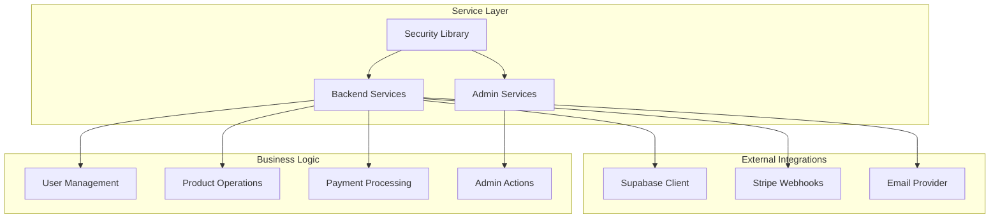

**Diagram sources**
- [src/services/backend/index.ts:1-50](file://src/services/backend/index.ts#L1-L50)
- [src/services/admin/actions.ts:1-30](file://src/services/admin/actions.ts#L1-L30)
- [src/lib/security.ts:1-40](file://src/lib/security.ts#L1-L40)

**Section sources**
- [src/services/backend/index.ts:1-100](file://src/services/backend/index.ts#L1-L100)
- [src/services/admin/actions.ts:1-50](file://src/services/admin/actions.ts#L1-L50)

## Core Components

### Backend Services Module

The backend services module serves as the primary interface for all marketplace operations, providing a unified API for user management, product operations, and payment processing.

#### Service Composition Pattern

The service layer employs composition patterns where complex services are built from smaller, focused service modules:

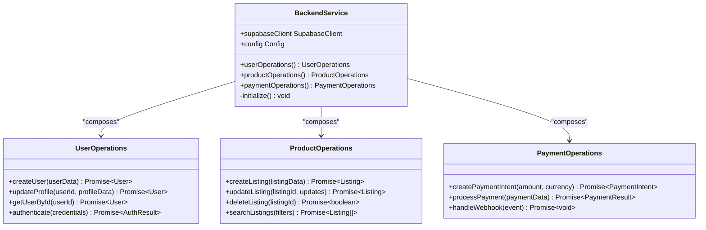

**Diagram sources**
- [src/services/backend/index.ts:15-80](file://src/services/backend/index.ts#L15-L80)
- [src/services/backend/supabase.ts:10-60](file://src/services/backend/supabase.ts#L10-L60)

#### Dependency Injection Approach

The service layer uses constructor-based dependency injection to promote testability and modularity:

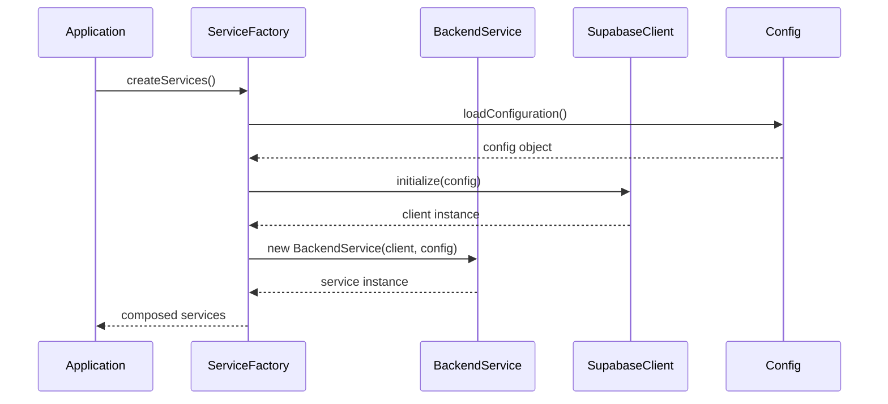

**Diagram sources**
- [src/services/backend/index.ts:20-45](file://src/services/backend/index.ts#L20-L45)
- [src/services/backend/config.ts:10-30](file://src/services/backend/config.ts#L10-L30)

**Section sources**
- [src/services/backend/index.ts:1-120](file://src/services/backend/index.ts#L1-L120)
- [src/services/backend/config.ts:1-80](file://src/services/backend/config.ts#L1-L80)

### Security Services

The security library provides essential security functions including authorization checks, ownership validation, and input sanitization.

#### Authorization and Ownership Validation

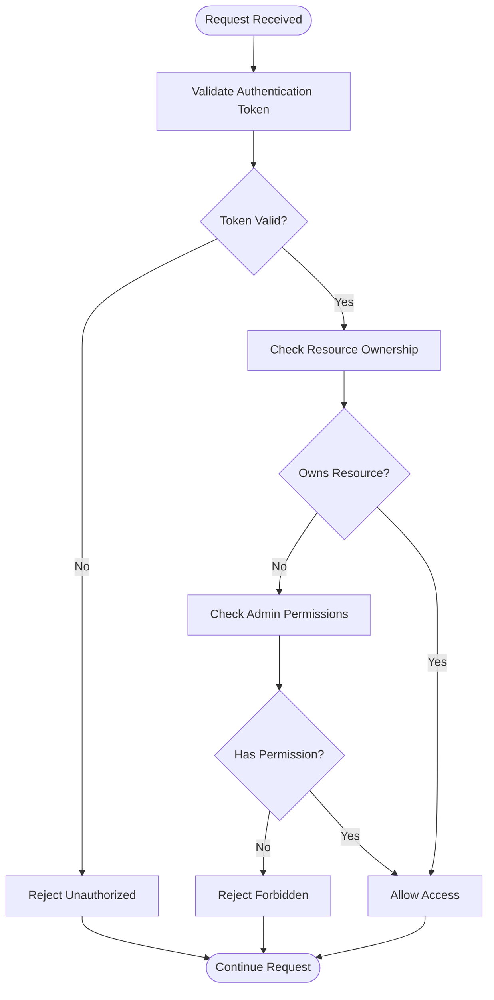

**Diagram sources**
- [src/lib/security.ts:25-80](file://src/lib/security.ts#L25-L80)
- [src/lib/ownership.ts:15-60](file://src/lib/ownership.ts#L15-L60)

#### Input Sanitization Patterns

The security layer implements comprehensive input validation and sanitization:

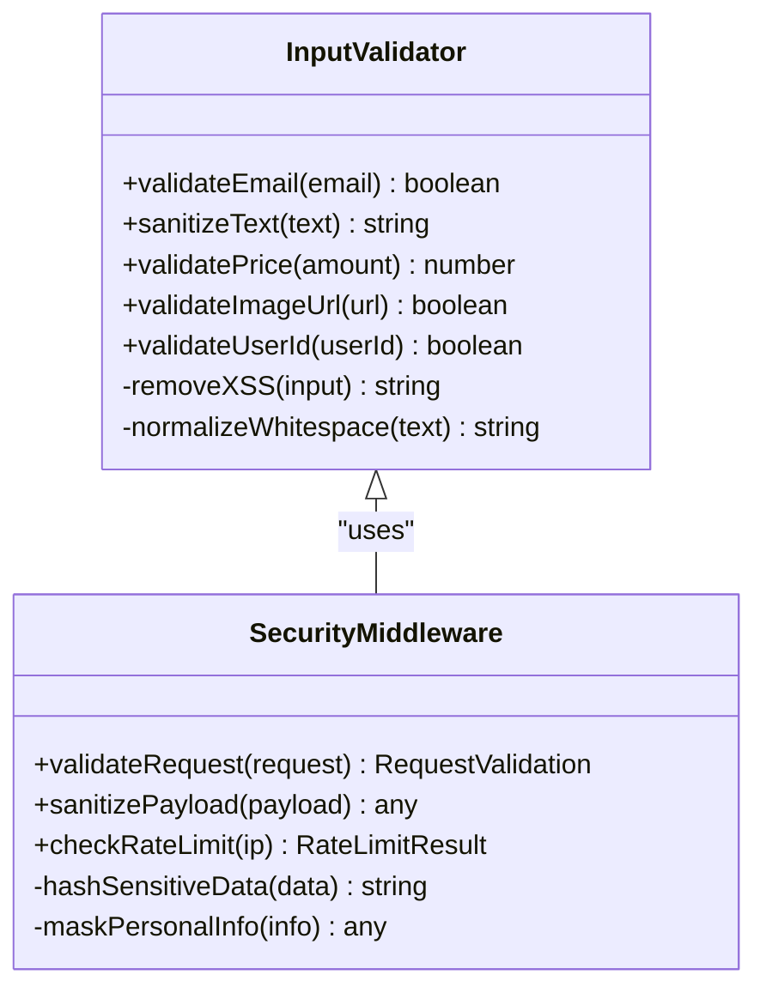

**Diagram sources**
- [src/lib/security.ts:40-120](file://src/lib/security.ts#L40-L120)

**Section sources**
- [src/lib/security.ts:1-150](file://src/lib/security.ts#L1-L150)
- [src/lib/ownership.ts:1-100](file://src/lib/ownership.ts#L1-L100)

### External Integration Services

#### Supabase Integration

The Supabase service provides database operations, authentication, and real-time features:

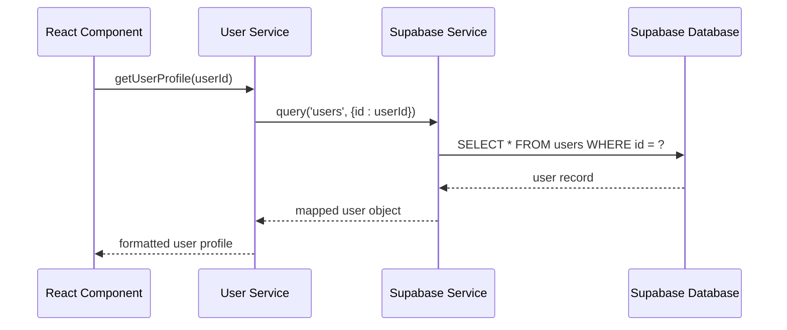

**Diagram sources**
- [src/services/backend/supabase.ts:30-100](file://src/services/backend/supabase.ts#L30-L100)

#### Stripe Webhook Processing

The payment service handles Stripe webhook events for payment processing:

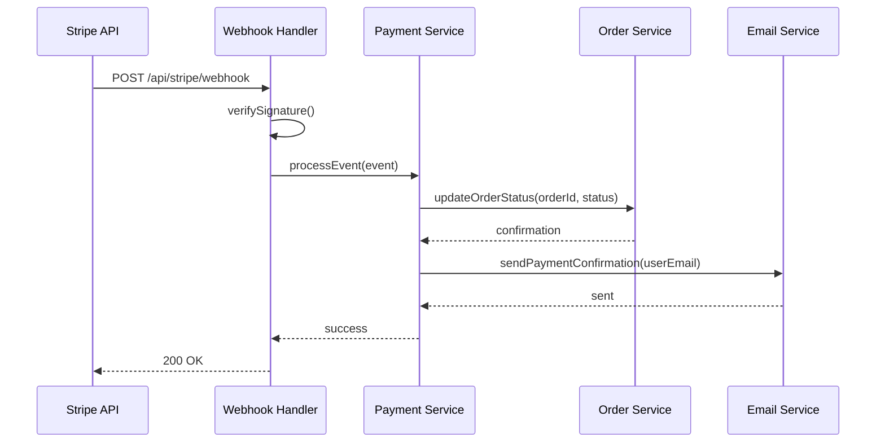

**Diagram sources**
- [src/app/api/stripe/webhook/route.ts:20-80](file://src/app/api/stripe/webhook/route.ts#L20-L80)

**Section sources**
- [src/services/backend/supabase.ts:1-150](file://src/services/backend/supabase.ts#L1-L150)
- [src/app/api/stripe/webhook/route.ts:1-100](file://src/app/api/stripe/webhook/route.ts#L1-L100)

## Architecture Overview

The service layer architecture follows a layered approach with clear separation of concerns:

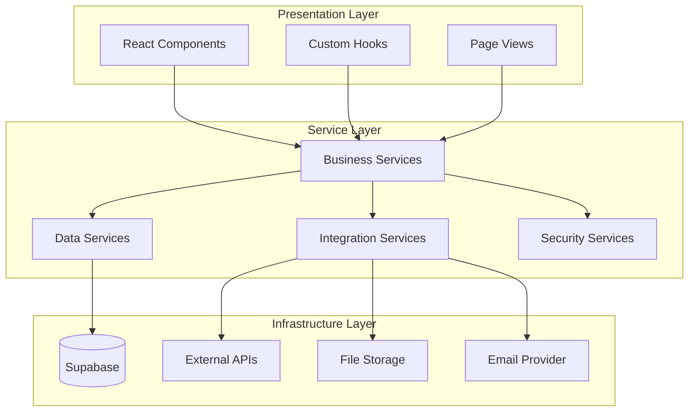

**Diagram sources**
- [src/services/backend/index.ts:1-50](file://src/services/backend/index.ts#L1-L50)
- [src/services/backend/supabase.ts:1-40](file://src/services/backend/supabase.ts#L1-L40)

## Detailed Component Analysis

### User Management Service

The user management service handles all user-related operations including registration, authentication, profile management, and user preferences.

#### Service Interface Design

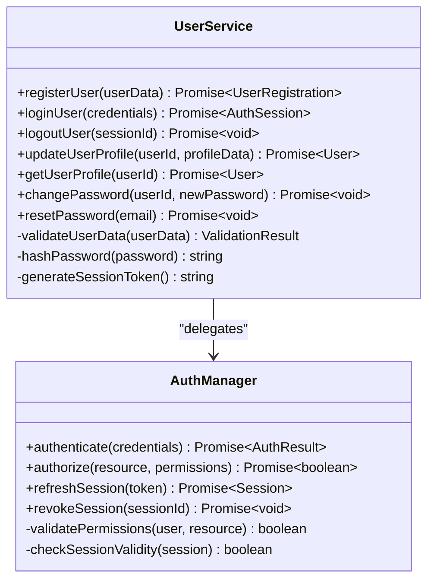

**Diagram sources**
- [src/services/backend/index.ts:40-120](file://src/services/backend/index.ts#L40-L120)

#### Parameter Validation and Error Handling

The service implements comprehensive parameter validation with detailed error messages:

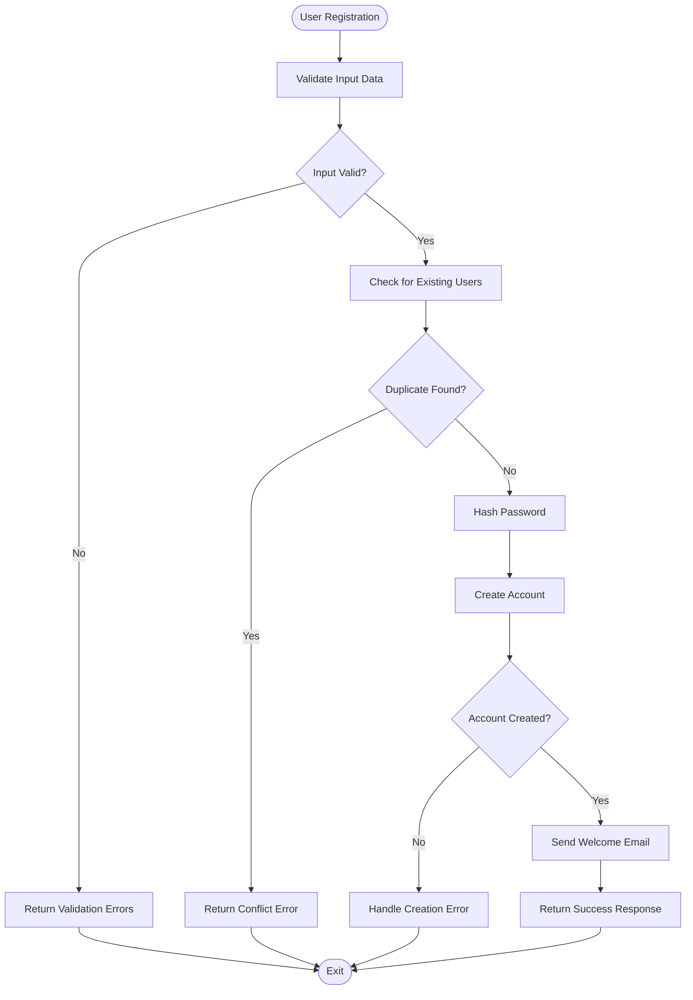

**Diagram sources**
- [src/lib/security.ts:60-120](file://src/lib/security.ts#L60-L120)

**Section sources**
- [src/services/backend/index.ts:1-200](file://src/services/backend/index.ts#L1-L200)
- [src/lib/security.ts:1-200](file://src/lib/security.ts#L1-L200)

### Product Operations Service

The product operations service manages listing creation, updates, searches, and inventory management.

#### CRUD Operations Pattern

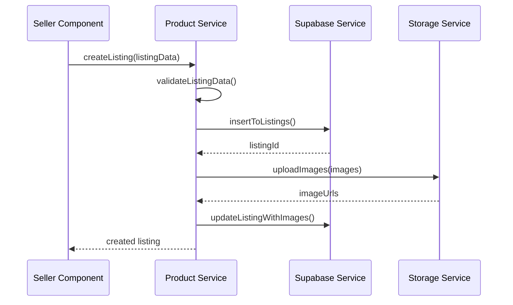

**Diagram sources**
- [src/services/backend/index.ts:80-160](file://src/services/backend/index.ts#L80-L160)
- [src/services/backend/supabase.ts:60-120](file://src/services/backend/supabase.ts#L60-L120)

#### Search and Filtering Implementation

The service provides advanced search capabilities with filtering, sorting, and pagination:

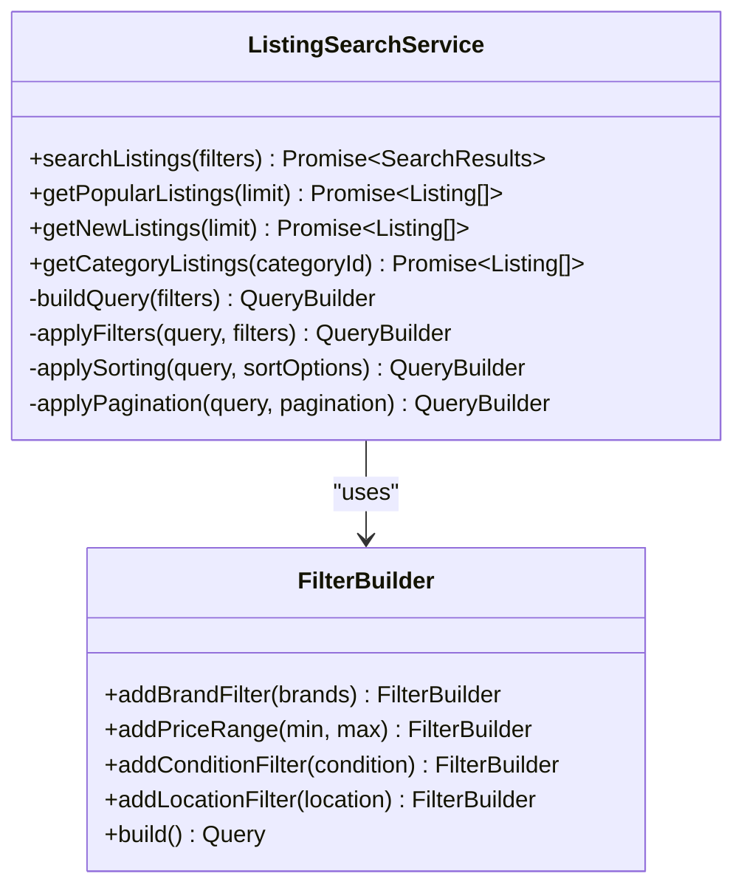

**Diagram sources**
- [src/services/backend/index.ts:120-200](file://src/services/backend/index.ts#L120-L200)

**Section sources**
- [src/services/backend/index.ts:1-250](file://src/services/backend/index.ts#L1-L250)
- [src/services/backend/supabase.ts:1-200](file://src/services/backend/supabase.ts#L1-L200)

### Payment Processing Service

The payment service handles payment intent creation, webhook processing, and transaction management.

#### Payment Flow Architecture

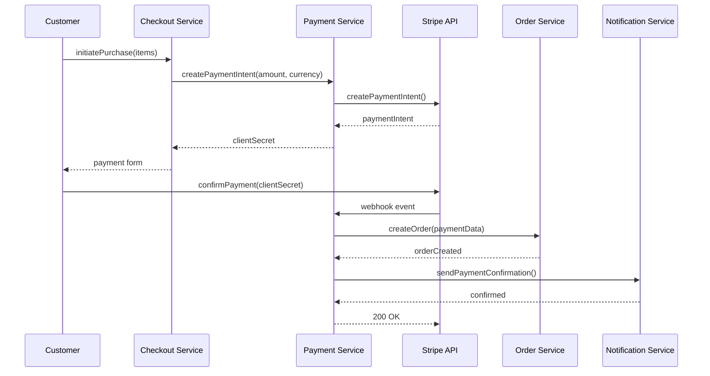

**Diagram sources**
- [src/app/api/stripe/webhook/route.ts:30-120](file://src/app/api/stripe/webhook/route.ts#L30-L120)

#### Webhook Security and Validation

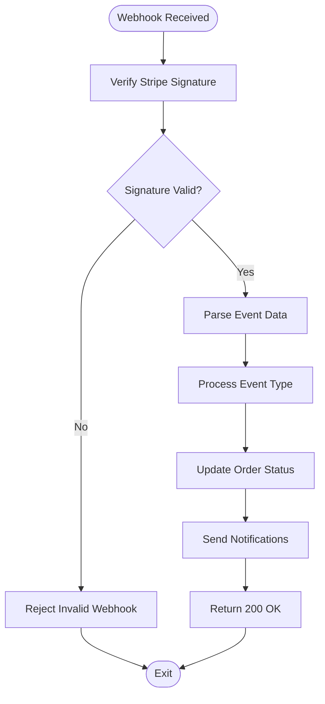

**Diagram sources**
- [src/app/api/stripe/webhook/route.ts:10-60](file://src/app/api/stripe/webhook/route.ts#L10-L60)

**Section sources**
- [src/app/api/stripe/webhook/route.ts:1-150](file://src/app/api/stripe/webhook/route.ts#L1-L150)

### Administrative Actions Service

The administrative service provides admin-specific functionality for marketplace management, user moderation, and system monitoring.

#### Admin Operations

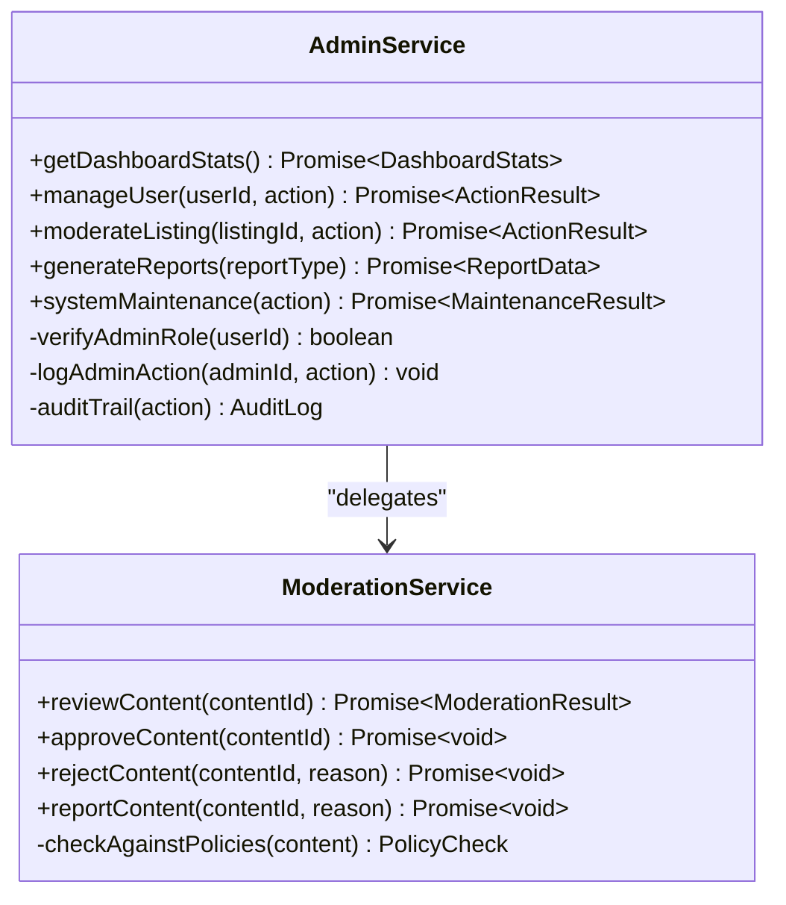

**Diagram sources**
- [src/services/admin/actions.ts:20-100](file://src/services/admin/actions.ts#L20-L100)

**Section sources**
- [src/services/admin/actions.ts:1-150](file://src/services/admin/actions.ts#L1-L150)

## Dependency Analysis

The service layer maintains clear dependency relationships with well-defined interfaces:

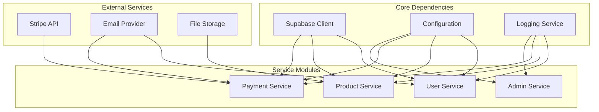

**Diagram sources**
- [src/services/backend/index.ts:1-50](file://src/services/backend/index.ts#L1-L50)
- [src/services/backend/config.ts:1-40](file://src/services/backend/config.ts#L1-L40)

**Section sources**
- [src/services/backend/index.ts:1-100](file://src/services/backend/index.ts#L1-L100)
- [src/services/backend/config.ts:1-80](file://src/services/backend/config.ts#L1-L80)

## Performance Considerations

### Caching Strategies

The service layer implements multiple caching strategies to optimize performance:

- **Database Query Caching**: Frequently accessed data is cached to reduce database load
- **API Response Caching**: External API responses are cached with appropriate TTL
- **Session Caching**: User sessions are cached for faster authentication
- **Computed Property Caching**: Expensive calculations are memoized

### Connection Pooling

Database connections are managed through connection pooling to optimize resource usage:

- **Connection Reuse**: Connections are reused across requests
- **Timeout Management**: Automatic timeout handling prevents connection leaks
- **Load Balancing**: Multiple database connections are distributed across queries

### Error Handling and Resilience

The service layer implements comprehensive error handling:

- **Circuit Breaker Pattern**: Prevents cascading failures when external services are unavailable
- **Retry Logic**: Automatic retry with exponential backoff for transient errors
- **Graceful Degradation**: Services continue operating with reduced functionality during outages
- **Comprehensive Logging**: Detailed error logging for debugging and monitoring

## Troubleshooting Guide

### Common Service Issues

#### Authentication Failures

When authentication fails, check the following:

1. **Token Validation**: Ensure JWT tokens are properly signed and not expired
2. **Database Connectivity**: Verify Supabase connection is established
3. **User Permissions**: Check if user has required roles and permissions
4. **Session Management**: Confirm session storage is accessible

#### Payment Processing Errors

For payment-related issues:

1. **Stripe Configuration**: Verify Stripe API keys are correctly configured
2. **Webhook Setup**: Ensure Stripe webhooks are properly registered
3. **Network Connectivity**: Check internet connectivity for payment processing
4. **Transaction Logs**: Review transaction logs for specific error details

#### Database Connection Problems

Database connectivity issues can be diagnosed by:

1. **Connection Pool Status**: Monitor active and idle connections
2. **Query Performance**: Analyze slow queries and optimize them
3. **Database Health**: Check database server status and resources
4. **Network Latency**: Measure network latency to database servers

### Debugging Techniques

#### Service-Level Debugging

Enable detailed logging for service operations:

```typescript
// Enable debug logging
const service = new BackendService({
  debug: true,
  logLevel: 'verbose'
});
```

#### Database Query Debugging

Monitor database queries for performance issues:

```typescript
// Log all database queries
supabase.setLogLevel('debug');
```

#### External API Monitoring

Track external API calls and their responses:

```typescript
// Monitor Stripe API calls
stripe.setAppInfo({
  name: 'Mooday Marketplace',
  version: '1.0.0',
  url: 'https://mooday.com'
});
```

**Section sources**
- [src/services/backend/supabase.ts:100-150](file://src/services/backend/supabase.ts#L100-L150)
- [src/app/api/stripe/webhook/route.ts:80-120](file://src/app/api/stripe/webhook/route.ts#L80-L120)

## Conclusion

The Mooday marketplace service layer architecture provides a robust foundation for marketplace operations through its modular design, comprehensive security measures, and efficient external integrations. The service layer successfully abstracts complexity while maintaining clean interfaces for core functionality including user management, product operations, payment processing, and administrative actions.

Key architectural strengths include:

- **Modular Design**: Clear separation of concerns with well-defined service boundaries
- **Security First**: Comprehensive security measures including authorization, ownership validation, and input sanitization
- **External Integration**: Robust integration patterns for Supabase, Stripe, and other external services
- **Error Handling**: Comprehensive error handling and recovery mechanisms
- **Performance Optimization**: Multiple caching strategies and connection pooling for optimal performance

The service layer's composition patterns and dependency injection approaches enable easy testing, maintenance, and scalability. The architecture supports future growth while maintaining code quality and developer productivity through consistent patterns and comprehensive documentation.