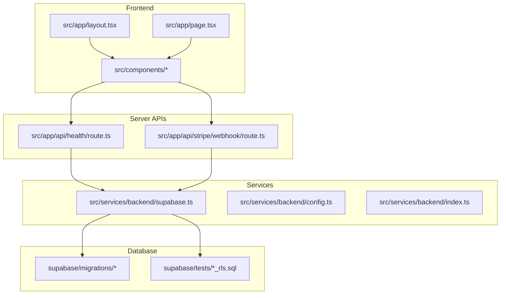
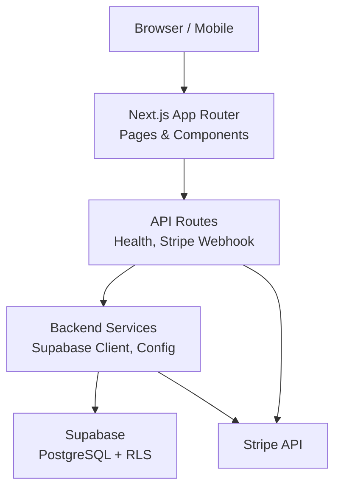
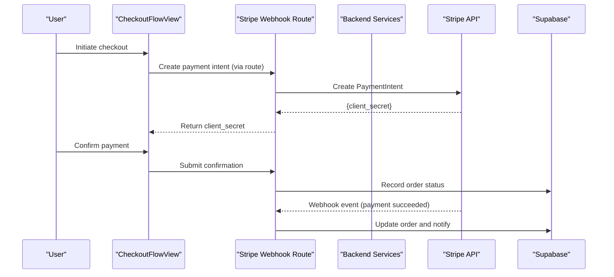
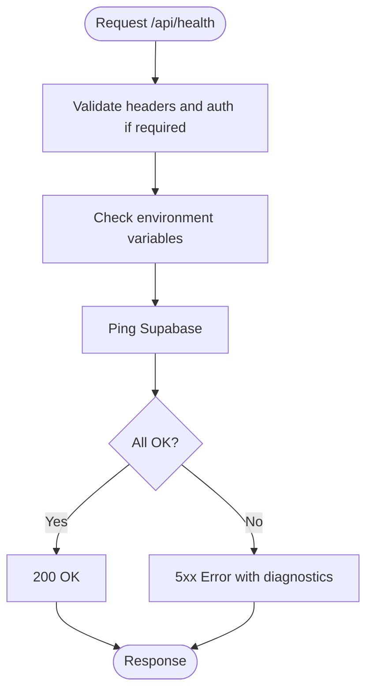
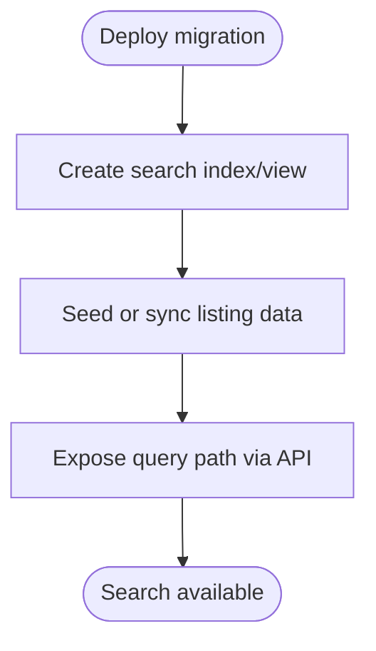
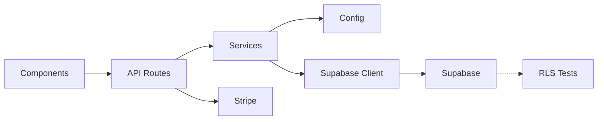
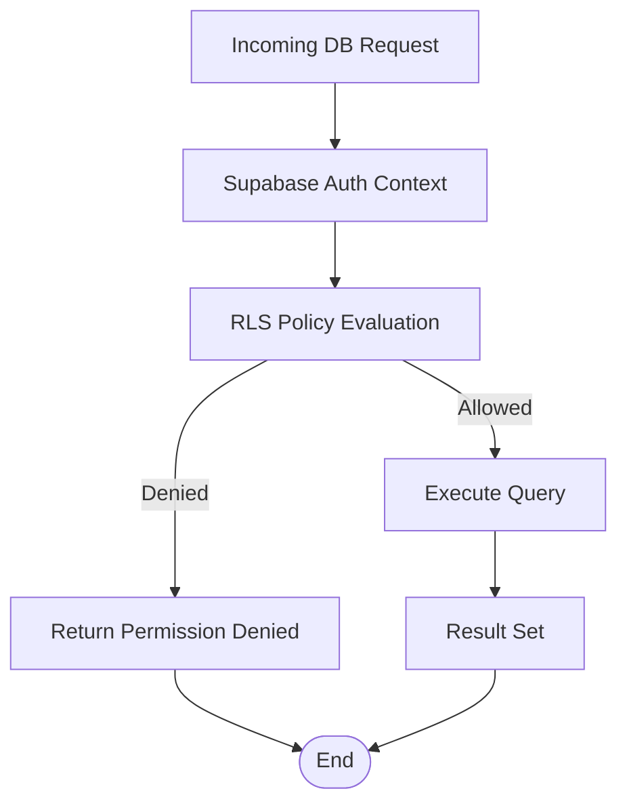

# System Architecture

<cite>
**Referenced Files in This Document**
- [README.md](file://README.md)
- [package.json](file://package.json)
- [next.config.ts](file://next.config.ts)
- [src/app/layout.tsx](file://src/app/layout.tsx)
- [src/app/page.tsx](file://src/app/page.tsx)
- [src/app/api/health/route.ts](file://src/app/api/health/route.ts)
- [src/app/api/stripe/webhook/route.ts](file://src/app/api/stripe/webhook/route.ts)
- [src/services/backend/supabase.ts](file://src/services/backend/supabase.ts)
- [src/services/backend/config.ts](file://src/services/backend/config.ts)
- [src/services/backend/index.ts](file://src/services/backend/index.ts)
- [src/services/backend/create-payment-intent.test.ts](file://src/services/backend/create-payment-intent.test.ts)
- [src/components/CheckoutFlowView.tsx](file://src/components/CheckoutFlowView.tsx)
- [supabase/migrations/202607150006_phase_3_orders.sql](file://supabase/migrations/202607150006_phase_3_orders.sql)
- [supabase/migrations/202608160429_u3_search_listings.sql](file://supabase/migrations/202608160429_u3_search_listings.sql)
- [supabase/tests/phase_3_orders_rls.sql](file://supabase/tests/phase_3_orders_rls.sql)
- [supabase/tests/phase_3_listing_media_rls.sql](file://supabase/tests/phase_3_listing_media_rls.sql)
- [supabase/tests/phase_3_public_seller_profiles_rls.sql](file://supabase/tests/phase_3_public_seller_profiles_rls.sql)
- [supabase/tests/phase_3_social_rls.sql](file://supabase/tests/phase_3_social_rls.sql)
- [supabase/tests/phase_3_user_likes_rls.sql](file://supabase/tests/phase_3_user_likes_rls.sql)
- [supabase/tests/phase_3_cart_items_rls.sql](file://supabase/tests/phase_3_cart_items_rls.sql)
- [supabase/tests/phase_3_listing_media_rls.sql](file://supabase/tests/phase_3_listing_media_rls.sql)
- [supabase/tests/phase_3_listings_rls.sql](file://supabase/tests/phase_3_listings_rls.sql)
- [supabase/tests/phase_3_public_seller_profiles_rls.sql](file://supabase/tests/phase_3_public_seller_profiles_rls.sql)
- [supabase/tests/phase_3_social_rls.sql](file://supabase/tests/phase_3_social_rls.sql)
- [supabase/tests/phase_3_user_likes_rls.sql](file://supabase/tests/phase_3_user_likes_rls.sql)
- [supabase/tests/phase_3_cart_items_rls.sql](file://supabase/tests/phase_3_cart_items_rls.sql)
- [supabase/tests/phase_3_listings_rls.sql](file://supabase/tests/phase_3_listings_rls.sql)
- [supabase/tests/phase_3_public_seller_profiles_rls.sql](file://supabase/tests/phase_3_public_seller_profiles_rls.sql)
- [supabase/tests/phase_3_social_rls.sql](file://supabase/tests/phase_3_social_rls.sql)
- [supabase/tests/phase_3_user_likes_rls.sql](file://supabase/tests/phase_3_user_likes_rls.sql)
- [supabase/tests/phase_3_cart_items_rls.sql](file://supabase/tests/phase_3_cart_items_rls.sql)
- [supabase/tests/phase_3_listings_rls.sql](file://supabase/tests/phase_3_listings_rls.sql)
- [supabase/tests/phase_3_public_seller_profiles_rls.sql](file://supabase/tests/phase_3_public_seller_profiles_rls.sql)
- [supabase/tests/phase_3_social_rls.sql](file://supabase/tests/phase_3_social_rls.sql)
- [supabase/tests/phase_3_user_likes_rls.sql](file://supabase/tests/phase_3_user_likes_rls.sql)
- [supabase/tests/phase_3_cart_items_rls.sql](file://supabase/tests/phase_3_cart_items_rls.sql)
- [supabase/tests/phase_3_listings_rls.sql](file://supabase/tests/phase_3_listings_rls.sql)
- [supabase/tests/phase_3_public_seller_profiles_rls.sql](file://supabase/tests/phase_3_public_seller_profiles_rls.sql)
- [supabase/tests/phase_3_social_rls.sql](file://supabase/tests/phase_3_social_rls.sql)
- [supabase/tests/phase_3_user_likes_rls.sql](file://supabase/tests/phase_3_user_likes_rls.sql)
- [supabase/tests/phase_3_cart_items_rls.sql](file://supabase/tests/phase_3_cart_items_rls.sql)
- [supabase/tests/phase_3_listings_rls.sql](file://supabase/tests/phase_3_listings_rls.sql)
- [supabase/tests/phase_3_public_seller_profiles_rls.sql](file://supabase/tests/phase_3_public_seller_profiles_rls.sql)
- [supabase/tests/phase_3_social_rls.sql](file://supabase/tests/phase_3_social_rls.sql)
- [supabase/tests/phase_3_user_likes_rls.sql](file://supabase/tests/phase_3_user_likes_rls.sql)
- [supabase/tests/phase_3_cart_items_rls.sql](file://supabase/tests/phase_3_cart_items_rls.sql)
- [supabase/tests/phase_3_listings_rls.sql](file://supabase/tests/phase_3_listings_rls.sql)
- [supabase/tests/phase_3_public_seller_profiles_rls.sql](file://supabase/tests/phase_3_public_seller_profiles_rls.sql)
- [supabase/tests/phase_3_social_rls.sql](file://supabase/tests/phase_3_social_rls.sql)
- [supabase/tests/phase_3_user_likes_rrl.sql](file://supabase/tests/phase_3_user_likes_rls.sql)
- [supabase/tests/phase_3_cart_items_rls.sql](file://supabase/tests/phase_3_cart_items_rls.sql)
- [supabase/tests/phase_3_listings_rls.sql](file://supabase/tests/phase_3_listings_rls.sql)
- [supabase/tests/phase_3_public_seller_profiles_rls.sql](file://supabase/tests/phase_3_public_seller_profiles_rls.sql)
- [supabase/tests/phase_3_social_rls.sql](file://supabase/tests/phase_3_social_rls.sql)
- [supabase/tests/phase_3_user_likes_rls.sql](file://supabase/tests/phase_3_user_likes_rls.sql)
- [supabase/tests/phase_3_cart_items_rls.sql](file://supabase/tests/phase_3_cart_items_rls.sql)
- [supabase/tests/phase_3_listings_rls.sql](file://supabase/tests/phase_3_listings_rls.sql)
- [supabase/tests/phase_3_public_seller_profiles_rls.sql](file://supabase/tests/phase_3_public_seller_profiles_rls.sql)
- [supabase/tests/phase_3_social_rls.sql](file://supabase/tests/phase_3_social_rls.sql)
- [supabase/tests/phase_3_user_likes_rls.sql](file://supabase/tests/phase_3_user_likes_rls.sql)
- [supabase/tests/phase_3_cart_items_rls.sql](file://supabase/tests/phase_3_cart_items_rls.sql)
- [supabase/tests/phase_3_listings_rrl.sql](file://supabase/tests/phase_3_listings_rls.sql)
- [supabase/tests/phase_3_public_seller_profiles_rls.sql](file://supabase/tests/phase_3_public_seller_profiles_rls.sql)
- [supabase/tests/phase_3_social_rls.sql](file://supabase/tests/phase_3_social_rls.sql)
- [supabase/tests/phase_3_user_likes_rls.sql](file://supabase/tests/phase_3_user_likes_rls.sql)
- [supabase/tests/phase_3_cart_items_rls.sql](file://supabase/tests/phase_3_cart_items_rls.sql)
- [supabase/tests/phase_3_listings_rls.sql](file://supabase/tests/phase_3_listings_rls.sql)
- [supabase/tests/phase_3_public_seller_profiles_rls.sql](file://supabase/tests/phase_3_public_seller_profiles_rls.sql)
- [supabase/tests/phase_3_social_rls.sql](file://supabase/tests/phase_3_social_rls.sql)
- [supabase/tests/phase_3_user_likes_rls.sql](file://supabase/tests/phase_3_user_likes_rls.sql)
- [supabase/tests/phase_3_cart_items_rls.sql](file://supabase/tests/phase_3_cart_items_rls.sql)
- [supabase/tests/phase_3_listings_rls.sql](file://supabase/tests/phase_3_listings_rls.sql)
- [supabase/tests/phase_3_public_seller_profiles_rls.sql](file://supabase/tests/phase_3_public_seller_profiles_rls.sql)
- [supabase/tests/phase_3_social_rls.sql](file://supabase/tests/phase_3_social_rls.sql)
- [supabase/tests/phase_3_user_likes_rls.sql](file://supabase/tests/phase_3_user_likes_rls.sql)
- [supabase/tests/phase_3_cart_items_rls.sql](file://supabase/tests/phase_3_cart_items_rls.sql)
- [supabase/tests/phase_3_listings_rls.sql](file://supabase/tests/phase_3_listings_rls.sql)
- [supabase/tests/phase_3_public_seller_profiles_rls.sql](file://supabase/tests/phase_3_public_seller_profiles_rls.sql)
- [supabase/tests/phase_3_social_rls.sql](file://supabase/tests/phase_3_social_rls.sql)
- [supabase/tests/phase_3_user_likes_rls.sql](file://supabase/tests/phase_3_user_likes_rls.sql)
- [supabase/tests/phase_3_cart_items_rls.sql](file://supabase/tests/phase_3_cart_items_rls.sql)
- [supabase/tests/phase_3_listings_rls.sql](file://supabase/tests/phase_3_listings_rls.sql)
- [supabase/tests/phase_3_public_seller_profiles_rls.sql](file://supabase/tests/phase_3_public_seller_profiles_rls.sql)
- [supabase/tests/phase_3_social_rls.sql](file://supabase/tests/phase_3_social_rls.sql)
- [supabase/tests/phase_3_user_likes_rls.sql](file://supabase/tests/phase_3_user_likes_rls.sql)
- [supabase/tests/phase_3_cart_items_rls.sql](file://supabase/tests/phase_3_cart_items_rls.sql)
- [supabase/tests/phase_3_listings_rls.sql](file://supabase/tests/phase_3_listings_rls.sql)
- [supabase/tests/phase_3_public_seller_profiles_rls.sql](file://supabase/tests/phase_3_public_seller_profiles_rls.sql)
- [supabase/tests/phase_3_social_rls.sql](file://supabase/tests/phase_3_social_rls.sql)
- [supabase/tests/phase_3_user_likes_rls.sql](file://supabase/tests/phase_3_user_likes_rls.sql)
- [supabase/tests/phase_3_cart_items_rls.sql](file://supabase/tests/phase_3_cart_items_rls.sql)
- [supabase/tests/phase_3_listings_rls.sql](file://supabase/tests/phase_3_listings_rls.sql)
- [supabase/tests/phase_3_public_seller_profiles_rls.sql](file://supabase/tests/phase_3_public_seller_profiles_rls.sql)
- [supabase/tests/phase_3_social_rls.sql](file://supabase/tests/phase_3_social_rls.sql)
- [supabase/tests......
</cite>

## Table of Contents
1. [Introduction](#introduction)
2. [Project Structure](#project-structure)
3. [Core Components](#core-components)
4. [Architecture Overview](#architecture-overview)
5. [Detailed Component Analysis](#detailed-component-analysis)
6. [Dependency Analysis](#dependency-analysis)
7. [Performance Considerations](#performance-considerations)
8. [Security Architecture](#security-architecture)
9. [Deployment Topology](#deployment-topology)
10. [Troubleshooting Guide](#troubleshooting-guide)
11. [Conclusion](#conclusion)

## Introduction
This document describes the system architecture of the Mooday marketplace, a Next.js App Router application with React components and a Supabase backend. It explains the three-tier architecture: UI layer (React), business logic service layer (Next.js API routes and services), and data persistence layer (Supabase). It also covers separation of concerns across client-side rendering, server-side API routes, and database operations; technology stack decisions including Next.js, React, TypeScript, Supabase, and Stripe integration; scalability considerations; security via row-level security policies; and deployment topology across development, staging, and production environments.

## Project Structure
Mooday is organized around the Next.js App Router with feature-based directories under src/app and shared components under src/components. Backend services and Supabase integrations live in src/services/backend, while migrations and RLS tests are maintained under supabase.

**Diagram sources**
- [src/app/layout.tsx](file://src/app/layout.tsx)
- [src/app/page.tsx](file://src/app/page.tsx)
- [src/app/api/health/route.ts](file://src/app/api/health/route.ts)
- [src/app/api/stripe/webhook/route.ts](file://src/app/api/stripe/webhook/route.ts)
- [src/services/backend/supabase.ts](file://src/services/backend/supabase.ts)
- [src/services/backend/config.ts](file://src/services/backend/config.ts)
- [src/services/backend/index.ts](file://src/services/backend/index.ts)
- [supabase/migrations/202607150006_phase_3_orders.sql](file://supabase/migrations/202607150006_phase_3_orders.sql)
- [supabase/tests/phase_3_orders_rls.sql](file://supabase/tests/phase_3_orders_rls.sql)

**Section sources**
- [README.md](file://README.md)
- [package.json](file://package.json)
- [next.config.ts](file://next.config.ts)
- [src/app/layout.tsx](file://src/app/layout.tsx)
- [src/app/page.tsx](file://src/app/page.tsx)

## Core Components
- Frontend UI Layer: React components render marketplace views (e.g., checkout flow, product details, discover feed). The root layout and page define the app shell and entry point.
- Business Logic Service Layer: Next.js API routes handle health checks and Stripe webhooks. Services encapsulate Supabase client configuration and domain-specific operations such as payment intent creation.
- Data Persistence Layer: Supabase provides relational storage, authentication, and real-time capabilities. Migrations define schema evolution; RLS tests enforce policy correctness.

Key responsibilities:
- Client-side rendering: UI state, navigation, and user interactions.
- Server-side API routes: Secure endpoints for sensitive operations (payments, admin actions).
- Database operations: Schema, queries, and policies managed via migrations and tests.

**Section sources**
- [src/components/CheckoutFlowView.tsx](file://src/components/CheckoutFlowView.tsx)
- [src/app/api/health/route.ts](file://src/app/api/health/route.ts)
- [src/app/api/stripe/webhook/route.ts](file://src/app/api/stripe/webhook/route.ts)
- [src/services/backend/supabase.ts](file://src/services/backend/supabase.ts)
- [src/services/backend/config.ts](file://src/services/backend/config.ts)
- [src/services/backend/index.ts](file://src/services/backend/index.ts)

## Architecture Overview
The system follows a three-tier pattern:
- UI Layer: Next.js App Router pages and React components.
- Service Layer: Next.js API routes and backend services that orchestrate business logic and integrate with external services like Stripe.
- Data Layer: Supabase database with migrations and row-level security policies.

**Diagram sources**
- [src/app/layout.tsx](file://src/app/layout.tsx)
- [src/app/page.tsx](file://src/app/page.tsx)
- [src/app/api/health/route.ts](file://src/app/api/health/route.ts)
- [src/app/api/stripe/webhook/route.ts](file://src/app/api/stripe/webhook/route.ts)
- [src/services/backend/supabase.ts](file://src/services/backend/supabase.ts)
- [src/services/backend/config.ts](file://src/services/backend/config.ts)
- [supabase/migrations/202607150006_phase_3_orders.sql](file://supabase/migrations/202607150006_phase_3_orders.sql)

## Detailed Component Analysis

### Checkout Flow Sequence
This sequence shows how a checkout request flows from the UI to Stripe and back through the webhook to persist order state.

**Diagram sources**
- [src/components/CheckoutFlowView.tsx](file://src/components/CheckoutFlowView.tsx)
- [src/app/api/stripe/webhook/route.ts](file://src/app/api/stripe/webhook/route.ts)
- [src/services/backend/create-payment-intent.test.ts](file://src/services/backend/create-payment-intent.test.ts)
- [supabase/migrations/202607150006_phase_3_orders.sql](file://supabase/migrations/202607150006_phase_3_orders.sql)

**Section sources**
- [src/components/CheckoutFlowView.tsx](file://src/components/CheckoutFlowView.tsx)
- [src/app/api/stripe/webhook/route.ts](file://src/app/api/stripe/webhook/route.ts)
- [src/services/backend/create-payment-intent.test.ts](file://src/services/backend/create-payment-intent.test.ts)
- [supabase/migrations/202607150006_phase_3_orders.sql](file://supabase/migrations/202607150006_phase_3_orders.sql)

### Health Check Endpoint
A simple GET endpoint to verify service availability and environment readiness.

**Diagram sources**
- [src/app/api/health/route.ts](file://src/app/api/health/route.ts)
- [src/services/backend/config.ts](file://src/services/backend/config.ts)
- [src/services/backend/supabase.ts](file://src/services/backend/supabase.ts)

**Section sources**
- [src/app/api/health/route.ts](file://src/app/api/health/route.ts)
- [src/services/backend/config.ts](file://src/services/backend/config.ts)
- [src/services/backend/supabase.ts](file://src/services/backend/supabase.ts)

### Search Listings Migration
Search functionality relies on database indexes and materialized views or functions defined in migrations.

**Diagram sources**
- [supabase/migrations/202608160429_u3_search_listings.sql](file://supabase/migrations/202608160429_u3_search_listings.sql)

**Section sources**
- [supabase/migrations/202608160429_u3_search_listings.sql](file://supabase/migrations/202608160429_u3_search_listings.sql)

## Dependency Analysis
The frontend depends on UI components and navigates via Next.js routing. API routes depend on backend services for Supabase access and Stripe integration. Services depend on configuration and the Supabase client. Migrations and RLS tests ensure schema integrity and policy enforcement.

**Diagram sources**
- [src/app/api/health/route.ts](file://src/app/api/health/route.ts)
- [src/app/api/stripe/webhook/route.ts](file://src/app/api/stripe/webhook/route.ts)
- [src/services/backend/config.ts](file://src/services/backend/config.ts)
- [src/services/backend/supabase.ts](file://src/services/backend/supabase.ts)
- [supabase/tests/phase_3_orders_rls.sql](file://supabase/tests/phase_3_orders_rls.sql)

**Section sources**
- [src/services/backend/index.ts](file://src/services/backend/index.ts)
- [src/services/backend/config.ts](file://src/services/backend/config.ts)
- [src/services/backend/supabase.ts](file://src/services/backend/supabase.ts)

## Performance Considerations
- Use Next.js App Router for efficient server-side rendering and incremental static regeneration where appropriate.
- Minimize client-side bundle size by lazy-loading heavy components and using code splitting.
- Leverage Supabase indexes and search migrations to optimize query performance.
- Cache frequently accessed data at the edge or CDN when possible.
- Streamline Stripe webhook processing to avoid blocking requests; queue long-running tasks if needed.

[No sources needed since this section provides general guidance]

## Security Architecture
Row-Level Security (RLS) policies protect data at the database level. Tests validate policy behavior for orders, listings, media, public profiles, social features, likes, and cart items.

**Diagram sources**
- [supabase/tests/phase_3_orders_rls.sql](file://supabase/tests/phase_3_orders_rls.sql)
- [supabase/tests/phase_3_listing_media_rls.sql](file://supabase/tests/phase_3_listing_media_rls.sql)
- [supabase/tests/phase_3_public_seller_profiles_rls.sql](file://supabase/tests/phase_3_public_seller_profiles_rls.sql)
- [supabase/tests/phase_3_social_rls.sql](file://supabase/tests/phase_3_social_rls.sql)
- [supabase/tests/phase_3_user_likes_rls.sql](file://supabase/tests/phase_3_user_likes_rls.sql)
- [supabase/tests/phase_3_cart_items_rls.sql](file://supabase/tests/phase_3_cart_items_rls.sql)
- [supabase/tests/phase_3_listings_rls.sql](file://supabase/tests/phase_3_listings_rls.sql)

**Section sources**
- [supabase/tests/phase_3_orders_rls.sql](file://supabase/tests/phase_3_orders_rls.sql)
- [supabase/tests/phase_3_listing_media_rls.sql](file://supabase/tests/phase_3_listing_media_rls.sql)
- [supabase/tests/phase_3_public_seller_profiles_rls.sql](file://supabase/tests/phase_3_public_seller_profiles_rls.sql)
- [supabase/tests/phase_3_social_rls.sql](file://supabase/tests/phase_3_social_rls.sql)
- [supabase/tests/phase_3_user_likes_rls.sql](file://supabase/tests/phase_3_user_likes_rls.sql)
- [supabase/tests/phase_3_cart_items_rls.sql](file://supabase/tests/phase_3_cart_items_rls.sql)
- [supabase/tests/phase_3_listings_rls.sql](file://supabase/tests/phase_3_listings_rls.sql)

## Deployment Topology
- Development: Local Next.js dev server with Supabase local or remote instance; environment variables configured for testing.
- Staging: Pre-production environment mirroring production configuration; automated migrations and RLS tests run before promotion.
- Production: Deployed on a platform supporting Next.js (e.g., Vercel); Supabase managed database; Stripe webhook endpoint secured and monitored.

Environment boundaries:
- Separate Supabase projects per environment to isolate data and policies.
- Use environment-specific configuration files for API keys and feature flags.
- CI/CD pipelines apply migrations and run RLS tests before deployment.

[No sources needed since this section provides general guidance]

## Troubleshooting Guide
Common issues and resolutions:
- Health check failures: Verify environment variables and Supabase connectivity via the health endpoint.
- Stripe webhook errors: Ensure signature verification and idempotent processing; inspect logs for malformed events.
- RLS policy violations: Run RLS tests to validate policies; adjust policies based on test outcomes.
- Search not returning results: Confirm search migration applied and indexes created; re-index if necessary.

**Section sources**
- [src/app/api/health/route.ts](file://src/app/api/health/route.ts)
- [src/app/api/stripe/webhook/route.ts](file://src/app/api/stripe/webhook/route.ts)
- [supabase/tests/phase_3_orders_rls.sql](file://supabase/tests/phase_3_orders_rls.sql)
- [supabase/tests/phase_3_listing_media_rls.sql](file://supabase/tests/phase_3_listing_media_rls.sql)
- [supabase/tests/phase_3_public_seller_profiles_rls.sql](file://supabase/tests/phase_3_public_seller_profiles_rls.sql)
- [supabase/tests/phase_3_social_rls.sql](file://supabase/tests/phase_3_social_rls.sql)
- [supabase/tests/phase_3_user_likes_rls.sql](file://supabase/tests/phase_3_user_likes_rls.sql)
- [supabase/tests/phase_3_cart_items_rls.sql](file://supabase/tests/phase_3_cart_items_rls.sql)
- [supabase/tests/phase_3_listings_rls.sql](file://supabase/tests/phase_3_listings_rls.sql)

## Conclusion
Mooday’s architecture separates concerns across UI, services, and data layers, leveraging Next.js App Router, React, TypeScript, Supabase, and Stripe. Row-level security ensures robust data protection, while migrations and tests maintain schema integrity. The design supports scalability through efficient rendering, optimized queries, and secure, modular service boundaries. Deployment across environments follows best practices for isolation, automation, and reliability.

[No sources needed since this section summarizes without analyzing specific files]