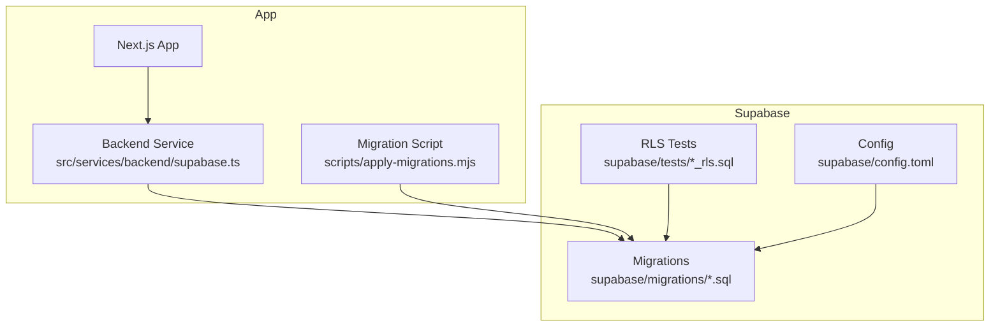
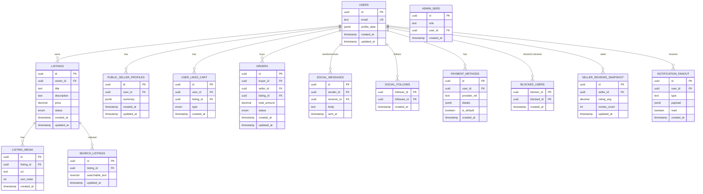
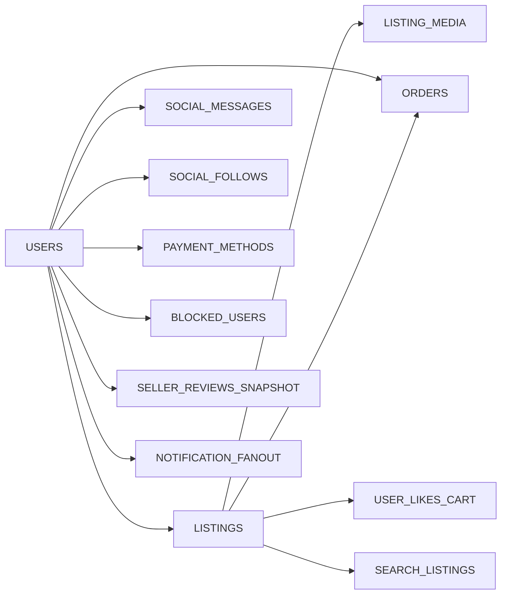

# Database Design

<cite>
**Referenced Files in This Document**
- [202607150001_phase_2_identity.sql](file://supabase/migrations/202607150001_phase_2_identity.sql)
- [202607150002_phase_3_listings.sql](file://supabase/migrations/202607150002_phase_3_listings.sql)
- [202607150003_phase_3_listing_media.sql](file://supabase/migrations/202607150003_phase_3_listing_media.sql)
- [202607150004_phase_3_public_seller_profiles.sql](file://supabase/migrations/202607150004_phase_3_public_seller_profiles.sql)
- [202607150005_phase_3_user_likes_and_cart.sql](file://supabase/migrations/202607150005_phase_3_user_likes_and_cart.sql)
- [202607150006_phase_3_orders.sql](file://supabase/migrations/202607150006_phase_3_orders.sql)
- [202607150007_phase_3_social.sql](file://supabase/migrations/202607150007_phase_3_social.sql)
- [202608060001_payment_methods.sql](file://supabase/migrations/202608060001_payment_methods.sql)
- [202608060002_blocked_users.sql](file://supabase/migrations/202608060002_blocked_users.sql)
- [202608060003_seller_reviews_snapshot.sql](file://supabase/migrations/202608060003_seller_reviews_snapshot.sql)
- [202608060004_notification_fanout.sql](file://supabase/migrations/202608060004_notification_fanout.sql)
- [202608060005_seed_admin.sql](file://supabase/migrations/202608060005_seed_admin.sql)
- [202608160429_u3_search_listings.sql](file://supabase/migrations/202608160429_u3_search_listings.sql)
- [202608160446_u8_user_follows.sql](file://supabase/migrations/202608160446_u8_user_follows.sql)
- [202608160503_svc_role_grants.sql](file://supabase/migrations/202608160503_svc_role_grants.sql)
- [202608160504_seller_card_view_security_invoker.sql](file://supabase/migrations/202608160504_seller_card_view_security_invoker.sql)
- [202608190001_fix_profile_recursion_and_avatar_storage.sql](file://supabase/migrations/202608190001_fix_profile_recursion_and_avatar_storage.sql)
- [202608190002_apply_pending_profile_avatars.sql](file://supabase/migrations/202608190002_apply_pending_profile_avatars.sql)
- [202608190003_sync_seller_card_avatar.sql](file://supabase/migrations/202608190003_sync_seller_card_avatar.sql)
- [202608200001_chat_unread_count.sql](file://supabase/migrations/202608200001_chat_unread_count.sql)
- [202608200002_extend_notification_fanout.sql](file://supabase/migrations/202608200002_extend_notification_fanout.sql)
- [phase_2_rls.sql](file://supabase/tests/phase_2_rls.sql)
- [phase_3_listings_rls.sql](file://supabase/tests/phase_3_listings_rls.sql)
- [phase_3_orders_rls.sql](file://supabase/tests/phase_3_orders_rls.sql)
- [phase_3_social_rls.sql](file://supabase/tests/phase_3_social_rls.sql)
- [phase_3_user_likes_rls.sql](file://supabase/tests/phase_3_user_likes_rls.sql)
- [phase_3_cart_items_rls.sql](file://supabase/tests/phase_3_cart_items_rls.sql)
- [phase_3_listing_media_rls.sql](file://supabase/tests/phase_3_listing_media_rls.sql)
- [phase_3_public_seller_profiles_rls.sql](file://supabase/tests/phase_3_public_seller_profiles_rls.sql)
- [phase_3_5_admin_rls.sql](file://supabase/tests/phase_3_5_admin_rls.sql)
- [phase_4_payment_methods_rls.sql](file://supabase/tests/phase_4_payment_methods_rls.sql)
- [phase_4_blocked_users_rls.sql](file://supabase/tests/phase_4_blocked_users_rls.sql)
- [config.toml](file://supabase/config.toml)
- [apply-migrations.mjs](file://scripts/apply-migrations.mjs)
- [supabase.ts](file://src/services/backend/supabase.ts)
</cite>

## Table of Contents
1. [Introduction](#introduction)
2. [Project Structure](#project-structure)
3. [Core Components](#core-components)
4. [Architecture Overview](#architecture-overview)
5. [Detailed Component Analysis](#detailed-component-analysis)
6. [Dependency Analysis](#dependency-analysis)
7. [Performance Considerations](#performance-considerations)
8. [Troubleshooting Guide](#troubleshooting-guide)
9. [Conclusion](#conclusion)
10. [Appendices](#appendices)

## Introduction
This document describes the PostgreSQL database design for the Mooday marketplace, focusing on tables and relationships for users, products (listings), orders, messages, and social features. It explains entity relationships, foreign key constraints, data integrity rules, migration strategies, version control, rollback procedures, indexing and query optimization, Row-Level Security (RLS) policies, data access patterns, permissions, backup and recovery, monitoring, and scaling considerations. The goal is to provide a comprehensive reference for developers and operators to understand and maintain the database safely and efficiently.

## Project Structure
The database schema and security are defined as SQL migrations under supabase/migrations. RLS tests validate security policies. A configuration file defines Supabase project settings, and a script applies migrations programmatically. The application uses a Supabase client to interact with the database.

**Diagram sources**
- [config.toml](file://supabase/config.toml)
- [apply-migrations.mjs](file://scripts/apply-migrations.mjs)
- [supabase.ts](file://src/services/backend/supabase.ts)

**Section sources**
- [config.toml](file://supabase/config.toml)
- [apply-migrations.mjs](file://scripts/apply-migrations.mjs)
- [supabase.ts](file://src/services/backend/supabase.ts)

## Core Components
The core data model spans identity, listings, media, profiles, likes/cart, orders, social interactions, payments, blocks, reviews snapshots, notifications, search, and admin seeding. Migrations introduce these entities and their relationships, while RLS tests define expected access controls.

Key components:
- Identity and user profiles: authentication and profile data
- Listings and media: product catalog and images
- Public seller profiles: curated public view of sellers
- Likes and cart: user engagement and shopping cart
- Orders: marketplace transactions
- Social: follows, chats/messages, and related features
- Payments and blocks: payment methods and user safety
- Reviews snapshot: stable seller reputation data
- Notifications fanout: scalable notification delivery
- Search: optimized listing search
- Admin: seeded roles and test fixtures

**Section sources**
- [202607150001_phase_2_identity.sql](file://supabase/migrations/202607150001_phase_2_identity.sql)
- [202607150002_phase_3_listings.sql](file://supabase/migrations/202607150002_phase_3_listings.sql)
- [202607150003_phase_3_listing_media.sql](file://supabase/migrations/202607150003_phase_3_listing_media.sql)
- [202607150004_phase_3_public_seller_profiles.sql](file://supabase/migrations/202607150004_phase_3_public_seller_profiles.sql)
- [202607150005_phase_3_user_likes_and_cart.sql](file://supabase/migrations/202607150005_phase_3_user_likes_and_cart.sql)
- [202607150006_phase_3_orders.sql](file://supabase/migrations/202607150006_phase_3_orders.sql)
- [202607150007_phase_3_social.sql](file://supabase/migrations/202607150007_phase_3_social.sql)
- [202608060001_payment_methods.sql](file://supabase/migrations/202608060001_payment_methods.sql)
- [202608060002_blocked_users.sql](file://supabase/migrations/202608060002_blocked_users.sql)
- [202608060003_seller_reviews_snapshot.sql](file://supabase/migrations/202608060003_seller_reviews_snapshot.sql)
- [202608060004_notification_fanout.sql](file://supabase/migrations/202608060004_notification_fanout.sql)
- [202608160429_u3_search_listings.sql](file://supabase/migrations/202608160429_u3_search_listings.sql)
- [202608160446_u8_user_follows.sql](file://supabase/migrations/202608160446_u8_user_follows.sql)
- [202608160503_svc_role_grants.sql](file://supabase/migrations/202608160503_svc_role_grants.sql)
- [202608160504_seller_card_view_security_invoker.sql](file://supabase/migrations/202608160504_seller_card_view_security_invoker.sql)
- [202608190001_fix_profile_recursion_and_avatar_storage.sql](file://supabase/migrations/202608190001_fix_profile_recursion_and_avatar_storage.sql)
- [202608190002_apply_pending_profile_avatars.sql](file://supabase/migrations/202608190002_apply_pending_profile_avatars.sql)
- [202608190003_sync_seller_card_avatar.sql](file://supabase/migrations/202608190003_sync_seller_card_avatar.sql)
- [202608200001_chat_unread_count.sql](file://supabase/migrations/202608200001_chat_unread_count.sql)
- [202608200002_extend_notification_fanout.sql](file://supabase/migrations/202608200002_extend_notification_fanout.sql)

## Architecture Overview
The database architecture centers on relational tables with strict referential integrity enforced via foreign keys. Access is governed by Row-Level Security policies that restrict row visibility based on authenticated user context. Read-heavy operations benefit from indexes and materialized views or denormalized structures where appropriate.

**Diagram sources**
- [202607150001_phase_2_identity.sql](file://supabase/migrations/202607150001_phase_2_identity.sql)
- [202607150002_phase_3_listings.sql](file://supabase/migrations/202607150002_phase_3_listings.sql)
- [202607150003_phase_3_listing_media.sql](file://supabase/migrations/202607150003_phase_3_listing_media.sql)
- [202607150004_phase_3_public_seller_profiles.sql](file://supabase/migrations/202607150004_phase_3_public_seller_profiles.sql)
- [202607150005_phase_3_user_likes_and_cart.sql](file://supabase/migrations/202607150005_phase_3_user_likes_and_cart.sql)
- [202607150006_phase_3_orders.sql](file://supabase/migrations/202607150006_phase_3_orders.sql)
- [202607150007_phase_3_social.sql](file://supabase/migrations/202607150007_phase_3_social.sql)
- [202608060001_payment_methods.sql](file://supabase/migrations/202608060001_payment_methods.sql)
- [202608060002_blocked_users.sql](file://supabase/migrations/202608060002_blocked_users.sql)
- [202608060003_seller_reviews_snapshot.sql](file://supabase/migrations/202608060003_seller_reviews_snapshot.sql)
- [202608060004_notification_fanout.sql](file://supabase/migrations/202608060004_notification_fanout.sql)
- [202608160429_u3_search_listings.sql](file://supabase/migrations/202608160429_u3_search_listings.sql)
- [202608160446_u8_user_follows.sql](file://supabase/migrations/202608160446_u8_user_follows.sql)
- [202608060005_seed_admin.sql](file://supabase/migrations/202608060005_seed_admin.sql)

## Detailed Component Analysis

### Users and Profiles
- Purpose: Store identity and profile metadata; foundation for ownership and permissions.
- Key fields: user ID, email, profile JSON, timestamps.
- Relationships: One-to-many with listings, orders, messages, likes/cart, payment methods, blocks, reviews snapshot, notifications.
- Integrity: Unique email constraint; foreign keys enforce ownership and associations.
- RLS: Policies ensure users can only access or modify their own rows unless explicitly allowed.

**Section sources**
- [202607150001_phase_2_identity.sql](file://supabase/migrations/202607150001_phase_2_identity.sql)
- [phase_2_rls.sql](file://supabase/tests/phase_2_rls.sql)

### Listings and Media
- Purpose: Product catalog with images and metadata.
- Key fields: listing ID, owner ID, title, description, price, status, timestamps.
- Relationships: One-to-many with listing media; referenced by orders and likes/cart.
- Integrity: Foreign keys to users; unique constraints where applicable; status enums for lifecycle.
- RLS: Sellers manage their listings; buyers and public users have restricted reads.

**Section sources**
- [202607150002_phase_3_listings.sql](file://supabase/migrations/202607150002_phase_3_listings.sql)
- [202607150003_phase_3_listing_media.sql](file://supabase/migrations/202607150003_phase_3_listing_media.sql)
- [phase_3_listings_rls.sql](file://supabase/tests/phase_3_listings_rls.sql)
- [phase_3_listing_media_rls.sql](file://supabase/tests/phase_3_listing_media_rls.sql)

### Public Seller Profiles
- Purpose: Curated public-facing seller information derived from user profiles.
- Key fields: profile ID, user ID, summary JSON, timestamps.
- Relationships: One-to-one with users; supports public discovery.
- Integrity: Foreign key to users; ensures consistency between private and public views.

**Section sources**
- [202607150004_phase_3_public_seller_profiles.sql](file://supabase/migrations/202607150004_phase_3_public_seller_profiles.sql)
- [phase_3_public_seller_profiles_rls.sql](file://supabase/tests/phase_3_public_seller_profiles_rls.sql)
- [202608190001_fix_profile_recursion_and_avatar_storage.sql](file://supabase/migrations/202608190001_fix_profile_recursion_and_avatar_storage.sql)
- [202608190002_apply_pending_profile_avatars.sql](file://supabase/migrations/202608190002_apply_pending_profile_avatars.sql)
- [202608190003_sync_seller_card_avatar.sql](file://supabase/migrations/202608190003_sync_seller_card_avatar.sql)

### Likes and Cart
- Purpose: Track user engagement (likes) and shopping intent (cart).
- Key fields: like/cart entry ID, user ID, listing ID, type discriminator, timestamps.
- Relationships: Many-to-many through join table; references to users and listings.
- Integrity: Unique constraints per user/listing/type to prevent duplicates.
- RLS: Users can only manage their own entries.

**Section sources**
- [202607150005_phase_3_user_likes_and_cart.sql](file://supabase/migrations/202607150005_phase_3_user_likes_and_cart.sql)
- [phase_3_user_likes_rls.sql](file://supabase/tests/phase_3_user_likes_rls.sql)
- [phase_3_cart_items_rls.sql](file://supabase/tests/phase_3_cart_items_rls.sql)

### Orders
- Purpose: Marketplace transactions linking buyers, sellers, and listings.
- Key fields: order ID, buyer ID, seller ID, listing ID, total amount, status, timestamps.
- Relationships: References to users and listings; central to commerce flow.
- Integrity: Foreign keys ensure valid participants; status transitions enforced by application logic and possibly triggers.
- RLS: Buyers see their orders; sellers see orders involving their listings; admins may have broader access.

**Section sources**
- [202607150006_phase_3_orders.sql](file://supabase/migrations/202607150006_phase_3_orders.sql)
- [phase_3_orders_rls.sql](file://supabase/tests/phase_3_orders_rls.sql)

### Messages and Social Features
- Purpose: Enable communication and social graph (follows).
- Key fields: message ID, sender/receiver IDs, body, sent timestamp; follow pairs with timestamps.
- Relationships: Many-to-many messaging; symmetric or directed follows depending on policy.
- Integrity: Foreign keys to users; uniqueness constraints to avoid duplicate follows.
- RLS: Users can only read/write messages they participate in; follows are user-scoped.

**Section sources**
- [202607150007_phase_3_social.sql](file://supabase/migrations/202607150007_phase_3_social.sql)
- [202608160446_u8_user_follows.sql](file://supabase/migrations/202608160446_u8_user_follows.sql)
- [202608200001_chat_unread_count.sql](file://supabase/migrations/202608200001_chat_unread_count.sql)
- [phase_3_social_rls.sql](file://supabase/tests/phase_3_social_rls.sql)

### Payment Methods
- Purpose: Store user payment instrument references securely.
- Key fields: method ID, user ID, provider reference, details JSON, default flag, timestamps.
- Relationships: One-to-many with users; used during checkout flows.
- Integrity: Foreign key to users; default method constraint per user.

**Section sources**
- [202608060001_payment_methods.sql](file://supabase/migrations/202608060001_payment_methods.sql)
- [phase_4_payment_methods_rls.sql](file://supabase/tests/phase_4_payment_methods_rls.sql)

### Blocked Users
- Purpose: Safety feature to block other users.
- Key fields: blocker ID, blocked ID, timestamp.
- Relationships: Self-referencing user relationships; prevents unwanted interactions.
- Integrity: Unique pair constraint; foreign keys to users.

**Section sources**
- [202608060002_blocked_users.sql](file://supabase/migrations/202608060002_blocked_users.sql)
- [phase_4_blocked_users_rls.sql](file://supabase/tests/phase_4_blocked_users_rls.sql)

### Seller Reviews Snapshot
- Purpose: Stable aggregation of seller ratings and counts for performance.
- Key fields: snapshot ID, seller ID, average rating, review count, updated timestamp.
- Relationships: One-to-one with users; updated by background processes or triggers.
- Integrity: Referential integrity to users; computed values maintained consistently.

**Section sources**
- [202608060003_seller_reviews_snapshot.sql](file://supabase/migrations/202608060003_seller_reviews_snapshot.sql)

### Notification Fanout
- Purpose: Scalable delivery of notifications to users.
- Key fields: fanout ID, user ID, type, payload JSON, read flag, timestamp.
- Relationships: One-to-many with users; consumed by clients or services.
- Integrity: Foreign key to users; read flags enable efficient updates.

**Section sources**
- [202608060004_notification_fanout.sql](file://supabase/migrations/202608060004_notification_fanout.sql)
- [202608200002_extend_notification_fanout.sql](file://supabase/migrations/202608200002_extend_notification_fanout.sql)

### Search Listings
- Purpose: Optimized full-text search over listings.
- Key fields: index ID, listing ID, tsvector searchable text, updated timestamp.
- Relationships: One-to-one with listings; driven by triggers or batch jobs.
- Integrity: Foreign key to listings; tsvector kept in sync.

**Section sources**
- [202608160429_u3_search_listings.sql](file://supabase/migrations/202608160429_u3_search_listings.sql)

### Admin Seed and Role Grants
- Purpose: Seed admin roles and grant service-level privileges.
- Key fields: seed ID, role, user ID, timestamps.
- Relationships: Links admin users to roles; grants support backend service access.

**Section sources**
- [202608060005_seed_admin.sql](file://supabase/migrations/202608060005_seed_admin.sql)
- [202608160503_svc_role_grants.sql](file://supabase/migrations/202608160503_svc_role_grants.sql)
- [202608160504_seller_card_view_security_invoker.sql](file://supabase/migrations/202608160504_seller_card_view_security_invoker.sql)
- [phase_3_5_admin_rls.sql](file://supabase/tests/phase_3_5_admin_rls.sql)

## Dependency Analysis
The database exhibits clear hierarchical dependencies:
- Users are foundational; all other entities reference users.
- Listings depend on users; media depends on listings.
- Orders depend on users and listings.
- Social features depend on users.
- Payment methods, blocks, reviews snapshot, notifications, and search depend on users and/or listings.

**Diagram sources**
- [202607150001_phase_2_identity.sql](file://supabase/migrations/202607150001_phase_2_identity.sql)
- [202607150002_phase_3_listings.sql](file://supabase/migrations/202607150002_phase_3_listings.sql)
- [202607150003_phase_3_listing_media.sql](file://supabase/migrations/202607150003_phase_3_listing_media.sql)
- [202607150005_phase_3_user_likes_and_cart.sql](file://supabase/migrations/202607150005_phase_3_user_likes_and_cart.sql)
- [202607150006_phase_3_orders.sql](file://supabase/migrations/202607150006_phase_3_orders.sql)
- [202607150007_phase_3_social.sql](file://supabase/migrations/202607150007_phase_3_social.sql)
- [202608060001_payment_methods.sql](file://supabase/migrations/202608060001_payment_methods.sql)
- [202608060002_blocked_users.sql](file://supabase/migrations/202608060002_blocked_users.sql)
- [202608060003_seller_reviews_snapshot.sql](file://supabase/migrations/202608060003_seller_reviews_snapshot.sql)
- [202608060004_notification_fanout.sql](file://supabase/migrations/202608060004_notification_fanout.sql)
- [202608160429_u3_search_listings.sql](file://supabase/migrations/202608160429_u3_search_listings.sql)

**Section sources**
- [202607150001_phase_2_identity.sql](file://supabase/migrations/202607150001_phase_2_identity.sql)
- [202607150002_phase_3_listings.sql](file://supabase/migrations/202607150002_phase_3_listings.sql)
- [202607150006_phase_3_orders.sql](file://supabase/migrations/202607150006_phase_3_orders.sql)
- [202607150007_phase_3_social.sql](file://supabase/migrations/202607150007_phase_3_social.sql)

## Performance Considerations
- Indexing strategy:
  - Primary keys on all tables for fast lookups.
  - Foreign key indexes on referencing columns (e.g., listing_id, user_id) to optimize joins and cascading checks.
  - Full-text search index using tsvector on search listings for efficient queries.
  - Composite indexes on frequently filtered columns (e.g., status, timestamps) for common filters.
- Query optimization:
  - Use selective WHERE clauses and JOINs with indexed columns.
  - Avoid SELECT *; project only needed columns.
  - Leverage pagination with LIMIT/OFFSET or keyset pagination for large result sets.
  - Denormalize read-heavy aggregates (e.g., seller reviews snapshot) to reduce expensive computations.
- Concurrency and locking:
  - Use transactions for multi-step writes (orders, payments).
  - Minimize long-running transactions to reduce lock contention.
- Monitoring:
  - Track slow queries via database logs and analytics.
  - Monitor index usage and bloat; rebuild if necessary.
- Scaling:
  - Partition large tables (e.g., messages, notifications) by time or user ranges when growth demands it.
  - Consider read replicas for heavy read workloads.

[No sources needed since this section provides general guidance]

## Troubleshooting Guide
- RLS policy issues:
  - Validate policies using RLS tests to ensure correct row visibility and mutations.
  - Check current user context and session roles when debugging access errors.
- Migration failures:
  - Review migration scripts for dependency ordering and idempotency.
  - Use rollback procedures to revert problematic migrations safely.
- Data integrity errors:
  - Inspect foreign key violations and resolve orphaned records.
  - Ensure unique constraints are respected during bulk imports.
- Performance regressions:
  - Analyze query plans for slow queries; add or adjust indexes.
  - Rebuild indexes and analyze statistics after large data changes.

**Section sources**
- [phase_2_rls.sql](file://supabase/tests/phase_2_rls.sql)
- [phase_3_listings_rls.sql](file://supabase/tests/phase_3_listings_rls.sql)
- [phase_3_orders_rls.sql](file://supabase/tests/phase_3_orders_rls.sql)
- [phase_3_social_rls.sql](file://supabase/tests/phase_3_social_rls.sql)
- [phase_3_user_likes_rls.sql](file://supabase/tests/phase_3_user_likes_rls.sql)
- [phase_3_cart_items_rls.sql](file://supabase/tests/phase_3_cart_items_rls.sql)
- [phase_3_listing_media_rls.sql](file://supabase/tests/phase_3_listing_media_rls.sql)
- [phase_3_public_seller_profiles_rls.sql](file://supabase/tests/phase_3_public_seller_profiles_rls.sql)
- [phase_3_5_admin_rls.sql](file://supabase/tests/phase_3_5_admin_rls.sql)
- [phase_4_payment_methods_rls.sql](file://supabase/tests/phase_4_payment_methods_rls.sql)
- [phase_4_blocked_users_rls.sql](file://supabase/tests/phase_4_blocked_users_rls.sql)

## Conclusion
The Mooday marketplace database is structured around robust relational modeling with strong referential integrity and fine-grained access control via RLS. Migrations provide version-controlled evolution of the schema, while tests validate security policies. Performance is addressed through indexing, denormalization where appropriate, and careful query design. Operational practices include disciplined migration management, monitoring, and scaling strategies to support growth.

[No sources needed since this section summarizes without analyzing specific files]

## Appendices

### Migration Strategy and Version Control
- All schema changes are captured as numbered SQL migrations under supabase/migrations.
- Apply migrations in order using the provided script to ensure consistent state across environments.
- Maintain backward compatibility; prefer additive changes and safe defaults.

**Section sources**
- [apply-migrations.mjs](file://scripts/apply-migrations.mjs)
- [config.toml](file://supabase/config.toml)

### Rollback Procedures
- To roll back, create a new migration that reverses prior changes (drop tables/columns, remove indexes, revoke privileges).
- Test rollbacks in staging before applying to production.
- Keep backups before running destructive migrations.

[No sources needed since this section provides general guidance]

### Row-Level Security (RLS) Policies and Permission Model
- RLS policies restrict row access based on authenticated user context.
- Policies are validated by RLS tests covering each major entity.
- Service roles and invoker privileges are granted via dedicated migrations for backend operations.

**Section sources**
- [phase_2_rls.sql](file://supabase/tests/phase_2_rls.sql)
- [phase_3_listings_rls.sql](file://supabase/tests/phase_3_listings_rls.sql)
- [phase_3_orders_rls.sql](file://supabase/tests/phase_3_orders_rls.sql)
- [phase_3_social_rls.sql](file://supabase/tests/phase_3_social_rls.sql)
- [phase_3_user_likes_rls.sql](file://supabase/tests/phase_3_user_likes_rls.sql)
- [phase_3_cart_items_rls.sql](file://supabase/tests/phase_3_cart_items_rls.sql)
- [phase_3_listing_media_rls.sql](file://supabase/tests/phase_3_listing_media_rls.sql)
- [phase_3_public_seller_profiles_rls.sql](file://supabase/tests/phase_3_public_seller_profiles_rls.sql)
- [phase_3_5_admin_rls.sql](file://supabase/tests/phase_3_5_admin_rls.sql)
- [phase_4_payment_methods_rls.sql](file://supabase/tests/phase_4_payment_methods_rls.sql)
- [phase_4_blocked_users_rls.sql](file://supabase/tests/phase_4_blocked_users_rls.sql)
- [202608160503_svc_role_grants.sql](file://supabase/migrations/202608160503_svc_role_grants.sql)
- [202608160504_seller_card_view_security_invoker.sql](file://supabase/migrations/202608160504_seller_card_view_security_invoker.sql)

### Data Access Patterns
- Use the Supabase client from the application to perform CRUD operations.
- Prefer parameterized queries to prevent injection and leverage prepared statements.
- Batch operations where possible to reduce round trips.

**Section sources**
- [supabase.ts](file://src/services/backend/supabase.ts)

### Backup and Recovery
- Schedule regular logical backups (e.g., pg_dump) of the database.
- Store backups securely with encryption and retention policies.
- Test restore procedures periodically to ensure recoverability.

[No sources needed since this section provides general guidance]

### Monitoring Queries
- Enable query logging for slow queries and analyze execution plans.
- Set up alerts for high error rates and lock contention.
- Track index usage and maintenance tasks.

[No sources needed since this section provides general guidance]

### Common Queries Examples
- Retrieve a user’s listings with media:
  - Join listings and listing_media on listing_id; filter by owner_id.
- Fetch orders for a buyer:
  - Filter orders by buyer_id; join listings for details.
- Get unread messages for a user:
  - Filter messages by receiver_id and read status; order by sent timestamp.
- Search listings by keywords:
  - Use tsvector column and full-text search functions.

[No sources needed since this section provides general guidance]

### Data Modeling Decisions
- Denormalization:
  - Seller reviews snapshot reduces expensive aggregations on the fly.
- Separation of concerns:
  - Public seller profiles decouple public display from private user data.
- Extensibility:
  - JSONB fields allow flexible metadata without schema churn.

[No sources needed since this section provides general guidance]

### Database Maintenance Tasks
- Regularly analyze and vacuum tables to maintain performance.
- Reindex after large data loads or schema changes.
- Review and update indexes based on query patterns.

[No sources needed since this section provides general guidance]