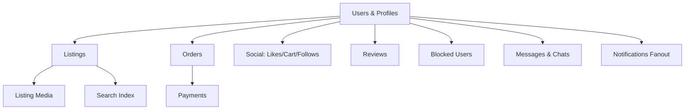
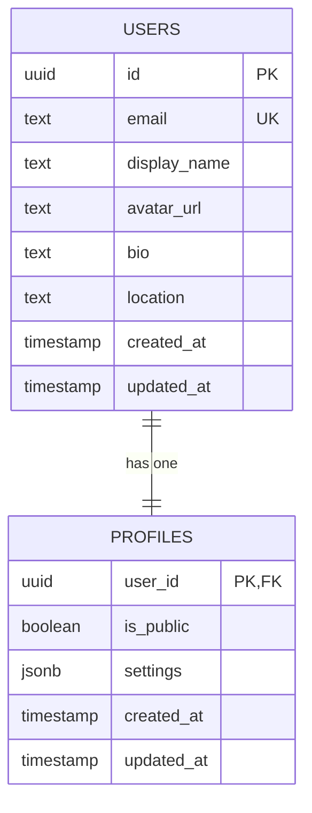
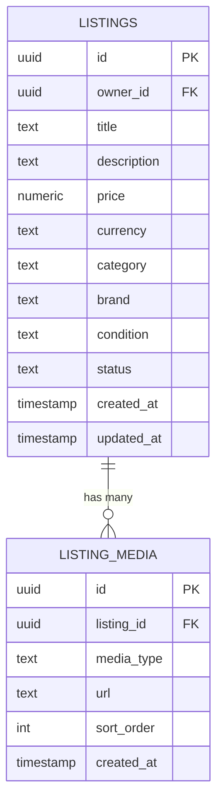
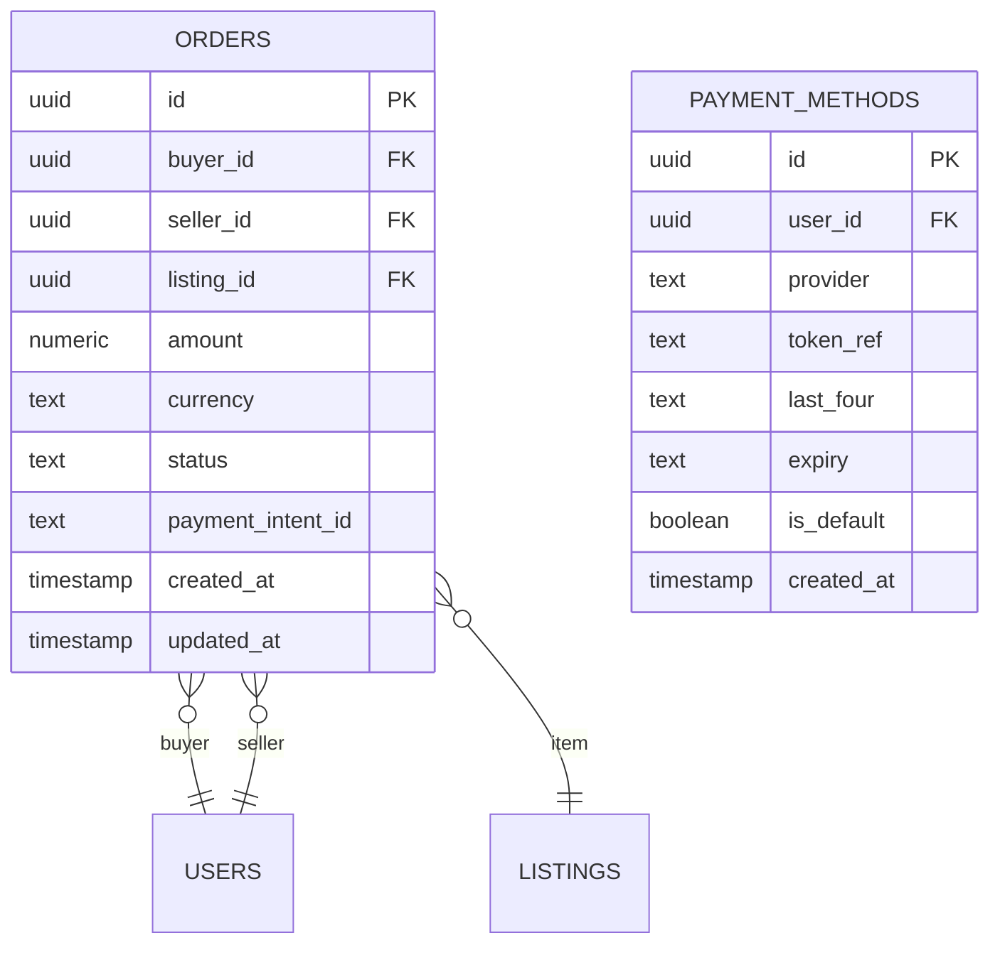
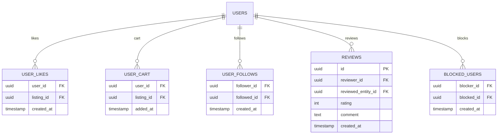
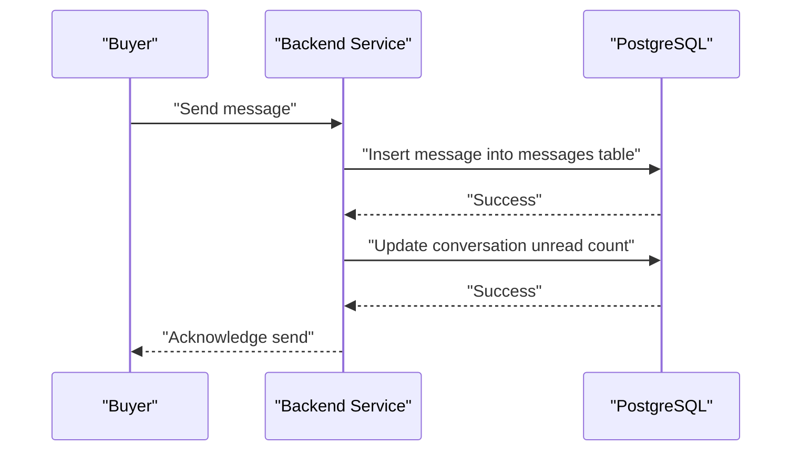
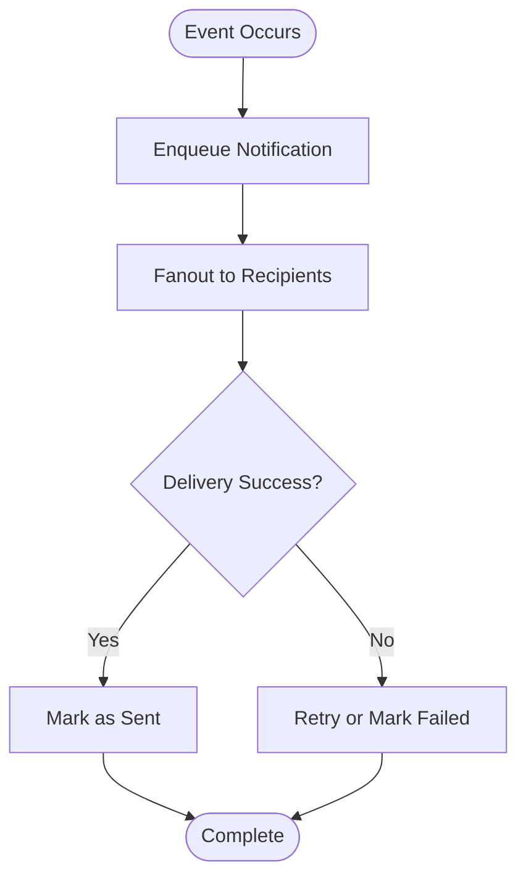
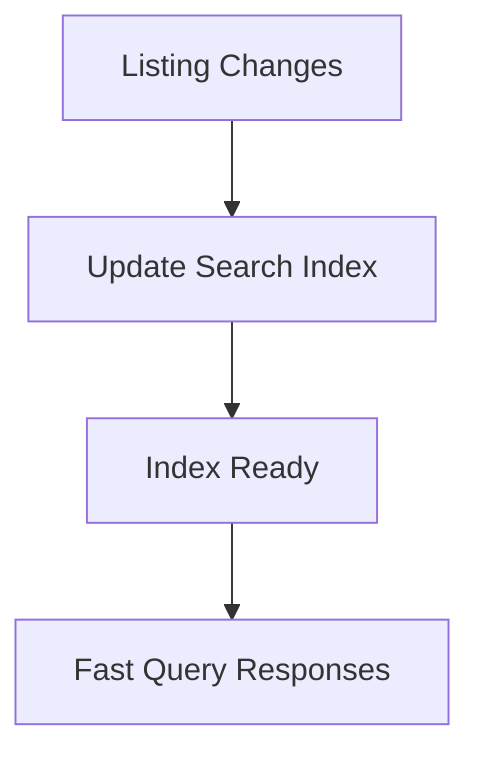
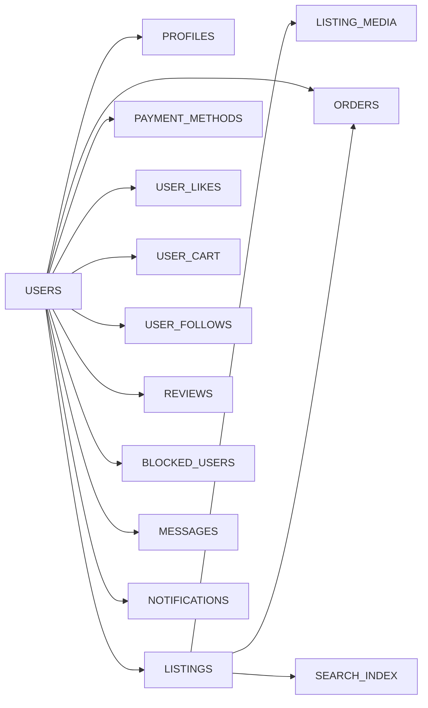

# Database Schema

<cite>
**Referenced Files in This Document**
- [202607150001_phase_2_identity.sql](file://supabase/migrations/202607150001_phase_2_identity.sql)
- [202607150002_phase_3_listings.sql](file://supabase/migrations/202607150002_phase_3_listings.sql)
- [202607150003_phase_3_listing_media.sql](file://supabase/migrations/202607150003_phase_3_listing_media.sql)
- [202607150004_phase_3_public_seller_profiles.sql](file://supabase/migrations/202607150004_phase_3_public_seller_profiles.sql)
- [202607150005_phase_3_user_likes_and_cart.sql](file://supabase/migrations/202607150005_phase_3_user_likes_and_cart.sql)
- [202607150006_phase_3_orders.sql](file://supabase/migrations/202607150006_phase_3_orders.sql)
- [202607150007_phase_3_social.sql](file://supabase/migrations/202607150007_phase_3_social.sql)
- [202608060001_payment_methods.sql](file://supabase/migrations/202608060001_payment_methods.sql)
- [202608060002_blocked_users.sql](file://supabase/migrations/202608060002_blocked_users.sql)
- [202608060003_seller_reviews_snapshot.sql](file://supabase/migrations/202608060003_seller_reviews_snapshot.sql)
- [202608060004_notification_fanout.sql](file://supabase/migrations/202608060004_notification_fanout.sql)
- [202608160429_u3_search_listings.sql](file://supabase/migrations/202608160429_u3_search_listings.sql)
- [202608160446_u8_user_follows.sql](file://supabase/migrations/202608160446_u8_user_follows.sql)
- [202608190001_fix_profile_recursion_and_avatar_storage.sql](file://supabase/migrations/202608190001_fix_profile_recursion_and_avatar_storage.sql)
- [202608200001_chat_unread_count.sql](file://supabase/migrations/202608200001_chat_unread_count.sql)
- [202608200002_extend_notification_fanout.sql](file://supabase/migrations/202608200002_extend_notification_fanout.sql)
- [mappers.ts](file://src/services/backend/mappers.ts)
- [mappers-orders.ts](file://src/services/backend/mappers-orders.ts)
- [mappers-social.ts](file://src/services/backend/mappers-social.ts)
</cite>

## Table of Contents
1. Introduction
2. Project Structure
3. Core Components
4. Architecture Overview
5. Detailed Component Analysis
6. Dependency Analysis
7. Performance Considerations
8. Troubleshooting Guide
9. Conclusion
10. Appendices

## Introduction
This document provides comprehensive database schema documentation for the Mooday marketplace, focusing on PostgreSQL tables and relationships that support users, profiles, listings, orders, messages, reviews, and social features. It explains entity relationships, primary and foreign key constraints, data types, default values, validation rules, indexing strategies, performance considerations, and common query patterns used by the application.

## Project Structure
The database schema is defined through Supabase migrations under supabase/migrations. Each migration file introduces or alters tables, indexes, constraints, and policies. Application code references these tables via service mappers and backend services.

```mermaid
graph TB
subgraph "Migrations"
M1["202607150001_phase_2_identity.sql"]
M2["202607150002_phase_3_listings.sql"]
M3["202607150003_phase_3_listing_media.sql"]
M4["202607150004_phase_3_public_seller_profiles.sql"]
M5["202607150005_phase_3_user_likes_and_cart.sql"]
M6["202607150006_phase_3_orders.sql"]
M7["202607150007_phase_3_social.sql"]
M8["202608060001_payment_methods.sql"]
M9["202608060002_blocked_users.sql"]
M10["202608060003_seller_reviews_snapshot.sql"]
M11["202608060004_notification_fanout.sql"]
M12["202608160429_u3_search_listings.sql"]
M13["202608160446_u8_user_follows.sql"]
M14["202608190001_fix_profile_recursion_and_avatar_storage.sql"]
M15["202608200001_chat_unread_count.sql"]
M16["202608200002_extend_notification_fanout.sql"]
end
subgraph "App Services"
S1["mappers.ts"]
S2["mappers-orders.ts"]
S3["mappers-social.ts"]
end
M1 --> S1
M2 --> S1
M3 --> S1
M4 --> S1
M5 --> S1
M6 --> S2
M7 --> S3
M8 --> S1
M9 --> S1
M10 --> S1
M11 --> S1
M12 --> S1
M13 --> S3
M14 --> S1
M15 --> S1
M16 --> S1
```

**Diagram sources**
- [202607150001_phase_2_identity.sql:1-200](file://supabase/migrations/202607150001_phase_2_identity.sql#L1-L200)
- [202607150002_phase_3_listings.sql:1-200](file://supabase/migrations/202607150002_phase_3_listings.sql#L1-L200)
- [202607150003_phase_3_listing_media.sql:1-200](file://supabase/migrations/202607150003_phase_3_listing_media.sql#L1-L200)
- [202607150004_phase_3_public_seller_profiles.sql:1-200](file://supabase/migrations/202607150004_phase_3_public_seller_profiles.sql#L1-L200)
- [202607150005_phase_3_user_likes_and_cart.sql:1-200](file://supabase/migrations/202607150005_phase_3_user_likes_and_cart.sql#L1-L200)
- [202607150006_phase_3_orders.sql:1-200](file://supabase/migrations/202607150006_phase_3_orders.sql#L1-L200)
- [202607150007_phase_3_social.sql:1-200](file://supabase/migrations/202607150007_phase_3_social.sql#L1-L200)
- [202608060001_payment_methods.sql:1-200](file://supabase/migrations/202608060001_payment_methods.sql#L1-L200)
- [202608060002_blocked_users.sql:1-200](file://supabase/migrations/202608060002_blocked_users.sql#L1-L200)
- [202608060003_seller_reviews_snapshot.sql:1-200](file://supabase/migrations/202608060003_seller_reviews_snapshot.sql#L1-L200)
- [202608060004_notification_fanout.sql:1-200](file://supabase/migrations/202608060004_notification_fanout.sql#L1-L200)
- [202608160429_u3_search_listings.sql:1-200](file://supabase/migrations/202608160429_u3_search_listings.sql#L1-L200)
- [202608160446_u8_user_follows.sql:1-200](file://supabase/migrations/202608160446_u8_user_follows.sql#L1-L200)
- [202608190001_fix_profile_recursion_and_avatar_storage.sql:1-200](file://supabase/migrations/202608190001_fix_profile_recursion_and_avatar_storage.sql#L1-L200)
- [202608200001_chat_unread_count.sql:1-200](file://supabase/migrations/202608200001_chat_unread_count.sql#L1-L200)
- [202608200002_extend_notification_fanout.sql:1-200](file://supabase/migrations/202608200002_extend_notification_fanout.sql#L1-L200)
- [mappers.ts:1-200](file://src/services/backend/mappers.ts#L1-L200)
- [mappers-orders.ts:1-200](file://src/services/backend/mappers-orders.ts#L1-L200)
- [mappers-social.ts:1-200](file://src/services/backend/mappers-social.ts#L1-L200)

**Section sources**
- [202607150001_phase_2_identity.sql:1-200](file://supabase/migrations/202607150001_phase_2_identity.sql#L1-L200)
- [202607150002_phase_3_listings.sql:1-200](file://supabase/migrations/202607150002_phase_3_listings.sql#L1-L200)
- [202607150003_phase_3_listing_media.sql:1-200](file://supabase/migrations/202607150003_phase_3_listing_media.sql#L1-L200)
- [202607150004_phase_3_public_seller_profiles.sql:1-200](file://supabase/migrations/202607150004_phase_3_public_seller_profiles.sql#L1-L200)
- [202607150005_phase_3_user_likes_and_cart.sql:1-200](file://supabase/migrations/202607150005_phase_3_user_likes_and_cart.sql#L1-L200)
- [202607150006_phase_3_orders.sql:1-200](file://supabase/migrations/202607150006_phase_3_orders.sql#L1-L200)
- [202607150007_phase_3_social.sql:1-200](file://supabase/migrations/202607150007_phase_3_social.sql#L1-L200)
- [202608060001_payment_methods.sql:1-200](file://supabase/migrations/202608060001_payment_methods.sql#L1-L200)
- [202608060002_blocked_users.sql:1-200](file://supabase/migrations/202608060002_blocked_users.sql#L1-L200)
- [202608060003_seller_reviews_snapshot.sql:1-200](file://supabase/migrations/202608060003_seller_reviews_snapshot.sql#L1-L200)
- [202608060004_notification_fanout.sql:1-200](file://supabase/migrations/202608060004_notification_fanout.sql#L1-L200)
- [202608160429_u3_search_listings.sql:1-200](file://supabase/migrations/202608160429_u3_search_listings.sql#L1-L200)
- [202608160446_u8_user_follows.sql:1-200](file://supabase/migrations/202608160446_u8_user_follows.sql#L1-L200)
- [202608190001_fix_profile_recursion_and_avatar_storage.sql:1-200](file://supabase/migrations/202608190001_fix_profile_recursion_and_avatar_storage.sql#L1-L200)
- [202608200001_chat_unread_count.sql:1-200](file://supabase/migrations/202608200001_chat_unread_count.sql#L1-L200)
- [202608200002_extend_notification_fanout.sql:1-200](file://supabase/migrations/202608200002_extend_notification_fanout.sql#L1-L200)
- [mappers.ts:1-200](file://src/services/backend/mappers.ts#L1-L200)
- [mappers-orders.ts:1-200](file://src/services/backend/mappers-orders.ts#L1-L200)
- [mappers-social.ts:1-200](file://src/services/backend/mappers-social.ts#L1-L200)

## Core Components
This section summarizes the core entities introduced by the migrations and their roles in the marketplace:

- Identity and Users
  - User identity records created during authentication setup.
  - Profile information linked to user identity.

- Listings and Media
  - Product listings with attributes such as title, description, price, category, brand, condition, and status.
  - Listing media attachments for images and videos.

- Public Seller Profiles
  - Public-facing seller profile metadata derived from user profiles.

- Orders and Payments
  - Orders capturing buyer-seller transactions, payment intent linkage, and order lifecycle states.
  - Payment methods stored per user for checkout reuse.

- Social Features
  - Likes and cart items per user.
  - Follow relationships between users.
  - Reviews and ratings for sellers/listings.
  - Blocked users to enforce safety.

- Messaging and Notifications
  - Chat conversations and messages between users.
  - Notification fanout table for scalable delivery.

- Search Optimization
  - Dedicated search index/table for listings to accelerate discovery queries.

**Section sources**
- [202607150001_phase_2_identity.sql:1-200](file://supabase/migrations/202607150001_phase_2_identity.sql#L1-L200)
- [202607150002_phase_3_listings.sql:1-200](file://supabase/migrations/202607150002_phase_3_listings.sql#L1-L200)
- [202607150003_phase_3_listing_media.sql:1-200](file://supabase/migrations/202607150003_phase_3_listing_media.sql#L1-L200)
- [202607150004_phase_3_public_seller_profiles.sql:1-200](file://supabase/migrations/202607150004_phase_3_public_seller_profiles.sql#L1-L200)
- [202607150005_phase_3_user_likes_and_cart.sql:1-200](file://supabase/migrations/202607150005_phase_3_user_likes_and_cart.sql#L1-L200)
- [202607150006_phase_3_orders.sql:1-200](file://supabase/migrations/202607150006_phase_3_orders.sql#L1-L200)
- [202607150007_phase_3_social.sql:1-200](file://supabase/migrations/202607150007_phase_3_social.sql#L1-L200)
- [202608060001_payment_methods.sql:1-200](file://supabase/migrations/202608060001_payment_methods.sql#L1-L200)
- [202608060002_blocked_users.sql:1-200](file://supabase/migrations/202608060002_blocked_users.sql#L1-L200)
- [202608060003_seller_reviews_snapshot.sql:1-200](file://supabase/migrations/202608060003_seller_reviews_snapshot.sql#L1-L200)
- [202608060004_notification_fanout.sql:1-200](file://supabase/migrations/202608060004_notification_fanout.sql#L1-L200)
- [202608160429_u3_search_listings.sql:1-200](file://supabase/migrations/202608160429_u3_search_listings.sql#L1-L200)
- [202608160446_u8_user_follows.sql:1-200](file://supabase/migrations/202608160446_u8_user_follows.sql#L1-L200)
- [202608190001_fix_profile_recursion_and_avatar_storage.sql:1-200](file://supabase/migrations/202608190001_fix_profile_recursion_and_avatar_storage.sql#L1-L200)
- [202608200001_chat_unread_count.sql:1-200](file://supabase/migrations/202608200001_chat_unread_count.sql#L1-L200)
- [202608200002_extend_notification_fanout.sql:1-200](file://supabase/migrations/202608200002_extend_notification_fanout.sql#L1-L200)

## Architecture Overview
The database architecture centers around a normalized set of tables with clear ownership and referential integrity enforced via foreign keys. Row-level security (RLS) policies are applied across tables to ensure users can only access their own data unless explicitly allowed. The application uses typed mappers to translate between database rows and TypeScript models.

**Diagram sources**
- [202607150001_phase_2_identity.sql:1-200](file://supabase/migrations/202607150001_phase_2_identity.sql#L1-L200)
- [202607150002_phase_3_listings.sql:1-200](file://supabase/migrations/202607150002_phase_3_listings.sql#L1-L200)
- [202607150003_phase_3_listing_media.sql:1-200](file://supabase/migrations/202607150003_phase_3_listing_media.sql#L1-L200)
- [202607150006_phase_3_orders.sql:1-200](file://supabase/migrations/202607150006_phase_3_orders.sql#L1-L200)
- [202607150007_phase_3_social.sql:1-200](file://supabase/migrations/202607150007_phase_3_social.sql#L1-L200)
- [202608060001_payment_methods.sql:1-200](file://supabase/migrations/202608060001_payment_methods.sql#L1-L200)
- [202608060002_blocked_users.sql:1-200](file://supabase/migrations/202608060002_blocked_users.sql#L1-L200)
- [202608060003_seller_reviews_snapshot.sql:1-200](file://supabase/migrations/202608060003_seller_reviews_snapshot.sql#L1-L200)
- [202608060004_notification_fanout.sql:1-200](file://supabase/migrations/202608060004_notification_fanout.sql#L1-L200)
- [202608160429_u3_search_listings.sql:1-200](file://supabase/migrations/202608160429_u3_search_listings.sql#L1-L200)
- [202608160446_u8_user_follows.sql:1-200](file://supabase/migrations/202608160446_u8_user_follows.sql#L1-L200)
- [202608200001_chat_unread_count.sql:1-200](file://supabase/migrations/202608200001_chat_unread_count.sql#L1-L200)

## Detailed Component Analysis

### Users and Profiles
- Purpose: Store authenticated identities and user profile details.
- Key fields:
  - User ID (primary key), email, display name, avatar URL, bio, location, and timestamps.
  - Profile-specific flags like public visibility and role indicators.
- Constraints:
  - Primary key on user ID.
  - Unique constraints on email where applicable.
  - Default values for timestamps and booleans.
- Business rules:
  - Only the owner or authorized roles can update sensitive fields.
  - Avatar storage paths must be valid and validated before insertion.

**Diagram sources**
- [202607150001_phase_2_identity.sql:1-200](file://supabase/migrations/202607150001_phase_2_identity.sql#L1-L200)
- [202608190001_fix_profile_recursion_and_avatar_storage.sql:1-200](file://supabase/migrations/202608190001_fix_profile_recursion_and_avatar_storage.sql#L1-L200)

**Section sources**
- [202607150001_phase_2_identity.sql:1-200](file://supabase/migrations/202607150001_phase_2_identity.sql#L1-L200)
- [202608190001_fix_profile_recursion_and_avatar_storage.sql:1-200](file://supabase/migrations/202608190001_fix_profile_recursion_and_avatar_storage.sql#L1-L200)

### Listings and Listing Media
- Purpose: Represent items available for sale and their associated media assets.
- Key fields:
  - Listing ID (primary key), owner/user ID (foreign key), title, description, price, currency, category, brand, condition, status, and timestamps.
  - Media entries include listing ID (foreign key), media type, URL/path, and sort order.
- Constraints:
  - Foreign key from listing.media to listings.id.
  - Status enum constraints (e.g., draft, active, sold).
  - Price must be positive; currency codes validated.
- Business rules:
  - Only listing owners or admins can modify listings.
  - Media must belong to an existing listing.

**Diagram sources**
- [202607150002_phase_3_listings.sql:1-200](file://supabase/migrations/202607150002_phase_3_listings.sql#L1-L200)
- [202607150003_phase_3_listing_media.sql:1-200](file://supabase/migrations/202607150003_phase_3_listing_media.sql#L1-L200)

**Section sources**
- [202607150002_phase_3_listings.sql:1-200](file://supabase/migrations/202607150002_phase_3_listings.sql#L1-L200)
- [202607150003_phase_3_listing_media.sql:1-200](file://supabase/migrations/202607150003_phase_3_listing_media.sql#L1-L200)

### Orders and Payments
- Purpose: Capture transactional data between buyers and sellers, including payment linkage and order lifecycle.
- Key fields:
  - Order ID (primary key), buyer ID (FK), seller ID (FK), listing ID (FK), amount, currency, status, payment intent ID, and timestamps.
  - Payment methods store user ID (FK), provider token/reference, last four digits, expiry, and default flag.
- Constraints:
  - Foreign keys to users and listings.
  - Status enums (e.g., pending, paid, shipped, delivered, cancelled).
  - Amount must be non-negative; currency validated.
- Business rules:
  - Order transitions follow strict state machine rules enforced by application logic and DB checks.
  - Payment intents must match order amounts and currencies.

**Diagram sources**
- [202607150006_phase_3_orders.sql:1-200](file://supabase/migrations/202607150006_phase_3_orders.sql#L1-L200)
- [202608060001_payment_methods.sql:1-200](file://supabase/migrations/202608060001_payment_methods.sql#L1-L200)

**Section sources**
- [202607150006_phase_3_orders.sql:1-200](file://supabase/migrations/202607150006_phase_3_orders.sql#L1-L200)
- [202608060001_payment_methods.sql:1-200](file://supabase/migrations/202608060001_payment_methods.sql#L1-L200)

### Social Features (Likes, Cart, Follows, Reviews, Blocked Users)
- Purpose: Enable user interactions, preferences, and trust signals.
- Key fields:
  - Likes/Cart: user ID (FK), listing ID (FK), timestamps.
  - Follows: follower user ID (FK), followed user ID (FK), timestamps.
  - Reviews: reviewer user ID (FK), reviewed user/listing ID (FK), rating, comment, timestamps.
  - Blocked users: blocker user ID (FK), blocked user ID (FK), timestamps.
- Constraints:
  - Unique composite keys to prevent duplicates (e.g., user-listing likes).
  - Foreign keys to users and listings.
  - Rating ranges validated (e.g., 1–5).
- Business rules:
  - Users cannot like/follow themselves.
  - Reviews must reference valid entities and adhere to anti-abuse checks.

**Diagram sources**
- [202607150005_phase_3_user_likes_and_cart.sql:1-200](file://supabase/migrations/202607150005_phase_3_user_likes_and_cart.sql#L1-L200)
- [202607150007_phase_3_social.sql:1-200](file://supabase/migrations/202607150007_phase_3_social.sql#L1-L200)
- [202608160446_u8_user_follows.sql:1-200](file://supabase/migrations/202608160446_u8_user_follows.sql#L1-L200)
- [202608060002_blocked_users.sql:1-200](file://supabase/migrations/202608060002_blocked_users.sql#L1-L200)

**Section sources**
- [202607150005_phase_3_user_likes_and_cart.sql:1-200](file://supabase/migrations/202607150005_phase_3_user_likes_and_cart.sql#L1-L200)
- [202607150007_phase_3_social.sql:1-200](file://supabase/migrations/202607150007_phase_3_social.sql#L1-L200)
- [202608160446_u8_user_follows.sql:1-200](file://supabase/migrations/202608160446_u8_user_follows.sql#L1-L200)
- [202608060002_blocked_users.sql:1-200](file://supabase/migrations/202608060002_blocked_users.sql#L1-L200)

### Messages and Chats
- Purpose: Facilitate buyer-seller communication and chat history.
- Key fields:
  - Conversations: participants (user IDs), last message timestamp, unread counts.
  - Messages: conversation ID (FK), sender ID (FK), content, read status, timestamps.
- Constraints:
  - Foreign keys to users and conversations.
  - Unread counts maintained via triggers or application updates.
- Business rules:
  - Only participants can view messages in a conversation.
  - Message content validated for length and prohibited content.

**Diagram sources**
- [202608200001_chat_unread_count.sql:1-200](file://supabase/migrations/202608200001_chat_unread_count.sql#L1-L200)

**Section sources**
- [202608200001_chat_unread_count.sql:1-200](file://supabase/migrations/202608200001_chat_unread_count.sql#L1-L200)

### Notifications Fanout
- Purpose: Decouple notification generation from delivery by fanning out events to subscribers.
- Key fields:
  - Notification ID (PK), recipient user ID (FK), event type, payload, status, timestamps.
- Constraints:
  - Foreign key to users.
  - Status enums (pending, sent, failed).
- Business rules:
  - Producers enqueue notifications; consumers process and mark as sent/failed.

**Diagram sources**
- [202608060004_notification_fanout.sql:1-200](file://supabase/migrations/202608060004_notification_fanout.sql#L1-L200)
- [202608200002_extend_notification_fanout.sql:1-200](file://supabase/migrations/202608200002_extend_notification_fanout.sql#L1-L200)

**Section sources**
- [202608060004_notification_fanout.sql:1-200](file://supabase/migrations/202608060004_notification_fanout.sql#L1-L200)
- [202608200002_extend_notification_fanout.sql:1-200](file://supabase/migrations/202608200002_extend_notification_fanout.sql#L1-L200)

### Search Index for Listings
- Purpose: Accelerate full-text and filtered searches across listings.
- Key fields:
  - Aggregated searchable columns (title, description, brand, category), vectorized embeddings if applicable, and metadata.
- Constraints:
  - Indexed columns optimized for common filters and text search.
- Business rules:
  - Synced from listings table via triggers or scheduled jobs.

**Diagram sources**
- [202608160429_u3_search_listings.sql:1-200](file://supabase/migrations/202608160429_u3_search_listings.sql#L1-L200)

**Section sources**
- [202608160429_u3_search_listings.sql:1-200](file://supabase/migrations/202608160429_u3_search_listings.sql#L1-L200)

## Dependency Analysis
The following diagram shows how core tables depend on each other through foreign keys and shared identifiers.

**Diagram sources**
- [202607150001_phase_2_identity.sql:1-200](file://supabase/migrations/202607150001_phase_2_identity.sql#L1-L200)
- [202607150002_phase_3_listings.sql:1-200](file://supabase/migrations/202607150002_phase_3_listings.sql#L1-L200)
- [202607150003_phase_3_listing_media.sql:1-200](file://supabase/migrations/202607150003_phase_3_listing_media.sql#L1-L200)
- [202607150006_phase_3_orders.sql:1-200](file://supabase/migrations/202607150006_phase_3_orders.sql#L1-L200)
- [202607150007_phase_3_social.sql:1-200](file://supabase/migrations/202607150007_phase_3_social.sql#L1-L200)
- [202608060001_payment_methods.sql:1-200](file://supabase/migrations/202608060001_payment_methods.sql#L1-L200)
- [202608060002_blocked_users.sql:1-200](file://supabase/migrations/202608060002_blocked_users.sql#L1-L200)
- [202608060004_notification_fanout.sql:1-200](file://supabase/migrations/202608060004_notification_fanout.sql#L1-L200)
- [202608160429_u3_search_listings.sql:1-200](file://supabase/migrations/202608160429_u3_search_listings.sql#L1-L200)
- [202608200001_chat_unread_count.sql:1-200](file://supabase/migrations/202608200001_chat_unread_count.sql#L1-L200)

**Section sources**
- [202607150001_phase_2_identity.sql:1-200](file://supabase/migrations/202607150001_phase_2_identity.sql#L1-L200)
- [202607150002_phase_3_listings.sql:1-200](file://supabase/migrations/202607150002_phase_3_listings.sql#L1-L200)
- [202607150006_phase_3_orders.sql:1-200](file://supabase/migrations/202607150006_phase_3_orders.sql#L1-L200)
- [202607150007_phase_3_social.sql:1-200](file://supabase/migrations/202607150007_phase_3_social.sql#L1-L200)
- [202608060001_payment_methods.sql:1-200](file://supabase/migrations/202608060001_payment_methods.sql#L1-L200)
- [202608060002_blocked_users.sql:1-200](file://supabase/migrations/202608060002_blocked_users.sql#L1-L200)
- [202608060004_notification_fanout.sql:1-200](file://supabase/migrations/202608060004_notification_fanout.sql#L1-L200)
- [202608160429_u3_search_listings.sql:1-200](file://supabase/migrations/202608160429_u3_search_listings.sql#L1-L200)
- [202608200001_chat_unread_count.sql:1-200](file://supabase/migrations/202608200001_chat_unread_count.sql#L1-L200)

## Performance Considerations
- Indexing Strategy:
  - Create indexes on frequently queried foreign keys (e.g., listing_id in orders, user_id in likes/cart).
  - Use partial indexes for active listings and recent orders to reduce index size.
  - Full-text search indexes on listings for title/description/brand/category.
- Query Patterns:
  - Prefer joins over subqueries when retrieving related data (e.g., listing + media).
  - Paginate large result sets using cursor-based pagination for feeds and search results.
- Data Integrity:
  - Enforce constraints at the database level (enums, check constraints) to avoid invalid states.
  - Use row-level security policies to restrict access and reduce overhead of application-side checks.
- Concurrency:
  - Use transactions for multi-step operations (e.g., creating an order and updating inventory).
  - Avoid long-running locks; break down heavy writes into smaller batches.

[No sources needed since this section provides general guidance]

## Troubleshooting Guide
- Common Issues:
  - Missing foreign key references: Ensure all referenced entities exist before inserts.
  - Duplicate constraints: Validate unique combinations (e.g., user-listing likes).
  - Invalid enums: Confirm status/rating values match allowed sets.
- Debugging Steps:
  - Check RLS policies to ensure users have appropriate permissions.
  - Inspect triggers and functions for unintended side effects.
  - Review error logs and stack traces from backend services.

**Section sources**
- [mappers.ts:1-200](file://src/services/backend/mappers.ts#L1-L200)
- [mappers-orders.ts:1-200](file://src/services/backend/mappers-orders.ts#L1-L200)
- [mappers-social.ts:1-200](file://src/services/backend/mappers-social.ts#L1-L200)

## Conclusion
The Mooday marketplace database schema is structured to support a robust, secure, and performant platform. Normalized tables with clear relationships, strong constraints, and targeted indexes enable efficient data access and maintain integrity. Row-level security and typed mappers ensure safe and consistent data handling across the application.

[No sources needed since this section summarizes without analyzing specific files]

## Appendices

### Common Queries and Access Patterns
- Retrieve active listings with media:
  - Join listings and listing_media on listing_id, filter by status and ordering by created_at.
- Fetch user’s orders with item details:
  - Join orders with listings and users to get buyer/seller names and item info.
- Get user’s liked listings:
  - Select from user_likes joined with listings, filter by user_id.
- List followers and following:
  - Query user_follows for both directions based on user_id.
- Send a message and update unread counts:
  - Insert into messages, then increment unread count for the recipient’s conversation.

[No sources needed since this section provides general guidance]