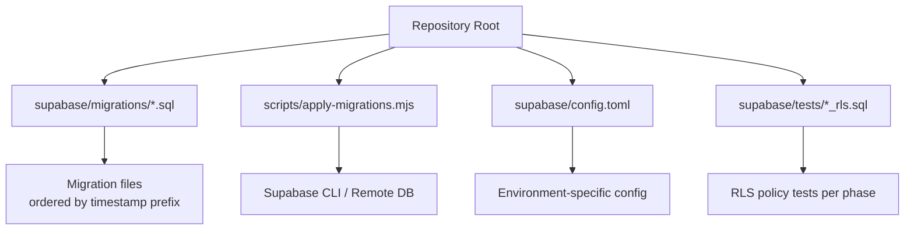
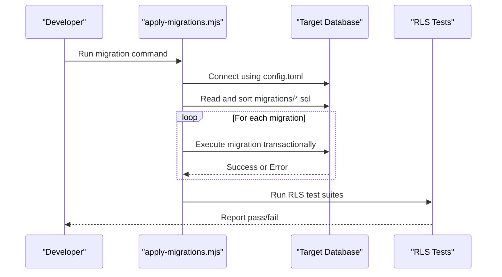

# Migrations and Versioning

<cite>
**Referenced Files in This Document**
- [apply-migrations.mjs](file://scripts/apply-migrations.mjs)
- [config.toml](file://supabase/config.toml)
- [202607150001_phase_2_identity.sql](file://supabase/migrations/202607150001_phase_2_identity.sql)
- [202607150002_phase_3_listings.sql](file://supabase/migrations/202607150002_phase_3_listings.sql)
- [202607150003_phase_3_listing_media.sql](file://supabase/migrations/202607150003_phase_3_listing_media.sql)
- [202607150004_phase_3_public_seller_profiles.sql](file://supabase/migrations/202607150004_phase_3_public_seller_profiles.sql)
- [202607150005_phase_3_user_likes_and_cart.sql](file://supabase/migrations/202607150005_phase_3_user_likes_and_cart.sql)
- [202607150006_phase_3_orders.sql](file://supabase/migrations/202607150006_phase_3_orders.sql)
- [202607150007_phase_3_social.sql](file://supabase/migrations/202607150007_phase_3_social.sql)
- [202607150008_phase_3_5_admin.sql](file://supabase/migrations/202607150008_phase_3_5_admin.sql)
- [202608060001_payment_methods.sql](file://supabase/migrations/202608060001_payment_methods.sql)
- [202608060002_blocked_users.sql](file://supabase/migrations/202608060002_blocked_users.sql)
- [202608060003_seller_reviews_snapshot.sql](file://supabase/migrations/202608060003_seller_reviews_snapshot.sql)
- [202608060004_notification_fanout.sql](file://supabase/migrations/202608060004_notification_fanout.sql)
- [202608060005_seed_admin.sql](file://supabase/migrations/202608060005_seed_admin.sql)
- [202608060006_fix_storage_foldername.sql](file://supabase/migrations/202608060006_fix_storage_foldername.sql)
- [202608060007_admin_get_user_emails.sql](file://supabase/migrations/202608060007_admin_get_user_emails.sql)
- [202608160429_u3_search_listings.sql](file://supabase/migrations/202608160429_u3_search_listings.sql)
- [202608160446_u8_user_follows.sql](file://supabase/migrations/202608160446_u8_user_follows.sql)
- [202608160503_svc_role_grants.sql](file://supabase/migrations/202608160503_svc_role_grants.sql)
- [202608160504_seller_card_view_security_invoker.sql](file://supabase/migrations/202608160504_seller_card_view_security_invoker.sql)
- [202608190001_fix_profile_recursion_and_avatar_storage.sql](file://supabase/migrations/202608190001_fix_profile_recursion_and_avatar_storage.sql)
- [202608190002_apply_pending_profile_avatars.sql](file://supabase/migrations/202608190002_apply_pending_profile_avatars.sql)
- [202608190003_sync_seller_card_avatar.sql](file://supabase/migrations/202608190003_sync_seller_card_avatar.sql)
- [202608200001_chat_unread_count.sql](file://supabase/migrations/202608200001_chat_unread_count.sql)
- [202608200002_extend_notification_fanout.sql](file://supabase/migrations/202608200002_extend_notification_fanout.sql)
- [phase_2_rls.sql](file://supabase/tests/phase_2_rls.sql)
- [phase_3_listings_rls.sql](file://supabase/tests/phase_3_listings_rls.sql)
- [phase_3_orders_rls.sql](file://supabase/tests/phase_3_orders_rls.sql)
- [phase_3_public_seller_profiles_rls.sql](file://supabase/tests/phase_3_public_seller_profiles_rls.sql)
- [phase_3_user_likes_rls.sql](file://supabase/tests/phase_3_user_likes_rls.sql)
- [phase_3_social_rls.sql](file://supabase/tests/phase_3_social_rls.sql)
- [phase_3_cart_items_rls.sql](file://supabase/tests/phase_3_cart_items_rls.sql)
- [phase_3_listing_media_rls.sql](file://supabase/tests/phase_3_listing_media_rls.sql)
- [phase_3_5_admin_rls.sql](file://supabase/tests/phase_3_5_admin_rls.sql)
- [phase_4_blocked_users_rls.sql](file://supabase/tests/phase_4_blocked_users_rls.sql)
- [phase_4_payment_methods_rls.sql](file://supabase/tests/phase_4_payment_methods_rls.sql)
</cite>

## Table of Contents
1. [Introduction](#introduction)
2. [Project Structure](#project-structure)
3. [Core Components](#core-components)
4. [Architecture Overview](#architecture-overview)
5. [Detailed Component Analysis](#detailed-component-analysis)
6. [Dependency Analysis](#dependency-analysis)
7. [Performance Considerations](#performance-considerations)
8. [Troubleshooting Guide](#troubleshooting-guide)
9. [Conclusion](#conclusion)
10. [Appendices](#appendices)

## Introduction
This document explains how database migrations and version control work in the Mooday marketplace. It covers the migration naming convention, file structure, execution order, creating new migrations, applying them to development and production, rollback strategies, testing approaches, conflict resolution, deployment procedures, common migration patterns, backup and recovery practices, and operational safeguards.

## Project Structure
Mooday uses SQL-based migrations stored under a dedicated directory and applies them via a Node.js script. The project also includes Supabase configuration and tests that validate Row Level Security (RLS) policies for each phase.

**Diagram sources**
- [apply-migrations.mjs:1-200](file://scripts/apply-migrations.mjs#L1-L200)
- [config.toml:1-200](file://supabase/config.toml#L1-L200)

**Section sources**
- [apply-migrations.mjs:1-200](file://scripts/apply-migrations.mjs#L1-L200)
- [config.toml:1-200](file://supabase/config.toml#L1-L200)

## Core Components
- Migration scripts: SQL files under supabase/migrations with a strict timestamp-based naming convention.
- Migration runner: scripts/apply-migrations.mjs orchestrates applying migrations to the target environment.
- Configuration: supabase/config.toml defines environment settings used by the migration toolchain.
- Tests: supabase/tests/*_rls.sql contain RLS validation queries aligned with specific phases.

Key responsibilities:
- Enforce deterministic ordering via filenames.
- Provide idempotent operations where possible.
- Validate security policies through tests.
- Support safe rollouts with backups and verification steps.

**Section sources**
- [apply-migrations.mjs:1-200](file://scripts/apply-migrations.mjs#L1-L200)
- [config.toml:1-200](file://supabase/config.toml#L1-L200)

## Architecture Overview
The migration pipeline is driven by a script that reads migration files, sorts them deterministically, and executes them against the configured database. Tests ensure that RLS policies remain correct after migrations.

**Diagram sources**
- [apply-migrations.mjs:1-200](file://scripts/apply-migrations.mjs#L1-L200)
- [config.toml:1-200](file://supabase/config.toml#L1-L200)

## Detailed Component Analysis

### Migration Naming Convention and Execution Order
- Naming: Each migration file follows the pattern YYYYMMDDHHMM_description.sql.
- Ordering: Files are executed in ascending lexicographic order based on their filename, which corresponds to chronological creation time.
- Examples from the codebase:
  - Early phases: 202607150001_phase_2_identity.sql, 202607150002_phase_3_listings.sql, etc.
  - Feature additions: 202608060001_payment_methods.sql, 202608060004_notification_fanout.sql
  - Fixes and syncs: 202608190001_fix_profile_recursion_and_avatar_storage.sql, 202608190002_apply_pending_profile_avatars.sql
  - Recent enhancements: 202608200001_chat_unread_count.sql, 202608200002_extend_notification_fanout.sql

Best practices:
- Always use unique timestamps.
- Keep descriptions concise and meaningful.
- Group related changes within one migration; avoid multiple unrelated changes in a single file.

**Section sources**
- [202607150001_phase_2_identity.sql:1-200](file://supabase/migrations/202607150001_phase_2_identity.sql#L1-L200)
- [202607150002_phase_3_listings.sql:1-200](file://supabase/migrations/202607150002_phase_3_listings.sql#L1-L200)
- [202608060001_payment_methods.sql:1-200](file://supabase/migrations/202608060001_payment_methods.sql#L1-L200)
- [202608190001_fix_profile_recursion_and_avatar_storage.sql:1-200](file://supabase/migrations/202608190001_fix_profile_recursion_and_avatar_storage.sql#L1-L200)
- [202608200001_chat_unread_count.sql:1-200](file://supabase/migrations/202608200001_chat_unread_count.sql#L1-L200)

### Creating New Migrations
Steps:
1. Create a new SQL file under supabase/migrations with a unique timestamp prefix and descriptive name.
2. Implement idempotent SQL statements where possible (e.g., conditional column additions).
3. Add or update RLS tests under supabase/tests if the migration affects access policies.
4. Run local tests to verify behavior before pushing.

Guidelines:
- One logical change per migration.
- Use transactions to group related schema changes.
- Avoid destructive changes without a rollback plan.

**Section sources**
- [apply-migrations.mjs:1-200](file://scripts/apply-migrations.mjs#L1-L200)
- [phase_3_listings_rls.sql:1-200](file://supabase/tests/phase_3_listings_rls.sql#L1-L200)
- [phase_3_orders_rls.sql:1-200](file://supabase/tests/phase_3_orders_rls.sql#L1-L200)

### Applying Migrations to Development and Production
Development:
- Use the migration script with development credentials to apply pending migrations locally or in a dev environment.
- Run RLS tests to validate security policies.

Production:
- Ensure a recent backup exists before applying.
- Apply migrations during a maintenance window or low-traffic period.
- Verify post-migration health checks and run RLS tests.

Operational notes:
- Pin versions when deploying to avoid drift.
- Log outputs and errors for auditability.

**Section sources**
- [apply-migrations.mjs:1-200](file://scripts/apply-migrations.mjs#L1-L200)
- [config.toml:1-200](file://supabase/config.toml#L1-L200)

### Rollback Scenarios and Strategies
- Prefer forward-only migrations with idempotent statements.
- If a rollback is required:
  - Restore from the pre-migration backup.
  - Or create a reverse migration that undoes changes safely, ensuring it is also idempotent.
- For partial failures:
  - Re-run the migration script; it should handle already-applied migrations gracefully if designed idempotently.
  - Investigate logs and fix issues before reapplying.

**Section sources**
- [apply-migrations.mjs:1-200](file://scripts/apply-migrations.mjs#L1-L200)

### Migration Testing Strategies
- Unit-level SQL tests: Validate schema state and constraints after migrations.
- RLS policy tests: Ensure access controls behave as expected across roles and users.
- Integration smoke tests: Confirm application features depend on migrated schema correctly.

Examples in the repository:
- Phase-based RLS tests covering identity, listings, orders, social, admin, blocked users, and payment methods.

**Section sources**
- [phase_2_rls.sql:1-200](file://supabase/tests/phase_2_rls.sql#L1-L200)
- [phase_3_listings_rls.sql:1-200](file://supabase/tests/phase_3_listings_rls.sql#L1-L200)
- [phase_3_orders_rls.sql:1-200](file://supabase/tests/phase_3_orders_rls.sql#L1-L200)
- [phase_3_public_seller_profiles_rls.sql:1-200](file://supabase/tests/phase_3_public_seller_profiles_rls.sql#L1-L200)
- [phase_3_user_likes_rls.sql:1-200](file://supabase/tests/phase_3_user_likes_rls.sql#L1-L200)
- [phase_3_social_rls.sql:1-200](file://supabase/tests/phase_3_social_rls.sql#L1-L200)
- [phase_3_cart_items_rls.sql:1-200](file://supabase/tests/phase_3_cart_items_rls.sql#L1-L200)
- [phase_3_listing_media_rls.sql:1-200](file://supabase/tests/phase_3_listing_media_rls.sql#L1-L200)
- [phase_3_5_admin_rls.sql:1-200](file://supabase/tests/phase_3_5_admin_rls.sql#L1-L200)
- [phase_4_blocked_users_rls.sql:1-200](file://supabase/tests/phase_4_blocked_users_rls.sql#L1-L200)
- [phase_4_payment_methods_rls.sql:1-200](file://supabase/tests/phase_4_payment_methods_rls.sql#L1-L200)

### Conflict Resolution
Common conflicts and resolutions:
- Duplicate column/index names: Use conditional checks or rename existing objects before adding new ones.
- Conflicting constraints: Drop or alter existing constraints carefully, ensuring data integrity.
- Role or permission conflicts: Review grants and revoke/re-apply as needed.

Resolution workflow:
1. Reproduce the conflict in a staging environment.
2. Draft a targeted fix migration.
3. Add or update tests to prevent regression.
4. Apply and verify with full test suite.

**Section sources**
- [apply-migrations.mjs:1-200](file://scripts/apply-migrations.mjs#L1-L200)

### Deployment Procedures
Recommended flow:
1. Create feature branch and add migration(s).
2. Add/update RLS tests.
3. Run local tests and linting.
4. Open PR for review.
5. Merge and deploy to staging; run migrations and tests.
6. Promote to production after sign-off; apply migrations with backups and monitoring.

**Section sources**
- [apply-migrations.mjs:1-200](file://scripts/apply-migrations.mjs#L1-L200)
- [config.toml:1-200](file://supabase/config.toml#L1-L200)

### Common Migration Patterns
- Adding columns:
  - Add nullable columns first, backfill data if needed, then enforce NOT NULL.
  - Example references: see recent schema evolution migrations such as chat unread count and notification fanout extensions.
- Creating indexes:
  - Use appropriate index types and consider query patterns.
  - Example references: search-related and performance-focused migrations.
- Modifying constraints:
  - Safely drop or alter constraints with data validation steps.
  - Example references: role grants and view security invoker adjustments.

Example migration files illustrating these patterns:
- [202608200001_chat_unread_count.sql](file://supabase/migrations/202608200001_chat_unread_count.sql)
- [202608200002_extend_notification_fanout.sql](file://supabase/migrations/202608200002_extend_notification_fanout.sql)
- [202608160503_svc_role_grants.sql](file://supabase/migrations/202608160503_svc_role_grants.sql)
- [202608160504_seller_card_view_security_invoker.sql](file://supabase/migrations/202608160504_seller_card_view_security_invoker.sql)

**Section sources**
- [202608200001_chat_unread_count.sql:1-200](file://supabase/migrations/202608200001_chat_unread_count.sql#L1-L200)
- [202608200002_extend_notification_fanout.sql:1-200](file://supabase/migrations/202608200002_extend_notification_fanout.sql#L1-L200)
- [202608160503_svc_role_grants.sql:1-200](file://supabase/migrations/202608160503_svc_role_grants.sql#L1-L200)
- [202608160504_seller_card_view_security_invoker.sql:1-200](file://supabase/migrations/202608160504_seller_card_view_security_invoker.sql#L1-L200)

### Backup and Recovery
Before applying migrations to production:
- Take a full database backup or snapshot.
- Record current migration state and version.
- Validate restore procedure in a non-production environment.

After a failed migration:
- If the migration did not commit, retry after fixing issues.
- If partially applied, restore from backup or apply a targeted reverse migration.
- Re-run tests and health checks before resuming traffic.

**Section sources**
- [apply-migrations.mjs:1-200](file://scripts/apply-migrations.mjs#L1-L200)

## Dependency Analysis
Migrations form a linear dependency chain ordered by filename. Some migrations depend on earlier schema structures created by prior migrations. Tests depend on the resulting schema and policies.

**Diagram sources**
- [202607150001_phase_2_identity.sql:1-200](file://supabase/migrations/202607150001_phase_2_identity.sql#L1-L200)
- [202607150002_phase_3_listings.sql:1-200](file://supabase/migrations/202607150002_phase_3_listings.sql#L1-L200)
- [202607150003_phase_3_listing_media.sql:1-200](file://supabase/migrations/202607150003_phase_3_listing_media.sql#L1-L200)
- [202607150004_phase_3_public_seller_profiles.sql:1-200](file://supabase/migrations/202607150004_phase_3_public_seller_profiles.sql#L1-L200)
- [202607150005_phase_3_user_likes_and_cart.sql:1-200](file://supabase/migrations/202607150005_phase_3_user_likes_and_cart.sql#L1-L200)
- [202607150006_phase_3_orders.sql:1-200](file://supabase/migrations/202607150006_phase_3_orders.sql#L1-L200)
- [202607150007_phase_3_social.sql:1-200](file://supabase/migrations/202607150007_phase_3_social.sql#L1-L200)
- [202607150008_phase_3_5_admin.sql:1-200](file://supabase/migrations/202607150008_phase_3_5_admin.sql#L1-L200)
- [202608060001_payment_methods.sql:1-200](file://supabase/migrations/202608060001_payment_methods.sql#L1-L200)
- [202608060004_notification_fanout.sql:1-200](file://supabase/migrations/202608060004_notification_fanout.sql#L1-L200)
- [202608160429_u3_search_listings.sql:1-200](file://supabase/migrations/202608160429_u3_search_listings.sql#L1-L200)
- [202608160446_u8_user_follows.sql:1-200](file://supabase/migrations/202608160446_u8_user_follows.sql#L1-L200)
- [202608160503_svc_role_grants.sql:1-200](file://supabase/migrations/202608160503_svc_role_grants.sql#L1-L200)
- [202608160504_seller_card_view_security_invoker.sql:1-200](file://supabase/migrations/202608160504_seller_card_view_security_invoker.sql#L1-L200)
- [202608190001_fix_profile_recursion_and_avatar_storage.sql:1-200](file://supabase/migrations/202608190001_fix_profile_recursion_and_avatar_storage.sql#L1-L200)
- [202608190002_apply_pending_profile_avatars.sql:1-200](file://supabase/migrations/202608190002_apply_pending_profile_avatars.sql#L1-L200)
- [202608190003_sync_seller_card_avatar.sql:1-200](file://supabase/migrations/202608190003_sync_seller_card_avatar.sql#L1-L200)
- [202608200001_chat_unread_count.sql:1-200](file://supabase/migrations/202608200001_chat_unread_count.sql#L1-L200)
- [202608200002_extend_notification_fanout.sql:1-200](file://supabase/migrations/202608200002_extend_notification_fanout.sql#L1-L200)

**Section sources**
- [apply-migrations.mjs:1-200](file://scripts/apply-migrations.mjs#L1-L200)

## Performance Considerations
- Batch large data changes into smaller chunks to reduce lock times.
- Use appropriate indexing strategies; avoid unnecessary indexes.
- Schedule heavy migrations during off-peak hours.
- Monitor long-running transactions and optimize queries within migrations.

[No sources needed since this section provides general guidance]

## Troubleshooting Guide
Common issues and resolutions:
- Migration fails due to missing object:
  - Verify dependencies exist in earlier migrations.
  - Check error logs for exact failing statement.
- RLS policy violations:
  - Run RLS tests to identify misconfigurations.
  - Adjust policies and retest.
- Partial application:
  - Restore from backup or create a corrective migration.
  - Re-run the migration script after addressing root cause.

Operational tips:
- Enable verbose logging in the migration script.
- Keep a record of applied migration versions.
- Use staging environments to simulate production conditions.

**Section sources**
- [apply-migrations.mjs:1-200](file://scripts/apply-migrations.mjs#L1-L200)
- [phase_3_listings_rls.sql:1-200](file://supabase/tests/phase_3_listings_rls.sql#L1-L200)
- [phase_3_orders_rls.sql:1-200](file://supabase/tests/phase_3_orders_rls.sql#L1-L200)

## Conclusion
Mooday’s migration system relies on clear naming conventions, deterministic execution order, and robust testing to maintain database integrity across environments. By following the recommended practices—idempotent migrations, thorough RLS testing, careful backups, and staged deployments—you can confidently evolve the schema while minimizing risk.

[No sources needed since this section summarizes without analyzing specific files]

## Appendices

### Appendix A: Quick Reference Checklist
- Before creating a migration:
  - Identify affected tables, indexes, and policies.
  - Plan for backward compatibility if needed.
- During development:
  - Write idempotent SQL.
  - Add or update RLS tests.
  - Run local tests and linting.
- Before production:
  - Back up the database.
  - Apply in maintenance window.
  - Run full test suite and health checks.

[No sources needed since this section provides general guidance]