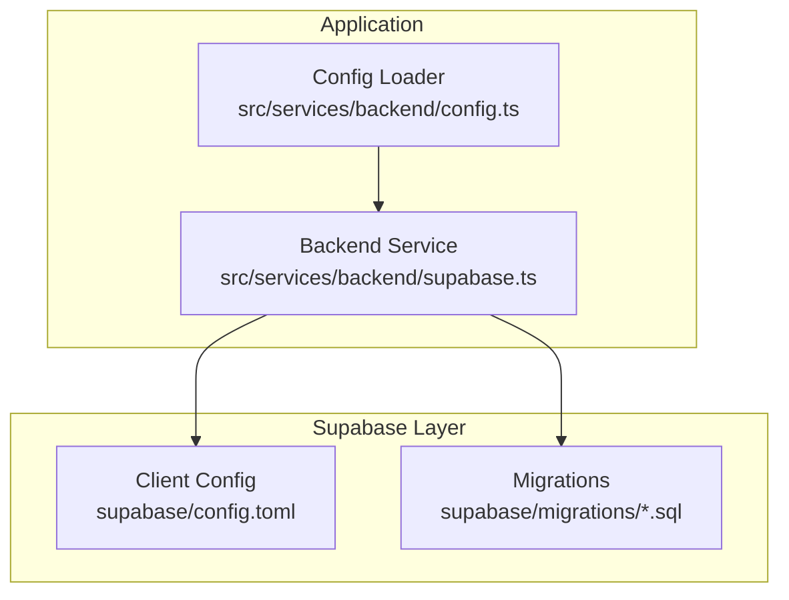
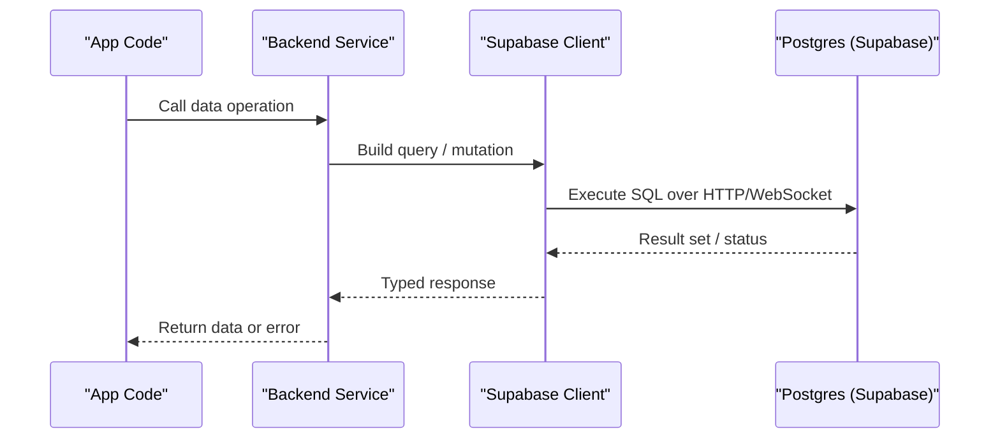
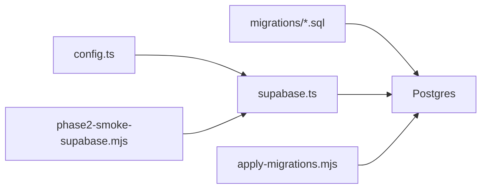

# Performance Optimization and Monitoring

<cite>
**Referenced Files in This Document**
- [supabase/config.toml](file://supabase/config.toml)
- [src/services/backend/supabase.ts](file://src/services/backend/supabase.ts)
- [src/services/backend/config.ts](file://src/services/backend/config.ts)
- [supabase/migrations/202608160429_u3_search_listings.sql](file://supabase/migrations/202608160429_u3_search_listings.sql)
- [supabase/migrations/202607150002_phase_3_listings.sql](file://supabase/migrations/202607150002_phase_3_listings.sql)
- [supabase/migrations/202607150006_phase_3_orders.sql](file://supabase/migrations/202607150006_phase_3_orders.sql)
- [supabase/migrations/202607150007_phase_3_social.sql](file://supabase/migrations/202607150007_phase_3_social.sql)
- [supabase/migrations/202607150008_phase_3_5_admin.sql](file://supabase/migrations/202607150008_phase_3_5_admin.sql)
- [supabase/migrations/202608060004_notification_fanout.sql](file://supabase/migrations/202608060004_notification_fanout.sql)
- [supabase/migrations/202608200001_chat_unread_count.sql](file://supabase/migrations/202608200001_chat_unread_count.sql)
- [supabase/migrations/202608200002_extend_notification_fanout.sql](file://supabase/migrations/202608200002_extend_notification_fanout.sql)
- [scripts/apply-migrations.mjs](file://scripts/apply-migrations.mjs)
- [scripts/phase2-smoke-supabase.mjs](file://scripts/phase2-smoke-supabase.mjs)
</cite>

## Table of Contents
1. [Introduction](#introduction)
2. [Project Structure](#project-structure)
3. [Core Components](#core-components)
4. [Architecture Overview](#architecture-overview)
5. [Detailed Component Analysis](#detailed-component-analysis)
6. [Dependency Analysis](#dependency-analysis)
7. [Performance Considerations](#performance-considerations)
8. [Troubleshooting Guide](#troubleshooting-guide)
9. [Conclusion](#conclusion)
10. [Appendices](#appendices)

## Introduction
This document provides a comprehensive guide to database performance optimization and monitoring for the Mooday marketplace. It focuses on indexing strategies, query optimization techniques, performance tuning parameters, slow query identification, execution plan analysis, bottleneck resolution, connection pooling, caching strategies, configuration optimizations, monitoring tooling, alerting, metrics collection, and scaling considerations including read replicas and sharding. The guidance is grounded in the project’s Supabase-backed data layer and migration history.

## Project Structure
The database layer centers around Supabase migrations under supabase/migrations, client-side service initialization in src/services/backend, and configuration via supabase/config.toml. Migrations define schema, indexes, and views that directly influence query performance. The backend service initializes the Supabase client and exposes typed operations used by the application.

**Diagram sources**
- [src/services/backend/supabase.ts:1-200](file://src/services/backend/supabase.ts#L1-L200)
- [src/services/backend/config.ts:1-200](file://src/services/backend/config.ts#L1-L200)
- [supabase/config.toml:1-200](file://supabase/config.toml#L1-L200)
- [supabase/migrations/202608160429_u3_search_listings.sql:1-200](file://supabase/migrations/202608160429_u3_search_listings.sql#L1-L200)

**Section sources**
- [src/services/backend/supabase.ts:1-200](file://src/services/backend/supabase.ts#L1-L200)
- [src/services/backend/config.ts:1-200](file://src/services/backend/config.ts#L1-L200)
- [supabase/config.toml:1-200](file://supabase/config.toml#L1-L200)

## Core Components
- Supabase client initialization and environment-driven configuration
- Migration-driven schema and index definitions
- Operational scripts for applying migrations and smoke testing connectivity

Key responsibilities:
- Initialize the Supabase client with correct URL and keys
- Apply migrations during deployment or local setup
- Provide stable interfaces for queries and mutations used across the app

**Section sources**
- [src/services/backend/supabase.ts:1-200](file://src/services/backend/supabase.ts#L1-L200)
- [src/services/backend/config.ts:1-200](file://src/services/backend/config.ts#L1-L200)
- [scripts/apply-migrations.mjs:1-200](file://scripts/apply-migrations.mjs#L1-L200)
- [scripts/phase2-smoke-supabase.mjs:1-200](file://scripts/phase2-smoke-supabase.mjs#L1-L200)

## Architecture Overview
The application uses Supabase as the managed Postgres backend. Queries are issued from the backend service layer using the Supabase client. Schema evolution and performance-critical indexes are defined in SQL migrations. Configuration is centralized in config files and environment variables.

**Diagram sources**
- [src/services/backend/supabase.ts:1-200](file://src/services/backend/supabase.ts#L1-L200)
- [supabase/config.toml:1-200](file://supabase/config.toml#L1-L200)

## Detailed Component Analysis

### Database Schema and Indexing Strategy
- Listings table includes columns commonly filtered and sorted; ensure appropriate indexes exist for frequent predicates and sort orders.
- Orders table benefits from indexes on foreign keys and frequently queried date ranges.
- Social tables (follows, likes) require composite indexes for user-centric reads.
- Admin tables should be indexed on lookup keys and audit timestamps.
- Notification fanout and chat unread counts benefit from targeted indexes to support high-throughput updates and reads.

Recommended indexing patterns:
- Single-column indexes on high-selectivity filter columns
- Composite indexes for common multi-column WHERE clauses
- Partial indexes for hot subsets (e.g., active listings)
- GIN/GIST indexes where full-text search or JSON operations are used

Index placement examples (by migration):
- Search-related indexes for listing discovery
- Listing core table indexes
- Orders table indexes for lookups and reporting
- Social relationship indexes
- Admin lookup and audit indexes
- Notification fanout and chat unread counters

**Section sources**
- [supabase/migrations/202608160429_u3_search_listings.sql:1-200](file://supabase/migrations/202608160429_u3_search_listings.sql#L1-L200)
- [supabase/migrations/202607150002_phase_3_listings.sql:1-200](file://supabase/migrations/202607150002_phase_3_listings.sql#L1-L200)
- [supabase/migrations/202607150006_phase_3_orders.sql:1-200](file://supabase/migrations/202607150006_phase_3_orders.sql#L1-L200)
- [supabase/migrations/202607150007_phase_3_social.sql:1-200](file://supabase/migrations/202607150007_phase_3_social.sql#L1-L200)
- [supabase/migrations/202607150008_phase_3_5_admin.sql:1-200](file://supabase/migrations/202607150008_phase_3_5_admin.sql#L1-L200)
- [supabase/migrations/202608060004_notification_fanout.sql:1-200](file://supabase/migrations/202608060004_notification_fanout.sql#L1-L200)
- [supabase/migrations/202608200001_chat_unread_count.sql:1-200](file://supabase/migrations/202608200001_chat_unread_count.sql#L1-L200)
- [supabase/migrations/202608200002_extend_notification_fanout.sql:1-200](file://supabase/migrations/202608200002_extend_notification_fanout.sql#L1-L200)

### Query Optimization Techniques
- Prefer selective filters early in queries to reduce row scans
- Use LIMIT/OFFSET judiciously; consider keyset pagination for large datasets
- Avoid SELECT *; fetch only required columns
- Leverage existing indexes; verify with EXPLAIN ANALYZE
- Normalize heavy write paths; denormalize selectively for read-heavy workloads
- Batch writes where possible to reduce round-trips

Operational checks:
- Validate query plans after schema changes
- Monitor regression in p95/p99 latencies post-deploy
- Retire unused indexes to reduce write overhead

**Section sources**
- [supabase/migrations/202608160429_u3_search_listings.sql:1-200](file://supabase/migrations/202608160429_u3_search_listings.sql#L1-L200)
- [supabase/migrations/202607150006_phase_3_orders.sql:1-200](file://supabase/migrations/202607150006_phase_3_orders.sql#L1-L200)

### Performance Tuning Parameters
- Connection pool sizing aligned with expected concurrency and CPU cores
- Statement timeout thresholds to prevent long-running queries from blocking resources
- Work_mem and maintenance_work_mem tuned for complex sorts and joins within memory limits
- Effective cache size aligned with available RAM for better planner decisions
- WAL settings balanced for durability vs throughput depending on workload profile

Configuration touchpoints:
- Supabase client configuration and environment variables
- Server-level parameters applied via Supabase dashboard or provisioning

**Section sources**
- [src/services/backend/config.ts:1-200](file://src/services/backend/config.ts#L1-L200)
- [supabase/config.toml:1-200](file://supabase/config.toml#L1-L200)

### Slow Query Identification and Execution Plan Analysis
- Enable logging for slow queries at the platform level and capture durations
- Use EXPLAIN and EXPLAIN ANALYZE to inspect plans and identify bottlenecks
- Focus on sequential scans, nested loops with high row estimates, and expensive sorts
- Correlate slow queries with recent schema or code changes

Operational workflow:
- Capture problematic queries from logs or APM
- Run EXPLAIN ANALYZE in an isolated environment
- Optimize indexes or rewrite queries iteratively
- Re-validate with benchmarks and production-like load

**Section sources**
- [supabase/migrations/202608160429_u3_search_listings.sql:1-200](file://supabase/migrations/202608160429_u3_search_listings.sql#L1-L200)
- [supabase/migrations/202607150006_phase_3_orders.sql:1-200](file://supabase/migrations/202607150006_phase_3_orders.sql#L1-L200)

### Bottleneck Resolution Patterns
- Missing or suboptimal indexes causing full table scans
- N+1 query patterns resolved by batching or server-side joins
- Over-fetching data leading to network and serialization overhead
- Hot rows or partitions requiring partitioning or materialized views
- Write amplification mitigated by batching and idempotent operations

**Section sources**
- [supabase/migrations/202608060004_notification_fanout.sql:1-200](file://supabase/migrations/202608060004_notification_fanout.sql#L1-L200)
- [supabase/migrations/202608200001_chat_unread_count.sql:1-200](file://supabase/migrations/202608200001_chat_unread_count.sql#L1-L200)

### Connection Pooling and Caching Strategies
- Connection pooling:
  - Configure pool size based on concurrent request volume and database capacity
  - Use connection reuse within process lifetimes; avoid per-request connections
  - Monitor pool saturation and queue times
- Caching:
  - Cache read-heavy, low-churn data (e.g., catalog metadata, categories)
  - Use short TTLs for semi-volatile data; invalidate on writes
  - Consider edge caching for static assets and public endpoints

Implementation notes:
- Centralize client initialization to reuse connections
- Add cache layers in front of hot endpoints if supported by hosting environment

**Section sources**
- [src/services/backend/supabase.ts:1-200](file://src/services/backend/supabase.ts#L1-L200)
- [src/services/backend/config.ts:1-200](file://src/services/backend/config.ts#L1-L200)

### Database Configuration Optimizations
- Environment-driven configuration for URLs, keys, and timeouts
- Separate configs for dev/staging/prod to isolate performance tuning
- Secure secret management and least-privilege access

**Section sources**
- [src/services/backend/config.ts:1-200](file://src/services/backend/config.ts#L1-L200)
- [supabase/config.toml:1-200](file://supabase/config.toml#L1-L200)

### Monitoring Tools Setup, Alerting, and Metrics Collection
- Enable query logging and slow query thresholds at the database layer
- Collect latency, error rates, and throughput metrics from the backend service
- Set alerts for:
  - Elevated p95/p99 latencies
  - Increased error rates or timeouts
  - High connection usage or pool saturation
  - Slow query spikes
- Integrate with observability platforms for dashboards and alert routing

Operational scripts:
- Use smoke tests to validate connectivity and basic health post-deploy

**Section sources**
- [scripts/phase2-smoke-supabase.mjs:1-200](file://scripts/phase2-smoke-supabase.mjs#L1-L200)

### Scaling Considerations: Read Replicas and Sharding
- Read replicas:
  - Route read-heavy queries to replicas to offload primary
  - Ensure replication lag awareness in critical flows
- Sharding/partitioning:
  - Partition large tables by time or tenant when necessary
  - Use range or hash partitioning based on access patterns
- Horizontal scaling:
  - Scale application instances behind load balancers
  - Tune connection pools per instance to match replica capacity

[No sources needed since this section provides general guidance]

## Dependency Analysis
The backend service depends on Supabase client configuration and relies on migrations to establish schema and indexes. Scripts orchestrate migration application and smoke testing.

**Diagram sources**
- [src/services/backend/config.ts:1-200](file://src/services/backend/config.ts#L1-L200)
- [src/services/backend/supabase.ts:1-200](file://src/services/backend/supabase.ts#L1-L200)
- [supabase/migrations/202608160429_u3_search_listings.sql:1-200](file://supabase/migrations/202608160429_u3_search_listings.sql#L1-L200)
- [scripts/apply-migrations.mjs:1-200](file://scripts/apply-migrations.mjs#L1-L200)
- [scripts/phase2-smoke-supabase.mjs:1-200](file://scripts/phase2-smoke-supabase.mjs#L1-L200)

**Section sources**
- [src/services/backend/config.ts:1-200](file://src/services/backend/config.ts#L1-L200)
- [src/services/backend/supabase.ts:1-200](file://src/services/backend/supabase.ts#L1-L200)
- [scripts/apply-migrations.mjs:1-200](file://scripts/apply-migrations.mjs#L1-L200)
- [scripts/phase2-smoke-supabase.mjs:1-200](file://scripts/phase2-smoke-supabase.mjs#L1-L200)

## Performance Considerations
- Index design is foundational: align indexes with actual query patterns observed in production
- Measure before optimizing: use EXPLAIN ANALYZE and production metrics to target real bottlenecks
- Balance read and write performance: excessive indexes can degrade write throughput
- Cache strategically: reduce database load for repeatable reads
- Monitor continuously: track latency percentiles, error rates, and resource utilization
- Plan for scale: evaluate read replicas and partitioning as data and traffic grow

[No sources needed since this section provides general guidance]

## Troubleshooting Guide
Common issues and resolutions:
- Slow queries due to missing indexes: add targeted indexes and revalidate plans
- Timeouts under load: tune statement timeouts and connection pools; optimize hot paths
- High CPU/memory usage: reduce sorting/join costs; consider materialized views for heavy aggregations
- Connection exhaustion: increase pool size cautiously; monitor saturation and queue times
- Data inconsistency after migrations: run rollback-safe migrations and validate with smoke tests

Operational steps:
- Use smoke tests to confirm connectivity and basic functionality
- Review slow query logs and correlate with recent changes
- Iterate on indexes and queries with EXPLAIN ANALYZE validation

**Section sources**
- [scripts/phase2-smoke-supabase.mjs:1-200](file://scripts/phase2-smoke-supabase.mjs#L1-L200)
- [supabase/migrations/202608160429_u3_search_listings.sql:1-200](file://supabase/migrations/202608160429_u3_search_listings.sql#L1-L200)

## Conclusion
Optimizing database performance in the Mooday marketplace hinges on disciplined indexing, careful query design, and continuous monitoring. By aligning schema and indexes with real-world access patterns, tuning configuration parameters, and implementing robust observability, the system can sustain growth while maintaining responsiveness. For high-traffic scenarios, adopt read replicas and partitioning strategies thoughtfully, always guided by measured performance data.

[No sources needed since this section summarizes without analyzing specific files]

## Appendices

### Migration-to-Index Mapping Reference
- Search/listings: ensure indexes support filtering and sorting for discovery
- Orders: index foreign keys and date ranges for reporting and retrieval
- Social: composite indexes for user-centric relationships
- Admin: indexes for lookup and audit queries
- Notifications/chat: indexes supporting high-frequency updates and reads

**Section sources**
- [supabase/migrations/202608160429_u3_search_listings.sql:1-200](file://supabase/migrations/202608160429_u3_search_listings.sql#L1-L200)
- [supabase/migrations/202607150006_phase_3_orders.sql:1-200](file://supabase/migrations/202607150006_phase_3_orders.sql#L1-L200)
- [supabase/migrations/202607150007_phase_3_social.sql:1-200](file://supabase/migrations/202607150007_phase_3_social.sql#L1-L200)
- [supabase/migrations/202607150008_phase_3_5_admin.sql:1-200](file://supabase/migrations/202607150008_phase_3_5_admin.sql#L1-L200)
- [supabase/migrations/202608060004_notification_fanout.sql:1-200](file://supabase/migrations/202608060004_notification_fanout.sql#L1-L200)
- [supabase/migrations/202608200001_chat_unread_count.sql:1-200](file://supabase/migrations/202608200001_chat_unread_count.sql#L1-L200)
- [supabase/migrations/202608200002_extend_notification_fanout.sql:1-200](file://supabase/migrations/202608200002_extend_notification_fanout.sql#L1-L200)