# Security Policies and Access Control

<cite>
**Referenced Files in This Document**
- [202607150001_phase_2_identity.sql](file://supabase/migrations/202607150001_phase_2_identity.sql)
- [202607150002_phase_3_listings.sql](file://supabase/migrations/202607150002_phase_3_listings.sql)
- [202607150003_phase_3_listing_media.sql](file://supabase/migrations/202607150003_phase_3_listing_media.sql)
- [202607150004_phase_3_public_seller_profiles.sql](file://supabase/migrations/202607150004_phase_3_public_seller_profiles.sql)
- [202607150005_phase_3_user_likes_and_cart.sql](file://supabase/migrations/202607150005_phase_3_user_likes_and_cart.sql)
- [202607150006_phase_3_orders.sql](file://supabase/migrations/202607150006_phase_3_orders.sql)
- [202607150007_phase_3_social.sql](file://supabase/migrations/202607150007_phase_3_social.sql)
- [202608060001_payment_methods.sql](file://supabase/migrations/202608060001_payment_methods.sql)
- [202608060002_blocked_users.sql](file://supabase/migrations/202608060002_blocked_users.sql)
- [202608060003_seller_reviews_snapshot.sql](file://supabase/migrations/202608060003_seller_reviews_snapshot.sql)
- [202608060004_notification_fanout.sql](file://supabase/migrations/202608060004_notification_fanout.sql)
- [202608160429_u3_search_listings.sql](file://supabase/migrations/202608160429_u3_search_listings.sql)
- [202608160446_u8_user_follows.sql](file://supabase/migrations/202608160446_u8_user_follows.sql)
- [202608160503_svc_role_grants.sql](file://supabase/migrations/202608160503_svc_role_grants.sql)
- [202608160504_seller_card_view_security_invoker.sql](file://supabase/migrations/202608160504_seller_card_view_security_invoker.sql)
- [phase_2_rls.sql](file://supabase/tests/phase_2_rls.sql)
- [phase_3_listings_rls.sql](file://supabase/tests/phase_3_listings_rls.sql)
- [phase_3_orders_rls.sql](file://supabase/tests/phase_3_orders_rls.sql)
- [phase_3_social_rls.sql](file://supabase/tests/phase_3_social_rls.sql)
- [phase_3_user_likes_rls.sql](file://supabase/tests/phase_3_user_likes_rls.sql)
- [phase_3_cart_items_rls.sql](file://supabase/tests/phase_3_cart_items_rls.sql)
- [phase_3_listing_media_rls.sql](file://supabase/tests/phase_3_listing_media_rls.sql)
- [phase_3_public_seller_profiles_rls.sql](file://supabase/tests/phase_3_public_seller_profiles_rls.sql)
- [phase_3_5_admin_rls.sql](file://supabase/tests/phase_3_5_admin_rls.sql)
- [phase_4_blocked_users_rls.sql](file://supabase/tests/phase_4_blocked_users_rls.sql)
- [phase_4_payment_methods_rls.sql](file://supabase/tests/phase_4_payment_methods_rls.sql)
- [security.ts](file://src/lib/security.ts)
- [ownership.ts](file://src/lib/ownership.ts)
- [supabase.ts](file://src/services/backend/supabase.ts)
- [config.ts](file://src/services/backend/config.ts)
</cite>

## Table of Contents
1. Introduction
2. Project Structure
3. Core Components
4. Architecture Overview
5. Detailed Component Analysis
6. Dependency Analysis
7. Performance Considerations
8. Troubleshooting Guide
9. Conclusion
10. Appendices

## Introduction
This document explains Row-Level Security (RLS) policies and access control for the Mooday marketplace. It covers security policies for user data, listings, orders, messages, social features, payments, and admin capabilities. It also documents how policies are created, evaluated, and inherited; role-based access control; authentication requirements; authorization checks; testing strategies; debugging techniques; and common vulnerabilities with mitigations. Complex multi-tenant scenarios and data isolation patterns are included to guide secure design and implementation.

## Project Structure
Security is implemented primarily at the database layer using Supabase RLS policies defined in SQL migrations, complemented by application-level helpers and tests:
- Database migrations define tables, roles, views, and RLS policies.
- Tests under supabase/tests validate policy behavior across operations.
- Application code uses a typed Supabase client and helper utilities for ownership and security checks.

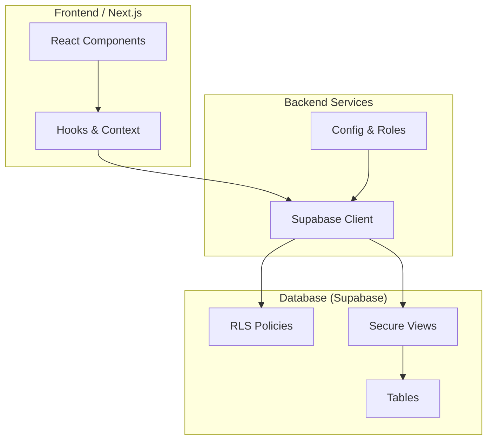

**Diagram sources**
- [supabase.ts:1-200](file://src/services/backend/supabase.ts#L1-L200)
- [config.ts:1-200](file://src/services/backend/config.ts#L1-L200)
- [202607150001_phase_2_identity.sql:1-200](file://supabase/migrations/202607150001_phase_2_identity.sql#L1-L200)
- [202607150002_phase_3_listings.sql:1-200](file://supabase/migrations/202607150002_phase_3_listings.sql#L1-L200)

**Section sources**
- [supabase.ts:1-200](file://src/services/backend/supabase.ts#L1-L200)
- [config.ts:1-200](file://src/services/backend/config.ts#L1-L200)

## Core Components
- Authentication and identity: User sessions and roles are established via Supabase Auth and enforced by RLS on user-related tables.
- Ownership model: Many resources include an owner_id or tenant_id column used by RLS to restrict access to the current authenticated user or tenant.
- Role-based access control: Distinct roles (e.g., authenticated users, service roles, admins) determine which policies apply and whether privileged operations are allowed.
- Secure views: Read-only or filtered views expose aggregated or normalized data while preserving RLS constraints through invoker privileges.
- Policy tests: Dedicated SQL test files assert expected allow/deny behaviors for each table and operation.

Key responsibilities:
- Define per-table policies for SELECT, INSERT, UPDATE, DELETE.
- Enforce tenant isolation where applicable.
- Provide safe read paths via views that encapsulate complex filtering.
- Validate ownership and permissions in both DB and app layers.

**Section sources**
- [202607150001_phase_2_identity.sql:1-200](file://supabase/migrations/202607150001_phase_2_identity.sql#L1-L200)
- [202607150002_phase_3_listings.sql:1-200](file://supabase/migrations/202607150002_phase_3_listings.sql#L1-L200)
- [202607150006_phase_3_orders.sql:1-200](file://supabase/migrations/202607150006_phase_3_orders.sql#L1-L200)
- [202607150007_phase_3_social.sql:1-200](file://supabase/migrations/202607150007_phase_3_social.sql#L1-L200)
- [202608160504_seller_card_view_security_invoker.sql:1-200](file://supabase/migrations/202608160504_seller_card_view_security_invoker.sql#L1-L200)

## Architecture Overview
The security architecture combines database-enforced RLS with application-level safeguards:
- All data mutations pass through Supabase clients configured with appropriate roles.
- RLS policies evaluate the current session’s user ID and roles to permit or deny row access.
- Views abstract complex joins and filters, ensuring consistent enforcement for downstream consumers.
- Tests simulate multiple roles and tenants to validate policy correctness.

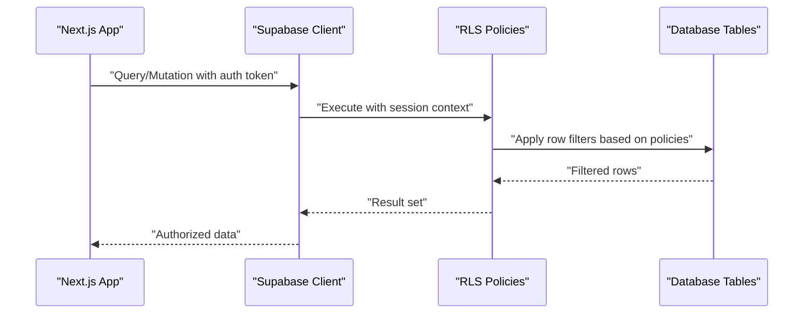

**Diagram sources**
- [supabase.ts:1-200](file://src/services/backend/supabase.ts#L1-L200)
- [202607150001_phase_2_identity.sql:1-200](file://supabase/migrations/202607150001_phase_2_identity.sql#L1-L200)
- [202607150002_phase_3_listings.sql:1-200](file://supabase/migrations/202607150002_phase_3_listings.sql#L1-L200)

## Detailed Component Analysis

### Identity and User Data Security
- Purpose: Protect personal data and profile information; ensure users can only modify their own records.
- Key mechanisms:
  - RLS policies on user profiles and related tables enforce ownership checks against the authenticated user ID.
  - Admin roles may have broader access for moderation and support tasks.
- Evaluation logic:
  - On read/write, policies compare the requesting user’s ID with the record’s owner field.
  - Some fields may be restricted to internal roles only.
- Inheritance:
  - Policies inherit from base rules applied to all roles unless explicitly overridden by admin/service roles.

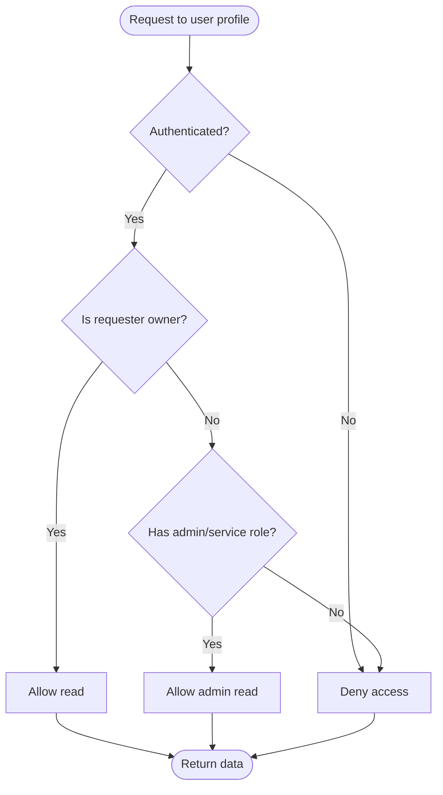

**Diagram sources**
- [202607150001_phase_2_identity.sql:1-200](file://supabase/migrations/202607150001_phase_2_identity.sql#L1-L200)
- [phase_2_rls.sql:1-200](file://supabase/tests/phase_2_rls.sql#L1-L200)

**Section sources**
- [202607150001_phase_2_identity.sql:1-200](file://supabase/migrations/202607150001_phase_2_identity.sql#L1-L200)
- [phase_2_rls.sql:1-200](file://supabase/tests/phase_2_rls.sql#L1-L200)

### Listings and Listing Media Security
- Purpose: Ensure sellers manage only their own listings and media; buyers can view public listing details.
- Key mechanisms:
  - RLS on listings enforces ownership for writes and allows public reads for active listings.
  - Media access tied to listing ownership; service roles may handle uploads and processing.
- Evaluation logic:
  - Writes require matching owner_id or elevated role.
  - Reads may bypass ownership for public visibility depending on listing status.
- Multi-tenant considerations:
  - If listings are grouped by tenant, policies filter by tenant_id alongside owner_id.

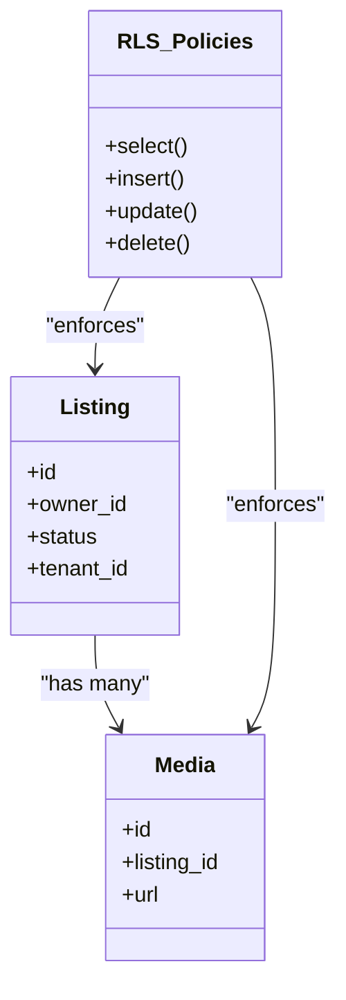

**Diagram sources**
- [202607150002_phase_3_listings.sql:1-200](file://supabase/migrations/202607150002_phase_3_listings.sql#L1-L200)
- [202607150003_phase_3_listing_media.sql:1-200](file://supabase/migrations/202607150003_phase_3_listing_media.sql#L1-L200)
- [phase_3_listings_rls.sql:1-200](file://supabase/tests/phase_3_listings_rls.sql#L1-L200)
- [phase_3_listing_media_rls.sql:1-200](file://supabase/tests/phase_3_listing_media_rls.sql#L1-L200)

**Section sources**
- [202607150002_phase_3_listings.sql:1-200](file://supabase/migrations/202607150002_phase_3_listings.sql#L1-L200)
- [202607150003_phase_3_listing_media.sql:1-200](file://supabase/migrations/202607150003_phase_3_listing_media.sql#L1-L200)
- [phase_3_listings_rls.sql:1-200](file://supabase/tests/phase_3_listings_rls.sql#L1-L200)
- [phase_3_listing_media_rls.sql:1-200](file://supabase/tests/phase_3_listing_media_rls.sql#L1-L200)

### Orders Security
- Purpose: Restrict order visibility to relevant parties (buyer, seller, admin).
- Key mechanisms:
  - RLS filters orders by buyer_id, seller_id, or admin role.
  - Sensitive order metadata may be limited to authorized roles.
- Evaluation logic:
  - Reads check if requester is buyer, seller, or has admin privileges.
  - Writes typically limited to system services or authorized actors.

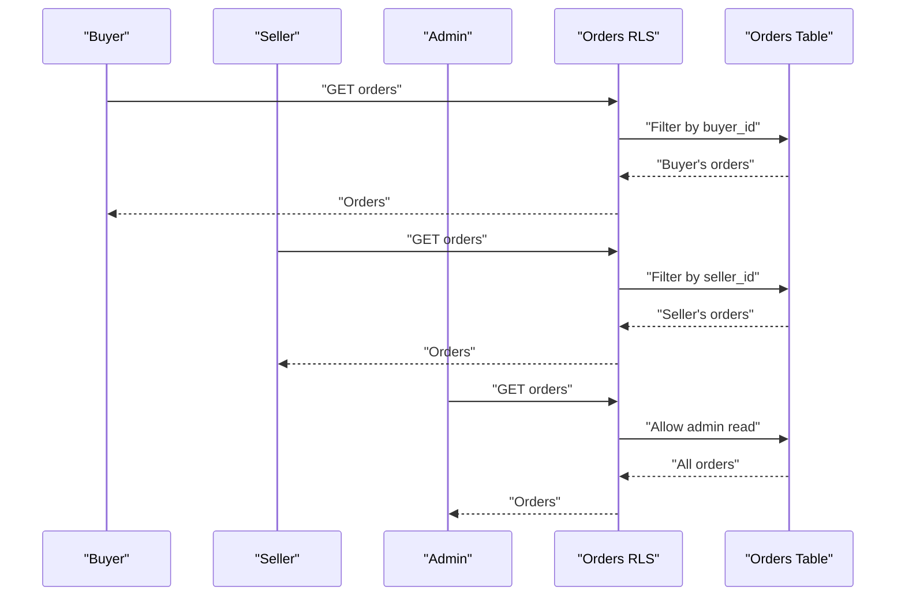

**Diagram sources**
- [202607150006_phase_3_orders.sql:1-200](file://supabase/migrations/202607150006_phase_3_orders.sql#L1-L200)
- [phase_3_orders_rls.sql:1-200](file://supabase/tests/phase_3_orders_rls.sql#L1-L200)

**Section sources**
- [202607150006_phase_3_orders.sql:1-200](file://supabase/migrations/202607150006_phase_3_orders.sql#L1-L200)
- [phase_3_orders_rls.sql:1-200](file://supabase/tests/phase_3_orders_rls.sql#L1-L200)

### Messages and Chat Security
- Purpose: Ensure chat participants can only access their conversations.
- Key mechanisms:
  - RLS on message tables filters by conversation membership or participant IDs.
  - Realtime subscriptions respect RLS to prevent unauthorized channel access.
- Evaluation logic:
  - Reads/writes verify requester is a member of the conversation.
  - Service roles may create channels or moderate content.

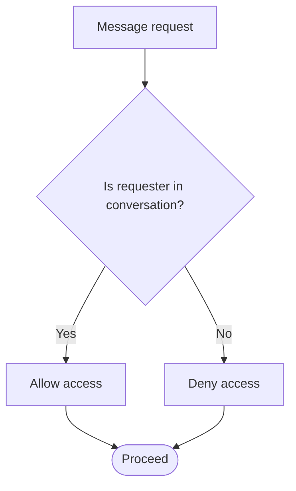

**Diagram sources**
- [202607150007_phase_3_social.sql:1-200](file://supabase/migrations/202607150007_phase_3_social.sql#L1-L200)
- [phase_3_social_rls.sql:1-200](file://supabase/tests/phase_3_social_rls.sql#L1-L200)

**Section sources**
- [202607150007_phase_3_social.sql:1-200](file://supabase/migrations/202607150007_phase_3_social.sql#L1-L200)
- [phase_3_social_rls.sql:1-200](file://supabase/tests/phase_3_social_rls.sql#L1-L200)

### Social Features Security (Likes, Cart, Follows)
- Purpose: Protect user-specific interactions such as likes, cart items, and follows.
- Key mechanisms:
  - RLS ensures users can only manipulate their own likes, cart entries, and follow relationships.
  - Public reads may be allowed for aggregated counts or feeds.
- Evaluation logic:
  - Writes require matching user_id or tenant context.
  - Reads may be scoped to public aggregates or user-specific data.

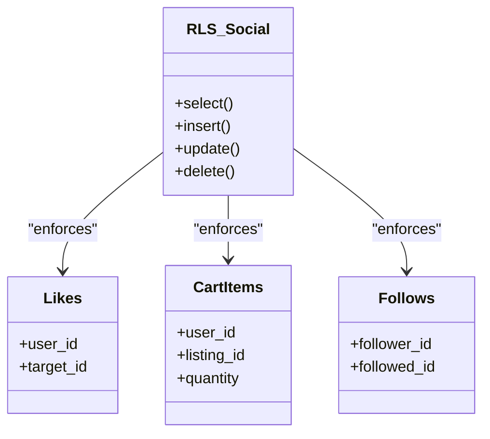

**Diagram sources**
- [202607150005_phase_3_user_likes_and_cart.sql:1-200](file://supabase/migrations/202607150005_phase_3_user_likes_and_cart.sql#L1-L200)
- [202608160446_u8_user_follows.sql:1-200](file://supabase/migrations/202608160446_u8_user_follows.sql#L1-L200)
- [phase_3_user_likes_rls.sql:1-200](file://supabase/tests/phase_3_user_likes_rls.sql#L1-L200)
- [phase_3_cart_items_rls.sql:1-200](file://supabase/tests/phase_3_cart_items_rls.sql#L1-L200)
- [phase_3_social_rls.sql:1-200](file://supabase/tests/phase_3_social_rls.sql#L1-L200)

**Section sources**
- [202607150005_phase_3_user_likes_and_cart.sql:1-200](file://supabase/migrations/202607150005_phase_3_user_likes_and_cart.sql#L1-L200)
- [202608160446_u8_user_follows.sql:1-200](file://supabase/migrations/202608160446_u8_user_follows.sql#L1-L200)
- [phase_3_user_likes_rls.sql:1-200](file://supabase/tests/phase_3_user_likes_rls.sql#L1-L200)
- [phase_3_cart_items_rls.sql:1-200](file://supabase/tests/phase_3_cart_items_rls.sql#L1-L200)
- [phase_3_social_rls.sql:1-200](file://supabase/tests/phase_3_social_rls.sql#L1-L200)

### Payments and Blocked Users Security
- Purpose: Safeguard sensitive payment methods and block management.
- Key mechanisms:
  - Payment methods restricted to the owning user; admin roles may manage disputes.
  - Blocked users lists controlled by owners and admins.
- Evaluation logic:
  - Writes require ownership or admin privileges.
  - Reads are filtered by user context.

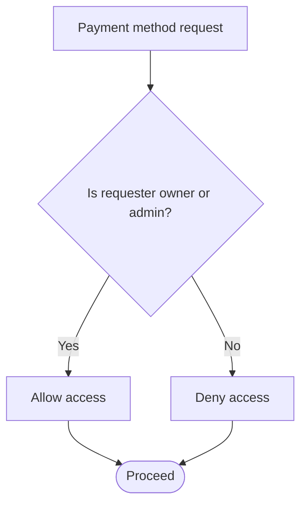

**Diagram sources**
- [202608060001_payment_methods.sql:1-200](file://supabase/migrations/202608060001_payment_methods.sql#L1-L200)
- [202608060002_blocked_users.sql:1-200](file://supabase/migrations/202608060002_blocked_users.sql#L1-L200)
- [phase_4_payment_methods_rls.sql:1-200](file://supabase/tests/phase_4_payment_methods_rls.sql#L1-L200)
- [phase_4_blocked_users_rls.sql:1-200](file://supabase/tests/phase_4_blocked_users_rls.sql#L1-L200)

**Section sources**
- [202608060001_payment_methods.sql:1-200](file://supabase/migrations/202608060001_payment_methods.sql#L1-L200)
- [202608060002_blocked_users.sql:1-200](file://supabase/migrations/202608060002_blocked_users.sql#L1-L200)
- [phase_4_payment_methods_rls.sql:1-200](file://supabase/tests/phase_4_payment_methods_rls.sql#L1-L200)
- [phase_4_blocked_users_rls.sql:1-200](file://supabase/tests/phase_4_blocked_users_rls.sql#L1-L200)

### Admin and Service Roles
- Purpose: Enable administrative oversight and background services without compromising user data.
- Key mechanisms:
  - Service role grants provide elevated privileges for specific operations.
  - Admin views encapsulate sensitive data access with strict controls.
- Evaluation logic:
  - Admin actions require explicit role checks.
  - Service roles operate within narrowly scoped permissions.

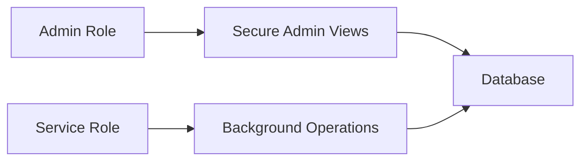

**Diagram sources**
- [202608160503_svc_role_grants.sql:1-200](file://supabase/migrations/202608160503_svc_role_grants.sql#L1-L200)
- [202608160504_seller_card_view_security_invoker.sql:1-200](file://supabase/migrations/202608160504_seller_card_view_security_invoker.sql#L1-L200)
- [phase_3_5_admin_rls.sql:1-200](file://supabase/tests/phase_3_5_admin_rls.sql#L1-L200)

**Section sources**
- [202608160503_svc_role_grants.sql:1-200](file://supabase/migrations/202608160503_svc_role_grants.sql#L1-L200)
- [202608160504_seller_card_view_security_invoker.sql:1-200](file://supabase/migrations/202608160504_seller_card_view_security_invoker.sql#L1-L200)
- [phase_3_5_admin_rls.sql:1-200](file://supabase/tests/phase_3_5_admin_rls.sql#L1-L200)

### Search and Public Profiles Security
- Purpose: Expose searchable listing data and public seller profiles while maintaining privacy.
- Key mechanisms:
  - Search indexes and views filter out private or inactive listings.
  - Public profiles show only permitted fields.
- Evaluation logic:
  - Read-only exposure based on listing status and profile visibility settings.

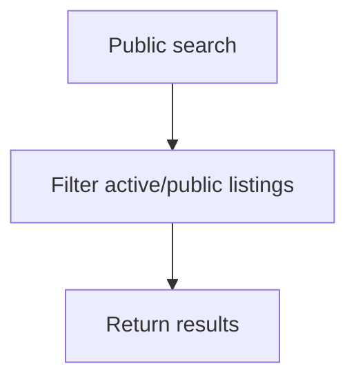

**Diagram sources**
- [202608160429_u3_search_listings.sql:1-200](file://supabase/migrations/202608160429_u3_search_listings.sql#L1-L200)
- [202607150004_phase_3_public_seller_profiles.sql:1-200](file://supabase/migrations/202607150004_phase_3_public_seller_profiles.sql#L1-L200)
- [phase_3_public_seller_profiles_rls.sql:1-200](file://supabase/tests/phase_3_public_seller_profiles_rls.sql#L1-L200)

**Section sources**
- [202608160429_u3_search_listings.sql:1-200](file://supabase/migrations/202608160429_u3_search_listings.sql#L1-L200)
- [202607150004_phase_3_public_seller_profiles.sql:1-200](file://supabase/migrations/202607150004_phase_3_public_seller_profiles.sql#L1-L200)
- [phase_3_public_seller_profiles_rls.sql:1-200](file://supabase/tests/phase_3_public_seller_profiles_rls.sql#L1-L200)

## Dependency Analysis
RLS policies depend on:
- Authentication context: Current user ID and roles must be present for policy evaluation.
- Schema structure: Ownership and tenant columns drive policy conditions.
- Views and functions: Encapsulated logic ensures consistent enforcement across queries.
- Tests: Validate policy behavior under different roles and scenarios.

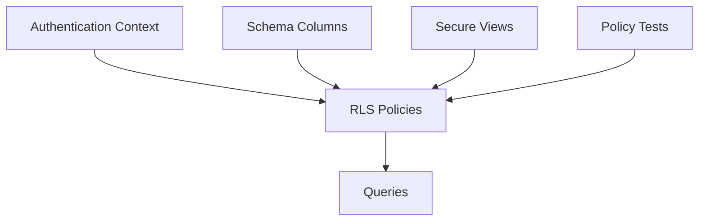

**Diagram sources**
- [202607150001_phase_2_identity.sql:1-200](file://supabase/migrations/202607150001_phase_2_identity.sql#L1-L200)
- [202607150002_phase_3_listings.sql:1-200](file://supabase/migrations/202607150002_phase_3_listings.sql#L1-L200)
- [phase_3_listings_rls.sql:1-200](file://supabase/tests/phase_3_listings_rls.sql#L1-L200)

**Section sources**
- [202607150001_phase_2_identity.sql:1-200](file://supabase/migrations/202607150001_phase_2_identity.sql#L1-L200)
- [202607150002_phase_3_listings.sql:1-200](file://supabase/migrations/202607150002_phase_3_listings.sql#L1-L200)
- [phase_3_listings_rls.sql:1-200](file://supabase/tests/phase_3_listings_rls.sql#L1-L200)

## Performance Considerations
- Indexing: Ensure columns used in policy conditions (e.g., owner_id, tenant_id) are indexed to minimize scan overhead.
- Query design: Prefer views that pre-filter data to reduce policy evaluation cost.
- Caching: Cache read-heavy public data behind views to avoid repeated policy checks.
- Batch operations: Use server-side batching to limit round-trips and policy evaluations.

[No sources needed since this section provides general guidance]

## Troubleshooting Guide
Common issues and resolutions:
- Missing authentication: Ensure requests include valid tokens; verify client configuration.
- Incorrect roles: Confirm service and admin roles are granted appropriately.
- Policy misconfiguration: Review policy conditions for ownership and tenant checks.
- Test failures: Run policy tests to identify denied operations and adjust policies accordingly.

Debugging steps:
- Reproduce with minimal query and known user context.
- Inspect policy definitions and schema columns involved.
- Use dedicated tests to assert expected allow/deny outcomes.

**Section sources**
- [supabase.ts:1-200](file://src/services/backend/supabase.ts#L1-L200)
- [config.ts:1-200](file://src/services/backend/config.ts#L1-L200)
- [phase_3_listings_rls.sql:1-200](file://supabase/tests/phase_3_listings_rls.sql#L1-L200)
- [phase_3_orders_rls.sql:1-200](file://supabase/tests/phase_3_orders_rls.sql#L1-L200)

## Conclusion
Mooday’s security model relies on robust RLS policies, clear ownership semantics, and role-based access control to protect user data and marketplace transactions. By combining database-enforced policies with application-level helpers and comprehensive tests, the platform maintains strong isolation and integrity across user data, listings, orders, messages, social features, payments, and admin functions. Ongoing testing and careful policy design ensure scalability and resilience against common security risks.

[No sources needed since this section summarizes without analyzing specific files]

## Appendices

### Policy Creation Checklist
- Define ownership and tenant columns for each resource.
- Create per-operation policies (SELECT, INSERT, UPDATE, DELETE).
- Apply role overrides for admin/service roles where necessary.
- Add secure views for complex read paths.
- Write tests covering allowed and denied scenarios.

**Section sources**
- [202607150001_phase_2_identity.sql:1-200](file://supabase/migrations/202607150001_phase_2_identity.sql#L1-L200)
- [202607150002_phase_3_listings.sql:1-200](file://supabase/migrations/202607150002_phase_3_listings.sql#L1-L200)
- [phase_3_listings_rls.sql:1-200](file://supabase/tests/phase_3_listings_rls.sql#L1-L200)

### Multi-Tenant Scenarios and Data Isolation
- Include tenant_id on all multi-tenant tables.
- Enforce tenant isolation in policies alongside ownership checks.
- Use views to aggregate cross-tenant metrics safely.
- Validate tenant context in application code before issuing queries.

**Section sources**
- [202607150002_phase_3_listings.sql:1-200](file://supabase/migrations/202607150002_phase_3_listings.sql#L1-L200)
- [202607150006_phase_3_orders.sql:1-200](file://supabase/migrations/202607150006_phase_3_orders.sql#L1-L200)

### Security Testing Strategy
- Unit tests per table asserting allowed/denied operations.
- Integration tests simulating multi-role access.
- Regression tests for policy changes to prevent regressions.

**Section sources**
- [phase_2_rls.sql:1-200](file://supabase/tests/phase_2_rls.sql#L1-L200)
- [phase_3_listings_rls.sql:1-200](file://supabase/tests/phase_3_listings_rls.sql#L1-L200)
- [phase_3_orders_rls.sql:1-200](file://supabase/tests/phase_3_orders_rls.sql#L1-L200)
- [phase_3_social_rls.sql:1-200](file://supabase/tests/phase_3_social_rls.sql#L1-L200)
- [phase_3_user_likes_rls.sql:1-200](file://supabase/tests/phase_3_user_likes_rls.sql#L1-L200)
- [phase_3_cart_items_rls.sql:1-200](file://supabase/tests/phase_3_cart_items_rls.sql#L1-L200)
- [phase_3_listing_media_rls.sql:1-200](file://supabase/tests/phase_3_listing_media_rls.sql#L1-L200)
- [phase_3_public_seller_profiles_rls.sql:1-200](file://supabase/tests/phase_3_public_seller_profiles_rls.sql#L1-L200)
- [phase_3_5_admin_rls.sql:1-200](file://supabase/tests/phase_3_5_admin_rls.sql#L1-L200)
- [phase_4_blocked_users_rls.sql:1-200](file://supabase/tests/phase_4_blocked_users_rls.sql#L1-L200)
- [phase_4_payment_methods_rls.sql:1-200](file://supabase/tests/phase_4_payment_methods_rls.sql#L1-L200)

### Common Vulnerabilities and Mitigations
- Privilege escalation: Limit admin/service roles to narrow scopes.
- Data leakage via views: Ensure views do not bypass RLS constraints.
- Insecure direct object references: Always enforce ownership and tenant checks in policies.
- Misconfigured roles: Regularly audit role grants and policy definitions.

**Section sources**
- [202608160503_svc_role_grants.sql:1-200](file://supabase/migrations/202608160503_svc_role_grants.sql#L1-L200)
- [202608160504_seller_card_view_security_invoker.sql:1-200](file://supabase/migrations/202608160504_seller_card_view_security_invoker.sql#L1-L200)