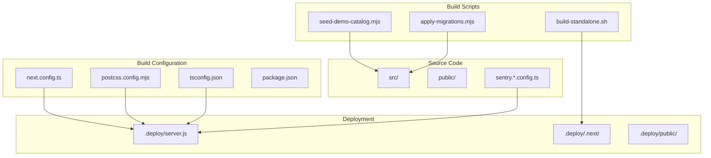
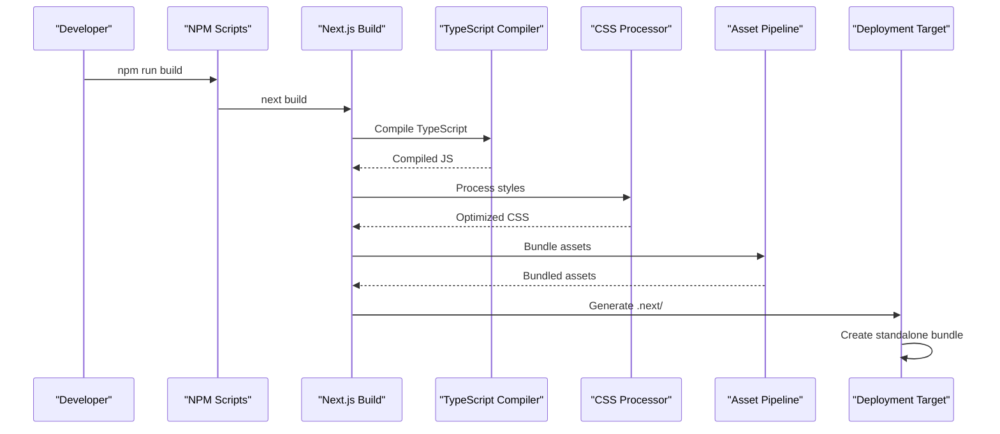
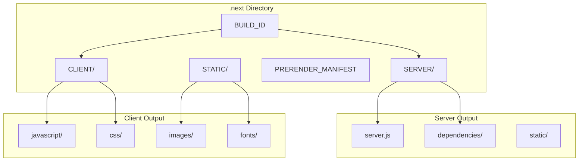
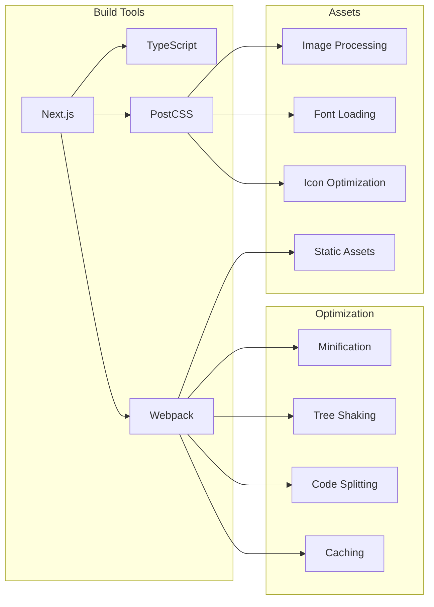

# Build Process

<cite>
**Referenced Files in This Document**
- [next.config.ts](file://next.config.ts)
- [package.json](file://package.json)
- [scripts/build-standalone.sh](file://scripts/build-standalone.sh)
- [tsconfig.json](file://tsconfig.json)
- [postcss.config.mjs](file://postcss.config.mjs)
- [.deploy/server.js](file://.deploy/server.js)
- [sentry.client.config.ts](file://sentry.client.config.ts)
- [sentry.server.config.ts](file://sentry.edge.config.ts)
</cite>

## Table of Contents
1. [Introduction](#introduction)
2. [Project Structure](#project-structure)
3. [Core Components](#core-components)
4. [Architecture Overview](#architecture-overview)
5. [Detailed Component Analysis](#detailed-component-analysis)
6. [Dependency Analysis](#dependency-analysis)
7. [Performance Considerations](#performance-considerations)
8. [Troubleshooting Guide](#troubleshooting-guide)
9. [Conclusion](#conclusion)
10. [Appendices](#appendices)

## Introduction

This document provides comprehensive build process documentation for the Mooday marketplace, a Next.js-based application. It covers the complete build pipeline including configuration, optimization settings, asset processing, standalone deployment, environment-specific builds, and performance optimization strategies. The documentation is designed to help developers understand how the application is built, optimized, and deployed across different environments.

## Project Structure

The Mooday marketplace follows a modern Next.js architecture with a well-organized build system:

**Diagram sources**
- [next.config.ts:1-100](file://next.config.ts#L1-L100)
- [scripts/build-standalone.sh:1-50](file://scripts/build-standalone.sh#L1-L50)
- [.deploy/server.js:1-50](file://.deploy/server.js#L1-L50)

**Section sources**
- [package.json:1-100](file://package.json#L1-L100)
- [next.config.ts:1-200](file://next.config.ts#L1-L200)

## Core Components

### Next.js Configuration
The Next.js configuration defines the core build behavior, including experimental features, optimization settings, and deployment targets. Key aspects include:

- **Standalone mode**: Enables production-ready builds with minimal dependencies
- **Image optimization**: Configures image processing and caching
- **Asset handling**: Manages static assets and public files
- **Environment variables**: Handles runtime configuration
- **Sentry integration**: Error tracking and performance monitoring

### Build Scripts
Custom build scripts automate the deployment process:

- **Standalone build script**: Creates optimized production bundles
- **Database migrations**: Applies schema changes during deployment
- **Seed data**: Populates initial data for development and testing
- **Asset generation**: Processes icons and other static assets

### TypeScript Configuration
TypeScript settings ensure type safety and compilation optimization:

- **Strict mode**: Enables comprehensive type checking
- **Module resolution**: Configures import/export paths
- **Target compatibility**: Sets JavaScript output version
- **Build optimizations**: Enables incremental compilation and caching

**Section sources**
- [next.config.ts:1-150](file://next.config.ts#L1-L150)
- [scripts/build-standalone.sh:1-100](file://scripts/build-standalone.sh#L1-L100)
- [tsconfig.json:1-100](file://tsconfig.json#L1-L100)

## Architecture Overview

The build architecture follows a multi-stage process optimized for both development and production environments:

**Diagram sources**
- [package.json:1-50](file://package.json#L1-L50)
- [next.config.ts:1-100](file://next.config.ts#L1-L100)
- [scripts/build-standalone.sh:1-50](file://scripts/build-standalone.sh#L1-L50)

## Detailed Component Analysis

### Next.js Build Configuration

The Next.js configuration file controls the entire build process with several key sections:

#### Experimental Features
- **Server components**: Enables React Server Components for improved performance
- **App router**: Uses the latest routing system
- **Image optimization**: Automatic image resizing and format conversion
- **Font optimization**: Self-hosted font loading

#### Optimization Settings
- **Bundle analysis**: Code splitting and dependency optimization
- **Compression**: Gzip and Brotli compression for assets
- **Caching**: Browser and CDN caching headers
- **Tree shaking**: Removes unused code automatically

#### Asset Processing
- **Static assets**: Files in `public/` directory are served directly
- **Dynamic images**: Optimized image processing pipeline
- **Fonts**: Custom font loading and optimization
- **Icons**: SVG icon optimization and bundling

**Section sources**
- [next.config.ts:1-200](file://next.config.ts#L1-L200)

### Standalone Build Script

The standalone build script creates a self-contained deployment package:

#### Build Process Flow
1. **Clean build directory**: Removes previous build artifacts
2. **Install dependencies**: Installs production-only dependencies
3. **Run Next.js build**: Generates optimized production bundle
4. **Create standalone package**: Packages everything needed for deployment
5. **Generate server entry**: Creates minimal server for production

#### Environment Handling
- **Development vs Production**: Different optimization levels
- **Environment variables**: Injected at build time
- **Feature flags**: Conditional compilation based on environment
- **Debugging**: Source maps and error reporting

**Section sources**
- [scripts/build-standalone.sh:1-150](file://scripts/build-standalone.sh#L1-L150)

### Dependency Management

The project uses a layered dependency strategy:

#### Core Dependencies
- **Next.js**: Framework and build tooling
- **React**: UI library with hooks and components
- **TypeScript**: Type safety and development experience
- **Tailwind CSS**: Utility-first CSS framework

#### Development Dependencies
- **Testing frameworks**: Unit and integration testing
- **Linting tools**: Code quality and consistency
- **Build tools**: Asset processing and optimization
- **Development utilities**: Hot reloading and debugging

#### Production Dependencies
- **Runtime libraries**: Only essential packages for deployment
- **Optimized versions**: Minified and tree-shaken versions
- **Security patches**: Regular updates for vulnerabilities

**Section sources**
- [package.json:1-200](file://package.json#L1-L200)

### Environment-Specific Builds

The build system supports multiple environments with distinct configurations:

#### Development Environment
- **Fast rebuilds**: Incremental compilation for quick feedback
- **Hot module replacement**: Live code updates without full rebuild
- **Debugging support**: Source maps and verbose logging
- **Mock services**: Local development APIs and data

#### Staging Environment
- **Production-like**: Mirrors production configuration
- **Integration testing**: End-to-end test execution
- **Performance profiling**: Load testing and optimization
- **Monitoring setup**: Error tracking and analytics

#### Production Environment
- **Maximum optimization**: Aggressive code splitting and minification
- **Security hardening**: Environment variable validation
- **CDN integration**: Static asset distribution
- **Rollback capability**: Versioned deployments

**Section sources**
- [next.config.ts:100-300](file://next.config.ts#L100-L300)
- [package.json:50-150](file://package.json#L50-L150)

### Build Output Structure

The build process generates a structured output optimized for deployment:

**Diagram sources**
- [next.config.ts:150-250](file://next.config.ts#L150-L250)
- [scripts/build-standalone.sh:50-100](file://scripts/build-standalone.sh#L50-L100)

### Code Splitting Strategies

The application implements sophisticated code splitting to optimize load times:

#### Route-Based Splitting
- **Page-level splitting**: Each route loads only its required code
- **Component lazy loading**: Heavy components loaded on demand
- **Shared chunks**: Common dependencies extracted to shared bundles

#### Feature-Based Splitting
- **Admin features**: Separate bundle for admin functionality
- **User features**: Main application bundle for regular users
- **Third-party integrations**: External services loaded conditionally

#### Asset Splitting
- **Image optimization**: Responsive images based on device capabilities
- **Font subsetting**: Only required character sets loaded
- **Icon optimization**: SVG sprites and individual icons

**Section sources**
- [next.config.ts:200-400](file://next.config.ts#L200-L400)

## Dependency Analysis

The build system has clear dependency relationships between components:

**Diagram sources**
- [package.json:1-100](file://package.json#L1-L100)
- [postcss.config.mjs:1-50](file://postcss.config.mjs#L1-L50)
- [next.config.ts:1-100](file://next.config.ts#L1-L100)

**Section sources**
- [package.json:1-200](file://package.json#L1-L200)
- [postcss.config.mjs:1-100](file://postcss.config.mjs#L1-L100)

## Performance Considerations

### Build Performance Optimization
- **Incremental compilation**: TypeScript and Next.js cache enabled
- **Parallel processing**: Multiple build tasks run concurrently
- **Memory management**: Optimized heap size for large projects
- **Network caching**: Dependency caching across builds

### Runtime Performance
- **Bundle size optimization**: Tree shaking and dead code elimination
- **Lazy loading**: Components and routes loaded on demand
- **Caching strategies**: Browser and CDN caching configured
- **CDN integration**: Static assets served from edge locations

### Monitoring and Profiling
- **Build metrics**: Track build times and bundle sizes
- **Performance budgets**: Enforce limits on bundle sizes
- **Error tracking**: Sentry integration for production monitoring
- **Analytics**: User experience metrics collection

**Section sources**
- [next.config.ts:300-500](file://next.config.ts#L300-L500)
- [sentry.client.config.ts:1-100](file://sentry.client.config.ts#L1-L100)
- [sentry.server.config.ts:1-100](file://sentry.server.config.ts#L1-L100)

## Troubleshooting Guide

### Common Build Issues

#### Memory Exhaustion
- **Symptoms**: Build process crashes with out-of-memory errors
- **Solution**: Increase Node.js memory limit with `NODE_OPTIONS="--max-old-space-size=4096"`
- **Prevention**: Optimize large dependencies and enable incremental builds

#### Dependency Conflicts
- **Symptoms**: Package installation fails or runtime errors occur
- **Solution**: Use `npm install --legacy-peer-deps` or update conflicting packages
- **Prevention**: Regular dependency updates and lock file maintenance

#### Asset Processing Errors
- **Symptoms**: Images, fonts, or styles fail to process
- **Solution**: Check file paths and formats; verify asset pipeline configuration
- **Prevention**: Standardize asset naming and use supported formats

#### Environment Variable Issues
- **Symptoms**: Build succeeds but runtime fails due to missing variables
- **Solution**: Ensure all required environment variables are set in deployment
- **Prevention**: Use environment validation and default values

### Debugging Techniques

#### Build Analysis
- **Bundle analyzer**: Visualize bundle composition and identify large dependencies
- **Verbose logging**: Enable detailed build logs for troubleshooting
- **Incremental builds**: Use cached builds to isolate build issues

#### Runtime Debugging
- **Source maps**: Enable source maps for production debugging
- **Error boundaries**: Implement React error boundaries for graceful failures
- **Logging**: Structured logging with context for better debugging

**Section sources**
- [scripts/build-standalone.sh:100-200](file://scripts/build-standalone.sh#L100-L200)
- [next.config.ts:400-600](file://next.config.ts#L400-L600)

## Conclusion

The Mooday marketplace build system is designed for scalability, performance, and developer productivity. The modular architecture allows for easy customization and extension while maintaining consistent build processes across environments. Key strengths include:

- **Optimized production builds** with advanced code splitting and asset optimization
- **Flexible environment configuration** supporting development, staging, and production
- **Comprehensive monitoring** with error tracking and performance metrics
- **Robust deployment pipeline** with standalone packaging and rollback capability

The build system follows industry best practices and provides a solid foundation for the marketplace's growth and evolution.

## Appendices

### Build Commands Reference

| Command | Description | Environment |
|---------|-------------|-------------|
| `npm run dev` | Start development server with hot reload | Development |
| `npm run build` | Create production build | All environments |
| `npm run start` | Start production server | Production |
| `npm run build:standalone` | Create standalone deployment package | Production |
| `npm run analyze` | Analyze bundle size and dependencies | Development |

### Environment Variables

| Variable | Description | Required | Default |
|----------|-------------|----------|---------|
| `NEXT_PUBLIC_API_URL` | Backend API endpoint | Yes | - |
| `DATABASE_URL` | Database connection string | Yes | - |
| `SENTRY_DSN` | Sentry error tracking DSN | No | - |
| `NODE_ENV` | Application environment | Yes | development |
| `NEXT_PUBLIC_APP_VERSION` | Application version | No | - |

**Section sources**
- [package.json:100-200](file://package.json#L100-L200)
- [next.config.ts:500-700](file://next.config.ts#L500-L700)