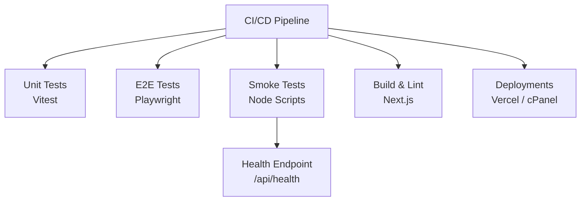
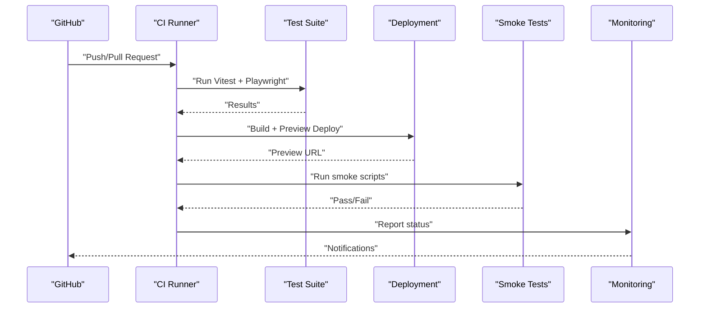
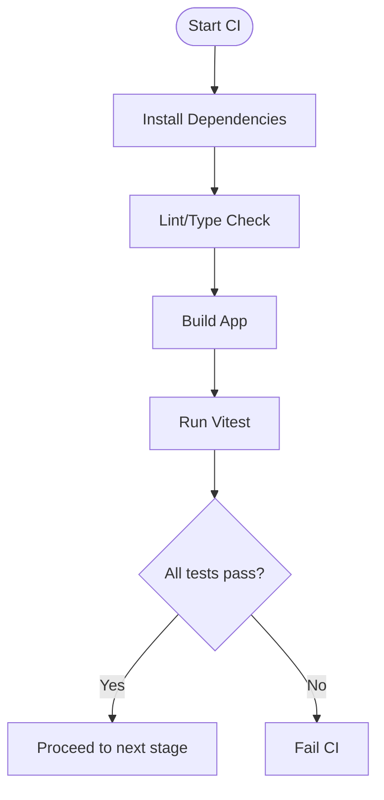
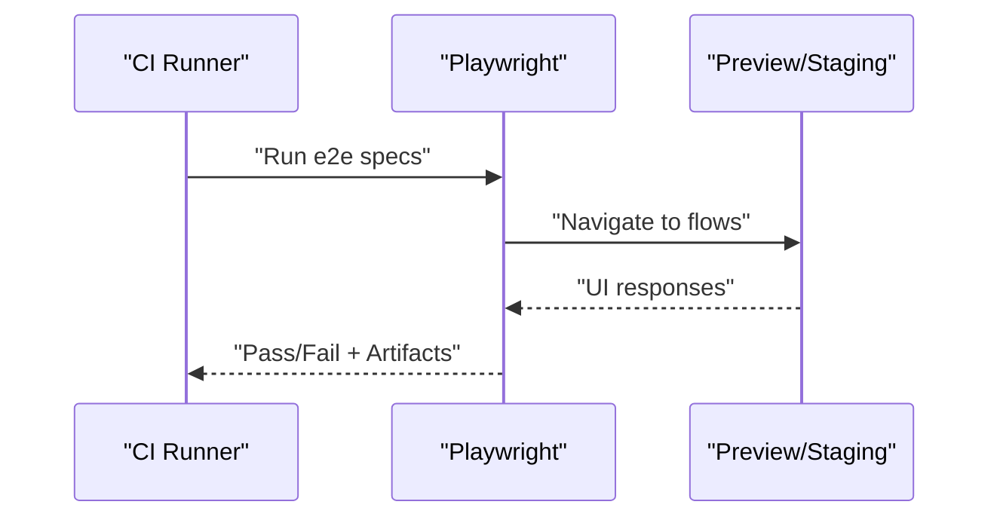
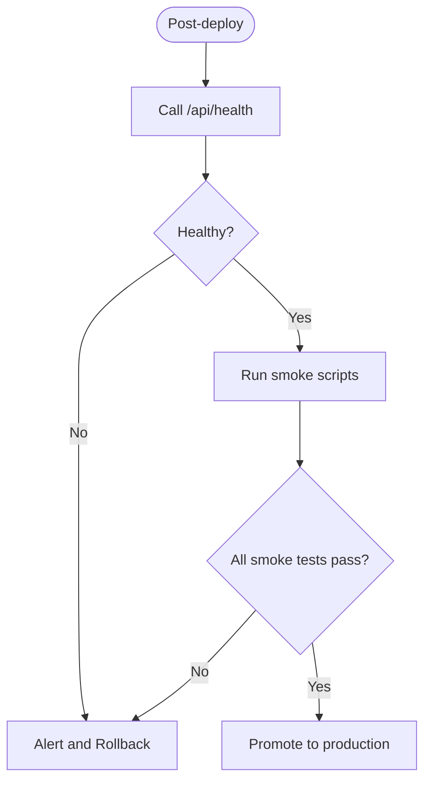
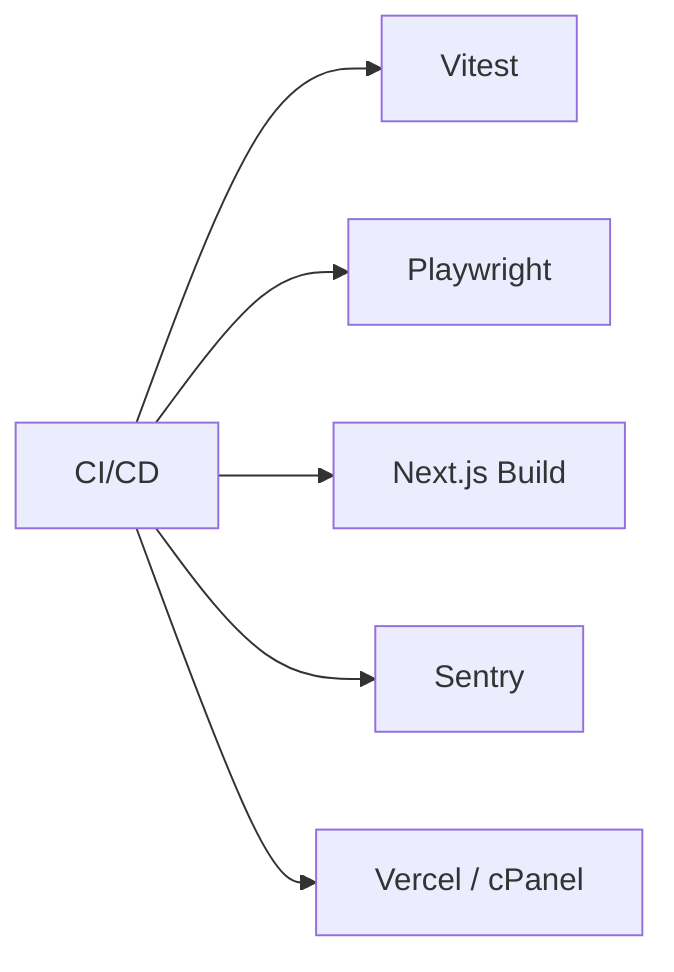

# CI/CD Pipeline

<cite>
**Referenced Files in This Document**
- [package.json](file://package.json)
- [playwright.config.ts](file://playwright.config.ts)
- [vitest.config.mts](file://vitest.config.mts)
- [vitest.setup.ts](file://vitest.setup.ts)
- [next.config.ts](file://next.config.ts)
- [sentry.client.config.ts](file://sentry.client.config.ts)
- [sentry.edge.config.ts](file://sentry.edge.config.ts)
- [sentry.server.config.ts](file://sentry.server.config.ts)
- [.vercelignore](file://.vercelignore)
- [DEPLOYMENT_CPANEL.md](file://docs/DEPLOYMENT_CPANEL.md)
- [SMOKE_TESTS.md](file://docs/SMOKE_TESTS.md)
- [phase2-auth-smoke.mjs](file://scripts/phase2-auth-smoke.mjs)
- [phase2-smoke-supabase.mjs](file://scripts/phase2-smoke-supabase.mjs)
- [phase4-admin-actions-smoke.mjs](file://scripts/phase4-admin-actions-smoke.mjs)
- [phase4-image-upload-smoke.mjs](file://scripts/phase4-image-upload-smoke.mjs)
- [phase4-notification-fanout-smoke.mjs](file://scripts/phase4-notification-fanout-smoke.mjs)
- [phase4-public-reviews-smoke.mjs](file://scripts/phase4-public-reviews-smoke.mjs)
- [u3-u8-smoke.mjs](file://scripts/u3-u8-smoke.mjs)
- [apply-migrations.mjs](file://scripts/apply-migrations.mjs)
- [build-standalone.sh](file://scripts/build-standalone.sh)
- [route.ts](file://src/app/api/health/route.ts)
- [route.test.ts](file://src/app/api/health/route.test.ts)
- [page.test.tsx](file://src/app/app/page.test.tsx)
- [daneg-rebrand.spec.ts](file://tests/e2e/daneg-rebrand.spec.ts)
- [phase2-auth.spec.ts](file://tests/e2e/phase2-auth.spec.ts)
- [copyGuard.test.ts](file://tests/copyGuard.test.ts)
</cite>

## Table of Contents
1. [Introduction](#introduction)
2. [Project Structure](#project-structure)
3. [Core Components](#core-components)
4. [Architecture Overview](#architecture-overview)
5. [Detailed Component Analysis](#detailed-component-analysis)
6. [Dependency Analysis](#dependency-analysis)
7. [Performance Considerations](#performance-considerations)
8. [Troubleshooting Guide](#troubleshooting-guide)
9. [Conclusion](#conclusion)
10. [Appendices](#appendices)

## Introduction
This document describes the CI/CD pipeline for the Mooday marketplace, focusing on automated testing, smoke tests, end-to-end (E2E) testing with Playwright, quality gates, deployment automation, artifact management, and operational practices such as monitoring, notifications, and rollback strategies. It synthesizes the repository’s test configuration, scripts, and deployment documentation to provide a practical guide for running and improving the pipeline.

## Project Structure
The repository includes:
- Unit and integration tests using Vitest
- E2E tests using Playwright
- Smoke test scripts under scripts/
- Deployment-related documentation and configuration files
- Health endpoint used for smoke checks

[No sources needed since this diagram shows conceptual workflow, not actual code structure]

## Core Components
- Test runners and configurations:
  - Vitest configuration and setup for unit/integration tests
  - Playwright configuration for browser-based E2E tests
- Smoke tests:
  - Node scripts that exercise key flows and verify system health
- Build and runtime:
  - Next.js build configuration
  - Sentry client/edge/server configs for error tracking
- Deployment:
  - Vercel deployment via Next.js conventions
  - cPanel deployment guidance documented in docs

Key files:
- [vitest.config.mts](file://vitest.config.mts)
- [vitest.setup.ts](file://vitest.setup.ts)
- [playwright.config.ts](file://playwright.config.ts)
- [next.config.ts](file://next.config.ts)
- [sentry.client.config.ts](file://sentry.client.config.ts)
- [sentry.edge.config.ts](file://sentry.edge.config.ts)
- [sentry.server.config.ts](file://sentry.server.config.ts)
- [DEPLOYMENT_CPANEL.md](file://docs/DEPLOYMENT_CPANEL.md)

**Section sources**
- [vitest.config.mts:1-200](file://vitest.config.mts#L1-L200)
- [vitest.setup.ts:1-200](file://vitest.setup.ts#L1-L200)
- [playwright.config.ts:1-200](file://playwright.config.ts#L1-L200)
- [next.config.ts:1-200](file://next.config.ts#L1-L200)
- [sentry.client.config.ts:1-200](file://sentry.client.config.ts#L1-L200)
- [sentry.edge.config.ts:1-200](file://sentry.edge.config.ts#L1-L200)
- [sentry.server.config.ts:1-200](file://sentry.server.config.ts#L1-L200)
- [DEPLOYMENT_CPANEL.md:1-200](file://docs/DEPLOYMENT_CPANEL.md#L1-L200)

## Architecture Overview
The CI/CD pipeline typically follows these stages:
- Install dependencies and cache them
- Lint and type-check
- Build the application
- Run unit and integration tests
- Run E2E tests against a preview or staging environment
- Execute smoke tests against the deployed preview/staging
- Deploy artifacts to production (with optional blue-green or rolling updates)
- Post-deploy verification and rollback triggers if needed

[No sources needed since this diagram shows conceptual workflow, not actual code structure]

## Detailed Component Analysis

### Automated Testing Integration (Vitest)
- Purpose: Validate components, hooks, services, and utilities quickly in CI.
- Configuration highlights:
  - Test runner and environment settings
  - Global setup for mocking or fixtures
- Typical execution:
  - Install dependencies
  - Run unit tests
  - Fail fast on any assertion failure

**Section sources**
- [vitest.config.mts:1-200](file://vitest.config.mts#L1-L200)
- [vitest.setup.ts:1-200](file://vitest.setup.ts#L1-L200)

### End-to-End Testing with Playwright
- Purpose: Validate critical user journeys across browsers and environments.
- Configuration highlights:
  - Browser targets and timeouts
  - Base URL for the preview/staging environment
  - Test specs under tests/e2e
- Execution flow:
  - Spin up or use an existing preview URL
  - Launch browsers and run specs
  - Collect traces/screenshots on failure

**Section sources**
- [playwright.config.ts:1-200](file://playwright.config.ts#L1-L200)
- [daneg-rebrand.spec.ts:1-200](file://tests/e2e/daneg-rebrand.spec.ts#L1-L200)
- [phase2-auth.spec.ts:1-200](file://tests/e2e/phase2-auth.spec.ts#L1-L200)

### Smoke Tests
- Purpose: Quick validation of deployed endpoints and core flows after deploy.
- Key script categories:
  - Auth smoke tests
  - Supabase connectivity smoke tests
  - Admin actions smoke tests
  - Image upload smoke tests
  - Notification fanout smoke tests
  - Public reviews smoke tests
  - Cross-feature smoke tests (U3–U8)
- Health check:
  - The app exposes a health endpoint used by smoke tests to confirm availability

**Section sources**
- [SMOKE_TESTS.md:1-200](file://docs/SMOKE_TESTS.md#L1-L200)
- [phase2-auth-smoke.mjs:1-200](file://scripts/phase2-auth-smoke.mjs#L1-L200)
- [phase2-smoke-supabase.mjs:1-200](file://scripts/phase2-smoke-supabase.mjs#L1-L200)
- [phase4-admin-actions-smoke.mjs:1-200](file://scripts/phase4-admin-actions-smoke.mjs#L1-L200)
- [phase4-image-upload-smoke.mjs:1-200](file://scripts/phase4-image-upload-smoke.mjs#L1-L200)
- [phase4-notification-fanout-smoke.mjs:1-200](file://scripts/phase4-notification-fanout-smoke.mjs#L1-L200)
- [phase4-public-reviews-smoke.mjs:1-200](file://scripts/phase4-public-reviews-smoke.mjs#L1-L200)
- [u3-u8-smoke.mjs:1-200](file://scripts/u3-u8-smoke.mjs#L1-L200)
- [route.ts:1-200](file://src/app/api/health/route.ts#L1-L200)

### Quality Gates
- Recommended gates:
  - Lint and type-check must pass
  - Unit tests must pass
  - E2E tests must pass on preview/staging
  - Smoke tests must pass post-deploy
  - Build artifacts produced successfully
- Enforcement:
  - Use branch protection rules to require passing checks before merge
  - Block direct pushes to protected branches

[No sources needed since this section provides general guidance]

### Branch Protection Rules and Pull Request Workflows
- Recommended rules:
  - Require status checks to pass before merging
  - Require pull request reviews
  - Require linear history or squash merges
  - Restrict force pushes and deletions
- PR workflows:
  - Auto-run CI on PRs
  - Comment results and link to logs
  - Label failures and assign owners

[No sources needed since this section provides general guidance]

### Release Management Procedures
- Versioning:
  - Tag releases and create GitHub Releases
- Promotion:
  - Promote from preview to staging to production
- Validation:
  - Run full test suite and smoke tests at each promotion step
- Backward compatibility:
  - Ensure database migrations are backward compatible or use safe migration patterns

[No sources needed since this section provides general guidance]

### Artifact Management
- Build outputs:
  - Next.js build artifacts for preview and production
- Test artifacts:
  - Playwright traces and screenshots
- Storage:
  - Use platform-native artifact storage (e.g., CI provider)
- Retention:
  - Configure retention policies for cost control

[No sources needed since this section provides general guidance]

### Deployment Strategies
- Blue-Green:
  - Maintain two identical environments; switch traffic after validation
- Rolling Updates:
  - Gradually replace instances to minimize downtime
- Selection criteria:
  - Choose based on risk tolerance, deployment frequency, and rollback complexity

[No sources needed since this section provides general guidance]

### Rollback Procedures
- Immediate rollback:
  - Re-deploy previous known-good version
- Database rollbacks:
  - Avoid destructive changes in hot paths; prefer additive migrations
- Monitoring-driven rollback:
  - Trigger rollback on error rate spikes or health check failures

[No sources needed since this section provides general guidance]

### Monitoring Pipeline Health
- Metrics to track:
  - Build duration, test flakiness, deployment success rate
- Observability:
  - Integrate Sentry for frontend/backend errors
  - Log CI job steps and outcomes
- Dashboards:
  - Visualize trends and alert on regressions

[No sources needed since this section provides general guidance]

### Notification Systems
- Channels:
  - Slack, email, or issue trackers
- Triggers:
  - On failure, slow builds, or deployment issues
- Actions:
  - Provide links to logs and affected PRs

[No sources needed since this section provides general guidance]

### Debugging Failed Deployments
- Steps:
  - Inspect CI logs for failing stage
  - Reproduce locally with same environment variables
  - Use Playwright traces/screenshots for E2E failures
  - Check health endpoint and smoke test outputs
- Tools:
  - Sentry for runtime errors
  - Local dev server with seed data for reproduction

[No sources needed since this section provides general guidance]

## Dependency Analysis
The pipeline depends on:
- Test frameworks: Vitest and Playwright
- Application framework: Next.js
- Error tracking: Sentry
- Deployment platforms: Vercel (default for Next.js), cPanel (alternative)

[No sources needed since this diagram shows conceptual workflow, not actual code structure]

**Section sources**
- [package.json:1-200](file://package.json#L1-L200)
- [next.config.ts:1-200](file://next.config.ts#L1-L200)
- [sentry.client.config.ts:1-200](file://sentry.client.config.ts#L1-L200)
- [sentry.edge.config.ts:1-200](file://sentry.edge.config.ts#L1-L200)
- [sentry.server.config.ts:1-200](file://sentry.server.config.ts#L1-L200)
- [DEPLOYMENT_CPANEL.md:1-200](file://docs/DEPLOYMENT_CPANEL.md#L1-L200)

## Performance Considerations
- Cache dependencies between jobs to reduce build times
- Parallelize independent test suites
- Limit E2E concurrency to avoid resource contention
- Use lightweight images and minimal toolchains in CI
- Optimize Playwright timeouts and retries judiciously

[No sources needed since this section provides general guidance]

## Troubleshooting Guide
Common issues and resolutions:
- Flaky E2E tests:
  - Increase timeouts, add retries, capture traces
- Environment mismatches:
  - Align local and CI environment variables
- Build failures:
  - Reproduce with exact dependency versions
- Smoke test failures:
  - Verify health endpoint and external service connectivity
- Deployment failures:
  - Check platform-specific logs and secrets

**Section sources**
- [route.test.ts:1-200](file://src/app/api/health/route.test.ts#L1-L200)
- [page.test.tsx:1-200](file://src/app/app/page.test.tsx#L1-L200)
- [copyGuard.test.ts:1-200](file://tests/copyGuard.test.ts#L1-L200)

## Conclusion
The Mooday marketplace leverages Vitest for unit/integration tests, Playwright for E2E validation, and Node-based smoke scripts to ensure deployed stability. Combined with robust quality gates, clear release procedures, and observability via Sentry, the pipeline supports reliable deployments and rapid feedback. Adopting branch protection, structured promotions, and rollback strategies further strengthens delivery confidence.

## Appendices

### Appendix A: Key Files Reference
- Test configuration and setup:
  - [vitest.config.mts](file://vitest.config.mts)
  - [vitest.setup.ts](file://vitest.setup.ts)
- E2E configuration and specs:
  - [playwright.config.ts](file://playwright.config.ts)
  - [daneg-rebrand.spec.ts](file://tests/e2e/daneg-rebrand.spec.ts)
  - [phase2-auth.spec.ts](file://tests/e2e/phase2-auth.spec.ts)
- Smoke scripts:
  - [phase2-auth-smoke.mjs](file://scripts/phase2-auth-smoke.mjs)
  - [phase2-smoke-supabase.mjs](file://scripts/phase2-smoke-supabase.mjs)
  - [phase4-admin-actions-smoke.mjs](file://scripts/phase4-admin-actions-smoke.mjs)
  - [phase4-image-upload-smoke.mjs](file://scripts/phase4-image-upload-smoke.mjs)
  - [phase4-notification-fanout-smoke.mjs](file://scripts/phase4-notification-fanout-smoke.mjs)
  - [phase4-public-reviews-smoke.mjs](file://scripts/phase4-public-reviews-smoke.mjs)
  - [u3-u8-smoke.mjs](file://scripts/u3-u8-smoke.mjs)
- Deployment and runtime:
  - [next.config.ts](file://next.config.ts)
  - [sentry.client.config.ts](file://sentry.client.config.ts)
  - [sentry.edge.config.ts](file://sentry.edge.config.ts)
  - [sentry.server.config.ts](file://sentry.server.config.ts)
  - [DEPLOYMENT_CPANEL.md](file://docs/DEPLOYMENT_CPANEL.md)
  - [.vercelignore](file://.vercelignore)
- Utilities and helpers:
  - [apply-migrations.mjs](file://scripts/apply-migrations.mjs)
  - [build-standalone.sh](file://scripts/build-standalone.sh)
  - [package.json](file://package.json)