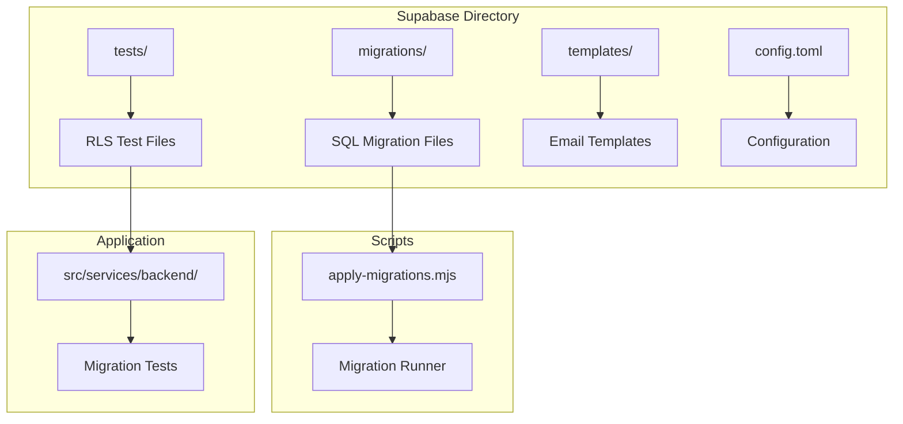
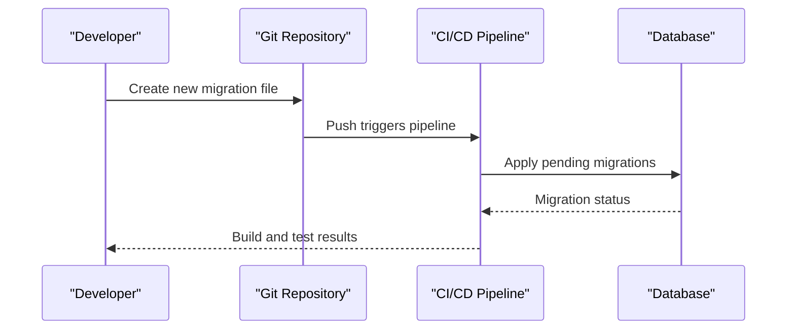
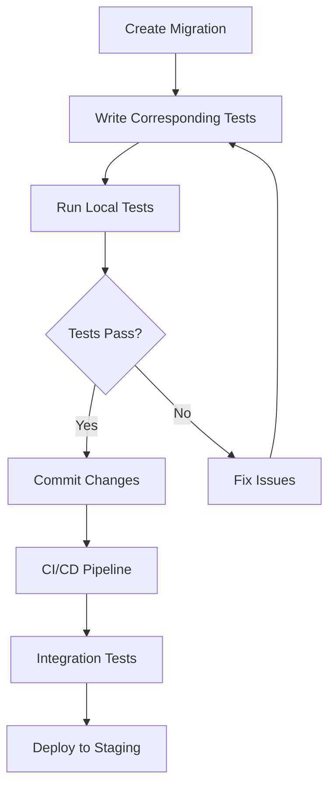

# Database Migrations

<cite>
**Referenced Files in This Document**
- [supabase/config.toml](file://supabase/config.toml)
- [scripts/apply-migrations.mjs](file://scripts/apply-migrations.mjs)
- [202607150001_phase_2_identity.sql](file://supabase/migrations/202607150001_phase_2_identity.sql)
- [202607150002_phase_3_listings.sql](file://supabase/migrations/202607150002_phase_3_listings.sql)
- [202608160429_u3_search_listings.sql](file://supabase/migrations/202608160429_u3_search_listings.sql)
- [202608190001_fix_profile_recursion_and_avatar_storage.sql](file://supabase/migrations/202608190001_fix_profile_recursion_and_avatar_storage.sql)
- [202608200001_chat_unread_count.sql](file://supabase/migrations/202608200001_chat_unread_count.sql)
- [phase_2_rls.sql](file://supabase/tests/phase_2_rls.sql)
- [phase_3_listings_rls.sql](file://supabase/tests/phase_3_listings_rls.sql)
</cite>

## Table of Contents
1. [Introduction](#introduction)
2. [Project Structure](#project-structure)
3. [Migration Strategy Overview](#migration-strategy-overview)
4. [Migration File Naming Conventions](#migration-file-naming-conventions)
5. [Version Control and Dependency Management](#version-control-and-dependency-management)
6. [Data Transformation Scripts](#data-transformation-scripts)
7. [Testing Strategies for Migrations](#testing-strategies-for-migrations)
8. [Backup and Recovery Procedures](#backup-and-recovery-procedures)
9. [Production Deployment Considerations](#production-deployment-considerations)
10. [Schema Evolution Patterns](#schema-evolution-patterns)
11. [Backward Compatibility and Data Integrity](#backward-compatibility-and-data-integrity)
12. [Troubleshooting Guide](#troubleshooting-guide)
13. [Conclusion](#conclusion)

## Introduction

This document provides comprehensive guidance for managing database migrations in the Mooday marketplace using Supabase migrations. It covers the complete lifecycle of database schema changes, from creation and version control to deployment and rollback procedures. The documentation is designed to help developers maintain data integrity while evolving the application's database schema safely and efficiently.

The Mooday marketplace uses a structured approach to database migrations that ensures consistency across development, staging, and production environments. All schema changes are tracked through SQL migration files that follow established naming conventions and dependency management practices.

## Project Structure

The database migration system is organized within the `supabase/` directory with clear separation between migrations, tests, and configuration:

**Diagram sources**
- [supabase/config.toml:1-50](file://supabase/config.toml#L1-L50)
- [scripts/apply-migrations.mjs:1-100](file://scripts/apply-migrations.mjs#L1-L100)

**Section sources**
- [supabase/config.toml:1-50](file://supabase/config.toml#L1-L50)
- [scripts/apply-migrations.mjs:1-100](file://scripts/apply-migrations.mjs#L1-L100)

## Migration Strategy Overview

The Mooday marketplace implements a forward-only migration strategy using Supabase's built-in migration system. Each migration represents an atomic change to the database schema or data, ensuring that all changes can be applied consistently across different environments.

### Key Principles

- **Idempotency**: Migrations should be designed to handle re-application gracefully
- **Atomicity**: Each migration completes fully or not at all
- **Reversibility**: While primarily forward-only, critical migrations include rollback logic
- **Dependency Management**: Migrations execute in numerical order based on timestamps
- **Testing**: Comprehensive test coverage for RLS policies and schema changes

### Migration Categories

1. **Schema Changes**: Table creation, column modifications, index additions
2. **Data Transformations**: Bulk data updates and cleanup operations
3. **Security Updates**: Row Level Security (RLS) policy modifications
4. **Performance Optimizations**: Index creation and query optimization
5. **Bug Fixes**: Schema corrections and data integrity fixes

**Section sources**
- [202607150001_phase_2_identity.sql:1-50](file://supabase/migrations/202607150001_phase_2_identity.sql#L1-L50)
- [202607150002_phase_3_listings.sql:1-50](file://supabase/migrations/202607150002_phase_3_listings.sql#L1-L50)

## Migration File Naming Conventions

Mooday follows a strict naming convention for migration files to ensure proper ordering and clear identification:

### Format: `YYYYMMDDHHMM_description.sql`

| Component | Description | Example |
|-----------|-------------|---------|
| Timestamp | UTC timestamp when migration was created | `202607150001` |
| Sequence | Sequential number within the same minute | `0001`, `0002` |
| Description | Underscore-separated descriptive name | `phase_2_identity` |

### Examples from Current Codebase

- `202607150001_phase_2_identity.sql` - Phase 2 identity system setup
- `202607150002_phase_3_listings.sql` - Phase 3 listings functionality
- `202608160429_u3_search_listings.sql` - User story 3 search functionality
- `202608190001_fix_profile_recursion_and_avatar_storage.sql` - Bug fix migration

### Naming Best Practices

1. **Use Descriptive Names**: Clearly indicate what the migration does
2. **Include Feature Context**: Reference phases, user stories, or features
3. **Avoid Generic Names**: Use specific descriptions rather than "update" or "fix"
4. **Maintain Chronological Order**: Ensure timestamps reflect actual creation order
5. **Handle Multiple Changes**: Split large migrations into smaller, focused files

**Section sources**
- [202607150001_phase_2_identity.sql:1-20](file://supabase/migrations/202607150001_phase_2_identity.sql#L1-L20)
- [202608160429_u3_search_listings.sql:1-20](file://supabase/migrations/202608160429_u3_search_listings.sql#L1-L20)
- [202608190001_fix_profile_recursion_and_avatar_storage.sql:1-20](file://supabase/migrations/202608190001_fix_profile_recursion_and_avatar_storage.sql#L1-L20)

## Version Control and Dependency Management

### Git Integration

All migration files are committed to version control alongside application code, ensuring:

- Complete audit trail of schema changes
- Ability to reproduce any database state
- Collaborative development with conflict resolution
- Automated deployment pipelines

### Dependency Management

Migrations execute sequentially based on filename ordering. Dependencies are managed through:

1. **Implicit Dependencies**: Numerical ordering ensures prerequisite migrations run first
2. **Explicit Dependencies**: Comments and documentation within migration files
3. **Feature Branches**: Separate branches for complex multi-migration changes

### Migration Execution Flow

**Diagram sources**
- [scripts/apply-migrations.mjs:1-100](file://scripts/apply-migrations.mjs#L1-L100)

**Section sources**
- [scripts/apply-migrations.mjs:1-100](file://scripts/apply-migrations.mjs#L1-L100)

## Data Transformation Scripts

Data transformations are handled within migration files using SQL statements that modify existing data while maintaining referential integrity.

### Common Transformation Patterns

1. **Column Type Changes**: Safe type conversions with data preservation
2. **Default Value Updates**: Setting appropriate defaults for new columns
3. **Data Cleanup**: Removing orphaned records or invalid data
4. **Business Logic Updates**: Applying business rule changes to existing data

### Transformation Best Practices

- **Test in Development**: Always test transformations on development data first
- **Use Transactions**: Wrap complex transformations in transactions for atomicity
- **Monitor Performance**: Large data operations should be optimized and monitored
- **Document Assumptions**: Clearly document data assumptions and constraints

### Example Transformation Scenarios

- Profile avatar storage path updates
- Search index population for new fields
- Notification fanout data synchronization
- Chat unread count calculations

**Section sources**
- [202608190002_apply_pending_profile_avatars.sql:1-50](file://supabase/migrations/202608190002_apply_pending_profile_avatars.sql#L1-L50)
- [202608200001_chat_unread_count.sql:1-50](file://supabase/migrations/202608200001_chat_unread_count.sql#L1-L50)

## Testing Strategies for Migrations

### Unit Testing Approach

Each migration should have corresponding tests that verify:

1. **Schema Validation**: Tables, columns, and constraints exist as expected
2. **RLS Policy Testing**: Row Level Security policies work correctly
3. **Data Integrity**: Foreign key relationships remain intact
4. **Performance**: Queries perform within acceptable time limits

### Test File Organization

Tests are organized in the `supabase/tests/` directory with naming conventions that mirror migration files:

- `phase_2_rls.sql` - Tests for phase 2 RLS policies
- `phase_3_listings_rls.sql` - Tests for listings RLS policies
- `phase_3_cart_items_rls.sql` - Tests for cart items RLS policies

### Testing Workflow

**Diagram sources**
- [phase_2_rls.sql:1-50](file://supabase/tests/phase_2_rls.sql#L1-L50)
- [phase_3_listings_rls.sql:1-50](file://supabase/tests/phase_3_listings_rls.sql#L1-L50)

**Section sources**
- [phase_2_rls.sql:1-50](file://supabase/tests/phase_2_rls.sql#L1-L50)
- [phase_3_listings_rls.sql:1-50](file://supabase/tests/phase_3_listings_rls.sql#L1-L50)

## Backup and Recovery Procedures

### Pre-Migration Backups

Before applying migrations to production:

1. **Automated Snapshots**: Database snapshots taken before each deployment
2. **Point-in-Time Recovery**: Enable PITR for granular recovery options
3. **Export Critical Data**: Export important reference data for manual recovery

### Rollback Procedures

While migrations are primarily forward-only, critical scenarios require rollback capabilities:

1. **Emergency Rollback**: Quick revert to previous known-good state
2. **Partial Rollback**: Undo specific migration steps if possible
3. **Data Recovery**: Restore from backups when schema changes cause data corruption

### Recovery Testing

Regularly test backup and recovery procedures:

- Monthly disaster recovery drills
- Quarterly full environment restoration
- Annual complete infrastructure failover testing

**Section sources**
- [supabase/config.toml:1-50](file://supabase/config.toml#L1-L50)

## Production Deployment Considerations

### Deployment Pipeline

Production deployments follow a strict process:

1. **Code Review**: All migrations require peer review
2. **Automated Testing**: Full test suite must pass
3. **Staging Deployment**: Deploy to staging environment first
4. **Manual Approval**: Required approval for production deployment
5. **Gradual Rollout**: Phased deployment with monitoring

### Migration Execution in Production

- **Maintenance Windows**: Schedule migrations during low-traffic periods
- **Monitoring**: Real-time monitoring of migration progress and errors
- **Rollback Triggers**: Automatic rollback on critical failures
- **Communication**: Stakeholder notification before and after migrations

### Performance Impact

- **Index Creation**: Schedule heavy index operations during maintenance windows
- **Lock Management**: Minimize table locks during migrations
- **Connection Pooling**: Ensure adequate connection pool sizing
- **Query Optimization**: Monitor slow queries post-migration

**Section sources**
- [scripts/apply-migrations.mjs:1-100](file://scripts/apply-migrations.mjs#L1-L100)

## Schema Evolution Patterns

### Additive Changes

Preferred pattern for schema evolution:

1. **Add New Columns**: Introduce new columns without removing old ones
2. **Dual Write**: Write to both old and new columns during transition
3. **Data Migration**: Gradually migrate data to new structure
4. **Read Both**: Support reading from both old and new columns
5. **Deprecation**: Remove old columns after verification period

### Column Modification Patterns

| Change Type | Pattern | Risk Level |
|-------------|---------|------------|
| Adding Column | Direct addition | Low |
| Dropping Column | Deprecation then removal | Medium |
| Changing Type | Dual column migration | High |
| Renaming Column | Add new + migrate + drop old | Medium |

### Index Strategy

- **Development Indexes**: Create indexes for performance testing
- **Production Indexes**: Carefully planned index additions with downtime consideration
- **Monitoring**: Track index usage and effectiveness
- **Cleanup**: Remove unused indexes regularly

**Section sources**
- [202608190001_fix_profile_recursion_and_avatar_storage.sql:1-50](file://supabase/migrations/202608190001_fix_profile_recursion_and_avatar_storage.sql#L1-L50)

## Backward Compatibility and Data Integrity

### API Compatibility

When changing database schemas:

1. **API Versioning**: Maintain backward-compatible API versions
2. **Graceful Degradation**: Handle missing fields gracefully
3. **Feature Flags**: Use feature flags for gradual rollout
4. **Client Updates**: Coordinate client updates with backend changes

### Data Integrity Checks

Implement comprehensive data integrity validation:

1. **Foreign Key Constraints**: Enforce referential integrity
2. **Check Constraints**: Validate data ranges and formats
3. **Unique Constraints**: Prevent duplicate data entries
4. **Trigger Functions**: Implement complex business rules

### Migration Safety

Ensure migrations maintain data integrity:

- **Transaction Wrapping**: All migrations run in transactions
- **Validation Steps**: Verify data integrity before and after changes
- **Rollback Capability**: Maintain ability to undo changes
- **Audit Logging**: Log all schema changes for compliance

**Section sources**
- [phase_3_listings_rls.sql:1-50](file://supabase/tests/phase_3_listings_rls.sql#L1-L50)

## Troubleshooting Guide

### Common Migration Issues

#### Migration Conflicts

**Problem**: Concurrent migrations causing conflicts
**Solution**: 
- Implement migration locking mechanisms
- Use database-level advisory locks
- Queue migrations to prevent concurrent execution

#### Performance Issues

**Problem**: Slow migrations blocking production
**Solution**:
- Break large migrations into smaller chunks
- Use batch processing for large data operations
- Implement progress tracking and checkpointing

#### Data Corruption

**Problem**: Migration causes data inconsistency
**Solution**:
- Implement pre-migration data validation
- Use transactional migrations with rollback capability
- Maintain detailed audit logs for forensic analysis

### Debugging Techniques

1. **Enable Verbose Logging**: Capture detailed migration execution logs
2. **Use Database Profiling**: Analyze query performance during migrations
3. **Implement Health Checks**: Monitor database health during migration
4. **Set Up Alerts**: Configure alerts for migration failures

### Emergency Procedures

#### Migration Failure Response

1. **Immediate Assessment**: Determine scope and impact of failure
2. **Rollback Decision**: Evaluate whether rollback is necessary
3. **Communication**: Notify stakeholders of issues and timeline
4. **Resolution**: Fix underlying issues and reattempt migration

#### Data Recovery Process

1. **Identify Last Known Good State**: Determine point before corruption
2. **Restore from Backup**: Revert to last successful state
3. **Validate Data Integrity**: Confirm data consistency after restore
4. **Apply Missing Changes**: Reapply any successful partial changes

**Section sources**
- [scripts/apply-migrations.mjs:1-100](file://scripts/apply-migrations.mjs#L1-L100)

## Conclusion

The Mooday marketplace's database migration strategy provides a robust foundation for safe and efficient schema evolution. By following established conventions, implementing comprehensive testing, and maintaining strict version control, the team can confidently deploy database changes while minimizing risk to production systems.

Key takeaways for successful database migrations:

- **Consistent Naming**: Follow established naming conventions for clarity and automation
- **Comprehensive Testing**: Test migrations thoroughly in multiple environments
- **Careful Planning**: Plan migrations with rollback strategies and monitoring
- **Documentation**: Maintain clear documentation of all schema changes
- **Collaboration**: Coordinate database changes with frontend and API teams

This migration framework ensures that the Mooday marketplace can evolve its database schema safely while maintaining data integrity and application reliability. Regular reviews and updates to these procedures will help maintain best practices as the platform continues to grow and change.