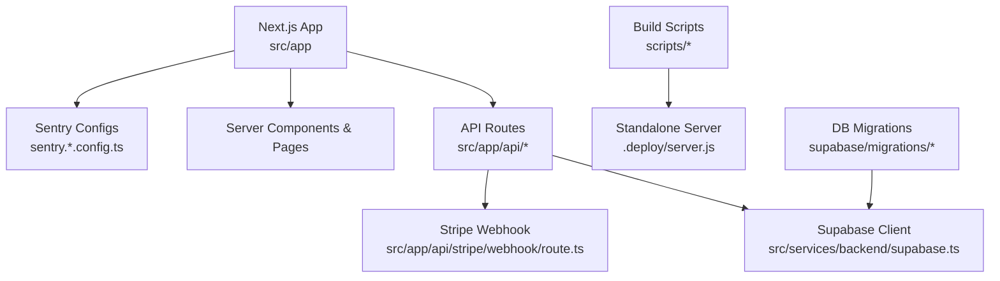
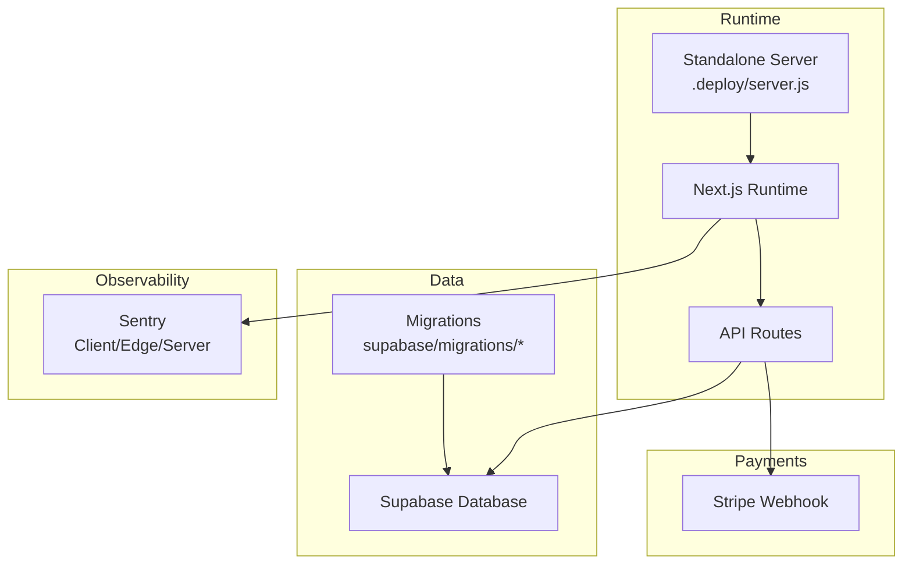
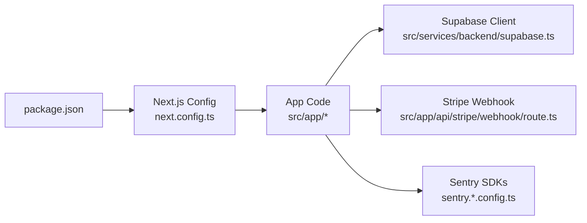
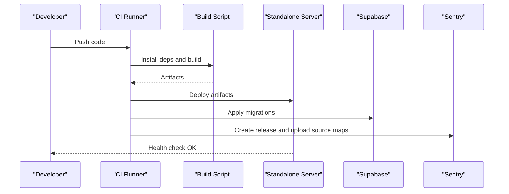

# Deployment and DevOps

<cite>
**Referenced Files in This Document**
- [package.json](file://package.json)
- [next.config.ts](file://next.config.ts)
- [.vercelignore](file://.vercelignore)
- [sentry.client.config.ts](file://sentry.client.config.ts)
- [sentry.edge.config.ts](file://sentry.edge.config.ts)
- [sentry.server.config.ts](file://sentry.server.config.ts)
- [supabase/config.toml](file://supabase/config.toml)
- [scripts/build-standalone.sh](file://scripts/build-standalone.sh)
- [scripts/apply-migrations.mjs](file://scripts/apply-migrations.mjs)
- [src/services/backend/supabase.ts](file://src/services/backend/supabase.ts)
- [src/services/backend/config.ts](file://src/services/backend/config.ts)
- [src/app/api/health/route.ts](file://src/app/api/health/route.ts)
- [src/app/api/stripe/webhook/route.ts](file://src/app/api/stripe/webhook/route.ts)
- [.deploy/server.js](file:.deploy/server.js)
- [supabase/migrations/202607150001_phase_2_identity.sql](file://supabase/migrations/202607150001_phase_2_identity.sql)
- [supabase/migrations/202608160429_u3_search_listings.sql](file://supabase/migrations/202608160429_u3_search_listings.sql)
</cite>

## Table of Contents
1. [Introduction](#introduction)
2. [Project Structure](#project-structure)
3. [Core Components](#core-components)
4. [Architecture Overview](#architecture-overview)
5. [Detailed Component Analysis](#detailed-component-analysis)
6. [Dependency Analysis](#dependency-analysis)
7. [Performance Considerations](#performance-considerations)
8. [Troubleshooting Guide](#troubleshooting-guide)
9. [Conclusion](#conclusion)
10. [Appendices](#appendices)

## Introduction
This document provides comprehensive deployment and DevOps guidance for the Mooday marketplace. It covers build processes, environment configuration, CI/CD setup, automated deployments, release management, monitoring and logging with Sentry, performance monitoring, infrastructure setup, database migrations, environment variable management, scaling considerations, load balancing, disaster recovery, security hardening, SSL certificates, compliance requirements, and operational troubleshooting.

## Project Structure
Mooday is a Next.js application with server-side routes and API endpoints, integrated with Supabase for data and authentication, Stripe for payments, and Sentry for error tracking and performance monitoring. The repository includes:
- Application code under src/
- Database migrations under supabase/migrations/
- Build and deployment scripts under scripts/ and .deploy/
- Configuration files for Next.js, Sentry, and Supabase
- Ignored artifacts via .vercelignore

**Diagram sources**
- [src/app/api/health/route.ts:1-200](file://src/app/api/health/route.ts#L1-L200)
- [src/app/api/stripe/webhook/route.ts:1-200](file://src/app/api/stripe/webhook/route.ts#L1-L200)
- [src/services/backend/supabase.ts:1-200](file://src/services/backend/supabase.ts#L1-L200)
- [sentry.client.config.ts:1-200](file://sentry.client.config.ts#L1-L200)
- [sentry.edge.config.ts:1-200](file://sentry.edge.config.ts#L1-L200)
- [sentry.server.config.ts:1-200](file://sentry.server.config.ts#L1-L200)
- [scripts/build-standalone.sh:1-200](file://scripts/build-standalone.sh#L1-L200)
- [.deploy/server.js:1-200](file:.deploy/server.js#L1-L200)

**Section sources**
- [package.json:1-200](file://package.json#L1-L200)
- [next.config.ts:1-200](file://next.config.ts#L1-L200)
- [.vercelignore:1-200](file://.vercelignore#L1-L200)

## Core Components
- Next.js application with app router and API routes
- Supabase client integration for database and auth
- Stripe webhook handler for payment events
- Sentry instrumentation across client, edge, and server environments
- Standalone server build for self-hosted deployments
- Database migrations managed via SQL files

Key responsibilities:
- Build and bundle assets for production
- Configure runtime environment variables securely
- Expose health check endpoint for readiness probes
- Process Stripe webhooks securely
- Track errors and performance metrics with Sentry
- Apply database migrations consistently across environments

**Section sources**
- [src/app/api/health/route.ts:1-200](file://src/app/api/health/route.ts#L1-L200)
- [src/app/api/stripe/webhook/route.ts:1-200](file://src/app/api/stripe/webhook/route.ts#L1-L200)
- [src/services/backend/supabase.ts:1-200](file://src/services/backend/supabase.ts#L1-L200)
- [src/services/backend/config.ts:1-200](file://src/services/backend/config.ts#L1-L200)
- [sentry.client.config.ts:1-200](file://sentry.client.config.ts#L1-L200)
- [sentry.edge.config.ts:1-200](file://sentry.edge.config.ts#L1-L200)
- [sentry.server.config.ts:1-200](file://sentry.server.config.ts#L1-L200)
- [scripts/build-standalone.sh:1-200](file://scripts/build-standalone.sh#L1-L200)
- [.deploy/server.js:1-200](file:.deploy/server.js#L1-L200)

## Architecture Overview
The deployment architecture supports both platform-based (e.g., Vercel) and self-hosted standalone modes. In standalone mode, the build produces an optimized bundle served by a Node.js server. Runtime configuration is injected via environment variables. Database schema changes are applied through migrations. Observability is enabled via Sentry.

**Diagram sources**
- [.deploy/server.js:1-200](file:.deploy/server.js#L1-L200)
- [src/app/api/stripe/webhook/route.ts:1-200](file://src/app/api/stripe/webhook/route.ts#L1-L200)
- [src/services/backend/supabase.ts:1-200](file://src/services/backend/supabase.ts#L1-L200)
- [sentry.client.config.ts:1-200](file://sentry.client.config.ts#L1-L200)
- [sentry.edge.config.ts:1-200](file://sentry.edge.config.ts#L1-L200)
- [sentry.server.config.ts:1-200](file://sentry.server.config.ts#L1-L200)

## Detailed Component Analysis

### Build Process
- Use the project’s package manager to install dependencies and run the production build.
- For self-hosted deployments, use the provided standalone build script to generate a deployable bundle and start the server.
- Ensure Next.js configuration is aligned with your hosting environment and that ignored artifacts are excluded from builds.

Operational notes:
- Verify build outputs include necessary static assets and server bundles.
- Validate environment variables are present at runtime for features like Sentry and Supabase.

**Section sources**
- [package.json:1-200](file://package.json#L1-L200)
- [scripts/build-standalone.sh:1-200](file://scripts/build-standalone.sh#L1-L200)
- [next.config.ts:1-200](file://next.config.ts#L1-L200)
- [.vercelignore:1-200](file://.vercelignore#L1-L200)

### Environment Configuration
- Define all required environment variables for Supabase, Stripe, Sentry, and Next.js runtime settings.
- Separate secrets from non-secrets; store secrets in your platform’s secret manager or environment vault.
- Validate configuration at startup using the backend config module.

Best practices:
- Use distinct variables per environment (development, staging, production).
- Rotate secrets regularly and audit access.
- Avoid committing any secrets to version control.

**Section sources**
- [src/services/backend/config.ts:1-200](file://src/services/backend/config.ts#L1-L200)
- [src/services/backend/supabase.ts:1-200](file://src/services/backend/supabase.ts#L1-L200)
- [sentry.client.config.ts:1-200](file://sentry.client.config.ts#L1-L200)
- [sentry.edge.config.ts:1-200](file://sentry.edge.config.ts#L1-L200)
- [sentry.server.config.ts:1-200](file://sentry.server.config.ts#L1-L200)

### CI/CD Pipeline Setup
Recommended pipeline stages:
- Lint and type-check
- Unit and integration tests
- Build for target environment
- Deploy to staging with migration checks
- Promote to production after approvals

Automation tips:
- Cache dependencies to speed up builds.
- Run database migrations in a separate step with rollback plans.
- Use environment-specific secrets and variables.
- Gate production deployments behind manual approval.

[No sources needed since this section provides general guidance]

### Automated Deployments and Release Management
- Tag releases and associate them with Sentry releases for better error correlation.
- Use immutable artifacts (build IDs) to ensure reproducibility.
- Implement blue/green or rolling updates for zero-downtime deployments where supported.
- Maintain a changelog and link commits to releases.

[No sources needed since this section provides general guidance]

### Monitoring and Logging with Sentry
- Initialize Sentry in client, edge, and server contexts to capture frontend errors, API issues, and server-side exceptions.
- Configure release names and environment tags to filter and correlate incidents.
- Set up performance monitoring to track slow endpoints and user journeys.
- Integrate logs with structured formats and forward to centralized logging if needed.

**Section sources**
- [sentry.client.config.ts:1-200](file://sentry.client.config.ts#L1-L200)
- [sentry.edge.config.ts:1-200](file://sentry.edge.config.ts#L1-L200)
- [sentry.server.config.ts:1-200](file://sentry.server.config.ts#L1-L200)

### Infrastructure Setup
- Choose between platform-managed hosting (e.g., Vercel) or self-hosted standalone server.
- For self-hosting, provision a Node.js runtime and configure reverse proxy for TLS termination.
- Ensure DNS, SSL certificates, and firewall rules are correctly configured.
- Back up databases regularly and test restore procedures.

**Section sources**
- [.deploy/server.js:1-200](file:.deploy/server.js#L1-L200)
- [next.config.ts:1-200](file://next.config.ts#L1-L200)

### Database Migrations
- Store migrations as versioned SQL files under supabase/migrations/.
- Apply migrations in order during deployment; ensure idempotency where possible.
- Test migrations against a staging database before production rollout.
- Keep backups prior to applying migrations and have rollback strategies ready.

Example migration references:
- Identity and auth schema
- Search and social features

**Section sources**
- [supabase/migrations/202607150001_phase_2_identity.sql:1-200](file://supabase/migrations/202607150001_phase_2_identity.sql#L1-L200)
- [supabase/migrations/202608160429_u3_search_listings.sql:1-200](file://supabase/migrations/202608160429_u3_search_listings.sql#L1-L200)
- [scripts/apply-migrations.mjs:1-200](file://scripts/apply-migrations.mjs#L1-L200)

### Environment Variable Management
- Centralize secrets in your platform’s secret store.
- Map environment variables to runtime configuration modules.
- Validate presence and format of critical variables at startup.
- Audit and rotate secrets periodically.

**Section sources**
- [src/services/backend/config.ts:1-200](file://src/services/backend/config.ts#L1-L200)
- [src/services/backend/supabase.ts:1-200](file://src/services/backend/supabase.ts#L1-L200)

### Scaling Considerations and Load Balancing
- Scale horizontally by running multiple instances behind a load balancer.
- Use stateless design for API routes; externalize sessions and caches.
- Enable CDN for static assets and images.
- Monitor resource utilization and set autoscaling policies.

[No sources needed since this section provides general guidance]

### Disaster Recovery Procedures
- Regularly back up databases and object storage.
- Document and test restore procedures.
- Maintain runbooks for common failure scenarios.
- Practice incident response drills.

[No sources needed since this section provides general guidance]

### Security Hardening, SSL Certificates, and Compliance
- Enforce HTTPS with valid SSL certificates.
- Restrict CORS and implement strict input validation.
- Use least-privilege access for service accounts and database roles.
- Comply with applicable regulations (e.g., PCI considerations for payments).
- Regularly scan dependencies and patch vulnerabilities.

[No sources needed since this section provides general guidance]

## Dependency Analysis
The runtime depends on:
- Next.js framework and its runtime configuration
- Supabase client for data and authentication
- Stripe webhook processing
- Sentry SDKs for error tracking and performance

**Diagram sources**
- [package.json:1-200](file://package.json#L1-L200)
- [next.config.ts:1-200](file://next.config.ts#L1-L200)
- [src/services/backend/supabase.ts:1-200](file://src/services/backend/supabase.ts#L1-L200)
- [src/app/api/stripe/webhook/route.ts:1-200](file://src/app/api/stripe/webhook/route.ts#L1-L200)
- [sentry.client.config.ts:1-200](file://sentry.client.config.ts#L1-L200)
- [sentry.edge.config.ts:1-200](file://sentry.edge.config.ts#L1-L200)
- [sentry.server.config.ts:1-200](file://sentry.server.config.ts#L1-L200)

**Section sources**
- [package.json:1-200](file://package.json#L1-L200)
- [next.config.ts:1-200](file://next.config.ts#L1-L200)

## Performance Considerations
- Enable compression and caching for static assets.
- Use efficient queries and indexes in the database.
- Profile API endpoints and optimize hot paths.
- Leverage CDN for global content delivery.
- Monitor performance metrics and set alerts for regressions.

[No sources needed since this section provides general guidance]

## Troubleshooting Guide
Common deployment issues and resolutions:
- Missing environment variables: Ensure all required variables are set in the runtime environment.
- Build failures: Check dependency versions and Next.js configuration compatibility.
- Health check failures: Validate the health endpoint responds successfully.
- Stripe webhook errors: Verify signatures and payload handling; log detailed errors.
- Migration errors: Review migration scripts and database state; roll back if necessary.

Health check usage:
- Probe the health endpoint to verify service readiness.

**Section sources**
- [src/app/api/health/route.ts:1-200](file://src/app/api/health/route.ts#L1-L200)
- [src/app/api/stripe/webhook/route.ts:1-200](file://src/app/api/stripe/webhook/route.ts#L1-L200)

## Conclusion
Mooday’s deployment model supports both platform-managed and self-hosted environments with robust observability, secure configuration, and reliable database migrations. By following the recommended CI/CD practices, scaling strategies, and operational procedures, teams can deliver stable releases with strong monitoring and rapid incident response.

## Appendices

### Example Deployment Sequence (Self-Hosted)

**Diagram sources**
- [scripts/build-standalone.sh:1-200](file://scripts/build-standalone.sh#L1-L200)
- [.deploy/server.js:1-200](file:.deploy/server.js#L1-L200)
- [scripts/apply-migrations.mjs:1-200](file://scripts/apply-migrations.mjs#L1-L200)
- [sentry.server.config.ts:1-200](file://sentry.server.config.ts#L1-L200)