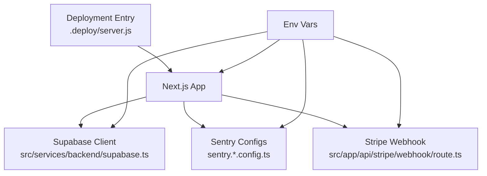
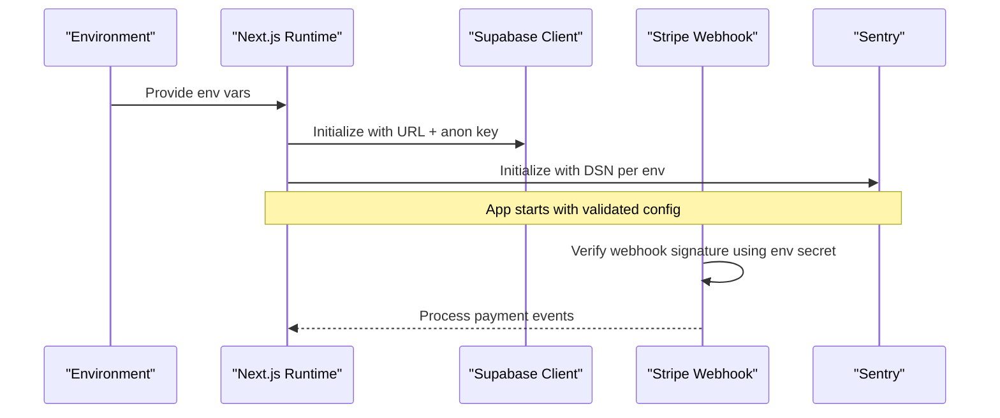
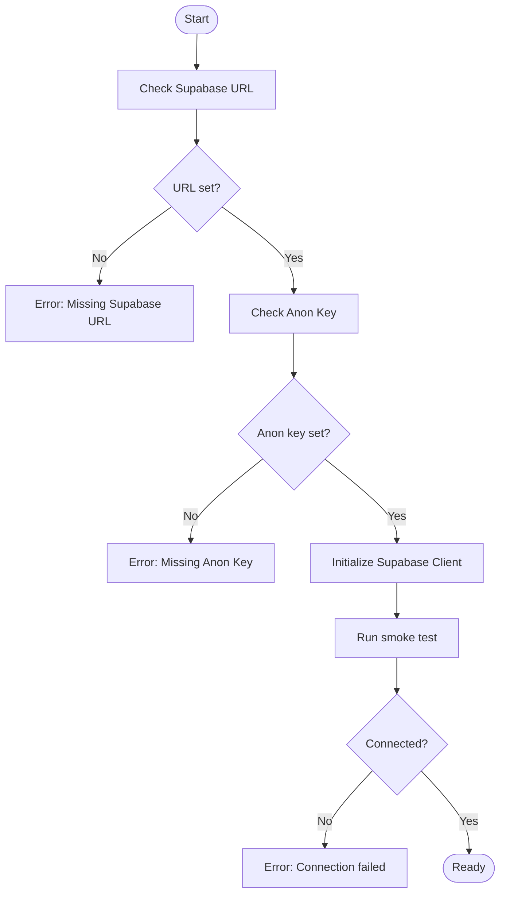
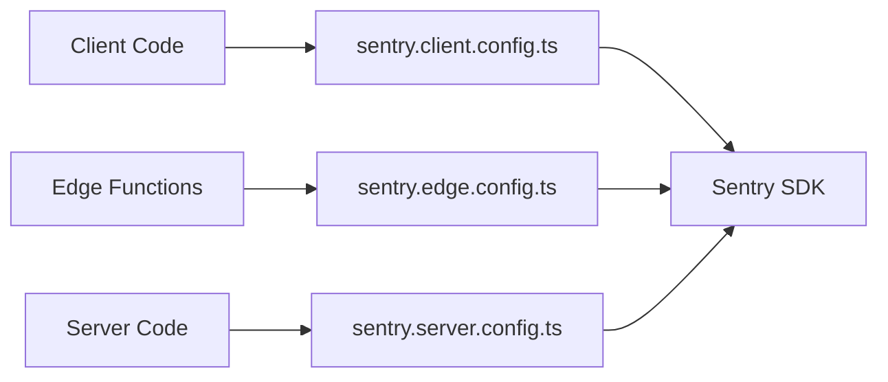
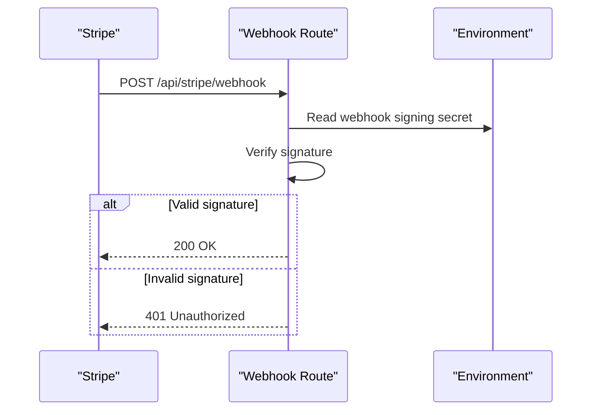
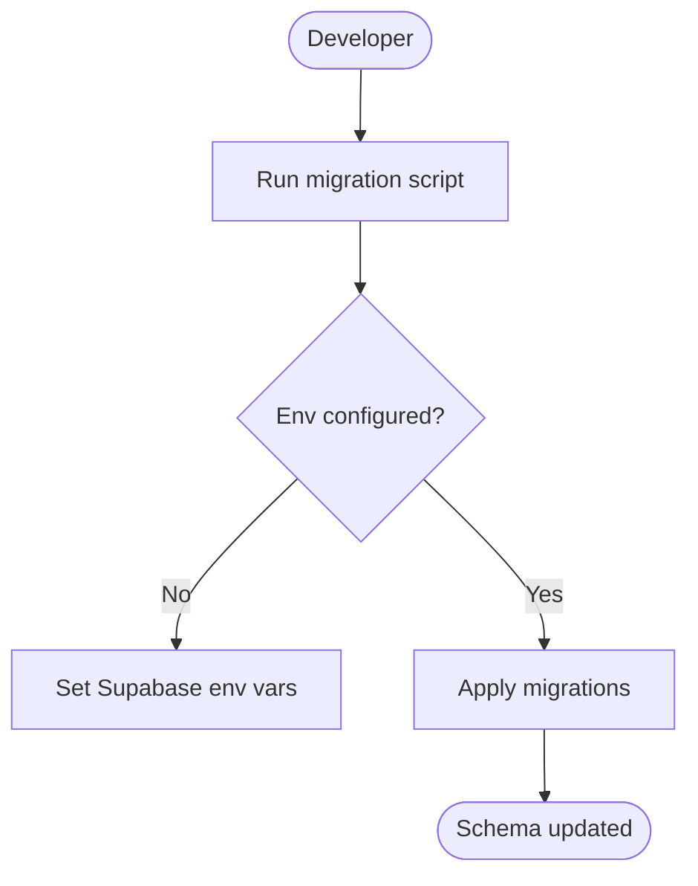
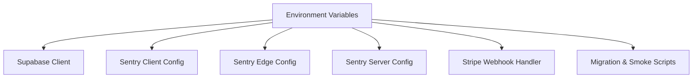

# Environment Configuration

<cite>
**Referenced Files in This Document**
- [README.md](file://README.md)
- [next.config.ts](file://next.config.ts)
- [package.json](file://package.json)
- [supabase/config.toml](file://supabase/config.toml)
- [src/services/backend/supabase.ts](file://src/services/backend/supabase.ts)
- [src/services/backend/config.ts](file://src/services/backend/config.ts)
- [sentry.client.config.ts](file://sentry.client.config.ts)
- [sentry.edge.config.ts](file://sentry.edge.config.ts)
- [sentry.server.config.ts](file://sentry.server.config.ts)
- [src/app/api/stripe/webhook/route.ts](file://src/app/api/stripe/webhook/route.ts)
- [scripts/phase2-smoke-supabase.mjs](file://scripts/phase2-smoke-supabase.mjs)
- [scripts/apply-migrations.mjs](file://scripts/apply-migrations.mjs)
- [.deploy/server.js](file:.deploy/server.js)
</cite>

## Table of Contents
1. Introduction
2. Project Structure
3. Core Components
4. Architecture Overview
5. Detailed Component Analysis
6. Dependency Analysis
7. Performance Considerations
8. Troubleshooting Guide
9. Conclusion
10. Appendices

## Introduction
This document provides comprehensive environment configuration guidance for the Mooday marketplace. It covers required environment variables, Supabase setup, Sentry configuration, external service integrations (Stripe), and environment-specific configurations for development, staging, and production. It also includes security best practices for managing secrets, rotating credentials, controlling access, and troubleshooting common configuration issues with validation procedures.

## Project Structure
The project is a Next.js application that integrates:
- Supabase for authentication, database, storage, and real-time features
- Stripe for payments and webhooks
- Sentry for error tracking across client, edge, and server environments
- A deployment entrypoint for standalone builds

**Diagram sources**
- [src/services/backend/supabase.ts](file://src/services/backend/supabase.ts)
- [sentry.client.config.ts](file://sentry.client.config.ts)
- [sentry.edge.config.ts](file://sentry.edge.config.ts)
- [sentry.server.config.ts](file://sentry.server.config.ts)
- [src/app/api/stripe/webhook/route.ts](file://src/app/api/stripe/webhook/route.ts)
- [.deploy/server.js](file:.deploy/server.js)

**Section sources**
- [README.md](file://README.md)
- [package.json](file://package.json)
- [next.config.ts](file://next.config.ts)
- [.deploy/server.js](file:.deploy/server.js)

## Core Components
- Supabase integration: client initialization and environment-driven configuration
- Sentry integration: per-environment configs for client, edge, and server
- Stripe webhook handler: requires signed request verification via environment secret
- Deployment runtime: Node-based server entry for standalone builds
- Scripts: migration and smoke tests that rely on environment variables

Key responsibilities:
- Load and validate environment variables at startup
- Initialize third-party clients with correct endpoints and keys
- Route requests to appropriate services based on environment

**Section sources**
- [src/services/backend/supabase.ts](file://src/services/backend/supabase.ts)
- [sentry.client.config.ts](file://sentry.client.config.ts)
- [sentry.edge.config.ts](file://sentry.edge.config.ts)
- [sentry.server.config.ts](file://sentry.server.config.ts)
- [src/app/api/stripe/webhook/route.ts](file://src/app/api/stripe/webhook/route.ts)
- [scripts/phase2-smoke-supabase.mjs](file://scripts/phase2-smoke-supabase.mjs)
- [scripts/apply-migrations.mjs](file://scripts/apply-migrations.mjs)
- [.deploy/server.js](file:.deploy/server.js)

## Architecture Overview
The runtime loads environment variables from the hosting platform or local .env files. The Next.js app initializes Supabase and Sentry using these variables. Stripe webhooks are handled by an API route that verifies signatures using a secret from the environment. Migrations and smoke tests use the same environment to connect to Supabase.

**Diagram sources**
- [src/services/backend/supabase.ts](file://src/services/backend/supabase.ts)
- [sentry.client.config.ts](file://sentry.client.config.ts)
- [sentry.edge.config.ts](file://sentry.edge.config.ts)
- [sentry.server.config.ts](file://sentry.server.config.ts)
- [src/app/api/stripe/webhook/route.ts](file://src/app/api/stripe/webhook/route.ts)

## Detailed Component Analysis

### Supabase Configuration
- Purpose: Connect to Supabase for auth, database, storage, and real-time features.
- Environment inputs:
  - Supabase URL
  - Supabase anonymous/public key
  - Optional service role key for privileged operations (server-side only)
- Initialization:
  - Client is created with URL and anon key
  - Service role may be used conditionally on server routes
- Validation:
  - Ensure URL and anon key are present before starting
  - Confirm connectivity via smoke test script

**Diagram sources**
- [src/services/backend/supabase.ts](file://src/services/backend/supabase.ts)
- [scripts/phase2-smoke-supabase.mjs](file://scripts/phase2-smoke-supabase.mjs)

**Section sources**
- [src/services/backend/supabase.ts](file://src/services/backend/supabase.ts)
- [scripts/phase2-smoke-supabase.mjs](file://scripts/phase2-smoke-supabase.mjs)

### Sentry Setup
- Purpose: Capture errors and performance data across client, edge, and server.
- Environment inputs:
  - Sentry DSN for each environment
  - Optional environment name and release identifier
- Initialization:
  - Separate configs for client, edge, and server ensure correct capture context
- Best practices:
  - Set distinct environment values per deployment target
  - Use consistent release identifiers for correlation

**Diagram sources**
- [sentry.client.config.ts](file://sentry.client.config.ts)
- [sentry.edge.config.ts](file://sentry.edge.config.ts)
- [sentry.server.config.ts](file://sentry.server.config.ts)

**Section sources**
- [sentry.client.config.ts](file://sentry.client.config.ts)
- [sentry.edge.config.ts](file://sentry.edge.config.ts)
- [sentry.server.config.ts](file://sentry.server.config.ts)

### Stripe Integration
- Purpose: Handle payments and process webhook events securely.
- Environment inputs:
  - Stripe webhook signing secret
  - Stripe API keys (if used elsewhere in codebase)
- Webhook flow:
  - Incoming request verified against signing secret
  - Events processed after successful verification

**Diagram sources**
- [src/app/api/stripe/webhook/route.ts](file://src/app/api/stripe/webhook/route.ts)

**Section sources**
- [src/app/api/stripe/webhook/route.ts](file://src/app/api/stripe/webhook/route.ts)

### Database Migrations and Seed Data
- Purpose: Apply schema changes and seed data using Supabase CLI or scripts.
- Environment inputs:
  - Supabase URL and anon/service keys
- Workflow:
  - Run migrations to apply SQL changes
  - Optionally seed demo data for development

**Diagram sources**
- [scripts/apply-migrations.mjs](file://scripts/apply-migrations.mjs)

**Section sources**
- [scripts/apply-migrations.mjs](file://scripts/apply-migrations.mjs)

### Deployment Runtime
- Purpose: Serve the Next.js app in standalone mode.
- Environment inputs:
  - Standard Next.js runtime variables
  - Any service-specific variables loaded by the host
- Notes:
  - Ensure all required env vars are injected into the container or platform settings

**Section sources**
- [.deploy/server.js](file:.deploy/server.js)

## Dependency Analysis
- Supabase client depends on environment variables for URL and keys.
- Sentry configs depend on DSN and environment metadata.
- Stripe webhook handler depends on a signing secret.
- Scripts depend on Supabase environment to run migrations and smoke tests.

**Diagram sources**
- [src/services/backend/supabase.ts](file://src/services/backend/supabase.ts)
- [sentry.client.config.ts](file://sentry.client.config.ts)
- [sentry.edge.config.ts](file://sentry.edge.config.ts)
- [sentry.server.config.ts](file://sentry.server.config.ts)
- [src/app/api/stripe/webhook/route.ts](file://src/app/api/stripe/webhook/route.ts)
- [scripts/phase2-smoke-supabase.mjs](file://scripts/phase2-smoke-supabase.mjs)
- [scripts/apply-migrations.mjs](file://scripts/apply-migrations.mjs)

**Section sources**
- [src/services/backend/supabase.ts](file://src/services/backend/supabase.ts)
- [sentry.client.config.ts](file://sentry.client.config.ts)
- [sentry.edge.config.ts](file://sentry.edge.config.ts)
- [sentry.server.config.ts](file://sentry.server.config.ts)
- [src/app/api/stripe/webhook/route.ts](file://src/app/api/stripe/webhook/route.ts)
- [scripts/phase2-smoke-supabase.mjs](file://scripts/phase2-smoke-supabase.mjs)
- [scripts/apply-migrations.mjs](file://scripts/apply-migrations.mjs)

## Performance Considerations
- Keep environment variable loading minimal and centralized to avoid repeated lookups.
- Use connection pooling where applicable (Supabase client handles this).
- Avoid logging sensitive values; sanitize logs before sending to Sentry.
- For high-throughput webhooks, ensure idempotent processing and quick responses.

[No sources needed since this section provides general guidance]

## Troubleshooting Guide

Common issues and resolutions:
- Supabase connection failures
  - Validate Supabase URL and anon key presence
  - Run smoke test to confirm connectivity
  - Check network egress rules and firewall settings
- Sentry not capturing events
  - Verify DSN and environment name in each config file
  - Ensure release identifiers are set consistently
  - Inspect browser console and server logs for initialization errors
- Stripe webhook signature verification fails
  - Confirm webhook signing secret matches the one configured in Stripe dashboard
  - Ensure raw body is read correctly before verification
  - Check time skew between servers if using token-based checks
- Migrations fail
  - Ensure Supabase CLI is authenticated and env vars point to the correct project
  - Review migration SQL for syntax errors
  - Re-run with verbose output to identify failing statements

Validation procedures:
- Health check endpoint can be used to verify runtime readiness
- Smoke tests for Supabase connectivity should pass in CI
- Stripe webhook testing via Stripe CLI or dashboard simulator

**Section sources**
- [scripts/phase2-smoke-supabase.mjs](file://scripts/phase2-smoke-supabase.mjs)
- [src/app/api/stripe/webhook/route.ts](file://src/app/api/stripe/webhook/route.ts)
- [scripts/apply-migrations.mjs](file://scripts/apply-migrations.mjs)

## Conclusion
Properly configuring environment variables is critical for the Mooday marketplace to operate reliably across development, staging, and production. Centralize configuration, validate at startup, enforce least privilege, and automate testing to catch misconfigurations early. Follow the security best practices outlined below to protect secrets and maintain system integrity.

[No sources needed since this section summarizes without analyzing specific files]

## Appendices

### Required Environment Variables
- Supabase
  - URL: Supabase project URL
  - Anon key: Public client key
  - Service role key: Privileged server-side key (use only on server)
- Sentry
  - DSN: Sentry data source name per environment
  - Environment: Distinct value per deployment target
  - Release: Consistent build identifier
- Stripe
  - Webhook signing secret: Secret for verifying incoming webhooks
  - API keys: If used elsewhere in the app
- Next.js and Deployment
  - Standard Next.js runtime variables
  - Any platform-specific variables required by your host

[No sources needed since this section lists variables conceptually]

### Security Best Practices
- Store secrets in a secure vault or platform secret manager
- Rotate secrets regularly and support zero-downtime rotation
- Restrict access to secrets using least privilege principles
- Never log secrets; mask or redact in logs and error reports
- Pin versions for dependencies to reduce supply chain risk
- Use separate environments with isolated credentials

[No sources needed since this section provides general guidance]

### Environment-Specific Configuration
- Development
  - Use local or dev Supabase instance
  - Enable verbose logging locally
  - Use test Stripe keys and sandbox webhooks
- Staging
  - Mirror production configuration closely
  - Use staging-only secrets and domains
  - Run full smoke tests before promotion
- Production
  - Enforce strict environment validation
  - Use production-grade secrets management
  - Monitor with Sentry and alerting

[No sources needed since this section provides general guidance]

### External Service Integrations Checklist
- Supabase
  - Auth providers configured in Supabase dashboard
  - Storage buckets and RLS policies applied
- Stripe
  - Webhook endpoints registered and signed
  - Payment intents and checkout flows tested
- Sentry
  - Projects created per environment
  - Source maps uploaded for accurate stack traces

[No sources needed since this section provides general guidance]