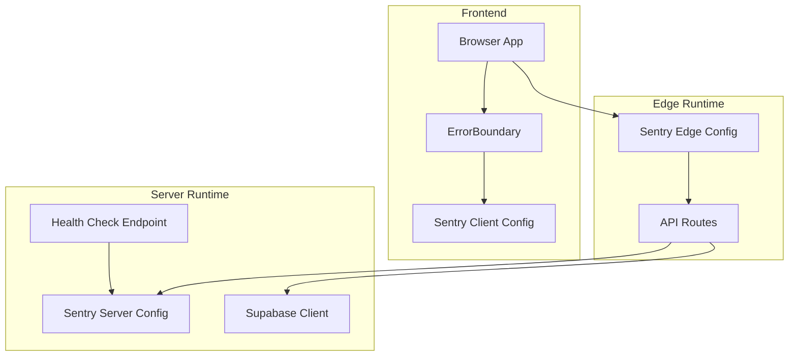
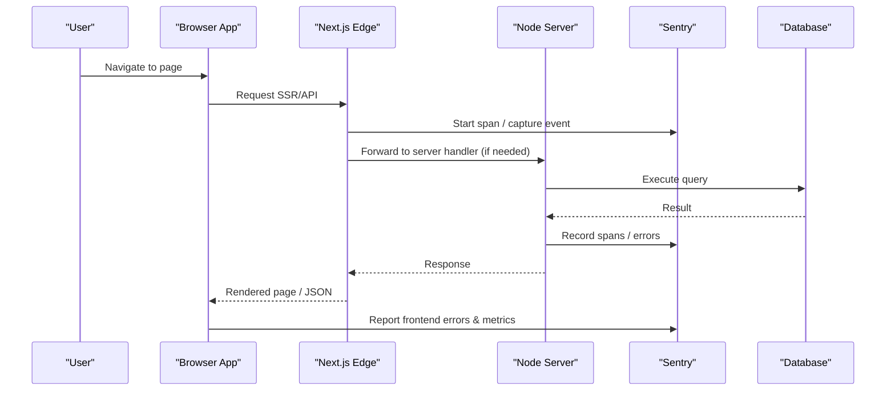
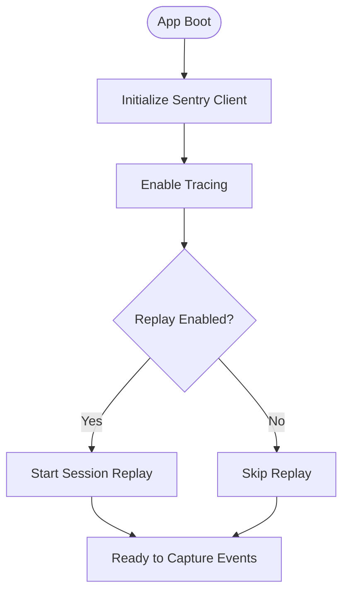
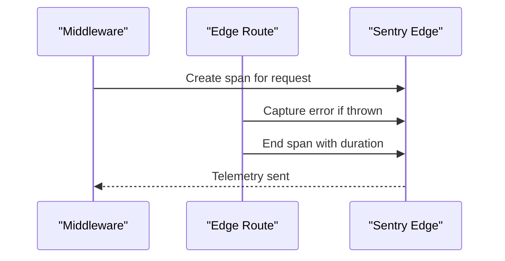
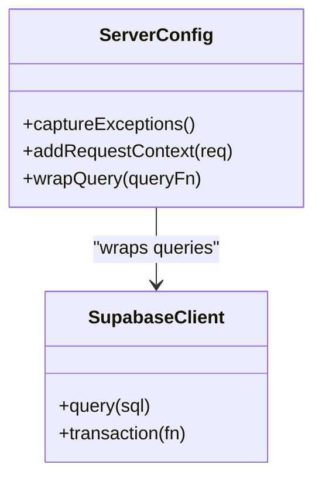
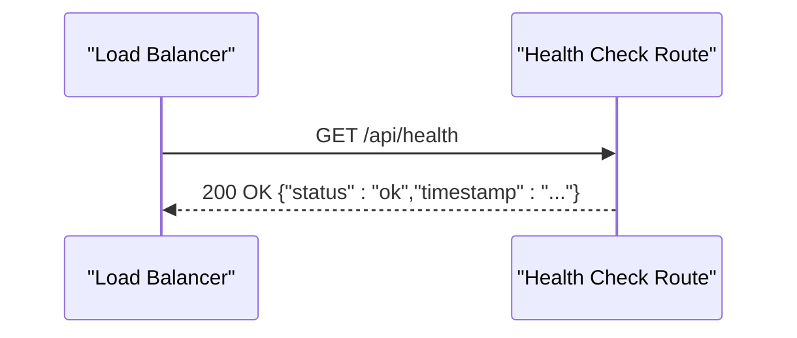
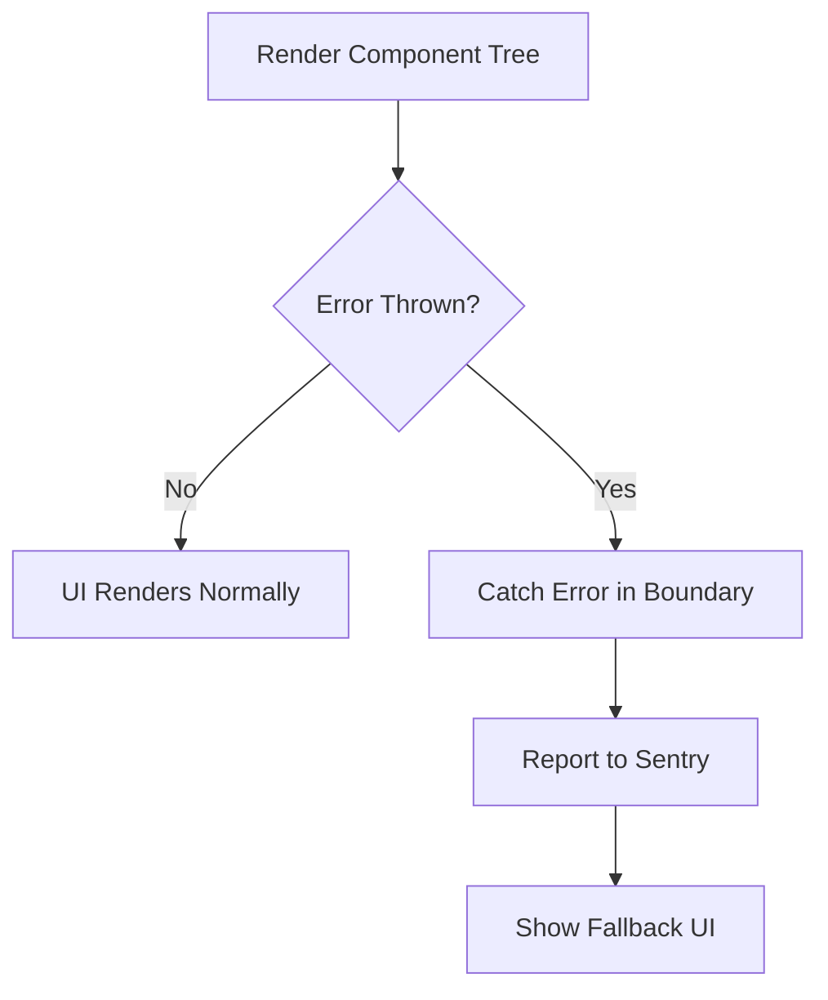
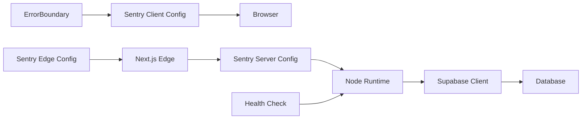

# Monitoring and Logging

<cite>
**Referenced Files in This Document**
- [sentry.client.config.ts](file://sentry.client.config.ts)
- [sentry.edge.config.ts](file://sentry.edge.config.ts)
- [sentry.server.config.ts](file://sentry.server.config.ts)
- [src/app/api/health/route.ts](file://src/app/api/health/route.ts)
- [src/app/api/health/route.test.ts](file://src/app/api/health/route.test.ts)
- [src/components/ErrorBoundary.tsx](file://src/components/ErrorBoundary.tsx)
- [src/services/backend/supabase.ts](file://src/services/backend/supabase.ts)
- [src/app/layout.tsx](file://src/app/layout.tsx)
- [.deploy/server.js](file://.deploy/server.js)
</cite>

## Table of Contents
1. Introduction
2. Project Structure
3. Core Components
4. Architecture Overview
5. Detailed Component Analysis
6. Dependency Analysis
7. Performance Considerations
8. Troubleshooting Guide
9. Conclusion

## Introduction
This document describes the monitoring and logging strategy for the Mooday marketplace, focusing on error tracking with Sentry, health checks, application metrics collection, alerting strategies, log aggregation, structured logging formats, retention policies, performance profiling, memory leak detection, database query monitoring, distributed tracing, API response time monitoring, user experience metrics, and troubleshooting guidance for setup and alert configuration.

## Project Structure
The monitoring and logging capabilities are implemented across:
- Frontend error capture and session replay via Sentry client configuration
- Edge runtime instrumentation for server-side rendering and API routes
- Server-side error capture and telemetry for Node runtime
- Health check endpoint for service readiness and liveness
- Error boundary to catch unhandled UI errors and forward them to Sentry
- Database integration layer for query-level observability
- Application layout for global initialization hooks

**Diagram sources**
- [sentry.client.config.ts:1-200](file://sentry.client.config.ts#L1-L200)
- [sentry.edge.config.ts:1-200](file://sentry.edge.config.ts#L1-L200)
- [sentry.server.config.ts:1-200](file://sentry.server.config.ts#L1-L200)
- [src/app/api/health/route.ts:1-200](file://src/app/api/health/route.ts#L1-L200)
- [src/components/ErrorBoundary.tsx:1-200](file://src/components/ErrorBoundary.tsx#L1-L200)
- [src/services/backend/supabase.ts:1-200](file://src/services/backend/supabase.ts#L1-L200)

**Section sources**
- [sentry.client.config.ts:1-200](file://sentry.client.config.ts#L1-L200)
- [sentry.edge.config.ts:1-200](file://sentry.edge.config.ts#L1-L200)
- [sentry.server.config.ts:1-200](file://sentry.server.config.ts#L1-L200)
- [src/app/api/health/route.ts:1-200](file://src/app/api/health/route.ts#L1-L200)
- [src/components/ErrorBoundary.tsx:1-200](file://src/components/ErrorBoundary.tsx#L1-L200)
- [src/services/backend/supabase.ts:1-200](file://src/services/backend/supabase.ts#L1-L200)

## Core Components
- Sentry client configuration initializes browser-side error capture, performance tracing, and optional session replay features. It sets environment-specific DSN, traces sample rate, and integrations such as React navigation or fetch instrumentation.
- Sentry edge configuration instruments Next.js Edge runtime code paths, capturing errors from middleware and edge API routes, and enabling performance spans for network calls.
- Sentry server configuration captures Node runtime exceptions, unhandled promise rejections, and HTTP request contexts for server-rendered pages and API handlers.
- Health check endpoint exposes a simple GET route returning status and timestamp for load balancers and orchestrators to probe liveness/readiness.
- Error boundary component catches render-time errors in React trees and forwards them to Sentry with context like route, user state, and component stack.
- Supabase client provides database connectivity; query-level monitoring can be enabled through Sentry’s Node SDK or by wrapping queries with timing and error reporting.

Key responsibilities:
- Error capture: client, edge, and server layers ensure full-stack coverage.
- Performance monitoring: tracing is enabled at client and server levels to measure TTFB, page load, and API latency.
- Session replay: when enabled in client config, allows visual reproduction of user sessions that triggered errors.
- Health checks: external systems can verify service availability.
- Observability hooks: layout and services integrate with Sentry to enrich events with user and request context.

**Section sources**
- [sentry.client.config.ts:1-200](file://sentry.client.config.ts#L1-L200)
- [sentry.edge.config.ts:1-200](file://sentry.edge.config.ts#L1-L200)
- [sentry.server.config.ts:1-200](file://sentry.server.config.ts#L1-L200)
- [src/app/api/health/route.ts:1-200](file://src/app/api/health/route.ts#L1-L200)
- [src/components/ErrorBoundary.tsx:1-200](file://src/components/ErrorBoundary.tsx#L1-L200)
- [src/services/backend/supabase.ts:1-200](file://src/services/backend/supabase.ts#L1-L200)

## Architecture Overview
The monitoring architecture spans three runtimes:
- Browser: Captures JS errors, navigation changes, and performance metrics; optionally records session replays.
- Edge: Captures errors and spans for edge functions and middleware; measures network I/O and SSR timings.
- Server: Captives Node exceptions, HTTP requests, and database interactions; correlates errors with request IDs and user context.

**Diagram sources**
- [sentry.client.config.ts:1-200](file://sentry.client.config.ts#L1-L200)
- [sentry.edge.config.ts:1-200](file://sentry.edge.config.ts#L1-L200)
- [sentry.server.config.ts:1-200](file://sentry.server.config.ts#L1-L200)
- [src/app/api/health/route.ts:1-200](file://src/app/api/health/route.ts#L1-L200)
- [src/services/backend/supabase.ts:1-200](file://src/services/backend/supabase.ts#L1-L200)

## Detailed Component Analysis

### Sentry Client Configuration
- Purpose: Initialize browser-side error capture, performance tracing, and optional session replay.
- Key behaviors:
  - Sets DSN and environment tags for filtering.
  - Enables tracing with appropriate sample rates.
  - Integrates with routing and network instrumentation to capture navigation and fetch timings.
  - Optionally enables session replay to record user interactions around errors.
- Best practices:
  - Use environment variables for DSN and sampling rates.
  - Tag events with user ID and feature flags where applicable.
  - Keep replay enabled only in non-production or opt-in environments due to privacy considerations.

**Diagram sources**
- [sentry.client.config.ts:1-200](file://sentry.client.config.ts#L1-L200)

**Section sources**
- [sentry.client.config.ts:1-200](file://sentry.client.config.ts#L1-L200)

### Sentry Edge Configuration
- Purpose: Instrument Edge runtime code paths for error capture and performance spans.
- Key behaviors:
  - Captures errors thrown in middleware and edge API routes.
  - Measures network calls and SSR timings via spans.
  - Correlates events with request IDs and headers.
- Integration points:
  - Next.js Edge runtime automatically uses this configuration for edge functions.
  - Can wrap custom edge utilities to add spans.

**Diagram sources**
- [sentry.edge.config.ts:1-200](file://sentry.edge.config.ts#L1-L200)

**Section sources**
- [sentry.edge.config.ts:1-200](file://sentry.edge.config.ts#L1-L200)

### Sentry Server Configuration
- Purpose: Capture Node runtime errors, unhandled exceptions, and HTTP request contexts.
- Key behaviors:
  - Records exceptions and promise rejections.
  - Enriches events with request metadata (headers, URL, method).
  - Adds user context when available.
- Database monitoring:
  - Wrap Supabase queries with timing and error reporting to track slow queries and failures.
  - Use transaction spans to visualize multi-step operations.

**Diagram sources**
- [sentry.server.config.ts:1-200](file://sentry.server.config.ts#L1-L200)
- [src/services/backend/supabase.ts:1-200](file://src/services/backend/supabase.ts#L1-L200)

**Section sources**
- [sentry.server.config.ts:1-200](file://sentry.server.config.ts#L1-L200)
- [src/services/backend/supabase.ts:1-200](file://src/services/backend/supabase.ts#L1-L200)

### Health Check Endpoint
- Purpose: Provide a lightweight GET endpoint for liveness/readiness probes.
- Behavior:
  - Returns HTTP 200 with a JSON payload containing status and timestamp.
  - Can be extended to include dependency checks (e.g., database connectivity).
- Usage:
  - Configure load balancers and orchestrators to call this endpoint periodically.
  - Alert if consecutive failures exceed a threshold.

**Diagram sources**
- [src/app/api/health/route.ts:1-200](file://src/app/api/health/route.ts#L1-L200)

**Section sources**
- [src/app/api/health/route.ts:1-200](file://src/app/api/health/route.ts#L1-L200)
- [src/app/api/health/route.test.ts:1-200](file://src/app/api/health/route.test.ts#L1-L200)

### Error Boundary Component
- Purpose: Catch unhandled rendering errors in React component trees and report them to Sentry.
- Behavior:
  - Captures error objects and component stacks.
  - Attaches contextual data such as current route and user state.
  - Provides fallback UI to maintain app stability.
- Integration:
  - Wraps critical sections of the UI to isolate failures.
  - Ensures errors do not crash the entire application.

**Diagram sources**
- [src/components/ErrorBoundary.tsx:1-200](file://src/components/ErrorBoundary.tsx#L1-L200)

**Section sources**
- [src/components/ErrorBoundary.tsx:1-200](file://src/components/ErrorBoundary.tsx#L1-L200)

### Application Layout Initialization
- Purpose: Ensure global monitoring hooks are initialized early in the app lifecycle.
- Behavior:
  - Initializes Sentry in both client and server contexts as needed.
  - Sets up global error handlers and performance measurement hooks.
  - Injects common context (user, environment) into events.

**Section sources**
- [src/app/layout.tsx:1-200](file://src/app/layout.tsx#L1-L200)

### Deployment Server Entry
- Purpose: Serve the Next.js application in standalone mode and expose runtime behavior for monitoring.
- Behavior:
  - Starts the server process that runs the built application.
  - Can be used to attach process-level metrics and logs.

**Section sources**
- [.deploy/server.js:1-200](file://.deploy/server.js#L1-L200)

## Dependency Analysis
Monitoring components depend on each other and on external services:
- Client config depends on browser APIs and Sentry SDK.
- Edge config depends on Next.js Edge runtime and Sentry SDK.
- Server config depends on Node runtime and Sentry SDK.
- Health check depends on HTTP framework and optionally on dependency checks.
- Error boundary depends on React and Sentry client.
- Supabase client depends on database credentials and network.

**Diagram sources**
- [sentry.client.config.ts:1-200](file://sentry.client.config.ts#L1-L200)
- [sentry.edge.config.ts:1-200](file://sentry.edge.config.ts#L1-L200)
- [sentry.server.config.ts:1-200](file://sentry.server.config.ts#L1-L200)
- [src/app/api/health/route.ts:1-200](file://src/app/api/health/route.ts#L1-L200)
- [src/components/ErrorBoundary.tsx:1-200](file://src/components/ErrorBoundary.tsx#L1-L200)
- [src/services/backend/supabase.ts:1-200](file://src/services/backend/supabase.ts#L1-L200)

**Section sources**
- [sentry.client.config.ts:1-200](file://sentry.client.config.ts#L1-L200)
- [sentry.edge.config.ts:1-200](file://sentry.edge.config.ts#L1-L200)
- [sentry.server.config.ts:1-200](file://sentry.server.config.ts#L1-L200)
- [src/app/api/health/route.ts:1-200](file://src/app/api/health/route.ts#L1-L200)
- [src/components/ErrorBoundary.tsx:1-200](file://src/components/ErrorBoundary.tsx#L1-L200)
- [src/services/backend/supabase.ts:1-200](file://src/services/backend/supabase.ts#L1-L200)

## Performance Considerations
- Sampling rates:
  - Adjust client and server tracing sample rates to balance visibility and cost.
  - Use targeted sampling for high-traffic endpoints.
- Network overhead:
  - Minimize payload size by excluding sensitive data from events.
  - Batch events where possible using SDK defaults.
- Database queries:
  - Monitor slow queries and add indexes based on observed patterns.
  - Use connection pooling and query caching to reduce load.
- Memory usage:
  - Profile Node processes regularly to detect leaks.
  - Set memory limits and restart policies in deployment.
- Replay privacy:
  - Enable session replay selectively and mask sensitive fields.

[No sources needed since this section provides general guidance]

## Troubleshooting Guide

### Monitoring Setup Issues
- Symptoms:
  - No events appear in Sentry dashboard.
  - Spans missing for certain routes.
- Checks:
  - Verify DSN and environment variables are set correctly in client, edge, and server configs.
  - Confirm Sentry SDK versions are compatible with Next.js and Node versions.
  - Ensure network access to Sentry ingestion endpoints is allowed.
- Actions:
  - Add console logs around initialization to confirm SDK startup.
  - Temporarily increase debug verbosity to inspect SDK behavior.

**Section sources**
- [sentry.client.config.ts:1-200](file://sentry.client.config.ts#L1-L200)
- [sentry.edge.config.ts:1-200](file://sentry.edge.config.ts#L1-L200)
- [sentry.server.config.ts:1-200](file://sentry.server.config.ts#L1-L200)

### Health Check Failures
- Symptoms:
  - Load balancer reports unhealthy status.
  - Alerts trigger for endpoint downtime.
- Checks:
  - Validate HTTP response code and payload structure.
  - Extend health check to include dependency checks (database, cache).
- Actions:
  - Implement readiness gates that wait for dependencies to be available.
  - Add retry logic in orchestrators before marking service down.

**Section sources**
- [src/app/api/health/route.ts:1-200](file://src/app/api/health/route.ts#L1-L200)
- [src/app/api/health/route.test.ts:1-200](file://src/app/api/health/route.test.ts#L1-L200)

### Error Boundary Not Reporting
- Symptoms:
  - UI shows fallback but no events in Sentry.
  - Errors occur outside boundary scope.
- Checks:
  - Ensure boundary wraps top-level components.
  - Verify client config is initialized before rendering.
- Actions:
  - Add global error handler to catch uncaught errors.
  - Log boundary activation for debugging.

**Section sources**
- [src/components/ErrorBoundary.tsx:1-200](file://src/components/ErrorBoundary.tsx#L1-L200)
- [sentry.client.config.ts:1-200](file://sentry.client.config.ts#L1-L200)

### Database Query Monitoring
- Symptoms:
  - Slow queries detected but not attributed.
  - Failures not captured with context.
- Checks:
  - Confirm Supabase client is wrapped with timing and error reporting.
  - Verify transaction spans are created for multi-step operations.
- Actions:
  - Add query-level tags (table, operation) for better filtering.
  - Alert on query duration thresholds.

**Section sources**
- [src/services/backend/supabase.ts:1-200](file://src/services/backend/supabase.ts#L1-L200)
- [sentry.server.config.ts:1-200](file://sentry.server.config.ts#L1-L200)

### Alerting Strategies
- Recommendations:
  - Error rate spikes: Alert when error count exceeds baseline within a time window.
  - Latency SLO breaches: Alert when p95/p99 response times exceed thresholds.
  - Health check failures: Alert after consecutive failures over a short period.
  - Database slow queries: Alert when query duration exceeds configured limit.
- Implementation:
  - Use Sentry alerts for error rate and latency anomalies.
  - Integrate with external alerting systems (e.g., PagerDuty, Slack) for escalation.
  - Define clear runbooks for each alert type.

[No sources needed since this section provides general guidance]

### Log Aggregation and Retention
- Structured logging format:
  - Use JSON lines with fields: timestamp, level, message, trace_id, user_id, endpoint, duration_ms.
  - Include correlation IDs to link logs with Sentry events.
- Aggregation:
  - Ship logs to a centralized system (e.g., cloud logging service) via stdout/stderr.
  - Parse and index key fields for fast querying.
- Retention policies:
  - Hot storage: Short retention (e.g., 7–30 days) for active investigation.
  - Cold storage: Long-term archival (e.g., 90–365 days) for compliance and audits.
  - Apply lifecycle rules to move logs between tiers automatically.

[No sources needed since this section provides general guidance]

### Distributed Tracing and API Response Time Monitoring
- Distributed tracing:
  - Propagate trace IDs across client, edge, and server boundaries.
  - Tag spans with operation names and parameters (sanitized).
- API response time monitoring:
  - Measure end-to-end latency from client to server.
  - Track per-endpoint percentiles and error rates.
  - Alert on regressions in latency or error rates.

[No sources needed since this section provides general guidance]

### User Experience Metrics
- Core Web Vitals:
  - Track LCP, FID, CLS via client SDK to measure perceived performance.
- Session insights:
  - Use session replay sparingly to understand problematic flows.
  - Correlate UX metrics with error events to prioritize fixes.

[No sources needed since this section provides general guidance]

## Conclusion
The Mooday marketplace implements comprehensive monitoring and logging across client, edge, and server runtimes using Sentry for error tracking, performance monitoring, and optional session replay. A health check endpoint supports operational reliability, while structured logging and alerting strategies enable proactive issue detection. Database query monitoring and distributed tracing provide deep insights into performance and reliability. Following the troubleshooting guide ensures robust setup and maintenance of the monitoring pipeline.