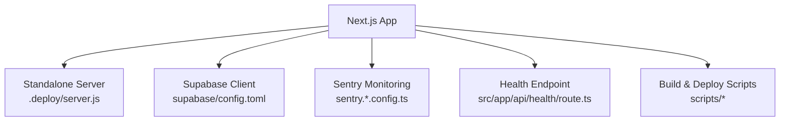
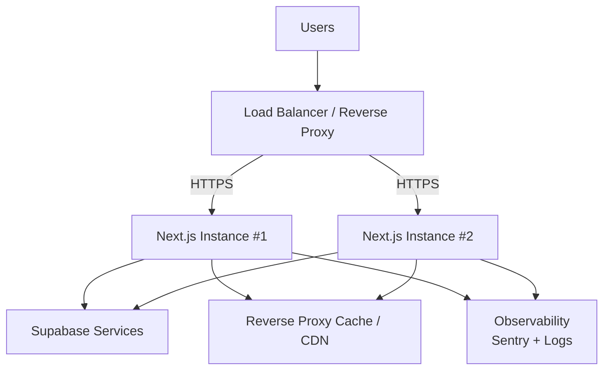
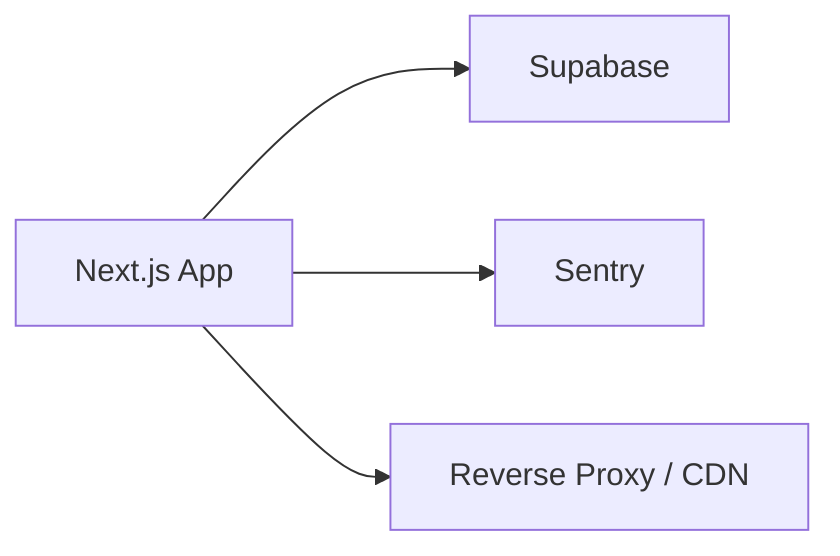

# Production Deployment

<cite>
**Referenced Files in This Document**
- [package.json](file://package.json)
- [next.config.ts](file://next.config.ts)
- [.deploy/server.js](file://.deploy/server.js)
- [docs/DEPLOYMENT_CPANEL.md](file://docs/DEPLOYMENT_CPANEL.md)
- [supabase/config.toml](file://supabase/config.toml)
- [sentry.server.config.ts](file://sentry.server.config.ts)
- [sentry.edge.config.ts](file://sentry.edge.config.ts)
- [sentry.client.config.ts](file://sentry.client.config.ts)
- [scripts/build-standalone.sh](file://scripts/build-standalone.sh)
- [src/app/api/health/route.ts](file://src/app/api/health/route.ts)
</cite>

## Table of Contents
1. [Introduction](#introduction)
2. [Project Structure](#project-structure)
3. [Core Components](#core-components)
4. [Architecture Overview](#architecture-overview)
5. [Detailed Component Analysis](#detailed-component-analysis)
6. [Dependency Analysis](#dependency-analysis)
7. [Performance Considerations](#performance-considerations)
8. [Troubleshooting Guide](#troubleshooting-guide)
9. [Conclusion](#conclusion)
10. [Appendices](#appendices)

## Introduction
This document provides production deployment guidance for the Mooday marketplace. It covers server setup, SSL certificate configuration, domain management, containerization strategies, load balancing, scaling considerations, deployment verification, health monitoring, performance tuning, disaster recovery, backup strategies, incident response, security hardening, firewall configuration, compliance requirements, step-by-step deployment guides, and troubleshooting procedures for common production issues.

## Project Structure
The repository is a Next.js application with:
- A standalone server entrypoint under .deploy for Node-based hosting
- Supabase migrations and configuration for database and auth
- Sentry configuration for error tracking across client, edge, and server contexts
- Scripts for building and smoke testing
- Health endpoint for liveness/readiness checks
- Documentation for cPanel deployment and other operational topics

**Diagram sources**
- [.deploy/server.js:1-200](file://.deploy/server.js#L1-L200)
- [supabase/config.toml:1-200](file://supabase/config.toml#L1-L200)
- [sentry.server.config.ts:1-200](file://sentry.server.config.ts#L1-L200)
- [sentry.edge.config.ts:1-200](file://sentry.edge.config.ts#L1-L200)
- [sentry.client.config.ts:1-200](file://sentry.client.config.ts#L1-L200)
- [src/app/api/health/route.ts:1-200](file://src/app/api/health/route.ts#L1-L200)
- [scripts/build-standalone.sh:1-200](file://scripts/build-standalone.sh#L1-L200)

**Section sources**
- [package.json:1-200](file://package.json#L1-L200)
- [next.config.ts:1-200](file://next.config.ts#L1-L200)
- [.deploy/server.js:1-200](file://.deploy/server.js#L1-L200)
- [supabase/config.toml:1-200](file://supabase/config.toml#L1-L200)
- [sentry.server.config.ts:1-200](file://sentry.server.config.ts#L1-L200)
- [sentry.edge.config.ts:1-200](file://sentry.edge.config.ts#L1-L200)
- [sentry.client.config.ts:1-200](file://sentry.client.config.ts#L1-L200)
- [scripts/build-standalone.sh:1-200](file://scripts/build-standalone.sh#L1-L200)
- [src/app/api/health/route.ts:1-200](file://src/app/api/health/route.ts#L1-L200)

## Core Components
- Standalone server runtime for Node hosting environments
- Supabase integration for authentication, database, storage, and realtime features
- Sentry integration for error and performance monitoring across client, edge, and server
- Health check API for load balancer probes and orchestration systems
- Build scripts to produce standalone artifacts suitable for containerized or VM deployments

Key responsibilities:
- Serve Next.js app efficiently in production
- Connect securely to Supabase services
- Emit telemetry via Sentry
- Expose health endpoints for uptime monitoring

**Section sources**
- [.deploy/server.js:1-200](file://.deploy/server.js#L1-L200)
- [supabase/config.toml:1-200](file://supabase/config.toml#L1-L200)
- [sentry.server.config.ts:1-200](file://sentry.server.config.ts#L1-L200)
- [sentry.edge.config.ts:1-200](file://sentry.edge.config.ts#L1-L200)
- [sentry.client.config.ts:1-200](file://sentry.client.config.ts#L1-L200)
- [src/app/api/health/route.ts:1-200](file://src/app/api/health/route.ts#L1-L200)

## Architecture Overview
Production architecture typically includes:
- Reverse proxy (e.g., Nginx/Traefik) terminating TLS and routing traffic
- One or more Next.js instances behind a load balancer
- Supabase managed services (database, auth, storage, realtime)
- Observability stack (Sentry, logs, metrics)
- CI/CD pipeline producing build artifacts and deploying to target environment

[No sources needed since this diagram shows conceptual workflow, not actual code structure]

## Detailed Component Analysis

### Server Runtime and Entrypoint
- The standalone server entrypoint runs the built Next.js app in a Node environment.
- It should be configured with process managers (systemd, PM2) or orchestrators (Kubernetes, ECS).
- Environment variables must include Supabase credentials and feature flags.

Operational notes:
- Use a process manager to auto-restart on failure
- Set appropriate worker count based on CPU cores
- Ensure file descriptors and memory limits are tuned

**Section sources**
- [.deploy/server.js:1-200](file://.deploy/server.js#L1-L200)
- [package.json:1-200](file://package.json#L1-L200)

### Supabase Integration
- Database schema and migrations are versioned under supabase/migrations
- Supabase client configuration is defined in supabase/config.toml
- Authentication templates exist for email flows

Deployment steps:
- Apply migrations to your Supabase project before deploying the app
- Configure environment variables for Supabase URL and anon/public keys
- Restrict access using Supabase policies and service roles as needed

**Section sources**
- [supabase/config.toml:1-200](file://supabase/config.toml#L1-L200)

### Monitoring and Error Tracking
- Sentry is configured for server, edge, and client contexts
- Use Sentry to capture errors, performance traces, and release metadata
- Configure environment-specific DSNs per deployment

Best practices:
- Tag events with environment, version, and user context
- Set up alerts for error rate spikes and latency regressions

**Section sources**
- [sentry.server.config.ts:1-200](file://sentry.server.config.ts#L1-L200)
- [sentry.edge.config.ts:1-200](file://sentry.edge.config.ts#L1-L200)
- [sentry.client.config.ts:1-200](file://sentry.client.config.ts#L1-L200)

### Health Check Endpoint
- A dedicated health route exposes readiness/liveness status
- Load balancers and orchestrators use this to route traffic only to healthy instances

Implementation guidance:
- Return HTTP 200 when all critical dependencies are reachable
- Include dependency checks (e.g., Supabase connectivity)
- Implement separate readiness vs liveness semantics if needed

**Section sources**
- [src/app/api/health/route.ts:1-200](file://src/app/api/health/route.ts#L1-L200)

### Build and Packaging
- Build script produces standalone artifacts suitable for containers or VMs
- Use immutable artifacts in CI/CD; promote builds across environments

Recommendations:
- Pin dependencies and lock versions
- Store build artifacts in a registry or artifact store
- Validate outputs with smoke tests before promotion

**Section sources**
- [scripts/build-standalone.sh:1-200](file://scripts/build-standalone.sh#L1-L200)
- [package.json:1-200](file://package.json#L1-L200)

### cPanel Deployment Notes
- The repository includes cPanel-specific deployment guidance
- Follow provider instructions for Node.js apps, environment variables, and domains

**Section sources**
- [docs/DEPLOYMENT_CPANEL.md:1-200](file://docs/DEPLOYMENT_CPANEL.md#L1-L200)

## Dependency Analysis
External dependencies and integrations:
- Supabase services (database, auth, storage, realtime)
- Sentry for observability
- Optional CDN/reverse proxy for caching and TLS termination

**Diagram sources**
- [supabase/config.toml:1-200](file://supabase/config.toml#L1-L200)
- [sentry.server.config.ts:1-200](file://sentry.server.config.ts#L1-L200)
- [sentry.edge.config.ts:1-200](file://sentry.edge.config.ts#L1-L200)
- [sentry.client.config.ts:1-200](file://sentry.client.config.ts#L1-L200)

**Section sources**
- [supabase/config.toml:1-200](file://supabase/config.toml#L1-L200)
- [sentry.server.config.ts:1-200](file://sentry.server.config.ts#L1-L200)
- [sentry.edge.config.ts:1-200](file://sentry.edge.config.ts#L1-L200)
- [sentry.client.config.ts:1-200](file://sentry.client.config.ts#L1-L200)

## Performance Considerations
- Enable compression and caching at the reverse proxy layer
- Use a CDN for static assets and images
- Tune Next.js server settings for concurrency and memory
- Monitor Supabase connection pools and query performance
- Use Sentry performance tracing to identify bottlenecks
- Scale horizontally by adding more instances behind the load balancer

[No sources needed since this section provides general guidance]

## Troubleshooting Guide
Common issues and resolutions:
- Health endpoint returns non-200: verify Supabase connectivity and environment variables
- High error rates: review Sentry dashboards and set alert thresholds
- Slow responses: analyze traces in Sentry, optimize queries, enable caching
- Deployment failures: validate build artifacts and environment variable injection

Verification checklist:
- Health endpoint responds 200
- HTTPS terminates correctly at the reverse proxy
- Supabase migrations applied successfully
- Sentry captures events in the correct environment
- Smoke tests pass end-to-end

**Section sources**
- [src/app/api/health/route.ts:1-200](file://src/app/api/health/route.ts#L1-L200)
- [sentry.server.config.ts:1-200](file://sentry.server.config.ts#L1-L200)
- [sentry.edge.config.ts:1-200](file://sentry.edge.config.ts#L1-L200)
- [sentry.client.config.ts:1-200](file://sentry.client.config.ts#L1-L200)

## Conclusion
Deploying Mooday in production involves configuring a secure reverse proxy, running multiple Next.js instances behind a load balancer, integrating Supabase and Sentry, and establishing robust monitoring, scaling, and disaster recovery processes. Follow the step-by-step guides below to ensure a reliable and performant production environment.

[No sources needed since this section summarizes without analyzing specific files]

## Appendices

### Step-by-Step Deployment Guide

#### 1. Prepare Environment Variables
- Set Supabase URL and keys
- Configure Sentry DSNs per environment
- Define any feature flags or third-party credentials

[No sources needed since this section provides general guidance]

#### 2. Build Artifacts
- Run the build script to generate standalone artifacts
- Validate outputs and run smoke tests

**Section sources**
- [scripts/build-standalone.sh:1-200](file://scripts/build-standalone.sh#L1-L200)
- [package.json:1-200](file://package.json#L1-L200)

#### 3. Deploy to Target Platform
- For VMs: install Node runtime, configure process manager, set env vars, start service
- For containers: build image, push to registry, deploy with orchestrator
- For cPanel: follow provider-specific instructions

**Section sources**
- [docs/DEPLOYMENT_CPANEL.md:1-200](file://docs/DEPLOYMENT_CPANEL.md#L1-L200)

#### 4. Configure Reverse Proxy and SSL
- Terminate TLS at the reverse proxy
- Route traffic to Next.js instances
- Enable HTTP/2 and caching headers

[No sources needed since this section provides general guidance]

#### 5. Verify Deployment
- Confirm health endpoint returns 200
- Test core user flows
- Validate Sentry ingestion

**Section sources**
- [src/app/api/health/route.ts:1-200](file://src/app/api/health/route.ts#L1-L200)
- [sentry.server.config.ts:1-200](file://sentry.server.config.ts#L1-L200)

### SSL Certificate Configuration
- Obtain certificates from a trusted CA or ACME provider
- Configure reverse proxy to terminate TLS
- Enforce HTTPS and HSTS

[No sources needed since this section provides general guidance]

### Domain Management
- Point DNS records to your load balancer or CDN
- Configure CNAME or A records as required
- Manage subdomains for staging and production

[No sources needed since this section provides general guidance]

### Containerization Strategies
- Use multi-stage Dockerfiles to minimize image size
- Pin base images and dependencies
- Run as non-root user
- Inject secrets via environment variables or secret managers

[No sources needed since this section provides general guidance]

### Load Balancing Configuration
- Use health checks to route traffic only to healthy instances
- Configure sticky sessions if necessary
- Set timeouts and retry policies appropriately

[No sources needed since this section provides general guidance]

### Scaling Considerations
- Horizontal scaling by adding instances
- Vertical scaling by increasing instance resources
- Auto-scaling policies based on CPU, memory, or request rate

[No sources needed since this section provides general guidance]

### Deployment Verification Procedures
- Health endpoint checks
- End-to-end smoke tests
- Synthetic transactions for critical paths

**Section sources**
- [src/app/api/health/route.ts:1-200](file://src/app/api/health/route.ts#L1-L200)

### Health Monitoring
- Expose readiness and liveness endpoints
- Integrate with external monitoring systems
- Alert on error rates, latency, and availability

**Section sources**
- [src/app/api/health/route.ts:1-200](file://src/app/api/health/route.ts#L1-L200)
- [sentry.server.config.ts:1-200](file://sentry.server.config.ts#L1-L200)

### Performance Tuning
- Optimize Next.js server concurrency and memory
- Enable compression and caching at the reverse proxy
- Use CDN for static assets and media
- Monitor Supabase query performance and indexes

[No sources needed since this section provides general guidance]

### Disaster Recovery Planning
- Define RTO/RPO targets
- Automate backups and restore drills
- Maintain runbooks for common failure scenarios

[No sources needed since this section provides general guidance]

### Backup Strategies
- Back up Supabase database regularly
- Version control migrations and configurations
- Store backups offsite with encryption

[No sources needed since this section provides general guidance]

### Incident Response Procedures
- Establish escalation paths and on-call rotations
- Use Sentry alerts and dashboards for detection
- Perform post-incident reviews and update runbooks

[No sources needed since this section provides general guidance]

### Security Hardening
- Enforce HTTPS and strong cipher suites
- Rotate secrets regularly
- Restrict network access to internal services
- Apply least privilege to service accounts

[No sources needed since this section provides general guidance]

### Firewall Configuration
- Allow only necessary ports (e.g., 443 for HTTPS)
- Block direct access to databases and caches
- Use private networking for inter-service communication

[No sources needed since this section provides general guidance]

### Compliance Requirements
- Ensure data protection and privacy controls
- Audit logging and retention policies
- Align with applicable regulations (e.g., GDPR, PCI where relevant)

[No sources needed since this section provides general guidance]

### Common Production Issues and Resolutions
- Health endpoint failing: check environment variables and Supabase connectivity
- High error rates: investigate Sentry traces and recent changes
- Slow responses: enable caching, optimize queries, scale horizontally
- Deployment rollbacks: use immutable artifacts and blue/green or rolling updates

**Section sources**
- [src/app/api/health/route.ts:1-200](file://src/app/api/health/route.ts#L1-L200)
- [sentry.server.config.ts:1-200](file://sentry.server.config.ts#L1-L200)