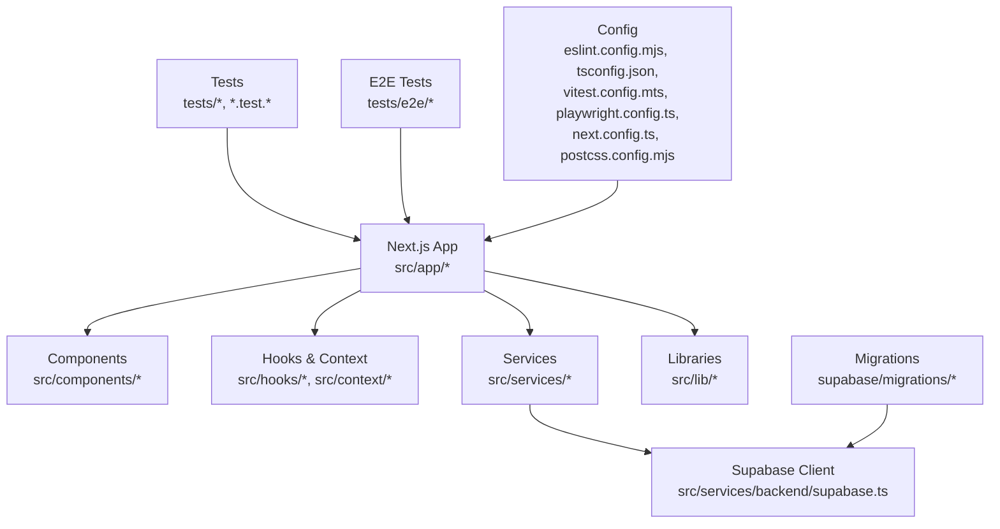
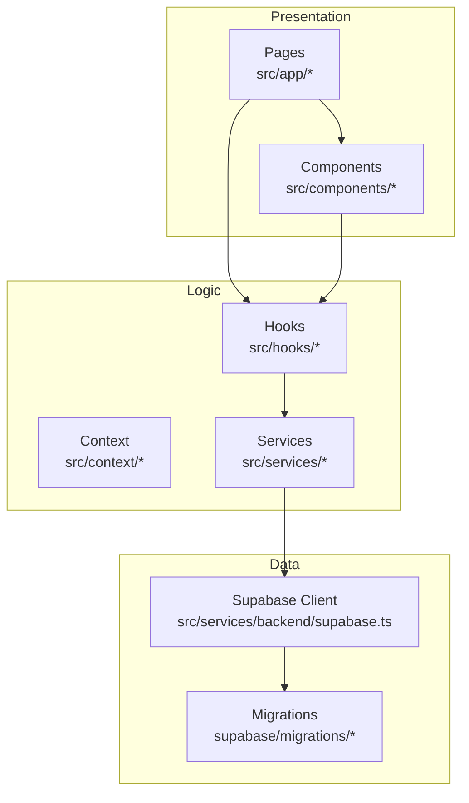
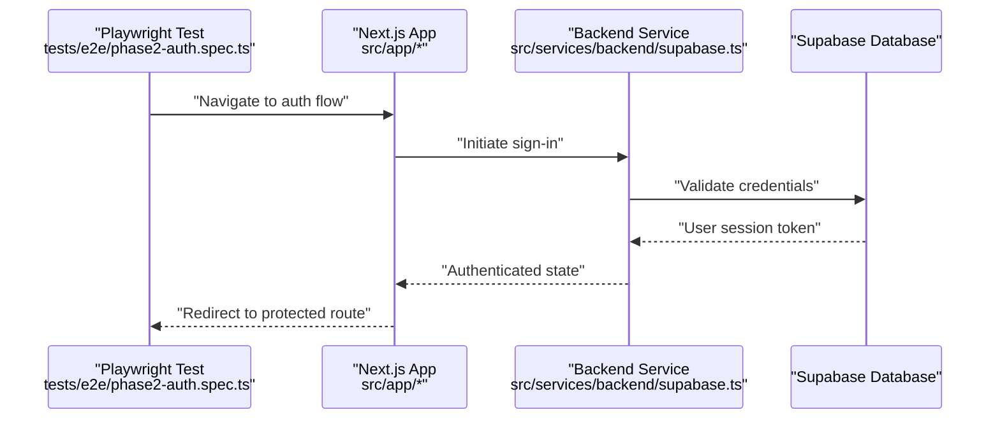
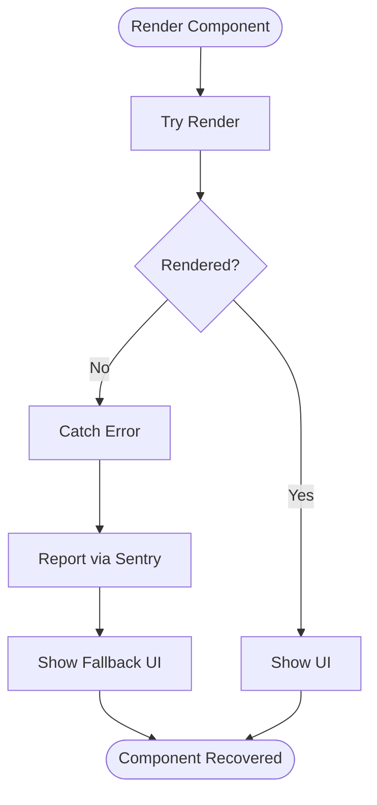
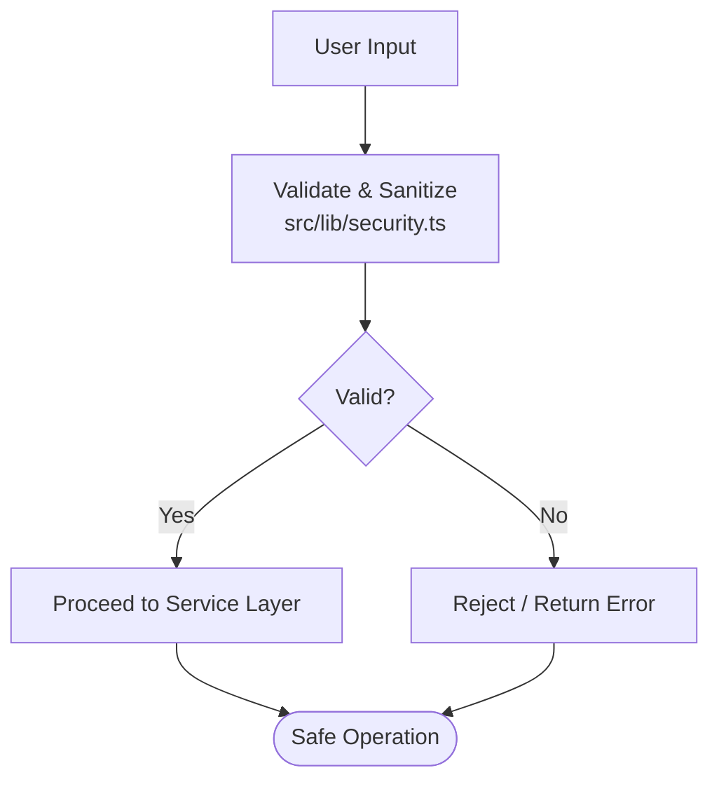
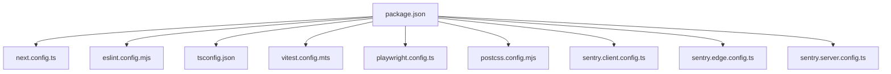

# Developer Guidelines

<cite>
**Referenced Files in This Document**
- [package.json](file://package.json)
- [tsconfig.json](file://tsconfig.json)
- [eslint.config.mjs](file://eslint.config.mjs)
- [vitest.config.mts](file://vitest.config.mts)
- [vitest.setup.ts](file://vitest.setup.ts)
- [playwright.config.ts](file://playwright.config.ts)
- [next.config.ts](file://next.config.ts)
- [postcss.config.mjs](file://postcss.config.mjs)
- [sentry.client.config.ts](file://sentry.client.config.ts)
- [sentry.edge.config.ts](file://sentry.edge.config.ts)
- [sentry.server.config.ts](file://sentry.server.config.ts)
- [src/app/layout.tsx](file://src/app/layout.tsx)
- [src/app/page.tsx](file://src/app/page.tsx)
- [src/components/ErrorBoundary.tsx](file://src/components/ErrorBoundary.tsx)
- [src/services/backend/supabase.ts](file://src/services/backend/supabase.ts)
- [src/lib/security.ts](file://src/lib/security.ts)
- [supabase/migrations/202607150001_phase_2_identity.sql](file://supabase/migrations/202607150001_phase_2_identity.sql)
- [supabase/tests/phase_2_rls.sql](file://supabase/tests/phase_2_rls.sql)
- [tests/e2e/phase2-auth.spec.ts](file://tests/e2e/phase2-auth.spec.ts)
- [scripts/seed-demo-catalog.mjs](file://scripts/seed-demo-catalog.mjs)
- [.github/workflows](file://.github/workflows)
</cite>

## Table of Contents
1. Introduction
2. Project Structure
3. Core Components
4. Architecture Overview
5. Detailed Component Analysis
6. Dependency Analysis
7. Performance Considerations
8. Troubleshooting Guide
9. Conclusion
10. Appendices

## Introduction
This document establishes developer guidelines and contribution standards for the Mooday marketplace. It covers coding standards, TypeScript best practices, ESLint configuration, Git workflow, branching strategies, pull request procedures, component development patterns, naming conventions, file organization, code review processes, quality gates, testing requirements, performance optimization, security best practices, accessibility standards, debugging techniques, profiling tools, and development workflow tips. The goal is to ensure consistent, high-quality, secure, and accessible code across the team.

## Project Structure
Mooday is a Next.js application with a modular frontend organized under src/, backend integration via Supabase, tests under tests/ and vitest suites, E2E tests with Playwright, migrations under supabase/, and deployment scripts under scripts/. Configuration files define linting, type checking, testing, and runtime behavior.

**Diagram sources**
- [src/app/layout.tsx:1-200](file://src/app/layout.tsx#L1-L200)
- [src/services/backend/supabase.ts:1-200](file://src/services/backend/supabase.ts#L1-L200)
- [eslint.config.mjs:1-200](file://eslint.config.mjs#L1-L200)
- [tsconfig.json:1-200](file://tsconfig.json#L1-L200)
- [vitest.config.mts:1-200](file://vitest.config.mts#L1-L200)
- [playwright.config.ts:1-200](file://playwright.config.ts#L1-L200)
- [next.config.ts:1-200](file://next.config.ts#L1-L200)
- [postcss.config.mjs:1-200](file://postcss.config.mjs#L1-L200)

**Section sources**
- [package.json:1-200](file://package.json#L1-L200)
- [next.config.ts:1-200](file://next.config.ts#L1-L200)
- [src/app/layout.tsx:1-200](file://src/app/layout.tsx#L1-L200)
- [src/app/page.tsx:1-200](file://src/app/page.tsx#L1-L200)

## Core Components
- Application shell and routing are defined by Next.js App Router entries. The root layout sets up global providers and styles.
- Error handling uses an error boundary component to catch rendering errors and present fallback UI.
- Backend integration is centralized through a Supabase client service that encapsulates database access and authentication flows.
- Security utilities provide validation, sanitization, and safe operations helpers used across components and services.

Key responsibilities:
- Layout and global context initialization
- Centralized error boundaries
- Data access abstraction over Supabase
- Shared security helpers

**Section sources**
- [src/app/layout.tsx:1-200](file://src/app/layout.tsx#L1-L200)
- [src/components/ErrorBoundary.tsx:1-200](file://src/components/ErrorBoundary.tsx#L1-L200)
- [src/services/backend/supabase.ts:1-200](file://src/services/backend/supabase.ts#L1-L200)
- [src/lib/security.ts:1-200](file://src/lib/security.ts#L1-L200)

## Architecture Overview
The system follows a layered architecture:
- Presentation layer: React components and pages under src/app and src/components.
- Business logic: Hooks and context for state and navigation; services for domain operations.
- Data layer: Supabase client for persistence and real-time features.
- Infrastructure: Migrations, environment configuration, and deployment scripts.

**Diagram sources**
- [src/app/page.tsx:1-200](file://src/app/page.tsx#L1-L200)
- [src/components/ErrorBoundary.tsx:1-200](file://src/components/ErrorBoundary.tsx#L1-L200)
- [src/services/backend/supabase.ts:1-200](file://src/services/backend/supabase.ts#L1-L200)
- [supabase/migrations/202607150001_phase_2_identity.sql:1-200](file://supabase/migrations/202607150001_phase_2_identity.sql#L1-L200)

## Detailed Component Analysis

### Authentication Flow (E2E perspective)
This sequence shows how E2E tests exercise authentication endpoints and flows, validating user sign-in and session handling.

**Diagram sources**
- [tests/e2e/phase2-auth.spec.ts:1-200](file://tests/e2e/phase2-auth.spec.ts#L1-L200)
- [src/services/backend/supabase.ts:1-200](file://src/services/backend/supabase.ts#L1-L200)
- [src/app/layout.tsx:1-200](file://src/app/layout.tsx#L1-L200)

### Error Boundary Behavior
Error boundaries catch render-time exceptions and display a recovery UI, preventing app crashes and improving resilience.

**Diagram sources**
- [src/components/ErrorBoundary.tsx:1-200](file://src/components/ErrorBoundary.tsx#L1-L200)
- [sentry.client.config.ts:1-200](file://sentry.client.config.ts#L1-L200)
- [sentry.server.config.ts:1-200](file://sentry.server.config.ts#L1-L200)
- [sentry.edge.config.ts:1-200](file://sentry.edge.config.ts#L1-L200)

### Security Validation Flow
Security utilities validate inputs and enforce safe operations before data reaches the backend or UI.

**Diagram sources**
- [src/lib/security.ts:1-200](file://src/lib/security.ts#L1-L200)

**Section sources**
- [src/components/ErrorBoundary.tsx:1-200](file://src/components/ErrorBoundary.tsx#L1-L200)
- [src/lib/security.ts:1-200](file://src/lib/security.ts#L1-L200)
- [tests/e2e/phase2-auth.spec.ts:1-200](file://tests/e2e/phase2-auth.spec.ts#L1-L200)
- [sentry.client.config.ts:1-200](file://sentry.client.config.ts#L1-L200)
- [sentry.server.config.ts:1-200](file://sentry.server.config.ts#L1-L200)
- [sentry.edge.config.ts:1-200](file://sentry.edge.config.ts#L1-L200)

## Dependency Analysis
Core dependencies include Next.js for the framework, Supabase for backend services, ESLint for code quality, Vitest for unit tests, and Playwright for E2E tests. Configuration files centralize these toolchains.

**Diagram sources**
- [package.json:1-200](file://package.json#L1-L200)
- [next.config.ts:1-200](file://next.config.ts#L1-L200)
- [eslint.config.mjs:1-200](file://eslint.config.mjs#L1-L200)
- [tsconfig.json:1-200](file://tsconfig.json#L1-L200)
- [vitest.config.mts:1-200](file://vitest.config.mts#L1-L200)
- [playwright.config.ts:1-200](file://playwright.config.ts#L1-L200)
- [postcss.config.mjs:1-200](file://postcss.config.mjs#L1-L200)
- [sentry.client.config.ts:1-200](file://sentry.client.config.ts#L1-L200)
- [sentry.edge.config.ts:1-200](file://sentry.edge.config.ts#L1-L200)
- [sentry.server.config.ts:1-200](file://sentry.server.config.ts#L1-L200)

**Section sources**
- [package.json:1-200](file://package.json#L1-L200)
- [eslint.config.mjs:1-200](file://eslint.config.mjs#L1-L200)
- [tsconfig.json:1-200](file://tsconfig.json#L1-L200)
- [vitest.config.mts:1-200](file://vitest.config.mts#L1-L200)
- [playwright.config.ts:1-200](file://playwright.config.ts#L1-L200)
- [next.config.ts:1-200](file://next.config.ts#L1-L200)
- [postcss.config.mjs:1-200](file://postcss.config.mjs#L1-L200)
- [sentry.client.config.ts:1-200](file://sentry.client.config.ts#L1-L200)
- [sentry.edge.config.ts:1-200](file://sentry.edge.config.ts#L1-L200)
- [sentry.server.config.ts:1-200](file://sentry.server.config.ts#L1-L200)

## Performance Considerations
- Use Next.js built-in optimizations such as image optimization, code splitting, and server-side rendering where appropriate.
- Avoid heavy computations on the main thread; offload to Web Workers or server functions when necessary.
- Minimize bundle size by tree-shaking unused modules and lazy-loading routes and components.
- Cache frequently accessed data using Supabase caching strategies and browser cache headers.
- Profile critical paths with browser devtools and React DevTools; identify bottlenecks and re-renders.
- Optimize images and assets; use modern formats and responsive sizing.
- Monitor performance metrics in production via Sentry and analytics.

[No sources needed since this section provides general guidance]

## Troubleshooting Guide
- Frontend errors: Wrap risky UI sections with ErrorBoundary to capture and report errors; configure Sentry clients for client, edge, and server environments.
- Backend issues: Inspect Supabase logs and RLS policies; validate migration integrity and test coverage for policy changes.
- E2E failures: Run Playwright tests locally; inspect network requests and page state during failures.
- Seed data: Use seed scripts to populate demo data for local development and testing.

**Section sources**
- [src/components/ErrorBoundary.tsx:1-200](file://src/components/ErrorBoundary.tsx#L1-L200)
- [sentry.client.config.ts:1-200](file://sentry.client.config.ts#L1-L200)
- [sentry.server.config.ts:1-200](file://sentry.server.config.ts#L1-L200)
- [sentry.edge.config.ts:1-200](file://sentry.edge.config.ts#L1-L200)
- [supabase/tests/phase_2_rls.sql:1-200](file://supabase/tests/phase_2_rls.sql#L1-L200)
- [tests/e2e/phase2-auth.spec.ts:1-200](file://tests/e2e/phase2-auth.spec.ts#L1-L200)
- [scripts/seed-demo-catalog.mjs:1-200](file://scripts/seed-demo-catalog.mjs#L1-L200)

## Conclusion
Adhering to these guidelines ensures consistent, maintainable, and secure development across the Mooday marketplace. By following the coding standards, testing requirements, and performance and security best practices outlined here, teams can deliver high-quality features efficiently while maintaining reliability and accessibility.

[No sources needed since this section summarizes without analyzing specific files]

## Appendices

### Coding Standards and TypeScript Best Practices
- Enforce strict TypeScript settings via tsconfig; prefer explicit types and avoid any.
- Use ESLint rules from eslint.config.mjs to standardize formatting and detect issues early.
- Prefer functional components and hooks; keep components small and focused.
- Centralize shared logic in hooks and services; avoid duplicating business rules.
- Use meaningful variable and function names; follow PascalCase for components and camelCase for utilities.

**Section sources**
- [tsconfig.json:1-200](file://tsconfig.json#L1-L200)
- [eslint.config.mjs:1-200](file://eslint.config.mjs#L1-L200)

### ESLint Configuration Guidelines
- Configure plugins and rules aligned with project needs; extend recommended presets.
- Add custom rules for security and performance checks.
- Integrate with IDEs for real-time feedback.

**Section sources**
- [eslint.config.mjs:1-200](file://eslint.config.mjs#L1-L200)

### Git Workflow and Branching Strategy
- Use feature branches named feat/<feature>, bugfixes as fix/<issue>, and maintenance as chore/<task>.
- Keep commits atomic and descriptive; reference issue numbers in commit messages.
- Create pull requests targeting main or release branches; require reviews and CI passes.
- Merge via squash or rebase to maintain clean history.

[No sources needed since this section provides general guidance]

### Pull Request Procedures
- Ensure all tests pass (unit and E2E).
- Include screenshots or recordings for UI changes.
- Update documentation if APIs or behaviors change.
- Address review comments promptly; re-run CI after updates.

[No sources needed since this section provides general guidance]

### Component Development Patterns
- One responsibility per component; compose smaller components into larger ones.
- Use props interfaces; avoid implicit any types.
- Extract reusable logic into hooks; keep components pure where possible.
- Follow consistent file naming: kebab-case for directories, PascalCase for components.

[No sources needed since this section provides general guidance]

### File Organization Principles
- Group by feature when logical; otherwise organize by layer (components, services, hooks).
- Keep related tests adjacent to source files (*.test.tsx).
- Place shared utilities in lib/ and services in services/.

[No sources needed since this section provides general guidance]

### Code Review Processes and Quality Gates
- Require at least one reviewer for all PRs.
- CI must include linting, type checking, unit tests, and E2E tests.
- Coverage thresholds should be enforced; new code must meet minimum coverage.
- Security scans and dependency audits should pass.

[No sources needed since this section provides general guidance]

### Testing Requirements Before Merging
- Unit tests: Vitest configuration in vitest.config.mts; setup in vitest.setup.ts.
- E2E tests: Playwright configuration in playwright.config.ts; run against local dev server.
- Integration tests: Validate Supabase interactions and RLS policies.

**Section sources**
- [vitest.config.mts:1-200](file://vitest.config.mts#L1-L200)
- [vitest.setup.ts:1-200](file://vitest.setup.ts#L1-L200)
- [playwright.config.ts:1-200](file://playwright.config.ts#L1-L200)
- [supabase/tests/phase_2_rls.sql:1-200](file://supabase/tests/phase_2_rls.sql#L1-L200)

### Performance Optimization Guidelines
- Leverage Next.js features like dynamic imports and static generation.
- Optimize images and fonts; use CDN where applicable.
- Reduce payload sizes; compress assets and enable gzip/brotli.
- Monitor performance in production; set alerts for regressions.

[No sources needed since this section provides general guidance]

### Security Best Practices
- Validate and sanitize all user inputs using security utilities.
- Enforce RLS policies in Supabase; test policies thoroughly.
- Store secrets securely; use environment variables and secret managers.
- Audit dependencies regularly; update vulnerable packages.

**Section sources**
- [src/lib/security.ts:1-200](file://src/lib/security.ts#L1-L200)
- [supabase/migrations/202607150001_phase_2_identity.sql:1-200](file://supabase/migrations/202607150001_phase_2_identity.sql#L1-L200)
- [supabase/tests/phase_2_rls.sql:1-200](file://supabase/tests/phase_2_rls.sql#L1-L200)

### Accessibility Standards
- Ensure semantic HTML and proper ARIA attributes.
- Provide keyboard navigation and focus management.
- Test with screen readers and accessibility tools.
- Maintain sufficient color contrast and readable text sizes.

[No sources needed since this section provides general guidance]

### Debugging Techniques and Profiling Tools
- Use browser devtools for network, performance, and memory analysis.
- Enable React Profiler to identify expensive re-renders.
- Log errors to Sentry; correlate with user sessions and traces.
- Use seed scripts to reproduce issues with realistic data.

**Section sources**
- [sentry.client.config.ts:1-200](file://sentry.client.config.ts#L1-L200)
- [sentry.server.config.ts:1-200](file://sentry.server.config.ts#L1-L200)
- [sentry.edge.config.ts:1-200](file://sentry.edge.config.ts#L1-L200)
- [scripts/seed-demo-catalog.mjs:1-200](file://scripts/seed-demo-catalog.mjs#L1-L200)

### Development Workflow Tips
- Run lint and type checks locally before committing.
- Write tests alongside features; keep them fast and reliable.
- Use feature flags for gradual rollouts and A/B testing.
- Document breaking changes and migration steps.

[No sources needed since this section provides general guidance]