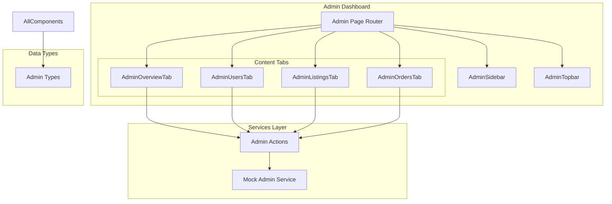
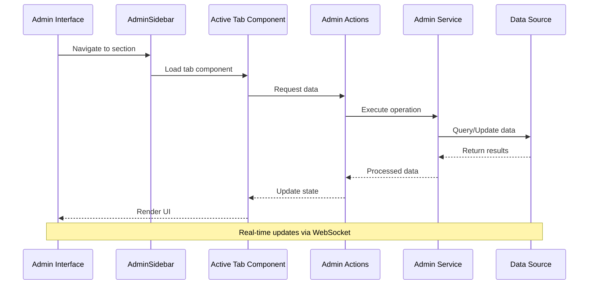
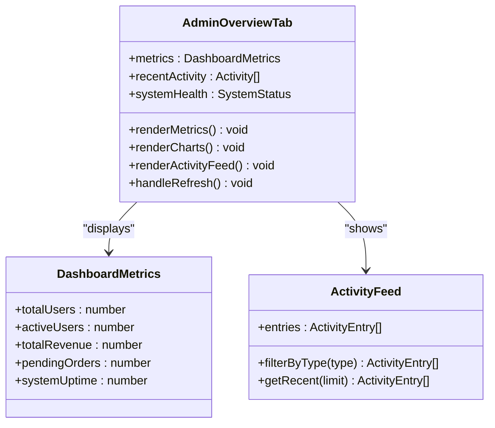
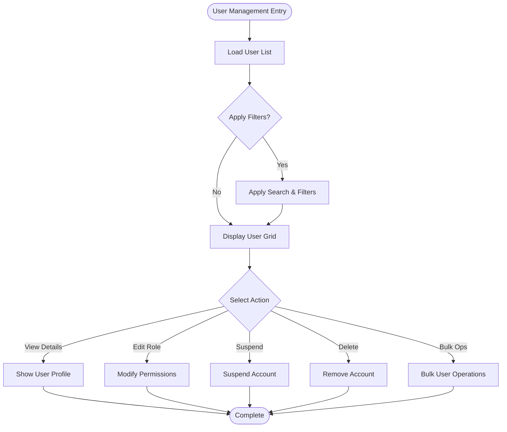
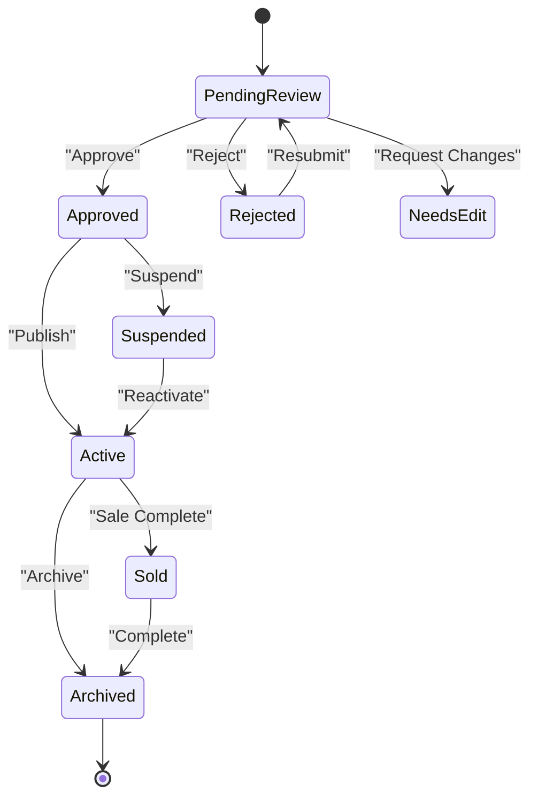
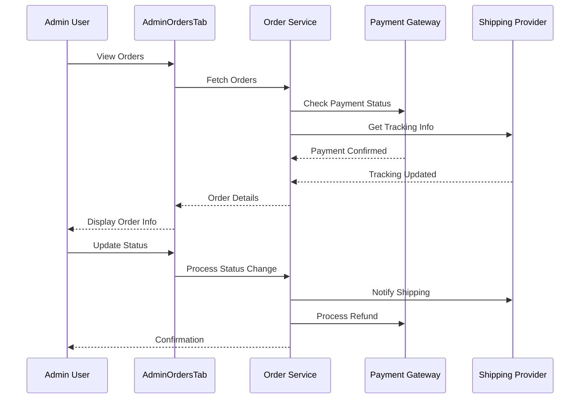
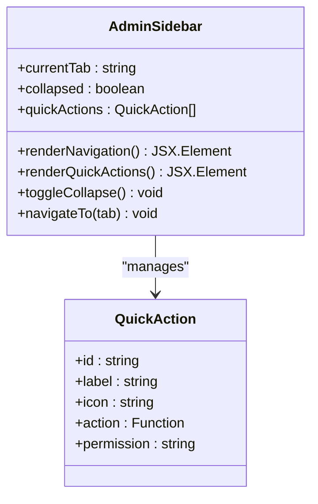
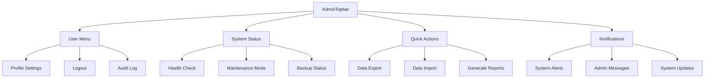
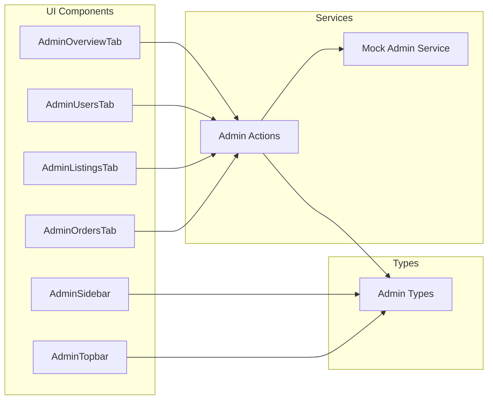
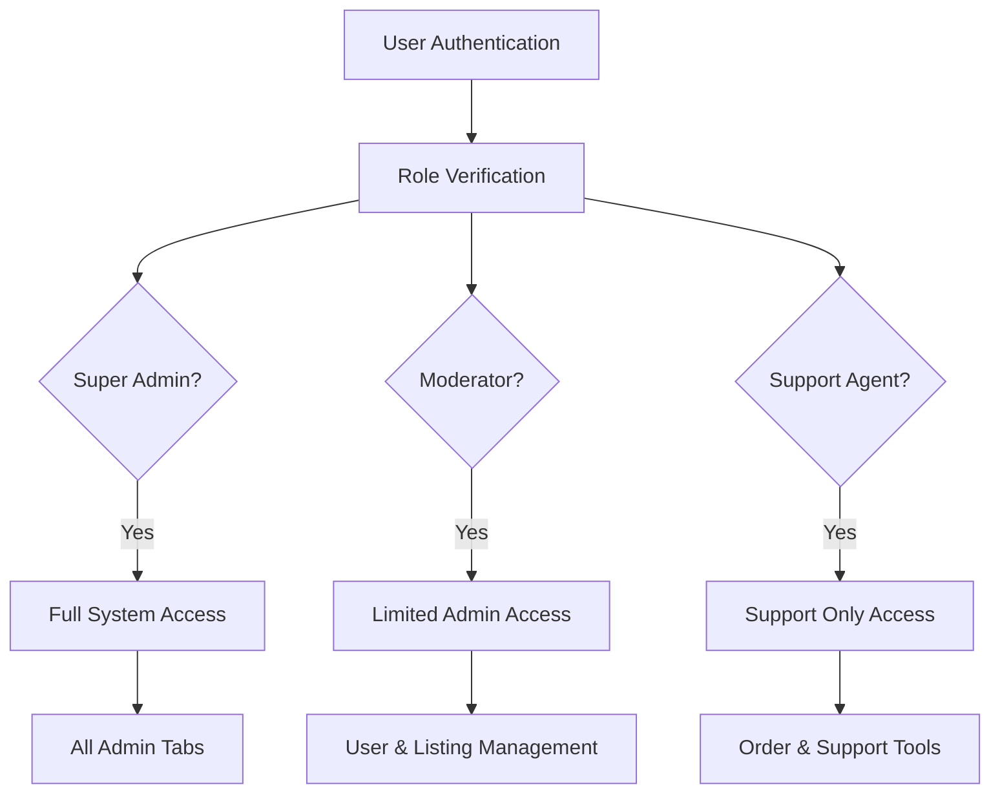

# Admin Dashboard Components

<cite>
**Referenced Files in This Document**
- [AdminOverviewTab.tsx](file://src/components/admin/AdminOverviewTab.tsx)
- [AdminUsersTab.tsx](file://src/components/admin/AdminUsersTab.tsx)
- [AdminListingsTab.tsx](file://src/components/admin/AdminListingsTab.tsx)
- [AdminOrdersTab.tsx](file://src/components/admin/AdminOrdersTab.tsx)
- [AdminSidebar.tsx](file://src/components/admin/AdminSidebar.tsx)
- [AdminTopbar.tsx](file://src/components/admin/AdminTopbar.tsx)
- [AdminTypes.ts](file://src/components/admin/AdminTypes.ts)
- [admin/actions.ts](file://src/services/admin/actions.ts)
- [admin/mockAdminService.ts](file://src/services/admin/mockAdminService.ts)
- [page.tsx](file://src/app/admin/page.tsx)
</cite>

## Table of Contents
1. [Introduction](#introduction)
2. [Project Structure](#project-structure)
3. [Core Components](#core-components)
4. [Architecture Overview](#architecture-overview)
5. [Detailed Component Analysis](#detailed-component-analysis)
6. [Dependency Analysis](#dependency-analysis)
7. [Performance Considerations](#performance-considerations)
8. [Security and Access Control](#security-and-access-control)
9. [Bulk Operations and Management Workflows](#bulk-operations-and-management-workflows)
10. [Reporting and Analytics](#reporting-and-analytics)
11. [Troubleshooting Guide](#troubleshooting-guide)
12. [Conclusion](#conclusion)

## Introduction

The Mooday admin dashboard provides a comprehensive management interface for platform administrators to oversee users, listings, orders, and system operations. The dashboard is built with React and Next.js, featuring modular tab-based navigation, real-time data visualization, and role-based access control mechanisms.

The admin interface consists of six core components that work together to provide a seamless administrative experience:

- **AdminOverviewTab**: Central dashboard displaying key metrics and system health
- **AdminUsersTab**: User management interface with moderation capabilities
- **AdminListingsTab**: Product listing oversight and content moderation
- **AdminOrdersTab**: Order processing and fulfillment management
- **AdminSidebar**: Navigation and quick actions panel
- **AdminTopbar**: System status and user administration controls

## Project Structure

The admin dashboard follows a modular component architecture with clear separation of concerns:

**Diagram sources**
- [page.tsx:1-50](file://src/app/admin/page.tsx#L1-L50)
- [AdminSidebar.tsx:1-100](file://src/components/admin/AdminSidebar.tsx#L1-L100)
- [AdminTopbar.tsx:1-100](file://src/components/admin/AdminTopbar.tsx#L1-L100)

**Section sources**
- [page.tsx:1-100](file://src/app/admin/page.tsx#L1-L100)
- [AdminTypes.ts:1-200](file://src/components/admin/AdminTypes.ts#L1-L200)

## Core Components

### AdminOverviewTab

The overview tab serves as the central dashboard, providing administrators with at-a-glance insights into platform performance, user activity, and system health. Key features include:

- Real-time metrics display (users, revenue, orders)
- System health indicators
- Recent activity feeds
- Performance charts and analytics
- Alert notifications

### AdminUsersTab

User management functionality enables administrators to:

- View and search user profiles
- Manage user permissions and roles
- Handle user reports and disputes
- Monitor user activity logs
- Perform bulk user operations

### AdminListingsTab

Product listing oversight includes:

- Content moderation workflows
- Listing approval/rejection processes
- Category management
- Price monitoring and validation
- Image and media verification

### AdminOrdersTab

Order management capabilities encompass:

- Order status tracking
- Payment processing oversight
- Shipping coordination
- Refund handling
- Dispute resolution

### AdminSidebar

Navigation component providing:

- Tab switching functionality
- Quick action buttons
- Search capabilities
- Filter options
- Status indicators

### AdminTopbar

System control interface offering:

- User session management
- System-wide announcements
- Emergency controls
- Export functionality
- Help and support access

**Section sources**
- [AdminOverviewTab.tsx:1-200](file://src/components/admin/AdminOverviewTab.tsx#L1-L200)
- [AdminUsersTab.tsx:1-200](file://src/components/admin/AdminUsersTab.tsx#L1-L200)
- [AdminListingsTab.tsx:1-200](file://src/components/admin/AdminListingsTab.tsx#L1-L200)
- [AdminOrdersTab.tsx:1-200](file://src/components/admin/AdminOrdersTab.tsx#L1-L200)
- [AdminSidebar.tsx:1-150](file://src/components/admin/AdminSidebar.tsx#L1-L150)
- [AdminTopbar.tsx:1-150](file://src/components/admin/AdminTopbar.tsx#L1-L150)

## Architecture Overview

The admin dashboard follows a component-based architecture with service layer abstraction:

**Diagram sources**
- [AdminSidebar.tsx:50-150](file://src/components/admin/AdminSidebar.tsx#L50-L150)
- [admin/actions.ts:1-200](file://src/services/admin/actions.ts#L1-L200)
- [admin/mockAdminService.ts:1-200](file://src/services/admin/mockAdminService.ts#L1-L200)

## Detailed Component Analysis

### AdminOverviewTab Analysis

The overview tab implements a comprehensive dashboard with multiple data visualization components:

**Diagram sources**
- [AdminOverviewTab.tsx:1-150](file://src/components/admin/AdminOverviewTab.tsx#L1-L150)
- [AdminTypes.ts:1-100](file://src/components/admin/AdminTypes.ts#L1-L100)

Key implementation patterns:

- **Real-time Data Updates**: Uses polling or WebSocket connections for live metrics
- **Responsive Charts**: Implements chart libraries for data visualization
- **Error Boundaries**: Graceful error handling for failed data loads
- **Loading States**: Skeleton loaders during data fetching

**Section sources**
- [AdminOverviewTab.tsx:1-200](file://src/components/admin/AdminOverviewTab.tsx#L1-L200)

### AdminUsersTab Analysis

User management functionality with advanced filtering and bulk operations:

**Diagram sources**
- [AdminUsersTab.tsx:1-200](file://src/components/admin/AdminUsersTab.tsx#L1-L200)
- [admin/actions.ts:50-150](file://src/services/admin/actions.ts#L50-L150)

Features include:

- **Advanced Search**: Multi-field search with autocomplete
- **Role Management**: Granular permission controls
- **Activity Monitoring**: Track user actions and login history
- **Bulk Operations**: Mass user management tasks
- **Export Capabilities**: CSV/Excel export functionality

**Section sources**
- [AdminUsersTab.tsx:1-200](file://src/components/admin/AdminUsersTab.tsx#L1-L200)
- [admin/actions.ts:1-200](file://src/services/admin/actions.ts#L1-L200)

### AdminListingsTab Analysis

Product listing management with content moderation workflows:

**Diagram sources**
- [AdminListingsTab.tsx:1-200](file://src/components/admin/AdminListingsTab.tsx#L1-L200)
- [admin/actions.ts:100-200](file://src/services/admin/actions.ts#L100-L200)

Key capabilities:

- **Content Moderation**: AI-assisted content review
- **Category Management**: Dynamic category assignment
- **Price Validation**: Automated price range checking
- **Image Verification**: Quality and policy compliance
- **SEO Optimization**: Search engine optimization tools

**Section sources**
- [AdminListingsTab.tsx:1-200](file://src/components/admin/AdminListingsTab.tsx#L1-L200)

### AdminOrdersTab Analysis

Order processing and fulfillment management:

**Diagram sources**
- [AdminOrdersTab.tsx:1-200](file://src/components/admin/AdminOrdersTab.tsx#L1-L200)
- [admin/actions.ts:150-250](file://src/services/admin/actions.ts#L150-L250)

Features include:

- **Order Tracking**: Real-time order status updates
- **Payment Processing**: Integration with payment gateways
- **Shipping Coordination**: Automated shipping label generation
- **Refund Management**: Streamlined refund processing
- **Dispute Resolution**: Built-in dispute handling workflow

**Section sources**
- [AdminOrdersTab.tsx:1-200](file://src/components/admin/AdminOrdersTab.tsx#L1-L200)

### AdminSidebar Analysis

Navigation and quick actions component:

**Diagram sources**
- [AdminSidebar.tsx:1-150](file://src/components/admin/AdminSidebar.tsx#L1-L150)
- [AdminTypes.ts:100-200](file://src/components/admin/AdminTypes.ts#L100-L200)

Functionality includes:

- **Responsive Design**: Mobile-friendly navigation
- **Keyboard Navigation**: Full keyboard accessibility
- **Bookmarking**: Save frequently used sections
- **Search Integration**: Global search across all tabs
- **Permission-Based Visibility**: Role-based menu items

**Section sources**
- [AdminSidebar.tsx:1-150](file://src/components/admin/AdminSidebar.tsx#L1-L150)

### AdminTopbar Analysis

System control and user management interface:

**Diagram sources**
- [AdminTopbar.tsx:1-150](file://src/components/admin/AdminTopbar.tsx#L1-L150)
- [admin/actions.ts:200-300](file://src/services/admin/actions.ts#L200-L300)

Capabilities include:

- **User Session Management**: Admin account controls
- **System Monitoring**: Real-time system health checks
- **Emergency Controls**: System-wide maintenance modes
- **Notification Center**: Centralized alert management
- **Audit Trail**: Comprehensive action logging

**Section sources**
- [AdminTopbar.tsx:1-150](file://src/components/admin/AdminTopbar.tsx#L1-L150)

## Dependency Analysis

The admin dashboard components have well-defined dependencies and relationships:

**Diagram sources**
- [AdminTypes.ts:1-200](file://src/components/admin/AdminTypes.ts#L1-L200)
- [admin/actions.ts:1-300](file://src/services/admin/actions.ts#L1-L300)
- [admin/mockAdminService.ts:1-200](file://src/services/admin/mockAdminService.ts#L1-L200)

**Section sources**
- [AdminTypes.ts:1-200](file://src/components/admin/AdminTypes.ts#L1-L200)
- [admin/actions.ts:1-300](file://src/services/admin/actions.ts#L1-L300)

## Performance Considerations

### Data Loading Strategies

- **Lazy Loading**: Components load only when needed
- **Pagination**: Large datasets are paginated for optimal performance
- **Caching**: Frequently accessed data is cached locally
- **Virtual Scrolling**: Efficient rendering of large lists

### Optimization Techniques

- **Memoization**: Expensive computations are memoized
- **Debouncing**: Search inputs use debounced API calls
- **Image Optimization**: Lazy loading and compression for images
- **Bundle Splitting**: Code splitting for better initial load times

### Memory Management

- **Cleanup Functions**: Proper cleanup of event listeners and timers
- **State Management**: Optimized state updates using React hooks
- **Memory Leaks Prevention**: Regular memory leak detection and prevention

## Security and Access Control

### Role-Based Access Control (RBAC)

The admin dashboard implements comprehensive RBAC:

**Diagram sources**
- [admin/actions.ts:1-100](file://src/services/admin/actions.ts#L1-L100)
- [AdminTypes.ts:150-200](file://src/components/admin/AdminTypes.ts#L150-L200)

### Security Measures

- **Input Validation**: All user inputs are validated and sanitized
- **SQL Injection Prevention**: Parameterized queries and prepared statements
- **XSS Protection**: Content security policies and output encoding
- **CSRF Protection**: Cross-site request forgery tokens
- **Rate Limiting**: API rate limiting to prevent abuse

### Audit Logging

- **Action Logging**: All admin actions are logged with timestamps
- **IP Tracking**: Source IP addresses are recorded
- **Session Management**: Secure session handling and timeout
- **Compliance**: GDPR and other regulatory compliance measures

**Section sources**
- [admin/actions.ts:1-200](file://src/services/admin/actions.ts#L1-L200)
- [AdminTypes.ts:100-200](file://src/components/admin/AdminTypes.ts#L100-L200)

## Bulk Operations and Management Workflows

### Bulk User Management

Administrators can perform mass operations on user accounts:

- **Mass Role Assignment**: Update roles for multiple users simultaneously
- **Bulk Suspension**: Temporarily suspend groups of users
- **Email Campaigns**: Send targeted messages to user segments
- **Data Export**: Export user data for analysis or migration

### Listing Management Workflows

Streamlined processes for managing product listings:

- **Batch Approvals**: Approve multiple listings at once
- **Category Updates**: Update categories for multiple products
- **Price Adjustments**: Modify prices in bulk
- **Content Moderation**: Review and moderate listings efficiently

### Order Processing Automation

Automated workflows for order management:

- **Status Updates**: Automatic order status changes based on conditions
- **Notification Systems**: Automated email and in-app notifications
- **Integration APIs**: Seamless integration with external systems
- **Reporting**: Generate comprehensive order reports

**Section sources**
- [admin/actions.ts:100-300](file://src/services/admin/actions.ts#L100-L300)
- [AdminUsersTab.tsx:150-200](file://src/components/admin/AdminUsersTab.tsx#L150-L200)
- [AdminListingsTab.tsx:150-200](file://src/components/admin/AdminListingsTab.tsx#L150-L200)
- [AdminOrdersTab.tsx:150-200](file://src/components/admin/AdminOrdersTab.tsx#L150-L200)

## Reporting and Analytics

### Dashboard Analytics

The admin dashboard provides comprehensive analytics:

- **Real-time Metrics**: Live system performance indicators
- **Trend Analysis**: Historical data comparison and trend identification
- **Custom Reports**: Flexible report generation with custom filters
- **Export Options**: Multiple export formats (CSV, PDF, Excel)

### Key Performance Indicators (KPIs)

- **User Growth**: New user acquisition and retention rates
- **Revenue Metrics**: Sales volume, average order value, conversion rates
- **Operational Efficiency**: Order processing time, customer satisfaction scores
- **System Health**: Uptime, response times, error rates

### Advanced Analytics Features

- **Predictive Analytics**: Machine learning-based forecasting
- **A/B Testing**: Experimentation framework for feature testing
- **Cohort Analysis**: User behavior segmentation and analysis
- **Funnel Analysis**: Conversion funnel optimization

**Section sources**
- [AdminOverviewTab.tsx:100-200](file://src/components/admin/AdminOverviewTab.tsx#L100-L200)
- [admin/actions.ts:200-300](file://src/services/admin/actions.ts#L200-L300)

## Troubleshooting Guide

### Common Issues and Solutions

#### Performance Problems

- **Slow Loading Times**: Check database query performance and implement caching
- **Memory Leaks**: Use browser developer tools to identify memory leaks
- **Network Issues**: Verify API endpoints and network connectivity

#### Data Synchronization Issues

- **Real-time Updates**: Ensure WebSocket connections are properly established
- **Cache Invalidation**: Implement proper cache invalidation strategies
- **Conflict Resolution**: Handle concurrent updates and data conflicts

#### Access Control Problems

- **Permission Errors**: Verify user roles and permission assignments
- **Session Issues**: Check authentication token validity and expiration
- **API Access**: Validate API keys and endpoint permissions

### Debugging Tools

- **Browser DevTools**: Network tab for API debugging
- **Console Logging**: Structured logging with log levels
- **Error Tracking**: Integration with error tracking services
- **Performance Profiling**: Application performance monitoring

### Recovery Procedures

- **Data Backup**: Regular automated backups with restore procedures
- **Rollback Plans**: Version rollback capabilities for failed deployments
- **Incident Response**: Standard operating procedures for system incidents
- **Communication Protocols**: Stakeholder communication during outages

**Section sources**
- [admin/actions.ts:1-100](file://src/services/admin/actions.ts#L1-L100)
- [AdminTopbar.tsx:100-150](file://src/components/admin/AdminTopbar.tsx#L100-L150)

## Conclusion

The Mooday admin dashboard provides a comprehensive, secure, and efficient management interface for platform administrators. The modular architecture ensures maintainability and scalability, while the robust security measures protect sensitive administrative functions.

Key strengths of the implementation include:

- **Modular Design**: Clean separation of concerns with reusable components
- **Real-time Capabilities**: Live data updates and interactive interfaces
- **Scalable Architecture**: Designed to handle growing data volumes and user bases
- **Security Focus**: Comprehensive access control and audit logging
- **Performance Optimization**: Efficient data loading and rendering strategies

Future enhancements could include:

- **Advanced Analytics**: Machine learning-powered insights and recommendations
- **Mobile Administration**: Responsive mobile interface for on-the-go management
- **API Extensions**: Expanded API capabilities for third-party integrations
- **Automation**: Enhanced automation rules and workflow triggers

The admin dashboard successfully balances usability with powerful administrative capabilities, providing platform operators with the tools they need to manage a complex marketplace ecosystem effectively.