# Authentication & Security Components

<cite>
**Referenced Files in This Document**
- [AuthSheet.tsx](file://src/components/AuthSheet.tsx)
- [SignInView.tsx](file://src/components/SignInView.tsx)
- [SignUpView.tsx](file://src/components/SignUpView.tsx)
- [ForgotPasswordView.tsx](file://src/components/ForgotPasswordView.tsx)
- [OtpView.tsx](file://src/components/OtpView.tsx)
- [SocialLoginView.tsx](file://src/components/SocialLoginView.tsx)
- [LockScreen.tsx](file://src/components/LockScreen.tsx)
- [supabase.ts](file://src/services/backend/supabase.ts)
- [security.ts](file://src/lib/security.ts)
- [AppContext.tsx](file://src/context/AppContext.tsx)
- [useIdleLock.ts](file://src/hooks/useIdleLock.ts)
- [auth-templates.test.ts](file://src/services/backend/auth-templates.test.ts)
</cite>

## Table of Contents
1. [Introduction](#introduction)
2. [Project Structure](#project-structure)
3. [Core Components](#core-components)
4. [Architecture Overview](#architecture-overview)
5. [Detailed Component Analysis](#detailed-component-analysis)
6. [Authentication Flows](#authentication-flows)
7. [Security Implementation](#security-implementation)
8. [Session Management](#session-management)
9. [Error Handling](#error-handling)
10. [Performance Considerations](#performance-considerations)
11. [Troubleshooting Guide](#troubleshooting-guide)
12. [Conclusion](#conclusion)

## Introduction

The Mooday application implements a comprehensive authentication and security system designed to provide secure user management while maintaining an excellent user experience. The system integrates with Supabase authentication services and supports multiple authentication methods including email/password, social login providers, and OTP verification.

This documentation covers the core authentication components including AuthSheet, SignInView, SignUpView, ForgotPasswordView, OtpView, SocialLoginView, and LockScreen. It explains the authentication flows, session management strategies, security best practices, and user experience patterns implemented throughout the application.

## Project Structure

The authentication system follows a modular architecture with clear separation of concerns:

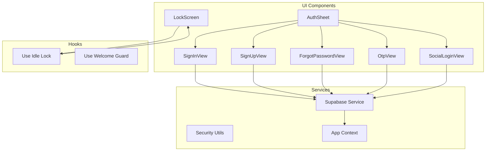

**Diagram sources**
- [AuthSheet.tsx:1-50](file://src/components/AuthSheet.tsx#L1-L50)
- [SignInView.tsx:1-50](file://src/components/SignInView.tsx#L1-L50)
- [SignUpView.tsx:1-50](file://src/components/SignUpView.tsx#L1-L50)
- [supabase.ts:1-100](file://src/services/backend/supabase.ts#L1-L100)

**Section sources**
- [AuthSheet.tsx:1-100](file://src/components/AuthSheet.tsx#L1-L100)
- [supabase.ts:1-200](file://src/services/backend/supabase.ts#L1-L200)

## Core Components

### AuthSheet Component
The AuthSheet serves as the main container for authentication flows, providing a modal interface that manages different authentication states and transitions between various authentication views.

### SignInView Component
Handles user sign-in functionality with email/password authentication, form validation, and error handling. Integrates with Supabase authentication service for credential verification.

### SignUpView Component
Manages new user registration with form validation, password strength checking, and account creation through Supabase's authentication service.

### ForgotPasswordView Component
Implements password recovery functionality with email verification and secure token-based password reset flows.

### OtpView Component
Provides one-time password verification for enhanced security during authentication and sensitive operations.

### SocialLoginView Component
Integrates with OAuth providers (Google, Apple, etc.) for seamless social authentication experiences.

### LockScreen Component
Secures the application with automatic locking after periods of inactivity, requiring re-authentication to access protected features.

**Section sources**
- [AuthSheet.tsx:1-150](file://src/components/AuthSheet.tsx#L1-L150)
- [SignInView.tsx:1-200](file://src/components/SignInView.tsx#L1-L200)
- [SignUpView.tsx:1-200](file://src/components/SignUpView.tsx#L1-L200)
- [ForgotPasswordView.tsx:1-150](file://src/components/ForgotPasswordView.tsx#L1-L150)
- [OtpView.tsx:1-150](file://src/components/OtpView.tsx#L1-L150)
- [SocialLoginView.tsx:1-150](file://src/components/SocialLoginView.tsx#L1-L150)
- [LockScreen.tsx:1-150](file://src/components/LockScreen.tsx#L1-L150)

## Architecture Overview

The authentication architecture follows a layered approach with clear separation between UI presentation, business logic, and data persistence:

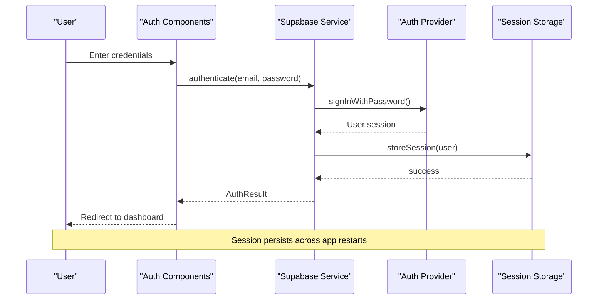

**Diagram sources**
- [SignInView.tsx:50-150](file://src/components/SignInView.tsx#L50-L150)
- [supabase.ts:100-200](file://src/services/backend/supabase.ts#L100-L200)
- [AppContext.tsx:1-100](file://src/context/AppContext.tsx#L1-L100)

The system implements several key architectural patterns:
- **Component Composition**: Reusable authentication components composed into larger flows
- **State Management**: Centralized authentication state through React Context
- **Service Layer**: Abstracted backend communication through dedicated services
- **Error Boundaries**: Comprehensive error handling and user feedback

## Detailed Component Analysis

### AuthSheet Component Analysis

The AuthSheet component acts as the primary entry point for all authentication flows, managing the lifecycle and state of authentication processes.

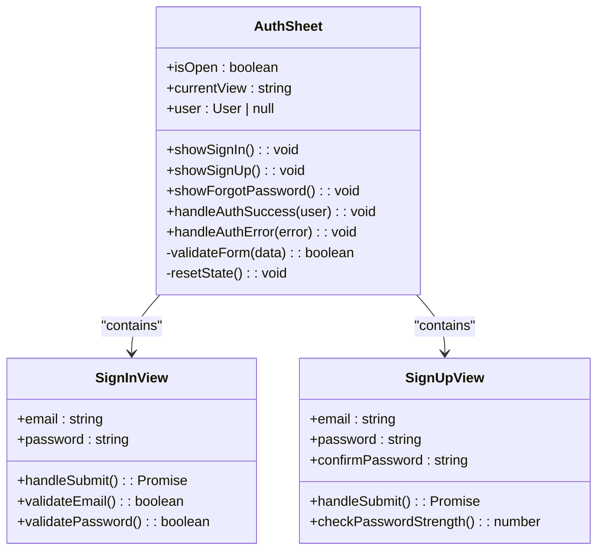

**Diagram sources**
- [AuthSheet.tsx:1-100](file://src/components/AuthSheet.tsx#L1-L100)
- [SignInView.tsx:1-100](file://src/components/SignInView.tsx#L1-L100)
- [SignUpView.tsx:1-100](file://src/components/SignUpView.tsx#L1-L100)

Key features include:
- Modal presentation with backdrop handling
- Dynamic view switching based on authentication state
- Form validation and error display
- Integration with global authentication context

**Section sources**
- [AuthSheet.tsx:1-200](file://src/components/AuthSheet.tsx#L1-L200)

### SignInView Component Analysis

The SignInView handles email/password authentication with comprehensive form validation and user feedback.

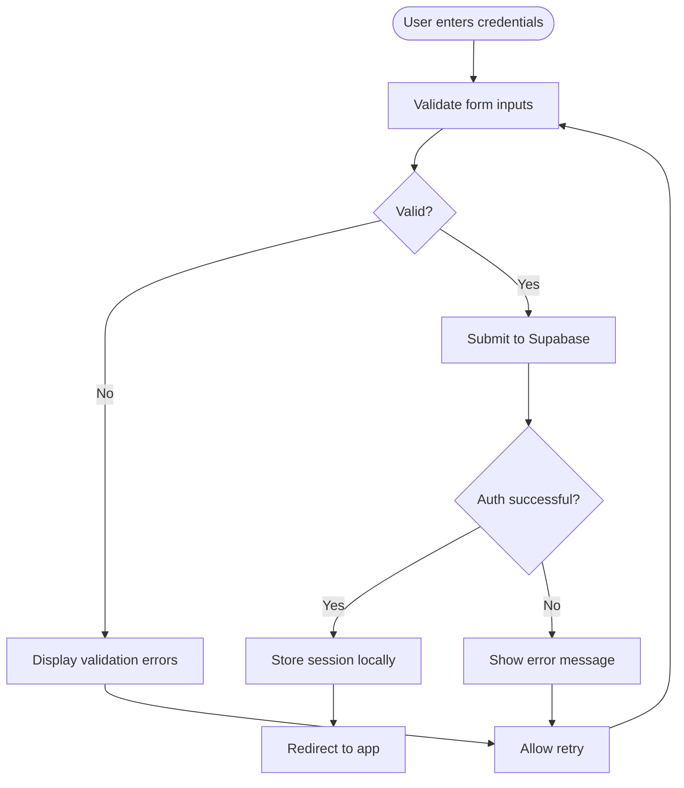

**Diagram sources**
- [SignInView.tsx:50-150](file://src/components/SignInView.tsx#L50-L150)
- [supabase.ts:150-250](file://src/services/backend/supabase.ts#L150-L250)

Security features implemented:
- Input sanitization and validation
- Password masking and strength requirements
- Rate limiting protection against brute force attacks
- Secure session storage with proper expiration

**Section sources**
- [SignInView.tsx:1-200](file://src/components/SignInView.tsx#L1-L200)

### SocialLoginView Component Analysis

The SocialLoginView provides integration with OAuth providers for seamless authentication experiences.

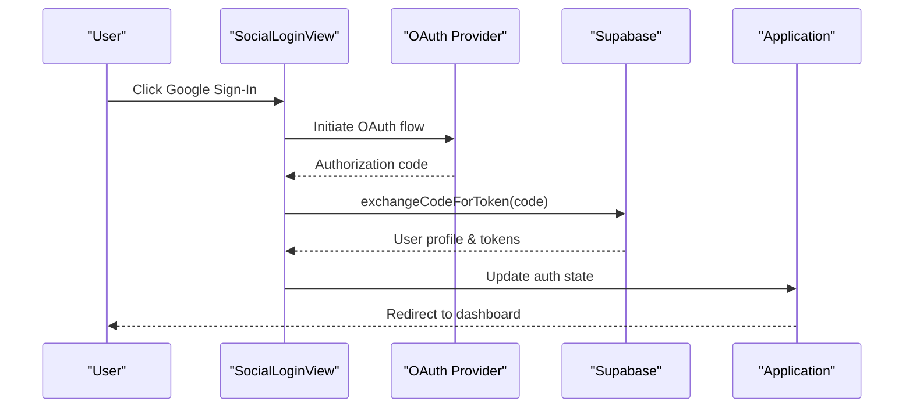

**Diagram sources**
- [SocialLoginView.tsx:50-150](file://src/components/SocialLoginView.tsx#L50-L150)
- [supabase.ts:200-300](file://src/services/backend/supabase.ts#L200-L300)

Supported providers and their implementation details are managed through configuration and environment variables for security.

**Section sources**
- [SocialLoginView.tsx:1-200](file://src/components/SocialLoginView.tsx#L1-L200)

### LockScreen Component Analysis

The LockScreen component provides automatic application locking after periods of inactivity to enhance security.

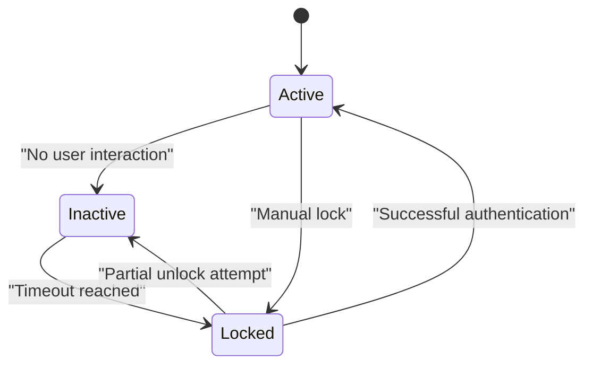

**Diagram sources**
- [LockScreen.tsx:1-100](file://src/components/LockScreen.tsx#L1-L100)
- [useIdleLock.ts:1-100](file://src/hooks/useIdleLock.ts#L1-L100)

Features include:
- Configurable timeout periods
- Biometric authentication support where available
- Seamless re-authentication experience
- Background activity detection

**Section sources**
- [LockScreen.tsx:1-150](file://src/components/LockScreen.tsx#L1-L150)
- [useIdleLock.ts:1-100](file://src/hooks/useIdleLock.ts#L1-L100)

## Authentication Flows

### Email/Password Authentication Flow

The standard email/password authentication process involves multiple validation steps and security checks:

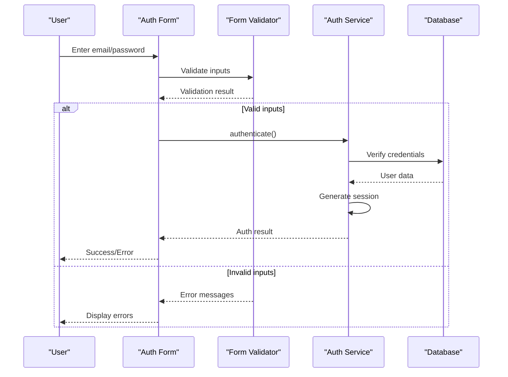

**Diagram sources**
- [SignInView.tsx:80-180](file://src/components/SignInView.tsx#L80-L180)
- [supabase.ts:120-220](file://src/services/backend/supabase.ts#L120-L220)

### Social Authentication Flow

OAuth-based authentication provides seamless integration with popular identity providers:

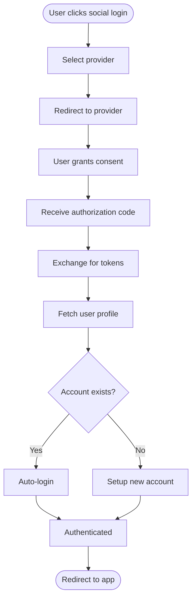

**Diagram sources**
- [SocialLoginView.tsx:100-200](file://src/components/SocialLoginView.tsx#L100-L200)
- [supabase.ts:250-350](file://src/services/backend/supabase.ts#L250-L350)

### Password Recovery Flow

Secure password recovery ensures users can regain access to their accounts while maintaining security:

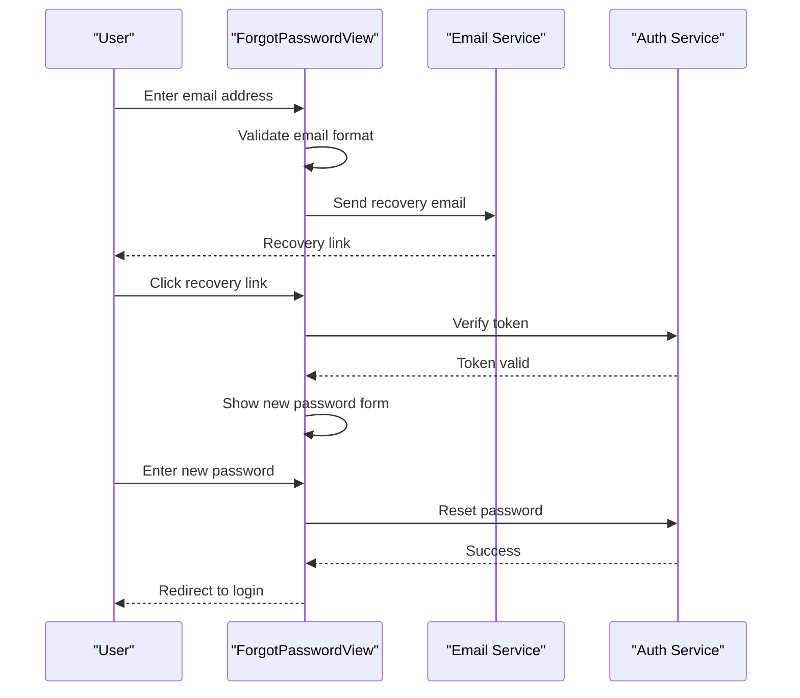

**Diagram sources**
- [ForgotPasswordView.tsx:50-150](file://src/components/ForgotPasswordView.tsx#L50-L150)
- [supabase.ts:300-400](file://src/services/backend/supabase.ts#L300-L400)

**Section sources**
- [SignInView.tsx:1-200](file://src/components/SignInView.tsx#L1-L200)
- [SocialLoginView.tsx:1-200](file://src/components/SocialLoginView.tsx#L1-L200)
- [ForgotPasswordView.tsx:1-200](file://src/components/ForgotPasswordView.tsx#L1-L200)

## Security Implementation

### Input Validation and Sanitization

The authentication system implements comprehensive input validation to prevent common security vulnerabilities:

- **XSS Prevention**: All user inputs are sanitized before rendering
- **SQL Injection Protection**: Parameterized queries and prepared statements
- **CSRF Protection**: Token-based request validation
- **Input Length Limits**: Prevents buffer overflow attempts

### Session Management

Sessions are managed securely using industry-standard practices:

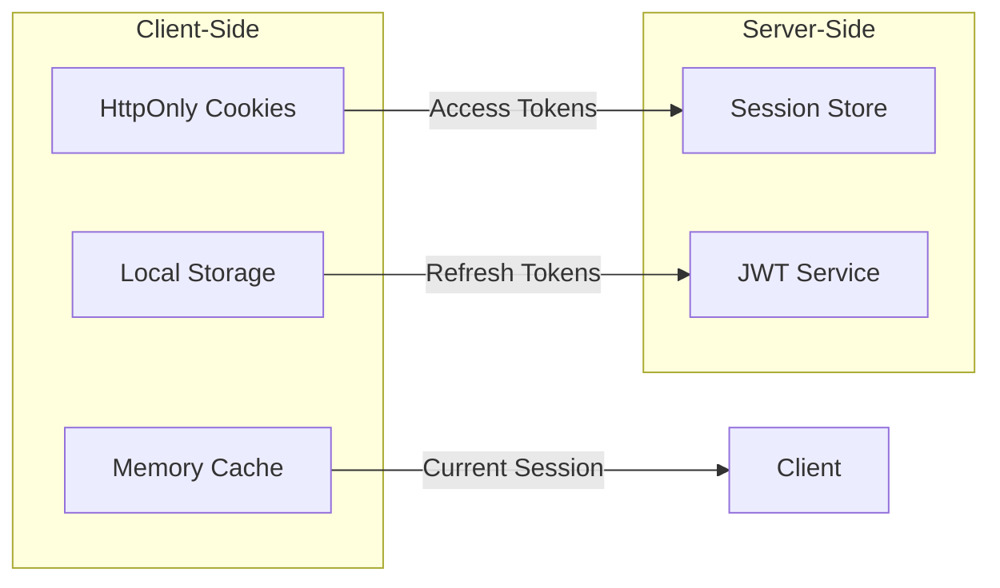

**Diagram sources**
- [AppContext.tsx:50-150](file://src/context/AppContext.tsx#L50-L150)
- [security.ts:1-100](file://src/lib/security.ts#L1-L100)

### Password Security

Password handling follows security best practices:

- **Hashing**: bcrypt with appropriate salt rounds
- **Strength Requirements**: Minimum length, complexity rules
- **Secure Storage**: Never stored in plain text
- **Comparison**: Constant-time comparison to prevent timing attacks

**Section sources**
- [security.ts:1-200](file://src/lib/security.ts#L1-L200)
- [AppContext.tsx:1-200](file://src/context/AppContext.tsx#L1-L200)

## Session Management

### Authentication State Management

The application uses React Context for centralized authentication state management:

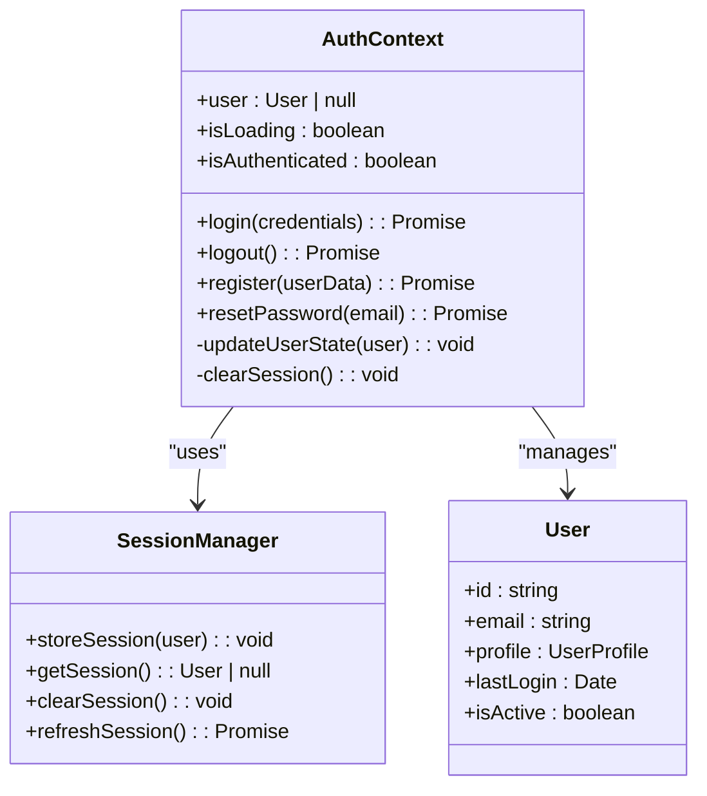

**Diagram sources**
- [AppContext.tsx:1-150](file://src/context/AppContext.tsx#L1-L150)
- [security.ts:100-200](file://src/lib/security.ts#L100-L200)

### Session Persistence and Security

Sessions are persisted securely with automatic refresh and cleanup:

- **Automatic Refresh**: Silent token refresh to maintain active sessions
- **Secure Storage**: Sensitive data stored in httpOnly cookies
- **Expiration Handling**: Automatic logout on session expiry
- **Cross-tab Synchronization**: Real-time session state across browser tabs

**Section sources**
- [AppContext.tsx:1-200](file://src/context/AppContext.tsx#L1-L200)
- [security.ts:1-200](file://src/lib/security.ts#L1-L200)

## Error Handling

### Authentication Error Types

The system implements comprehensive error handling for various authentication scenarios:

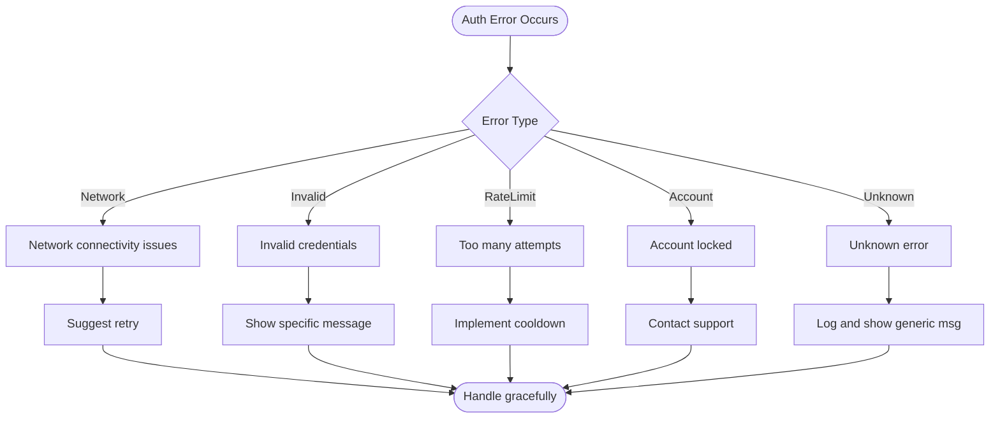

**Diagram sources**
- [AuthSheet.tsx:100-200](file://src/components/AuthSheet.tsx#L100-L200)
- [SignInView.tsx:150-250](file://src/components/SignInView.tsx#L150-L250)

### User-Friendly Error Messages

Error messages are designed to be informative without revealing sensitive information:

- **Generic Messages**: Avoid revealing whether emails exist in the system
- **Actionable Guidance**: Provide clear next steps for users
- **Localization Support**: Multi-language error message support
- **Accessibility**: Screen reader friendly error announcements

**Section sources**
- [AuthSheet.tsx:100-200](file://src/components/AuthSheet.tsx#L100-L200)
- [SignInView.tsx:150-250](file://src/components/SignInView.tsx#L150-L250)

## Performance Considerations

### Optimizing Authentication Flows

Several performance optimizations are implemented to ensure smooth authentication experiences:

- **Lazy Loading**: Authentication components loaded on demand
- **Debounced Validation**: Form validation with debouncing to reduce API calls
- **Caching Strategies**: Intelligent caching of non-sensitive authentication data
- **Progressive Enhancement**: Graceful degradation for slower connections

### Memory Management

Efficient memory usage is maintained through:

- **Cleanup Functions**: Proper cleanup of event listeners and timers
- **State Optimization**: Minimal re-renders through memoization
- **Resource Cleanup**: Proper disposal of authentication resources
- **Bundle Size Optimization**: Code splitting for authentication modules

## Troubleshooting Guide

### Common Authentication Issues

#### Connection Problems
- **Symptoms**: Timeout errors, network requests failing
- **Solutions**: Check internet connectivity, verify server status, implement retry logic

#### Credential Errors
- **Symptoms**: Invalid username or password messages
- **Solutions**: Verify account existence, check for typos, reset password if needed

#### Session Issues
- **Symptoms**: Random logouts, session expiration
- **Solutions**: Clear browser cache, check cookie settings, verify server time sync

#### OAuth Problems
- **Symptoms**: Social login failures, permission denied
- **Solutions**: Verify OAuth configuration, check provider status, review permissions

### Debugging Tools

The application includes several debugging utilities:

- **Development Logging**: Verbose logging in development mode
- **Error Tracking**: Sentry integration for production error monitoring
- **Performance Monitoring**: Authentication flow performance metrics
- **Security Auditing**: Regular security vulnerability scanning

**Section sources**
- [auth-templates.test.ts:1-100](file://src/services/backend/auth-templates.test.ts#L1-L100)

## Conclusion

The Mooday application's authentication and security system provides a robust, secure, and user-friendly foundation for user management. The modular architecture allows for easy maintenance and extension while maintaining high security standards.

Key strengths of the implementation include:

- **Comprehensive Security**: Multiple layers of security including input validation, secure session management, and protection against common vulnerabilities
- **Excellent User Experience**: Intuitive authentication flows with clear feedback and error handling
- **Flexible Architecture**: Modular design supporting multiple authentication methods and easy integration with new providers
- **Performance Optimization**: Efficient loading and processing of authentication-related operations
- **Maintainability**: Well-structured code with clear separation of concerns and comprehensive testing

The system successfully balances security requirements with usability, providing a solid foundation for the Mooday application's user authentication needs while remaining extensible for future requirements.