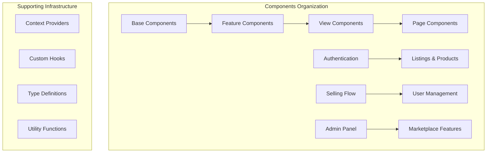
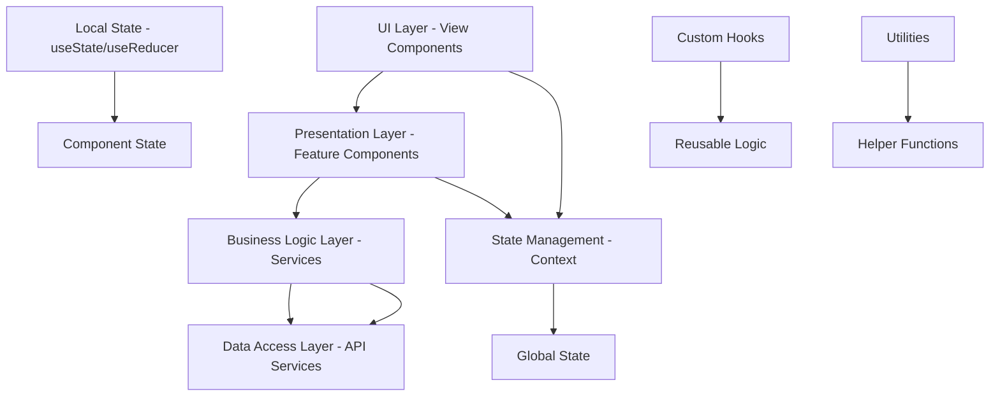
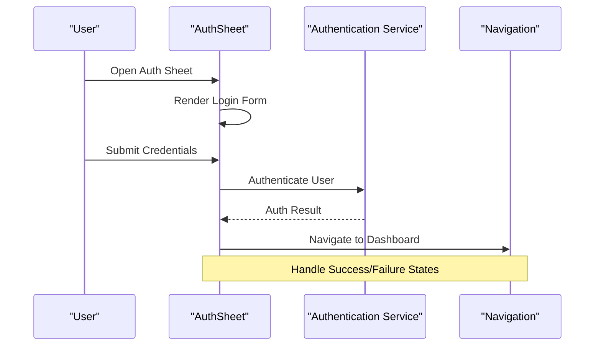
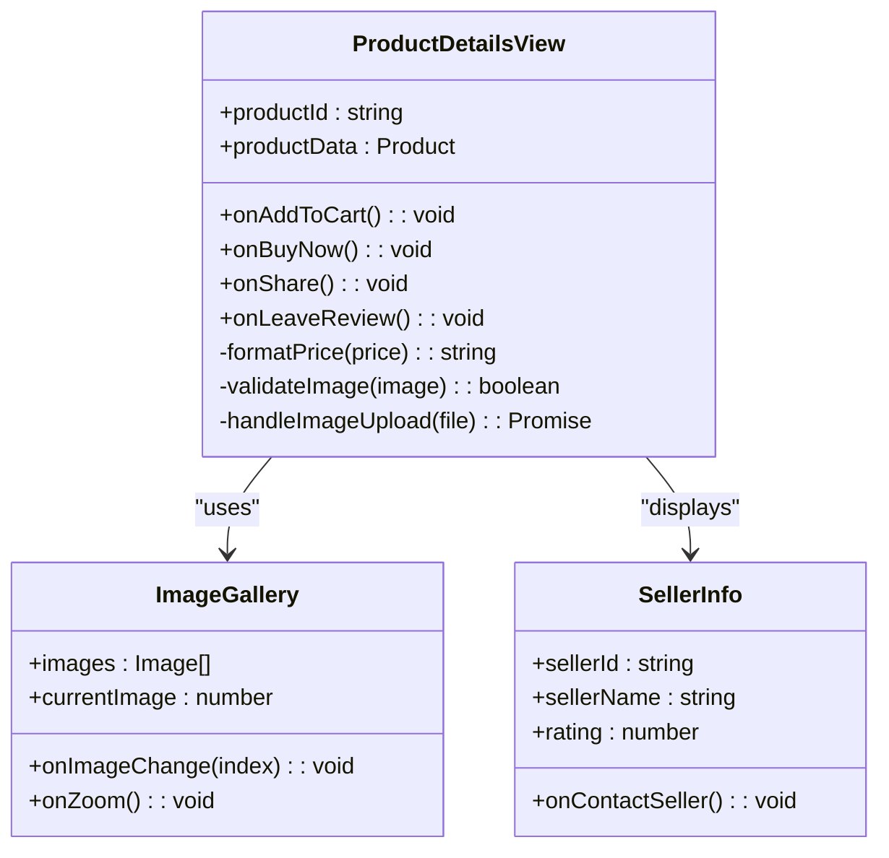
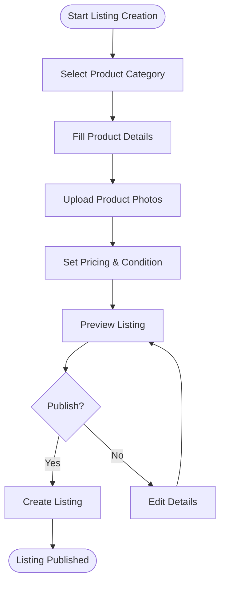
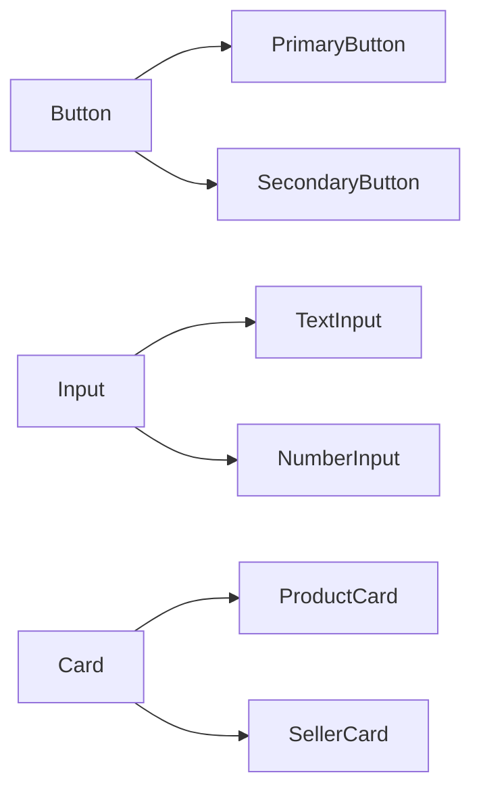
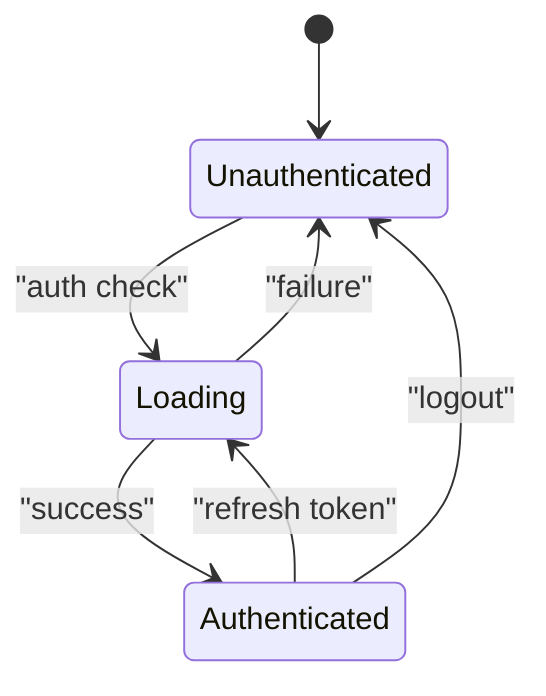

# Component Library

<cite>
**Referenced Files in This Document**
- [AuthSheet.tsx](file://src/components/AuthSheet.tsx)
- [ProductDetailsView.tsx](file://src/components/ProductDetailsView.tsx)
- [SellItemView.tsx](file://src/components/SellItemView.tsx)
- [AppContent.tsx](file://src/components/AppContent.tsx)
- [AppContext.tsx](file://src/context/AppContext.tsx)
- [ActivityView.tsx](file://src/components/ActivityView.tsx)
- [CategoryLandingView.tsx](file://src/components/CategoryLandingView.tsx)
- [DiscoverFeedView.tsx](file://src/components/DiscoverFeedView.tsx)
- [MyClosetView.tsx](file://src/components/MyClosetView.tsx)
- [SettingsView.tsx](file://src/components/SettingsView.tsx)
- [ErrorBoundary.tsx](file://src/components/ErrorBoundary.tsx)
- [useAppNavigation.ts](file://src/hooks/useAppNavigation.ts)
- [navigation.ts](file://src/types/navigation.ts)
</cite>

## Table of Contents
1. [Introduction](#introduction)
2. [Project Structure](#project-structure)
3. [Core Components](#core-components)
4. [Architecture Overview](#architecture-overview)
5. [Detailed Component Analysis](#detailed-component-analysis)
6. [Component Architecture Patterns](#component-architecture-patterns)
7. [Props Interface Design](#props-interface-design)
8. [Event Handling Patterns](#event-handling-patterns)
9. [State Management](#state-management)
10. [Testing Strategies](#testing-strategies)
11. [Accessibility Considerations](#accessibility-considerations)
12. [Performance Optimization](#performance-optimization)
13. [Creating New Components](#creating-new-components)
14. [Conclusion](#conclusion)

## Introduction

The Mooday React component library is a comprehensive marketplace application built with Next.js and TypeScript. It provides a complete e-commerce experience with features including product browsing, authentication, selling items, order management, user profiles, and administrative functionality. The library follows modern React patterns with a focus on reusability, accessibility, and performance optimization.

The application is structured around a hierarchical component architecture that progresses from base UI elements to complex view components, ensuring consistency and maintainability across the marketplace interface.

## Project Structure

The Mooday application follows a feature-based organization within the `src/components` directory, with each major feature area having its own subdirectory:



**Diagram sources**
- [AppContent.tsx:1-50](file://src/components/AppContent.tsx#L1-L50)
- [AppContext.tsx:1-100](file://src/context/AppContext.tsx#L1-L100)

The component hierarchy follows a clear progression from simple reusable elements to complex business logic components, with proper separation of concerns and dependency management.

**Section sources**
- [AppContent.tsx:1-100](file://src/components/AppContent.tsx#L1-L100)
- [AppContext.tsx:1-200](file://src/context/AppContext.tsx#L1-L200)

## Core Components

The core components form the foundation of the Mooday application, providing essential functionality that other components build upon:

### Authentication Components
- **AuthSheet**: Modal-based authentication interface handling login, registration, and password recovery flows
- **SocialLoginView**: Social media authentication integration
- **OtpView**: One-time password verification component

### Marketplace Components
- **ProductDetailsView**: Comprehensive product display with pricing, images, and seller information
- **DiscoverFeedView**: Product discovery and browsing interface
- **CategoryLandingView**: Category-specific product listings
- **SearchFiltersView**: Advanced search and filtering capabilities

### User Experience Components
- **MyClosetView**: User's personal item collection management
- **SettingsView**: Application preferences and configuration
- **ActivityView**: User activity feed and notifications

**Section sources**
- [AuthSheet.tsx:1-150](file://src/components/AuthSheet.tsx#L1-L150)
- [ProductDetailsView.tsx:1-200](file://src/components/ProductDetailsView.tsx#L1-L200)
- [DiscoverFeedView.tsx:1-180](file://src/components/DiscoverFeedView.tsx#L1-L180)

## Architecture Overview

The Mooday application follows a layered architecture pattern that separates concerns and promotes reusability:



**Diagram sources**
- [AppContent.tsx:1-100](file://src/components/AppContent.tsx#L1-L100)
- [AppContext.tsx:1-150](file://src/context/AppContext.tsx#L1-L150)

The architecture emphasizes:
- **Separation of Concerns**: Clear boundaries between UI, business logic, and data access
- **Reusability**: Shared components and hooks across the application
- **Testability**: Modular design enabling comprehensive unit and integration testing
- **Maintainability**: Consistent patterns and naming conventions

## Detailed Component Analysis

### AuthSheet Component Analysis

The AuthSheet component serves as the primary authentication interface, providing a modal-based approach to user authentication flows.



**Diagram sources**
- [AuthSheet.tsx:1-200](file://src/components/AuthSheet.tsx#L1-L200)
- [AppContext.tsx:1-100](file://src/context/AppContext.tsx#L1-L100)

Key features include:
- Multi-step authentication flow (login, register, password recovery)
- Social authentication integration
- Form validation and error handling
- Responsive design for mobile and desktop

### ProductDetailsView Component Analysis

The ProductDetailsView component provides comprehensive product information display and interaction capabilities.



**Diagram sources**
- [ProductDetailsView.tsx:1-300](file://src/components/ProductDetailsView.tsx#L1-L300)

The component handles:
- Dynamic image gallery with zoom functionality
- Real-time price updates and availability status
- Seller information and rating display
- Shopping cart integration
- Review submission and display

### SellItemView Component Analysis

The SellItemView component manages the complete item listing creation workflow.



**Diagram sources**
- [SellItemView.tsx:1-250](file://src/components/SellItemView.tsx#L1-L250)

Features include:
- Step-by-step listing creation wizard
- Image upload with preview and validation
- Category-based dynamic fields
- Price suggestion and market analysis
- Draft saving and editing capabilities

**Section sources**
- [AuthSheet.tsx:1-200](file://src/components/AuthSheet.tsx#L1-L200)
- [ProductDetailsView.tsx:1-300](file://src/components/ProductDetailsView.tsx#L1-L300)
- [SellItemView.tsx:1-250](file://src/components/SellItemView.tsx#L1-L250)

## Component Architecture Patterns

Mooday implements several key architectural patterns to ensure consistency and maintainability:

### Composition Pattern
Components are designed to be composed together, promoting reusability and reducing duplication:



### Container/Presentational Pattern
Clear separation between stateful container components and presentational components:

- **Container Components**: Handle data fetching, state management, and business logic
- **Presentational Components**: Focus on UI rendering and user interactions

### Provider Pattern
Context providers manage global application state and shared functionality:

- **AppProvider**: Global application state and configuration
- **AuthProvider**: User authentication state and methods
- **ThemeProvider**: Theme and styling configuration

**Section sources**
- [AppContent.tsx:1-100](file://src/components/AppContent.tsx#L1-L100)
- [AppContext.tsx:1-200](file://src/context/AppContext.tsx#L1-L200)

## Props Interface Design

The component library follows consistent props interface design principles:

### Naming Conventions
- **Boolean flags**: Use descriptive names like `isLoading`, `isDisabled`, `isVisible`
- **Callback functions**: Prefix with `on` followed by action name (e.g., `onSubmit`, `onClick`)
- **Configuration objects**: Use camelCase properties with clear descriptions
- **Optional props**: Clearly mark with `?` and provide sensible defaults

### Type Safety
All components use TypeScript interfaces for props definition:

```typescript
interface BaseComponentProps {
  className?: string;
  style?: React.CSSProperties;
  testId?: string;
  'aria-label'?: string;
}

interface ButtonProps extends BaseComponentProps {
  variant?: 'primary' | 'secondary' | 'outline';
  size?: 'small' | 'medium' | 'large';
  disabled?: boolean;
  onClick?: () => void;
  children: React.ReactNode;
}
```

### Prop Validation
Runtime prop validation ensures data integrity and provides helpful error messages during development.

**Section sources**
- [navigation.ts:1-100](file://src/types/navigation.ts#L1-L100)

## Event Handling Patterns

Mooday implements consistent event handling patterns across all components:

### Event Handler Interfaces
Standardized event handler signatures ensure consistency:

```typescript
type EventHandler<T = Event> = (event: T) => void;
type AsyncEventHandler<T = Event> = (event: T) => Promise<void>;
```

### Error Handling
Centralized error handling with user-friendly feedback:

- **Form validation errors**: Inline field-level error messages
- **Network errors**: Toast notifications with retry options
- **System errors**: Graceful degradation with fallback UI

### Performance Considerations
- Debounced input handlers for search and filter operations
- Throttled scroll events for infinite loading
- Optimized event delegation for large lists

**Section sources**
- [useAppNavigation.ts:1-150](file://src/hooks/useAppNavigation.ts#L1-L150)

## State Management

Mooday uses a hybrid state management approach combining local component state with global context:

### Local State Management
- **useState**: For simple component-level state
- **useReducer**: For complex state logic with multiple sub-values
- **Custom hooks**: Encapsulate reusable stateful logic

### Global State Management
- **React Context**: For application-wide state like authentication, theme, and navigation
- **Custom hooks**: Provide clean APIs for accessing global state

### State Synchronization
- **Server state**: Cached and synchronized with backend services
- **Client state**: Optimistic updates with rollback on failure
- **Offline support**: Local storage persistence for critical data



**Section sources**
- [AppContext.tsx:1-200](file://src/context/AppContext.tsx#L1-L200)

## Testing Strategies

Mooday implements comprehensive testing strategies across multiple levels:

### Unit Testing
- **Component tests**: Test individual component behavior and rendering
- **Hook tests**: Validate custom hook functionality and state management
- **Utility tests**: Ensure helper functions work correctly

### Integration Testing
- **Flow tests**: Test multi-component workflows and user journeys
- **API integration**: Mock backend services for realistic testing scenarios
- **State management tests**: Verify global state changes and side effects

### Visual Regression Testing
- **Snapshot testing**: Catch unintended UI changes
- **Cross-browser testing**: Ensure consistent rendering across platforms
- **Responsive testing**: Validate layout across different screen sizes

### Accessibility Testing
- **Automated checks**: Run axe-core for WCAG compliance
- **Keyboard navigation**: Ensure full keyboard operability
- **Screen reader testing**: Validate assistive technology compatibility

**Section sources**
- [AuthSheet.test.tsx:1-100](file://src/components/AuthSheet.test.tsx#L1-L100)
- [ProductDetailsView.test.tsx:1-100](file://src/components/ProductDetailsView.test.tsx#L1-L100)

## Accessibility Considerations

Mooday prioritizes accessibility throughout the component library:

### Semantic HTML
- Proper use of semantic HTML elements (`<button>`, `<input>`, `<nav>`)
- Logical heading hierarchy and document structure
- Meaningful link text and button labels

### Keyboard Navigation
- Full keyboard operability with logical tab order
- Visible focus indicators and keyboard shortcuts
- Escape key handling for modals and overlays

### Screen Reader Support
- ARIA attributes for complex interactive elements
- Live regions for dynamic content updates
- Descriptive alt text for images and icons

### Color and Contrast
- Minimum 4.5:1 contrast ratio for normal text
- Color-independent information presentation
- Dark mode support with appropriate contrast adjustments

**Section sources**
- [ErrorBoundary.tsx:1-100](file://src/components/ErrorBoundary.tsx#L1-L100)

## Performance Optimization

Mooday implements various performance optimization techniques:

### Component Optimization
- **React.memo**: Memoize expensive components to prevent unnecessary re-renders
- **useMemo/useCallback**: Cache computed values and function references
- **Lazy loading**: Load heavy components only when needed

### Data Fetching Optimization
- **Pagination**: Implement efficient data loading for large datasets
- **Caching**: Client-side caching with automatic invalidation
- **Optimistic updates**: Immediate UI feedback with background synchronization

### Bundle Optimization
- **Code splitting**: Split application into smaller chunks
- **Tree shaking**: Remove unused code during build
- **Asset optimization**: Compress images and optimize static assets

### Rendering Optimization
- **Virtual scrolling**: Efficiently render large lists
- **Intersection Observer**: Lazy load images and components
- **Debouncing/Throttling**: Optimize frequent user interactions

**Section sources**
- [DiscoverFeedView.tsx:1-200](file://src/components/DiscoverFeedView.tsx#L1-L200)

## Creating New Components

Follow these guidelines when creating new components for the Mooday marketplace:

### Component Structure
```typescript
// 1. Define TypeScript interfaces
interface MyComponentProps {
  // Required props
  title: string;
  
  // Optional props with defaults
  variant?: 'default' | 'highlighted';
  isLoading?: boolean;
  
  // Callback props
  onSubmit?: (data: any) => void;
  onClose?: () => void;
  
  // Standard props
  className?: string;
  testId?: string;
}

// 2. Implement component with proper typing
export const MyComponent: React.FC<MyComponentProps> = ({
  title,
  variant = 'default',
  isLoading = false,
  onSubmit,
  onClose,
  className = '',
  testId = 'my-component'
}) => {
  // Component implementation
};
```

### Naming Conventions
- **Component names**: PascalCase (e.g., `ProductCard`, `UserAvatar`)
- **File names**: Match component names (e.g., `ProductCard.tsx`)
- **Props names**: camelCase with descriptive prefixes
- **CSS classes**: BEM methodology or CSS modules

### Testing Requirements
- **Unit tests**: Cover all component logic and edge cases
- **Integration tests**: Test component interactions and workflows
- **Accessibility tests**: Ensure WCAG compliance
- **Visual regression tests**: Prevent unintended UI changes

### Documentation Standards
- **JSDoc comments**: Document props, methods, and usage examples
- **Storybook stories**: Interactive component documentation
- **Usage examples**: Demonstrate common use cases

**Section sources**
- [ActivityView.tsx:1-150](file://src/components/ActivityView.tsx#L1-L150)
- [CategoryLandingView.tsx:1-150](file://src/components/CategoryLandingView.tsx#L1-L150)
- [MyClosetView.tsx:1-150](file://src/components/MyClosetView.tsx#L1-L150)
- [SettingsView.tsx:1-150](file://src/components/SettingsView.tsx#L1-L150)

## Conclusion

The Mooday React component library provides a robust, scalable foundation for building marketplace applications. By following established patterns for component architecture, props interface design, event handling, and state management, developers can create consistent, accessible, and performant user interfaces.

Key takeaways for maintaining consistency across the marketplace include:

1. **Follow established patterns**: Use the same architectural patterns and naming conventions
2. **Prioritize accessibility**: Build inclusive experiences from the start
3. **Implement comprehensive testing**: Ensure reliability and catch regressions early
4. **Optimize for performance**: Use lazy loading, memoization, and efficient data fetching
5. **Document thoroughly**: Provide clear documentation and examples for future maintainers

The modular architecture and comprehensive testing strategy make the Mooday component library both maintainable and extensible, allowing for continuous evolution while preserving stability and consistency across the marketplace platform.