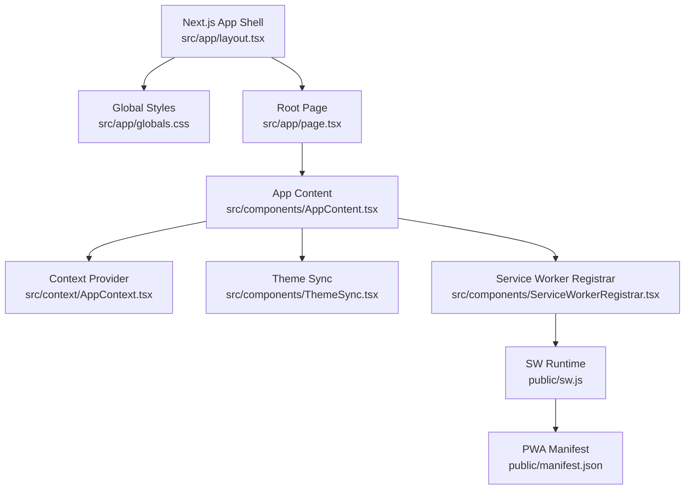
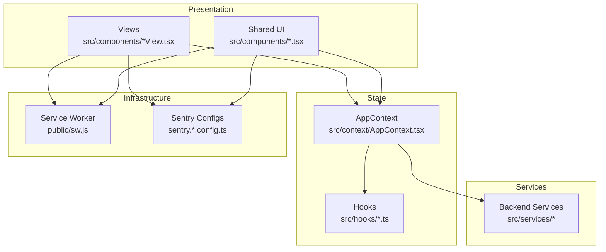
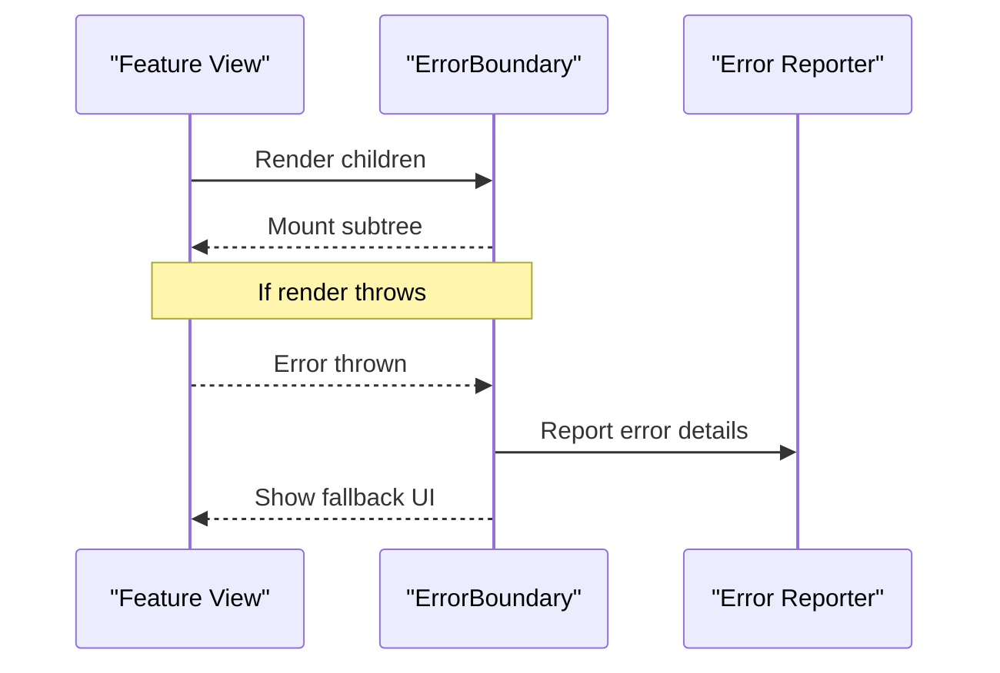
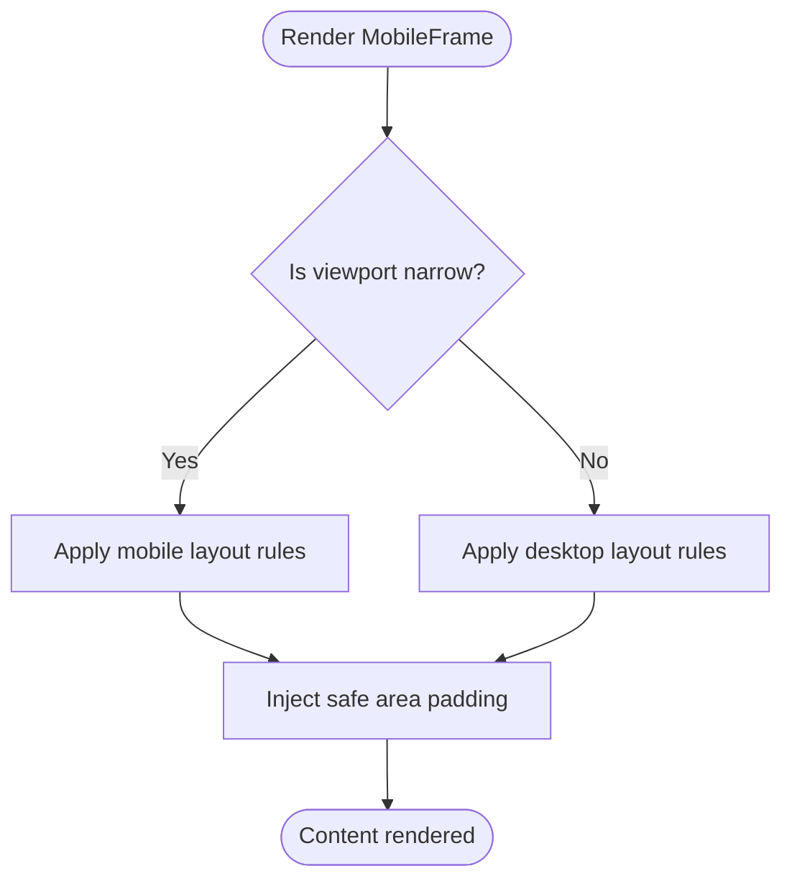
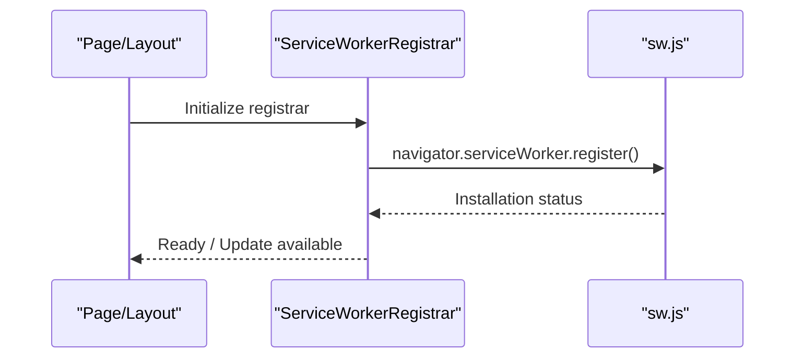
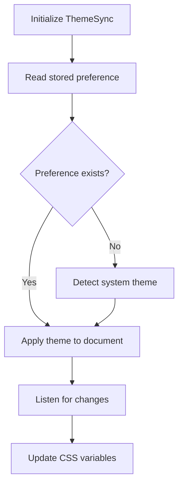
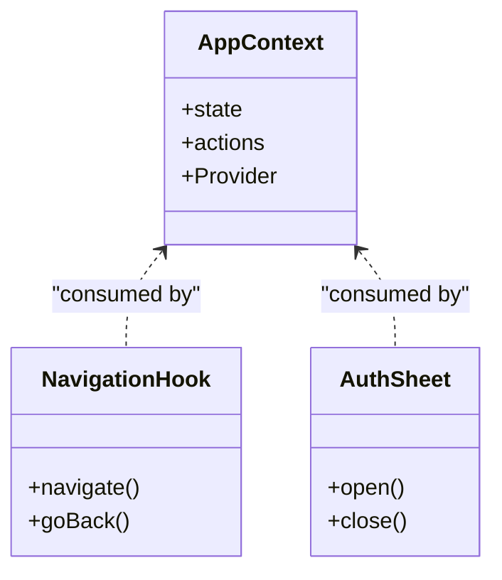
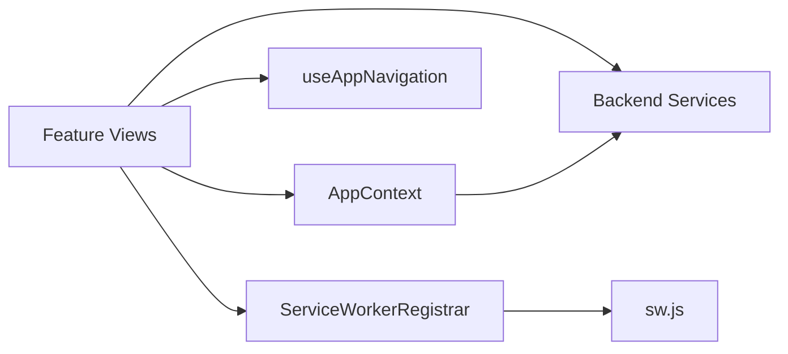

# Component Patterns & Guidelines

<cite>
**Referenced Files in This Document**
- [ErrorBoundary.tsx](file://src/components/ErrorBoundary.tsx)
- [ThemeSync.tsx](file://src/components/ThemeSync.tsx)
- [ServiceWorkerRegistrar.tsx](file://src/components/ServiceWorkerRegistrar.tsx)
- [AppContext.tsx](file://src/context/AppContext.tsx)
- [useAppNavigation.ts](file://src/hooks/useAppNavigation.ts)
- [MobileFrame.tsx](file://src/components/MobileFrame.tsx)
- [layout.tsx](file://src/app/layout.tsx)
- [page.tsx](file://src/app/page.tsx)
- [sw.js](file://public/sw.js)
- [manifest.json](file://public/manifest.json)
- [globals.css](file://src/app/globals.css)
- [AppContent.tsx](file://src/components/AppContent.tsx)
- [AuthSheet.tsx](file://src/components/AuthSheet.tsx)
- [ProductDetailsView.test.tsx](file://src/components/ProductDetailsView.test.tsx)
- [DiscoverFeedView.test.tsx](file://src/components/DiscoverFeedView.test.tsx)
- [AdminPanel.test.tsx](file://src/components/admin/AdminPanel.test.tsx)
- [vitest.config.mts](file://vitest.config.mts)
- [playwright.config.ts](file://playwright.config.ts)
- [sentry.client.config.ts](file://sentry.client.config.ts)
- [sentry.edge.config.ts](file://sentry.edge.config.ts)
- [sentry.server.config.ts](file://sentry.server.config.ts)
</cite>

## Table of Contents
1. Introduction
2. Project Structure
3. Core Components
4. Architecture Overview
5. Detailed Component Analysis
6. Dependency Analysis
7. Performance Considerations
8. Troubleshooting Guide
9. Conclusion
10. Appendices

## Introduction
This document codifies the established patterns, architectural guidelines, and development best practices used throughout the Mooday component library. It focuses on:
- Error boundary implementation for resilient UI
- Mobile-first design patterns and responsive behavior
- Service worker registration for offline and PWA capabilities
- Theme synchronization across client, edge, and server contexts
- Context-based state management for global application state
- Naming conventions, file organization, testing strategies, and performance optimization techniques
- Guidelines for creating new components that follow these patterns consistently

## Project Structure
Mooday is a Next.js application with a clear separation between UI components, context/state, hooks, services, data, and types. Key directories:
- src/app: App shell, pages, layout, and global styles
- src/components: Feature-oriented React components (views, shared UI)
- src/context: Global state via React context
- src/hooks: Reusable logic encapsulated as hooks
- src/services: Backend integration and service layer
- src/data: Static or mock datasets
- public: Static assets including manifest and service worker
- tests/e2e: End-to-end tests using Playwright
- Root config files for testing, linting, Sentry, and build

**Diagram sources**
- [layout.tsx:1-200](file://src/app/layout.tsx#L1-L200)
- [page.tsx:1-200](file://src/app/page.tsx#L1-L200)
- [AppContent.tsx:1-200](file://src/components/AppContent.tsx#L1-L200)
- [AppContext.tsx:1-200](file://src/context/AppContext.tsx#L1-L200)
- [ThemeSync.tsx:1-200](file://src/components/ThemeSync.tsx#L1-L200)
- [ServiceWorkerRegistrar.tsx:1-200](file://src/components/ServiceWorkerRegistrar.tsx#L1-L200)
- [sw.js:1-200](file://public/sw.js#L1-L200)
- [manifest.json:1-200](file://public/manifest.json#L1-L200)

**Section sources**
- [layout.tsx:1-200](file://src/app/layout.tsx#L1-L200)
- [page.tsx:1-200](file://src/app/page.tsx#L1-L200)
- [AppContent.tsx:1-200](file://src/components/AppContent.tsx#L1-L200)
- [AppContext.tsx:1-200](file://src/context/AppContext.tsx#L1-L200)
- [ThemeSync.tsx:1-200](file://src/components/ThemeSync.tsx#L1-L200)
- [ServiceWorkerRegistrar.tsx:1-200](file://src/components/ServiceWorkerRegistrar.tsx#L1-L200)
- [sw.js:1-200](file://public/sw.js#L1-L200)
- [manifest.json:1-200](file://public/manifest.json#L1-L200)

## Core Components
- ErrorBoundary: Wraps feature views to catch rendering errors and present a graceful fallback instead of crashing the app.
- ThemeSync: Synchronizes theme preferences across browser storage and CSS custom properties; ensures consistent light/dark mode.
- ServiceWorkerRegistrar: Registers the service worker at runtime and handles lifecycle events for caching and offline support.
- AppContext: Centralized state provider for navigation, user session, and cross-cutting concerns.
- MobileFrame: Provides mobile-first layout constraints and safe-area handling for small screens.

These components are composed in the app shell and page entry points to ensure consistent behavior across routes.

**Section sources**
- [ErrorBoundary.tsx:1-200](file://src/components/ErrorBoundary.tsx#L1-L200)
- [ThemeSync.tsx:1-200](file://src/components/ThemeSync.tsx#L1-L200)
- [ServiceWorkerRegistrar.tsx:1-200](file://src/components/ServiceWorkerRegistrar.tsx#L1-L200)
- [AppContext.tsx:1-200](file://src/context/AppContext.tsx#L1-L200)
- [MobileFrame.tsx:1-200](file://src/components/MobileFrame.tsx#L1-L200)

## Architecture Overview
The application follows a layered architecture:
- Presentation: React components organized by feature/views
- State: Context providers for global state and hooks for local state
- Services: Backend integrations and data mappers
- Infrastructure: Service worker, Sentry error tracking, and PWA assets

**Diagram sources**
- [AppContext.tsx:1-200](file://src/context/AppContext.tsx#L1-L200)
- [useAppNavigation.ts:1-200](file://src/hooks/useAppNavigation.ts#L1-L200)
- [sw.js:1-200](file://public/sw.js#L1-L200)
- [sentry.client.config.ts:1-200](file://sentry.client.config.ts#L1-L200)
- [sentry.edge.config.ts:1-200](file://sentry.edge.config.ts#L1-L200)
- [sentry.server.config.ts:1-200](file://sentry.server.config.ts#L1-L200)

## Detailed Component Analysis

### Error Boundary Implementation
Purpose:
- Catch synchronous and asynchronous rendering errors within a subtree
- Provide a user-friendly fallback UI
- Log errors to monitoring systems

Key behaviors:
- Wraps route-level views to isolate failures
- Displays recovery actions (retry, navigate back)
- Integrates with error reporting where configured

**Diagram sources**
- [ErrorBoundary.tsx:1-200](file://src/components/ErrorBoundary.tsx#L1-L200)

**Section sources**
- [ErrorBoundary.tsx:1-200](file://src/components/ErrorBoundary.tsx#L1-L200)

### Mobile-First Design Patterns
Guidelines:
- Use MobileFrame to constrain content width and handle safe areas on small devices
- Prefer fluid typography and spacing scales
- Ensure touch targets meet accessibility standards
- Test layouts at common breakpoints and device sizes

**Diagram sources**
- [MobileFrame.tsx:1-200](file://src/components/MobileFrame.tsx#L1-L200)
- [globals.css:1-200](file://src/app/globals.css#L1-L200)

**Section sources**
- [MobileFrame.tsx:1-200](file://src/components/MobileFrame.tsx#L1-L200)
- [globals.css:1-200](file://src/app/globals.css#L1-L200)

### Service Worker Registration
Purpose:
- Enable offline caching and background sync
- Improve perceived performance via asset caching
- Support PWA installability

Registration flow:
- Register sw.js from the root page or layout
- Handle update and cache lifecycle events
- Validate environment before registering (client-side only)

**Diagram sources**
- [ServiceWorkerRegistrar.tsx:1-200](file://src/components/ServiceWorkerRegistrar.tsx#L1-L200)
- [sw.js:1-200](file://public/sw.js#L1-L200)
- [page.tsx:1-200](file://src/app/page.tsx#L1-L200)

**Section sources**
- [ServiceWorkerRegistrar.tsx:1-200](file://src/components/ServiceWorkerRegistrar.tsx#L1-L200)
- [sw.js:1-200](file://public/sw.js#L1-L200)
- [page.tsx:1-200](file://src/app/page.tsx#L1-L200)

### Theme Synchronization
Goals:
- Persist user’s theme preference
- Sync theme across tabs and sessions
- Apply theme early to avoid flash of unstyled content

Mechanics:
- Read/write theme from localStorage/sessionStorage
- Update CSS custom properties on document root
- Respect system preference when no user choice exists

**Diagram sources**
- [ThemeSync.tsx:1-200](file://src/components/ThemeSync.tsx#L1-L200)
- [globals.css:1-200](file://src/app/globals.css#L1-L200)

**Section sources**
- [ThemeSync.tsx:1-200](file://src/components/ThemeSync.tsx#L1-L200)
- [globals.css:1-200](file://src/app/globals.css#L1-L200)

### Context-Based State Management
Approach:
- Use a single AppContext to hold global state such as navigation, user session, and feature flags
- Expose typed hooks for consuming state and actions
- Keep context lean; delegate complex logic to hooks and services

**Diagram sources**
- [AppContext.tsx:1-200](file://src/context/AppContext.tsx#L1-L200)
- [useAppNavigation.ts:1-200](file://src/hooks/useAppNavigation.ts#L1-L200)
- [AuthSheet.tsx:1-200](file://src/components/AuthSheet.tsx#L1-L200)

**Section sources**
- [AppContext.tsx:1-200](file://src/context/AppContext.tsx#L1-L200)
- [useAppNavigation.ts:1-200](file://src/hooks/useAppNavigation.ts#L1-L200)
- [AuthSheet.tsx:1-200](file://src/components/AuthSheet.tsx#L1-L200)

## Dependency Analysis
Component relationships and coupling:
- Views depend on AppContext for navigation and session state
- Shared UI components remain framework-agnostic and accept props
- Service layer abstracts backend calls; components should not call APIs directly
- Service worker is independent but referenced by the registrar

**Diagram sources**
- [AppContext.tsx:1-200](file://src/context/AppContext.tsx#L1-L200)
- [useAppNavigation.ts:1-200](file://src/hooks/useAppNavigation.ts#L1-L200)
- [ServiceWorkerRegistrar.tsx:1-200](file://src/components/ServiceWorkerRegistrar.tsx#L1-L200)
- [sw.js:1-200](file://public/sw.js#L1-L200)

**Section sources**
- [AppContext.tsx:1-200](file://src/context/AppContext.tsx#L1-L200)
- [useAppNavigation.ts:1-200](file://src/hooks/useAppNavigation.ts#L1-L200)
- [ServiceWorkerRegistrar.tsx:1-200](file://src/components/ServiceWorkerRegistrar.tsx#L1-L200)
- [sw.js:1-200](file://public/sw.js#L1-L200)

## Performance Considerations
- Code splitting and lazy loading for heavy views
- Memoization for expensive computations and list rendering
- Image optimization via Next.js image pipeline
- Debounce/throttle for frequent interactions (search, scroll)
- Minimize re-renders by lifting state judiciously and using stable references
- Cache API responses where appropriate and invalidate on mutations
- Use service worker caching for static assets and repeatable requests

[No sources needed since this section provides general guidance]

## Troubleshooting Guide
Common issues and resolutions:
- Rendering errors: Wrap failing subtrees with ErrorBoundary; check logs in monitoring
- Theme flicker: Ensure ThemeSync runs before paint; set initial theme in HTML head
- Service worker not updating: Clear caches and force reload; verify registration path
- Offline behavior: Validate sw.js caching strategy; test network throttling
- Context state inconsistencies: Normalize updates via actions; avoid direct state mutation

**Section sources**
- [ErrorBoundary.tsx:1-200](file://src/components/ErrorBoundary.tsx#L1-L200)
- [ThemeSync.tsx:1-200](file://src/components/ThemeSync.tsx#L1-L200)
- [ServiceWorkerRegistrar.tsx:1-200](file://src/components/ServiceWorkerRegistrar.tsx#L1-L200)
- [sentry.client.config.ts:1-200](file://sentry.client.config.ts#L1-L200)
- [sentry.edge.config.ts:1-200](file://sentry.edge.config.ts#L1-L200)
- [sentry.server.config.ts:1-200](file://sentry.server.config.ts#L1-L200)

## Conclusion
Mooday’s component library emphasizes resilience, consistency, and maintainability through:
- Robust error boundaries
- Mobile-first responsive patterns
- Reliable service worker registration
- Centralized theme synchronization
- Clean context-based state management
Adhering to these patterns ensures predictable behavior, easier onboarding, and scalable growth across the marketplace application.

[No sources needed since this section summarizes without analyzing specific files]

## Appendices

### Naming Conventions
- Components: PascalCase filenames; descriptive names reflecting purpose (e.g., ProductDetailsView.tsx)
- Hooks: camelCase starting with use (e.g., useAppNavigation.ts)
- Context: PascalCase with “Context” suffix (e.g., AppContext.tsx)
- Services: camelCase modules grouped by domain (e.g., services/backend/*.ts)
- Tests: co-located with .test.tsx next to source files

**Section sources**
- [ProductDetailsView.test.tsx:1-200](file://src/components/ProductDetailsView.test.tsx#L1-L200)
- [DiscoverFeedView.test.tsx:1-200](file://src/components/DiscoverFeedView.test.tsx#L1-L200)
- [AdminPanel.test.tsx:1-200](file://src/components/admin/AdminPanel.test.tsx#L1-L200)

### File Organization
- Feature-based grouping under src/components (views, shared UI)
- Domain-specific services under src/services
- Data fixtures under src/data
- Types under src/types
- Tests colocated with source or under tests/e2e for Playwright

**Section sources**
- [AppContent.tsx:1-200](file://src/components/AppContent.tsx#L1-L200)
- [AppContext.tsx:1-200](file://src/context/AppContext.tsx#L1-L200)

### Testing Strategies
- Unit tests: Vitest configuration and setup for React components and utilities
- E2E tests: Playwright configuration for critical flows
- Mocking: Isolate external dependencies (services, storage) in tests

**Section sources**
- [vitest.config.mts:1-200](file://vitest.config.mts#L1-L200)
- [playwright.config.ts:1-200](file://playwright.config.ts#L1-L200)
- [ProductDetailsView.test.tsx:1-200](file://src/components/ProductDetailsView.test.tsx#L1-L200)
- [DiscoverFeedView.test.tsx:1-200](file://src/components/DiscoverFeedView.test.tsx#L1-L200)
- [AdminPanel.test.tsx:1-200](file://src/components/admin/AdminPanel.test.tsx#L1-L200)

### Creating New Components: Checklist
- Place feature view under src/components with a descriptive name
- Wrap with ErrorBoundary if it contains risky rendering logic
- Use AppContext for global state; prefer hooks for local state
- Follow mobile-first styling; test on small viewports
- Register service worker once at app level; avoid per-component registration
- Add unit tests colocated with the component
- Integrate Sentry for error reporting where applicable

**Section sources**
- [ErrorBoundary.tsx:1-200](file://src/components/ErrorBoundary.tsx#L1-L200)
- [AppContext.tsx:1-200](file://src/context/AppContext.tsx#L1-L200)
- [ThemeSync.tsx:1-200](file://src/components/ThemeSync.tsx#L1-L200)
- [ServiceWorkerRegistrar.tsx:1-200](file://src/components/ServiceWorkerRegistrar.tsx#L1-L200)
- [sentry.client.config.ts:1-200](file://sentry.client.config.ts#L1-L200)