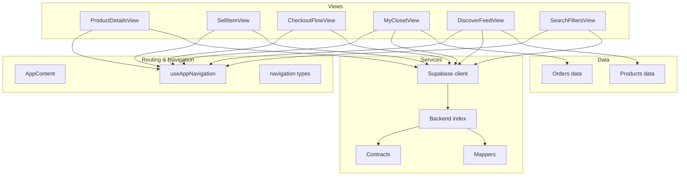
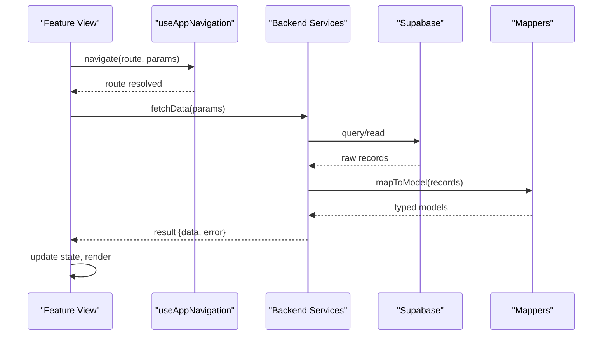
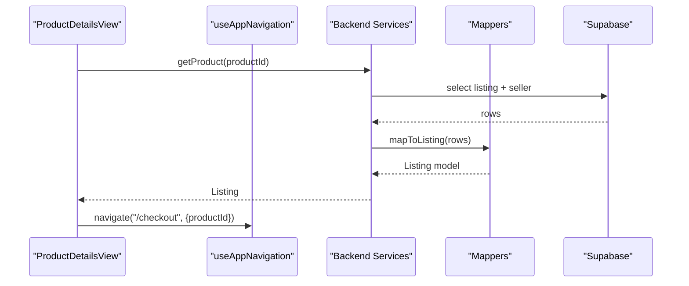
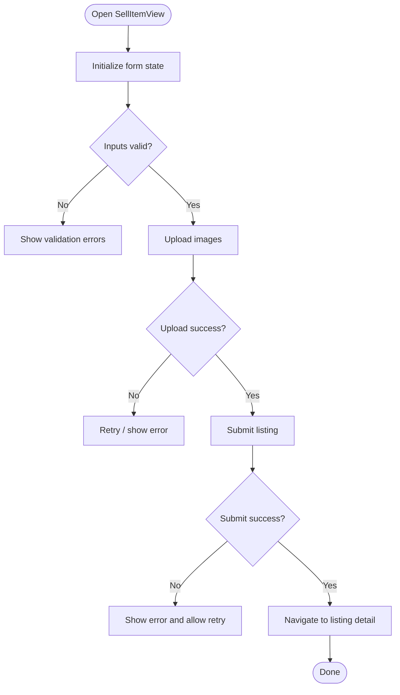
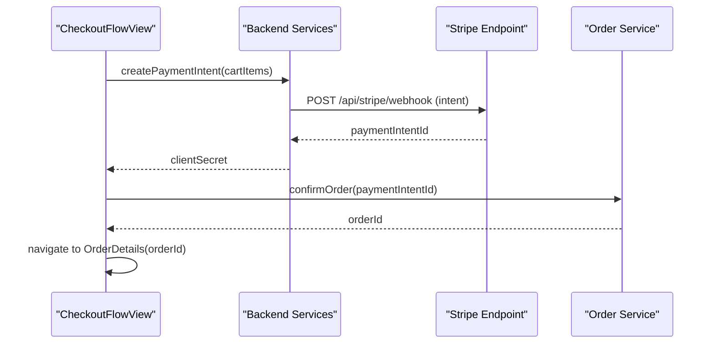
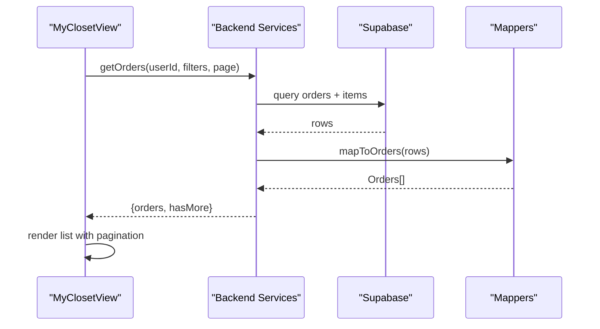
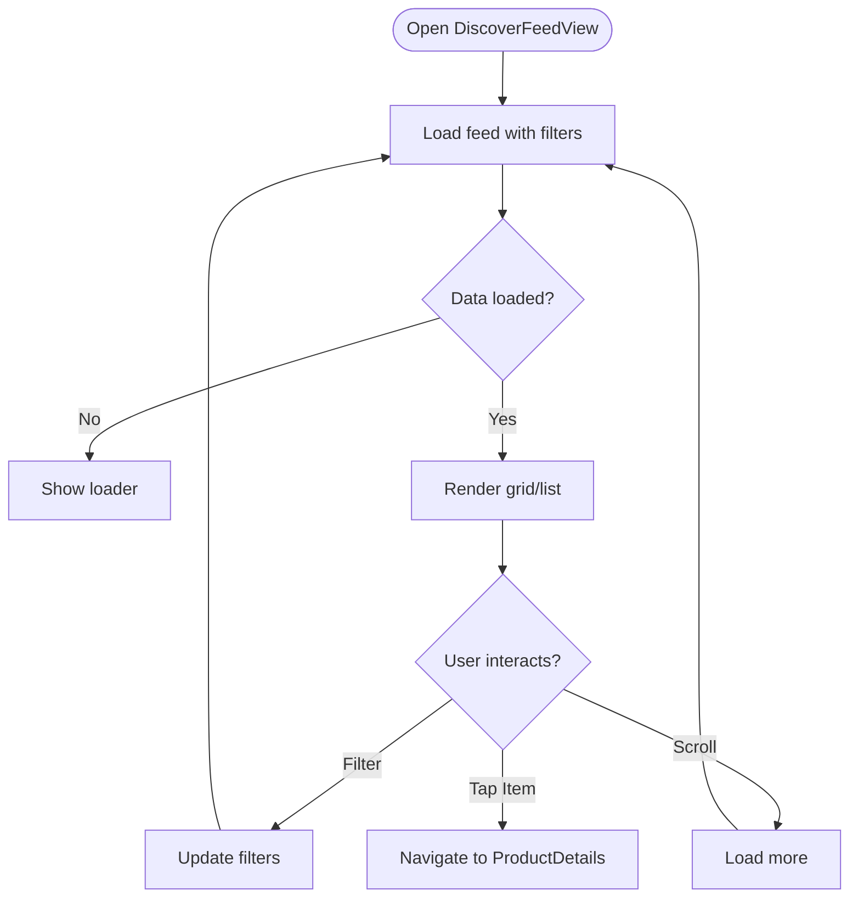
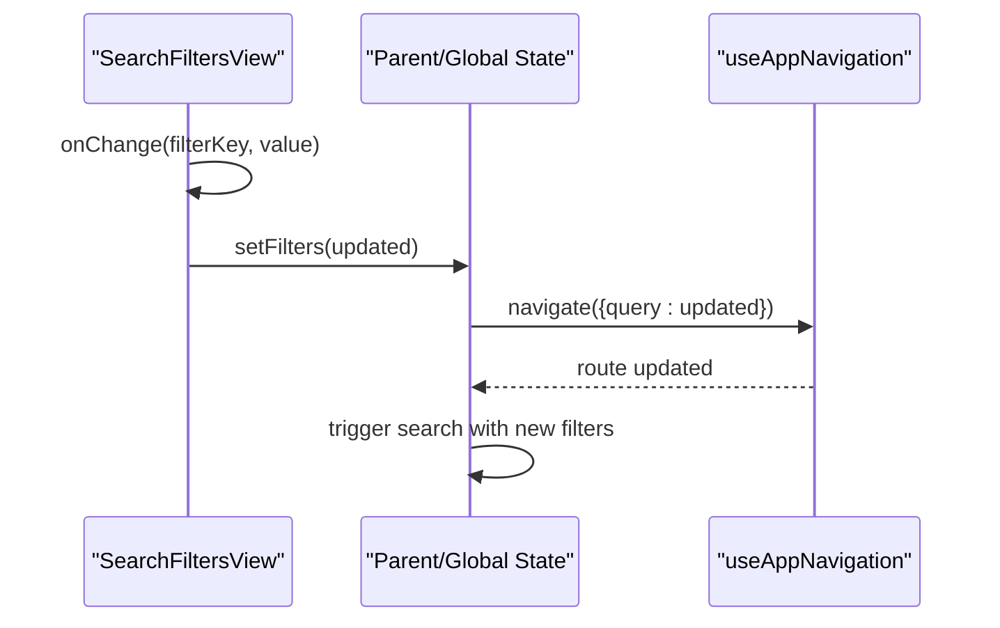
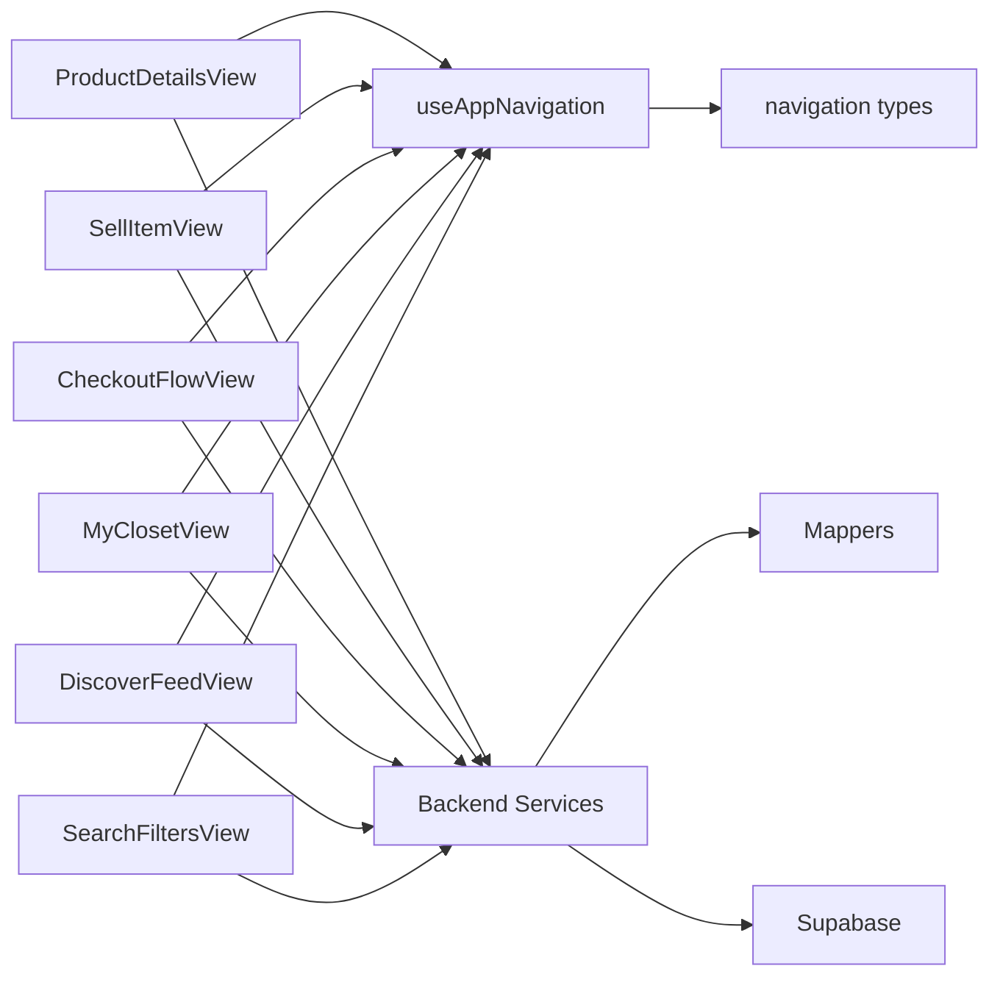

# Feature Views

<cite>
**Referenced Files in This Document**
- [ProductDetailsView.tsx](file://src/components/ProductDetailsView.tsx)
- [SellItemView.tsx](file://src/components/SellItemView.tsx)
- [CheckoutFlowView.tsx](file://src/components/CheckoutFlowView.tsx)
- [MyClosetView.tsx](file://src/components/MyClosetView.tsx)
- [DiscoverFeedView.tsx](file://src/components/DiscoverFeedView.tsx)
- [SearchFiltersView.tsx](file://src/components/SearchFiltersView.tsx)
- [AppContent.tsx](file://src/components/AppContent.tsx)
- [useAppNavigation.ts](file://src/hooks/useAppNavigation.ts)
- [navigation.ts](file://src/types/navigation.ts)
- [supabase.ts](file://src/services/backend/supabase.ts)
- [index.ts](file://src/services/backend/index.ts)
- [contracts.ts](file://src/services/backend/contracts.ts)
- [mappers.ts](file://src/services/backend/mappers.ts)
- [products.ts](file://src/data/products.ts)
- [orders.ts](file://src/data/orders.ts)
- [listingForm.tsx](file://src/components/listing/ListingForm.tsx)
- [ErrorBoundary.tsx](file://src/components/ErrorBoundary.tsx)
</cite>

## Table of Contents
1. [Introduction](#introduction)
2. [Project Structure](#project-structure)
3. [Core Components](#core-components)
4. [Architecture Overview](#architecture-overview)
5. [Detailed Component Analysis](#detailed-component-analysis)
6. [Dependency Analysis](#dependency-analysis)
7. [Performance Considerations](#performance-considerations)
8. [Troubleshooting Guide](#troubleshooting-guide)
9. [Conclusion](#conclusion)

## Introduction
This document provides comprehensive documentation for feature-specific view components that represent major user flows in the Mooday marketplace. It focuses on complex views including ProductDetailsView, SellItemView, CheckoutFlowView, MyClosetView, DiscoverFeedView, and SearchFiltersView. For each view, we explain its role in orchestrating business logic, managing state, coordinating with services, handling props and events, data flow patterns, integration with routing and navigation, common usage patterns, error handling strategies, and performance considerations for large datasets.

## Project Structure
The feature views live under src/components and are orchestrated by application-level routing and navigation utilities. Data is sourced from backend services (Supabase-based) and local data modules when appropriate. Navigation types and hooks centralize route definitions and transitions.

**Diagram sources**
- [AppContent.tsx:1-200](file://src/components/AppContent.tsx#L1-L200)
- [useAppNavigation.ts:1-200](file://src/hooks/useAppNavigation.ts#L1-L200)
- [navigation.ts:1-200](file://src/types/navigation.ts#L1-L200)
- [supabase.ts:1-200](file://src/services/backend/supabase.ts#L1-L200)
- [index.ts:1-200](file://src/services/backend/index.ts#L1-L200)
- [contracts.ts:1-200](file://src/services/backend/contracts.ts#L1-L200)
- [mappers.ts:1-200](file://src/services/backend/mappers.ts#L1-L200)
- [products.ts:1-200](file://src/data/products.ts#L1-L200)
- [orders.ts:1-200](file://src/data/orders.ts#L1-L200)

**Section sources**
- [AppContent.tsx:1-200](file://src/components/AppContent.tsx#L1-L200)
- [useAppNavigation.ts:1-200](file://src/hooks/useAppNavigation.ts#L1-L200)
- [navigation.ts:1-200](file://src/types/navigation.ts#L1-L200)

## Core Components
This section summarizes the responsibilities and interactions of each key view component.

- ProductDetailsView
  - Displays detailed information about a product listing.
  - Orchestrates fetching product details, seller info, and related media.
  - Coordinates with navigation to actions like Add to Cart or Buy Now.
  - Integrates with services to read listings and related entities.

- SellItemView
  - Guides sellers through creating or editing a listing.
  - Manages form state, validation, and image uploads.
  - Submits listing data via backend services and navigates to confirmation or listing detail.

- CheckoutFlowView
  - Manages the purchase flow: cart review, payment intent creation, and order confirmation.
  - Coordinates with Stripe integration and order service.
  - Handles success/error states and navigates to order details or back to catalog.

- MyClosetView
  - Shows the current user’s owned items and their statuses.
  - Fetches orders and item details; supports filtering and pagination.
  - Navigates to order details or chat as needed.

- DiscoverFeedView
  - Presents a feed of listings for discovery.
  - Supports pagination, category filters, and sorting.
  - Uses services to fetch listings and maps them to UI models.

- SearchFiltersView
  - Provides filter controls (category, brand, price range, etc.).
  - Emits filter changes to parent or global state and triggers search updates.
  - Integrates with routing to persist filter parameters.

**Section sources**
- [ProductDetailsView.tsx:1-200](file://src/components/ProductDetailsView.tsx#L1-L200)
- [SellItemView.tsx:1-200](file://src/components/SellItemView.tsx#L1-L200)
- [CheckoutFlowView.tsx:1-200](file://src/components/CheckoutFlowView.tsx#L1-L200)
- [MyClosetView.tsx:1-200](file://src/components/MyClosetView.tsx#L1-L200)
- [DiscoverFeedView.tsx:1-200](file://src/components/DiscoverFeedView.tsx#L1-L200)
- [SearchFiltersView.tsx:1-200](file://src/components/SearchFiltersView.tsx#L1-L200)

## Architecture Overview
The feature views follow a consistent pattern:
- State management: Local state for UI, optional global context for cross-view state.
- Service layer: Backend services encapsulate Supabase calls, mapping, and contracts.
- Routing: Centralized navigation types and hooks drive transitions and parameter passing.
- Data flow: Views request data via services, handle loading/error states, and render UI.

**Diagram sources**
- [useAppNavigation.ts:1-200](file://src/hooks/useAppNavigation.ts#L1-L200)
- [supabase.ts:1-200](file://src/services/backend/supabase.ts#L1-L200)
- [mappers.ts:1-200](file://src/services/backend/mappers.ts#L1-L200)
- [index.ts:1-200](file://src/services/backend/index.ts#L1-L200)

## Detailed Component Analysis

### ProductDetailsView
Responsibilities:
- Load and display product details, images, pricing, and seller information.
- Handle user actions such as adding to cart or initiating checkout.
- Manage loading and error states for network requests.

State and Props:
- Props include product identifier and any contextual flags (e.g., edit mode).
- Internal state tracks loading, errors, and selected media.

Service Integration:
- Reads product data via backend services using Supabase client.
- Maps raw records to typed models for safe consumption.

Navigation:
- Uses navigation hook to go to cart, checkout, or seller profile.

Common Usage Patterns:
- Render skeleton while loading.
- Show actionable buttons only when product is available and not sold.

Error Handling:
- Display user-friendly messages on failure and allow retry.

Performance:
- Defer heavy operations until needed.
- Avoid re-fetching if product id remains unchanged.

**Diagram sources**
- [ProductDetailsView.tsx:1-200](file://src/components/ProductDetailsView.tsx#L1-L200)
- [useAppNavigation.ts:1-200](file://src/hooks/useAppNavigation.ts#L1-L200)
- [supabase.ts:1-200](file://src/services/backend/supabase.ts#L1-L200)
- [mappers.ts:1-200](file://src/services/backend/mappers.ts#L1-L200)

**Section sources**
- [ProductDetailsView.tsx:1-200](file://src/components/ProductDetailsView.tsx#L1-L200)
- [useAppNavigation.ts:1-200](file://src/hooks/useAppNavigation.ts#L1-L200)
- [supabase.ts:1-200](file://src/services/backend/supabase.ts#L1-L200)
- [mappers.ts:1-200](file://src/services/backend/mappers.ts#L1-L200)

### SellItemView
Responsibilities:
- Orchestrate listing creation/editing workflow.
- Manage form inputs, validations, and media uploads.
- Submit listing data and navigate to confirmation or listing detail.

State and Props:
- Props may include an existing listing id for editing.
- Internal state holds form values, validation errors, and upload progress.

Service Integration:
- Creates or updates listings via backend services.
- Uploads media and associates them with the listing.

Navigation:
- On success, navigates to listing detail or my closet.

Common Usage Patterns:
- Progressive disclosure of fields based on category.
- Debounced validation to reduce overhead.

Error Handling:
- Surface validation errors inline.
- Provide retry for failed uploads.

Performance:
- Batch updates where possible.
- Use optimistic UI for non-critical actions.

**Diagram sources**
- [SellItemView.tsx:1-200](file://src/components/SellItemView.tsx#L1-L200)
- [ListingForm.tsx:1-200](file://src/components/listing/ListingForm.tsx#L1-L200)
- [supabase.ts:1-200](file://src/services/backend/supabase.ts#L1-L200)

**Section sources**
- [SellItemView.tsx:1-200](file://src/components/SellItemView.tsx#L1-L200)
- [ListingForm.tsx:1-200](file://src/components/listing/ListingForm.tsx#L1-L200)
- [supabase.ts:1-200](file://src/services/backend/supabase.ts#L1-L200)

### CheckoutFlowView
Responsibilities:
- Manage checkout steps: cart review, payment method selection, and payment confirmation.
- Create payment intents and finalize orders.
- Handle success and error states and navigate accordingly.

State and Props:
- Props include cart items or selected products.
- Internal state tracks step progression, payment status, and errors.

Service Integration:
- Uses backend services to create payment intents and place orders.
- Integrates with Stripe via server-side endpoints.

Navigation:
- On success, navigates to order details; on failure, returns to cart or shows error.

Common Usage Patterns:
- Step-by-step wizard with clear progress indicators.
- Idempotent operations to prevent duplicate charges.

Error Handling:
- Graceful fallbacks for network failures and payment errors.
- Clear messaging and retry options.

Performance:
- Minimize re-renders during payment processing.
- Cache intermediate results where safe.

**Diagram sources**
- [CheckoutFlowView.tsx:1-200](file://src/components/CheckoutFlowView.tsx#L1-L200)
- [index.ts:1-200](file://src/services/backend/index.ts#L1-L200)
- [orders.ts:1-200](file://src/data/orders.ts#L1-L200)

**Section sources**
- [CheckoutFlowView.tsx:1-200](file://src/components/CheckoutFlowView.tsx#L1-L200)
- [index.ts:1-200](file://src/services/backend/index.ts#L1-L200)
- [orders.ts:1-200](file://src/data/orders.ts#L1-L200)

### MyClosetView
Responsibilities:
- Display the current user’s purchased items and their statuses.
- Support filtering, pagination, and navigation to order details.

State and Props:
- Props may include filters and pagination params.
- Internal state manages list data, loading, and errors.

Service Integration:
- Fetches orders and associated items via backend services.
- Maps records to UI models.

Navigation:
- Navigates to order details or chat from item actions.

Common Usage Patterns:
- Skeleton loaders for initial load.
- Infinite scroll or page-based pagination.

Error Handling:
- Retry on failure and show friendly messages.

Performance:
- Paginate large lists.
- Memoize expensive computations.

**Diagram sources**
- [MyClosetView.tsx:1-200](file://src/components/MyClosetView.tsx#L1-L200)
- [supabase.ts:1-200](file://src/services/backend/supabase.ts#L1-L200)
- [mappers.ts:1-200](file://src/services/backend/mappers.ts#L1-L200)

**Section sources**
- [MyClosetView.tsx:1-200](file://src/components/MyClosetView.tsx#L1-L200)
- [supabase.ts:1-200](file://src/services/backend/supabase.ts#L1-L200)
- [mappers.ts:1-200](file://src/services/backend/mappers.ts#L1-L200)

### DiscoverFeedView
Responsibilities:
- Present a curated feed of listings for discovery.
- Support categories, brands, price ranges, and sorting.
- Implement pagination and lazy loading.

State and Props:
- Props include initial filters and pagination settings.
- Internal state manages feed data, active filters, and loading.

Service Integration:
- Fetches listings via backend services with query parameters.
- Maps records to UI models.

Navigation:
- Navigates to product details on item tap.

Common Usage Patterns:
- Virtualized lists for large datasets.
- Debounced filter changes.

Error Handling:
- Show empty states and retry options.

Performance:
- Use pagination and caching.
- Avoid unnecessary refetches.

**Diagram sources**
- [DiscoverFeedView.tsx:1-200](file://src/components/DiscoverFeedView.tsx#L1-L200)
- [products.ts:1-200](file://src/data/products.ts#L1-L200)
- [supabase.ts:1-200](file://src/services/backend/supabase.ts#L1-L200)

**Section sources**
- [DiscoverFeedView.tsx:1-200](file://src/components/DiscoverFeedView.tsx#L1-L200)
- [products.ts:1-200](file://src/data/products.ts#L1-L200)
- [supabase.ts:1-200](file://src/services/backend/supabase.ts#L1-L200)

### SearchFiltersView
Responsibilities:
- Provide filter controls for search queries (category, brand, price, etc.).
- Emit filter changes to trigger search updates.
- Persist filters in URL or global state.

State and Props:
- Props include current filters and callbacks for changes.
- Internal state mirrors active filters for UI consistency.

Service Integration:
- Triggers search via parent or global state; may call backend services indirectly.

Navigation:
- Updates route query parameters to reflect filters.

Common Usage Patterns:
- Controlled components bound to filter state.
- Reset and apply actions.

Error Handling:
- Validate filter values before applying.

Performance:
- Debounce filter application to avoid excessive requests.

**Diagram sources**
- [SearchFiltersView.tsx:1-200](file://src/components/SearchFiltersView.tsx#L1-L200)
- [useAppNavigation.ts:1-200](file://src/hooks/useAppNavigation.ts#L1-L200)

**Section sources**
- [SearchFiltersView.tsx:1-200](file://src/components/SearchFiltersView.tsx#L1-L200)
- [useAppNavigation.ts:1-200](file://src/hooks/useAppNavigation.ts#L1-L200)

## Dependency Analysis
The feature views depend on:
- Navigation utilities for routing and parameter handling.
- Backend services for data access and business operations.
- Mappers for transforming raw data into typed models.
- Data modules for static or seed data when applicable.

**Diagram sources**
- [useAppNavigation.ts:1-200](file://src/hooks/useAppNavigation.ts#L1-L200)
- [navigation.ts:1-200](file://src/types/navigation.ts#L1-L200)
- [index.ts:1-200](file://src/services/backend/index.ts#L1-L200)
- [mappers.ts:1-200](file://src/services/backend/mappers.ts#L1-L200)
- [supabase.ts:1-200](file://src/services/backend/supabase.ts#L1-L200)

**Section sources**
- [useAppNavigation.ts:1-200](file://src/hooks/useAppNavigation.ts#L1-L200)
- [navigation.ts:1-200](file://src/types/navigation.ts#L1-L200)
- [index.ts:1-200](file://src/services/backend/index.ts#L1-L200)
- [mappers.ts:1-200](file://src/services/backend/mappers.ts#L1-L200)
- [supabase.ts:1-200](file://src/services/backend/supabase.ts#L1-L200)

## Performance Considerations
- Pagination and virtualization: Use page-based or infinite scrolling for large lists in DiscoverFeedView and MyClosetView.
- Debouncing: Apply debounced input handling in SearchFiltersView to reduce request frequency.
- Memoization: Memoize derived data and expensive computations within views.
- Optimistic updates: For non-critical actions (e.g., likes), update UI immediately and reconcile later.
- Image optimization: Lazy-load images and use appropriate sizes for listings.
- Caching: Cache repeated reads where safe to reduce network overhead.

[No sources needed since this section provides general guidance]

## Troubleshooting Guide
Common issues and strategies:
- Network errors: Implement retry logic and user-friendly error messages in all views.
- Payment failures: Ensure robust error handling in CheckoutFlowView with clear next steps.
- Form validation: Provide inline feedback in SellItemView to guide users.
- Large datasets: Monitor memory usage and consider virtualization for long lists.
- Navigation pitfalls: Verify route parameters and guards to prevent invalid states.

Use ErrorBoundary to catch rendering errors and provide recovery options.

**Section sources**
- [ErrorBoundary.tsx:1-200](file://src/components/ErrorBoundary.tsx#L1-L200)

## Conclusion
The feature views in Mooday implement a consistent architecture centered around clear separation of concerns: views manage UI state and orchestration, services encapsulate data and business logic, and navigation utilities standardize routing. By following the patterns outlined here—structured state management, robust error handling, and performance-conscious design—you can extend and maintain these components effectively as the marketplace evolves.

[No sources needed since this section summarizes without analyzing specific files]