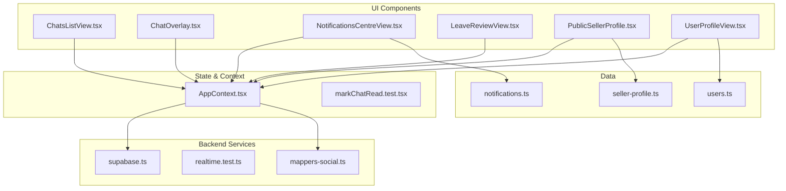
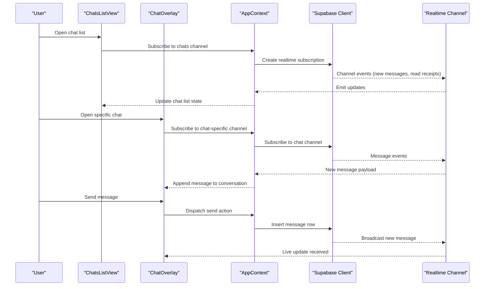
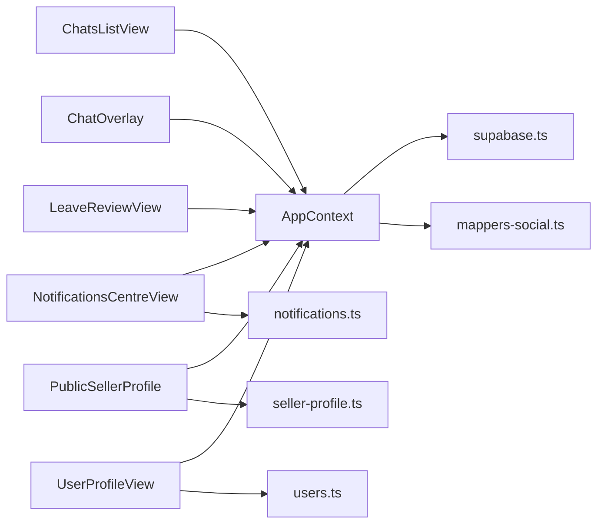

# Social & Messaging Components

<cite>
**Referenced Files in This Document**
- [ChatsListView.tsx](file://src/components/ChatsListView.tsx)
- [ChatOverlay.tsx](file://src/components/ChatOverlay.tsx)
- [NotificationsCentreView.tsx](file://src/components/NotificationsCentreView.tsx)
- [LeaveReviewView.tsx](file://src/components/LeaveReviewView.tsx)
- [PublicSellerProfile.tsx](file://src/components/PublicSellerProfile.tsx)
- [UserProfileView.tsx](file://src/components/UserProfileView.tsx)
- [AppContext.tsx](file://src/context/AppContext.tsx)
- [markChatRead.test.tsx](file://src/context/markChatRead.test.tsx)
- [supabase.ts](file://src/services/backend/supabase.ts)
- [realtime.test.ts](file://src/services/backend/realtime.test.ts)
- [mappers-social.ts](file://src/services/backend/mappers-social.ts)
- [notifications.ts](file://src/data/notifications.ts)
- [seller-profile.ts](file://src/data/seller-profile.ts)
- [users.ts](file://src/data/users.ts)
- [progress-u7-chat.md](file://docs/progress-u7-chat.md)
- [progress-u6-reviews.md](file://docs/progress-u6-reviews.md)
- [public-seller-profile.md](file://docs/public-seller-profile.md)
</cite>

## Table of Contents
1. Introduction
2. Project Structure
3. Core Components
4. Architecture Overview
5. Detailed Component Analysis
6. Dependency Analysis
7. Performance Considerations
8. Troubleshooting Guide
9. Conclusion

## Introduction
This document provides comprehensive documentation for the social interaction and messaging components: ChatsListView, ChatOverlay, NotificationsCentreView, LeaveReviewView, PublicSellerProfile, and UserProfileView. It explains real-time communication patterns, notification handling, review submission workflows, and profile management features. It also covers WebSocket integration via Supabase Realtime, message synchronization, and state management for live updates. Practical examples are included to guide implementation of chat functionality, managing notifications, and creating interactive social features while maintaining performance and user experience quality.

## Project Structure
The social and messaging features span UI components, application context/state, backend services (Supabase), and data models. The key files involved include:
- UI components for chat, notifications, reviews, and profiles
- Application context for global state and real-time subscriptions
- Backend service layer for Supabase client and realtime utilities
- Data modules for mock or seed data used during development/testing

**Diagram sources**
- [ChatsListView.tsx](file://src/components/ChatsListView.tsx)
- [ChatOverlay.tsx](file://src/components/ChatOverlay.tsx)
- [NotificationsCentreView.tsx](file://src/components/NotificationsCentreView.tsx)
- [LeaveReviewView.tsx](file://src/components/LeaveReviewView.tsx)
- [PublicSellerProfile.tsx](file://src/components/PublicSellerProfile.tsx)
- [UserProfileView.tsx](file://src/components/UserProfileView.tsx)
- [AppContext.tsx](file://src/context/AppContext.tsx)
- [supabase.ts](file://src/services/backend/supabase.ts)
- [mappers-social.ts](file://src/services/backend/mappers-social.ts)
- [notifications.ts](file://src/data/notifications.ts)
- [seller-profile.ts](file://src/data/seller-profile.ts)
- [users.ts](file://src/data/users.ts)

**Section sources**
- [ChatsListView.tsx](file://src/components/ChatsListView.tsx)
- [ChatOverlay.tsx](file://src/components/ChatOverlay.tsx)
- [NotificationsCentreView.tsx](file://src/components/NotificationsCentreView.tsx)
- [LeaveReviewView.tsx](file://src/components/LeaveReviewView.tsx)
- [PublicSellerProfile.tsx](file://src/components/PublicSellerProfile.tsx)
- [UserProfileView.tsx](file://src/components/UserProfileView.tsx)
- [AppContext.tsx](file://src/context/AppContext.tsx)
- [supabase.ts](file://src/services/backend/supabase.ts)
- [mappers-social.ts](file://src/services/backend/mappers-social.ts)
- [notifications.ts](file://src/data/notifications.ts)
- [seller-profile.ts](file://src/data/seller-profile.ts)
- [users.ts](file://src/data/users.ts)

## Core Components
- ChatsListView: Displays a list of conversations with unread indicators and navigation into active chats. Integrates with AppContext for chat state and real-time updates.
- ChatOverlay: Renders an active conversation view with message input, sending, receiving, and read receipts. Uses Supabase Realtime for live message sync.
- NotificationsCentreView: Shows user notifications, supports marking as read, and integrates with real-time channels to update counts and lists.
- LeaveReviewView: Enables users to submit reviews for transactions or sellers, including validation and submission flow.
- PublicSellerProfile: Presents a seller’s public profile and metrics; fetches and displays profile data from backend services.
- UserProfileView: Manages the current user’s private profile, editing, and avatar updates.

These components share common concerns:
- Real-time updates via Supabase Realtime channels
- Centralized state in AppContext
- Data mapping and normalization through mappers
- Error handling and loading states

**Section sources**
- [ChatsListView.tsx](file://src/components/ChatsListView.tsx)
- [ChatOverlay.tsx](file://src/components/ChatOverlay.tsx)
- [NotificationsCentreView.tsx](file://src/components/NotificationsCentreView.tsx)
- [LeaveReviewView.tsx](file://src/components/LeaveReviewView.tsx)
- [PublicSellerProfile.tsx](file://src/components/PublicSellerProfile.tsx)
- [UserProfileView.tsx](file://src/components/UserProfileView.tsx)
- [AppContext.tsx](file://src/context/AppContext.tsx)

## Architecture Overview
The system uses a component-driven architecture with centralized state and real-time subscriptions.

**Diagram sources**
- [ChatsListView.tsx](file://src/components/ChatsListView.tsx)
- [ChatOverlay.tsx](file://src/components/ChatOverlay.tsx)
- [AppContext.tsx](file://src/context/AppContext.tsx)
- [supabase.ts](file://src/services/backend/supabase.ts)
- [realtime.test.ts](file://src/services/backend/realtime.test.ts)

## Detailed Component Analysis

### ChatsListView
Responsibilities:
- Render list of conversations
- Show unread counts and last message previews
- Navigate to ChatOverlay for active chat
- Subscribe to real-time updates for chat list changes

Key behaviors:
- Uses AppContext to manage subscriptions and local state
- Optimizes rendering by debouncing or batching updates where applicable
- Handles empty states and error boundaries gracefully

Implementation notes:
- List items should be keyed by chat IDs for efficient re-renders
- Unread indicators rely on server-side flags updated via real-time events

**Section sources**
- [ChatsListView.tsx](file://src/components/ChatsListView.tsx)
- [AppContext.tsx](file://src/context/AppContext.tsx)

### ChatOverlay
Responsibilities:
- Display messages for a selected chat
- Handle sending new messages
- Manage read receipts and typing indicators (if implemented)
- Maintain scroll-to-bottom behavior on new messages

Real-time integration:
- Subscribes to a chat-specific channel using Supabase Realtime
- Listens for insert/update events to append messages and update read status
- Ensures idempotent handling of duplicate events

Message synchronization:
- Local optimistic updates followed by server confirmation
- Conflict resolution when multiple clients update simultaneously

Performance considerations:
- Virtualize long message lists if necessary
- Debounce heavy operations like image uploads

**Section sources**
- [ChatOverlay.tsx](file://src/components/ChatOverlay.tsx)
- [AppContext.tsx](file://src/context/AppContext.tsx)
- [supabase.ts](file://src/services/backend/supabase.ts)
- [realtime.test.ts](file://src/services/backend/realtime.test.ts)

### NotificationsCentreView
Responsibilities:
- Display notifications grouped by type or time
- Mark notifications as read/unread
- Provide real-time count updates and new notification alerts

Real-time integration:
- Subscribes to notification channels to receive new events
- Updates counts and lists without full page reloads

Error handling:
- Gracefully handles network failures and retries
- Provides user feedback for failed actions

**Section sources**
- [NotificationsCentreView.tsx](file://src/components/NotificationsCentreView.tsx)
- [AppContext.tsx](file://src/context/AppContext.tsx)
- [notifications.ts](file://src/data/notifications.ts)

### LeaveReviewView
Responsibilities:
- Allow users to submit reviews for sellers or transactions
- Validate inputs (rating, text, required fields)
- Submit review via backend service and handle success/failure

Workflow:
- User fills form -> Validation -> Submit -> Server response -> Update UI

Integration points:
- Uses backend service to persist review data
- May trigger real-time updates to seller ratings or feed items

Edge cases:
- Prevent duplicate submissions
- Handle partial failures and provide retry options

**Section sources**
- [LeaveReviewView.tsx](file://src/components/LeaveReviewView.tsx)
- [progress-u6-reviews.md](file://docs/progress-u6-reviews.md)

### PublicSellerProfile
Responsibilities:
- Display public seller information, stats, and listings
- Fetch profile data from backend services
- Handle loading and error states

Data flow:
- Request profile -> Map data -> Render UI
- Refresh on user interactions or periodic updates

Accessibility and UX:
- Ensure proper labeling and keyboard navigation
- Provide clear feedback during loading and errors

**Section sources**
- [PublicSellerProfile.tsx](file://src/components/PublicSellerProfile.tsx)
- [seller-profile.ts](file://src/data/seller-profile.ts)
- [public-seller-profile.md](file://docs/public-seller-profile.md)

### UserProfileView
Responsibilities:
- Manage current user’s profile details
- Edit profile fields and upload avatars
- Persist changes to backend and reflect updates across app

State management:
- Uses AppContext to coordinate profile updates
- Ensures consistency between local state and server data

Security considerations:
- Validate permissions before allowing edits
- Sanitize inputs to prevent injection attacks

**Section sources**
- [UserProfileView.tsx](file://src/components/UserProfileView.tsx)
- [AppContext.tsx](file://src/context/AppContext.tsx)
- [users.ts](file://src/data/users.ts)

## Dependency Analysis
Components depend on shared services and context for consistent behavior and real-time updates.

**Diagram sources**
- [ChatsListView.tsx](file://src/components/ChatsListView.tsx)
- [ChatOverlay.tsx](file://src/components/ChatOverlay.tsx)
- [NotificationsCentreView.tsx](file://src/components/NotificationsCentreView.tsx)
- [LeaveReviewView.tsx](file://src/components/LeaveReviewView.tsx)
- [PublicSellerProfile.tsx](file://src/components/PublicSellerProfile.tsx)
- [UserProfileView.tsx](file://src/components/UserProfileView.tsx)
- [AppContext.tsx](file://src/context/AppContext.tsx)
- [supabase.ts](file://src/services/backend/supabase.ts)
- [mappers-social.ts](file://src/services/backend/mappers-social.ts)
- [notifications.ts](file://src/data/notifications.ts)
- [seller-profile.ts](file://src/data/seller-profile.ts)
- [users.ts](file://src/data/users.ts)

**Section sources**
- [AppContext.tsx](file://src/context/AppContext.tsx)
- [supabase.ts](file://src/services/backend/supabase.ts)
- [mappers-social.ts](file://src/services/backend/mappers-social.ts)

## Performance Considerations
- Real-time subscriptions:
  - Subscribe only when components are mounted and unsubscribe on unmount to avoid memory leaks
  - Use scoped channels per chat/notification to minimize event noise
- Rendering optimization:
  - Memoize expensive computations and derived state
  - Use stable keys for list items to reduce re-renders
- Network efficiency:
  - Batch updates where possible
  - Implement pagination for large datasets (e.g., message history)
- Error resilience:
  - Retry logic for failed requests
  - Graceful degradation when real-time connections drop

[No sources needed since this section provides general guidance]

## Troubleshooting Guide
Common issues and resolutions:
- Realtime connection drops:
  - Reconnect automatically and resubscribe to channels
  - Notify users of temporary connectivity issues
- Duplicate messages:
  - Ensure idempotent handlers and deduplicate by message ID
- Unread counts not updating:
  - Verify server-side flags and client-side listeners
- Review submission failures:
  - Validate inputs and show actionable error messages
  - Retry on transient network errors

**Section sources**
- [realtime.test.ts](file://src/services/backend/realtime.test.ts)
- [markChatRead.test.tsx](file://src/context/markChatRead.test.tsx)

## Conclusion
The social and messaging components implement robust real-time communication, notification handling, review workflows, and profile management. By leveraging Supabase Realtime, centralized state in AppContext, and well-structured components, the system delivers responsive and reliable user experiences. Following the guidelines and best practices outlined here will help maintain performance, scalability, and usability as features evolve.