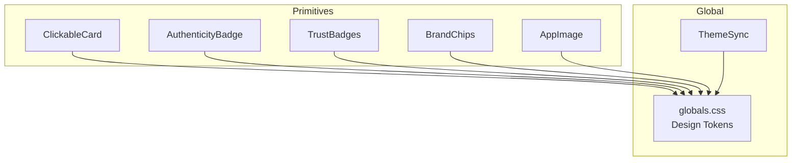
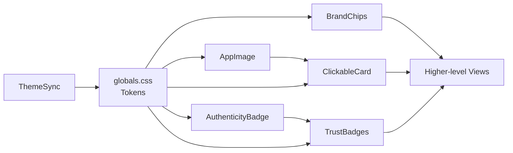
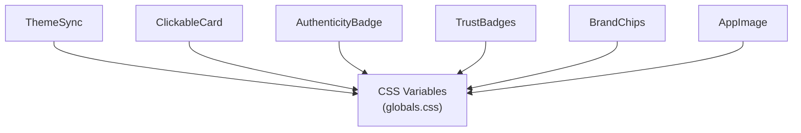

# UI Primitives

<cite>
**Referenced Files in This Document**
- [ClickableCard.tsx](file://src/components/ClickableCard.tsx)
- [AuthenticityBadge.tsx](file://src/components/AuthenticityBadge.tsx)
- [TrustBadges.tsx](file://src/components/TrustBadges.tsx)
- [BrandChips.tsx](file://src/components/BrandChips.tsx)
- [AppImage.tsx](file://src/components/AppImage.tsx)
- [globals.css](file://src/app/globals.css)
- [ThemeSync.tsx](file://src/components/ThemeSync.tsx)
</cite>

## Table of Contents
1. Introduction
2. Project Structure
3. Core Components
4. Architecture Overview
5. Detailed Component Analysis
6. Dependency Analysis
7. Performance Considerations
8. Troubleshooting Guide
9. Conclusion

## Introduction
This document describes the base UI primitive components that power consistent, accessible, and performant experiences across the Mooday marketplace. It focuses on ClickableCard, AuthenticityBadge, TrustBadges, BrandChips, and AppImage. For each component, we explain purpose, props interfaces, styling patterns, usage examples, accessibility considerations, performance optimizations, and guidelines for extending or customizing them. We also highlight how shared design tokens and responsive behavior maintain consistency across the app.

## Project Structure
The primitives live under src/components and are consumed by higher-level views throughout the application. Global styles and theme synchronization provide a unified visual language:
- Primitive components: ClickableCard, AuthenticityBadge, TrustBadges, BrandChips, AppImage
- Global styles and tokens: CSS variables defined in globals.css
- Theme integration: ThemeSync ensures consistent light/dark mode behavior

**Diagram sources**
- [ClickableCard.tsx](file://src/components/ClickableCard.tsx)
- [AuthenticityBadge.tsx](file://src/components/AuthenticityBadge.tsx)
- [TrustBadges.tsx](file://src/components/TrustBadges.tsx)
- [BrandChips.tsx](file://src/components/BrandChips.tsx)
- [AppImage.tsx](file://src/components/AppImage.tsx)
- [globals.css](file://src/app/globals.css)
- [ThemeSync.tsx](file://src/components/ThemeSync.tsx)

**Section sources**
- [ClickableCard.tsx](file://src/components/ClickableCard.tsx)
- [AuthenticityBadge.tsx](file://src/components/AuthenticityBadge.tsx)
- [TrustBadges.tsx](file://src/components/TrustBadges.tsx)
- [BrandChips.tsx](file://src/components/BrandChips.tsx)
- [AppImage.tsx](file://src/components/AppImage.tsx)
- [globals.css](file://src/app/globals.css)
- [ThemeSync.tsx](file://src/components/ThemeSync.tsx)

## Core Components
Below is a concise overview of each primitive’s role and typical usage within the marketplace.

- ClickableCard: A reusable container that combines layout, hover/active states, and keyboard navigation to represent tappable items (e.g., listings).
- AuthenticityBadge: A compact indicator signaling verified authenticity for products or sellers.
- TrustBadges: A group of trust signals (e.g., secure checkout, verified seller) often shown near purchase flows.
- BrandChips: Tag-like elements used to display brand identifiers with consistent sizing and colors.
- AppImage: An optimized image wrapper handling loading states, aspect ratios, placeholders, and error fallbacks.

These primitives share design tokens from globals.css and adapt to theme changes via ThemeSync, ensuring consistent typography, spacing, color, and motion across light and dark modes.

**Section sources**
- [ClickableCard.tsx](file://src/components/ClickableCard.tsx)
- [AuthenticityBadge.tsx](file://src/components/AuthenticityBadge.tsx)
- [TrustBadges.tsx](file://src/components/TrustBadges.tsx)
- [BrandChips.tsx](file://src/components/BrandChips.tsx)
- [AppImage.tsx](file://src/components/AppImage.tsx)
- [globals.css](file://src/app/globals.css)
- [ThemeSync.tsx](file://src/components/ThemeSync.tsx)

## Architecture Overview
The primitives form a cohesive layer above global styles and theme context. They compose together to build richer UI surfaces while keeping behavior predictable and testable.

**Diagram sources**
- [AppImage.tsx](file://src/components/AppImage.tsx)
- [ClickableCard.tsx](file://src/components/ClickableCard.tsx)
- [AuthenticityBadge.tsx](file://src/components/AuthenticityBadge.tsx)
- [TrustBadges.tsx](file://src/components/TrustBadges.tsx)
- [BrandChips.tsx](file://src/components/BrandChips.tsx)
- [globals.css](file://src/app/globals.css)
- [ThemeSync.tsx](file://src/components/ThemeSync.tsx)

## Detailed Component Analysis

### ClickableCard
Purpose:
- Provides a consistent interactive surface for tappable content with focus management, hover/active states, and optional elevation/shadow.

Props interface (representative):
- children: ReactNode
- onClick?: (event) => void
- href?: string (optional link behavior)
- disabled?: boolean
- aria-label?: string
- className?: string
- style?: CSSProperties
- tabIndex?: number
- role?: string (defaults to button when no href)

Styling patterns:
- Uses CSS variables for background, border, shadow, and transition timings.
- Responsive padding and font sizes via token-driven classes.
- Focus ring and outline styles for keyboard accessibility.

Accessibility:
- Ensures keyboard operability (Enter/Space triggers click).
- Exposes appropriate ARIA attributes when used as a button or link.
- Respects reduced motion preferences.

Performance:
- Lightweight DOM; avoids unnecessary re-renders by memoizing event handlers where applicable.
- Delegates heavy work to parent components.

Usage example:
- Wrap listing thumbnails or product cards to make them fully interactive and accessible.

Extending/customizing:
- Override tokens in CSS for brand-specific variants.
- Compose with AppImage and BrandChips for rich card layouts.

**Section sources**
- [ClickableCard.tsx](file://src/components/ClickableCard.tsx)
- [globals.css](file://src/app/globals.css)

### AuthenticityBadge
Purpose:
- Displays a small verification mark to communicate product or seller authenticity.

Props interface (representative):
- label?: string (for screen readers)
- variant?: "default" | "success" | "info"
- size?: "sm" | "md"
- className?: string
- style?: CSSProperties

Styling patterns:
- Token-based colors and iconography.
- Compact layout with consistent vertical rhythm.

Accessibility:
- Semantic badge semantics with descriptive labels for assistive technologies.
- Sufficient color contrast in both themes.

Performance:
- Minimal rendering footprint; suitable for dense lists.

Usage example:
- Place next to product titles or seller names to signal verified status.

Extending/customizing:
- Add new variants by defining tokens and mapping them in the component.

**Section sources**
- [AuthenticityBadge.tsx](file://src/components/AuthenticityBadge.tsx)
- [globals.css](file://src/app/globals.css)

### TrustBadges
Purpose:
- Groups multiple trust indicators (e.g., secure payment, verified seller) into a cohesive row or stack.

Props interface (representative):
- badges?: Array<{ id: string; label: string; icon?: ReactNode }>
- orientation?: "horizontal" | "vertical"
- className?: string
- style?: CSSProperties

Styling patterns:
- Flexible layout using tokens for spacing and alignment.
- Adapts to screen size for readability.

Accessibility:
- Each badge is labeled for screen readers.
- Grouped with an accessible name describing the set.

Performance:
- Renders only visible badges; supports virtualization at the consumer level if needed.

Usage example:
- Show near checkout buttons or on product detail pages to reinforce trust.

Extending/customizing:
- Extend badge definitions centrally to keep messaging consistent.

**Section sources**
- [TrustBadges.tsx](file://src/components/TrustBadges.tsx)
- [globals.css](file://src/app/globals.css)

### BrandChips
Purpose:
- Renders brand tags with consistent sizing, colors, and truncation behavior.

Props interface (representative):
- label: string
- color?: string | "brand-primary" | "brand-secondary"
- size?: "sm" | "md"
- truncated?: boolean
- className?: string
- style?: CSSProperties

Styling patterns:
- Token-driven colors and typography.
- Consistent border radius and spacing.

Accessibility:
- Descriptive text for screen readers; avoids decorative-only icons without labels.

Performance:
- Lightweight; safe to render many chips in lists.

Usage example:
- Display brand filters or product brand tags.

Extending/customizing:
- Define new color presets in tokens for brand palettes.

**Section sources**
- [BrandChips.tsx](file://src/components/BrandChips.tsx)
- [globals.css](file://src/app/globals.css)

### AppImage
Purpose:
- Centralized image component handling loading states, aspect ratio preservation, placeholder skeletons, and error fallbacks.

Props interface (representative):
- src: string
- alt: string
- width?: number | string
- height?: number | string
- aspectRatio?: string
- placeholder?: ReactNode
- onError?: (event) => void
- onLoad?: (event) => void
- className?: string
- style?: CSSProperties
- priority?: boolean (for eager loading)

Styling patterns:
- Maintains aspect ratio and prevents layout shift.
- Uses tokens for skeleton colors and transitions.

Accessibility:
- Requires alt text; provides meaningful descriptions for informative images.

Performance:
- Supports lazy loading and prioritization.
- Minimizes repaint/reflow with fixed dimensions and placeholders.

Usage example:
- Use in listing cards, galleries, and avatars to ensure consistent image behavior.

Extending/customizing:
- Add blur-up or shimmer effects via tokens and className overrides.

**Section sources**
- [AppImage.tsx](file://src/components/AppImage.tsx)
- [globals.css](file://src/app/globals.css)

## Dependency Analysis
The primitives depend on shared design tokens and theme synchronization to maintain visual consistency.

**Diagram sources**
- [ThemeSync.tsx](file://src/components/ThemeSync.tsx)
- [globals.css](file://src/app/globals.css)
- [ClickableCard.tsx](file://src/components/ClickableCard.tsx)
- [AuthenticityBadge.tsx](file://src/components/AuthenticityBadge.tsx)
- [TrustBadges.tsx](file://src/components/TrustBadges.tsx)
- [BrandChips.tsx](file://src/components/BrandChips.tsx)
- [AppImage.tsx](file://src/components/AppImage.tsx)

**Section sources**
- [ThemeSync.tsx](file://src/components/ThemeSync.tsx)
- [globals.css](file://src/app/globals.css)

## Performance Considerations
- Prefer token-driven styles to reduce duplicated CSS and enable efficient theme switching.
- Use AppImage with appropriate loading strategies (lazy vs priority) to optimize initial page load.
- Keep ClickableCard interactions lightweight; avoid heavy computations inside onClick.
- Batch updates in parent components to minimize re-renders of primitives.
- Leverage CSS variables for animations to benefit from GPU acceleration where possible.

[No sources needed since this section provides general guidance]

## Troubleshooting Guide
Common issues and resolutions:
- Images not displaying: Ensure AppImage receives valid src and alt; handle onError to log failures.
- Inconsistent theme colors: Verify ThemeSync is active and CSS variables are correctly scoped.
- Keyboard navigation not working: Confirm ClickableCard has proper role and tabIndex when used as a button.
- Badge contrast issues: Check token values for current theme and adjust if necessary.

**Section sources**
- [AppImage.tsx](file://src/components/AppImage.tsx)
- [ThemeSync.tsx](file://src/components/ThemeSync.tsx)
- [ClickableCard.tsx](file://src/components/ClickableCard.tsx)
- [AuthenticityBadge.tsx](file://src/components/AuthenticityBadge.tsx)
- [globals.css](file://src/app/globals.css)

## Conclusion
These primitives provide a robust foundation for building consistent, accessible, and high-performance UIs in the Mooday marketplace. By centralizing behavior and styling through shared tokens and theme synchronization, they ensure a cohesive experience across devices and themes. Extend them thoughtfully by leveraging tokens and maintaining accessibility and performance best practices.

[No sources needed since this section summarizes without analyzing specific files]