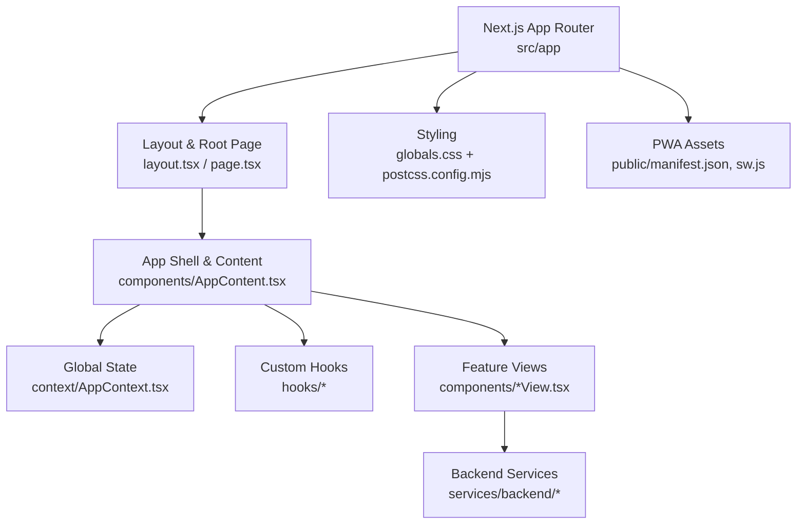
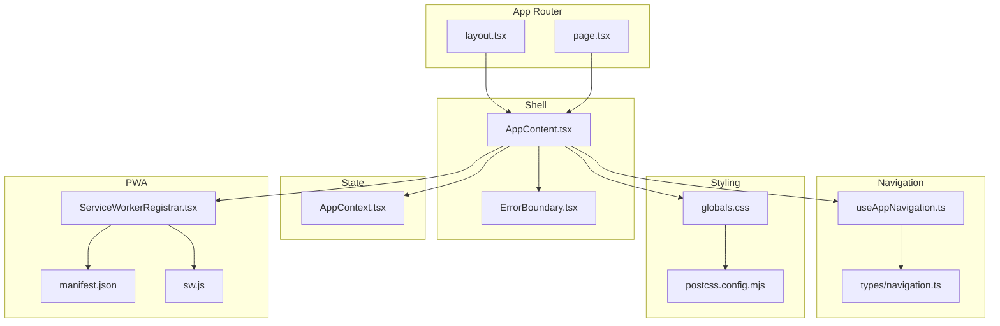
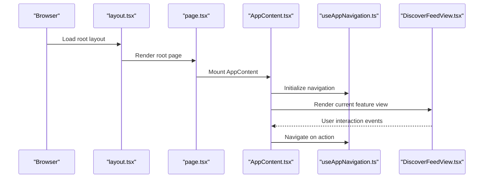
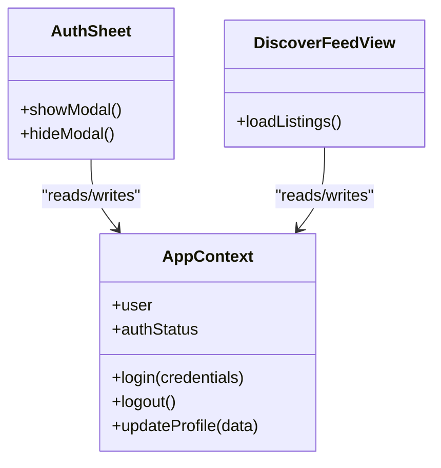
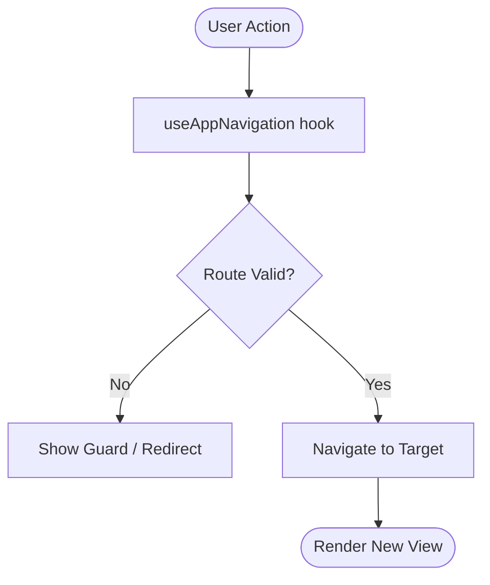
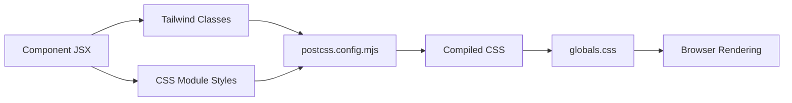
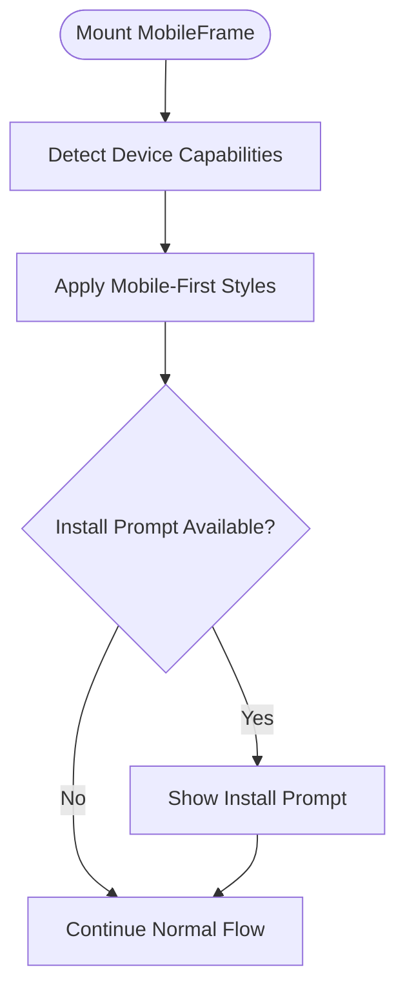
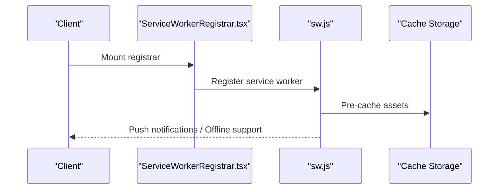
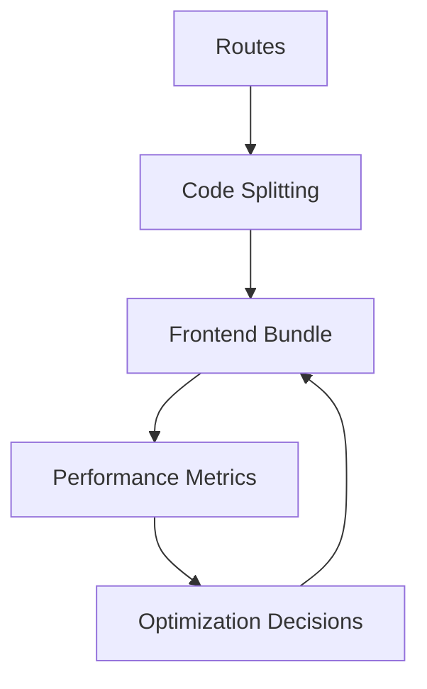
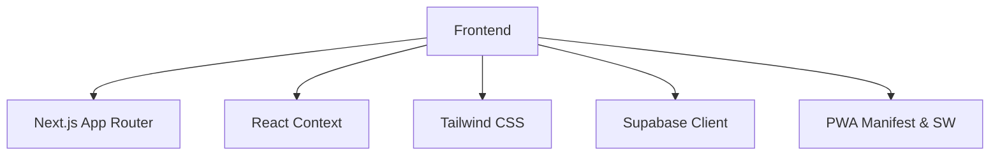

# Frontend Architecture

<cite>
**Referenced Files in This Document**
- [layout.tsx](file://src/app/layout.tsx)
- [page.tsx](file://src/app/page.tsx)
- [AppContent.tsx](file://src/components/AppContent.tsx)
- [AppContext.tsx](file://src/context/AppContext.tsx)
- [useAppNavigation.ts](file://src/hooks/useAppNavigation.ts)
- [navigation.ts](file://src/types/navigation.ts)
- [globals.css](file://src/app/globals.css)
- [postcss.config.mjs](file://postcss.config.mjs)
- [next.config.ts](file://next.config.ts)
- [manifest.json](file://public/manifest.json)
- [sw.js](file://public/sw.js)
- [ServiceWorkerRegistrar.tsx](file://src/components/ServiceWorkerRegistrar.tsx)
- [ThemeSync.tsx](file://src/components/ThemeSync.tsx)
- [MobileFrame.tsx](file://src/components/MobileFrame.tsx)
- [LandingInstallPrompt.tsx](file://src/components/landing/LandingInstallPrompt.tsx)
- [AuthSheet.tsx](file://src/components/AuthSheet.tsx)
- [DiscoverFeedView.tsx](file://src/components/DiscoverFeedView.tsx)
- [ProductDetailsView.tsx](file://src/components/ProductDetailsView.tsx)
- [CheckoutFlowView.tsx](file://src/components/CheckoutFlowView.tsx)
- [ErrorBoundary.tsx](file://src/components/ErrorBoundary.tsx)
- [supabase.ts](file://src/services/backend/supabase.ts)
- [config.ts](file://src/services/backend/config.ts)
</cite>

## Table of Contents
1. [Introduction](#introduction)
2. [Project Structure](#project-structure)
3. [Core Components](#core-components)
4. [Architecture Overview](#architecture-overview)
5. [Detailed Component Analysis](#detailed-component-analysis)
6. [Dependency Analysis](#dependency-analysis)
7. [Performance Considerations](#performance-considerations)
8. [Troubleshooting Guide](#troubleshooting-guide)
9. [Conclusion](#conclusion)
10. [Appendices](#appendices)

## Introduction
This document describes the frontend architecture of the Mooday marketplace built with Next.js and React. It explains the component-based structure, state management using the Context API, custom hooks for navigation and UX, routing strategy via the Next.js App Router, styling approaches (CSS Modules and Tailwind CSS), mobile-first responsive design, PWA capabilities, and performance optimization techniques. It also provides guidelines for creating new components, managing state, and handling user interactions consistently across the application.

## Project Structure
The frontend follows a feature-oriented layout under src:
- app/: Next.js App Router pages and layouts
- components/: Reusable UI components grouped by feature or shared usage
- context/: Global application state via React Context
- hooks/: Custom hooks encapsulating reusable logic
- services/: Backend integration layer (Supabase, config)
- types/: Shared TypeScript types (e.g., navigation)
- data/: Static or mock datasets used during development/testing
- lib/: Utility functions and helpers

**Diagram sources**
- [layout.tsx:1-200](file://src/app/layout.tsx#L1-L200)
- [page.tsx:1-200](file://src/app/page.tsx#L1-L200)
- [AppContent.tsx:1-200](file://src/components/AppContent.tsx#L1-L200)
- [AppContext.tsx:1-200](file://src/context/AppContext.tsx#L1-L200)
- [useAppNavigation.ts:1-200](file://src/hooks/useAppNavigation.ts#L1-L200)
- [globals.css:1-200](file://src/app/globals.css#L1-L200)
- [postcss.config.mjs:1-200](file://postcss.config.mjs#L1-L200)
- [manifest.json:1-200](file://public/manifest.json#L1-L200)
- [sw.js:1-200](file://public/sw.js#L1-L200)

**Section sources**
- [layout.tsx:1-200](file://src/app/layout.tsx#L1-L200)
- [page.tsx:1-200](file://src/app/page.tsx#L1-L200)
- [AppContent.tsx:1-200](file://src/components/AppContent.tsx#L1-L200)
- [AppContext.tsx:1-200](file://src/context/AppContext.tsx#L1-L200)
- [useAppNavigation.ts:1-200](file://src/hooks/useAppNavigation.ts#L1-L200)
- [globals.css:1-200](file://src/app/globals.css#L1-L200)
- [postcss.config.mjs:1-200](file://postcss.config.mjs#L1-L200)
- [manifest.json:1-200](file://public/manifest.json#L1-L200)
- [sw.js:1-200](file://public/sw.js#L1-L200)

## Core Components
- App shell and content orchestration: The root layout wires up global providers and renders the main content area. AppContent coordinates navigation, theme, and service worker registration.
- Global state: AppContext centralizes authentication, user preferences, and cross-cutting concerns to avoid prop drilling.
- Navigation: useAppNavigation provides typed programmatic navigation and guards based on route definitions.
- Feature views: Each major flow is implemented as a view component (e.g., DiscoverFeedView, ProductDetailsView, CheckoutFlowView).
- Utilities: ErrorBoundary wraps critical trees; ThemeSync manages theme persistence; MobileFrame enforces mobile-first constraints where needed.

Key responsibilities:
- Layout.tsx: Sets up HTML head, global styles, and top-level providers.
- AppContent.tsx: Mounts feature routes, integrates navigation, and initializes global behaviors.
- AppContext.tsx: Holds auth state, user profile, and shared actions.
- useAppNavigation.ts: Encapsulates route transitions and parameter handling.

**Section sources**
- [layout.tsx:1-200](file://src/app/layout.tsx#L1-L200)
- [AppContent.tsx:1-200](file://src/components/AppContent.tsx#L1-L200)
- [AppContext.tsx:1-200](file://src/context/AppContext.tsx#L1-L200)
- [useAppNavigation.ts:1-200](file://src/hooks/useAppNavigation.ts#L1-L200)

## Architecture Overview
The application uses Next.js App Router for routing and server/client co-location. React Context provides global state, while custom hooks abstract side effects and navigation. Styling combines CSS Modules for scoped styles and Tailwind CSS for utility-first design. PWA support is enabled via manifest and service worker registration.

**Diagram sources**
- [layout.tsx:1-200](file://src/app/layout.tsx#L1-L200)
- [page.tsx:1-200](file://src/app/page.tsx#L1-L200)
- [AppContent.tsx:1-200](file://src/components/AppContent.tsx#L1-L200)
- [AppContext.tsx:1-200](file://src/context/AppContext.tsx#L1-L200)
- [useAppNavigation.ts:1-200](file://src/hooks/useAppNavigation.ts#L1-L200)
- [navigation.ts:1-200](file://src/types/navigation.ts#L1-L200)
- [globals.css:1-200](file://src/app/globals.css#L1-L200)
- [postcss.config.mjs:1-200](file://postcss.config.mjs#L1-L200)
- [manifest.json:1-200](file://public/manifest.json#L1-L200)
- [sw.js:1-200](file://public/sw.js#L1-L200)
- [ServiceWorkerRegistrar.tsx:1-200](file://src/components/ServiceWorkerRegistrar.tsx#L1-L200)

## Detailed Component Analysis

### App Shell and Routing
- Root layout sets up global providers and loads global styles.
- Root page mounts the application shell and error boundary.
- AppContent orchestrates feature views and integrates navigation and global state.

**Diagram sources**
- [layout.tsx:1-200](file://src/app/layout.tsx#L1-L200)
- [page.tsx:1-200](file://src/app/page.tsx#L1-L200)
- [AppContent.tsx:1-200](file://src/components/AppContent.tsx#L1-L200)
- [useAppNavigation.ts:1-200](file://src/hooks/useAppNavigation.ts#L1-L200)
- [DiscoverFeedView.tsx:1-200](file://src/components/DiscoverFeedView.tsx#L1-L200)

**Section sources**
- [layout.tsx:1-200](file://src/app/layout.tsx#L1-L200)
- [page.tsx:1-200](file://src/app/page.tsx#L1-L200)
- [AppContent.tsx:1-200](file://src/components/AppContent.tsx#L1-L200)

### State Management with Context API
- AppContext provides centralized state for authentication, user profile, and shared actions.
- Consumers access state via React Context without prop drilling.
- Actions are exposed through context methods to update state and trigger side effects.

**Diagram sources**
- [AppContext.tsx:1-200](file://src/context/AppContext.tsx#L1-L200)
- [AuthSheet.tsx:1-200](file://src/components/AuthSheet.tsx#L1-L200)
- [DiscoverFeedView.tsx:1-200](file://src/components/DiscoverFeedView.tsx#L1-L200)

**Section sources**
- [AppContext.tsx:1-200](file://src/context/AppContext.tsx#L1-L200)
- [AuthSheet.tsx:1-200](file://src/components/AuthSheet.tsx#L1-L200)
- [DiscoverFeedView.tsx:1-200](file://src/components/DiscoverFeedView.tsx#L1-L200)

### Custom Hooks: Navigation and UX
- useAppNavigation encapsulates typed navigation calls and route guards.
- Additional hooks manage idle lock, forced mobile mode, and welcome screen gating.

**Diagram sources**
- [useAppNavigation.ts:1-200](file://src/hooks/useAppNavigation.ts#L1-L200)
- [navigation.ts:1-200](file://src/types/navigation.ts#L1-L200)

**Section sources**
- [useAppNavigation.ts:1-200](file://src/hooks/useAppNavigation.ts#L1-L200)
- [navigation.ts:1-200](file://src/types/navigation.ts#L1-L200)

### Styling Strategy: CSS Modules and Tailwind CSS
- globals.css defines base styles and theme variables.
- postcss.config.mjs enables Tailwind CSS processing.
- CSS Modules provide scoped styles for specific components when needed.

**Diagram sources**
- [globals.css:1-200](file://src/app/globals.css#L1-L200)
- [postcss.config.mjs:1-200](file://postcss.config.mjs#L1-L200)

**Section sources**
- [globals.css:1-200](file://src/app/globals.css#L1-L200)
- [postcss.config.mjs:1-200](file://postcss.config.mjs#L1-L200)

### Mobile-First Responsive Design
- MobileFrame enforces mobile-first behavior and viewport constraints.
- Tailwind utilities drive responsive breakpoints and adaptive layouts.
- LandingInstallPrompt guides users to install the PWA on mobile devices.

**Diagram sources**
- [MobileFrame.tsx:1-200](file://src/components/MobileFrame.tsx#L1-L200)
- [LandingInstallPrompt.tsx:1-200](file://src/components/landing/LandingInstallPrompt.tsx#L1-L200)

**Section sources**
- [MobileFrame.tsx:1-200](file://src/components/MobileFrame.tsx#L1-L200)
- [LandingInstallPrompt.tsx:1-200](file://src/components/landing/LandingInstallPrompt.tsx#L1-L200)

### PWA Implementation
- manifest.json declares app metadata, icons, and display mode.
- sw.js registers caching strategies and offline fallback.
- ServiceWorkerRegistrar.tsx conditionally registers the service worker in the client environment.

**Diagram sources**
- [manifest.json:1-200](file://public/manifest.json#L1-L200)
- [sw.js:1-200](file://public/sw.js#L1-L200)
- [ServiceWorkerRegistrar.tsx:1-200](file://src/components/ServiceWorkerRegistrar.tsx#L1-L200)

**Section sources**
- [manifest.json:1-200](file://public/manifest.json#L1-L200)
- [sw.js:1-200](file://public/sw.js#L1-L200)
- [ServiceWorkerRegistrar.tsx:1-200](file://src/components/ServiceWorkerRegistrar.tsx#L1-L200)

### Performance Optimization Techniques
- Code splitting via Next.js App Router ensures only necessary code is loaded per route.
- ErrorBoundary prevents crashes from propagating and improves resilience.
- ThemeSync persists theme preferences to reduce reflows and improve perceived performance.
- Supabase client configuration optimizes network requests and real-time subscriptions.

[No sources needed since this diagram shows conceptual workflow, not actual code structure]

**Section sources**
- [ErrorBoundary.tsx:1-200](file://src/components/ErrorBoundary.tsx#L1-L200)
- [ThemeSync.tsx:1-200](file://src/components/ThemeSync.tsx#L1-L200)
- [supabase.ts:1-200](file://src/services/backend/supabase.ts#L1-L200)
- [config.ts:1-200](file://src/services/backend/config.ts#L1-L200)

## Dependency Analysis
The frontend depends on:
- Next.js App Router for routing and rendering
- React Context for global state
- Tailwind CSS for styling
- Supabase for backend integration
- PWA assets for offline and installability

**Diagram sources**
- [layout.tsx:1-200](file://src/app/layout.tsx#L1-L200)
- [AppContext.tsx:1-200](file://src/context/AppContext.tsx#L1-L200)
- [postcss.config.mjs:1-200](file://postcss.config.mjs#L1-L200)
- [supabase.ts:1-200](file://src/services/backend/supabase.ts#L1-L200)
- [manifest.json:1-200](file://public/manifest.json#L1-L200)
- [sw.js:1-200](file://public/sw.js#L1-L200)

**Section sources**
- [layout.tsx:1-200](file://src/app/layout.tsx#L1-L200)
- [AppContext.tsx:1-200](file://src/context/AppContext.tsx#L1-L200)
- [postcss.config.mjs:1-200](file://postcss.config.mjs#L1-L200)
- [supabase.ts:1-200](file://src/services/backend/supabase.ts#L1-L200)
- [manifest.json:1-200](file://public/manifest.json#L1-L200)
- [sw.js:1-200](file://public/sw.js#L1-L200)

## Performance Considerations
- Prefer lazy loading and route-based code splitting to minimize initial bundle size.
- Use memoization patterns in components that render frequently updated lists.
- Debounce search inputs and implement pagination or infinite scroll for large datasets.
- Leverage PWA caching strategically to reduce network requests and improve offline resilience.
- Monitor runtime errors with ErrorBoundary to prevent cascading failures.

[No sources needed since this section provides general guidance]

## Troubleshooting Guide
Common issues and resolutions:
- Authentication flows failing: Verify AppContext state and ensure proper login/logout actions are invoked. Check AuthSheet modal visibility and form validation.
- Navigation errors: Confirm route definitions in navigation types and validate parameters before navigating.
- Styling conflicts: Ensure CSS Modules are scoped correctly and Tailwind classes do not override global styles unintentionally.
- PWA not installing: Validate manifest.json entries and confirm service worker registration succeeds in the browser console.
- Network errors: Inspect Supabase client configuration and error responses; handle retries and user feedback gracefully.

**Section sources**
- [AppContext.tsx:1-200](file://src/context/AppContext.tsx#L1-L200)
- [AuthSheet.tsx:1-200](file://src/components/AuthSheet.tsx#L1-L200)
- [useAppNavigation.ts:1-200](file://src/hooks/useAppNavigation.ts#L1-L200)
- [globals.css:1-200](file://src/app/globals.css#L1-L200)
- [manifest.json:1-200](file://public/manifest.json#L1-L200)
- [sw.js:1-200](file://public/sw.js#L1-L200)
- [supabase.ts:1-200](file://src/services/backend/supabase.ts#L1-L200)

## Conclusion
Mooday’s frontend leverages Next.js App Router for scalable routing, React Context for cohesive state management, and a modular component architecture centered around feature views. Styling combines CSS Modules and Tailwind CSS for maintainable, responsive designs. PWA features enhance reliability and engagement. Following the guidelines in this document will help teams extend the application consistently, maintain performance, and deliver a robust user experience.

[No sources needed since this section summarizes without analyzing specific files]

## Appendices

### Guidelines for Creating New Components
- Place feature-specific views under components with descriptive names (e.g., XxxView.tsx).
- Use CSS Modules for component-scoped styles and Tailwind for utility classes.
- Keep business logic in custom hooks or services; components should remain presentational.
- Compose smaller, reusable components to build complex screens.

[No sources needed since this section provides general guidance]

### Managing Component State
- Use local state for isolated concerns within a component.
- Lift shared state to Context when multiple components need access.
- Persist important settings (e.g., theme) via localStorage or similar mechanisms.

[No sources needed since this section provides general guidance]

### Handling User Interactions Consistently
- Centralize navigation via useAppNavigation to ensure consistent routing and guards.
- Provide clear feedback for async operations (loading states, success/error messages).
- Wrap critical UI trees with ErrorBoundary to catch and report errors.

[No sources needed since this section provides general guidance]