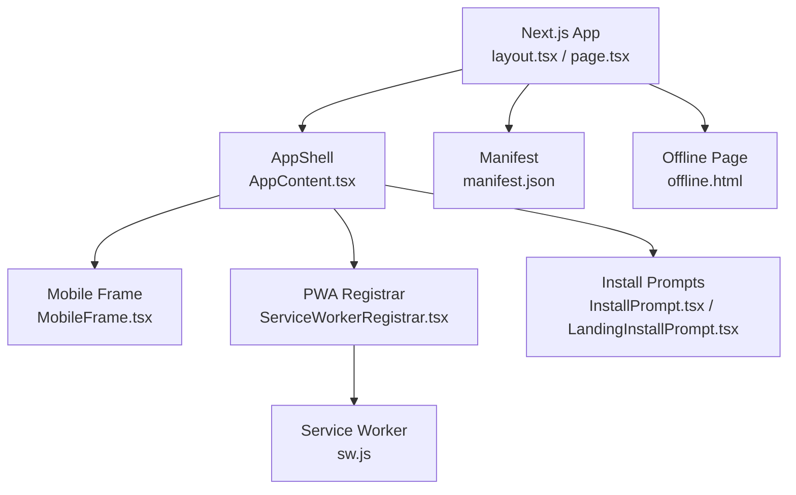
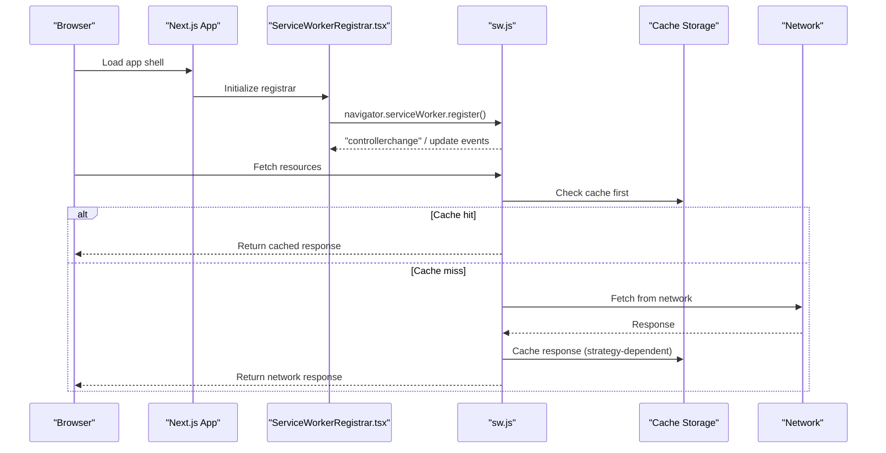
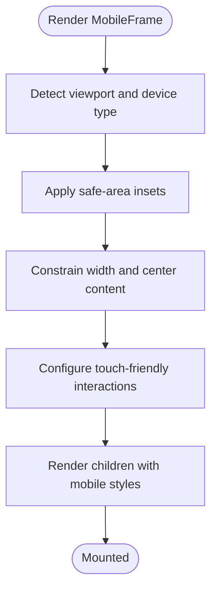
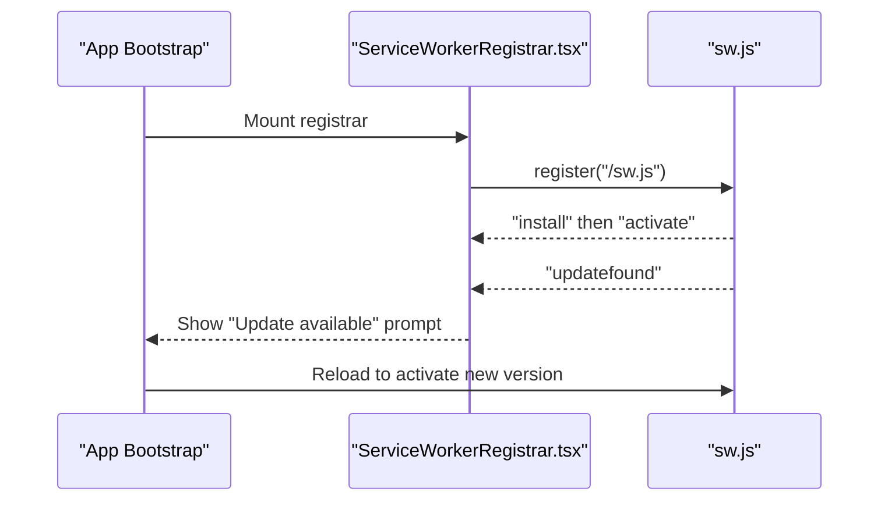
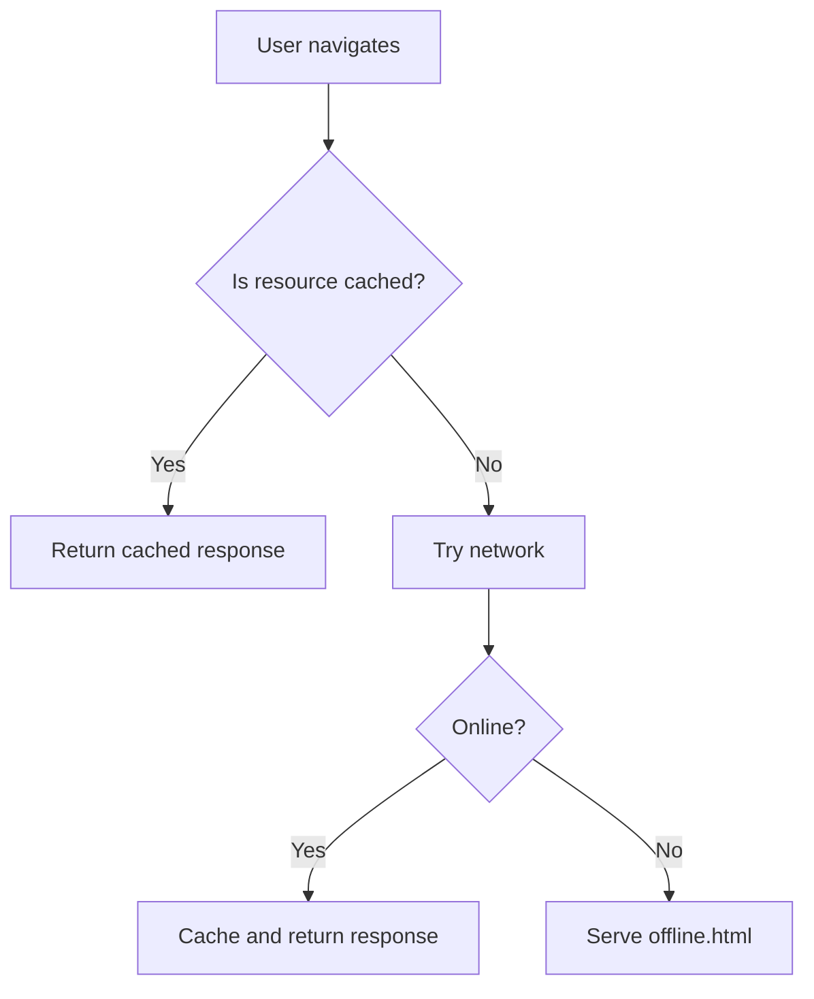
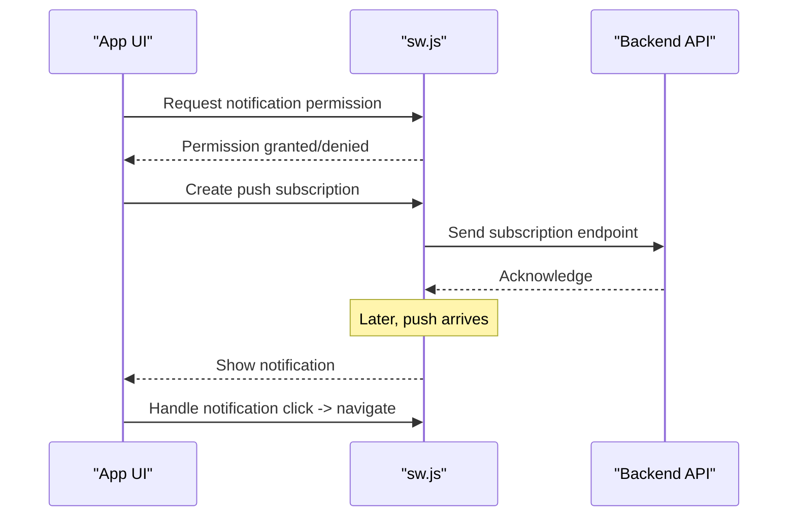
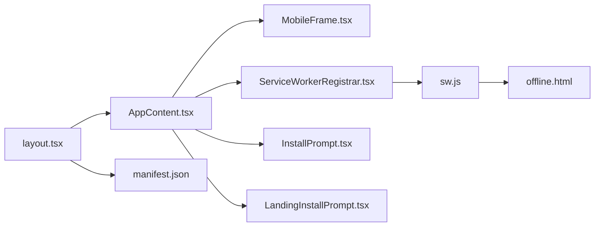

# Mobile and PWA Features

<cite>
**Referenced Files in This Document**
- [MobileFrame.tsx](file://src/components/MobileFrame.tsx)
- [ServiceWorkerRegistrar.tsx](file://src/components/ServiceWorkerRegistrar.tsx)
- [InstallPrompt.tsx](file://src/components/InstallPrompt.tsx)
- [LandingInstallPrompt.tsx](file://src/components/landing/LandingInstallPrompt.tsx)
- [manifest.json](file://public/manifest.json)
- [sw.js](file://public/sw.js)
- [offline.html](file://public/offline.html)
- [useForcedMobile.ts](file://src/hooks/useForcedMobile.ts)
- [AppContent.tsx](file://src/components/AppContent.tsx)
- [layout.tsx](file://src/app/layout.tsx)
- [page.tsx](file://src/app/page.tsx)
- [next.config.ts](file://next.config.ts)
</cite>

## Table of Contents
1. [Introduction](#introduction)
2. [Project Structure](#project-structure)
3. [Core Components](#core-components)
4. [Architecture Overview](#architecture-overview)
5. [Detailed Component Analysis](#detailed-component-analysis)
6. [Dependency Analysis](#dependency-analysis)
7. [Performance Considerations](#performance-considerations)
8. [Troubleshooting Guide](#troubleshooting-guide)
9. [Conclusion](#conclusion)
10. [Appendices](#appendices)

## Introduction
This document explains the mobile-first design and Progressive Web App (PWA) implementation in Mooday. It covers the mobile frame component, responsive patterns, touch interactions, service worker registration, offline capabilities, push notifications, manifest configuration, app icons, installation prompts, performance tuning, battery considerations, testing strategies, cross-browser compatibility, and platform-specific features. The goal is to help developers build smooth, efficient, and installable mobile experiences on modern browsers.

## Project Structure
Mooday organizes mobile and PWA concerns across UI components, hooks, and static assets:
- Mobile frame and layout: MobileFrame.tsx, AppContent.tsx, layout.tsx, page.tsx
- PWA runtime: ServiceWorkerRegistrar.tsx, sw.js, manifest.json, offline.html
- Installation UX: InstallPrompt.tsx, LandingInstallPrompt.tsx
- Configuration: next.config.ts for asset handling and Next.js behavior

**Diagram sources**
- [layout.tsx](file://src/app/layout.tsx)
- [page.tsx](file://src/app/page.tsx)
- [AppContent.tsx](file://src/components/AppContent.tsx)
- [MobileFrame.tsx](file://src/components/MobileFrame.tsx)
- [ServiceWorkerRegistrar.tsx](file://src/components/ServiceWorkerRegistrar.tsx)
- [sw.js](file://public/sw.js)
- [manifest.json](file://public/manifest.json)
- [offline.html](file://public/offline.html)
- [InstallPrompt.tsx](file://src/components/InstallPrompt.tsx)
- [LandingInstallPrompt.tsx](file://src/components/landing/LandingInstallPrompt.tsx)

**Section sources**
- [layout.tsx](file://src/app/layout.tsx)
- [page.tsx](file://src/app/page.tsx)
- [AppContent.tsx](file://src/components/AppContent.tsx)
- [MobileFrame.tsx](file://src/components/MobileFrame.tsx)
- [ServiceWorkerRegistrar.tsx](file://src/components/ServiceWorkerRegistrar.tsx)
- [manifest.json](file://public/manifest.json)
- [sw.js](file://public/sw.js)
- [offline.html](file://public/offline.html)
- [InstallPrompt.tsx](file://src/components/InstallPrompt.tsx)
- [LandingInstallPrompt.tsx](file://src/components/landing/LandingInstallPrompt.tsx)

## Core Components
- MobileFrame.tsx: Provides a mobile-centric shell with safe-area insets, viewport constraints, and touch-friendly layouts. It can be used to constrain content width, center it, and apply consistent spacing on small screens.
- ServiceWorkerRegistrar.tsx: Registers the service worker during app bootstrap, handles updates, and exposes readiness states to UI.
- InstallPrompt.tsx and LandingInstallPrompt.tsx: Surface native-like install prompts at appropriate moments (e.g., after user engagement or on landing).
- manifest.json: Declares app metadata, theme colors, display mode, and icons for installation and status bar styling.
- sw.js: Implements caching strategy, offline fallback, background sync, and optional push notification handling.
- offline.html: User-friendly offline page served when network is unavailable.
- useForcedMobile.ts: Hook to force mobile layout behavior for testing or specific flows.

**Section sources**
- [MobileFrame.tsx](file://src/components/MobileFrame.tsx)
- [ServiceWorkerRegistrar.tsx](file://src/components/ServiceWorkerRegistrar.tsx)
- [InstallPrompt.tsx](file://src/components/InstallPrompt.tsx)
- [LandingInstallPrompt.tsx](file://src/components/landing/LandingInstallPrompt.tsx)
- [manifest.json](file://public/manifest.json)
- [sw.js](file://public/sw.js)
- [offline.html](file://public/offline.html)
- [useForcedMobile.ts](file://src/hooks/useForcedMobile.ts)

## Architecture Overview
The PWA architecture integrates client-side registration with a service worker that manages caching and offline behavior. The mobile frame ensures a consistent, touch-optimized experience across devices.

**Diagram sources**
- [ServiceWorkerRegistrar.tsx](file://src/components/ServiceWorkerRegistrar.tsx)
- [sw.js](file://public/sw.js)

## Detailed Component Analysis

### MobileFrame Component
Responsibilities:
- Enforce mobile-first layout constraints and safe areas
- Provide consistent padding, margins, and typography scaling
- Support touch gestures and prevent accidental zoom/scroll issues
- Optionally wrap views to simulate mobile frames on desktop for preview/testing

Key behaviors:
- Uses CSS variables or utilities for safe-area insets (top/bottom)
- Applies max-width and centered layout for readability
- Ensures tap targets meet accessibility guidelines
- Integrates with theme and navigation to maintain consistency

**Diagram sources**
- [MobileFrame.tsx](file://src/components/MobileFrame.tsx)

**Section sources**
- [MobileFrame.tsx](file://src/components/MobileFrame.tsx)

### Service Worker Registration and Updates
Responsibilities:
- Register the service worker once during app initialization
- Listen for new versions and prompt users to refresh when needed
- Handle offline detection and provide graceful degradation

Flow:
- On app start, register the service worker
- On successful registration, listen for controller change and update events
- When an update is available, notify the UI to prompt a refresh
- During fetch, serve cached assets if offline

**Diagram sources**
- [ServiceWorkerRegistrar.tsx](file://src/components/ServiceWorkerRegistrar.tsx)
- [sw.js](file://public/sw.js)

**Section sources**
- [ServiceWorkerRegistrar.tsx](file://src/components/ServiceWorkerRegistrar.tsx)
- [sw.js](file://public/sw.js)

### Offline Capabilities and Fallbacks
Responsibilities:
- Cache critical app shell and key routes
- Serve offline.html when network is unavailable
- Provide meaningful feedback to users

Behavior:
- On initial install, precache essential assets
- On subsequent navigations, check cache before network
- If offline, respond with offline.html or cached fallback

**Diagram sources**
- [sw.js](file://public/sw.js)
- [offline.html](file://public/offline.html)

**Section sources**
- [sw.js](file://public/sw.js)
- [offline.html](file://public/offline.html)

### Push Notifications
Responsibilities:
- Request permission and subscribe to push topics
- Display notifications even when the app is not in focus
- Route notification actions to in-app navigation

Flow:
- On first launch, request notification permission
- Subscribe to push service and send subscription to backend
- On push event, show notification via service worker
- On click, navigate to relevant screen within the app

**Diagram sources**
- [sw.js](file://public/sw.js)

**Section sources**
- [sw.js](file://public/sw.js)

### Manifest Configuration and Icons
Responsibilities:
- Define app name, description, display mode, theme color, and icons
- Ensure proper icon sizes for different platforms
- Configure orientation and splash screens where applicable

Guidelines:
- Include multiple icon sizes for Android and iOS
- Set appropriate display mode (standalone or minimal-ui)
- Use theme_color and background_color for consistent branding

**Section sources**
- [manifest.json](file://public/manifest.json)

### Installation Prompts
Responsibilities:
- Trigger native install banners at appropriate times
- Provide custom fallback prompts when native is not available
- Respect user preferences and avoid intrusive prompts

Best practices:
- Prompt after meaningful user interaction (e.g., viewing listings)
- Allow dismissal and re-prompt later
- Provide clear value proposition for installing

**Section sources**
- [InstallPrompt.tsx](file://src/components/InstallPrompt.tsx)
- [LandingInstallPrompt.tsx](file://src/components/landing/LandingInstallPrompt.tsx)

### Mobile Layout Integration
Responsibilities:
- Integrate mobile frame into app shell
- Ensure global layout respects safe areas and viewport
- Provide consistent navigation and content structure

Integration points:
- Wrap main content with MobileFrame in AppContent
- Configure Next.js layout to set viewport and meta tags
- Use page-level components to adapt to mobile contexts

**Section sources**
- [AppContent.tsx](file://src/components/AppContent.tsx)
- [layout.tsx](file://src/app/layout.tsx)
- [page.tsx](file://src/app/page.tsx)

## Dependency Analysis
High-level dependencies among mobile and PWA components:

**Diagram sources**
- [layout.tsx](file://src/app/layout.tsx)
- [AppContent.tsx](file://src/components/AppContent.tsx)
- [MobileFrame.tsx](file://src/components/MobileFrame.tsx)
- [ServiceWorkerRegistrar.tsx](file://src/components/ServiceWorkerRegistrar.tsx)
- [sw.js](file://public/sw.js)
- [offline.html](file://public/offline.html)
- [manifest.json](file://public/manifest.json)

**Section sources**
- [layout.tsx](file://src/app/layout.tsx)
- [AppContent.tsx](file://src/components/AppContent.tsx)
- [MobileFrame.tsx](file://src/components/MobileFrame.tsx)
- [ServiceWorkerRegistrar.tsx](file://src/components/ServiceWorkerRegistrar.tsx)
- [sw.js](file://public/sw.js)
- [offline.html](file://public/offline.html)
- [manifest.json](file://public/manifest.json)

## Performance Considerations
- Asset optimization: Use Next.js image optimization and lazy loading for images and heavy components.
- Bundle size: Code-split routes and defer non-critical scripts to reduce initial load time on mobile networks.
- Caching strategy: Prefer cache-first for static assets and stale-while-revalidate for dynamic data to improve perceived performance.
- Battery usage: Avoid excessive wake locks; prefer passive listeners and debounce frequent events like scroll or resize.
- Network resilience: Implement retry logic and exponential backoff for failed requests; show optimistic UI updates.
- Memory management: Unsubscribe listeners and cancel in-flight requests on unmount to prevent leaks.
- Rendering: Minimize reflows by batching DOM updates and using CSS transforms for animations.

[No sources needed since this section provides general guidance]

## Troubleshooting Guide
Common issues and resolutions:
- Service worker not registering:
  - Verify correct path and MIME type for sw.js
  - Check browser console for registration errors
  - Ensure HTTPS in production environments
- Stale cache causing outdated content:
  - Invalidate cache on new version activation
  - Provide manual refresh option in UI
- Offline page not showing:
  - Confirm offline route is handled in service worker
  - Validate offline.html is included in cache strategy
- Push notifications not appearing:
  - Ensure permission is granted and subscription exists
  - Verify server sends valid payload and endpoint URL
- Mobile layout issues:
  - Check viewport meta tag and safe-area CSS variables
  - Test on real devices using remote debugging

**Section sources**
- [ServiceWorkerRegistrar.tsx](file://src/components/ServiceWorkerRegistrar.tsx)
- [sw.js](file://public/sw.js)
- [offline.html](file://public/offline.html)
- [MobileFrame.tsx](file://src/components/MobileFrame.tsx)

## Conclusion
Mooday’s mobile-first and PWA approach combines a dedicated mobile frame, robust service worker integration, thoughtful installation UX, and careful performance tuning. By following the patterns and guidelines outlined here, teams can deliver fast, reliable, and installable experiences that work well across devices and networks.

[No sources needed since this section summarizes without analyzing specific files]

## Appendices

### Testing Strategies for Mobile Devices
- Device testing: Use real devices and emulators to validate touch interactions, safe areas, and performance.
- Automated tests: Leverage Playwright or Cypress for cross-browser scenarios, including PWA install flows and offline behavior.
- Lighthouse audits: Measure performance, accessibility, best practices, and PWA criteria regularly.
- Network simulation: Throttle bandwidth and simulate offline conditions to verify fallbacks.

[No sources needed since this section provides general guidance]

### Cross-Browser Compatibility
- Supported browsers: Chrome, Safari, Firefox, Edge with PWA support.
- Feature detection: Use feature flags for advanced capabilities like push notifications.
- Polyfills: Provide fallbacks for older browsers where necessary.
- Platform differences: Account for iOS Safari limitations (e.g., background sync, push).

[No sources needed since this section provides general guidance]

### Platform-Specific Features
- iOS: Standalone display mode, home screen shortcuts, limited background tasks.
- Android: Full PWA support, background sync, push notifications.
- Desktop: Responsive fallbacks and keyboard accessibility.

[No sources needed since this section provides general guidance]

### Guidelines for Developing Mobile Experiences
- Design for thumb reach and large tap targets.
- Prioritize content above the fold and minimize scrolling.
- Use progressive enhancement to ensure core functionality works everywhere.
- Optimize images and fonts for fast loading on mobile networks.
- Provide clear feedback for user actions and network states.

[No sources needed since this section provides general guidance]