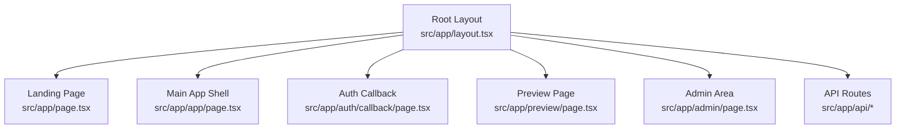
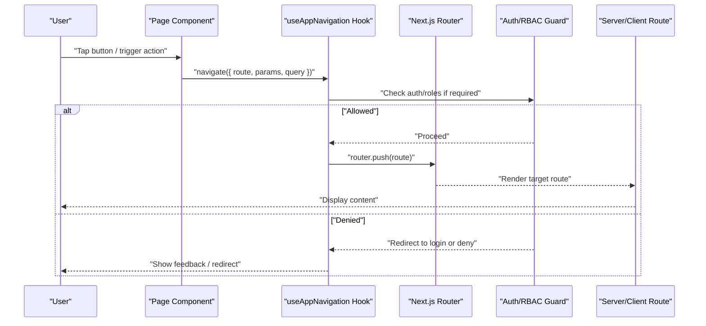
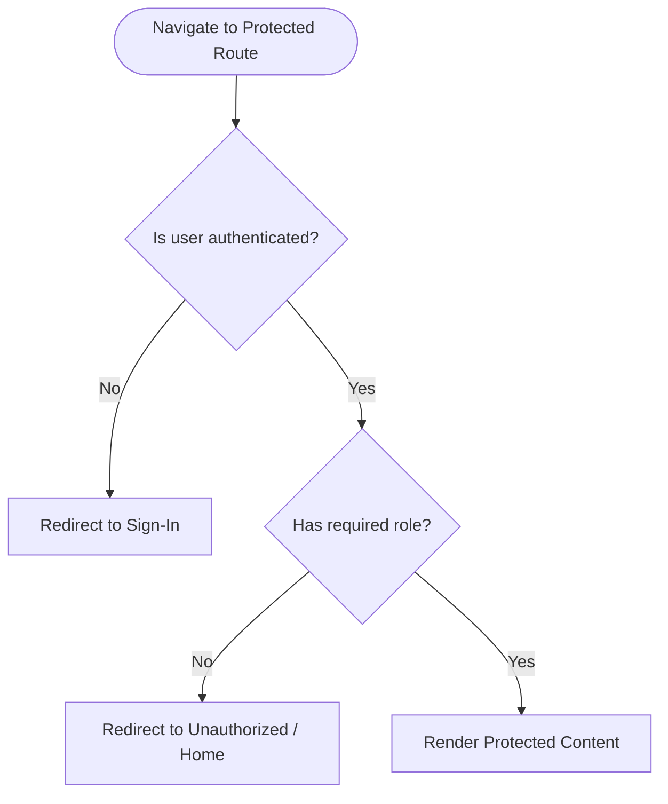
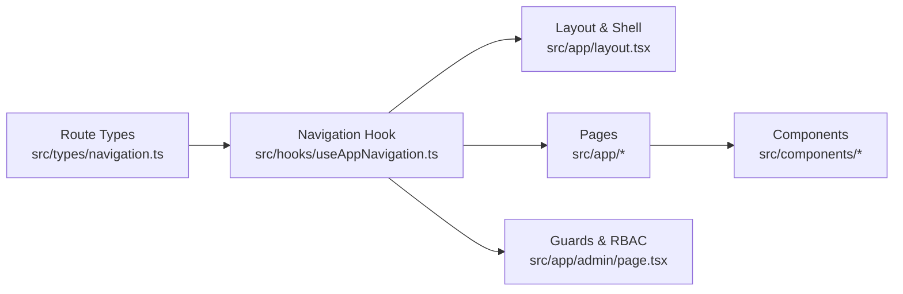

# Routing and Navigation

<cite>
**Referenced Files in This Document**
- [useAppNavigation.ts](file://src/hooks/useAppNavigation.ts)
- [navigation.ts](file://src/types/navigation.ts)
- [layout.tsx](file://src/app/layout.tsx)
- [page.tsx](file://src/app/page.tsx)
- [admin/page.tsx](file://src/app/admin/page.tsx)
- [auth/callback/page.tsx](file://src/app/auth/callback/page.tsx)
- [app/page.tsx](file://src/app/app/page.tsx)
- [preview/page.tsx](file://src/app/preview/page.tsx)
- [sitemap.ts](file://src/app/sitemap.ts)
- [ErrorBoundary.tsx](file://src/components/ErrorBoundary.tsx)
- [MobileFrame.tsx](file://src/components/MobileFrame.tsx)
- [AppContent.tsx](file://src/components/AppContent.tsx)
</cite>

## Table of Contents
1. [Introduction](#introduction)
2. [Project Structure](#project-structure)
3. [Core Components](#core-components)
4. [Architecture Overview](#architecture-overview)
5. [Detailed Component Analysis](#detailed-component-analysis)
6. [Dependency Analysis](#dependency-analysis)
7. [Performance Considerations](#performance-considerations)
8. [Troubleshooting Guide](#troubleshooting-guide)
9. [Conclusion](#conclusion)
10. [Appendices](#appendices)

## Introduction

This document explains how routing and navigation work in the Mooday application built on Next.js App Router. It covers page structure, route organization, programmatic navigation via a custom hook, route parameters and dynamic routes, authentication guards and protected routes, role-based access control, nested layouts, loading states, error boundaries, mobile navigation patterns, deep linking support, SEO considerations, and guidelines for adding new routes while maintaining a consistent user experience across screen sizes.

## Project Structure

Mooday uses the Next.js App Router file-system routing convention under src/app. Routes are organized by feature areas:

- Root layout and global styles define the shell for all pages.
- Public pages include the landing page and preview.
- Auth flows include callback handling.
- Feature routes are grouped under folders such as app (main app shell), admin (role-gated area).
- API routes live under src/app/api for server endpoints.

**Diagram sources**
- [layout.tsx:1-200](file://src/app/layout.tsx#L1-L200)
- [page.tsx:1-200](file://src/app/page.tsx#L1-L200)
- [app/page.tsx:1-200](file://src/app/app/page.tsx#L1-L200)
- [auth/callback/page.tsx:1-200](file://src/app/auth/callback/page.tsx#L1-L200)
- [preview/page.tsx:1-200](file://src/app/preview/page.tsx#L1-L200)
- [admin/page.tsx:1-200](file://src/app/admin/page.tsx#L1-L200)

Key observations:
- The root layout provides shared UI and context providers for the entire app.
- Feature-specific routes are colocated with their components to keep concerns close.
- Admin routes are isolated and typically guarded by role checks.

**Section sources**
- [layout.tsx:1-200](file://src/app/layout.tsx#L1-L200)
- [page.tsx:1-200](file://src/app/page.tsx#L1-L200)
- [app/page.tsx:1-200](file://src/app/app/page.tsx#L1-L200)
- [auth/callback/page.tsx:1-200](file://src/app/auth/callback/page.tsx#L1-L200)
- [preview/page.tsx:1-200](file://src/app/preview/page.tsx#L1-L200)
- [admin/page.tsx:1-200](file://src/app/admin/page.tsx#L1-L200)

## Core Components

The routing and navigation system is centered around a custom navigation hook and strongly typed route definitions:

- useAppNavigation: A typed wrapper around Next.js router utilities to navigate programmatically within the app. It centralizes navigation logic, supports query parameters, and integrates with auth state where needed.
- Route types: Centralized type definitions for routes and parameters ensure compile-time safety when navigating or reading params.

Benefits:
- Consistent navigation API across the app.
- Reduced risk of typos in paths and missing parameters.
- Easier refactoring of routes since navigation calls go through a single source of truth.

Typical usage patterns:
- Navigate to a static route with no parameters.
- Navigate to a dynamic route with path parameters and optional query strings.
- Guard navigation based on authentication or roles before calling the hook.

**Section sources**
- [useAppNavigation.ts:1-200](file://src/hooks/useAppNavigation.ts#L1-L200)
- [navigation.ts:1-200](file://src/types/navigation.ts#L1-L200)

## Architecture Overview

The navigation architecture combines Next.js App Router conventions with a custom hook and centralized route types. The flow below shows how a user action triggers navigation, how parameters are handled, and how guards protect sensitive routes.

**Diagram sources**
- [useAppNavigation.ts:1-200](file://src/hooks/useAppNavigation.ts#L1-L200)
- [navigation.ts:1-200](file://src/types/navigation.ts#L1-L200)
- [admin/page.tsx:1-200](file://src/app/admin/page.tsx#L1-L200)

## Detailed Component Analysis

### Programmatic Navigation with useAppNavigation

The useAppNavigation hook encapsulates navigation behavior:

- Provides typed methods for common navigations (e.g., open product details, go to settings).
- Accepts route identifiers and parameter objects to build URLs safely.
- Integrates with authentication and role checks to prevent unauthorized navigation.
- Optionally preserves navigation history and supports deep links via query parameters.

Best practices:
- Always pass parameters as an object to avoid string concatenation errors.
- Use explicit route names instead of hard-coded paths.
- Handle navigation failures gracefully (e.g., network errors, redirects).

Example scenarios:
- Navigating to a dynamic product detail page with an ID.
- Redirecting unauthenticated users to sign-in before accessing protected routes.
- Opening a modal or sheet view without changing the URL when appropriate.

**Section sources**
- [useAppNavigation.ts:1-200](file://src/hooks/useAppNavigation.ts#L1-L200)
- [navigation.ts:1-200](file://src/types/navigation.ts#L1-L200)

### Route Parameters and Dynamic Routing

Dynamic routes are implemented using Next.js App Router conventions. For example, a product detail route might be defined under a folder like [id] to capture the id parameter.

How it works:
- The framework matches the URL segment to the corresponding folder name.
- Parameters are extracted and passed into the page component.
- The useAppNavigation hook ensures parameters are correctly serialized when navigating.

Handling strategies:
- Validate parameters in the page component (e.g., numeric IDs).
- Provide fallback UI for invalid or missing parameters.
- Use searchParams for optional filters or sorting.

Common patterns:
- Single-segment dynamic routes for resources (e.g., products, sellers).
- Nested dynamic segments for hierarchical data (e.g., categories/subcategories).
- Query parameters for filtering, pagination, and deep-linking.

**Section sources**
- [useAppNavigation.ts:1-200](file://src/hooks/useAppNavigation.ts#L1-L200)
- [navigation.ts:1-200](file://src/types/navigation.ts#L1-L200)

### Authentication Guards and Protected Routes

Protected routes enforce authentication and role-based access control (RBAC):

- Unauthenticated users are redirected to sign-in or onboarding.
- Role checks restrict access to admin-only sections.
- Guards run before rendering page content to prevent exposure of sensitive data.

Implementation approach:
- Wrap protected routes with a guard component or check inside the page.
- Use the navigation hook to redirect to appropriate screens upon denial.
- Persist session state in a context or provider for quick checks.

Flow for accessing a protected route:

**Diagram sources**
- [admin/page.tsx:1-200](file://src/app/admin/page.tsx#L1-L200)
- [useAppNavigation.ts:1-200](file://src/hooks/useAppNavigation.ts#L1-L200)

**Section sources**
- [admin/page.tsx:1-200](file://src/app/admin/page.tsx#L1-L200)
- [useAppNavigation.ts:1-200](file://src/hooks/useAppNavigation.ts#L1-L200)

### Nested Layouts, Loading States, and Error Boundaries

Nested layouts:
- Use Next.js layout files to compose reusable shells for groups of routes.
- Keep global layout at the root and add feature-specific layouts where needed.

Loading states:
- Implement loading indicators during navigation and data fetching.
- Use Suspense boundaries for async components and data-heavy views.

Error boundaries:
- Wrap critical UI trees with error boundaries to catch render errors.
- Provide user-friendly fallbacks and logging for debugging.

Patterns:
- Global error boundary at the root level.
- Feature-level boundaries for isolated error recovery.
- Graceful degradation for non-critical UI elements.

**Section sources**
- [layout.tsx:1-200](file://src/app/layout.tsx#L1-L200)
- [ErrorBoundary.tsx:1-200](file://src/components/ErrorBoundary.tsx#L1-L200)

### Mobile Navigation Patterns and Deep Linking

Mobile-first navigation:
- Use bottom tabs or drawers for primary actions on small screens.
- Ensure touch targets are appropriately sized and accessible.

Deep linking:
- Support direct navigation to specific items via URL parameters.
- Preserve query strings for filters and search results.
- Handle initial load by reading URL and preloading necessary data.

Accessibility:
- Maintain focus management when navigating between views.
- Announce route changes to assistive technologies.

**Section sources**
- [MobileFrame.tsx:1-200](file://src/components/MobileFrame.tsx#L1-L200)
- [useAppNavigation.ts:1-200](file://src/hooks/useAppNavigation.ts#L1-L200)

### SEO Considerations

- Define metadata and sitemap entries for public routes to improve discoverability.
- Use canonical URLs and structured data where applicable.
- Avoid indexing private or protected routes.

**Section sources**
- [sitemap.ts:1-200](file://src/app/sitemap.ts#L1-L200)

## Dependency Analysis

The navigation layer depends on:

- Next.js App Router for file-based routing and client-side transitions.
- Custom hooks and types for safe, typed navigation.
- Context/providers for auth state and user roles.
- UI components for consistent navigation experiences across devices.

**Diagram sources**
- [navigation.ts:1-200](file://src/types/navigation.ts#L1-L200)
- [useAppNavigation.ts:1-200](file://src/hooks/useAppNavigation.ts#L1-L200)
- [layout.tsx:1-200](file://src/app/layout.tsx#L1-L200)
- [admin/page.tsx:1-200](file://src/app/admin/page.tsx#L1-L200)

**Section sources**
- [navigation.ts:1-200](file://src/types/navigation.ts#L1-L200)
- [useAppNavigation.ts:1-200](file://src/hooks/useAppNavigation.ts#L1-L200)
- [layout.tsx:1-200](file://src/app/layout.tsx#L1-L200)
- [admin/page.tsx:1-200](file://src/app/admin/page.tsx#L1-L200)

## Performance Considerations

- Prefer client-side navigation for in-app transitions to reduce full-page reloads.
- Lazy-load heavy components and data to minimize initial bundle size.
- Debounce rapid navigation events to prevent excessive re-renders.
- Cache frequently accessed data to speed up subsequent visits.
- Use skeleton loaders to improve perceived performance during navigation.

[No sources needed since this section provides general guidance]

## Troubleshooting Guide

Common issues and resolutions:

- Navigation not updating UI:
  - Ensure you are using the navigation hook rather than direct router calls.
  - Verify that route types match actual file paths.

- Missing parameters in dynamic routes:
  - Confirm that parameters are passed as objects and match route segments.
  - Add validation and fallbacks in page components.

- Unauthorized redirects looping:
  - Check guard logic for correct order of operations.
  - Ensure session state is properly initialized before guards run.

- Errors breaking navigation:
  - Wrap critical UI with error boundaries.
  - Log errors and provide user feedback.

- Mobile navigation UX problems:
  - Test on multiple device sizes and orientations.
  - Ensure touch targets and gestures are intuitive.

**Section sources**
- [ErrorBoundary.tsx:1-200](file://src/components/ErrorBoundary.tsx#L1-L200)
- [useAppNavigation.ts:1-200](file://src/hooks/useAppNavigation.ts#L1-L200)

## Conclusion

Mooday’s routing and navigation system leverages Next.js App Router conventions combined with a typed, centralized navigation hook to deliver a consistent, secure, and performant user experience. By following the patterns outlined here—using typed routes, implementing robust guards, designing for mobile, and applying strong error handling—you can confidently extend the application with new features while maintaining clarity and reliability.

[No sources needed since this section summarizes without analyzing specific files]

## Appendices

### Guidelines for Adding New Routes

- Create a new folder under src/app with a descriptive name.
- Add a page.tsx for the route and a layout.tsx if you need a nested shell.
- Define route types in the centralized navigation types file.
- Update the navigation hook with typed methods for the new route.
- If the route is protected, implement guards and role checks.
- Add loading states and error boundaries for resilience.
- Include SEO metadata and update sitemap if the route is public.

[No sources needed since this section provides general guidance]

### Example Navigation Flows

- Product detail flow:
  - User taps a listing card.
  - Navigation hook constructs a dynamic URL with the product ID.
  - Target page loads data and renders details.
  - Back navigation returns to previous view.

- Admin access flow:
  - User attempts to open admin route.
  - Guard checks authentication and role.
  - If authorized, render admin dashboard; otherwise redirect.

[No sources needed since this section provides general guidance]