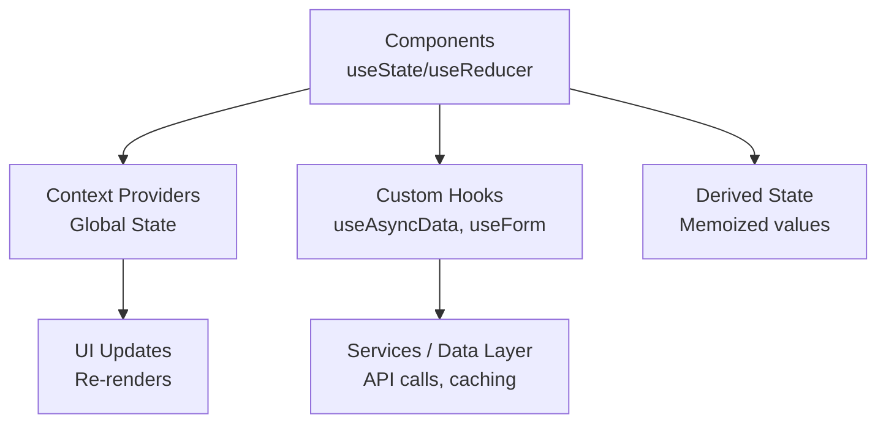
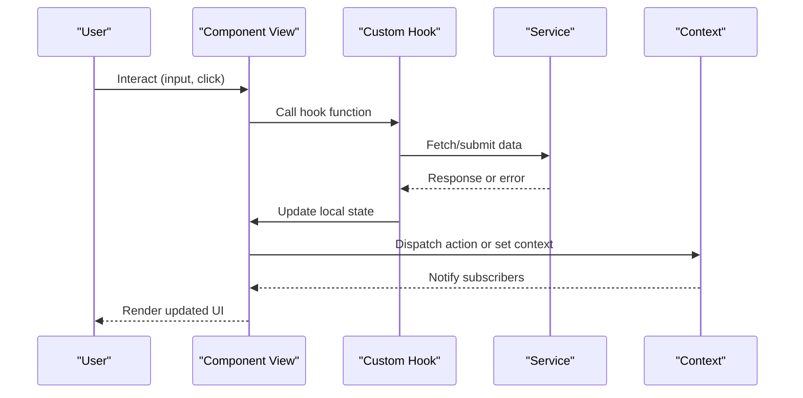
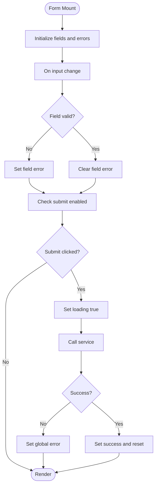
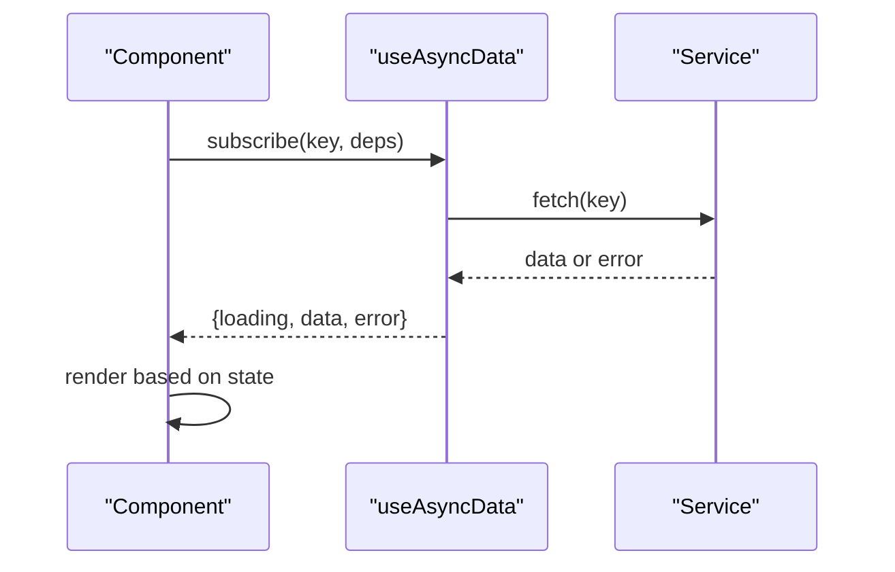
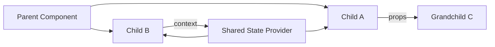
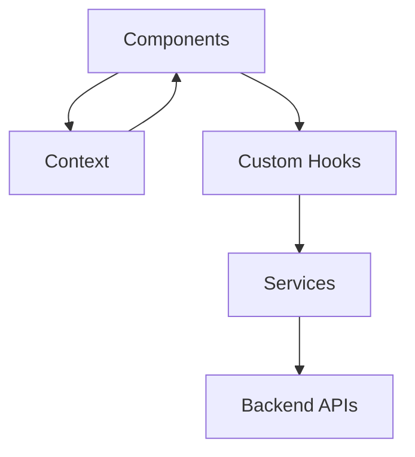

# Component State Patterns

<cite>
**Referenced Files in This Document**
- [AppContext.tsx](file://src/context/AppContext.tsx)
- [SignInView.tsx](file://src/components/SignInView.tsx)
- [SignUpView.tsx](file://src/components/SignUpView.tsx)
- [ListingForm.tsx](file://src/components/listing/ListingForm.tsx)
- [ProductDetailsView.tsx](file://src/components/ProductDetailsView.tsx)
- [DiscoverFeedView.tsx](file://src/components/DiscoverFeedView.tsx)
- [EditProfileView.tsx](file://src/components/EditProfileView.tsx)
- [CheckoutFlowView.tsx](file://src/components/CheckoutFlowView.tsx)
</cite>

## Table of Contents
1. [Introduction](#introduction)
2. [Project Structure](#project-structure)
3. [Core Components](#core-components)
4. [Architecture Overview](#architecture-overview)
5. [Detailed Component Analysis](#detailed-component-analysis)
6. [Dependency Analysis](#dependency-analysis)
7. [Performance Considerations](#performance-considerations)
8. [Troubleshooting Guide](#troubleshooting-guide)
9. [Conclusion](#conclusion)

## Introduction

This document explains how the Mooday application manages component-level state using React hooks and context patterns. It covers local state with useState, complex state with useReducer, derived state calculations, state lifting, prop drilling solutions, and composition patterns for sharing state across components. It also includes examples for form state, UI state, asynchronous data loading, synchronization between components, event handling, and performance considerations for state-heavy components.

## Project Structure

Mooday organizes features into feature-based folders under src/components, with shared logic in src/hooks, shared UI in src/components, global state in src/context, and services/data access in src/services and src/data. Typical state flows:

- Local UI state lives in components via useState/useReducer.
- Complex forms and multi-step flows often use useReducer for predictable transitions.
- Cross-cutting state (auth, theme, navigation) is lifted into context providers.
- Asynchronous data is loaded in components or custom hooks and cached locally where appropriate.

[No sources needed since this diagram shows conceptual workflow, not actual code structure]

## Core Components

Key areas where state patterns appear:

- Authentication views manage login/signup form state and async auth flows.
- Listing creation/editing uses complex form state and validation.
- Product details and discovery feeds handle async data fetching and UI toggles.
- Profile editing and checkout flows coordinate multiple pieces of state and side effects.

Examples by pattern:

- Local state with useState: toggling visibility, simple inputs, temporary UI flags.
- Complex state with useReducer: multi-step forms, nested fields, validation states.
- Derived state: computed totals, filtered lists, formatted outputs.
- Context-driven state: user session, theme, navigation, notifications.
- Async data: loading/error/success states, retries, optimistic updates.

**Section sources**
- [AppContext.tsx:1-200](file://src/context/AppContext.tsx#L1-L200)
- [SignInView.tsx:1-200](file://src/components/SignInView.tsx#L1-L200)
- [SignUpView.tsx:1-200](file://src/components/SignUpView.tsx#L1-L200)
- [ListingForm.tsx:1-200](file://src/components/listing/ListingForm.tsx#L1-L200)
- [ProductDetailsView.tsx:1-200](file://src/components/ProductDetailsView.tsx#L1-L200)
- [DiscoverFeedView.tsx:1-200](file://src/components/DiscoverFeedView.tsx#L1-L200)
- [EditProfileView.tsx:1-200](file://src/components/EditProfileView.tsx#L1-L200)
- [CheckoutFlowView.tsx:1-200](file://src/components/CheckoutFlowView.tsx#L1-L200)

## Architecture Overview

State architecture in Mooday follows a layered approach:

- Presentation layer: components hold local UI state and render derived values.
- Coordination layer: custom hooks encapsulate async logic and derived computations.
- Global layer: context provides cross-cutting state (auth, theme, navigation).
- Data layer: services abstract API calls and caching strategies.

[No sources needed since this diagram shows conceptual workflow, not actual code structure]

## Detailed Component Analysis

### Form State Management with useState and useReducer

Forms commonly combine:

- useState for individual field values and simple flags.
- useReducer for complex forms with interdependent fields, validation, and submission lifecycle.
- Derived state for enabling/disabling submit buttons and showing inline errors.

Typical flow:

- Initialize state with default values.
- Handle input changes and normalize values.
- Validate on change or blur; compute error messages.
- On submit, call service and update state for loading/success/error.

[No sources needed since this diagram shows conceptual workflow, not actual code structure]

Examples in Mooday:

- Sign-in/sign-up forms: local field state, validation, async authentication, and feedback.
- Listing form: complex nested fields, photo selection state, and submission lifecycle.
- Profile edit: persisted profile fields, avatar upload state, and save confirmation.

**Section sources**
- [SignInView.tsx:1-200](file://src/components/SignInView.tsx#L1-L200)
- [SignUpView.tsx:1-200](file://src/components/SignUpView.tsx#L1-L200)
- [ListingForm.tsx:1-200](file://src/components/listing/ListingForm.tsx#L1-L200)
- [EditProfileView.tsx:1-200](file://src/components/EditProfileView.tsx#L1-L200)

### UI State Handling with useState

Common UI state patterns include:

- Toggles: modals, drawers, tabs, filters.
- Selections: selected items, active tabs, current step.
- Temporary flags: show/hide hints, tooltips, banners.

Best practices:

- Keep UI state close to the component that renders it.
- Lift minimal state only when multiple siblings need to share it.
- Use stable keys and memoization for lists to avoid unnecessary re-renders.

Example scenarios:

- Discover feed: filter toggles, sort options, pagination state.
- Product details: image carousel index, expand/collapse sections.
- Checkout flow: step progression, payment method selection.

**Section sources**
- [DiscoverFeedView.tsx:1-200](file://src/components/DiscoverFeedView.tsx#L1-L200)
- [ProductDetailsView.tsx:1-200](file://src/components/ProductDetailsView.tsx#L1-L200)
- [CheckoutFlowView.tsx:1-200](file://src/components/CheckoutFlowView.tsx#L1-L200)

### Asynchronous Data Loading Patterns

Asynchronous flows typically follow a consistent shape:

- States: idle, loading, success, error.
- Lifecycle: fetch on mount or dependency change, handle errors, retry if needed.
- Caching: keep recent results in memory; invalidate on mutations.

Patterns:

- Use a custom hook to encapsulate fetch logic and expose {data, loading, error}.
- Derive UI state from these values (e.g., skeletons while loading, error banners).
- Debounce search inputs; throttle scroll events for infinite lists.

[No sources needed since this diagram shows conceptual workflow, not actual code structure]

Examples in Mooday:

- Discover feed: load listings with filters and pagination.
- Product details: load product metadata and media.
- Profile view: load user info and related data.

**Section sources**
- [DiscoverFeedView.tsx:1-200](file://src/components/DiscoverFeedView.tsx#L1-L200)
- [ProductDetailsView.tsx:1-200](file://src/components/ProductDetailsView.tsx#L1-L200)
- [EditProfileView.tsx:1-200](file://src/components/EditProfileView.tsx#L1-L200)

### State Lifting and Prop Drilling Solutions

When multiple components need shared state:

- Lift state to the nearest common ancestor and pass down via props.
- For deeply nested trees, introduce a context provider to avoid excessive prop drilling.
- Prefer composition: pass handlers and data through props to small presentational components.

Guidelines:

- Lift only the minimal state required by multiple children.
- Keep derived state in the component that computes it.
- Use context for truly global concerns (auth, theme, navigation), not for every piece of UI state.

[No sources needed since this diagram shows conceptual workflow, not actual code structure]

**Section sources**
- [AppContext.tsx:1-200](file://src/context/AppContext.tsx#L1-L200)

### Derived State Calculations

Derived state avoids redundant computation and keeps UI consistent:

- Compute totals, counts, and summaries from base data.
- Memoize expensive derivations to prevent re-computation on unrelated updates.
- Normalize data at the source and derive views from normalized structures.

Common techniques:

- useMemo for heavy computations.
- Selectors to extract slices of state for components.
- Stable references for lists to optimize rendering.

**Section sources**
- [DiscoverFeedView.tsx:1-200](file://src/components/DiscoverFeedView.tsx#L1-L200)
- [ProductDetailsView.tsx:1-200](file://src/components/ProductDetailsView.tsx#L1-L200)

### Event Handling Patterns

Consistent event handling improves maintainability:

- Coalesce related actions in a single handler or reducer.
- Prevent default behavior and stop propagation explicitly.
- Debounce/throttle high-frequency events (scroll, resize, input).
- Centralize analytics and logging around key interactions.

Examples:

- Form submissions: validate before sending, disable submit during loading.
- List interactions: toggle selections, open detail views.
- Navigation: guard routes based on auth state.

**Section sources**
- [SignInView.tsx:1-200](file://src/components/SignInView.tsx#L1-L200)
- [CheckoutFlowView.tsx:1-200](file://src/components/CheckoutFlowView.tsx#L1-L200)

### State Synchronization Between Components

Synchronization strategies:

- Single source of truth: lift state to a parent or context.
- Unidirectional data flow: child emits events; parent updates state.
- Optimistic updates: update UI immediately, then reconcile with server.
- Conflict resolution: last-write-wins or server-authoritative sync.

Use cases in Mooday:

- Cart and favorites: synchronize across listing cards and detail pages.
- Notifications: central store pushes updates to header badge and inbox.
- Filters: share active filters across search and category views.

**Section sources**
- [AppContext.tsx:1-200](file://src/context/AppContext.tsx#L1-L200)
- [DiscoverFeedView.tsx:1-200](file://src/components/DiscoverFeedView.tsx#L1-L200)

### Composition Patterns for State Sharing

Composition helps keep components focused:

- Presentational components receive data and callbacks via props.
- Container components manage state and orchestrate side effects.
- Reusable hooks encapsulate logic and can be composed together.

Benefits:

- Testability: pure functions and small units.
- Reusability: share logic without duplication.
- Readability: clear separation of concerns.

**Section sources**
- [ListingForm.tsx:1-200](file://src/components/listing/ListingForm.tsx#L1-L200)
- [EditProfileView.tsx:1-200](file://src/components/EditProfileView.tsx#L1-L200)

## Dependency Analysis

State dependencies typically span:

- Components depend on context for global state.
- Custom hooks depend on services for data access.
- Services depend on configuration and environment.

[No sources needed since this diagram shows conceptual workflow, not actual code structure]

**Section sources**
- [AppContext.tsx:1-200](file://src/context/AppContext.tsx#L1-L200)

## Performance Considerations

For state-heavy components:

- Minimize re-renders: memoize derived values and callbacks; split large components.
- Avoid unnecessary context updates: scope context consumers or split contexts.
- Batch updates: group state changes to reduce renders.
- Virtualize long lists: render only visible items.
- Defer non-critical work: lazy-load heavy components and data.

Optimization checklist:

- Use React.memo for pure presentational components.
- Stabilize props with useMemo/useCallback where necessary.
- Debounce search inputs and throttled scroll handlers.
- Prefetch or cache frequently accessed data.

[No sources needed since this section provides general guidance]

## Troubleshooting Guide

Common issues and resolutions:

- Stale closures: ensure dependencies are correct in useEffect/useCallback.
- Excessive re-renders: identify causes with profiling; memoize where appropriate.
- Race conditions: cancel in-flight requests on unmount or dependency change.
- Inconsistent UI: prefer single source of truth; avoid duplicated state.
- Memory leaks: clean up subscriptions and timers.

Debugging tips:

- Log state transitions in reducers or effect hooks.
- Add boundaries to isolate failures.
- Use network tab to verify payloads and responses.

**Section sources**
- [SignInView.tsx:1-200](file://src/components/SignInView.tsx#L1-L200)
- [CheckoutFlowView.tsx:1-200](file://src/components/CheckoutFlowView.tsx#L1-L200)

## Conclusion

Mooday’s component state patterns emphasize clarity and scalability:

- Local state for UI-only concerns.
- useReducer for complex, interdependent state.
- Context for global state and coordination.
- Custom hooks for reusable async and derived logic.
- Careful composition to avoid prop drilling and improve testability.

By following these patterns, the application maintains predictable state flows, supports asynchronous workflows safely, and scales efficiently as new features are added.