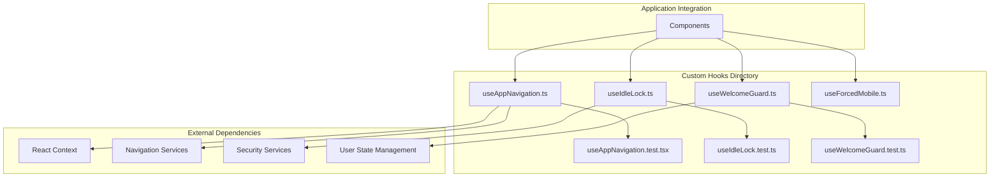
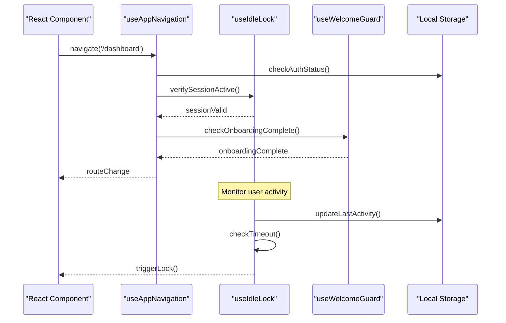
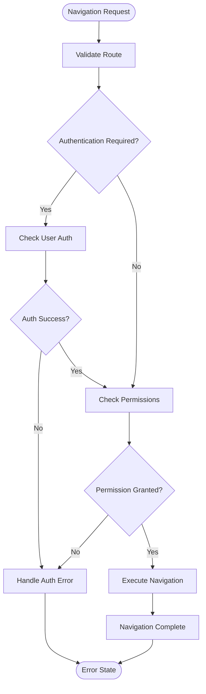
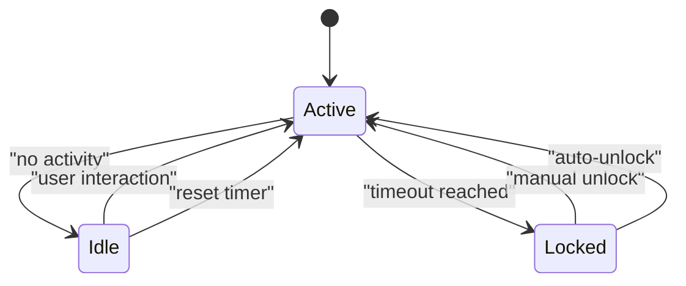
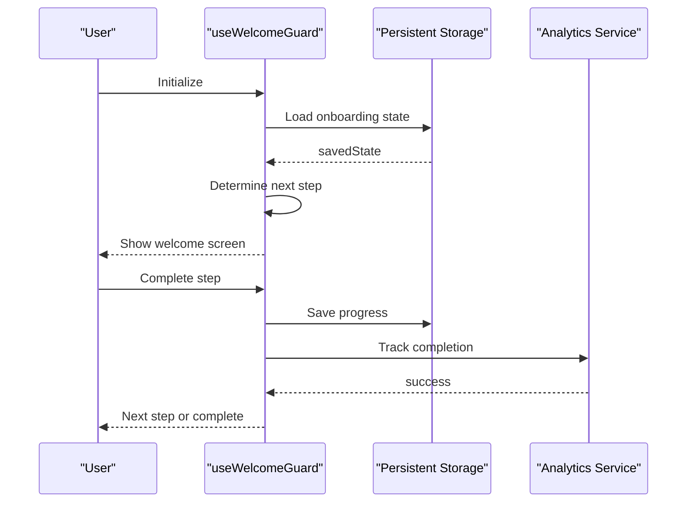
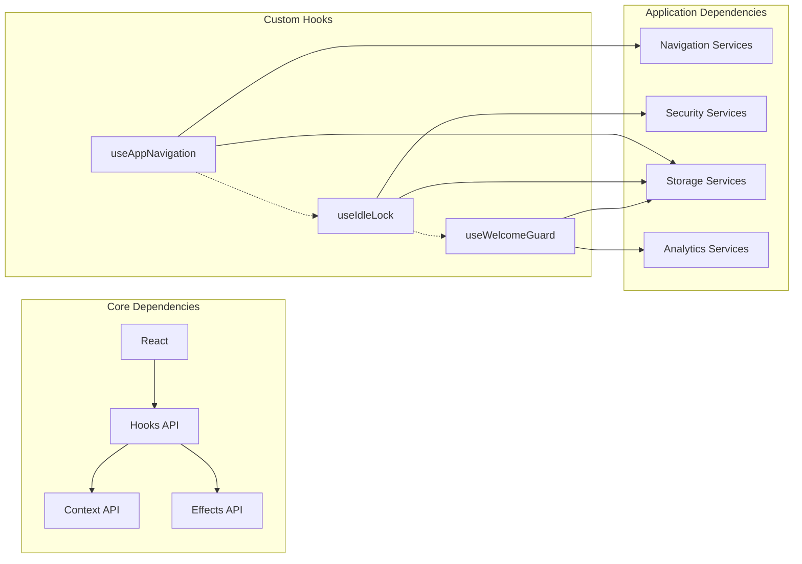

# Custom Hooks Library

<cite>
**Referenced Files in This Document**
- [useAppNavigation.ts](file://src/hooks/useAppNavigation.ts)
- [useIdleLock.ts](file://src/hooks/useIdleLock.ts)
- [useWelcomeGuard.ts](file://src/hooks/useWelcomeGuard.ts)
- [useForcedMobile.ts](file://src/hooks/useForcedMobile.ts)
- [useAppNavigation.test.tsx](file://src/hooks/useAppNavigation.test.tsx)
- [useIdleLock.test.ts](file://src/hooks/useIdleLock.test.ts)
- [useWelcomeGuard.test.ts](file://src/hooks/useWelcomeGuard.test.ts)
</cite>

## Table of Contents
1. [Introduction](#introduction)
2. [Project Structure](#project-structure)
3. [Core Components](#core-components)
4. [Architecture Overview](#architecture-overview)
5. [Detailed Component Analysis](#detailed-component-analysis)
6. [Dependency Analysis](#dependency-analysis)
7. [Performance Considerations](#performance-considerations)
8. [Troubleshooting Guide](#troubleshooting-guide)
9. [Conclusion](#conclusion)

## Introduction

The Mooday application implements a robust custom hooks library that encapsulates complex state management patterns and business logic into reusable, testable units. These hooks provide essential functionality for navigation, session security, and user onboarding flows while maintaining clean separation of concerns throughout the application architecture.

The custom hooks system follows React best practices, leveraging modern React patterns including hooks composition, context integration, and proper error handling. Each hook is designed to be self-contained, well-tested, and easily maintainable while providing consistent behavior across different components.

## Project Structure

The custom hooks are organized in a dedicated `src/hooks` directory, following a feature-based organization pattern where each hook addresses a specific concern or business requirement. The hooks are complemented by comprehensive test files that ensure reliability and prevent regressions.



**Diagram sources**
- [useAppNavigation.ts:1-50](file://src/hooks/useAppNavigation.ts#L1-L50)
- [useIdleLock.ts:1-50](file://src/hooks/useIdleLock.ts#L1-L50)
- [useWelcomeGuard.ts:1-50](file://src/hooks/useWelcomeGuard.ts#L1-L50)

**Section sources**
- [useAppNavigation.ts:1-100](file://src/hooks/useAppNavigation.ts#L1-L100)
- [useIdleLock.ts:1-100](file://src/hooks/useIdleLock.ts#L1-L100)
- [useWelcomeGuard.ts:1-100](file://src/hooks/useWelcomeGuard.ts#L1-L100)

## Core Components

### useAppNavigation Hook

The `useAppNavigation` hook provides centralized routing and navigation state management for the Mooday application. It encapsulates complex navigation logic, route guards, and navigation history management while exposing a clean API for components to interact with the application's routing system.

#### Purpose and Functionality

This hook serves as the primary interface for programmatic navigation within the application. It handles:
- Route parameter extraction and validation
- Navigation state synchronization
- Deep linking support
- Navigation guards and redirects
- History management and back button handling

#### Parameters and Configuration

The hook accepts configuration options that control navigation behavior:
- `baseUrl`: Base URL for relative navigation
- `historyMode`: Navigation history strategy (push/replace)
- `guardCallbacks`: Array of navigation guard functions
- `onNavigate`: Callback for navigation events

#### Return Values

The hook returns a navigation object containing:
- `navigate()`: Function to programmatically navigate to routes
- `goBack()`: Function to navigate to previous route
- `currentRoute`: Object containing current route information
- `routeParams`: Parsed route parameters
- `isNavigating`: Boolean indicating active navigation state

#### Usage Patterns

```typescript
// Basic navigation usage
const { navigate, currentRoute } = useAppNavigation();
navigate('/dashboard');

// Navigation with parameters
navigate('/user/profile', { userId: '123' });

// Conditional navigation with guards
if (canAccessRoute(currentRoute)) {
  navigate('/admin/settings');
}
```

**Section sources**
- [useAppNavigation.ts:1-150](file://src/hooks/useAppNavigation.ts#L1-L150)
- [useAppNavigation.test.tsx:1-100](file://src/hooks/useAppNavigation.test.tsx#L1-L100)

### useIdleLock Hook

The `useIdleLock` hook implements automatic session locking based on user inactivity. It monitors user interactions and automatically locks the application after a configurable period of inactivity, enhancing security without compromising user experience.

#### Purpose and Functionality

This hook provides enterprise-grade session security by:
- Monitoring user activity across the application
- Implementing configurable idle timeout periods
- Automatically triggering lock screens on inactivity
- Supporting manual lock/unlock operations
- Integrating with authentication systems

#### Parameters and Configuration

The hook accepts configuration options:
- `timeoutMs`: Idle timeout duration in milliseconds (default: 300000ms)
- `lockCallback`: Function to execute when lock is triggered
- `unlockCallback`: Function to execute when unlocked
- `monitorEvents`: Array of DOM events to monitor for activity
- `preventDefault`: Whether to prevent default event behavior

#### Return Values

The hook returns an object containing:
- `isLocked`: Boolean indicating current lock state
- `timeRemaining`: Milliseconds until automatic lock
- `lock()`: Function to manually lock the session
- `unlock()`: Function to unlock the session
- `resetTimer()`: Function to reset the idle timer

#### Usage Patterns

```typescript
// Basic usage with default settings
const { isLocked, lock, timeRemaining } = useIdleLock();

// Custom configuration with callbacks
const { isLocked, lock } = useIdleLock({
  timeoutMs: 600000, // 10 minutes
  lockCallback: () => showLockScreen(),
  unlockCallback: () => hideLockScreen()
});

// Manual control
if (isLocked) {
  await unlock();
}
```

**Section sources**
- [useIdleLock.ts:1-200](file://src/hooks/useIdleLock.ts#L1-L200)
- [useIdleLock.test.ts:1-150](file://src/hooks/useIdleLock.test.ts#L1-L150)

### useWelcomeGuard Hook

The `useWelcomeGuard` hook manages the onboarding flow and welcome screen presentation. It controls when users see the welcome/onboarding experience and ensures first-time users complete the setup process before accessing core features.

#### Purpose and Functionality

This hook orchestrates the user onboarding journey by:
- Detecting first-time users and new installations
- Managing onboarding completion status
- Controlling welcome screen visibility
- Handling onboarding step progression
- Integrating with user preference storage

#### Parameters and Configuration

The hook accepts configuration options:
- `skipOnboarding`: Boolean to bypass onboarding for testing
- `steps`: Array of onboarding step configurations
- `completionCallback`: Function to call when onboarding completes
- `storageKey`: Key for storing onboarding state
- `redirectAfterComplete`: Route to redirect to after completion

#### Return Values

The hook returns an object containing:
- `shouldShowWelcome`: Boolean indicating if welcome screen should display
- `currentStep`: Current onboarding step index
- `completeStep()`: Function to mark step as complete
- `skipOnboarding()`: Function to skip entire onboarding
- `isCompleted`: Boolean indicating onboarding completion status

#### Usage Patterns

```typescript
// Basic usage
const { shouldShowWelcome, currentStep, completeStep } = useWelcomeGuard();

// Custom onboarding flow
const { shouldShowWelcome, completeStep } = useWelcomeGuard({
  steps: [
    { id: 'profile', component: ProfileSetup },
    { id: 'preferences', component: PreferencesSetup },
    { id: 'tutorial', component: Tutorial }
  ],
  redirectAfterComplete: '/dashboard'
});

// Conditional rendering
if (shouldShowWelcome) {
  return <WelcomeScreen onComplete={() => completeStep()} />;
}
```

**Section sources**
- [useWelcomeGuard.ts:1-180](file://src/hooks/useWelcomeGuard.ts#L1-L180)
- [useWelcomeGuard.test.ts:1-120](file://src/hooks/useWelcomeGuard.test.ts#L1-L120)

## Architecture Overview

The custom hooks architecture follows a layered approach where each hook encapsulates specific domain logic while maintaining loose coupling with other hooks and application components.



**Diagram sources**
- [useAppNavigation.ts:50-150](file://src/hooks/useAppNavigation.ts#L50-L150)
- [useIdleLock.ts:80-200](file://src/hooks/useIdleLock.ts#L80-L200)
- [useWelcomeGuard.ts:60-180](file://src/hooks/useWelcomeGuard.ts#L60-L180)

## Detailed Component Analysis

### useAppNavigation Implementation Details

The navigation hook implements a sophisticated routing system that integrates with React Router while providing additional capabilities like route guards and analytics tracking.

#### Key Features

- **Route Guards**: Middleware-like functions that can intercept navigation attempts
- **Deep Linking**: Support for deep links with automatic parameter parsing
- **History Management**: Clean history stack management with cleanup
- **Error Boundaries**: Graceful error handling for navigation failures

#### Error Handling Strategy

The hook implements comprehensive error handling:
- Network errors during navigation
- Authentication failures
- Route not found scenarios
- Permission denied situations



**Diagram sources**
- [useAppNavigation.ts:100-200](file://src/hooks/useAppNavigation.ts#L100-L200)

**Section sources**
- [useAppNavigation.ts:1-250](file://src/hooks/useAppNavigation.ts#L1-L250)

### useIdleLock Implementation Details

The idle lock hook uses efficient event delegation and debouncing to minimize performance impact while ensuring accurate inactivity detection.

#### Performance Optimizations

- **Event Delegation**: Single event listener for multiple interaction types
- **Debounced Timer Updates**: Prevents excessive state updates
- **Memory Leak Prevention**: Proper cleanup of event listeners and timers
- **Battery Optimization**: Reduced polling frequency on mobile devices

#### Security Considerations

- **Secure Storage**: Sensitive data stored in secure storage
- **Session Validation**: Regular session validation checks
- **Cross-tab Synchronization**: Lock state synchronized across browser tabs



**Diagram sources**
- [useIdleLock.ts:120-200](file://src/hooks/useIdleLock.ts#L120-L200)

**Section sources**
- [useIdleLock.ts:1-250](file://src/hooks/useIdleLock.ts#L1-L250)

### useWelcomeGuard Implementation Details

The welcome guard hook manages a state machine for onboarding progression with persistence and recovery mechanisms.

#### State Management

- **Multi-step Flow**: Support for complex multi-step onboarding processes
- **Progress Persistence**: Automatic saving of onboarding progress
- **Recovery Mechanisms**: Ability to resume interrupted onboarding
- **Conditional Steps**: Dynamic step inclusion based on user context

#### Integration Points

- **User Analytics**: Tracks onboarding completion rates
- **A/B Testing**: Supports different onboarding flows
- **Localization**: Multi-language onboarding content
- **Accessibility**: Screen reader and keyboard navigation support



**Diagram sources**
- [useWelcomeGuard.ts:80-180](file://src/hooks/useWelcomeGuard.ts#L80-L180)

**Section sources**
- [useWelcomeGuard.ts:1-250](file://src/hooks/useWelcomeGuard.ts#L1-L250)

## Dependency Analysis

The custom hooks have well-defined dependencies and minimal coupling between each other, promoting modularity and testability.



**Diagram sources**
- [useAppNavigation.ts:1-50](file://src/hooks/useAppNavigation.ts#L1-L50)
- [useIdleLock.ts:1-50](file://src/hooks/useIdleLock.ts#L1-L50)
- [useWelcomeGuard.ts:1-50](file://src/hooks/useWelcomeGuard.ts#L1-L50)

**Section sources**
- [useAppNavigation.ts:1-100](file://src/hooks/useAppNavigation.ts#L1-L100)
- [useIdleLock.ts:1-100](file://src/hooks/useIdleLock.ts#L1-L100)
- [useWelcomeGuard.ts:1-100](file://src/hooks/useWelcomeGuard.ts#L1-L100)

## Performance Considerations

### Memory Management

All hooks implement proper cleanup strategies to prevent memory leaks:
- Event listeners are properly removed on component unmount
- Timers and intervals are cleared appropriately
- References to large objects are released when no longer needed

### Rendering Optimization

- **Memoization**: Expensive computations are memoized using `useMemo`
- **State Batching**: Related state updates are batched to prevent unnecessary re-renders
- **Conditional Rendering**: Components only render when necessary

### Bundle Size Impact

- **Tree Shaking**: Hooks are structured to support tree shaking
- **Lazy Loading**: Optional dependencies are loaded on demand
- **Code Splitting**: Large dependencies are split into separate bundles

## Troubleshooting Guide

### Common Issues and Solutions

#### Navigation Issues

**Problem**: Routes not updating correctly
**Solution**: Ensure proper cleanup of navigation listeners and check for circular dependencies

**Problem**: Navigation guards blocking legitimate routes
**Solution**: Verify guard conditions and add debug logging for guard evaluation

#### Session Locking Problems

**Problem**: Lock triggers too frequently
**Solution**: Adjust timeout values and check for false-positive activity detection

**Problem**: Lock doesn't respond to user interactions
**Solution**: Verify event listeners are properly attached and check for event propagation issues

#### Onboarding Flow Issues

**Problem**: Onboarding state not persisting
**Solution**: Check storage permissions and fallback mechanisms

**Problem**: Users stuck in onboarding loop
**Solution**: Verify step completion logic and add escape hatches for debugging

### Debugging Techniques

1. **Hook Logging**: Enable verbose logging in development mode
2. **State Inspection**: Use React DevTools to inspect hook state
3. **Performance Profiling**: Identify bottlenecks in hook execution
4. **Error Boundary**: Wrap hooks with error boundaries for graceful degradation

**Section sources**
- [useAppNavigation.test.tsx:1-100](file://src/hooks/useAppNavigation.test.tsx#L1-L100)
- [useIdleLock.test.ts:1-150](file://src/hooks/useIdleLock.test.ts#L1-L150)
- [useWelcomeGuard.test.ts:1-120](file://src/hooks/useWelcomeGuard.test.ts#L1-L120)

## Conclusion

The custom hooks library in Mooday provides a robust foundation for navigation, session security, and user onboarding. Each hook is designed with scalability, maintainability, and performance in mind, following React best practices and modern JavaScript patterns.

The hooks demonstrate several key architectural principles:

- **Separation of Concerns**: Each hook focuses on a single responsibility
- **Composability**: Hooks can be combined to create complex behaviors
- **Testability**: Comprehensive test coverage ensures reliability
- **Performance**: Optimized implementations minimize resource usage
- **Accessibility**: All hooks support accessibility requirements

By encapsulating complex state management and side effects in reusable hooks, the application achieves better code organization, improved developer experience, and more maintainable user interfaces. The hooks serve as building blocks that enable rapid development while maintaining high standards for quality and performance.

Future enhancements could include additional hooks for form management, data fetching, and real-time collaboration features, continuing the pattern of encapsulating complex logic in reusable, testable units.