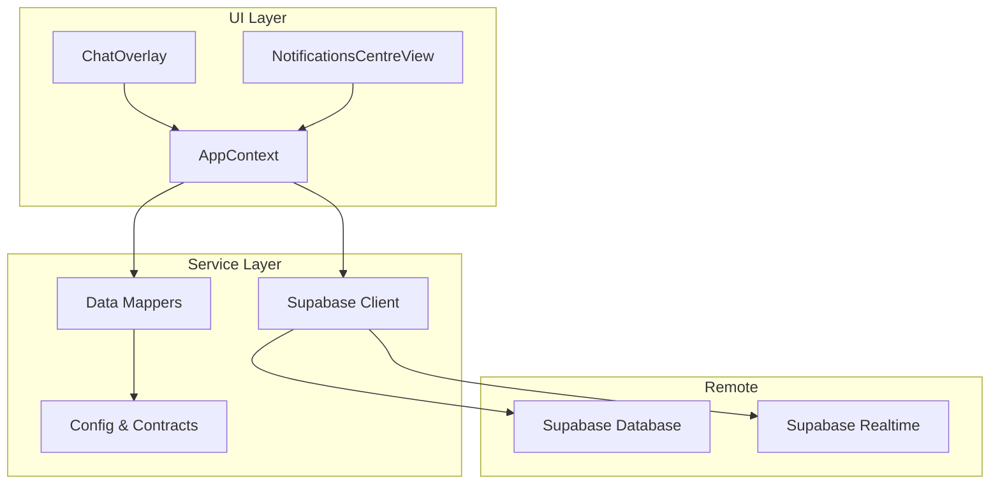
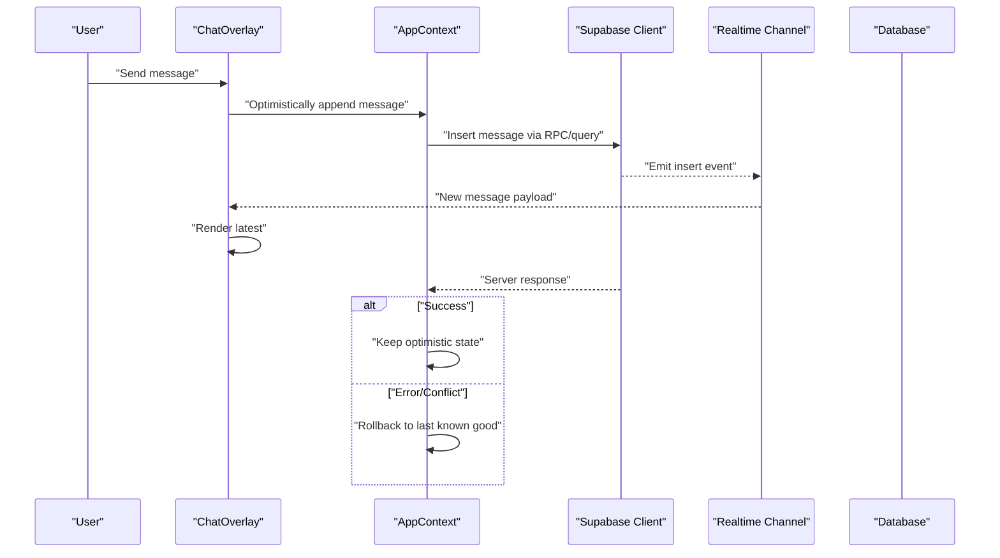
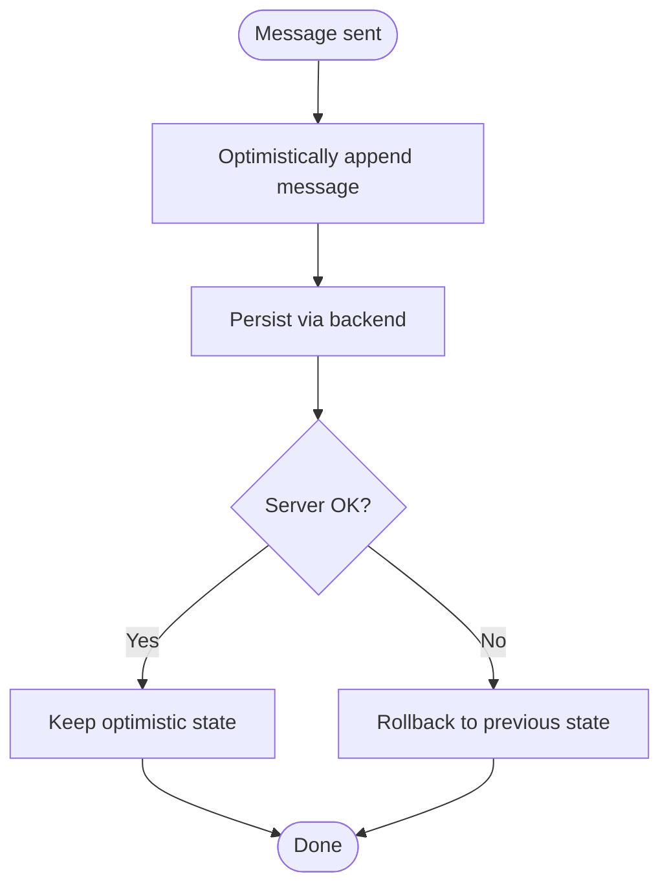
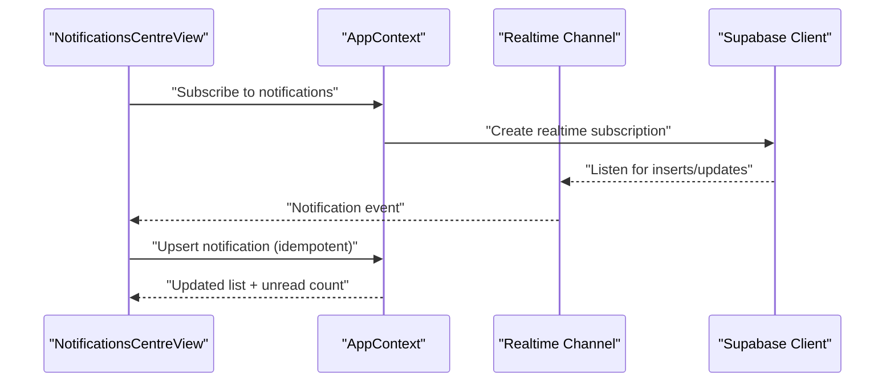
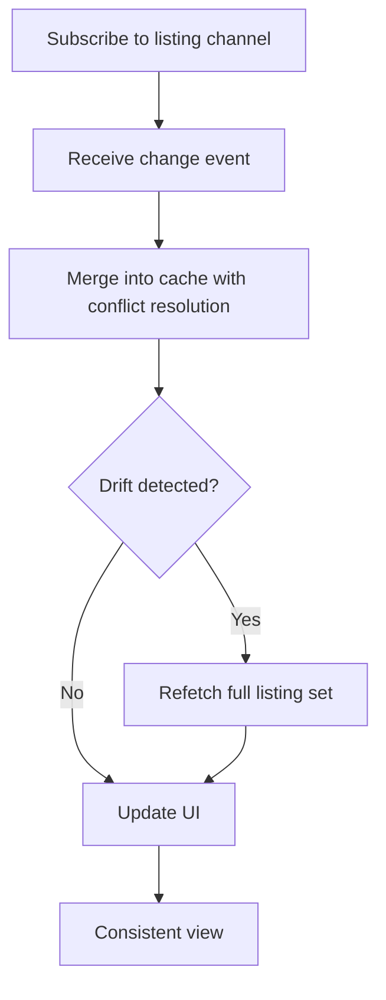
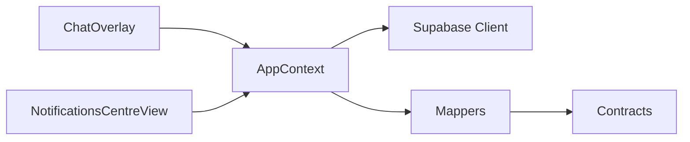

# Data Synchronization & Real-time Updates

<cite>
**Referenced Files in This Document**
- [supabase.ts](file://src/services/backend/supabase.ts)
- [realtime.test.ts](file://src/services/backend/realtime.test.ts)
- [ChatOverlay.tsx](file://src/components/ChatOverlay.tsx)
- [NotificationsCentreView.tsx](file://src/components/NotificationsCentreView.tsx)
- [AppContext.tsx](file://src/context/AppContext.tsx)
- [mappers.ts](file://src/services/backend/mappers.ts)
- [config.ts](file://src/services/backend/config.ts)
- [contracts.ts](file://src/services/backend/contracts.ts)
</cite>

## Table of Contents
1. [Introduction](#introduction)
2. [Project Structure](#project-structure)
3. [Core Components](#core-components)
4. [Architecture Overview](#architecture-overview)
5. [Detailed Component Analysis](#detailed-component-analysis)
6. [Dependency Analysis](#dependency-analysis)
7. [Performance Considerations](#performance-considerations)
8. [Troubleshooting Guide](#troubleshooting-guide)
9. [Conclusion](#conclusion)

## Introduction

This document explains how Mooday synchronizes data between local component state and remote Supabase sources using real-time subscriptions, optimistic updates, and conflict resolution strategies. It covers caching, offline support, error handling, retry mechanisms, and consistency patterns across chat messages, notifications, and live inventory updates.

## Project Structure

Mooday’s real-time and synchronization features are implemented across:
- Backend service layer for Supabase client configuration and typed contracts
- UI components that subscribe to real-time channels and render live updates
- Context providers that centralize state and coordination logic
- Mapping utilities to normalize server payloads into UI models

**Diagram sources**
- [ChatOverlay.tsx](file://src/components/ChatOverlay.tsx)
- [NotificationsCentreView.tsx](file://src/components/NotificationsCentreView.tsx)
- [AppContext.tsx](file://src/context/AppContext.tsx)
- [supabase.ts](file://src/services/backend/supabase.ts)
- [mappers.ts](file://src/services/backend/mappers.ts)
- [config.ts](file://src/services/backend/config.ts)
- [contracts.ts](file://src/services/backend/contracts.ts)

**Section sources**
- [ChatOverlay.tsx](file://src/components/ChatOverlay.tsx)
- [NotificationsCentreView.tsx](file://src/components/NotificationsCentreView.tsx)
- [AppContext.tsx](file://src/context/AppContext.tsx)
- [supabase.ts](file://src/services/backend/supabase.ts)
- [mappers.ts](file://src/services/backend/mappers.ts)
- [config.ts](file://src/services/backend/config.ts)
- [contracts.ts](file://src/services/backend/contracts.ts)

## Core Components

- Supabase client and real-time channel management:
  - Centralized initialization and configuration
  - Typed channels for tables like chats, notifications, listings
  - Subscription lifecycle (subscribe/unsubscribe) and reconnection handling

- UI components:
  - ChatOverlay: subscribes to chat room events, renders messages in real time
  - NotificationsCentreView: listens for new notifications and updates counts

- AppContext:
  - Holds normalized, up-to-date collections
  - Coordinates optimistic writes and rollback on failure
  - Provides hooks for components to consume live data

- Mappers and contracts:
  - Normalize server responses into stable UI types
  - Enforce schema contracts for consistent data flow

**Section sources**
- [supabase.ts](file://src/services/backend/supabase.ts)
- [ChatOverlay.tsx](file://src/components/ChatOverlay.tsx)
- [NotificationsCentreView.tsx](file://src/components/NotificationsCentreView.tsx)
- [AppContext.tsx](file://src/context/AppContext.tsx)
- [mappers.ts](file://src/services/backend/mappers.ts)
- [contracts.ts](file://src/services/backend/contracts.ts)

## Architecture Overview

The system uses a publish/subscribe model over Supabase Realtime. Components subscribe to channels scoped by resource identifiers (e.g., chat room ID). On write operations, the UI performs an optimistic update to keep interactions snappy, then reconciles with the server response. If the server rejects or conflicts occur, the context rolls back to the last known good state.

**Diagram sources**
- [ChatOverlay.tsx](file://src/components/ChatOverlay.tsx)
- [AppContext.tsx](file://src/context/AppContext.tsx)
- [supabase.ts](file://src/services/backend/supabase.ts)

## Detailed Component Analysis

### Supabase Integration and Real-time Channels

Responsibilities:
- Initialize the Supabase client with environment configuration
- Expose typed methods to subscribe to channels for specific tables
- Manage subscription lifecycles and reconnection behavior
- Provide error boundaries and logging for network issues

Key behaviors:
- Subscribe per resource scope (e.g., chat room, notification feed)
- Debounce or coalesce rapid updates where appropriate
- Ensure subscriptions are cleaned up on unmount to avoid leaks

**Section sources**
- [supabase.ts](file://src/services/backend/supabase.ts)
- [config.ts](file://src/services/backend/config.ts)

### Chat Messages: Real-time Flow

Flow:
- User sends a message
- Optimistic append to local list
- Server insertion via API/RPC
- Realtime broadcast of the new message
- UI renders immediately; reconcile with server response
- On failure, rollback the optimistic entry

**Diagram sources**
- [ChatOverlay.tsx](file://src/components/ChatOverlay.tsx)
- [AppContext.tsx](file://src/context/AppContext.tsx)
- [supabase.ts](file://src/services/backend/supabase.ts)

**Section sources**
- [ChatOverlay.tsx](file://src/components/ChatOverlay.tsx)
- [AppContext.tsx](file://src/context/AppContext.tsx)

### Notifications Centre: Live Updates

Behavior:
- Subscribe to notification events for the current user
- Increment unread counters and prepend new items
- Mark as read when opened or viewed
- Handle duplicates by idempotent upserts

**Diagram sources**
- [NotificationsCentreView.tsx](file://src/components/NotificationsCentreView.tsx)
- [AppContext.tsx](file://src/context/AppContext.tsx)
- [supabase.ts](file://src/services/backend/supabase.ts)

**Section sources**
- [NotificationsCentreView.tsx](file://src/components/NotificationsCentreView.tsx)
- [AppContext.tsx](file://src/context/AppContext.tsx)

### Live Inventory Updates: Listings and Stock

Approach:
- Subscribe to listing changes (price, stock, availability)
- Apply delta updates to cached listings
- Use versioning or timestamps to resolve conflicts
- Re-fetch full dataset if drift is detected

**Diagram sources**
- [AppContext.tsx](file://src/context/AppContext.tsx)
- [supabase.ts](file://src/services/backend/supabase.ts)

**Section sources**
- [AppContext.tsx](file://src/context/AppContext.tsx)
- [supabase.ts](file://src/services/backend/supabase.ts)

### Data Models and Mapping

Purpose:
- Normalize server payloads into stable UI types
- Enforce contracts for fields used by real-time flows
- Provide helpers for diffing and merging records

Patterns:
- Idempotent upserts keyed by unique IDs
- Stable sort keys for lists to minimize re-renders
- Versioned entities to detect stale updates

**Section sources**
- [mappers.ts](file://src/services/backend/mappers.ts)
- [contracts.ts](file://src/services/backend/contracts.ts)

## Dependency Analysis

High-level dependencies:
- UI components depend on AppContext for live state
- AppContext depends on Supabase client for subscriptions and mutations
- Mappers depend on contracts to ensure type safety
- Tests validate realtime behavior and edge cases

**Diagram sources**
- [ChatOverlay.tsx](file://src/components/ChatOverlay.tsx)
- [NotificationsCentreView.tsx](file://src/components/NotificationsCentreView.tsx)
- [AppContext.tsx](file://src/context/AppContext.tsx)
- [supabase.ts](file://src/services/backend/supabase.ts)
- [mappers.ts](file://src/services/backend/mappers.ts)
- [contracts.ts](file://src/services/backend/contracts.ts)

**Section sources**
- [ChatOverlay.tsx](file://src/components/ChatOverlay.tsx)
- [NotificationsCentreView.tsx](file://src/components/NotificationsCentreView.tsx)
- [AppContext.tsx](file://src/context/AppContext.tsx)
- [supabase.ts](file://src/services/backend/supabase.ts)
- [mappers.ts](file://src/services/backend/mappers.ts)
- [contracts.ts](file://src/services/backend/contracts.ts)

## Performance Considerations

- Prefer incremental updates via realtime deltas instead of full refetches
- Debounce high-frequency events (e.g., typing indicators)
- Use stable keys and minimal re-renders in lists
- Coalesce multiple updates within short windows
- Unsubscribe from channels on navigation to free resources
- Cache recent items locally to reduce network load

[No sources needed since this section provides general guidance]

## Troubleshooting Guide

Common issues and resolutions:
- Network failures:
  - Implement exponential backoff retries for mutations
  - Queue writes and replay when connectivity restores
  - Surface user-friendly errors and allow retry actions

- Duplicate events:
  - Ensure idempotent upserts keyed by unique IDs
  - Deduplicate incoming realtime payloads before applying

- Stale data:
  - Compare server timestamps or versions with local cache
  - Trigger refetch when drift exceeds threshold

- Subscription leaks:
  - Always unsubscribe on component unmount or route change
  - Centralize subscription lifecycle in context

- Conflict resolution:
  - Last-write-wins with version checks
  - For critical data (orders, payments), prefer server-authoritative reconciliation

**Section sources**
- [realtime.test.ts](file://src/services/backend/realtime.test.ts)
- [AppContext.tsx](file://src/context/AppContext.tsx)
- [supabase.ts](file://src/services/backend/supabase.ts)

## Conclusion

Mooday achieves responsive, consistent user experiences by combining optimistic UI updates with robust Supabase Realtime subscriptions. The architecture emphasizes idempotency, conflict resolution, and careful lifecycle management to maintain data consistency across devices and network conditions. By following these patterns, features like chat, notifications, and live inventory remain fast and reliable under varying conditions.