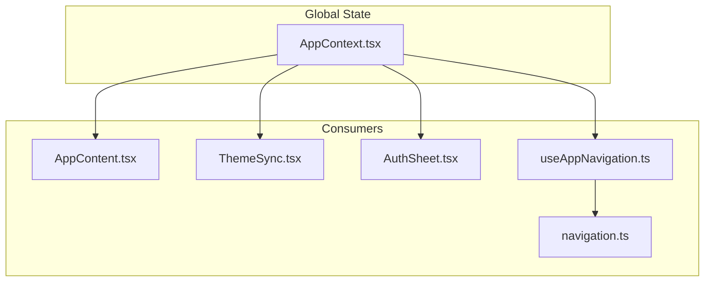
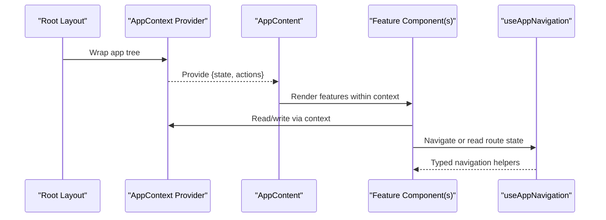
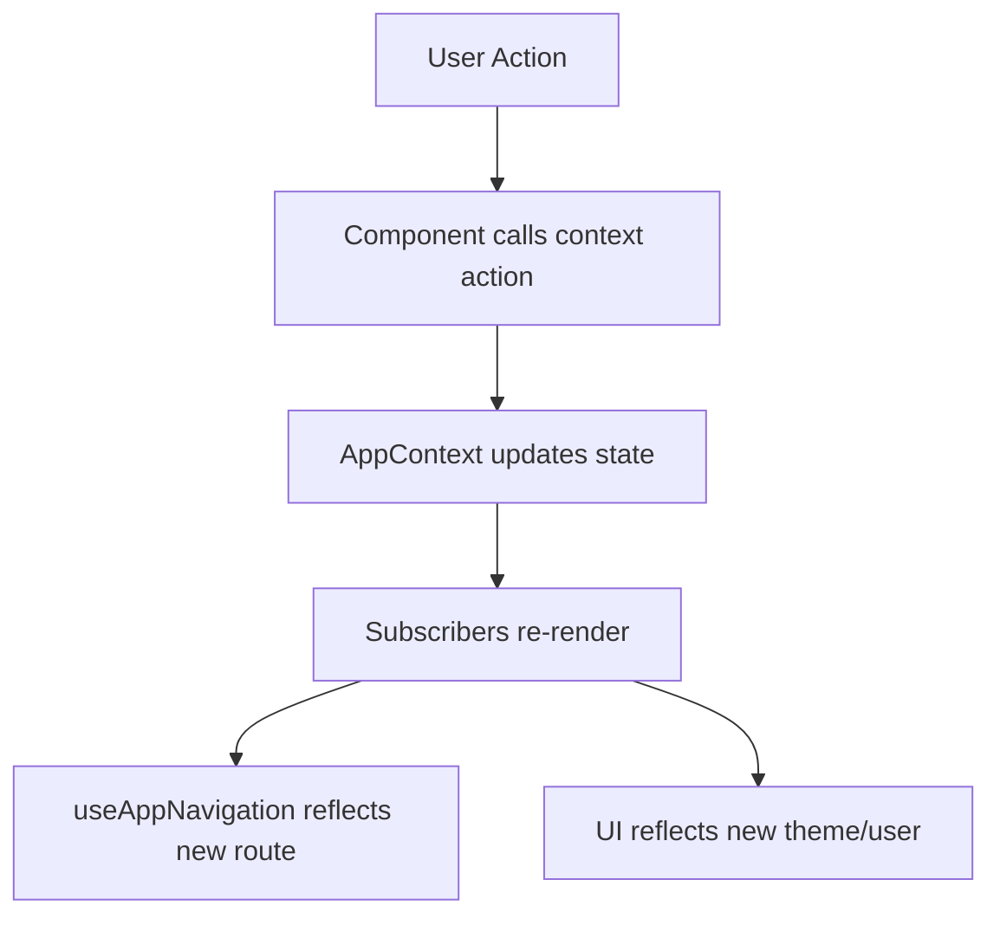
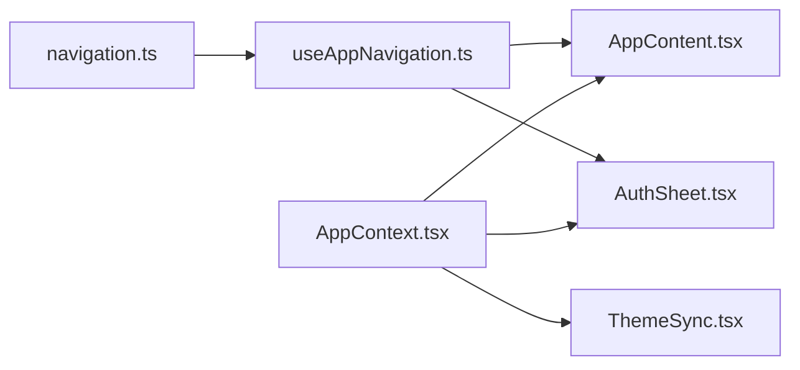

# Global Context Management

<cite>
**Referenced Files in This Document**
- [AppContext.tsx](file://src/context/AppContext.tsx)
- [AppContext.test.tsx](file://src/context/AppContext.test.tsx)
- [markChatRead.test.tsx](file://src/context/markChatRead.test.tsx)
- [AppContent.tsx](file://src/components/AppContent.tsx)
- [ThemeSync.tsx](file://src/components/ThemeSync.tsx)
- [AuthSheet.tsx](file://src/components/AuthSheet.tsx)
- [useAppNavigation.ts](file://src/hooks/useAppNavigation.ts)
- [navigation.ts](file://src/types/navigation.ts)
</cite>

## Table of Contents
1. Introduction
2. Project Structure
3. Core Components
4. Architecture Overview
5. Detailed Component Analysis
6. Dependency Analysis
7. Performance Considerations
8. Troubleshooting Guide
9. Conclusion

## Introduction
This document explains how Mooday manages global application state using the React Context API, centered around AppContext. It covers the context structure, available state properties and methods for updating state, how to consume and update context from components, and how providers are composed. It also clarifies how AppContext relates to other state management patterns used across the app such as hooks-based navigation state and component-local state.

## Project Structure
Mooday organizes global state under src/context, with AppContext as the central provider. Consumers include layout-level components (e.g., AppContent), feature-specific UI (e.g., AuthSheet), theme synchronization (ThemeSync), and navigation utilities (useAppNavigation). Types for navigation are centralized in src/types/navigation.ts.



**Diagram sources**
- [AppContext.tsx:1-200](file://src/context/AppContext.tsx#L1-L200)
- [AppContent.tsx:1-200](file://src/components/AppContent.tsx#L1-L200)
- [ThemeSync.tsx:1-200](file://src/components/ThemeSync.tsx#L1-L200)
- [AuthSheet.tsx:1-200](file://src/components/AuthSheet.tsx#L1-L200)
- [useAppNavigation.ts:1-200](file://src/hooks/useAppNavigation.ts#L1-L200)
- [navigation.ts:1-200](file://src/types/navigation.ts#L1-L200)

**Section sources**
- [AppContext.tsx:1-200](file://src/context/AppContext.tsx#L1-L200)
- [AppContent.tsx:1-200](file://src/components/AppContent.tsx#L1-L200)
- [ThemeSync.tsx:1-200](file://src/components/ThemeSync.tsx#L1-L200)
- [AuthSheet.tsx:1-200](file://src/components/AuthSheet.tsx#L1-L200)
- [useAppNavigation.ts:1-200](file://src/hooks/useAppNavigation.ts#L1-L200)
- [navigation.ts:1-200](file://src/types/navigation.ts#L1-L200)

## Core Components
- AppContext Provider: Centralizes application-wide data such as user authentication state, theme preferences, and navigation state. Exposes a context object with both state values and updater functions.
- Consumers:
  - AppContent: Wraps the application shell and typically subscribes to global state to render layout or guard routes.
  - ThemeSync: Synchronizes theme state between context and platform/browser settings.
  - AuthSheet: Presents authentication flows and updates auth-related state via context.
  - useAppNavigation: Hook that reads/writes navigation state exposed by context and is typed by navigation types.

Key responsibilities:
- Provide a single source of truth for cross-cutting concerns (auth, theme, navigation).
- Offer typed updater methods to mutate state safely.
- Keep consumers decoupled from implementation details by consuming only what they need.

**Section sources**
- [AppContext.tsx:1-200](file://src/context/AppContext.tsx#L1-L200)
- [AppContent.tsx:1-200](file://src/components/AppContent.tsx#L1-L200)
- [ThemeSync.tsx:1-200](file://src/components/ThemeSync.tsx#L1-L200)
- [AuthSheet.tsx:1-200](file://src/components/AuthSheet.tsx#L1-L200)
- [useAppNavigation.ts:1-200](file://src/hooks/useAppNavigation.ts#L1-L200)
- [navigation.ts:1-200](file://src/types/navigation.ts#L1-L200)

## Architecture Overview
The following diagram shows how AppContext sits at the root of the app tree and how consumers interact with it.



**Diagram sources**
- [AppContext.tsx:1-200](file://src/context/AppContext.tsx#L1-L200)
- [AppContent.tsx:1-200](file://src/components/AppContent.tsx#L1-L200)
- [useAppNavigation.ts:1-200](file://src/hooks/useAppNavigation.ts#L1-L200)

## Detailed Component Analysis

### AppContext: Central State Provider
AppContext defines the shape of global state and exposes updater methods. Typical responsibilities include:
- Authentication: Current user/session state and login/logout flows.
- Theme: Preferred theme mode and persistence.
- Navigation: Current route, history, or deep-linking state.
- Optional flags: Onboarding status, feature toggles, or UI overlays.

Consumers access state and call updater methods through the context. The provider encapsulates logic to keep state consistent and triggers re-renders only where needed.

```mermaid
classDiagram
class AppContextState {
+user
+theme
+navigation
+flags
}
class AppContextActions {
+login(user)
+logout()
+setTheme(theme)
+navigate(to)
+toggleFlag(key, value)
}
class AppContextProvider {
+value = { state, actions }
}
AppContextProvider --> AppContextState : "holds"
AppContextProvider --> AppContextActions : "exposes"
```

**Diagram sources**
- [AppContext.tsx:1-200](file://src/context/AppContext.tsx#L1-L200)

**Section sources**
- [AppContext.tsx:1-200](file://src/context/AppContext.tsx#L1-L200)

### Consuming Context in Components
Components can consume AppContext to:
- Read current user, theme, or navigation state.
- Invoke updater methods to change state (e.g., log in/out, switch theme, navigate).
- Compose multiple consumers if necessary, keeping each component focused on one concern.

Best practices:
- Consume only the fields you need to minimize re-renders.
- Prefer custom hooks when multiple consumers share logic.
- Keep business logic out of UI; delegate to actions provided by context.

Example references:
- Reading and writing auth state in a feature screen.
- Switching theme based on user preference.
- Navigating to a new route after an action completes.

**Section sources**
- [AppContent.tsx:1-200](file://src/components/AppContent.tsx#L1-L200)
- [AuthSheet.tsx:1-200](file://src/components/AuthSheet.tsx#L1-L200)
- [ThemeSync.tsx:1-200](file://src/components/ThemeSync.tsx#L1-L200)

### Managing Context Providers
- Place the AppContext provider near the root of the app tree so all descendants can access global state.
- If additional providers exist (e.g., routing, analytics), compose them alongside AppContext.
- Avoid nesting multiple instances of the same context unless intentional for isolation.

Provider composition example:
- Root layout wraps the entire app with AppContext.
- Feature-specific providers wrap smaller subtrees if needed.

**Section sources**
- [AppContent.tsx:1-200](file://src/components/AppContent.tsx#L1-L200)

### Relationship with Other State Patterns
- Hooks-based navigation: useAppNavigation reads and writes navigation state exposed by AppContext and is strongly typed by navigation types. This keeps navigation logic cohesive and testable.
- Component-local state: For UI-only state (e.g., form inputs, modal visibility), prefer local state or lightweight hooks rather than pushing everything into global context.
- Data fetching: Use services or hooks to fetch data and then update context via provided actions. This separates concerns between network I/O and UI state.



**Diagram sources**
- [AppContext.tsx:1-200](file://src/context/AppContext.tsx#L1-L200)
- [useAppNavigation.ts:1-200](file://src/hooks/useAppNavigation.ts#L1-L200)
- [navigation.ts:1-200](file://src/types/navigation.ts#L1-L200)

**Section sources**
- [useAppNavigation.ts:1-200](file://src/hooks/useAppNavigation.ts#L1-L200)
- [navigation.ts:1-200](file://src/types/navigation.ts#L1-L200)

## Dependency Analysis
AppContext depends on:
- Types for navigation and possibly user/theme models.
- Any persistence layer for theme or session (if implemented inside the provider).

Consumers depend on:
- AppContext for reading/updating global state.
- useAppNavigation for typed navigation operations.
- Feature components for domain-specific UI.



**Diagram sources**
- [AppContext.tsx:1-200](file://src/context/AppContext.tsx#L1-L200)
- [useAppNavigation.ts:1-200](file://src/hooks/useAppNavigation.ts#L1-L200)
- [navigation.ts:1-200](file://src/types/navigation.ts#L1-L200)
- [AppContent.tsx:1-200](file://src/components/AppContent.tsx#L1-L200)
- [ThemeSync.tsx:1-200](file://src/components/ThemeSync.tsx#L1-L200)
- [AuthSheet.tsx:1-200](file://src/components/AuthSheet.tsx#L1-L200)

**Section sources**
- [AppContext.tsx:1-200](file://src/context/AppContext.tsx#L1-L200)
- [useAppNavigation.ts:1-200](file://src/hooks/useAppNavigation.ts#L1-L200)
- [navigation.ts:1-200](file://src/types/navigation.ts#L1-L200)

## Performance Considerations
- Minimize re-renders by selecting only the needed fields from context in consumers.
- Memoize derived values when possible.
- Avoid placing frequently changing data in context if it causes excessive re-renders; consider splitting contexts or using local state for volatile UI data.
- Batch related state updates to reduce render cycles.
- Keep provider logic pure and deterministic to aid testing and debugging.

[No sources needed since this section provides general guidance]

## Troubleshooting Guide
Common issues and resolutions:
- Missing provider: Ensure AppContext wraps the part of the tree that consumes it.
- Stale state: Verify that actions are invoked correctly and that consumers subscribe to the right fields.
- Navigation inconsistencies: Confirm that useAppNavigation is used consistently and that navigation types match actual routes.
- Theme not persisting: Check any persistence logic inside the provider and ensure it runs on mount and on changes.

Use tests to validate behavior:
- AppContext tests verify state transitions and action correctness.
- markChatRead tests demonstrate typical consumer interactions with context actions.

**Section sources**
- [AppContext.test.tsx:1-200](file://src/context/AppContext.test.tsx#L1-L200)
- [markChatRead.test.tsx:1-200](file://src/context/markChatRead.test.tsx#L1-L200)

## Conclusion
AppContext serves as the central hub for global state in Mooday, unifying authentication, theme, and navigation across the application. By exposing typed state and updater methods, it enables predictable updates and clean separation of concerns. Consumers like AppContent, ThemeSync, AuthSheet, and useAppNavigation build on this foundation to deliver a cohesive user experience while maintaining performance and testability.

[No sources needed since this section summarizes without analyzing specific files]