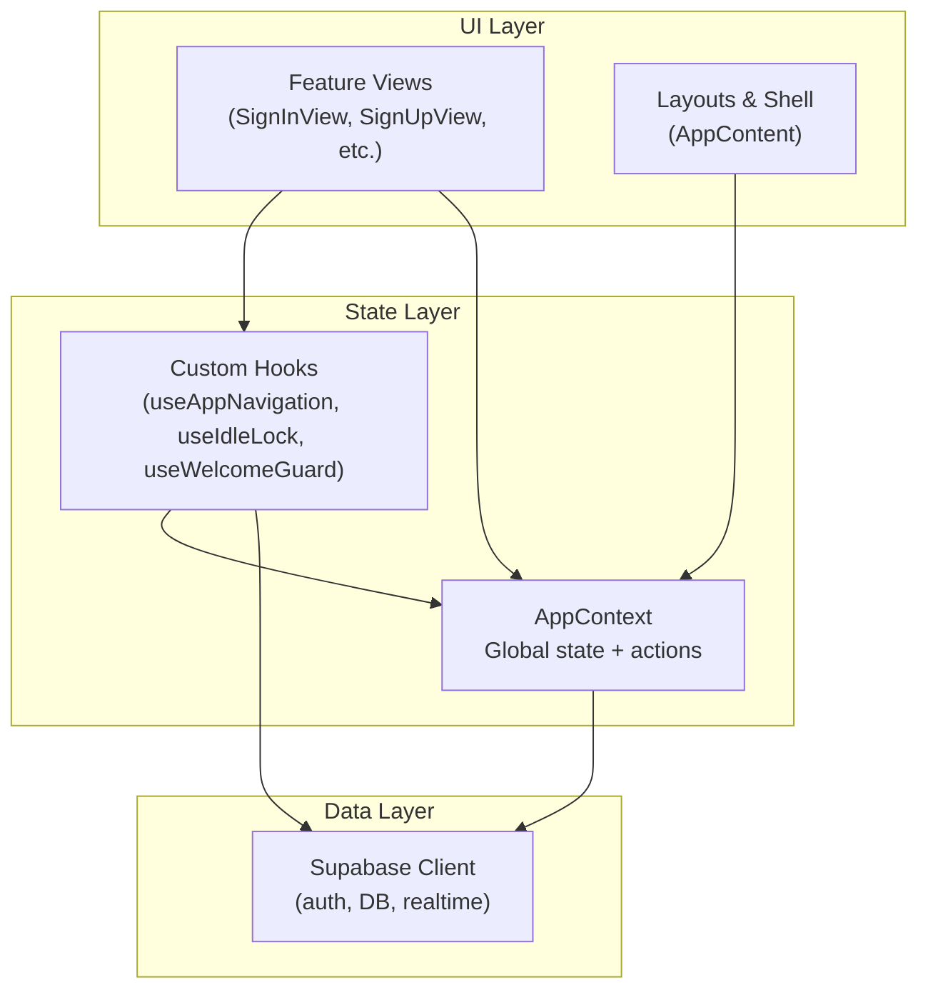
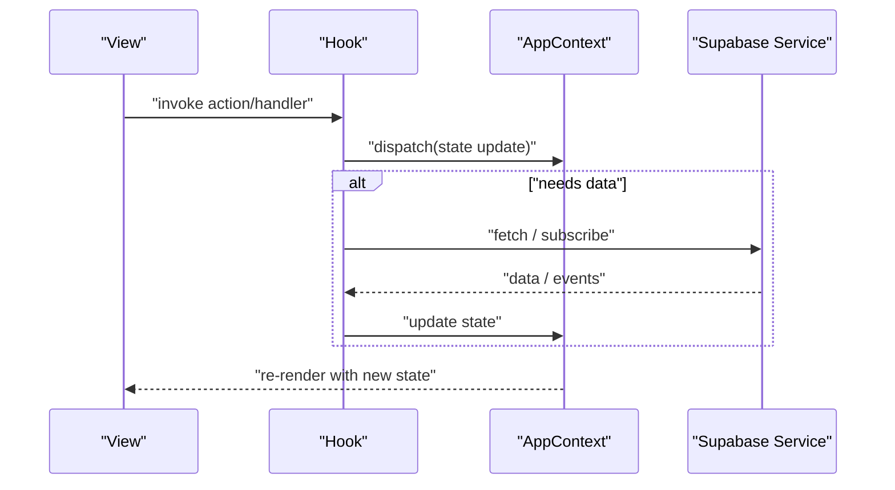
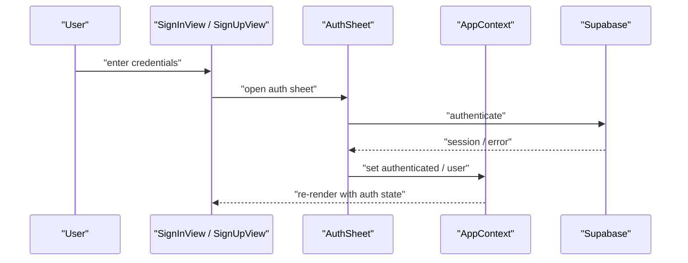
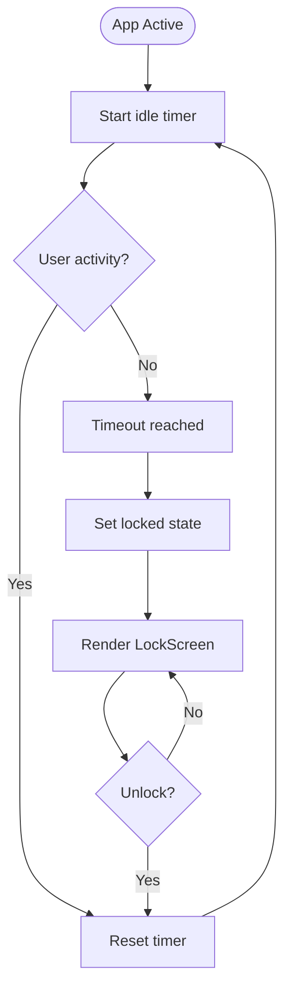
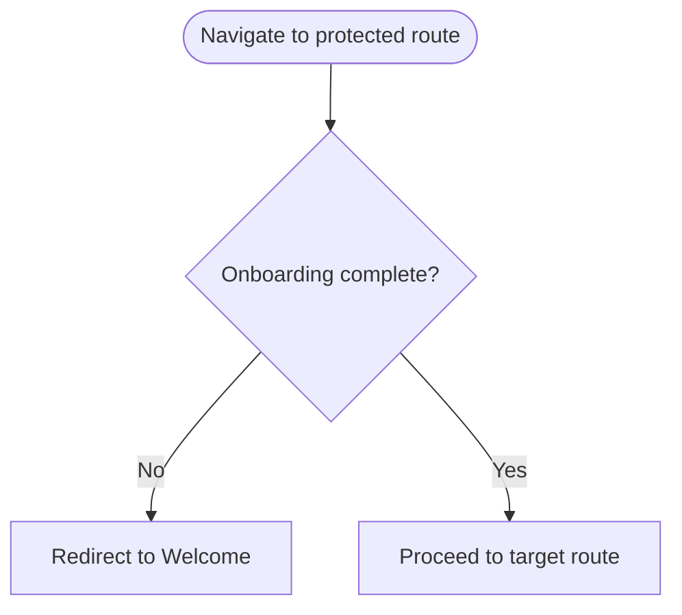
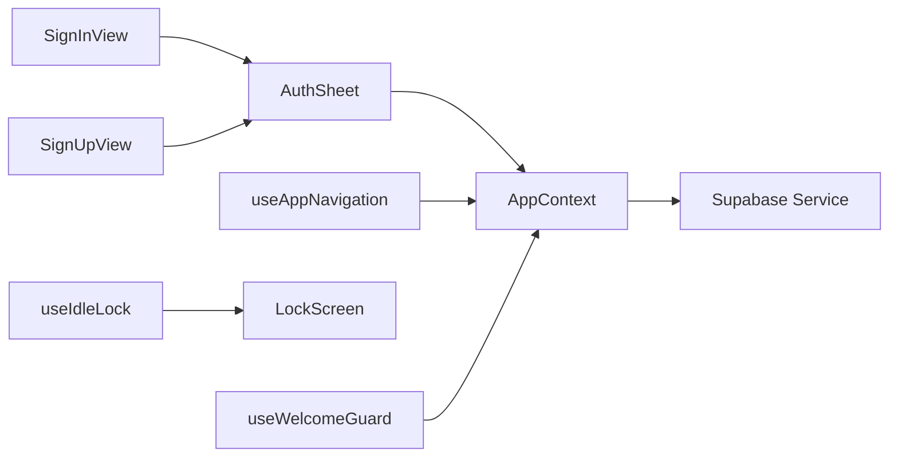

# State Management

<cite>
**Referenced Files in This Document**
- [AppContext.tsx](file://src/context/AppContext.tsx)
- [AppContent.tsx](file://src/components/AppContent.tsx)
- [useAppNavigation.ts](file://src/hooks/useAppNavigation.ts)
- [useIdleLock.ts](file://src/hooks/useIdleLock.ts)
- [useWelcomeGuard.ts](file://src/hooks/useWelcomeGuard.ts)
- [AuthSheet.tsx](file://src/components/AuthSheet.tsx)
- [SignInView.tsx](file://src/components/SignInView.tsx)
- [SignUpView.tsx](file://src/components/SignUpView.tsx)
- [supabase.ts](file://src/services/backend/supabase.ts)
- [realtime.test.ts](file://src/services/backend/realtime.test.ts)
- [lockScreen.tsx](file://src/components/LockScreen.tsx)
- [welcome-screen.md](file://docs/welcome-screen.md)
</cite>

## Table of Contents
1. [Introduction](#introduction)
2. [Project Structure](#project-structure)
3. [Core Components](#core-components)
4. [Architecture Overview](#architecture-overview)
5. [Detailed Component Analysis](#detailed-component-analysis)
6. [Dependency Analysis](#dependency-analysis)
7. [Performance Considerations](#performance-considerations)
8. [Troubleshooting Guide](#troubleshooting-guide)
9. [Conclusion](#conclusion)

## Introduction
This document explains the Mooday application’s state management architecture with a focus on:
- Global state via React Context (AppContext)
- Local component state using custom hooks
- Data fetching and real-time synchronization patterns
- Authentication state, user session handling, and guard flows
- State persistence strategies, error handling, and performance considerations for large-scale applications

The goal is to provide clear guidance for managing complex state interactions while keeping updates predictable and maintainable.

## Project Structure
Mooday organizes state-related logic across three primary layers:
- Context layer: AppContext provides global state and actions consumed by feature components.
- Hooks layer: Custom hooks encapsulate local state, side effects, and reusable behaviors such as navigation, idle locking, and welcome guards.
- Services layer: Backend integration (Supabase) handles authentication, data fetching, and real-time subscriptions.

**Diagram sources**
- [AppContext.tsx:1-200](file://src/context/AppContext.tsx#L1-L200)
- [AppContent.tsx:1-200](file://src/components/AppContent.tsx#L1-L200)
- [useAppNavigation.ts:1-200](file://src/hooks/useAppNavigation.ts#L1-L200)
- [useIdleLock.ts:1-200](file://src/hooks/useIdleLock.ts#L1-L200)
- [useWelcomeGuard.ts:1-200](file://src/hooks/useWelcomeGuard.ts#L1-L200)
- [supabase.ts:1-200](file://src/services/backend/supabase.ts#L1-L200)

**Section sources**
- [AppContext.tsx:1-200](file://src/context/AppContext.tsx#L1-L200)
- [AppContent.tsx:1-200](file://src/components/AppContent.tsx#L1-L200)
- [useAppNavigation.ts:1-200](file://src/hooks/useAppNavigation.ts#L1-L200)
- [useIdleLock.ts:1-200](file://src/hooks/useIdleLock.ts#L1-L200)
- [useWelcomeGuard.ts:1-200](file://src/hooks/useWelcomeGuard.ts#L1-L200)
- [supabase.ts:1-200](file://src/services/backend/supabase.ts#L1-L200)

## Core Components
- AppContext: Centralized provider that holds global state (e.g., current route, auth status, UI flags) and exposes actions to update it. Consumers subscribe only to relevant slices to avoid unnecessary re-renders.
- AppContent: Root component that wraps the app with providers (including AppContext), sets up initial routing, and orchestrates high-level state transitions like onboarding and lock screen behavior.
- AuthSheet and Auth Views: Handle sign-in/sign-up flows, interact with AppContext to update auth state, and coordinate with backend services.

Key responsibilities:
- Provide a single source of truth for cross-cutting concerns (navigation, auth, UI toggles).
- Encapsulate side effects in hooks to keep views declarative.
- Coordinate data fetching and real-time updates through services.

**Section sources**
- [AppContext.tsx:1-200](file://src/context/AppContext.tsx#L1-L200)
- [AppContent.tsx:1-200](file://src/components/AppContent.tsx#L1-L200)
- [AuthSheet.tsx:1-200](file://src/components/AuthSheet.tsx#L1-L200)
- [SignInView.tsx:1-200](file://src/components/SignInView.tsx#L1-L200)
- [SignUpView.tsx:1-200](file://src/components/SignUpView.tsx#L1-L200)

## Architecture Overview
The state flow follows a unidirectional pattern:
- Views call actions from AppContext or custom hooks.
- Hooks may trigger data fetching or real-time subscriptions via services.
- Services mutate server state and push updates back to clients.
- AppContext reflects changes; consumers re-render minimally.

**Diagram sources**
- [AppContext.tsx:1-200](file://src/context/AppContext.tsx#L1-L200)
- [useAppNavigation.ts:1-200](file://src/hooks/useAppNavigation.ts#L1-L200)
- [useIdleLock.ts:1-200](file://src/hooks/useIdleLock.ts#L1-L200)
- [useWelcomeGuard.ts:1-200](file://src/hooks/useWelcomeGuard.ts#L1-L200)
- [supabase.ts:1-200](file://src/services/backend/supabase.ts#L1-L200)

## Detailed Component Analysis

### AppContext: Global State Provider
Responsibilities:
- Holds global state such as current route, authentication status, and UI flags.
- Exposes actions to update state consistently.
- Coordinates with hooks and services to reflect server-side changes in the UI.

Design notes:
- Keep state slices small and co-located with related actions to improve readability and testability.
- Prefer derived values computed in hooks or memoized selectors to reduce re-renders.

Typical usage:
- Wrap the app tree with the context provider.
- Consume state and actions via a typed hook to ensure type safety and minimal re-renders.

**Section sources**
- [AppContext.tsx:1-200](file://src/context/AppContext.tsx#L1-L200)

### AppContent: Application Shell and Orchestration
Responsibilities:
- Initializes providers and sets up top-level state transitions (e.g., onboarding, lock screen).
- Ensures consistent environment setup before rendering feature views.

Behavior highlights:
- Renders the root layout and mounts feature routes based on context state.
- Integrates with guards and locks to control access and visibility.

**Section sources**
- [AppContent.tsx:1-200](file://src/components/AppContent.tsx#L1-L200)

### Authentication Flow and Session Handling
Flow overview:
- Users initiate sign-in or sign-up from views.
- The flow calls backend authentication via Supabase.
- On success, AppContext updates auth state; protected routes become accessible.
- On failure, errors are surfaced to the user and state remains stable.

**Diagram sources**
- [AuthSheet.tsx:1-200](file://src/components/AuthSheet.tsx#L1-L200)
- [SignInView.tsx:1-200](file://src/components/SignInView.tsx#L1-L200)
- [SignUpView.tsx:1-200](file://src/components/SignUpView.tsx#L1-L200)
- [AppContext.tsx:1-200](file://src/context/AppContext.tsx#L1-L200)
- [supabase.ts:1-200](file://src/services/backend/supabase.ts#L1-L200)

**Section sources**
- [AuthSheet.tsx:1-200](file://src/components/AuthSheet.tsx#L1-L200)
- [SignInView.tsx:1-200](file://src/components/SignInView.tsx#L1-L200)
- [SignUpView.tsx:1-200](file://src/components/SignUpView.tsx#L1-L200)
- [AppContext.tsx:1-200](file://src/context/AppContext.tsx#L1-L200)
- [supabase.ts:1-200](file://src/services/backend/supabase.ts#L1-L200)

### Navigation State: useAppNavigation
Purpose:
- Provides a unified way to navigate within the app while updating global navigation state in AppContext.
- Keeps route transitions deterministic and observable by other parts of the app.

Usage patterns:
- Call navigation functions from event handlers or after successful mutations.
- Combine with guards to enforce route access rules.

**Section sources**
- [useAppNavigation.ts:1-200](file://src/hooks/useAppNavigation.ts#L1-L200)
- [AppContext.tsx:1-200](file://src/context/AppContext.tsx#L1-L200)

### Idle Lock: useIdleLock
Purpose:
- Tracks user inactivity and triggers a lock screen to protect sensitive data.
- Integrates with the lock screen component to pause or restrict interactions.

Behavior:
- Starts an idle timer when the app is active.
- On timeout, sets a locked state in AppContext or directly renders the lock screen.
- Resets the timer on activity events.

**Diagram sources**
- [useIdleLock.ts:1-200](file://src/hooks/useIdleLock.ts#L1-L200)
- [lockScreen.tsx:1-200](file://src/components/LockScreen.tsx#L1-L200)

**Section sources**
- [useIdleLock.ts:1-200](file://src/hooks/useIdleLock.ts#L1-L200)
- [lockScreen.tsx:1-200](file://src/components/LockScreen.tsx#L1-L200)

### Welcome Guard: useWelcomeGuard
Purpose:
- Enforces onboarding or welcome flow completion before granting access to protected areas.
- Redirects users to the welcome screen if required.

Flow:
- Checks whether the user has completed the welcome/onboarding steps.
- If not, redirects to the welcome view; otherwise, allows normal navigation.

**Diagram sources**
- [useWelcomeGuard.ts:1-200](file://src/hooks/useWelcomeGuard.ts#L1-L200)
- [welcome-screen.md:1-200](file://docs/welcome-screen.md#L1-L200)

**Section sources**
- [useWelcomeGuard.ts:1-200](file://src/hooks/useWelcomeGuard.ts#L1-L200)
- [welcome-screen.md:1-200](file://docs/welcome-screen.md#L1-L200)

### Real-Time Data Synchronization
Approach:
- Subscribe to channels or listeners via Supabase to receive live updates.
- Update AppContext or local component state upon receiving events.
- Ensure idempotent updates to handle duplicates or out-of-order messages.

Best practices:
- Clean up subscriptions on unmount to prevent memory leaks.
- Debounce or batch frequent updates where appropriate.
- Use optimistic updates carefully; reconcile with server state on confirmation.

**Section sources**
- [supabase.ts:1-200](file://src/services/backend/supabase.ts#L1-L200)
- [realtime.test.ts:1-200](file://src/services/backend/realtime.test.ts#L1-L200)

## Dependency Analysis
High-level dependencies among state-related modules:

**Diagram sources**
- [SignInView.tsx:1-200](file://src/components/SignInView.tsx#L1-L200)
- [SignUpView.tsx:1-200](file://src/components/SignUpView.tsx#L1-L200)
- [AuthSheet.tsx:1-200](file://src/components/AuthSheet.tsx#L1-L200)
- [AppContext.tsx:1-200](file://src/context/AppContext.tsx#L1-L200)
- [useAppNavigation.ts:1-200](file://src/hooks/useAppNavigation.ts#L1-L200)
- [useIdleLock.ts:1-200](file://src/hooks/useIdleLock.ts#L1-L200)
- [useWelcomeGuard.ts:1-200](file://src/hooks/useWelcomeGuard.ts#L1-L200)
- [lockScreen.tsx:1-200](file://src/components/LockScreen.tsx#L1-L200)
- [supabase.ts:1-200](file://src/services/backend/supabase.ts#L1-L200)

**Section sources**
- [AppContext.tsx:1-200](file://src/context/AppContext.tsx#L1-L200)
- [useAppNavigation.ts:1-200](file://src/hooks/useAppNavigation.ts#L1-L200)
- [useIdleLock.ts:1-200](file://src/hooks/useIdleLock.ts#L1-L200)
- [useWelcomeGuard.ts:1-200](file://src/hooks/useWelcomeGuard.ts#L1-L200)
- [AuthSheet.tsx:1-200](file://src/components/AuthSheet.tsx#L1-L200)
- [SignInView.tsx:1-200](file://src/components/SignInView.tsx#L1-L200)
- [SignUpView.tsx:1-200](file://src/components/SignUpView.tsx#L1-L200)
- [lockScreen.tsx:1-200](file://src/components/LockScreen.tsx#L1-L200)
- [supabase.ts:1-200](file://src/services/backend/supabase.ts#L1-L200)

## Performance Considerations
- Minimize re-renders:
  - Split context into focused providers or derive values in hooks to limit consumer updates.
  - Memoize expensive computations and stable references for callbacks.
- Optimize data fetching:
  - Cache responses at the service layer; deduplicate concurrent requests.
  - Use pagination and virtualization for large lists.
- Real-time efficiency:
  - Batch updates and throttle frequent events.
  - Unsubscribe promptly on component unmount.
- Memory management:
  - Avoid long-lived timers without cleanup.
  - Clear intervals and listeners in effect cleanup functions.
- Predictable state:
  - Keep state updates synchronous and pure where possible.
  - Normalize complex objects to reduce duplication.

[No sources needed since this section provides general guidance]

## Troubleshooting Guide
Common issues and resolutions:
- Authentication loops:
  - Verify that auth state is set correctly in AppContext and that guards check the right conditions.
  - Ensure Supabase sessions are properly initialized and persisted.
- Unexpected re-renders:
  - Check for unstable callback references passed to children.
  - Break down context consumers to subscribe only to necessary slices.
- Real-time anomalies:
  - Confirm subscriptions are cleaned up on unmount.
  - Add logging around event handlers to trace message ordering and duplicates.
- Idle lock not triggering:
  - Validate activity event listeners are attached and reset the timer correctly.
  - Ensure the lock screen respects the locked state and can be dismissed securely.

**Section sources**
- [AppContext.tsx:1-200](file://src/context/AppContext.tsx#L1-L200)
- [useIdleLock.ts:1-200](file://src/hooks/useIdleLock.ts#L1-L200)
- [lockScreen.tsx:1-200](file://src/components/LockScreen.tsx#L1-L200)
- [supabase.ts:1-200](file://src/services/backend/supabase.ts#L1-L200)
- [realtime.test.ts:1-200](file://src/services/backend/realtime.test.ts#L1-L200)

## Conclusion
Mooday’s state management centers on a clean separation between global state (AppContext), localized behaviors (custom hooks), and data operations (services). This structure enables:
- Predictable state updates through explicit actions
- Reusable logic encapsulated in hooks
- Robust authentication and session handling
- Efficient real-time synchronization with proper cleanup

By following the guidelines above—minimizing re-renders, centralizing side effects, and maintaining clear state boundaries—you can scale the application’s complexity while preserving reliability and performance.

[No sources needed since this section summarizes without analyzing specific files]