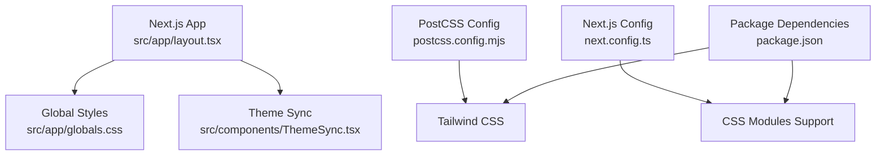
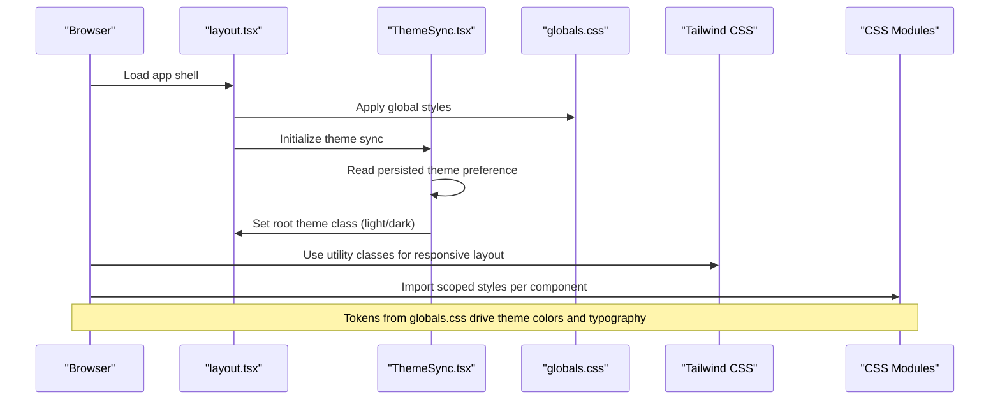
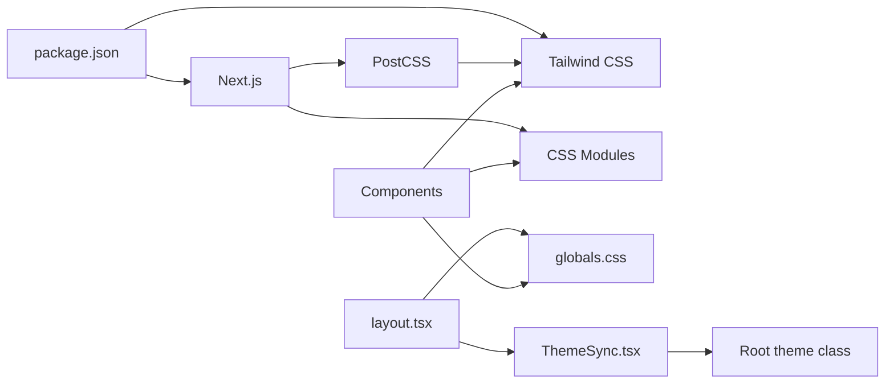

# Styling and Theming

<cite>
**Referenced Files in This Document**
- [globals.css](file://src/app/globals.css)
- [layout.tsx](file://src/app/layout.tsx)
- [ThemeSync.tsx](file://src/components/ThemeSync.tsx)
- [landing.module.css](file://src/components/landing/landing.module.css)
- [postcss.config.mjs](file://postcss.config.mjs)
- [next.config.ts](file://next.config.ts)
- [package.json](file://package.json)
</cite>

## Table of Contents
1. [Introduction](#introduction)
2. [Project Structure](#project-structure)
3. [Core Components](#core-components)
4. [Architecture Overview](#architecture-overview)
5. [Detailed Component Analysis](#detailed-component-analysis)
6. [Dependency Analysis](#dependency-analysis)
7. [Performance Considerations](#performance-considerations)
8. [Troubleshooting Guide](#troubleshooting-guide)
9. [Conclusion](#conclusion)
10. [Appendices](#appendices)

## Introduction
This document explains the styling architecture and theming system used in the Mooday marketplace. It covers how CSS modules integrate with Tailwind CSS, responsive design patterns, mobile-first approach, color scheme, typography, and design tokens. It also documents component styling patterns, utility classes, custom CSS modules, theme switching, dark mode support, brand customization, performance considerations for stylesheets, CSS-in-JS patterns, asset optimization, and guidelines for consistent visual design, responsive layouts, and accessible styling practices.

## Project Structure
The styling setup is centered around a global stylesheet, Next.js layout configuration, a theme synchronization component, and build-time tooling that enables Tailwind CSS and CSS modules.

**Diagram sources**
- [layout.tsx:1-200](file://src/app/layout.tsx#L1-L200)
- [globals.css:1-200](file://src/app/globals.css#L1-L200)
- [ThemeSync.tsx:1-200](file://src/components/ThemeSync.tsx#L1-L200)
- [postcss.config.mjs:1-200](file://postcss.config.mjs#L1-L200)
- [next.config.ts:1-200](file://next.config.ts#L1-L200)
- [package.json:1-200](file://package.json#L1-L200)

**Section sources**
- [layout.tsx:1-200](file://src/app/layout.tsx#L1-L200)
- [globals.css:1-200](file://src/app/globals.css#L1-L200)
- [ThemeSync.tsx:1-200](file://src/components/ThemeSync.tsx#L1-L200)
- [postcss.config.mjs:1-200](file://postcss.config.mjs#L1-L200)
- [next.config.ts:1-200](file://next.config.ts#L1-L200)
- [package.json:1-200](file://package.json#L1-L200)

## Core Components
- Global stylesheet (globals.css): Provides base resets, CSS variables for theming, typography defaults, and global utilities.
- Layout (layout.tsx): Injects global styles into the app shell and sets up HTML-level attributes such as language and theme class toggles.
- Theme synchronization (ThemeSync.tsx): Manages theme state persistence and applies theme classes to the root element; supports dark mode and user preferences.
- Build-time tooling: PostCSS config enables Tailwind CSS processing; Next.js config ensures CSS modules are enabled; package dependencies declare required libraries.

Key responsibilities:
- Centralized design tokens via CSS custom properties.
- Consistent application of theme classes at the document root.
- Mobile-first responsive utilities through Tailwind.
- Scoped component styles using CSS modules where appropriate.

**Section sources**
- [globals.css:1-200](file://src/app/globals.css#L1-L200)
- [layout.tsx:1-200](file://src/app/layout.tsx#L1-L200)
- [ThemeSync.tsx:1-200](file://src/components/ThemeSync.tsx#L1-L200)
- [postcss.config.mjs:1-200](file://postcss.config.mjs#L1-L200)
- [next.config.ts:1-200](file://next.config.ts#L1-L200)
- [package.json:1-200](file://package.json#L1-L200)

## Architecture Overview
The styling architecture combines a global design token layer with utility-first styling and scoped module styles.

**Diagram sources**
- [layout.tsx:1-200](file://src/app/layout.tsx#L1-L200)
- [ThemeSync.tsx:1-200](file://src/components/ThemeSync.tsx#L1-L200)
- [globals.css:1-200](file://src/app/globals.css#L1-L200)

## Detailed Component Analysis

### Global Styles and Design Tokens (globals.css)
- Purpose: Define base styles, CSS custom properties for colors, typography scale, spacing, and breakpoints; establish default font stacks and baseline accessibility settings.
- Token strategy: Group tokens by semantic roles (e.g., text-primary, bg-surface, border-subtle) to enable consistent theming and easy overrides.
- Responsive foundation: Provide base utilities and container constraints that work well on small screens first, then enhance for larger viewports.

Guidelines:
- Prefer semantic token names over raw values.
- Keep token definitions centralized to avoid duplication.
- Ensure sufficient contrast ratios for text and interactive elements.

**Section sources**
- [globals.css:1-200](file://src/app/globals.css#L1-L200)

### Application Shell and Theme Injection (layout.tsx)
- Purpose: Mount global styles, set HTML attributes (lang, dir), and ensure theme classes are applied to the root element so components can derive appearance from tokens.
- Theme integration: Works with ThemeSync to apply light/dark classes based on user preference or system setting.

Best practices:
- Avoid inline styles for theme-dependent visuals; rely on CSS variables and classes.
- Keep layout minimal to reduce style recalculation overhead.

**Section sources**
- [layout.tsx:1-200](file://src/app/layout.tsx#L1-L200)

### Theme Synchronization (ThemeSync.tsx)
- Purpose: Persist theme choice across sessions, respect system preferences, and toggle theme classes on the root element.
- Behavior: On mount, read stored preference; if none, detect system preference; apply corresponding class; update storage when user switches theme.

Accessibility:
- Ensure theme changes do not trigger unnecessary reflows.
- Respect prefers-color-scheme and provide explicit controls for users.

**Section sources**
- [ThemeSync.tsx:1-200](file://src/components/ThemeSync.tsx#L1-L200)

### Tailwind CSS Integration (postcss.config.mjs)
- Purpose: Configure PostCSS pipeline to process Tailwind CSS utilities, purge unused styles in production, and extend theme if needed.
- Configuration highlights: Enable content scanning for dynamic class usage, configure plugins, and ensure compatibility with Next.js.

Optimization:
- Ensure content paths include all files that use utility classes to prevent missing styles in builds.
- Leverage PurgeCSS-like behavior to minimize CSS size.

**Section sources**
- [postcss.config.mjs:1-200](file://postcss.config.mjs#L1-L200)

### Next.js Configuration for CSS Modules (next.config.ts)
- Purpose: Enable CSS modules and ensure proper handling of .module.css files within components.
- Impact: Allows scoped styles per component while still leveraging global tokens and Tailwind utilities.

**Section sources**
- [next.config.ts:1-200](file://next.config.ts#L1-L200)

### Package Dependencies (package.json)
- Purpose: Declare runtime and build-time dependencies for styling stack (e.g., Tailwind CSS, PostCSS, Next.js).
- Role: Ensures consistent versions across environments and enables reproducible builds.

**Section sources**
- [package.json:1-200](file://package.json#L1-L200)

### Example: Component-Level Styling with CSS Modules (landing.module.css)
- Purpose: Demonstrate scoped styling for a landing section using CSS modules alongside global tokens and Tailwind utilities.
- Pattern: Combine Tailwind for layout and spacing with CSS modules for complex or component-specific rules.

Usage guidance:
- Keep component styles minimal and composable.
- Reuse tokens from globals.css instead of hardcoding values.

**Section sources**
- [landing.module.css:1-200](file://src/components/landing/landing.module.css#L1-L200)

## Dependency Analysis
Styling dependencies flow from build-time configuration to runtime application.

**Diagram sources**
- [package.json:1-200](file://package.json#L1-L200)
- [postcss.config.mjs:1-200](file://postcss.config.mjs#L1-L200)
- [next.config.ts:1-200](file://next.config.ts#L1-L200)
- [layout.tsx:1-200](file://src/app/layout.tsx#L1-L200)
- [ThemeSync.tsx:1-200](file://src/components/ThemeSync.tsx#L1-L200)
- [globals.css:1-200](file://src/app/globals.css#L1-L200)

**Section sources**
- [package.json:1-200](file://package.json#L1-L200)
- [postcss.config.mjs:1-200](file://postcss.config.mjs#L1-L200)
- [next.config.ts:1-200](file://next.config.ts#L1-L200)
- [layout.tsx:1-200](file://src/app/layout.tsx#L1-L200)
- [ThemeSync.tsx:1-200](file://src/components/ThemeSync.tsx#L1-L200)
- [globals.css:1-200](file://src/app/globals.css#L1-L200)

## Performance Considerations
- Minimize CSS bundle size:
  - Rely on Tailwind’s utility-first approach and ensure content scanning includes all relevant files to remove unused styles.
  - Keep CSS modules scoped and avoid large global rule sets.
- Reduce runtime style recalculations:
  - Prefer CSS variables for theme changes to avoid heavy DOM updates.
  - Defer non-critical styles where possible.
- Optimize assets:
  - Use optimized images and icons; leverage Next.js image optimizations.
  - Preload critical fonts and consider font-display strategies for faster perceived load.
- CSS-in-JS patterns:
  - If used, limit dynamic styles to necessary cases; prefer static tokens and utility classes for better caching and tree-shaking.
- Build-time optimizations:
  - Ensure PostCSS and Next.js configurations are tuned for production builds to strip unused CSS and optimize output.

[No sources needed since this section provides general guidance]

## Troubleshooting Guide
Common issues and resolutions:
- Missing Tailwind styles:
  - Verify content paths in PostCSS config include all files using utility classes.
  - Confirm Tailwind is listed in dependencies and configured correctly.
- CSS modules not applying:
  - Ensure Next.js config enables CSS modules and file naming follows .module.css convention.
- Theme not switching:
  - Check ThemeSync logic for reading/writing persisted preferences and applying root theme class.
  - Validate that globals.css defines tokens referenced by both light and dark themes.
- Inconsistent typography or spacing:
  - Review globals.css token definitions and ensure components use tokens rather than hardcoded values.
- Accessibility problems:
  - Verify color contrast meets WCAG guidelines; test with accessibility tools.
  - Ensure focus states and keyboard navigation are visible in both themes.

**Section sources**
- [postcss.config.mjs:1-200](file://postcss.config.mjs#L1-L200)
- [next.config.ts:1-200](file://next.config.ts#L1-L200)
- [ThemeSync.tsx:1-200](file://src/components/ThemeSync.tsx#L1-L200)
- [globals.css:1-200](file://src/app/globals.css#L1-L200)

## Conclusion
Mooday’s styling architecture centers on a robust token system in globals.css, seamless Tailwind integration via PostCSS, and scoped component styles using CSS modules. The ThemeSync component manages theme persistence and root class application, enabling consistent dark mode and brand customization. By following mobile-first responsive patterns, leveraging utility classes, and adhering to accessibility best practices, the application maintains a scalable, performant, and visually coherent design system.

[No sources needed since this section summarizes without analyzing specific files]

## Appendices

### Color Scheme and Typography Guidelines
- Colors:
  - Define semantic tokens for surfaces, text, borders, and accents in globals.css.
  - Maintain sufficient contrast for readability; test under both light and dark themes.
- Typography:
  - Establish a type scale and line-height conventions in globals.css.
  - Use tokens for font sizes, weights, and colors to ensure consistency.

[No sources needed since this section provides general guidance]

### Responsive Design Patterns
- Mobile-first:
  - Start with base styles for small screens; add breakpoints for larger devices.
  - Use Tailwind utilities for spacing, grid, and layout adjustments.
- Breakpoints:
  - Align with common device widths; keep breakpoint logic simple and maintainable.

[No sources needed since this section provides general guidance]

### Theme Switching and Dark Mode Support
- Implementation:
  - Persist user preference and respect system settings via ThemeSync.
  - Apply root theme class to activate corresponding token sets.
- Brand customization:
  - Override tokens in globals.css to adapt brand colors and typography while preserving structure.

**Section sources**
- [ThemeSync.tsx:1-200](file://src/components/ThemeSync.tsx#L1-L200)
- [globals.css:1-200](file://src/app/globals.css#L1-L200)

### Asset Optimization
- Images and icons:
  - Use optimized formats and sizes; leverage Next.js image features.
- Fonts:
  - Preload critical fonts; use display swap for improved loading experience.

[No sources needed since this section provides general guidance]

### Accessibility Practices
- Contrast and focus:
  - Ensure adequate contrast ratios and visible focus indicators.
- Semantic markup:
  - Use meaningful HTML elements and ARIA attributes where necessary.
- Testing:
  - Validate with automated and manual accessibility checks across themes.

[No sources needed since this section provides general guidance]