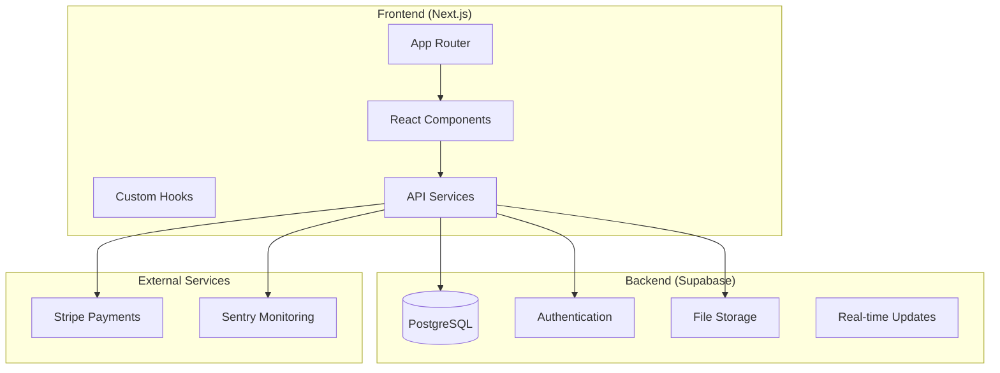
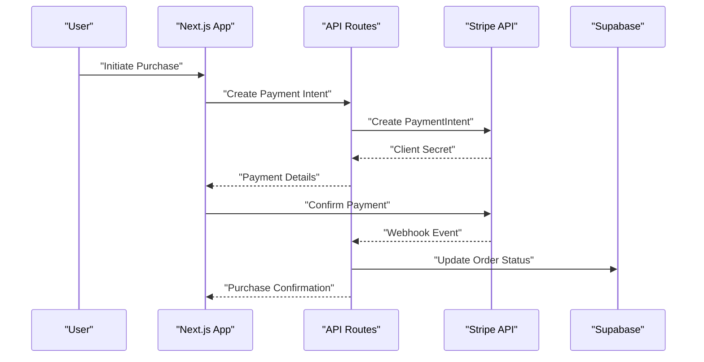
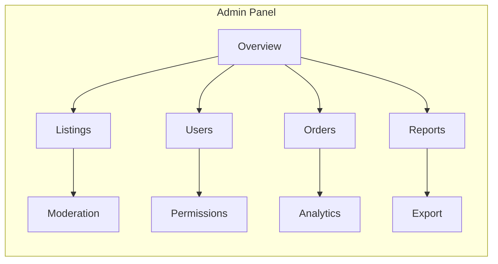
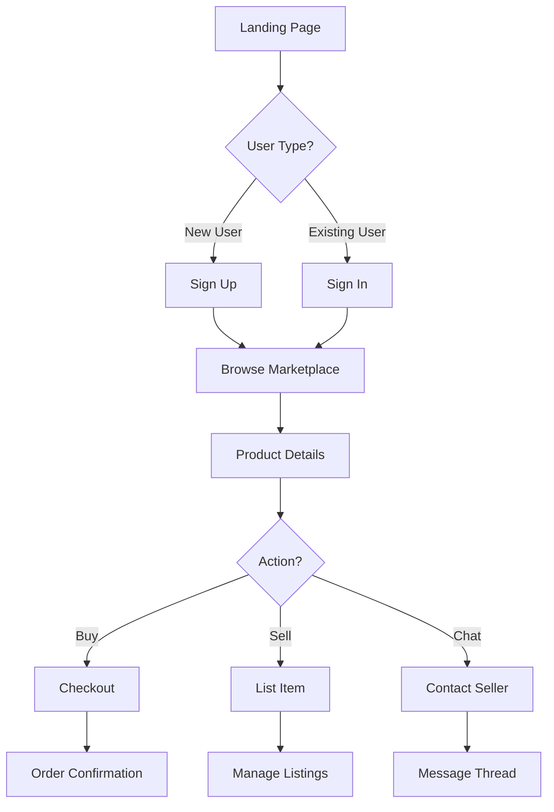
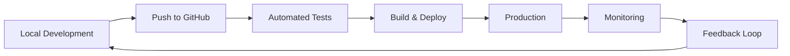

# Getting Started

<cite>
**Referenced Files in This Document**
- [README.md](file://README.md)
- [package.json](file://package.json)
- [next.config.ts](file://next.config.ts)
- [supabase/config.toml](file://supabase/config.toml)
- [src/app/layout.tsx](file://src/app/layout.tsx)
- [src/app/page.tsx](file://src/app/page.tsx)
- [src/services/backend/supabase.ts](file://src/services/backend/supabase.ts)
- [src/services/backend/config.ts](file://src/services/backend/config.ts)
- [scripts/apply-migrations.mjs](file://scripts/apply-migrations.mjs)
- [scripts/seed-demo-catalog.mjs](file://scripts/seed-demo-catalog.mjs)
</cite>

## Table of Contents
1. [Introduction](#introduction)
2. [Project Structure](#project-structure)
3. [Prerequisites](#prerequisites)
4. [Installation](#installation)
5. [Environment Setup](#environment-setup)
6. [Database Configuration](#database-configuration)
7. [Stripe Integration](#stripe-integration)
8. [Development Workflow](#development-workflow)
9. [Running the Application](#running-the-application)
10. [Admin Panel Access](#admin-panel-access)
11. [Basic Navigation](#basic-navigation)
12. [Troubleshooting Guide](#troubleshooting-guide)
13. [Next Steps](#next-steps)

## Introduction

Mooday is a premium fashion resale marketplace built with Next.js and Supabase, designed to connect luxury fashion enthusiasts through secure, authenticated transactions. The platform enables users to buy and sell high-end fashion items while maintaining authenticity and quality standards.

This getting started guide will help you set up the development environment, configure essential services, and begin contributing to the Mooday marketplace platform.

## Project Structure

The Mooday application follows a modern Next.js App Router architecture with Supabase as the backend service:



**Diagram sources**
- [src/app/layout.tsx:1-50](file://src/app/layout.tsx#L1-L50)
- [src/services/backend/supabase.ts:1-100](file://src/services/backend/supabase.ts#L1-L100)

**Section sources**
- [src/app/layout.tsx:1-50](file://src/app/layout.tsx#L1-L50)
- [src/app/page.tsx:1-30](file://src/app/page.tsx#L1-L30)

## Prerequisites

Before setting up the Mooday marketplace, ensure you have the following tools installed:

- **Node.js**: Version 18.x or later
- **npm**: Version 9.x or later
- **Git**: For version control
- **Supabase Account**: Free tier available at supabase.com
- **Stripe Account**: For payment processing at stripe.com

## Installation

### Clone the Repository

```bash
git clone https://github.com/mooday/marketplace.git
cd mooday
```

### Install Dependencies

```bash
npm install
```

### Verify Installation

```bash
npm run test
```

**Section sources**
- [package.json:1-50](file://package.json#L1-L50)

## Environment Setup

### Create Environment Variables

Create a `.env.local` file in the root directory with the following variables:

```env
# Supabase Configuration
NEXT_PUBLIC_SUPABASE_URL=your_supabase_project_url
NEXT_PUBLIC_SUPABASE_ANON_KEY=your_supabase_anon_key
SUPABASE_SERVICE_ROLE_KEY=your_supabase_service_role_key

# Stripe Configuration
NEXT_PUBLIC_STRIPE_PUBLISHABLE_KEY=your_stripe_publishable_key
STRIPE_SECRET_KEY=your_stripe_secret_key
STRIPE_WEBHOOK_SECRET=your_stripe_webhook_secret

# Application Configuration
NEXT_PUBLIC_APP_URL=http://localhost:3000
NODE_ENV=development
```

### Configure Supabase

1. **Create a Supabase Project**:
   - Visit [supabase.com](https://supabase.com)
   - Create a new project
   - Note your project URL and API keys

2. **Set Up Authentication**:
   - Enable email/password authentication
   - Configure email templates
   - Set up redirect URLs

3. **Configure Storage**:
   - Create storage buckets for product images
   - Set up storage policies

**Section sources**
- [src/services/backend/config.ts:1-100](file://src/services/backend/config.ts#L1-L100)
- [supabase/config.toml:1-50](file://supabase/config.toml#L1-L50)

## Database Configuration

### Apply Database Migrations

```bash
# Apply all migrations
npx supabase db push

# Or use the provided script
node scripts/apply-migrations.mjs
```

### Seed Demo Data

```bash
# Seed demo catalog and users
node scripts/seed-demo-catalog.mjs
```

### Database Schema Overview

The Mooday marketplace uses the following key database tables:

| Table | Purpose | Key Fields |
|-------|---------|------------|
| `users` | User profiles and authentication | id, email, avatar_url, created_at |
| `listings` | Product listings for sale | id, title, price, seller_id, status |
| `orders` | Purchase transactions | id, buyer_id, seller_id, total_amount, status |
| `reviews` | Product and seller reviews | id, rating, comment, user_id |
| `chats` | Buyer-seller communication | id, message, sender_id, receiver_id |

**Section sources**
- [scripts/apply-migrations.mjs:1-100](file://scripts/apply-migrations.mjs#L1-L100)
- [scripts/seed-demo-catalog.mjs:1-50](file://scripts/seed-demo-catalog.mjs#L1-L50)

## Stripe Integration

### Configure Stripe Webhooks

1. **Install Stripe CLI**:
   ```bash
   brew install stripe/stripe-cli/stripe
   stripe login
   stripe listen --forward-to localhost:3000/api/stripe/webhook
   ```

2. **Set Up Payment Intent**:
   - Configure payment methods in Stripe dashboard
   - Set up webhook endpoints
   - Test payment flows

3. **Test Transactions**:
   - Use Stripe test cards (4242 4242 4242 4242)
   - Verify webhook events
   - Test refund processes

### Payment Flow Architecture



**Diagram sources**
- [src/app/api/stripe/webhook/route.ts:1-100](file://src/app/api/stripe/webhook/route.ts#L1-L100)
- [src/services/backend/create-payment-intent.test.ts:1-50](file://src/services/backend/create-payment-intent.test.ts#L1-L50)

**Section sources**
- [src/app/api/stripe/webhook/route.ts:1-100](file://src/app/api/stripe/webhook/route.ts#L1-L100)

## Development Workflow

### Start Development Server

```bash
# Start development server with hot reload
npm run dev

# Open browser to http://localhost:3000
```

### Development Tools

- **Hot Reload**: Automatic code reloading during development
- **TypeScript**: Type safety and IntelliSense support
- **ESLint**: Code quality and consistency
- **Vitest**: Unit testing framework
- **Playwright**: End-to-end testing

### Code Organization

```
src/
├── app/                    # Next.js App Router pages
│   ├── admin/             # Admin panel routes
│   ├── api/               # API route handlers
│   └── auth/              # Authentication flows
├── components/            # Reusable React components
├── services/             # Backend integration services
├── hooks/                # Custom React hooks
├── lib/                  # Utility functions
└── types/                # TypeScript type definitions
```

**Section sources**
- [src/app/layout.tsx:1-50](file://src/app/layout.tsx#L1-L50)
- [package.json:50-100](file://package.json#L50-L100)

## Running the Application

### Development Mode

```bash
npm run dev
```

### Production Build

```bash
npm run build
npm start
```

### Docker Deployment

```bash
docker build -t mooday-marketplace .
docker run -p 3000:3000 mooday-marketplace
```

### Health Check

```bash
curl http://localhost:3000/api/health
```

**Section sources**
- [package.json:100-150](file://package.json#L100-L150)

## Admin Panel Access

### Navigate to Admin Panel

1. **Access URL**: `http://localhost:3000/admin`
2. **Login Credentials**: Use the seed admin account created during setup
3. **Available Features**:
   - User management
   - Listing moderation
   - Order oversight
   - Analytics dashboard
   - System configuration

### Admin Dashboard Features



**Diagram sources**
- [src/app/admin/page.tsx:1-100](file://src/app/admin/page.tsx#L1-L100)
- [src/components/admin/AdminSidebar.tsx:1-50](file://src/components/admin/AdminSidebar.tsx#L1-L50)

**Section sources**
- [src/app/admin/page.tsx:1-100](file://src/app/admin/page.tsx#L1-L100)

## Basic Navigation

### User Journey



**Diagram sources**
- [src/app/page.tsx:1-50](file://src/app/page.tsx#L1-L50)
- [src/components/DiscoverFeedView.tsx:1-100](file://src/components/DiscoverFeedView.tsx#L1-L100)

### Key Pages

- **Home**: `http://localhost:3000` - Landing page and featured items
- **Marketplace**: `http://localhost:3000/discover` - Browse all listings
- **Product Details**: `http://localhost:3000/product/[id]` - Individual item view
- **Cart**: `http://localhost:3000/cart` - Shopping cart
- **Profile**: `http://localhost:3000/profile` - User profile management
- **Sell**: `http://localhost:3000/sell` - Create new listing

**Section sources**
- [src/app/page.tsx:1-50](file://src/app/page.tsx#L1-L50)
- [src/hooks/useAppNavigation.ts:1-100](file://src/hooks/useAppNavigation.ts#L1-L100)

## Troubleshooting Guide

### Common Setup Issues

#### Supabase Connection Errors

**Problem**: Cannot connect to Supabase database
**Solution**: 
- Verify environment variables are correctly set
- Check Supabase project status
- Ensure network connectivity

#### Stripe Webhook Failures

**Problem**: Payment webhooks not being processed
**Solution**:
- Verify Stripe CLI is running
- Check webhook endpoint URL
- Review Stripe dashboard logs

#### Authentication Issues

**Problem**: Users cannot sign in or sign up
**Solution**:
- Check email provider configuration
- Verify redirect URLs in Supabase
- Test email templates

#### Database Migration Errors

**Problem**: Migrations fail to apply
**Solution**:
- Check PostgreSQL connection
- Verify migration file syntax
- Review error logs

### Debugging Tools

```bash
# Enable debug logging
DEBUG=* npm run dev

# Check Supabase status
npx supabase status

# Test Stripe webhook locally
stripe listen --test
```

### Performance Optimization

- **Image Optimization**: Use Next.js Image component for automatic optimization
- **Database Queries**: Implement proper indexing and query optimization
- **Caching**: Utilize Supabase caching and CDN for static assets
- **Bundle Analysis**: Use `npm run analyze` to optimize bundle size

**Section sources**
- [src/services/backend/supabase.ts:1-100](file://src/services/backend/supabase.ts#L1-L100)
- [src/lib/constants.ts:1-50](file://src/lib/constants.ts#L1-L50)

## Next Steps

### Development Best Practices

1. **Code Quality**: Follow ESLint rules and TypeScript guidelines
2. **Testing**: Write unit tests for critical functionality
3. **Documentation**: Update README and inline comments
4. **Security**: Regularly audit dependencies and implement security best practices

### Contributing Guidelines

1. **Branch Strategy**: Use feature branches for development
2. **Pull Requests**: Create descriptive PRs with clear explanations
3. **Code Reviews**: Participate in peer code reviews
4. **Testing**: Ensure all tests pass before submitting PRs

### Deployment Pipeline



### Additional Resources

- **Supabase Documentation**: [supabase.com/docs](https://supabase.com/docs)
- **Stripe Documentation**: [stripe.com/docs](https://stripe.com/docs)
- **Next.js Documentation**: [nextjs.org/docs](https://nextjs.org/docs)
- **Community Support**: Join Discord community for help and discussions

---

**Getting Started Checklist:**

- [ ] Install Node.js and required dependencies
- [ ] Set up Supabase project and configure environment
- [ ] Configure Stripe account and webhooks
- [ ] Apply database migrations
- [ ] Run development server successfully
- [ ] Test user registration and authentication
- [ ] Verify payment processing works
- [ ] Access admin panel and verify functionality

For additional help, check the [documentation folder](./docs/) or contact the development team through the project's issue tracker.