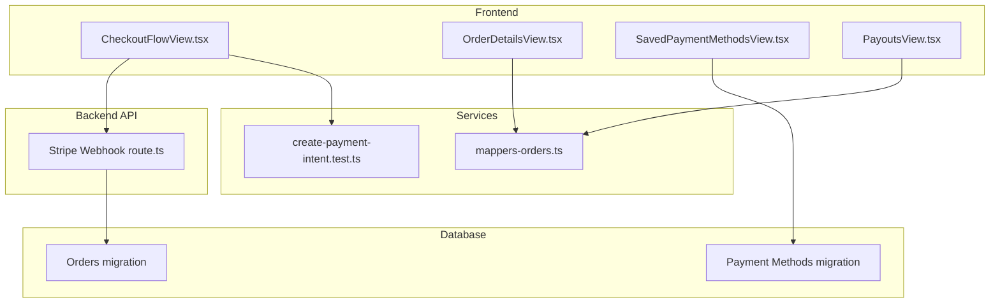
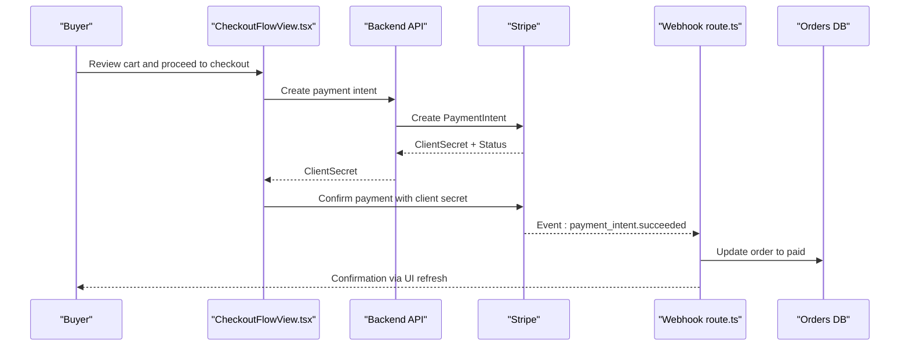
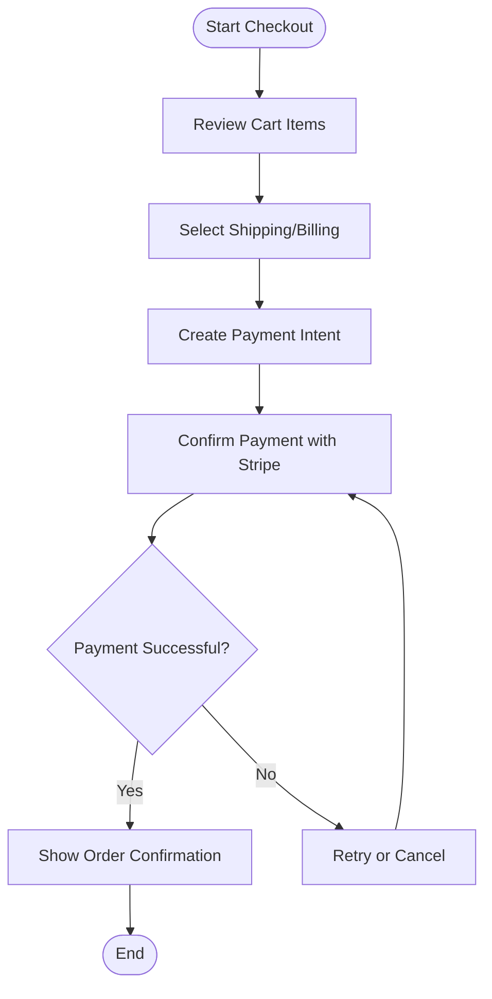
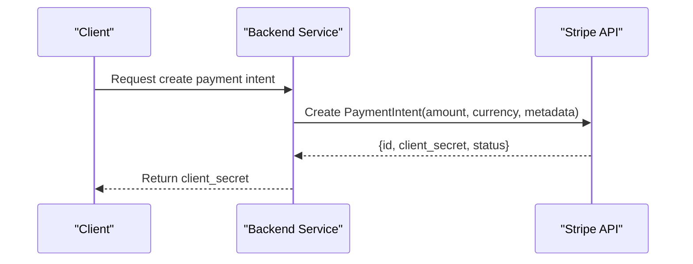
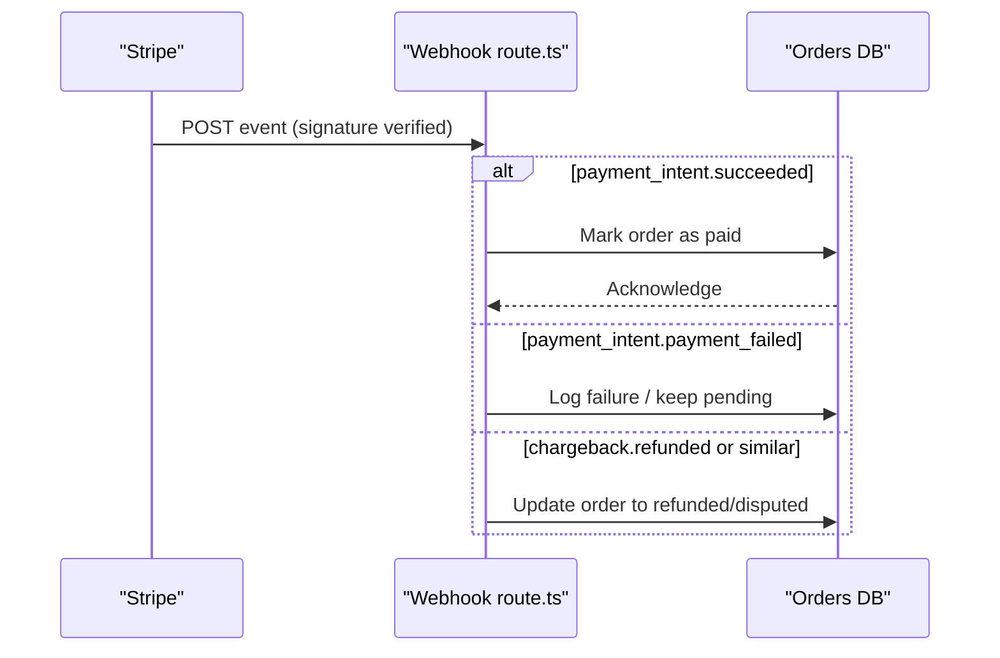
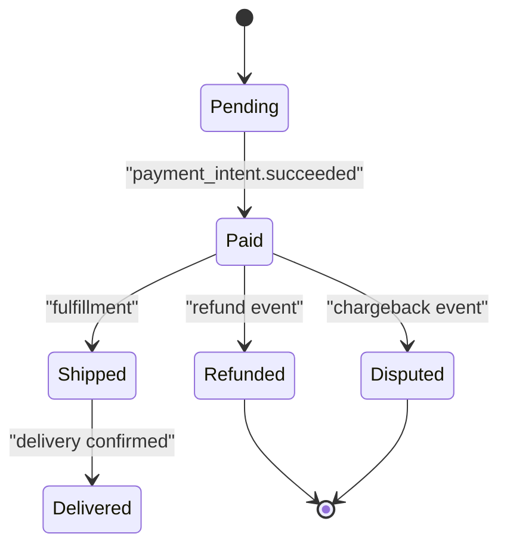
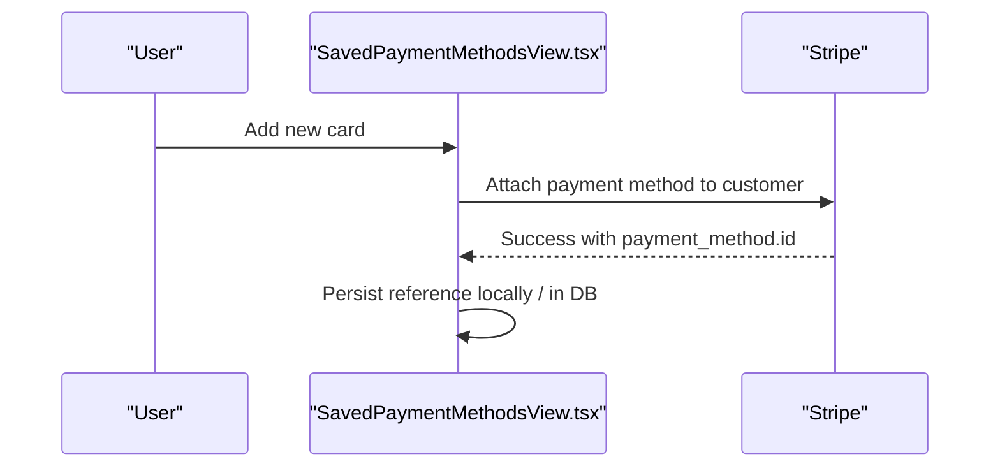
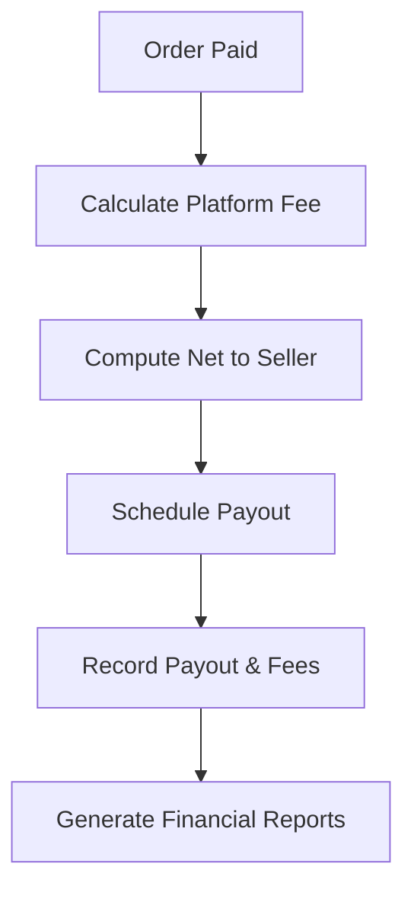
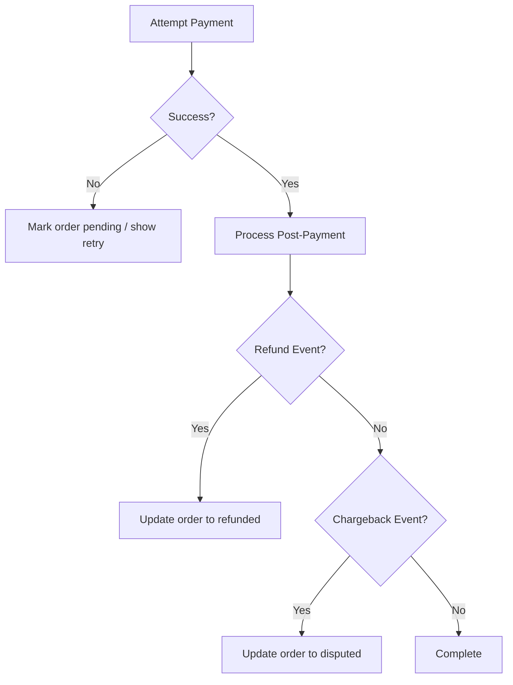
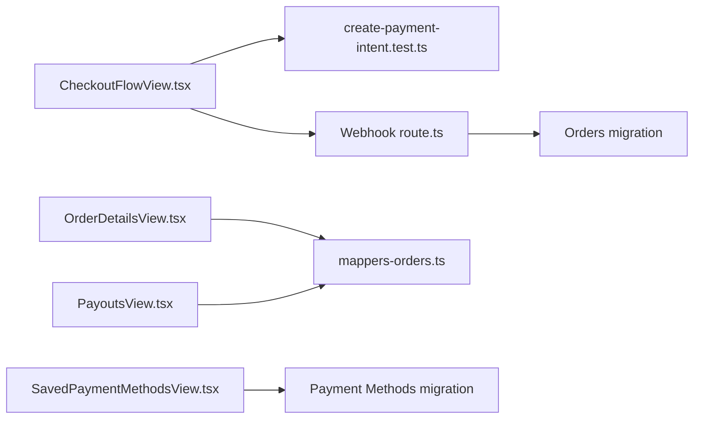

# Checkout and Payment Processing

<cite>
**Referenced Files in This Document**
- [checkout-flow.md](file://docs/checkout-flow.md)
- [progress-u5-stripe.md](file://docs/progress-u5-stripe.md)
- [CheckoutFlowView.tsx](file://src/components/CheckoutFlowView.tsx)
- [OrderDetailsView.tsx](file://src/components/OrderDetailsView.tsx)
- [PayoutsView.tsx](file://src/components/PayoutsView.tsx)
- [SavedPaymentMethodsView.tsx](file://src/components/SavedPaymentMethodsView.tsx)
- [route.ts](file://src/app/api/stripe/webhook/route.ts)
- [create-payment-intent.test.ts](file://src/services/backend/create-payment-intent.test.ts)
- [mappers-orders.ts](file://src/services/backend/mappers-orders.ts)
- [orders-migration.test.ts](file://src/services/backend/orders-migration.test.ts)
- [202608060001_payment_methods.sql](file://supabase/migrations/202608060001_payment_methods.sql)
- [202607150006_phase_3_orders.sql](file://supabase/migrations/202607150006_phase_3_orders.sql)
</cite>

## Table of Contents
1. [Introduction](#introduction)
2. [Project Structure](#project-structure)
3. [Core Components](#core-components)
4. [Architecture Overview](#architecture-overview)
5. [Detailed Component Analysis](#detailed-component-analysis)
6. [Dependency Analysis](#dependency-analysis)
7. [Performance Considerations](#performance-considerations)
8. [Troubleshooting Guide](#troubleshooting-guide)
9. [Conclusion](#conclusion)
10. [Appendices](#appendices)

## Introduction
This document explains the checkout and payment processing system for the Mooday marketplace, covering the end-to-end flow from cart review to order confirmation, Stripe integration (payment intent creation, webhook handling, and payment method management), order lifecycle management, payment verification, transaction tracking, seller payouts, fee calculations, financial reporting, error handling for failed payments/refunds/chargebacks, security considerations, PCI compliance, and fraud prevention. It is designed for both technical and non-technical readers.

## Project Structure
The checkout and payment features span UI components, API routes, backend services, and database migrations:
- UI flows: Checkout flow view, order details, saved payment methods, payouts view
- Backend: Stripe webhook handler, payment intent tests, order mappers, orders migration
- Database: Orders schema and payment methods schema via Supabase migrations

**Diagram sources**
- [CheckoutFlowView.tsx](file://src/components/CheckoutFlowView.tsx)
- [OrderDetailsView.tsx](file://src/components/OrderDetailsView.tsx)
- [SavedPaymentMethodsView.tsx](file://src/components/SavedPaymentMethodsView.tsx)
- [PayoutsView.tsx](file://src/components/PayoutsView.tsx)
- [route.ts](file://src/app/api/stripe/webhook/route.ts)
- [create-payment-intent.test.ts](file://src/services/backend/create-payment-intent.test.ts)
- [mappers-orders.ts](file://src/services/backend/mappers-orders.ts)
- [202607150006_phase_3_orders.sql](file://supabase/migrations/202607150006_phase_3_orders.sql)
- [202608060001_payment_methods.sql](file://supabase/migrations/202608060001_payment_methods.sql)

**Section sources**
- [checkout-flow.md](file://docs/checkout-flow.md)
- [progress-u5-stripe.md](file://docs/progress-u5-stripe.md)

## Core Components
- Checkout Flow View: Orchestrates cart review, shipping/billing selection, and initiating payment via a payment intent.
- Order Details View: Displays order status, timeline, and actions post-payment.
- Saved Payment Methods View: Manages stored payment instruments for faster checkout.
- Payouts View: Shows seller payout history and status.
- Stripe Webhook Handler: Processes Stripe events to update order state and handle refunds/chargebacks.
- Services: Payment intent creation logic (validated by tests), order mappers for consistent data transformation, and order schema migration.

**Section sources**
- [CheckoutFlowView.tsx](file://src/components/CheckoutFlowView.tsx)
- [OrderDetailsView.tsx](file://src/components/OrderDetailsView.tsx)
- [SavedPaymentMethodsView.tsx](file://src/components/SavedPaymentMethodsView.tsx)
- [PayoutsView.tsx](file://src/components/PayoutsView.tsx)
- [route.ts](file://src/app/api/stripe/webhook/route.ts)
- [create-payment-intent.test.ts](file://src/services/backend/create-payment-intent.test.ts)
- [mappers-orders.ts](file://src/services/backend/mappers-orders.ts)
- [202607150006_phase_3_orders.sql](file://supabase/migrations/202607150006_phase_3_orders.sql)
- [202608060001_payment_methods.sql](file://supabase/migrations/202608060001_payment_methods.sql)

## Architecture Overview
The system follows a client-server model with Stripe as the external payment provider. The frontend initiates checkout, creates a payment intent server-side, collects payment details securely through Stripe, and relies on webhooks to finalize order state and trigger downstream processes like payouts.

**Diagram sources**
- [CheckoutFlowView.tsx](file://src/components/CheckoutFlowView.tsx)
- [route.ts](file://src/app/api/stripe/webhook/route.ts)
- [202607150006_phase_3_orders.sql](file://supabase/migrations/202607150006_phase_3_orders.sql)

## Detailed Component Analysis

### Checkout Flow (Cart Review to Order Confirmation)
- Cart review and item selection are handled in the checkout flow view.
- On proceeding to payment, a payment intent is created server-side using Stripe.
- The client confirms payment using the returned client secret.
- Upon success, the UI transitions to order confirmation; the webhook updates the order status.

**Section sources**
- [checkout-flow.md](file://docs/checkout-flow.md)
- [CheckoutFlowView.tsx](file://src/components/CheckoutFlowView.tsx)
- [create-payment-intent.test.ts](file://src/services/backend/create-payment-intent.test.ts)

### Stripe Integration: Payment Intent Creation
- Payment intents are created server-side to ensure secure configuration and accurate totals.
- Tests validate correct parameters and error paths for intent creation.

**Diagram sources**
- [create-payment-intent.test.ts](file://src/services/backend/create-payment-intent.test.ts)

**Section sources**
- [create-payment-intent.test.ts](file://src/services/backend/create-payment-intent.test.ts)

### Webhook Handling and Payment Verification
- The webhook endpoint receives Stripe events and verifies signatures.
- On successful payments, it updates order records to reflect payment completion.
- Refund and chargeback events are processed to adjust order states and notify relevant parties.

**Diagram sources**
- [route.ts](file://src/app/api/stripe/webhook/route.ts)
- [202607150006_phase_3_orders.sql](file://supabase/migrations/202607150006_phase_3_orders.sql)

**Section sources**
- [route.ts](file://src/app/api/stripe/webhook/route.ts)

### Order Lifecycle Management and Transaction Tracking
- Orders transition through statuses such as pending, paid, shipped, delivered, refunded, and disputed.
- Mappers normalize order data for consistent consumption across UI and admin tools.
- Migration defines the order schema used throughout the lifecycle.

**Diagram sources**
- [202607150006_phase_3_orders.sql](file://supabase/migrations/202607150006_phase_3_orders.sql)
- [mappers-orders.ts](file://src/services/backend/mappers-orders.ts)

**Section sources**
- [mappers-orders.ts](file://src/services/backend/mappers-orders.ts)
- [orders-migration.test.ts](file://src/services/backend/orders-migration.test.ts)
- [202607150006_phase_3_orders.sql](file://supabase/migrations/202607150006_phase_3_orders.sql)

### Payment Method Management
- Users can save and manage payment methods for faster checkout.
- The saved payment methods view integrates with Stripe’s customer/payment method APIs.
- The payment methods migration provides persistence for user preferences and tokens where applicable.

**Diagram sources**
- [SavedPaymentMethodsView.tsx](file://src/components/SavedPaymentMethodsView.tsx)
- [202608060001_payment_methods.sql](file://supabase/migrations/202608060001_payment_methods.sql)

**Section sources**
- [SavedPaymentMethodsView.tsx](file://src/components/SavedPaymentMethodsView.tsx)
- [202608060001_payment_methods.sql](file://supabase/migrations/202608060001_payment_methods.sql)

### Seller Payouts, Fee Calculations, and Financial Reporting
- Payouts are managed via a dedicated view that displays historical payouts and statuses.
- Fees and net amounts are derived from order totals and platform fees; these values should be recorded alongside orders for reporting.
- Financial reports aggregate payouts, fees, and refunds over time.

**Section sources**
- [PayoutsView.tsx](file://src/components/PayoutsView.tsx)
- [mappers-orders.ts](file://src/services/backend/mappers-orders.ts)

### Error Handling: Failed Payments, Refunds, Chargebacks
- Failed payments leave orders in pending or require retry prompts in the UI.
- Refunds update order status and may trigger notifications to buyers/sellers.
- Chargebacks mark orders as disputed and initiate dispute workflows.

**Section sources**
- [route.ts](file://src/app/api/stripe/webhook/route.ts)
- [OrderDetailsView.tsx](file://src/components/OrderDetailsView.tsx)

## Dependency Analysis
Key dependencies and their roles:
- Frontend views depend on backend services for creating payment intents and fetching order data.
- Webhook handler depends on Stripe events and writes to the orders database.
- Mappers ensure consistent order data across UI and admin features.
- Migrations define the schema for orders and payment methods.

**Diagram sources**
- [CheckoutFlowView.tsx](file://src/components/CheckoutFlowView.tsx)
- [create-payment-intent.test.ts](file://src/services/backend/create-payment-intent.test.ts)
- [route.ts](file://src/app/api/stripe/webhook/route.ts)
- [OrderDetailsView.tsx](file://src/components/OrderDetailsView.tsx)
- [PayoutsView.tsx](file://src/components/PayoutsView.tsx)
- [mappers-orders.ts](file://src/services/backend/mappers-orders.ts)
- [202607150006_phase_3_orders.sql](file://supabase/migrations/202607150006_phase_3_orders.sql)
- [202608060001_payment_methods.sql](file://supabase/migrations/202608060001_payment_methods.sql)

**Section sources**
- [mappers-orders.ts](file://src/services/backend/mappers-orders.ts)
- [202607150006_phase_3_orders.sql](file://supabase/migrations/202607150006_phase_3_orders.sql)
- [202608060001_payment_methods.sql](file://supabase/migrations/202608060001_payment_methods.sql)

## Performance Considerations
- Keep payment intent creation lightweight and idempotent to avoid duplicate charges.
- Use webhooks asynchronously to minimize latency during peak traffic.
- Cache order summaries on the client when appropriate, but always reconcile with server state via webhooks.
- Batch payout calculations and report generation off the critical path.

## Troubleshooting Guide
Common issues and resolutions:
- Payment fails due to insufficient funds or declined cards: Prompt retry with updated payment method.
- Webhook not updating order: Verify signature verification and event routing; check logs for unhandled events.
- Duplicate orders after retries: Ensure idempotency keys and idempotent handlers in webhook processing.
- Refund discrepancies: Reconcile Stripe refund events with order records; audit logs for manual adjustments.
- Chargebacks: Mark orders as disputed and follow dispute workflow; notify stakeholders.

**Section sources**
- [route.ts](file://src/app/api/stripe/webhook/route.ts)
- [OrderDetailsView.tsx](file://src/components/OrderDetailsView.tsx)

## Conclusion
The Mooday marketplace checkout and payment system integrates Stripe to provide a secure, reliable flow from cart review to order confirmation. Webhooks drive order lifecycle changes, while saved payment methods streamline repeat purchases. Payouts and reporting support sellers and finance teams. Robust error handling ensures resilience against failures, refunds, and chargebacks. Security and PCI compliance are maintained by delegating sensitive payment handling to Stripe and minimizing data exposure.

## Appendices

### Example Workflows
- Payment Workflow: Create payment intent -> confirm payment -> webhook updates order -> UI shows confirmation.
- Webhook Event Processing: Receive event -> verify signature -> update order -> emit side effects (notifications, payouts).
- Order Status Updates: Pending -> Paid -> Shipped -> Delivered; or Paid -> Refunded/Disputed based on events.

[No sources needed since this section provides conceptual examples without analyzing specific files]

### Security, PCI Compliance, and Fraud Prevention
- Use Stripe Elements or hosted checkout to keep sensitive card data off your servers.
- Validate webhook signatures and enforce idempotency to prevent replay attacks.
- Implement rate limiting and anomaly detection for suspicious activity.
- Store minimal payment references; never log full card numbers or CVVs.
- Enforce least privilege access to payment-related endpoints and data.

[No sources needed since this section provides general guidance]