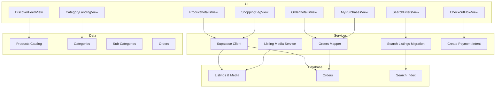
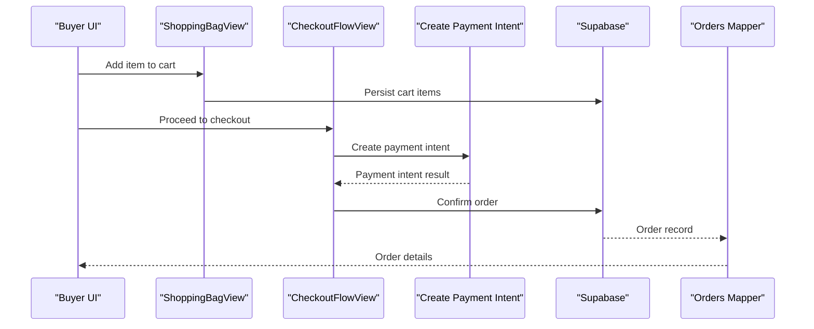
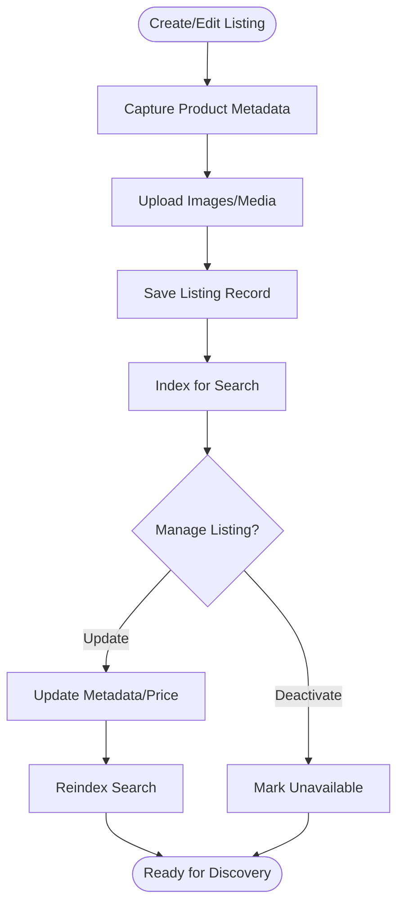
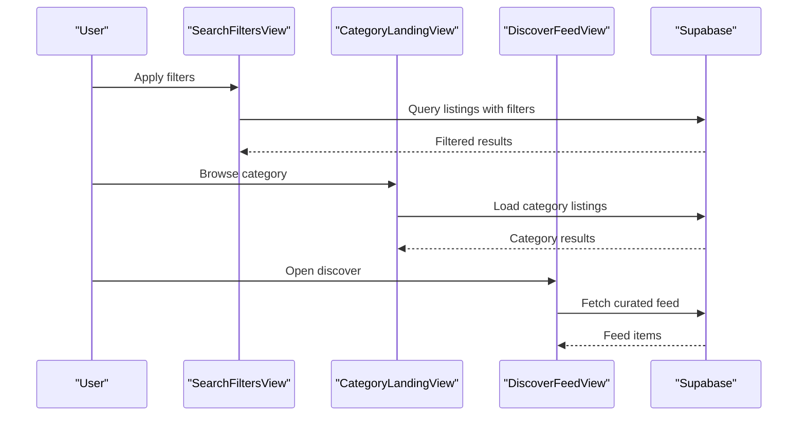
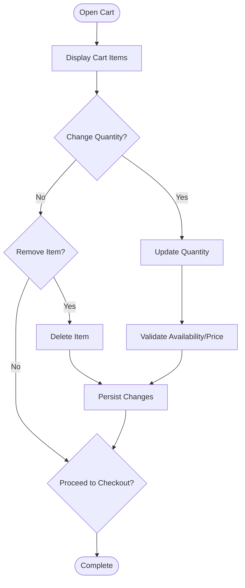
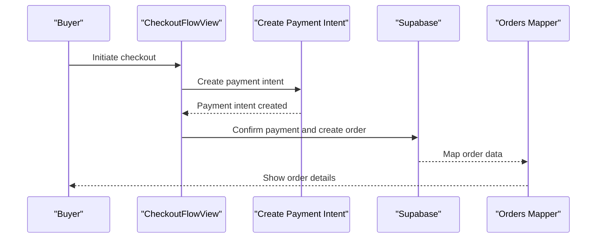
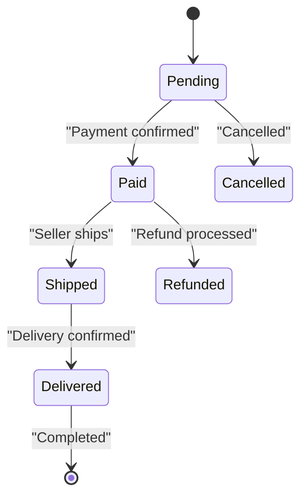
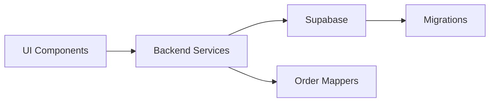

# Marketplace Core

<cite>
**Referenced Files in This Document**
- [ProductDetailsView.tsx](file://src/components/ProductDetailsView.tsx)
- [ShoppingBagView.tsx](file://src/components/ShoppingBagView.tsx)
- [CheckoutFlowView.tsx](file://src/components/CheckoutFlowView.tsx)
- [OrderDetailsView.tsx](file://src/components/OrderDetailsView.tsx)
- [MyPurchasesView.tsx](file://src/components/MyPurchasesView.tsx)
- [SearchFiltersView.tsx](file://src/components/SearchFiltersView.tsx)
- [CategoryLandingView.tsx](file://src/components/CategoryLandingView.tsx)
- [DiscoverFeedView.tsx](file://src/components/DiscoverFeedView.tsx)
- [listing-media-service.test.ts](file://src/services/backend/listing-media-service.test.ts)
- [search-listings-migration.test.ts](file://src/services/backend/search-listings-migration.test.ts)
- [orders-migration.test.ts](file://src/services/backend/orders-migration.test.ts)
- [create-payment-intent.test.ts](file://src/services/backend/create-payment-intent.test.ts)
- [mappers-orders.ts](file://src/services/backend/mappers-orders.ts)
- [supabase.ts](file://src/services/backend/supabase.ts)
- [index.ts](file://src/services/backend/index.ts)
- [products.ts](file://src/data/products.ts)
- [categories.ts](file://src/data/categories.ts)
- [sub-categories.ts](file://src/data/sub-categories.ts)
- [orders.ts](file://src/data/orders.ts)
- [202607150003_phase_3_listing_media.sql](file://supabase/migrations/202607150003_phase_3_listing_media.sql)
- [202607150006_phase_3_orders.sql](file://supabase/migrations/202607150006_phase_3_orders.sql)
- [202608160429_u3_search_listings.sql](file://supabase/migrations/202608160429_u3_search_listings.sql)
</cite>

## Table of Contents
1. Introduction
2. Project Structure
3. Core Components
4. Architecture Overview
5. Detailed Component Analysis
6. Dependency Analysis
7. Performance Considerations
8. Troubleshooting Guide
9. Conclusion

## Introduction
This document explains the core marketplace functionality of Mooday, focusing on product listings, search and discovery, shopping cart, checkout, orders, inventory tracking, pricing strategies, categorization, image handling, metadata management, and search optimization. It also covers buyer and seller workflows and integration points with payment processing.

## Project Structure
Mooday organizes marketplace features across UI components, services, data fixtures, and database migrations:
- UI components handle user interactions for browsing, searching, cart, checkout, and order management.
- Services encapsulate backend interactions, including media handling, search indexing, and order mapping.
- Data fixtures provide sample catalogs, categories, and orders for development and testing.
- Database migrations define persistent structures for listings, media, orders, and search indexes.

**Diagram sources**
- [ProductDetailsView.tsx](file://src/components/ProductDetailsView.tsx)
- [ShoppingBagView.tsx](file://src/components/ShoppingBagView.tsx)
- [CheckoutFlowView.tsx](file://src/components/CheckoutFlowView.tsx)
- [OrderDetailsView.tsx](file://src/components/OrderDetailsView.tsx)
- [MyPurchasesView.tsx](file://src/components/MyPurchasesView.tsx)
- [SearchFiltersView.tsx](file://src/components/SearchFiltersView.tsx)
- [CategoryLandingView.tsx](file://src/components/CategoryLandingView.tsx)
- [DiscoverFeedView.tsx](file://src/components/DiscoverFeedView.tsx)
- [supabase.ts](file://src/services/backend/supabase.ts)
- [listing-media-service.test.ts](file://src/services/backend/listing-media-service.test.ts)
- [search-listings-migration.test.ts](file://src/services/backend/search-listings-migration.test.ts)
- [mappers-orders.ts](file://src/services/backend/mappers-orders.ts)
- [create-payment-intent.test.ts](file://src/services/backend/create-payment-intent.test.ts)
- [products.ts](file://src/data/products.ts)
- [categories.ts](file://src/data/categories.ts)
- [sub-categories.ts](file://src/data/sub-categories.ts)
- [orders.ts](file://src/data/orders.ts)
- [202607150003_phase_3_listing_media.sql](file://supabase/migrations/202607150003_phase_3_listing_media.sql)
- [202607150006_phase_3_orders.sql](file://supabase/migrations/202607150006_phase_3_orders.sql)
- [202608160429_u3_search_listings.sql](file://supabase/migrations/202608160429_u3_search_listings.sql)

**Section sources**
- [supabase.ts](file://src/services/backend/supabase.ts)
- [index.ts](file://src/services/backend/index.ts)
- [products.ts](file://src/data/products.ts)
- [categories.ts](file://src/data/categories.ts)
- [sub-categories.ts](file://src/data/sub-categories.ts)
- [orders.ts](file://src/data/orders.ts)

## Core Components
- Product listing system: creation, editing, and management via listing forms and media handling.
- Search and discovery: filters, category landing pages, and discover feed.
- Shopping cart: add/remove items, quantity updates, and persistence.
- Checkout process: payment intent creation and completion flows.
- Order management: viewing details, purchase history, and status transitions.
- Inventory tracking and pricing: modeled through listing attributes and order records.
- Image handling and metadata: storage-backed media with searchable metadata.
- Integration points: Supabase client for data access and Stripe webhook for payments.

**Section sources**
- [listing-media-service.test.ts](file://src/services/backend/listing-media-service.test.ts)
- [search-listings-migration.test.ts](file://src/services/backend/search-listings-migration.test.ts)
- [create-payment-intent.test.ts](file://src/services/backend/create-payment-intent.test.ts)
- [mappers-orders.ts](file://src/services/backend/mappers-orders.ts)
- [supabase.ts](file://src/services/backend/supabase.ts)

## Architecture Overview
The marketplace architecture connects UI components to a backend service layer that interacts with Supabase for data and storage. Orders are mapped from backend responses into UI-friendly models. Search is optimized via a dedicated index migration. Payments integrate through a payment intent flow.

**Diagram sources**
- [ShoppingBagView.tsx](file://src/components/ShoppingBagView.tsx)
- [CheckoutFlowView.tsx](file://src/components/CheckoutFlowView.tsx)
- [create-payment-intent.test.ts](file://src/services/backend/create-payment-intent.test.ts)
- [supabase.ts](file://src/services/backend/supabase.ts)
- [mappers-orders.ts](file://src/services/backend/mappers-orders.ts)

## Detailed Component Analysis

### Product Listing System
- Creation and editing: Listing forms capture product metadata (title, description, brand, attributes), while media handlers manage images and thumbnails.
- Management: Sellers can update listings, adjust pricing, and toggle availability based on inventory state.
- Metadata and search: Listing metadata is indexed to support fast search and filtering.

**Diagram sources**
- [listing-media-service.test.ts](file://src/services/backend/listing-media-service.test.ts)
- [search-listings-migration.test.ts](file://src/services/backend/search-listings-migration.test.ts)
- [202607150003_phase_3_listing_media.sql](file://supabase/migrations/202607150003_phase_3_listing_media.sql)
- [202608160429_u3_search_listings.sql](file://supabase/migrations/202608160429_u3_search_listings.sql)

**Section sources**
- [listing-media-service.test.ts](file://src/services/backend/listing-media-service.test.ts)
- [search-listings-migration.test.ts](file://src/services/backend/search-listings-migration.test.ts)
- [202607150003_phase_3_listing_media.sql](file://supabase/migrations/202607150003_phase_3_listing_media.sql)
- [202608160429_u3_search_listings.sql](file://supabase/migrations/202608160429_u3_search_listings.sql)

### Search and Discovery
- Filters: Users refine results by category, brand, price range, and attributes.
- Category landing: Dedicated views aggregate listings per category.
- Discover feed: Curated or algorithmic feeds surface relevant products.

**Diagram sources**
- [SearchFiltersView.tsx](file://src/components/SearchFiltersView.tsx)
- [CategoryLandingView.tsx](file://src/components/CategoryLandingView.tsx)
- [DiscoverFeedView.tsx](file://src/components/DiscoverFeedView.tsx)
- [supabase.ts](file://src/services/backend/supabase.ts)

**Section sources**
- [SearchFiltersView.tsx](file://src/components/SearchFiltersView.tsx)
- [CategoryLandingView.tsx](file://src/components/CategoryLandingView.tsx)
- [DiscoverFeedView.tsx](file://src/components/DiscoverFeedView.tsx)
- [categories.ts](file://src/data/categories.ts)
- [sub-categories.ts](file://src/data/sub-categories.ts)

### Shopping Cart
- Add/remove items: Users can modify quantities and remove items.
- Persistence: Cart state is persisted to ensure continuity across sessions.
- Validation: Ensures items are available and priced correctly before checkout.

**Diagram sources**
- [ShoppingBagView.tsx](file://src/components/ShoppingBagView.tsx)
- [supabase.ts](file://src/services/backend/supabase.ts)

**Section sources**
- [ShoppingBagView.tsx](file://src/components/ShoppingBagView.tsx)

### Checkout Process
- Payment intent: Creates a secure payment session for the order total.
- Confirmation: Completes payment and finalizes order creation.
- Post-checkout: Redirects to order details and updates purchase history.

**Diagram sources**
- [CheckoutFlowView.tsx](file://src/components/CheckoutFlowView.tsx)
- [create-payment-intent.test.ts](file://src/services/backend/create-payment-intent.test.ts)
- [supabase.ts](file://src/services/backend/supabase.ts)
- [mappers-orders.ts](file://src/services/backend/mappers-orders.ts)

**Section sources**
- [CheckoutFlowView.tsx](file://src/components/CheckoutFlowView.tsx)
- [create-payment-intent.test.ts](file://src/services/backend/create-payment-intent.test.ts)
- [mappers-orders.ts](file://src/services/backend/mappers-orders.ts)

### Order Management
- Order details: View order status, items, pricing, and shipping info.
- Purchase history: Buyers see past orders; sellers may view related sales.
- Status lifecycle: Orders transition through states such as pending, paid, shipped, delivered.

**Diagram sources**
- [OrderDetailsView.tsx](file://src/components/OrderDetailsView.tsx)
- [MyPurchasesView.tsx](file://src/components/MyPurchasesView.tsx)
- [orders-migration.test.ts](file://src/services/backend/orders-migration.test.ts)
- [202607150006_phase_3_orders.sql](file://supabase/migrations/202607150006_phase_3_orders.sql)

**Section sources**
- [OrderDetailsView.tsx](file://src/components/OrderDetailsView.tsx)
- [MyPurchasesView.tsx](file://src/components/MyPurchasesView.tsx)
- [orders-migration.test.ts](file://src/services/backend/orders-migration.test.ts)
- [202607150006_phase_3_orders.sql](file://supabase/migrations/202607150006_phase_3_orders.sql)

### Inventory Tracking and Pricing Strategies
- Inventory: Listing availability reflects stock levels; purchases decrement inventory.
- Pricing: Base price, discounts, and promotions are captured in listing metadata and applied at checkout.
- Strategy examples: Tiered pricing by quantity, promotional codes, and dynamic adjustments based on demand.

**Section sources**
- [products.ts](file://src/data/products.ts)
- [orders.ts](file://src/data/orders.ts)
- [202607150006_phase_3_orders.sql](file://supabase/migrations/202607150006_phase_3_orders.sql)

### Product Categorization
- Categories and sub-categories organize listings for navigation and filtering.
- Category landing pages aggregate relevant products and enable quick discovery.

**Section sources**
- [categories.ts](file://src/data/categories.ts)
- [sub-categories.ts](file://src/data/sub-categories.ts)
- [CategoryLandingView.tsx](file://src/components/CategoryLandingView.tsx)

### Image Handling and Metadata Management
- Media storage: Images are uploaded and associated with listings; thumbnails optimize performance.
- Metadata: Titles, descriptions, brands, and attributes enhance searchability and filtering.
- Optimization: Indexed fields accelerate search queries and improve UX.

**Section sources**
- [listing-media-service.test.ts](file://src/services/backend/listing-media-service.test.ts)
- [202607150003_phase_3_listing_media.sql](file://supabase/migrations/202607150003_phase_3_listing_media.sql)
- [202608160429_u3_search_listings.sql](file://supabase/migrations/202608160429_u3_search_listings.sql)

### Search Optimization
- Indexing: Dedicated search index supports fast text and attribute-based queries.
- Filtering: Multi-criteria filters reduce result sets efficiently.
- Caching: Frontend caching reduces repeated network calls for popular searches.

**Section sources**
- [search-listings-migration.test.ts](file://src/services/backend/search-listings-migration.test.ts)
- [202608160429_u3_search_listings.sql](file://supabase/migrations/202608160429_u3_search_listings.sql)

## Dependency Analysis
Mooday’s marketplace relies on a clear separation between UI, services, and data layers:
- UI components depend on services for data operations and state synchronization.
- Services abstract Supabase interactions and map backend responses to UI models.
- Migrations define schema constraints and indexes critical for performance and correctness.

**Diagram sources**
- [supabase.ts](file://src/services/backend/supabase.ts)
- [index.ts](file://src/services/backend/index.ts)
- [mappers-orders.ts](file://src/services/backend/mappers-orders.ts)
- [202607150006_phase_3_orders.sql](file://supabase/migrations/202607150006_phase_3_orders.sql)

**Section sources**
- [supabase.ts](file://src/services/backend/supabase.ts)
- [index.ts](file://src/services/backend/index.ts)
- [mappers-orders.ts](file://src/services/backend/mappers-orders.ts)

## Performance Considerations
- Use indexed search fields to minimize query latency.
- Optimize images with appropriate sizes and lazy loading.
- Cache frequently accessed listings and categories to reduce server load.
- Batch updates for cart and order operations where possible.

[No sources needed since this section provides general guidance]

## Troubleshooting Guide
- Payment failures: Verify payment intent creation and webhook handling; check error logs for invalid amounts or currency mismatches.
- Search issues: Ensure search index is up-to-date after listing changes; validate filter parameters.
- Order mapping errors: Confirm field mappings align with backend schema; inspect order records for missing data.
- Media upload problems: Check storage permissions and file size limits; verify thumbnail generation.

**Section sources**
- [create-payment-intent.test.ts](file://src/services/backend/create-payment-intent.test.ts)
- [search-listings-migration.test.ts](file://src/services/backend/search-listings-migration.test.ts)
- [mappers-orders.ts](file://src/services/backend/mappers-orders.ts)
- [listing-media-service.test.ts](file://src/services/backend/listing-media-service.test.ts)

## Conclusion
Mooday’s marketplace core integrates robust listing management, efficient search and discovery, a reliable cart and checkout flow, and comprehensive order management. The architecture emphasizes clear separation of concerns, strong data modeling via migrations, and performance-oriented search indexing. Buyers and sellers benefit from streamlined workflows, while developers have well-defined integration points for payments and data operations.

[No sources needed since this section summarizes without analyzing specific files]