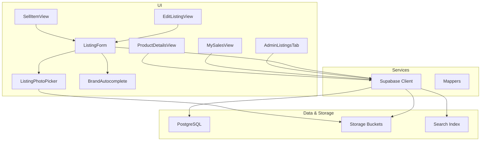
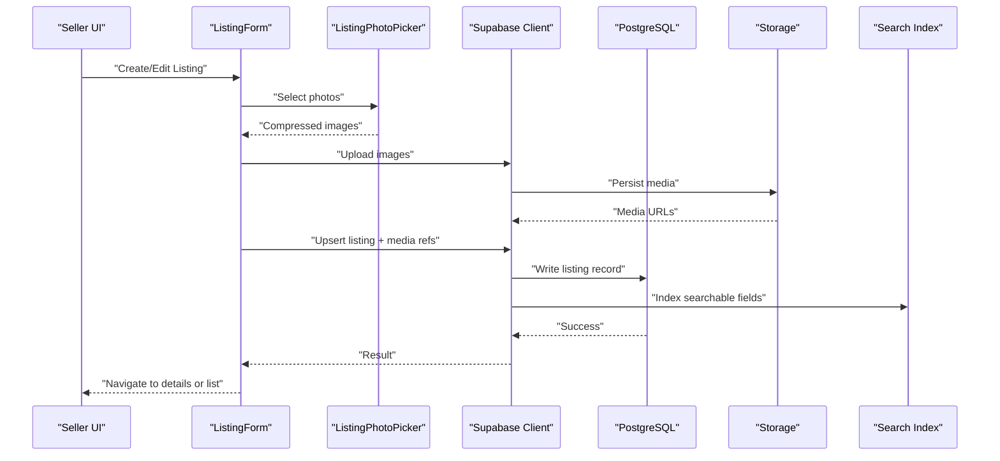
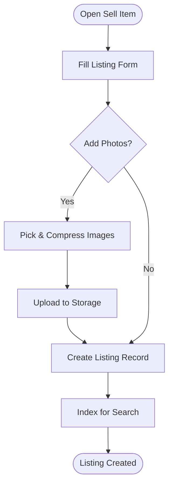
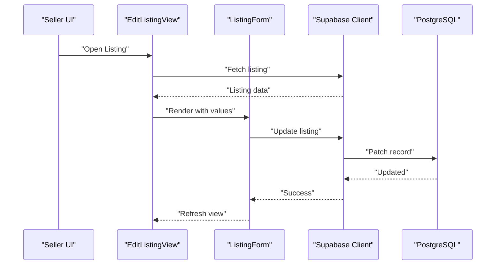
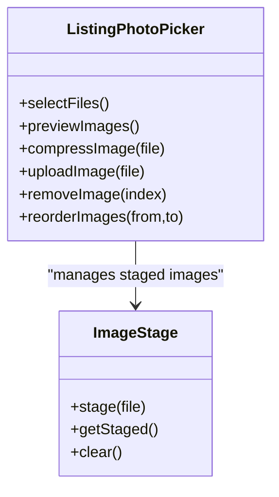
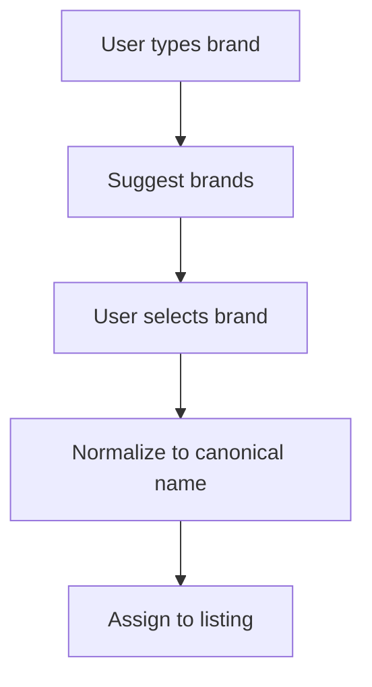
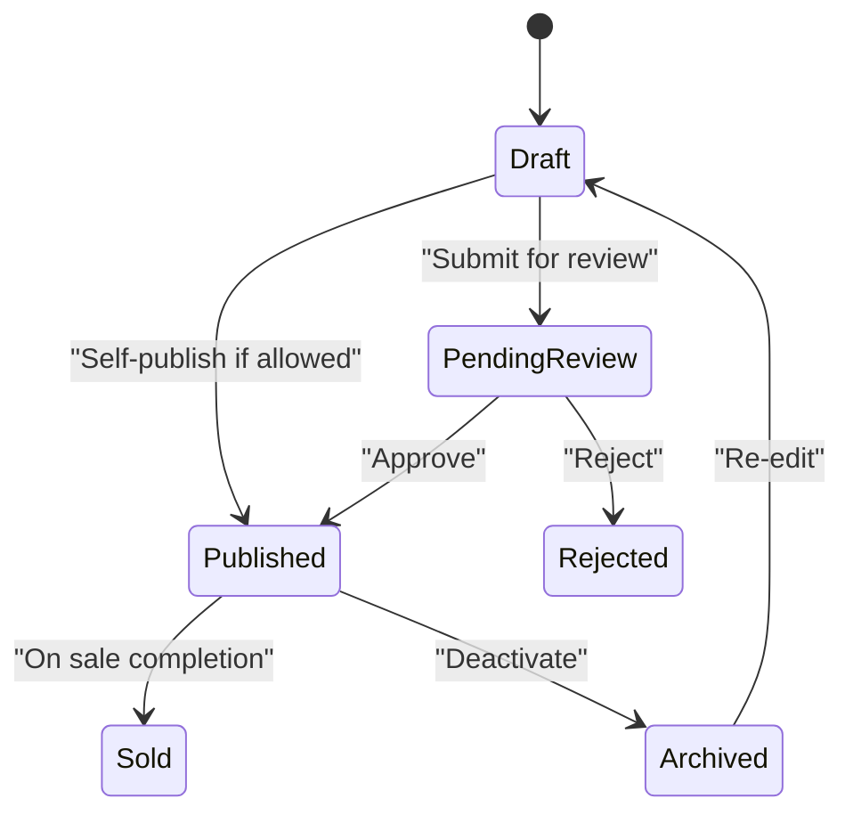
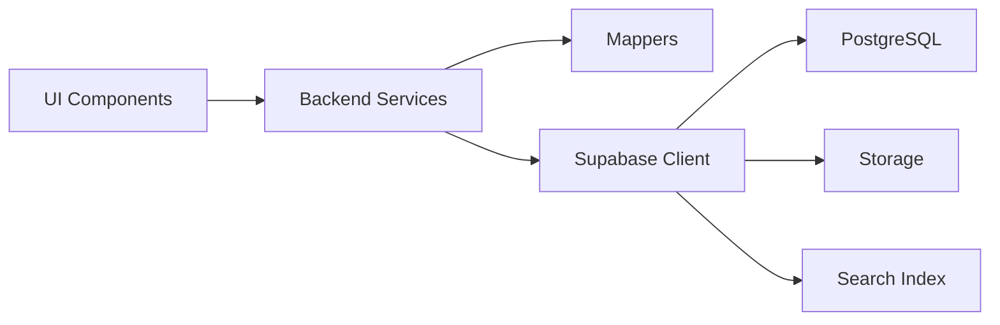

# Product Listings Management

<cite>
**Referenced Files in This Document**
- [ListingForm.tsx](file://src/components/listing/ListingForm.tsx)
- [ListingPhotoPicker.tsx](file://src/components/listing/ListingPhotoPicker.tsx)
- [BrandAutocomplete.tsx](file://src/components/listing/BrandAutocomplete.tsx)
- [SellItemView.tsx](file://src/components/SellItemView.tsx)
- [EditListingView.tsx](file://src/components/EditListingView.tsx)
- [ProductDetailsView.tsx](file://src/components/ProductDetailsView.tsx)
- [MySalesView.tsx](file://src/components/MySalesView.tsx)
- [AdminListingsTab.tsx](file://src/components/admin/AdminListingsTab.tsx)
- [imageStage.ts](file://src/lib/imageStage.ts)
- [imageStage.test.ts](file://src/lib/imageStage.test.ts)
- [supabase.ts](file://src/services/backend/supabase.ts)
- [listings-migration.test.ts](file://src/services/backend/listings-migration.test.ts)
- [listing-media-service.test.ts](file://src/services/backend/listing-media-service.test.ts)
- [search-listings-migration.sql](file://supabase/migrations/202608160429_u3_search_listings.sql)
- [phase_3_listings.sql](file://supabase/migrations/202607150002_phase_3_listings.sql)
- [phase_3_listing_media.sql](file://supabase/migrations/202607150003_phase_3_listing_media.sql)
- [categories.ts](file://src/data/categories.ts)
- [premium-brands.ts](file://src/data/premium-brands.ts)
- [mappers.ts](file://src/services/backend/mappers.ts)
- [AppContext.tsx](file://src/context/AppContext.tsx)
</cite>

## Table of Contents
1. [Introduction](#introduction)
2. [Project Structure](#project-structure)
3. [Core Components](#core-components)
4. [Architecture Overview](#architecture-overview)
5. [Detailed Component Analysis](#detailed-component-analysis)
6. [Dependency Analysis](#dependency-analysis)
7. [Performance Considerations](#performance-considerations)
8. [Troubleshooting Guide](#troubleshooting-guide)
9. [Conclusion](#conclusion)

## Introduction
This document explains the product listings management system in the Mooday marketplace. It covers how buyers and sellers create, edit, and manage listings; how listing forms are composed (photos, brand selection, categories, pricing); how images are picked, compressed, and stored; and how validation, approval workflows, moderation, SEO, search indexing, and performance considerations are implemented.

## Project Structure
The listings feature spans UI components, services, data sources, and database migrations:
- UI for creating/editing listings and viewing details
- Image handling utilities and storage integration
- Backend service layer and mappers
- Database schema and search index migration
- Admin tools for moderation and status management

**Diagram sources**
- [SellItemView.tsx](file://src/components/SellItemView.tsx)
- [ListingForm.tsx](file://src/components/listing/ListingForm.tsx)
- [ListingPhotoPicker.tsx](file://src/components/listing/ListingPhotoPicker.tsx)
- [BrandAutocomplete.tsx](file://src/components/listing/BrandAutocomplete.tsx)
- [EditListingView.tsx](file://src/components/EditListingView.tsx)
- [ProductDetailsView.tsx](file://src/components/ProductDetailsView.tsx)
- [MySalesView.tsx](file://src/components/MySalesView.tsx)
- [AdminListingsTab.tsx](file://src/components/admin/AdminListingsTab.tsx)
- [supabase.ts](file://src/services/backend/supabase.ts)
- [mappers.ts](file://src/services/backend/mappers.ts)

**Section sources**
- [SellItemView.tsx](file://src/components/SellItemView.tsx)
- [ListingForm.tsx](file://src/components/listing/ListingForm.tsx)
- [ListingPhotoPicker.tsx](file://src/components/listing/ListingPhotoPicker.tsx)
- [BrandAutocomplete.tsx](file://src/components/listing/BrandAutocomplete.tsx)
- [EditListingView.tsx](file://src/components/EditListingView.tsx)
- [ProductDetailsView.tsx](file://src/components/ProductDetailsView.tsx)
- [MySalesView.tsx](file://src/components/MySalesView.tsx)
- [AdminListingsTab.tsx](file://src/components/admin/AdminListingsTab.tsx)
- [supabase.ts](file://src/services/backend/supabase.ts)
- [mappers.ts](file://src/services/backend/mappers.ts)

## Core Components
- Listing creation and editing flows are driven by a unified form component that orchestrates photo upload, brand/category selection, and pricing configuration.
- The photo picker provides multi-select, preview, reorder, and compression before uploading to storage.
- Brand autocomplete integrates with curated brand lists to ensure consistent metadata.
- Views coordinate user journeys: selling flow, editing existing listings, browsing details, managing sales, and admin moderation.

Key responsibilities:
- ListingForm: validates inputs, composes payload, triggers media uploads, persists listing via backend service.
- ListingPhotoPicker: manages image selection, previews, compression, and upload progress.
- BrandAutocomplete: suggests brands from a curated dataset and enforces canonical brand names.
- SellItemView/EditListingView: route-level orchestration, state binding, and error handling.
- ProductDetailsView: reads listing and media, renders rich detail page for buyers.
- MySalesView: seller’s listing management dashboard with status actions.
- AdminListingsTab: moderation, status transitions, and bulk operations.

**Section sources**
- [ListingForm.tsx](file://src/components/listing/ListingForm.tsx)
- [ListingPhotoPicker.tsx](file://src/components/listing/ListingPhotoPicker.tsx)
- [BrandAutocomplete.tsx](file://src/components/listing/BrandAutocomplete.tsx)
- [SellItemView.tsx](file://src/components/SellItemView.tsx)
- [EditListingView.tsx](file://src/components/EditListingView.tsx)
- [ProductDetailsView.tsx](file://src/components/ProductDetailsView.tsx)
- [MySalesView.tsx](file://src/components/MySalesView.tsx)
- [AdminListingsTab.tsx](file://src/components/admin/AdminListingsTab.tsx)

## Architecture Overview
The listings architecture follows a layered approach:
- UI Layer: React components handle user interactions and local state.
- Service Layer: Supabase client abstracts database and storage operations; mappers normalize payloads.
- Data Layer: PostgreSQL stores listings and media references; storage buckets hold images; search index supports discovery.

**Diagram sources**
- [ListingForm.tsx](file://src/components/listing/ListingForm.tsx)
- [ListingPhotoPicker.tsx](file://src/components/listing/ListingPhotoPicker.tsx)
- [supabase.ts](file://src/services/backend/supabase.ts)
- [mappers.ts](file://src/services/backend/mappers.ts)
- [search-listings-migration.sql](file://supabase/migrations/202608160429_u3_search_listings.sql)

## Detailed Component Analysis

### Listing Creation Flow (Seller)
- Entry point: SellItemView initiates the creation journey.
- Form: ListingForm collects title, description, brand, category, attributes, price, condition, shipping options, and visibility settings.
- Photos: ListingPhotoPicker handles multi-select, preview, reordering, and compression before upload.
- Persistence: On submit, the form calls the backend service to persist listing and media references, then updates search index.

**Diagram sources**
- [SellItemView.tsx](file://src/components/SellItemView.tsx)
- [ListingForm.tsx](file://src/components/listing/ListingForm.tsx)
- [ListingPhotoPicker.tsx](file://src/components/listing/ListingPhotoPicker.tsx)
- [supabase.ts](file://src/services/backend/supabase.ts)

**Section sources**
- [SellItemView.tsx](file://src/components/SellItemView.tsx)
- [ListingForm.tsx](file://src/components/listing/ListingForm.tsx)
- [ListingPhotoPicker.tsx](file://src/components/listing/ListingPhotoPicker.tsx)
- [supabase.ts](file://src/services/backend/supabase.ts)

### Listing Editing Flow
- EditListingView loads an existing listing and pre-fills the form.
- Changes are validated and persisted similarly to creation, including media updates.
- Status changes can be initiated by sellers where allowed.

**Diagram sources**
- [EditListingView.tsx](file://src/components/EditListingView.tsx)
- [ListingForm.tsx](file://src/components/listing/ListingForm.tsx)
- [supabase.ts](file://src/services/backend/supabase.ts)

**Section sources**
- [EditListingView.tsx](file://src/components/EditListingView.tsx)
- [ListingForm.tsx](file://src/components/listing/ListingForm.tsx)
- [supabase.ts](file://src/services/backend/supabase.ts)

### Photo Handling System
- Selection: Multi-select with preview and reorder.
- Compression: Local compression reduces file size while preserving quality.
- Upload: Images are uploaded to storage; URLs are captured and linked to listings.
- Validation: File type, size limits, and safe naming enforced.

**Diagram sources**
- [ListingPhotoPicker.tsx](file://src/components/listing/ListingPhotoPicker.tsx)
- [imageStage.ts](file://src/lib/imageStage.ts)

**Section sources**
- [ListingPhotoPicker.tsx](file://src/components/listing/ListingPhotoPicker.tsx)
- [imageStage.ts](file://src/lib/imageStage.ts)
- [imageStage.test.ts](file://src/lib/imageStage.test.ts)

### Brand and Category Assignment
- BrandAutocomplete integrates with curated premium brands to standardize brand metadata.
- Categories provide hierarchical classification for discoverability and filtering.

**Diagram sources**
- [BrandAutocomplete.tsx](file://src/components/listing/BrandAutocomplete.tsx)
- [premium-brands.ts](file://src/data/premium-brands.ts)
- [categories.ts](file://src/data/categories.ts)

**Section sources**
- [BrandAutocomplete.tsx](file://src/components/listing/BrandAutocomplete.tsx)
- [premium-brands.ts](file://src/data/premium-brands.ts)
- [categories.ts](file://src/data/categories.ts)

### Pricing Configuration
- Pricing fields include base price, currency, discounts, and shipping cost.
- Validation ensures numeric ranges, currency consistency, and logical discount rules.
- Mappers normalize pricing into the expected backend format.

**Section sources**
- [ListingForm.tsx](file://src/components/listing/ListingForm.tsx)
- [mappers.ts](file://src/services/backend/mappers.ts)

### Listing Validation and Approval Workflows
- Client-side validation checks required fields, formats, and business rules.
- Server-side validation and RLS policies enforce integrity and access control.
- Initial listing status is set according to policy; approvals may require admin action depending on configuration.

**Diagram sources**
- [phase_3_listings.sql](file://supabase/migrations/202607150002_phase_3_listings.sql)
- [AdminListingsTab.tsx](file://src/components/admin/AdminListingsTab.tsx)

**Section sources**
- [phase_3_listings.sql](file://supabase/migrations/202607150002_phase_3_listings.sql)
- [AdminListingsTab.tsx](file://src/components/admin/AdminListingsTab.tsx)

### Moderation and Admin Operations
- AdminListingsTab enables moderation actions: approve, reject, archive, and bulk updates.
- Audit logs and notifications can be triggered upon status changes.

**Section sources**
- [AdminListingsTab.tsx](file://src/components/admin/AdminListingsTab.tsx)

### Buyer Perspective: Viewing Listings
- ProductDetailsView displays listing details, photos, pricing, and seller info.
- Fetches data via backend service and maps to UI models.

**Section sources**
- [ProductDetailsView.tsx](file://src/components/ProductDetailsView.tsx)
- [mappers.ts](file://src/services/backend/mappers.ts)

### Seller Dashboard: Managing Listings
- MySalesView shows the seller’s listings with status, actions (edit, relist, archive), and metrics.

**Section sources**
- [MySalesView.tsx](file://src/components/MySalesView.tsx)

## Dependency Analysis
- UI components depend on services for data persistence and storage.
- Services depend on Supabase client for DB and storage operations.
- Mappers transform between UI models and DB schemas.
- Database migrations define schema, constraints, and search indexes.

**Diagram sources**
- [supabase.ts](file://src/services/backend/supabase.ts)
- [mappers.ts](file://src/services/backend/mappers.ts)
- [phase_3_listings.sql](file://supabase/migrations/202607150002_phase_3_listings.sql)
- [phase_3_listing_media.sql](file://supabase/migrations/202607150003_phase_3_listing_media.sql)
- [search-listings-migration.sql](file://supabase/migrations/202608160429_u3_search_listings.sql)

**Section sources**
- [supabase.ts](file://src/services/backend/supabase.ts)
- [mappers.ts](file://src/services/backend/mappers.ts)
- [phase_3_listings.sql](file://supabase/migrations/202607150002_phase_3_listings.sql)
- [phase_3_listing_media.sql](file://supabase/migrations/202607150003_phase_3_listing_media.sql)
- [search-listings-migration.sql](file://supabase/migrations/202608160429_u3_search_listings.sql)

## Performance Considerations
- Image compression reduces upload time and storage costs; staged processing avoids blocking UI.
- Batched uploads and optimistic UI updates improve perceived performance.
- Search indexing should be incremental and idempotent to avoid duplicate work.
- Pagination and selective field fetching reduce payload sizes for listing feeds.
- Caching strategies at the app level can reduce repeated reads for popular listings.

[No sources needed since this section provides general guidance]

## Troubleshooting Guide
Common issues and resolutions:
- Photo upload failures: Check file size/type limits and network connectivity; retry logic should be in place.
- Invalid listing data: Validate required fields and formats; surface clear errors to users.
- Approval delays: Confirm pending review status and notify sellers; admins can expedite reviews.
- Search not updating: Ensure indexing runs after successful listing updates; verify search index entries.

Operational hooks:
- Use AppContext for global error handling and user feedback.
- Leverage tests for image staging and listing/media migrations to catch regressions early.

**Section sources**
- [AppContext.tsx](file://src/context/AppContext.tsx)
- [imageStage.test.ts](file://src/lib/imageStage.test.ts)
- [listings-migration.test.ts](file://src/services/backend/listings-migration.test.ts)
- [listing-media-service.test.ts](file://src/services/backend/listing-media-service.test.ts)

## Conclusion
The listings management system provides a robust, user-friendly workflow for sellers to create and manage listings, and for buyers to discover and purchase items. It combines intuitive UI components, reliable image handling, strong validation, and scalable backend services. Admin tools support moderation and operational needs, while search indexing and performance optimizations ensure a smooth experience at scale.